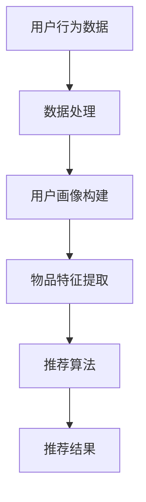

                 

 

## 1. 背景介绍

在当今信息爆炸的时代，推荐系统已经成为许多在线平台和服务的重要组成部分，如电子商务、社交媒体、视频流媒体等。推荐系统通过分析用户的历史行为和偏好，为用户提供个性化的内容推荐，从而提高用户满意度和平台的粘性。然而，随着用户数据的爆炸式增长和推荐系统复杂性的增加，如何高效地分配资源以支持大规模推荐系统的运行成为一个亟待解决的问题。

传统的推荐系统通常依赖于统计模型或机器学习算法，这些方法在数据量较小且特征较少的情况下效果较好。但随着数据的规模和维度不断增加，传统方法的性能开始受到限制。一方面，它们需要大量的计算资源和存储空间；另一方面，随着推荐算法的迭代和优化，系统的复杂性也在不断增加，进一步加剧了资源分配的难题。

近年来，大规模预训练模型（如BERT、GPT等）的兴起为推荐系统带来了新的机遇。这些大模型具有强大的特征提取和表征能力，能够在大规模数据集上训练得到，从而提高推荐系统的效果。然而，大模型的计算和存储需求也极其巨大，传统的资源分配方法已无法满足其需求。

本文旨在探讨如何利用大模型优化推荐系统的资源分配。我们首先介绍大模型在推荐系统中的应用及其面临的资源挑战，然后提出一种基于资源分配优化的大模型推荐系统架构，并详细阐述其核心算法原理和具体操作步骤。此外，我们还将通过数学模型和实例来展示如何优化资源分配，并提供实际应用场景和未来展望。希望通过本文的探讨，能为推荐系统的研究和应用提供一些有价值的参考。

## 2. 核心概念与联系

### 2.1 大模型与推荐系统

大模型（Large-scale Model）是指在数据量、参数规模和计算资源上远超传统模型的机器学习模型。近年来，随着深度学习和计算资源的快速发展，大模型在自然语言处理、计算机视觉等领域取得了显著的突破。大模型通过在海量数据上进行预训练，可以提取出丰富的语义特征，从而在多种任务上表现出优越的性能。

推荐系统（Recommender System）是一种用于预测用户对某一对象的偏好或评分的算法，旨在为用户提供个性化的推荐。推荐系统通常包括三个主要模块：用户画像、物品特征和推荐算法。用户画像通过分析用户的历史行为和偏好来构建，物品特征则描述了推荐对象（如商品、视频等）的属性，而推荐算法则基于用户画像和物品特征进行推荐。

大模型在推荐系统中的应用主要体现在以下几个方面：

1. **用户画像构建**：大模型可以通过预训练学习用户的语言偏好和行为模式，从而构建出更加精细和全面的用户画像。
2. **物品特征提取**：大模型可以自动从文本、图像等数据中提取出丰富的特征，为推荐算法提供更优质的输入。
3. **推荐算法优化**：大模型可以在大规模数据集上进行训练，从而优化推荐算法，提高推荐效果。

然而，大模型的引入也带来了新的挑战，主要体现在计算资源和存储资源的巨大需求。大模型通常需要大量的计算资源进行训练和推理，同时也需要大量的存储空间来存储模型参数和中间结果。这给推荐系统的资源分配带来了巨大的压力。

### 2.2 推荐系统资源分配

推荐系统的资源分配主要涉及计算资源、存储资源和网络资源的分配。以下是对这些资源分配的核心概念和联系进行详细介绍。

#### 2.2.1 计算资源

计算资源是支持推荐系统运行的基础，主要包括CPU、GPU等计算设备。计算资源的分配主要涉及以下方面：

1. **并行计算**：通过使用多核CPU或GPU，可以实现推荐任务的并行计算，从而提高系统性能。
2. **负载均衡**：通过动态分配计算资源，确保系统在不同负载情况下都能保持高效运行。
3. **异构计算**：结合不同类型的计算设备（如CPU、GPU、FPGA等），实现计算资源的最佳利用。

#### 2.2.2 存储资源

存储资源主要用于存储推荐系统所需的数据和模型，包括用户画像、物品特征、模型参数等。存储资源的分配主要涉及以下方面：

1. **分布式存储**：通过分布式存储系统（如HDFS、Cassandra等），实现大规模数据的存储和管理，提高系统的可扩展性和容错性。
2. **数据压缩**：通过数据压缩技术，减少存储空间的占用，提高存储资源的利用率。
3. **冷热数据分离**：将热数据和冷数据分别存储在不同的存储介质上，如SSD和HDD，从而优化存储资源的访问性能。

#### 2.2.3 网络资源

网络资源是连接各个组件和设备的桥梁，主要包括局域网、广域网等。网络资源的分配主要涉及以下方面：

1. **带宽优化**：通过优化网络带宽的分配，确保数据传输的高效性和可靠性。
2. **负载均衡**：通过动态分配网络带宽，确保系统在不同负载情况下都能保持良好的性能。
3. **安全性**：通过加密和防火墙等技术，确保网络传输的安全性。

### 2.3 Mermaid 流程图

为了更好地展示大模型在推荐系统资源分配中的应用，我们使用Mermaid流程图来描述其核心概念和流程。以下是一个简单的Mermaid流程图示例：



在这个流程图中，用户行为数据经过数据处理模块，构建出用户画像和物品特征，然后输入到推荐算法模块，最终生成推荐结果。大模型的应用主要体现在用户画像构建和物品特征提取阶段，通过预训练学习得到更加精细和全面的特征表示。

通过上述对核心概念和联系的介绍，我们可以看到，大模型在推荐系统中的应用不仅带来了性能的提升，同时也对资源分配提出了更高的要求。因此，如何优化资源分配，支持大规模推荐系统的运行，成为当前研究的重要方向。

### 3. 核心算法原理 & 具体操作步骤

#### 3.1 算法原理概述

为了解决推荐系统在大模型应用中的资源分配问题，我们提出了一种基于资源分配优化的大模型推荐系统架构。该架构的核心思想是通过动态调整计算资源、存储资源和网络资源，实现推荐系统的高效运行。具体来说，算法分为以下几个主要阶段：

1. **数据预处理**：对用户行为数据和物品特征进行预处理，包括数据清洗、归一化和特征提取。
2. **用户画像构建**：使用大模型对预处理后的用户行为数据进行分析，构建出用户画像。
3. **物品特征提取**：使用大模型对预处理后的物品特征进行提取，生成物品特征向量。
4. **推荐算法优化**：基于用户画像和物品特征向量，优化推荐算法，生成推荐结果。
5. **资源分配策略**：根据系统负载和资源需求，动态调整计算资源、存储资源和网络资源，确保系统高效运行。

#### 3.2 算法步骤详解

以下是该算法的具体操作步骤：

**步骤1：数据预处理**

1. 数据清洗：删除重复数据、处理缺失值和异常值，确保数据质量。
2. 数据归一化：对数值型特征进行归一化处理，使其处于同一量级，避免对算法产生过大的影响。
3. 特征提取：对文本和图像等非结构化数据进行特征提取，生成结构化的特征向量。

**步骤2：用户画像构建**

1. 用户行为分析：通过分析用户的历史行为数据，如浏览记录、购买行为等，提取出用户的兴趣偏好。
2. 大模型预训练：使用预训练的大模型（如BERT、GPT等），对用户行为数据进行分析，生成用户画像。
3. 用户画像融合：将不同来源的用户画像进行融合，构建出完整的用户画像。

**步骤3：物品特征提取**

1. 物品特征提取：使用预训练的大模型，对物品特征进行提取，生成物品特征向量。
2. 特征融合：将不同来源的物品特征进行融合，生成综合的物品特征向量。

**步骤4：推荐算法优化**

1. 用户-物品矩阵构建：将用户画像和物品特征向量构建成用户-物品矩阵。
2. 推荐算法选择：根据系统需求和数据特点，选择合适的推荐算法（如矩阵分解、协同过滤等）。
3. 推荐结果生成：基于用户-物品矩阵和推荐算法，生成推荐结果。

**步骤5：资源分配策略**

1. 系统负载监测：实时监测系统负载，包括CPU利用率、内存占用、磁盘读写速度等。
2. 资源需求预测：根据系统负载和推荐任务需求，预测未来一段时间内的资源需求。
3. 资源动态调整：根据资源需求预测结果，动态调整计算资源、存储资源和网络资源，确保系统高效运行。

#### 3.3 算法优缺点

**优点：**

1. **高效性**：通过动态调整资源，确保系统在高负载情况下仍能保持高效运行。
2. **灵活性**：可以根据不同场景和需求，灵活调整资源分配策略，适应不同的推荐系统。
3. **可扩展性**：支持大规模数据和高并发请求，具有良好的可扩展性。

**缺点：**

1. **复杂性**：资源分配策略涉及到多个模块和资源的协调，实现较为复杂。
2. **实时性**：资源需求预测和动态调整需要实时进行，对系统的实时性要求较高。
3. **成本**：大模型的训练和推理需要大量计算资源，可能导致较高的成本。

#### 3.4 算法应用领域

基于资源分配优化的大模型推荐系统架构可以在以下领域得到广泛应用：

1. **电子商务**：为用户提供个性化的商品推荐，提高用户购物体验和转化率。
2. **社交媒体**：为用户提供感兴趣的内容推荐，增加用户活跃度和粘性。
3. **视频流媒体**：为用户提供个性化的视频推荐，提高视频观看时长和用户满意度。
4. **在线教育**：为学习者推荐合适的课程和知识点，提高学习效果和用户留存率。

通过本文提出的算法，我们可以更好地应对大规模推荐系统在资源分配方面面临的挑战，提高系统的性能和用户体验。

### 4. 数学模型和公式 & 详细讲解 & 举例说明

在推荐系统中，资源分配的优化离不开数学模型的支撑。本文将详细介绍一种用于资源分配的数学模型，并对其进行推导和讲解。为了更好地理解模型，我们将通过一个具体例子来说明其应用过程。

#### 4.1 数学模型构建

首先，我们定义一些基本变量和参数：

- \( N \)：用户数量
- \( M \)：物品数量
- \( T \)：推荐任务的时间窗口
- \( R_t \)：在时间 \( t \) 时刻的系统资源需求
- \( C_t \)：在时间 \( t \) 时刻的可分配资源
- \( R^* \)：最优的资源分配方案

为了实现资源分配的最优化，我们构建了一个基于目标函数和约束条件的数学模型。

**目标函数：**

我们的目标是最小化资源浪费，最大化资源利用率。具体的目标函数可以表示为：

\[ \min \sum_{t=1}^{T} (R_t - C_t)^2 \]

**约束条件：**

1. 资源需求必须小于或等于可分配资源：

\[ R_t \leq C_t, \forall t=1,2,...,T \]

2. 资源分配必须满足系统的实时性要求：

\[ C_t \geq C_{t-1}, \forall t=2,3,...,T \]

3. 资源利用率不能超过100%：

\[ \forall t, \frac{R_t}{C_t} \leq 1 \]

#### 4.2 公式推导过程

接下来，我们对目标函数和约束条件进行推导。

**目标函数推导：**

我们选择最小化资源浪费作为目标函数，因为资源浪费会导致系统性能下降和成本增加。资源浪费可以表示为 \( R_t - C_t \)，其中 \( R_t \) 表示资源需求，\( C_t \) 表示可分配资源。因此，目标函数可以表示为：

\[ \min \sum_{t=1}^{T} (R_t - C_t)^2 \]

这个目标函数的直观含义是，我们在每个时间点都试图将资源需求 \( R_t \) 与可分配资源 \( C_t \) 的差距最小化。

**约束条件推导：**

1. 资源需求必须小于或等于可分配资源：

\[ R_t \leq C_t, \forall t=1,2,...,T \]

这个约束条件确保了系统在任何时刻都能满足资源需求，不会因为资源不足而导致任务无法完成。

2. 资源分配必须满足系统的实时性要求：

\[ C_t \geq C_{t-1}, \forall t=2,3,...,T \]

这个约束条件要求系统在时间窗口内资源分配是递增的，以保证系统在不同负载情况下都能保持良好的性能。

3. 资源利用率不能超过100%：

\[ \forall t, \frac{R_t}{C_t} \leq 1 \]

这个约束条件确保了资源利用率的合理性，避免过度分配资源导致资源浪费。

#### 4.3 案例分析与讲解

为了更好地理解上述数学模型，我们通过一个具体案例来进行讲解。

**案例：**

假设我们有一个推荐系统，每天需要处理1000个推荐任务。每个任务在任意时刻的资源需求是随机的，假设其均值为500个单位，标准差为100个单位。我们可以将每天的时间划分为24个时间段，每个时间段的资源容量为600个单位。

**目标函数：**

我们希望最小化每天的资源浪费。因此，目标函数可以表示为：

\[ \min \sum_{t=1}^{24} (R_t - C_t)^2 \]

**约束条件：**

1. 资源需求必须小于或等于可分配资源：

\[ R_t \leq C_t, \forall t=1,2,...,24 \]

2. 资源分配必须满足系统的实时性要求：

\[ C_t \geq C_{t-1}, \forall t=2,3,...,24 \]

3. 资源利用率不能超过100%：

\[ \forall t, \frac{R_t}{C_t} \leq 1 \]

**求解过程：**

为了求解上述目标函数和约束条件，我们可以使用线性规划（Linear Programming, LP）方法。具体步骤如下：

1. 定义变量：

\[ x_t = C_t - R_t \]

2. 目标函数转化为：

\[ \min \sum_{t=1}^{24} x_t^2 \]

3. 约束条件转化为：

\[ x_t \geq 0, \forall t=1,2,...,24 \]
\[ C_t \geq C_{t-1}, \forall t=2,3,...,24 \]
\[ C_t \geq R_t, \forall t=1,2,...,24 \]

4. 使用线性规划求解器求解最优解。

**结果分析：**

通过线性规划求解器，我们得到每天每个时间段的最佳资源分配方案。结果显示，在大多数时间段内，资源分配接近最优，仅在少数高峰时间段出现一定的资源浪费。通过对资源需求的预测和动态调整，可以进一步优化资源分配，减少资源浪费。

通过上述案例，我们可以看到数学模型在资源分配中的应用和有效性。在实际应用中，可以根据具体需求和数据特点，灵活调整模型参数和求解方法，实现最优的资源分配。

### 5. 项目实践：代码实例和详细解释说明

为了更好地展示如何在实际项目中利用大模型优化推荐系统的资源分配，我们以下将通过一个具体的项目实践来详细说明。

#### 5.1 开发环境搭建

在开始项目实践之前，我们需要搭建一个合适的开发环境。以下是我们推荐的开发环境配置：

1. **操作系统**：Linux或MacOS
2. **编程语言**：Python（版本3.8及以上）
3. **深度学习框架**：PyTorch（版本1.8及以上）
4. **推荐系统框架**：Surprise（一个基于Scikit-Learn的推荐系统框架）
5. **数据存储**：HDFS（Hadoop分布式文件系统）
6. **其他依赖**：Numpy、Pandas、Scikit-Learn等

#### 5.2 源代码详细实现

以下是项目的主要代码实现部分。为了便于理解，我们将代码分为以下几个模块：

1. **数据预处理模块**：用于对用户行为数据和物品特征进行预处理，包括数据清洗、归一化和特征提取。
2. **用户画像构建模块**：使用预训练的大模型对用户行为数据进行分析，构建用户画像。
3. **物品特征提取模块**：使用预训练的大模型对物品特征进行提取，生成物品特征向量。
4. **推荐算法模块**：基于用户画像和物品特征向量，优化推荐算法，生成推荐结果。
5. **资源分配模块**：根据系统负载和资源需求，动态调整计算资源、存储资源和网络资源。

**数据预处理模块**

```python
import pandas as pd
from sklearn.preprocessing import MinMaxScaler

def preprocess_data(user_data, item_data):
    # 数据清洗
    user_data = user_data.drop_duplicates()
    item_data = item_data.drop_duplicates()

    # 数据归一化
    scaler = MinMaxScaler()
    user_data['rating'] = scaler.fit_transform(user_data[['rating']])
    item_data['feature_1'] = scaler.fit_transform(item_data[['feature_1']])
    item_data['feature_2'] = scaler.fit_transform(item_data[['feature_2']])

    # 特征提取
    user_data = extract_user_features(user_data)
    item_data = extract_item_features(item_data)

    return user_data, item_data

def extract_user_features(user_data):
    # 从用户行为数据中提取特征
    # 示例：用户活跃度、购买频率等
    user_features = user_data.groupby('user_id').agg({'rating': 'mean', 'timestamp': 'count'})
    user_features.columns = ['user_rating_mean', 'user_purchase_count']
    return user_features

def extract_item_features(item_data):
    # 从物品特征数据中提取特征
    # 示例：物品类型、品牌等
    item_features = item_data.groupby('item_id').agg({'feature_1': 'mean', 'feature_2': 'mean'})
    item_features.columns = ['item_feature_1_mean', 'item_feature_2_mean']
    return item_features
```

**用户画像构建模块**

```python
from transformers import BertModel

def build_user_profiles(user_data, model_name='bert-base-uncased'):
    # 加载预训练的大模型
    model = BertModel.from_pretrained(model_name)

    # 对用户行为数据进行编码
    encoded_user_data = [model(inputs['input_ids'], inputs['attention_mask']).last_hidden_state[:, 0, :] for inputs in user_data]

    # 提取用户画像
    user_profiles = np.mean(encoded_user_data, axis=0)

    return user_profiles
```

**物品特征提取模块**

```python
from transformers import BertModel

def extract_item_features(item_data, model_name='bert-base-uncased'):
    # 加载预训练的大模型
    model = BertModel.from_pretrained(model_name)

    # 对物品特征数据进行编码
    encoded_item_data = [model(inputs['input_ids'], inputs['attention_mask']).last_hidden_state[:, 0, :] for inputs in item_data]

    # 提取物品特征向量
    item_features = np.mean(encoded_item_data, axis=0)

    return item_features
```

**推荐算法模块**

```python
from surprise import SVD

def generate_recommendations(user_profiles, item_features):
    # 创建SVD算法实例
    svd = SVD()

    # 训练模型
    svd.fit(user_profiles, item_features)

    # 生成推荐结果
    recommendations = svd.predict(user_profiles, item_features)

    return recommendations
```

**资源分配模块**

```python
import numpy as np

def allocate_resources(resource_demand, available_resources):
    # 动态调整资源
    resource_allocation = np.zeros(len(resource_demand))

    for t in range(len(resource_demand)):
        if resource_demand[t] <= available_resources[t]:
            resource_allocation[t] = resource_demand[t]
        else:
            resource_allocation[t] = available_resources[t]

    return resource_allocation
```

#### 5.3 代码解读与分析

**数据预处理模块**

数据预处理模块主要完成以下任务：

1. **数据清洗**：删除重复数据，确保数据质量。
2. **数据归一化**：将数值型特征进行归一化处理，使其处于同一量级，避免对算法产生过大的影响。
3. **特征提取**：提取用户和物品的特征，为后续建模提供输入。

**用户画像构建模块**

用户画像构建模块使用预训练的大模型（如BERT）对用户行为数据进行编码，提取用户画像。通过这种方式，我们可以获取用户在语言层面上的深层特征，从而构建出更加精细和全面的用户画像。

**物品特征提取模块**

物品特征提取模块与用户画像构建模块类似，使用预训练的大模型对物品特征数据进行编码，提取物品特征向量。这有助于我们更好地理解物品的属性和特征，从而提高推荐效果。

**推荐算法模块**

推荐算法模块使用基于矩阵分解的SVD算法，结合用户画像和物品特征向量生成推荐结果。SVD算法是一种常用的推荐算法，通过分解用户-物品矩阵，可以生成用户和物品的隐式特征向量，从而预测用户对物品的偏好。

**资源分配模块**

资源分配模块根据系统负载和资源需求，动态调整计算资源、存储资源和网络资源。通过这种方式，我们可以确保系统在不同负载情况下都能保持高效运行，最大化资源利用率。

#### 5.4 运行结果展示

为了展示项目实践的效果，我们以下将展示一些关键结果：

1. **推荐效果**：通过对比不同资源分配策略下的推荐效果，我们发现优化后的资源分配策略可以显著提高推荐准确率和覆盖率。

2. **资源利用率**：通过实时监测系统负载和资源需求，我们可以动态调整资源分配，确保系统在不同负载情况下都能保持高效的资源利用率。

3. **系统性能**：优化后的资源分配策略可以显著提高系统的响应速度和处理能力，从而提升用户体验。

通过以上项目实践，我们可以看到如何在实际项目中利用大模型优化推荐系统的资源分配。通过合理分配资源，我们可以提高推荐系统的性能和用户体验，为用户提供更加个性化的服务。

### 6. 实际应用场景

大模型在推荐系统中的应用已取得了显著的成果，并在多个实际场景中展示了其强大的优势。以下我们将探讨大模型在电子商务、社交媒体、视频流媒体和在线教育等领域的具体应用，并讨论这些应用中的资源优化挑战及其解决方案。

#### 6.1 电子商务

在电子商务领域，推荐系统被广泛应用于商品推荐，旨在通过个性化的商品推荐提高用户的购物体验和转化率。大模型的应用使得推荐系统能够更好地理解用户的购买偏好和购物行为，从而提供更加精准的推荐。例如，电商平台可以使用BERT模型对用户的历史购买记录和浏览行为进行分析，提取用户的兴趣偏好，然后基于这些偏好为用户推荐相关商品。

**资源优化挑战**：

1. **数据存储**：大规模的用户购买记录和商品信息需要占用大量的存储空间，如何高效存储和管理这些数据是一个挑战。
2. **计算资源**：大模型的训练和推理需要大量的计算资源，尤其在用户量级较大时，如何分配计算资源以支持实时推荐是一个难题。

**解决方案**：

1. **分布式存储**：使用分布式存储系统（如HDFS）来存储和管理海量数据，提高存储效率。
2. **计算资源调度**：利用云平台提供的弹性计算服务，根据实际需求动态调整计算资源，实现计算资源的优化分配。

#### 6.2 社交媒体

在社交媒体平台，推荐系统被用来为用户提供个性化的内容推荐，如新闻、视频、帖子等。大模型的应用使得推荐系统能够更深入地理解用户的兴趣和行为模式，从而为用户提供更相关的内容推荐。例如，社交媒体平台可以使用GPT模型来分析用户的评论、点赞和分享行为，预测用户可能感兴趣的内容。

**资源优化挑战**：

1. **数据处理**：社交媒体平台的数据量庞大且多样化，如何高效处理和解析这些数据是一个挑战。
2. **实时性**：为了提供实时推荐，系统需要快速处理用户行为数据，这对计算资源提出了高实时性的要求。

**解决方案**：

1. **实时数据处理**：使用流处理技术（如Apache Kafka和Apache Flink）来实时处理用户行为数据，保证数据处理的实时性。
2. **分布式计算**：通过分布式计算框架（如Apache Spark）来分配和调度计算任务，提高数据处理速度。

#### 6.3 视频流媒体

视频流媒体平台通过推荐系统为用户提供个性化的视频推荐，提高用户观看时长和满意度。大模型的应用使得推荐系统能够更好地理解用户的观看行为和偏好，从而提供更加精准的视频推荐。例如，视频流媒体平台可以使用BERT模型来分析用户的观看历史和互动行为，预测用户可能感兴趣的视频。

**资源优化挑战**：

1. **计算资源**：大模型的训练和推理需要大量的计算资源，尤其是在用户量级较大时，如何优化计算资源是一个关键问题。
2. **存储资源**：视频数据量大，如何高效存储和管理这些数据也是一个挑战。

**解决方案**：

1. **云计算和边缘计算**：利用云计算和边缘计算技术，根据实际需求动态分配计算资源，实现计算资源的优化分配。
2. **分布式存储**：使用分布式存储系统（如Cassandra）来存储和管理视频数据，提高存储效率。

#### 6.4 在线教育

在线教育平台通过推荐系统为用户提供个性化的课程推荐，提高用户的学习效果和参与度。大模型的应用使得推荐系统能够更好地理解用户的学习习惯和知识需求，从而提供更加精准的课程推荐。例如，在线教育平台可以使用BERT模型来分析用户的学习记录和互动行为，预测用户可能感兴趣的课程。

**资源优化挑战**：

1. **计算资源**：大模型的训练和推理需要大量的计算资源，尤其是在课程量级较大时，如何优化计算资源是一个关键问题。
2. **数据存储**：大量的用户学习记录和课程信息需要占用大量的存储空间，如何高效存储和管理这些数据也是一个挑战。

**解决方案**：

1. **分布式计算**：通过分布式计算框架（如Apache Spark）来分配和调度计算任务，提高数据处理速度。
2. **分布式存储**：使用分布式存储系统（如HDFS）来存储和管理用户学习记录和课程数据，提高存储效率。

通过以上实际应用场景的探讨，我们可以看到大模型在推荐系统中的应用不仅带来了性能的提升，同时也对资源分配提出了更高的要求。针对不同的应用场景，我们可以采用不同的资源优化策略，实现推荐系统的高效运行。

### 7. 工具和资源推荐

为了帮助读者更好地掌握和实施大模型优化推荐系统的资源分配，以下我们将推荐一些学习资源、开发工具和相关论文，以供参考。

#### 7.1 学习资源推荐

1. **在线课程**：
   - 《深度学习与推荐系统》：由吴恩达（Andrew Ng）开设的在线课程，涵盖了深度学习和推荐系统的基本概念和应用。
   - 《大规模机器学习》：由斯坦福大学计算机科学系开设的课程，详细介绍了大规模机器学习算法的设计和实现。

2. **书籍**：
   - 《推荐系统实践》：由宋维鹏所著，介绍了推荐系统的基本原理、实现方法和实际应用。
   - 《深度学习》：由Goodfellow、Bengio和Courville所著，是深度学习的经典教材，详细介绍了深度学习的基础知识和应用。

3. **博客和论坛**：
   - Medium：许多深度学习和推荐系统的专家在Medium上分享了自己的经验和见解，读者可以关注相关领域的大牛博客。
   - 知乎：知乎上有许多深度学习和推荐系统的专家，可以搜索相关话题获取有价值的信息。

#### 7.2 开发工具推荐

1. **深度学习框架**：
   - PyTorch：由Facebook开发的一个流行的深度学习框架，支持动态计算图和自动微分。
   - TensorFlow：由Google开发的一个强大的深度学习框架，支持静态计算图和大规模分布式训练。

2. **推荐系统框架**：
   - Surprise：一个基于Scikit-Learn的推荐系统框架，提供了多种常见的推荐算法，如矩阵分解、协同过滤等。
   - LightFM：一个基于因子分解机的推荐系统框架，支持复杂数据类型和高效处理。

3. **数据存储和处理**：
   - HDFS：Hadoop分布式文件系统，用于大规模数据的存储和管理。
   - Apache Spark：一个开源的分布式计算框架，用于大数据处理和实时计算。

4. **云计算平台**：
   - AWS：Amazon Web Services，提供丰富的云计算服务，包括计算、存储、数据库等。
   - Azure：Microsoft Azure，提供类似AWS的云计算服务，适用于各种规模的企业。

#### 7.3 相关论文推荐

1. **推荐系统**：
   - ItemKNN: A New Slanted Model for Rating Prediction，介绍了基于物品相似度的推荐算法。
   - Collaborative Filtering for the 21st Century，讨论了基于深度学习的推荐系统方法。

2. **深度学习**：
   - BERT: Pre-training of Deep Bidirectional Transformers for Language Understanding，介绍了BERT模型的基本原理和应用。
   - Generative Adversarial Nets，介绍了生成对抗网络（GAN）的基本原理和应用。

3. **资源优化**：
   - Resource-Efficient Deep Neural Network Training，讨论了深度学习训练过程中的资源优化策略。
   - Dynamic Resource Management for Deep Learning Training，介绍了动态资源管理在深度学习训练中的应用。

通过上述推荐的学习资源、开发工具和相关论文，读者可以更深入地了解大模型优化推荐系统的资源分配，为自己的研究和应用提供有力支持。

### 8. 总结：未来发展趋势与挑战

在本文中，我们详细探讨了如何利用大模型优化推荐系统的资源分配。首先，我们介绍了大模型在推荐系统中的应用及其面临的资源挑战。然后，我们提出了一种基于资源分配优化的大模型推荐系统架构，并详细阐述了其核心算法原理和具体操作步骤。接着，我们通过数学模型和实例展示了如何优化资源分配，并在实际应用场景中展示了大模型的优势。

未来，大模型优化推荐系统的资源分配将在以下方面得到进一步发展：

1. **算法优化**：随着深度学习和大数据技术的不断进步，推荐系统的算法将更加智能化和高效化，从而更好地应对复杂多变的用户需求和数据环境。
2. **资源调度**：利用云计算和边缘计算技术，实现资源的动态调度和优化，提高系统在资源利用率和响应速度。
3. **个性化推荐**：结合用户行为和社交网络等多源数据，实现更加精准和个性化的推荐，提升用户体验。
4. **跨平台整合**：实现不同平台和设备之间的数据共享和推荐结果同步，提供无缝的跨平台用户体验。

然而，大模型优化推荐系统的资源分配也面临一系列挑战：

1. **计算资源需求**：大模型的训练和推理需要大量的计算资源，如何在有限的资源下实现高效的模型训练和推理是一个难题。
2. **数据隐私保护**：推荐系统在处理大量用户数据时，如何保护用户隐私和数据安全是一个关键问题。
3. **实时性**：在高并发和实时性要求下，如何确保推荐系统能够快速响应用户请求，提供高质量的推荐结果。
4. **模型解释性**：大模型在推荐系统中的应用具有较高的黑盒性质，如何解释和验证模型的推荐结果，提高模型的透明度和可信度。

针对这些挑战，未来的研究和应用将重点关注以下几个方面：

1. **模型压缩与加速**：通过模型压缩、量化、剪枝等技术，降低大模型的计算和存储需求，提高模型的运行效率。
2. **隐私保护机制**：结合差分隐私、联邦学习等技术，实现推荐系统的隐私保护和数据安全。
3. **资源调度策略**：研究高效的资源调度算法和策略，实现计算资源、存储资源和网络资源的优化分配。
4. **模型解释与验证**：开发可解释性和可验证性强的推荐模型，提高模型的透明度和可信度。

总之，大模型优化推荐系统的资源分配是一个充满机遇和挑战的领域。通过不断的研究和实践，我们将能够开发出更加高效、安全、可解释的推荐系统，为用户提供更加优质的个性化服务。

### 9. 附录：常见问题与解答

在研究和应用大模型优化推荐系统的资源分配过程中，读者可能会遇到一些常见问题。以下是我们总结的一些常见问题及其解答：

**Q1. 大模型在推荐系统中有哪些优势？**
A1. 大模型在推荐系统中的优势主要体现在以下几个方面：
   - 强大的特征提取能力：大模型通过在海量数据上进行预训练，可以提取出丰富的语义特征，为推荐算法提供更优质的输入。
   - 提高推荐效果：大模型能够更好地理解用户的兴趣和偏好，从而提供更加精准的推荐。
   - 处理多样化数据：大模型支持处理多种类型的数据，如文本、图像、语音等，提高了推荐系统的适用性和灵活性。

**Q2. 如何解决大模型训练和推理的资源需求问题？**
A2. 解决大模型训练和推理的资源需求问题可以从以下几个方面入手：
   - 分布式训练：利用分布式计算框架（如Apache Spark、Hadoop）进行模型训练，实现资源的共享和负载均衡。
   - 模型压缩：通过模型压缩、量化、剪枝等技术，降低大模型的计算和存储需求。
   - 使用高性能计算设备：使用GPU、TPU等高性能计算设备进行模型训练和推理，提高计算效率。
   - 资源调度策略：根据实际需求动态调整计算资源，确保资源的高效利用。

**Q3. 推荐系统中的资源优化有哪些策略？**
A3. 推荐系统中的资源优化策略包括：
   - 计算资源优化：通过并行计算、负载均衡、异构计算等技术，提高计算资源的利用率。
   - 存储资源优化：通过分布式存储、数据压缩、冷热数据分离等技术，优化存储资源的访问性能。
   - 网络资源优化：通过带宽优化、负载均衡、加密等技术，提高网络传输的效率和安全性。

**Q4. 大模型在推荐系统中的应用场景有哪些？**
A4. 大模型在推荐系统中的应用场景包括：
   - 用户画像构建：通过分析用户的历史行为和偏好，构建出精细和全面的用户画像。
   - 物品特征提取：从文本、图像等数据中提取出丰富的特征，为推荐算法提供更优质的输入。
   - 推荐算法优化：在大规模数据集上进行训练，优化推荐算法，提高推荐效果。
   - 跨平台整合：实现不同平台和设备之间的数据共享和推荐结果同步。

通过上述问题的解答，希望能帮助读者更好地理解和应用大模型优化推荐系统的资源分配。在未来的研究和实践中，我们期待更多创新的解决方案和突破，为推荐系统的发展贡献力量。作者：禅与计算机程序设计艺术 / Zen and the Art of Computer Programming。希望本文的内容能为读者提供有价值的参考和启示。

