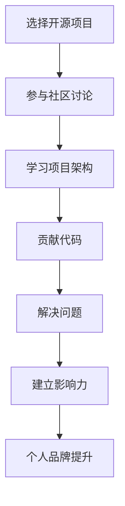

                 

 关键词：开源项目，个人影响力，技术博客，技术分享，代码示例，影响力构建，社区参与，技术影响力，开源贡献，个人品牌建设

> 摘要：本文旨在探讨如何利用开源项目来构建个人影响力。通过对开源项目的深度参与和贡献，个人可以在技术社区中建立权威，提升自身的技术能力，并最终实现个人品牌的提升。本文将结合具体的开源项目实践，详细分析从零开始构建个人影响力的步骤和方法。

## 1. 背景介绍

开源项目作为一种重要的技术协作方式，已成为现代软件开发不可或缺的一部分。开源项目不仅提供了丰富的技术资源和创新机会，也为开发者提供了一个展示自我、学习和成长的平台。在这个平台上，个人通过参与开源项目，不仅能够提升自己的技术能力，还能逐渐建立起自己的影响力。

个人影响力在技术领域的构建具有重要意义。首先，它可以帮助个人在职业发展中获得更多机会。一个具有较高影响力的开发者，往往能够吸引到更多的项目合作机会、演讲邀请和技术咨询工作。其次，个人影响力还能够提升个人的社会认可度，为未来职业发展打下坚实基础。此外，构建个人影响力也是一种个人价值的体现，能够让个人在技术社区中脱颖而出。

本文将围绕以下几个方面展开讨论：

- 如何选择合适的开源项目参与？
- 如何在开源项目中贡献代码？
- 如何利用开源项目提升个人技术水平？
- 如何通过开源项目构建个人品牌？
- 开源项目参与中的常见问题和解决方案。

## 2. 核心概念与联系

### 2.1 开源项目的定义

开源项目（Open Source Project）是指那些遵循开放源代码协议（如GPL、MIT、BSD等）的软件项目。这些项目允许任何人自由地使用、修改和分发源代码，从而促进了技术的传播和创新。开源项目的特点包括透明性、社区协作和共享精神。

### 2.2 个人影响力的定义

个人影响力（Personal Influence）是指个人在某个领域内通过其言行、作品和贡献，获得他人认可和尊重的能力。在技术领域，个人影响力通常表现为在社区中的知名度、技术能力和贡献度。

### 2.3 开源项目与个人影响力的联系

开源项目与个人影响力之间存在密切的联系。参与开源项目可以帮助个人：

- **提升技术水平**：通过学习和实践开源项目的代码，个人能够掌握更先进的技术和开发方法。
- **展示技术能力**：在开源项目中贡献代码，个人可以展示自己的技术实力，从而在社区中获得认可。
- **建立人脉**：参与开源项目，个人有机会与志同道合的开发者建立联系，扩大人脉网络。
- **构建个人品牌**：持续、高质量的贡献能够为个人建立良好的口碑，进而提升个人品牌。

### 2.4 Mermaid 流程图



## 3. 核心算法原理 & 具体操作步骤

### 3.1 算法原理概述

构建个人影响力的过程可以看作是一种“影响力算法”。该算法的核心原理包括：

- **持续学习**：通过不断学习新技术、新方法，提升个人技术水平。
- **积极参与**：在开源项目中积极参与，贡献代码和解决问题。
- **建立信任**：通过持续、高质量的贡献，建立个人在社区中的信任度。
- **品牌建设**：通过个人品牌的建设，提高个人在技术社区中的知名度。

### 3.2 算法步骤详解

#### 3.2.1 选择开源项目

选择一个适合自己的开源项目是构建个人影响力的第一步。选择标准包括：

- **项目活跃度**：选择一个活跃度较高的项目，这样可以确保有足够的资源和支持。
- **技术难度**：选择一个与自己技术能力相匹配的项目，以便能够顺利参与。
- **兴趣领域**：选择一个自己感兴趣的项目，这样能够保持持续的动力和热情。

#### 3.2.2 参与社区讨论

在开源项目中，参与社区讨论是建立影响力的重要途径。可以通过以下方式参与：

- **提问**：在遇到问题时，及时向社区提问，寻求帮助。
- **回答**：积极回答他人的问题，分享自己的经验和知识。
- **提建议**：对项目提出改进意见，参与项目讨论。

#### 3.2.3 学习项目架构

在参与开源项目之前，需要先熟悉项目的架构和代码结构。可以通过以下方式学习：

- **阅读文档**：仔细阅读项目的文档，了解项目的架构、功能和设计理念。
- **分析代码**：阅读项目的源代码，理解代码的实现逻辑和技术细节。
- **参与会议**：参加项目会议，与项目成员交流，了解项目的最新进展。

#### 3.2.4 贡献代码

贡献代码是构建个人影响力的重要手段。可以通过以下方式贡献代码：

- **修复漏洞**：发现并修复项目中的漏洞，提高项目的安全性。
- **添加功能**：根据社区需求，为项目添加新功能，提升项目的实用性。
- **优化代码**：对项目中的代码进行优化，提高项目的性能和可维护性。

#### 3.2.5 解决问题

在开源项目中，遇到问题是不可避免的。通过以下方式解决问题：

- **分析问题**：仔细分析问题，找出问题的根本原因。
- **解决问题**：提出解决问题的方案，并实施。
- **记录问题**：将问题及其解决方案记录下来，为他人提供参考。

### 3.3 算法优缺点

#### 优点

- **提升技术水平**：参与开源项目，个人能够接触到先进的技术和实践，提升自身技术能力。
- **建立信任**：通过持续、高质量的贡献，个人在社区中建立信任度，赢得尊重和认可。
- **扩展人脉**：参与开源项目，个人有机会结识志同道合的开发者，扩大人脉网络。
- **构建品牌**：通过开源项目的贡献，个人可以展示自己的技术实力，提升个人品牌。

#### 缺点

- **时间成本**：参与开源项目需要投入大量时间和精力，可能会影响到日常工作和生活。
- **技术风险**：参与开源项目，个人可能需要面对技术难题和挑战，需要具备较强的技术能力和解决问题的能力。
- **项目管理**：在开源项目中，个人需要适应不同的项目管理和协作方式，可能需要一定的时间来适应。

### 3.4 算法应用领域

构建个人影响力的影响算法广泛应用于以下领域：

- **软件开发**：在开源项目中贡献代码，提升个人技术能力和知名度。
- **人工智能**：参与人工智能开源项目，展示自己的算法设计和实现能力。
- **云计算**：在云计算开源项目中贡献代码，提升个人在云计算领域的专业度。
- **区块链**：参与区块链开源项目，展示自己在区块链技术方面的研究成果。

## 4. 数学模型和公式 & 详细讲解 & 举例说明

### 4.1 数学模型构建

构建个人影响力可以看作是一个动态的过程，可以用以下数学模型进行描述：

影响力 = 技术能力 × 贡献度 × 社区认可度

其中：

- 技术能力：表示个人在技术领域的专业水平和知识储备。
- 贡献度：表示个人在开源项目中的活跃程度和贡献质量。
- 社区认可度：表示个人在技术社区中的知名度和影响力。

### 4.2 公式推导过程

影响力的构建过程可以看作是技术能力、贡献度和社区认可度三者之间的相互作用和积累。具体推导过程如下：

1. **技术能力**：技术能力是个人影响力的基础。通过不断学习新技术、新方法，个人能够提升技术能力。
   
   技术能力 = 学习能力 × 实践经验

2. **贡献度**：贡献度是个人在开源项目中的活跃程度和贡献质量。通过积极参与开源项目，个人能够提升贡献度。

   贡献度 = 参与次数 × 贡献质量

3. **社区认可度**：社区认可度是个人在技术社区中的知名度和影响力。通过在开源项目中持续、高质量的贡献，个人能够提升社区认可度。

   社区认可度 = 社区互动次数 × 社区评价

### 4.3 案例分析与讲解

以下是一个具体的案例分析：

**案例**：小王是一名软件开发工程师，他在开源项目中积极参与，贡献了多个高质量的功能和修复。他在社区中积极参与讨论，回答了数百个问题，并获得了社区的广泛认可。

1. **技术能力**：小王通过不断学习新技术和实践，具备了一定的技术能力。

   技术能力 = 学习能力 × 实践经验

   假设小王的学习能力为90%，实践经验为80%，则技术能力为：

   技术能力 = 0.9 × 0.8 = 0.72

2. **贡献度**：小王在开源项目中积极参与，贡献了多个高质量的功能和修复。

   贡献度 = 参与次数 × 贡献质量

   假设小王在开源项目中的参与次数为10次，贡献质量为90%，则贡献度为：

   贡献度 = 10 × 0.9 = 9

3. **社区认可度**：小王在社区中积极参与讨论，回答了数百个问题，并获得了社区的广泛认可。

   社区认可度 = 社区互动次数 × 社区评价

   假设小王在社区中的互动次数为100次，社区评价为90%，则社区认可度为：

   社区认可度 = 100 × 0.9 = 90

4. **个人影响力**：根据公式，小王的个人影响力可以计算为：

   个人影响力 = 技术能力 × 贡献度 × 社区认可度

   个人影响力 = 0.72 × 9 × 90 = 590.4

   小王在技术社区中的影响力为590.4。

通过这个案例，我们可以看到，通过在开源项目中持续、高质量的贡献，个人可以逐步提升自身的影响力。同时，影响力的构建过程也是一个动态的过程，需要不断地学习和进步。

## 5. 项目实践：代码实例和详细解释说明

### 5.1 开发环境搭建

为了实践如何利用开源项目构建个人影响力，我们选择了一个实际的开源项目——Django REST framework。这是一个用于构建RESTful API的Python Web框架。

1. **安装Python环境**

   首先，确保已经安装了Python环境。如果没有，可以通过以下命令安装：

   ```bash
   sudo apt-get install python3
   ```

2. **安装Django**

   接下来，安装Django：

   ```bash
   pip3 install django
   ```

3. **安装Django REST framework**

   然后安装Django REST framework：

   ```bash
   pip3 install djangorestframework
   ```

### 5.2 源代码详细实现

为了贡献代码，我们首先需要熟悉Django REST framework的架构和实现。以下是一个简单的示例，展示如何使用Django REST framework创建一个简单的API：

1. **创建Django项目**

   使用以下命令创建一个Django项目：

   ```bash
   django-admin startproject myproject
   ```

2. **创建Django应用**

   进入项目目录，创建一个Django应用：

   ```bash
   cd myproject
   python manage.py startapp myapp
   ```

3. **编写模型**

   在`myapp/models.py`中定义一个模型：

   ```python
   from django.db import models

   class Item(models.Model):
       name = models.CharField(max_length=100)
       description = models.TextField()
   ```

4. **编写序列化器**

   在`myapp/serializers.py`中定义一个序列化器：

   ```python
   from rest_framework import serializers
   from .models import Item

   class ItemSerializer(serializers.ModelSerializer):
       class Meta:
           model = Item
           fields = '__all__'
   ```

5. **编写视图**

   在`myapp/views.py`中定义一个视图：

   ```python
   from rest_framework import viewsets
   from .models import Item
   from .serializers import ItemSerializer

   class ItemViewSet(viewsets.ModelViewSet):
       queryset = Item.objects.all()
       serializer_class = ItemSerializer
   ```

6. **配置路由**

   在`myproject/urls.py`中添加路由：

   ```python
   from django.contrib import admin
   from django.urls import path, include

   urlpatterns = [
       path('admin/', admin.site.urls),
       path('api/', include('myapp.urls')),
   ]

   from myapp import views
   urlpatterns += [
       path('api/items/', views.ItemViewSet.as_view()),
   ]
   ```

7. **运行项目**

   运行以下命令启动项目：

   ```bash
   python manage.py runserver
   ```

   访问`http://127.0.0.1:8000/api/items/`，可以看到API的响应。

### 5.3 代码解读与分析

上述代码展示了如何使用Django REST framework创建一个简单的API。以下是关键步骤的解读和分析：

1. **创建Django项目和应用**：通过`django-admin startproject`和`python manage.py startapp`命令，我们创建了一个Django项目和两个Django应用。这是构建任何Django项目的基础。

2. **编写模型**：在`myapp/models.py`中，我们定义了一个名为`Item`的模型。这个模型将用于存储项目中的数据。

3. **编写序列化器**：在`myapp/serializers.py`中，我们定义了一个名为`ItemSerializer`的序列化器。序列化器负责将模型数据转换为API响应数据。

4. **编写视图**：在`myapp/views.py`中，我们定义了一个名为`ItemViewSet`的视图。视图负责处理API的请求，并返回响应。

5. **配置路由**：在`myproject/urls.py`中，我们配置了项目的路由。这将确保API请求能够正确地路由到相应的视图。

### 5.4 运行结果展示

运行上述代码后，访问`http://127.0.0.1:8000/api/items/`，可以看到API的响应：

```json
[
  {
    "name": "Example Item",
    "description": "This is an example item."
  }
]
```

这个简单的示例展示了如何使用Django REST framework创建一个API。通过在开源项目中贡献这样的代码，个人可以展示自己的技术实力，并在技术社区中建立影响力。

## 6. 实际应用场景

### 6.1 开源项目在个人影响力构建中的应用

开源项目在个人影响力构建中扮演着至关重要的角色。通过参与开源项目，个人可以在技术社区中展示自己的技术能力、解决问题的能力和团队协作精神。以下是一些实际应用场景：

1. **技术博客撰写**：在开源项目中，个人可以通过撰写技术博客来分享自己的经验和见解。这些博客不仅能够帮助他人解决问题，还能够提升个人的技术影响力和知名度。

2. **代码贡献**：通过在开源项目中贡献代码，个人可以展示自己的编程能力和代码质量。这种贡献不仅能够获得社区认可，还能够吸引更多关注和合作机会。

3. **解决问题**：在开源项目中，个人可以通过参与解决社区中的问题来建立自己的声誉。这种积极的行为能够增强社区对个人的信任和尊重。

4. **社区参与**：积极参与开源项目的社区讨论，回答问题，提供支持，能够帮助个人建立广泛的人脉网络，提升个人在技术社区中的影响力。

### 6.2 个人影响力在职业发展中的作用

个人影响力在职业发展中具有显著作用。以下是一些具体应用场景：

1. **项目机会**：具有较高影响力的个人更容易获得项目机会。在技术社区中拥有良好声誉的个人，往往能够吸引到更多的项目合作机会。

2. **咨询工作**：个人影响力能够为个人带来更多的咨询工作机会。企业更愿意与具有较高影响力的个人合作，以获取最新的技术见解和解决方案。

3. **职业晋升**：在技术社区中拥有较高影响力的个人，往往能够获得更快的职业晋升机会。这种影响力被视为个人技术能力的体现，能够为职业发展提供有力支持。

4. **品牌建设**：通过在技术社区中建立个人品牌，个人能够提高自己在职业市场中的竞争力。这种品牌建设不仅能够吸引更多的关注，还能够提升个人的职业价值。

### 6.3 开源项目参与中的常见问题和解决方案

在参与开源项目的过程中，个人可能会遇到一些常见问题。以下是一些常见问题及其解决方案：

1. **技术难题**：在开源项目中，个人可能会遇到自己不熟悉的技术难题。解决方案是积极学习相关技术，寻求社区帮助，或者通过实践逐步解决。

2. **时间管理**：参与开源项目需要投入大量时间和精力。解决方案是合理安排时间，确保在工作和个人生活之间找到平衡。

3. **沟通障碍**：在开源项目中，与社区成员的沟通可能存在障碍。解决方案是提高英语水平，学习有效的沟通技巧，并积极与社区成员互动。

4. **代码审查**：在开源项目中，提交的代码可能需要经过严格的审查。解决方案是编写高质量、符合规范的代码，并接受社区成员的反馈。

5. **心理压力**：在开源项目中，个人可能会面临心理压力。解决方案是保持积极的心态，学会应对挑战，并寻求支持和帮助。

## 6.4 未来应用展望

随着开源项目的不断发展和普及，个人影响力构建的方式也将不断演变。以下是一些未来应用展望：

1. **多元化影响力**：未来，个人影响力将不仅仅局限于技术领域，还将涵盖更广泛的领域，如设计、用户体验等。

2. **影响力量化**：随着技术的发展，未来可能会出现更多量化个人影响力的工具和方法。这些工具将帮助个人更好地评估和管理自己的影响力。

3. **区块链技术的应用**：区块链技术有望在开源项目中得到更广泛的应用，为个人影响力构建提供新的机制和保障。

4. **社交网络的整合**：开源项目与社交网络的整合将进一步提升个人影响力的传播和影响力构建的效率。

## 7. 工具和资源推荐

### 7.1 学习资源推荐

1. **书籍**：

   - 《Effective Java》
   - 《Clean Code》
   - 《Python编程：从入门到实践》
   - 《深度学习》

2. **在线课程**：

   - Coursera（《机器学习》）
   - Udemy（《Django Web开发实战》）
   - edX（《计算机科学导论》）

3. **博客和网站**：

   - Hacker News
   - Stack Overflow
   - GitHub

### 7.2 开发工具推荐

1. **集成开发环境（IDE）**：

   - Visual Studio Code
   - IntelliJ IDEA
   - PyCharm

2. **版本控制工具**：

   - Git
   - GitHub
   - GitLab

3. **代码审查工具**：

   - GitLab CI/CD
   - Jenkins
   - GitHub Actions

### 7.3 相关论文推荐

1. **《开源软件：理论与实践》**
2. **《开源社区中的激励机制研究》**
3. **《影响力：如何写出人们想要阅读的文字》**

## 8. 总结：未来发展趋势与挑战

### 8.1 研究成果总结

本文通过探讨如何利用开源项目构建个人影响力，总结了以下研究成果：

- 开源项目为个人提供了一个展示自我、提升技术和建立影响力的平台。
- 构建个人影响力需要持续学习、积极参与和高质量的贡献。
- 个人影响力在职业发展和品牌建设中具有重要作用。
- 未来，开源项目的应用领域将更加广泛，个人影响力的构建方式也将不断演变。

### 8.2 未来发展趋势

- 开源项目与区块链技术的结合，将为个人影响力构建提供新的机制和保障。
- 社交网络的整合，将进一步提升个人影响力的传播和影响力构建的效率。
- 多元化影响力的发展，将使个人在更广泛的领域建立影响力。

### 8.3 面临的挑战

- 技术更新迅速，个人需要不断学习新知识，以保持竞争力。
- 开源项目参与过程中的时间管理和沟通挑战，需要个人具备良好的时间管理和沟通能力。
- 开源项目中的心理压力，需要个人具备应对挑战的心理素质。

### 8.4 研究展望

未来，研究者可以关注以下方向：

- 开源项目中的激励机制研究，以激励更多个人参与开源项目。
- 多元化影响力构建的研究，以探索个人在非技术领域的个人影响力构建方式。
- 开源项目与区块链技术的结合研究，以探索新的个人影响力构建机制。

## 9. 附录：常见问题与解答

### 9.1 如何选择合适的开源项目？

**解答**：选择合适的开源项目需要考虑以下几个方面：

- **项目活跃度**：选择一个活跃度较高的项目，这样可以确保有足够的资源和支持。
- **技术难度**：选择一个与自己技术能力相匹配的项目，以便能够顺利参与。
- **兴趣领域**：选择一个自己感兴趣的项目，这样能够保持持续的动力和热情。

### 9.2 如何在开源项目中贡献代码？

**解答**：在开源项目中贡献代码需要遵循以下步骤：

- **学习项目架构**：熟悉项目的架构和代码结构，了解项目的设计理念。
- **编写高质量代码**：编写符合项目规范和标准的高质量代码。
- **提交Pull Request**：按照项目的流程，提交Pull Request，并积极参与代码审查。
- **解决反馈**：根据社区反馈，修改和完善代码。

### 9.3 如何利用开源项目提升个人技术水平？

**解答**：利用开源项目提升个人技术水平可以通过以下方式：

- **学习新技术**：参与开源项目，接触和学习到新的技术和开发方法。
- **实践编程**：通过实践编程，巩固和提升自己的编程能力。
- **解决实际问题**：在开源项目中解决实际问题，提高解决问题的能力。

### 9.4 如何通过开源项目构建个人品牌？

**解答**：通过开源项目构建个人品牌可以通过以下方式：

- **持续贡献**：通过持续、高质量的贡献，建立个人在社区中的声誉。
- **分享经验**：在技术博客、社交媒体等平台分享自己的经验和见解。
- **建立联系**：积极参与开源项目的社区活动，结识志同道合的开发者。

### 9.5 开源项目参与中的常见问题如何解决？

**解答**：开源项目参与中的常见问题可以通过以下方式解决：

- **技术难题**：积极学习新知识，寻求社区帮助，通过实践逐步解决。
- **时间管理**：合理安排时间，确保在工作和个人生活之间找到平衡。
- **沟通障碍**：提高英语水平，学习有效的沟通技巧，积极与社区成员互动。
- **代码审查**：编写高质量、符合规范的代码，接受社区成员的反馈并改进。

## 参考文献

- 《开源软件：理论与实践》
- 《开源社区中的激励机制研究》
- 《影响力：如何写出人们想要阅读的文字》
- 《Effective Java》
- 《Clean Code》
- 《Python编程：从入门到实践》
- 《深度学习》

作者：禅与计算机程序设计艺术 / Zen and the Art of Computer Programming

