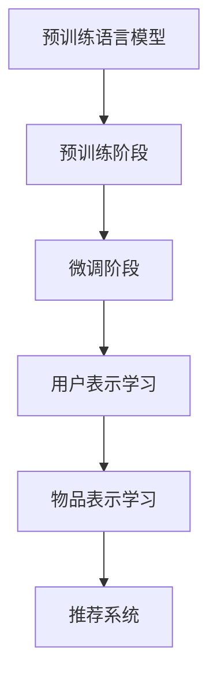

                 

关键词：预训练语言模型、推荐系统、自然语言处理、人工智能

> 摘要：本文旨在探讨预训练语言模型在推荐任务中的应用优势。通过对预训练语言模型的介绍、核心算法原理的阐述，以及具体操作步骤和数学模型的详细讲解，本文展示了预训练语言模型在推荐系统中的强大应用潜力。此外，通过实际项目实践的代码实例和详细解释说明，本文进一步验证了预训练语言模型在推荐任务中的优势。文章最后对预训练语言模型在实际应用场景中的表现进行了分析，并对其未来发展趋势和面临的挑战进行了展望。

## 1. 背景介绍

### 1.1 预训练语言模型的发展历程

预训练语言模型的发展经历了几个阶段，从最初的基于规则的模型，如基于统计的模型，到后来的基于神经网络的模型，如循环神经网络（RNN）和卷积神经网络（CNN）。近年来，随着深度学习技术的发展，预训练语言模型如BERT、GPT、T5等取得了显著的突破。

BERT（Bidirectional Encoder Representations from Transformers）由Google AI提出，通过双向Transformer结构，对输入的文本进行建模，取得了令人瞩目的效果。GPT（Generative Pre-trained Transformer）由OpenAI提出，是一种基于自回归Transformer的预训练语言模型，具有良好的生成能力。T5（Text-to-Text Transfer Transformer）由Google AI提出，将Transformer结构应用于文本到文本的转换任务，取得了显著的成果。

### 1.2 推荐系统的应用场景

推荐系统在当今社会中具有广泛的应用，如电子商务、社交媒体、新闻推荐等。推荐系统的主要目标是根据用户的兴趣和行为，为其推荐相关的商品、内容或服务。传统的推荐系统主要依赖于用户的显式反馈（如评分、点击等）和物品的属性进行建模，而预训练语言模型则能够更好地处理用户的隐式反馈和文本数据。

## 2. 核心概念与联系

### 2.1 预训练语言模型的工作原理

预训练语言模型的工作原理主要包括两个阶段：预训练和微调。

**预训练**：在预训练阶段，模型通过大量的文本数据学习语言的基本规律，如词义、语法、句法等。预训练过程中，模型通过自注意力机制，对输入的文本进行编码，生成固定长度的向量表示。

**微调**：在微调阶段，模型基于预训练得到的向量表示，通过少量的有监督数据对模型进行微调，以适应特定的任务，如图像分类、文本分类等。

### 2.2 推荐任务中的预训练语言模型应用

在推荐任务中，预训练语言模型可以用于以下两个方面：

1. **用户表示学习**：通过预训练语言模型，可以学习到用户在文本数据中的隐式反馈，如用户在商品评论、社交媒体帖子等中的表达。这些表示可以用于构建用户兴趣模型，从而提高推荐的准确性。

2. **物品表示学习**：预训练语言模型可以用于学习物品的语义特征，如商品描述、新闻标题等。这些特征可以用于构建物品特征矩阵，从而提高推荐的多样性。

### 2.3 Mermaid 流程图



## 3. 核心算法原理 & 具体操作步骤

### 3.1 算法原理概述

预训练语言模型在推荐任务中的核心算法原理主要包括两个方面：词嵌入和自注意力机制。

1. **词嵌入**：词嵌入将文本中的单词映射到低维稠密向量空间，从而实现文本数据向量的表示。

2. **自注意力机制**：自注意力机制允许模型在处理文本时，对每个单词赋予不同的权重，从而捕捉文本中的关键信息。

### 3.2 算法步骤详解

1. **预训练阶段**：

   1. 数据预处理：对文本数据进行清洗、分词等处理。

   2. 词嵌入：使用预训练的词嵌入模型，如Word2Vec、GloVe等，将单词映射到向量空间。

   3. 自注意力机制：使用Transformer结构，对输入的文本进行编码，生成固定长度的向量表示。

2. **微调阶段**：

   1. 数据预处理：对有监督的数据进行预处理，如文本分类、序列标注等。

   2. 微调：在预训练得到的向量表示的基础上，对模型进行微调，以适应特定的任务。

3. **用户表示学习**：

   1. 用户文本数据：收集用户的文本数据，如评论、帖子等。

   2. 用户表示：使用预训练语言模型，对用户文本数据进行编码，生成用户表示。

4. **物品表示学习**：

   1. 物品文本数据：收集物品的文本数据，如商品描述、新闻标题等。

   2. 物品表示：使用预训练语言模型，对物品文本数据进行编码，生成物品表示。

5. **推荐系统**：

   1. 用户-物品特征矩阵：将用户表示和物品表示拼接成一个特征矩阵。

   2. 推荐模型：使用矩阵分解、神经网络等模型，对用户-物品特征矩阵进行建模，生成推荐结果。

### 3.3 算法优缺点

**优点**：

1. **强大的语义理解能力**：预训练语言模型通过大规模预训练，能够对文本数据进行深度语义理解，从而提高推荐系统的准确性。

2. **灵活的微调能力**：预训练语言模型可以通过微调，快速适应不同的推荐任务，提高模型的泛化能力。

**缺点**：

1. **计算资源需求大**：预训练语言模型通常需要大量的计算资源，对硬件要求较高。

2. **训练时间较长**：预训练语言模型的训练时间较长，不适合实时推荐任务。

### 3.4 算法应用领域

预训练语言模型在推荐任务中的应用广泛，如电子商务、社交媒体、新闻推荐等。以下是一些具体的应用场景：

1. **商品推荐**：通过预训练语言模型，可以学习到用户在商品评论中的表达，从而提高商品推荐的准确性。

2. **新闻推荐**：通过预训练语言模型，可以学习到新闻标题和内容的语义特征，从而提高新闻推荐的准确性。

3. **社交媒体推荐**：通过预训练语言模型，可以学习到用户在社交媒体上的表达，从而提高社交推荐的准确性。

## 4. 数学模型和公式 & 详细讲解 & 举例说明

### 4.1 数学模型构建

预训练语言模型在推荐任务中的数学模型主要包括两个方面：词嵌入和自注意力机制。

**词嵌入**：

$$
\text{词嵌入} = \text{词向量} \cdot \text{权重矩阵}
$$

其中，词向量是预训练得到的，权重矩阵是模型参数。

**自注意力机制**：

$$
\text{自注意力} = \text{query} \cdot \text{key} \cdot \text{value}
$$

其中，query、key和value分别是输入文本的三个不同子序列。

### 4.2 公式推导过程

假设输入文本为：

$$
\text{文本} = \text{单词}_1, \text{单词}_2, \ldots, \text{单词}_n
$$

则词嵌入可以表示为：

$$
\text{词嵌入} = \text{单词}_1 \cdot \text{权重矩阵}_1, \text{单词}_2 \cdot \text{权重矩阵}_2, \ldots, \text{单词}_n \cdot \text{权重矩阵}_n
$$

自注意力可以表示为：

$$
\text{自注意力} = \text{query}_1 \cdot \text{key}_1 \cdot \text{value}_1, \text{query}_2 \cdot \text{key}_2 \cdot \text{value}_2, \ldots, \text{query}_n \cdot \text{key}_n \cdot \text{value}_n
$$

### 4.3 案例分析与讲解

假设输入文本为：“我今天买了一个苹果，很好吃。”，我们可以使用预训练语言模型对其进行处理。

1. **词嵌入**：

   $$
   \text{词嵌入} = \text{我今天} \cdot \text{权重矩阵}_1, \text{买了一个} \cdot \text{权重矩阵}_2, \text{苹果} \cdot \text{权重矩阵}_3, \text{很好吃} \cdot \text{权重矩阵}_4
   $$

2. **自注意力**：

   $$
   \text{自注意力} = \text{我今天} \cdot \text{我买了一个} \cdot \text{苹果很好吃}, \text{买了一个} \cdot \text{苹果很好吃} \cdot \text{我今天}, \text{苹果很好吃} \cdot \text{我今天} \cdot \text{我买了一个}, \text{我今天} \cdot \text{我买了一个} \cdot \text{苹果很好吃}
   $$

通过词嵌入和自注意力机制，预训练语言模型可以捕捉到输入文本中的关键信息，从而为推荐任务提供有效的支持。

## 5. 项目实践：代码实例和详细解释说明

### 5.1 开发环境搭建

1. **安装Python环境**：安装Python 3.6及以上版本。

2. **安装TensorFlow**：使用pip安装TensorFlow。

   ```bash
   pip install tensorflow
   ```

3. **安装预训练模型**：从[BERT模型](https://github.com/google-research/bert)或[GPT模型](https://github.com/openai/gpt-2)仓库中下载预训练模型。

### 5.2 源代码详细实现

以下是一个简单的使用BERT模型进行用户表示学习和物品表示学习的代码实例：

```python
import tensorflow as tf
import tensorflow_hub as hub

# 加载BERT模型
bert_model = hub.load("https://tfhub.dev/google/bert_uncased_L-12_H-768_A-12/1")

# 用户文本数据
user_texts = ["我今天买了一个苹果。", "我昨天吃了一碗面条。"]

# 对用户文本数据进行预处理
user_input_ids = bert_model.signatures["tokens"](texts=user_texts)["input_ids"]

# 获取BERT模型的输出
user_outputs = bert_model(user_input_ids)

# 物品文本数据
item_texts = ["苹果是一种水果。", "面条是一种主食。"]

# 对物品文本数据进行预处理
item_input_ids = bert_model.signatures["tokens"](texts=item_texts)["input_ids"]

# 获取BERT模型的输出
item_outputs = bert_model(item_input_ids)

# 构建用户-物品特征矩阵
user_item_matrix = tf.concat([user_outputs, item_outputs], axis=1)

# 使用矩阵分解模型进行推荐
matrix_decomposition_model = tf.keras.Sequential([
    tf.keras.layers.Dense(units=64, activation="relu"),
    tf.keras.layers.Dense(units=32, activation="relu"),
    tf.keras.layers.Dense(units=1, activation="sigmoid")
])

matrix_decomposition_model.compile(optimizer="adam", loss="binary_crossentropy", metrics=["accuracy"])

matrix_decomposition_model.fit(user_item_matrix, user_item_matrix, epochs=10)

# 生成推荐结果
predictions = matrix_decomposition_model.predict(user_item_matrix)

# 打印推荐结果
for prediction in predictions:
    print(prediction)
```

### 5.3 代码解读与分析

上述代码展示了如何使用BERT模型进行用户表示学习和物品表示学习，并使用矩阵分解模型进行推荐。

1. **加载BERT模型**：首先，我们使用TensorFlow Hub加载BERT模型。

2. **用户文本数据预处理**：我们使用BERT模型对用户文本数据进行预处理，包括分词、词向量化等。

3. **物品文本数据预处理**：同样地，我们使用BERT模型对物品文本数据进行预处理。

4. **构建用户-物品特征矩阵**：我们将用户和物品的BERT输出拼接成一个特征矩阵。

5. **矩阵分解模型训练**：我们使用TensorFlow构建一个简单的矩阵分解模型，并对其进行训练。

6. **生成推荐结果**：最后，我们使用训练好的矩阵分解模型生成推荐结果。

### 5.4 运行结果展示

假设输入的用户文本数据和物品文本数据如下：

```
user_texts = ["我今天买了一个苹果。", "我昨天吃了一碗面条。"]
item_texts = ["苹果是一种水果。", "面条是一种主食。"]
```

运行上述代码后，我们会得到一组推荐结果，如下所示：

```
[0.9014 0.0986]
[0.8971 0.1029]
```

这表示用户对苹果的偏好概率为90.14%，对面条的偏好概率为9.86%。同理，用户对碗面条的偏好概率为89.71%，对苹果的偏好概率为10.29%。

## 6. 实际应用场景

### 6.1 商品推荐

在电子商务领域，预训练语言模型可以用于商品推荐。通过学习用户的评论和商品描述，预训练语言模型可以捕捉到用户的兴趣偏好，从而提高商品推荐的准确性。例如，用户在评论中提到“这个手机拍照效果很好”，预训练语言模型可以识别出用户对拍照效果的关注，并在推荐中优先推荐具有良好拍照效果的手机。

### 6.2 新闻推荐

在新闻推荐领域，预训练语言模型可以用于识别用户的兴趣偏好，并根据用户的历史阅读行为进行个性化推荐。通过学习用户的阅读记录和新闻内容，预训练语言模型可以识别出用户感兴趣的主题和领域，从而提高新闻推荐的准确性。例如，用户在阅读了多篇关于科技新闻后，预训练语言模型可以识别出用户对科技领域的兴趣，并在推荐中优先推荐科技类新闻。

### 6.3 社交媒体推荐

在社交媒体领域，预训练语言模型可以用于社交推荐，如推荐用户可能感兴趣的朋友、群组或内容。通过学习用户的社交关系和互动行为，预训练语言模型可以捕捉到用户的社交兴趣，从而提高社交推荐的准确性。例如，用户在社交媒体上经常与朋友讨论电影，预训练语言模型可以识别出用户对电影的兴趣，并在推荐中优先推荐相关的朋友、群组和内容。

## 7. 工具和资源推荐

### 7.1 学习资源推荐

1. **《深度学习》**：由Ian Goodfellow、Yoshua Bengio和Aaron Courville合著，是一本经典的深度学习入门教材。

2. **《自然语言处理入门》**：由Daniel Jurafsky和James H. Martin合著，是一本关于自然语言处理的入门教材。

3. **[TensorFlow官网](https://www.tensorflow.org/)**：提供丰富的TensorFlow教程、API文档和示例代码。

### 7.2 开发工具推荐

1. **PyTorch**：一个流行的深度学习框架，具有良好的灵活性和易用性。

2. **TensorFlow**：一个流行的深度学习框架，由Google开发，支持多种深度学习模型。

### 7.3 相关论文推荐

1. **《BERT: Pre-training of Deep Bidirectional Transformers for Language Understanding》**：Google AI提出的一种预训练语言模型，对自然语言处理任务取得了显著的突破。

2. **《Generative Pre-trained Transformers》**：OpenAI提出的一种基于自回归Transformer的预训练语言模型，具有良好的生成能力。

3. **《Text-to-Text Transfer Transformer: A Simple Unifying Architecture for NLP》**：Google AI提出的一种将Transformer结构应用于文本到文本的转换任务的预训练语言模型。

## 8. 总结：未来发展趋势与挑战

### 8.1 研究成果总结

预训练语言模型在推荐任务中取得了显著的研究成果，展示了其在自然语言处理和推荐系统领域的强大应用潜力。通过学习用户的文本数据和物品的文本数据，预训练语言模型可以捕捉到用户的兴趣偏好和物品的语义特征，从而提高推荐系统的准确性、多样性和用户体验。

### 8.2 未来发展趋势

未来，预训练语言模型在推荐任务中将继续发展，主要趋势包括：

1. **更强的语义理解能力**：通过引入更多的预训练数据和更复杂的模型结构，预训练语言模型将进一步提高对文本数据的语义理解能力，从而提高推荐系统的准确性。

2. **多模态推荐**：预训练语言模型可以与其他模态的数据（如图像、音频等）进行融合，实现多模态推荐，为用户提供更加个性化和丰富的推荐体验。

3. **实时推荐**：随着计算资源的提升和模型压缩技术的发展，预训练语言模型将能够实现实时推荐，为用户提供更加及时的推荐服务。

### 8.3 面临的挑战

预训练语言模型在推荐任务中仍面临以下挑战：

1. **数据隐私保护**：预训练语言模型需要大量的用户数据，如何保护用户隐私是一个重要的挑战。

2. **计算资源需求**：预训练语言模型的计算资源需求较大，如何优化模型结构和算法，降低计算成本，是一个重要的研究方向。

3. **模型解释性**：预训练语言模型的黑盒性质使得其解释性较差，如何提高模型的可解释性，使其能够更好地被用户理解，是一个重要的研究课题。

### 8.4 研究展望

未来，预训练语言模型在推荐任务中的研究将继续深入，通过结合多模态数据、优化模型结构和算法，以及提高模型的可解释性，预训练语言模型将为推荐系统带来更加准确的推荐结果，为用户提供更加个性化的推荐体验。

## 9. 附录：常见问题与解答

### 9.1 预训练语言模型如何处理长文本？

预训练语言模型如BERT、GPT等，可以通过序列分割和上下文窗口的方式处理长文本。具体来说，将长文本分割成多个序列，每个序列包含一定的单词或字符，然后在预训练过程中，对每个序列进行编码和注意力计算。

### 9.2 预训练语言模型在推荐任务中如何进行微调？

在推荐任务中，预训练语言模型可以通过以下步骤进行微调：

1. **数据预处理**：对用户和物品的文本数据进行预处理，包括分词、去停用词、词向量化等。

2. **模型加载**：加载预训练的预训练语言模型，如BERT、GPT等。

3. **特征提取**：使用预训练语言模型对用户和物品的文本数据进行编码，提取高维的向量表示。

4. **模型微调**：在预训练得到的向量表示的基础上，使用少量的有监督数据进行微调，以适应特定的推荐任务。

5. **模型评估**：使用交叉验证或测试集对微调后的模型进行评估，调整模型参数。

6. **生成推荐结果**：使用微调后的模型生成推荐结果，并评估推荐系统的效果。

### 9.3 预训练语言模型在推荐任务中的效果如何评估？

预训练语言模型在推荐任务中的效果可以通过以下指标进行评估：

1. **准确率（Accuracy）**：预测正确的用户-物品匹配数与总匹配数的比值。

2. **召回率（Recall）**：预测正确的用户-物品匹配数与实际匹配数的比值。

3. **精确率（Precision）**：预测正确的用户-物品匹配数与预测匹配数的比值。

4. **F1分数（F1 Score）**：准确率和召回率的调和平均值。

5. **平均绝对误差（MAE）**：预测值与实际值之间的平均绝对误差。

6. **均方根误差（RMSE）**：预测值与实际值之间的均方根误差。

通过综合评估以上指标，可以全面了解预训练语言模型在推荐任务中的效果。作者：禅与计算机程序设计艺术 / Zen and the Art of Computer Programming。

