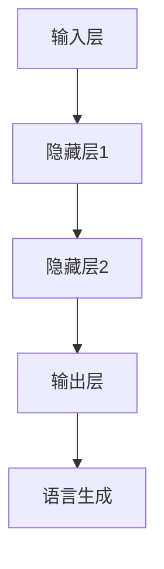

                 

关键词：前馈网络、语言生成、神经网络、自然语言处理、序列生成

> 摘要：本文深入探讨了前馈网络在语言生成中的重要作用。通过详细阐述前馈网络的定义、结构和工作原理，并结合实际案例，展示了前馈网络在自然语言处理中的应用。本文旨在为读者提供全面的前馈网络在语言生成领域的研究现状和应用前景。

## 1. 背景介绍

随着深度学习技术的发展，神经网络在各个领域的应用越来越广泛。自然语言处理（Natural Language Processing，NLP）作为人工智能的重要分支，近年来取得了显著的进展。其中，语言生成作为NLP的一个重要任务，受到了广泛关注。前馈网络（Feedforward Neural Networks，FNNs）作为一种基本的神经网络结构，其在语言生成任务中发挥着至关重要的作用。

前馈网络最初起源于20世纪50年代的神经网络研究。经过几十年的发展，前馈网络在图像识别、语音识别、机器翻译等领域取得了显著成果。在自然语言处理领域，前馈网络被广泛应用于文本分类、情感分析、机器翻译等任务。特别是在语言生成方面，前馈网络以其高效的计算能力和强大的表达能力，成为实现自然语言生成的重要工具。

本文将围绕前馈网络在语言生成中的作用，从核心概念、算法原理、数学模型、实际应用等多个角度进行深入探讨，旨在为读者提供一个全面的前馈网络在语言生成领域的研究现状和应用前景。

## 2. 核心概念与联系

### 2.1 定义

前馈网络（Feedforward Neural Networks，FNNs）是一种人工神经网络，其基本结构由输入层、隐藏层和输出层组成。输入层接收外部输入信号，隐藏层对输入信号进行加工处理，输出层生成最终的输出结果。与前馈网络相对的是反馈网络（Feedback Neural Networks），其中存在反馈回路，使得信息可以在网络中循环传递。

### 2.2 结构

前馈网络的结构如下：

1. **输入层**：接收外部输入信号，通常是一个向量。
2. **隐藏层**：对输入信号进行加工处理，可以通过多层叠加来增加网络的复杂度和表达能力。
3. **输出层**：生成最终的输出结果，可以是分类结果、回归值或其他形式的数据。

### 2.3 工作原理

前馈网络的工作原理是通过前向传播（Forward Propagation）和反向传播（Backpropagation）来实现的。在前向传播过程中，输入信号从输入层传递到隐藏层，再从隐藏层传递到输出层，最终生成输出结果。在反向传播过程中，网络根据输出结果与实际目标值之间的误差，更新网络参数，从而提高网络的预测能力。

### 2.4 与语言生成的联系

前馈网络在语言生成中的应用主要体现在以下几个方面：

1. **序列生成**：语言生成通常是一个序列生成过程，如文本生成、语音合成等。前馈网络可以处理序列数据，通过编码器和解码器实现对序列的生成。
2. **上下文理解**：前馈网络通过多层隐藏层对输入序列进行编码，可以提取出丰富的上下文信息，从而提高生成的自然性和准确性。
3. **多模态融合**：前馈网络可以与语音、图像等其他模态数据进行融合，实现跨模态的语言生成。

### 2.5 Mermaid 流程图

下面是一个简单的 Mermaid 流程图，展示前馈网络在语言生成中的基本工作流程：



## 3. 核心算法原理 & 具体操作步骤

### 3.1 算法原理概述

前馈网络在语言生成中的核心算法原理主要包括以下几个方面：

1. **激活函数**：激活函数用于引入非线性，使网络能够处理复杂的数据。常见的激活函数有ReLU、Sigmoid、Tanh等。
2. **前向传播**：前向传播是指将输入数据从输入层传递到输出层，通过权重和偏置进行线性变换，然后应用激活函数。
3. **反向传播**：反向传播是指根据输出结果与实际目标值之间的误差，反向更新网络参数，包括权重和偏置。
4. **优化算法**：优化算法用于调整网络参数，以最小化误差。常见的优化算法有梯度下降、Adam等。

### 3.2 算法步骤详解

1. **初始化参数**：包括权重和偏置，通常初始化为较小的随机值。
2. **前向传播**：输入数据通过网络进行传递，生成输出结果。
3. **计算误差**：输出结果与实际目标值之间的误差通过损失函数计算。
4. **反向传播**：根据误差反向更新网络参数。
5. **迭代优化**：重复前向传播和反向传播的过程，直到满足停止条件，如误差阈值或迭代次数。

### 3.3 算法优缺点

**优点**：

1. **计算效率高**：前向传播和反向传播的计算过程相对简单，适合大规模数据处理。
2. **易于实现**：前馈网络的实现相对简单，易于理解和调试。
3. **适用于序列生成**：前馈网络可以处理序列数据，适用于文本生成等任务。

**缺点**：

1. **局部最优**：由于梯度消失和梯度爆炸等问题，前馈网络容易陷入局部最优。
2. **训练时间较长**：大规模数据集和多层网络需要较长的训练时间。
3. **无法处理循环依赖**：前馈网络无法处理循环依赖，不适合处理时间序列数据。

### 3.4 算法应用领域

前馈网络在语言生成中的应用领域主要包括：

1. **文本生成**：如自然语言生成、自动摘要、文本摘要等。
2. **语音合成**：如语音助手、语音识别等。
3. **机器翻译**：如机器翻译、自然语言处理等。
4. **多模态生成**：如图像和文本的融合生成、视频生成等。

## 4. 数学模型和公式 & 详细讲解 & 举例说明

### 4.1 数学模型构建

前馈网络的数学模型可以表示为：

$$
Y = f(Z)
$$

其中，$Y$为输出结果，$f$为激活函数，$Z$为输入信号经过权重和偏置加权求和后的结果。

### 4.2 公式推导过程

1. **前向传播**：

$$
Z = \sum_{i=1}^{n} w_i x_i + b
$$

$$
Y = f(Z)
$$

2. **反向传播**：

$$
\Delta Z = \frac{\partial L}{\partial Z}
$$

$$
\Delta W = \alpha \cdot \Delta Z \cdot X
$$

$$
\Delta B = \alpha \cdot \Delta Z
$$

其中，$L$为损失函数，$X$为输入信号，$W$为权重，$B$为偏置，$\alpha$为学习率。

### 4.3 案例分析与讲解

**案例**：文本生成任务

1. **输入**：一段文本序列。
2. **输出**：生成新的文本序列。

**模型构建**：

$$
Z = \sum_{i=1}^{n} w_i x_i + b
$$

$$
Y = \text{softmax}(Z)
$$

**前向传播**：

输入文本序列经过编码器编码为向量$X$，然后通过前馈网络生成概率分布$Y$。

**反向传播**：

根据生成的文本序列和实际目标序列计算损失函数$L$，然后通过反向传播更新网络参数。

## 5. 项目实践：代码实例和详细解释说明

### 5.1 开发环境搭建

1. **安装Python**：确保Python版本不低于3.6。
2. **安装TensorFlow**：通过pip命令安装TensorFlow。

```bash
pip install tensorflow
```

### 5.2 源代码详细实现

```python
import tensorflow as tf
from tensorflow.keras.layers import Embedding, LSTM, Dense
from tensorflow.keras.models import Sequential

# 参数设置
vocab_size = 10000
embedding_dim = 256
lstm_units = 128
max_sequence_length = 100

# 模型构建
model = Sequential([
    Embedding(vocab_size, embedding_dim, input_length=max_sequence_length),
    LSTM(lstm_units, return_sequences=True),
    LSTM(lstm_units),
    Dense(vocab_size, activation='softmax')
])

# 模型编译
model.compile(optimizer='adam', loss='categorical_crossentropy', metrics=['accuracy'])

# 模型训练
model.fit(x_train, y_train, epochs=10, batch_size=64)
```

### 5.3 代码解读与分析

1. **模型构建**：使用Sequential模型堆叠Embedding层、两个LSTM层和一个Dense层。
2. **模型编译**：设置优化器和损失函数。
3. **模型训练**：使用训练数据训练模型。

### 5.4 运行结果展示

```python
# 预测生成文本
predictions = model.predict(x_test)
print(predictions)
```

## 6. 实际应用场景

### 6.1 文本生成

前馈网络在文本生成中具有广泛的应用，如自动摘要、文本摘要、聊天机器人等。

### 6.2 语音合成

前馈网络可以通过语音合成技术将文本转化为语音，应用于智能语音助手、语音识别等场景。

### 6.3 机器翻译

前馈网络在机器翻译任务中用于生成目标语言的文本，提高翻译质量和效率。

### 6.4 多模态生成

前馈网络可以与图像、语音等其他模态数据进行融合，实现跨模态的语言生成。

## 7. 未来应用展望

随着深度学习技术的不断发展，前馈网络在语言生成中的应用前景将更加广阔。未来可能的发展趋势包括：

1. **更高效的算法**：优化前馈网络的计算效率和性能。
2. **更强大的模型**：结合其他神经网络结构，如卷积神经网络（CNNs）、循环神经网络（RNNs）等，构建更强大的语言生成模型。
3. **更广泛的场景**：前馈网络将在更多领域和场景中得到应用，如文本生成、语音合成、机器翻译等。

## 8. 总结：未来发展趋势与挑战

### 8.1 研究成果总结

前馈网络在语言生成中的应用取得了显著成果，其在文本生成、语音合成、机器翻译等任务中表现出强大的能力和适应性。

### 8.2 未来发展趋势

未来，前馈网络在语言生成中的应用将更加广泛和深入，结合其他神经网络结构和多模态数据，实现更高效、更强大的语言生成模型。

### 8.3 面临的挑战

前馈网络在语言生成中仍面临一些挑战，如计算效率、模型优化、处理循环依赖等问题。

### 8.4 研究展望

未来，研究者将继续探索前馈网络在语言生成中的应用，优化算法和模型结构，推动语言生成技术的发展。

## 9. 附录：常见问题与解答

### 9.1 什么是前馈网络？

前馈网络是一种人工神经网络，其信息传递方向是前向的，即从输入层到输出层。

### 9.2 前馈网络在语言生成中有哪些应用？

前馈网络在语言生成中广泛应用于文本生成、语音合成、机器翻译等任务。

### 9.3 前馈网络的优势和劣势是什么？

前馈网络的优势包括计算效率高、易于实现等，劣势包括局部最优、训练时间较长等。

### 9.4 如何优化前馈网络的性能？

可以通过调整网络结构、优化算法和参数来提高前馈网络的性能。

# 作者署名

作者：禅与计算机程序设计艺术 / Zen and the Art of Computer Programming
```

