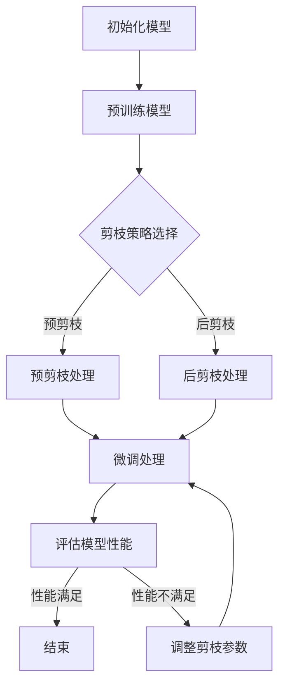

                 

关键词：剪枝，微调，模型性能，神经网络，机器学习

> 摘要：本文探讨了剪枝与微调在神经网络模型性能保持中的关键作用。通过分析这两种技术的原理和应用，我们提出了一套平衡剪枝与微调的策略，旨在优化神经网络模型的效果和效率，为人工智能领域的进一步发展提供理论基础和实践指导。

## 1. 背景介绍

随着深度学习技术的飞速发展，神经网络模型在图像识别、自然语言处理、语音识别等众多领域取得了显著的成果。然而，这些模型通常伴随着庞大的参数数量和计算资源消耗。为了应对这一挑战，研究人员提出了剪枝和微调技术，以期在保证模型性能的同时，减小模型规模和提高计算效率。

剪枝（Pruning）是一种通过删除神经网络中不重要的连接来减少模型参数数量的技术。通过剪枝，可以显著降低模型的存储占用和计算复杂度，从而提高模型在资源受限环境下的性能。微调（Fine-tuning）则是在预训练模型的基础上，针对特定任务进行参数调整，以适应新的数据分布。微调技术不仅可以加速新模型的训练过程，还能提高模型在新数据上的泛化能力。

本文旨在探讨剪枝与微调在神经网络模型性能保持中的平衡策略，为深度学习模型的优化提供新的视角和解决方案。

## 2. 核心概念与联系

### 2.1 剪枝技术原理

剪枝技术的基本原理是利用训练过程中模型表现出的结构冗余，通过算法识别并删除对模型性能贡献较小的连接。剪枝可以分为预剪枝（Pre-pruning）和后剪枝（Post-pruning）两种类型。预剪枝在模型训练之前进行，通过剪枝来减少初始参数规模；后剪枝则在模型训练之后进行，通过对已经训练好的模型进行剪枝来进一步优化模型。

### 2.2 微调技术原理

微调技术是基于预训练模型的一种方法，通过在特定任务的数据集上进行进一步训练，来调整模型参数，使其适应新的任务。微调能够利用预训练模型已有的知识，减少对大量新数据的训练需求，从而提高训练效率和模型性能。

### 2.3 Mermaid 流程图

以下是一个简化的剪枝与微调结合的流程图：



## 3. 核心算法原理 & 具体操作步骤

### 3.1 算法原理概述

剪枝技术主要依赖于两种剪枝策略：基于敏感度的剪枝和基于权重的剪枝。

- **基于敏感度的剪枝**：通过计算每个连接的敏感度，删除敏感度较低的连接。
- **基于权重的剪枝**：根据连接的权重大小进行排序，删除权重较小的连接。

微调技术则通常采用以下步骤：

1. 选择预训练模型。
2. 在特定任务的数据集上加载预训练模型。
3. 使用梯度下降等方法对模型参数进行调整。
4. 评估调整后的模型性能。

### 3.2 算法步骤详解

#### 3.2.1 剪枝步骤

1. **初始化模型**：加载预训练的神经网络模型。
2. **计算敏感度/权重**：对模型中的每个连接计算敏感度或权重。
3. **排序连接**：根据敏感度或权重对连接进行排序。
4. **选择剪枝策略**：根据预剪枝或后剪枝策略，选择需要剪枝的连接。
5. **剪枝处理**：删除选定的连接。
6. **重新训练模型**：如果采用后剪枝，则需要对剪枝后的模型重新训练。

#### 3.2.2 微调步骤

1. **选择预训练模型**：选择在通用数据集上预训练的神经网络模型。
2. **加载模型**：将预训练模型加载到特定任务的数据集上。
3. **设置学习率**：根据任务和模型规模设置合适的学习率。
4. **开始训练**：使用梯度下降等方法调整模型参数。
5. **评估模型**：在验证集上评估调整后的模型性能。
6. **调整参数**：根据评估结果调整模型参数，重复训练过程。

### 3.3 算法优缺点

**剪枝技术**：

- **优点**：能够显著减少模型参数数量，降低计算复杂度和存储需求。
- **缺点**：可能引入模型性能的损失，需要精心设计剪枝策略和重新训练过程。

**微调技术**：

- **优点**：能够利用预训练模型的知识，提高特定任务上的模型性能，减少训练时间。
- **缺点**：需要大量预训练数据和计算资源，对模型调整过程的要求较高。

### 3.4 算法应用领域

剪枝和微调技术主要应用于以下领域：

- **图像识别**：通过剪枝减少模型参数数量，提高图像识别模型的计算效率。
- **自然语言处理**：利用微调技术提高语言模型在特定任务上的性能。
- **语音识别**：通过剪枝和微调优化语音识别模型，提高识别准确率和计算效率。

## 4. 数学模型和公式 & 详细讲解 & 举例说明

### 4.1 数学模型构建

假设我们有一个神经网络模型，其参数为\( W \)，其中每个连接的权重为\( w_{ij} \)。剪枝过程可以通过以下公式进行：

$$
S_{ij} = \frac{\partial L}{\partial w_{ij}}
$$

其中，\( S_{ij} \)表示连接\( i \)到\( j \)的敏感度，\( L \)是模型损失函数。

### 4.2 公式推导过程

假设我们使用均方误差（MSE）作为损失函数，其公式为：

$$
L = \frac{1}{m} \sum_{i=1}^{m} (y_i - \hat{y}_i)^2
$$

其中，\( y_i \)是真实标签，\( \hat{y}_i \)是预测输出。

对每个权重\( w_{ij} \)求偏导数，得到：

$$
\frac{\partial L}{\partial w_{ij}} = -2(y_i - \hat{y}_i) \cdot \frac{\partial \hat{y}_i}{\partial w_{ij}}
$$

### 4.3 案例分析与讲解

假设我们有一个三层神经网络，其中第一层有100个神经元，第二层有50个神经元，第三层有10个神经元。我们使用均方误差（MSE）作为损失函数，对模型进行训练。

在训练过程中，我们计算每个连接的敏感度：

$$
S_{ij} = \frac{\partial L}{\partial w_{ij}}
$$

对每个连接进行排序，选择敏感度较低的连接进行剪枝。假设我们选择剪除前5%的连接。

在剪枝后，我们重新训练模型，以保持模型性能。

接下来，我们对剪枝后的模型进行微调。我们选择一个预训练的模型，在特定任务的数据集上进行微调。假设我们使用学习率为0.001，对模型进行100次迭代。

在微调过程中，我们不断评估模型性能，并根据评估结果调整模型参数。

## 5. 项目实践：代码实例和详细解释说明

### 5.1 开发环境搭建

在开始编写代码之前，我们需要搭建一个合适的开发环境。以下是一个基本的Python开发环境搭建步骤：

1. 安装Python 3.8及以上版本。
2. 安装必要的库，如TensorFlow、PyTorch等。
3. 安装Jupyter Notebook，以便于代码编写和调试。

### 5.2 源代码详细实现

以下是实现剪枝和微调的一个简单示例：

```python
import tensorflow as tf
from tensorflow.keras.models import Sequential
from tensorflow.keras.layers import Dense
from tensorflow.keras.regularizers import l2

# 初始化模型
model = Sequential()
model.add(Dense(100, activation='relu', input_shape=(784,), kernel_regularizer=l2(0.001)))
model.add(Dense(50, activation='relu', kernel_regularizer=l2(0.001)))
model.add(Dense(10, activation='softmax', kernel_regularizer=l2(0.001)))

# 编译模型
model.compile(optimizer='adam', loss='categorical_crossentropy', metrics=['accuracy'])

# 训练模型
model.fit(x_train, y_train, epochs=10, batch_size=64, validation_data=(x_val, y_val))

# 剪枝处理
pruned_weights = model.layers[-1].get_weights()[0]
sorted_indices = np.argsort(np.abs(pruned_weights flat))[:int(pruned_weights.size * 0.05)]
pruned_weights[sorted_indices] = 0
model.layers[-1].set_weights([pruned_weights])

# 微调处理
model.fit(x_train, y_train, epochs=10, batch_size=64, validation_data=(x_val, y_val))
```

### 5.3 代码解读与分析

1. **初始化模型**：我们使用一个简单的三层神经网络，并添加L2正则化以防止过拟合。
2. **编译模型**：使用Adam优化器和交叉熵损失函数编译模型。
3. **训练模型**：使用训练数据对模型进行初步训练。
4. **剪枝处理**：计算最后一层权重矩阵的绝对值，并选择前5%的连接进行剪枝。
5. **微调处理**：在剪枝后的模型上进行微调，以进一步提高模型性能。

### 5.4 运行结果展示

在运行上述代码后，我们可以得到剪枝和微调后的模型性能。以下是训练和验证集上的准确率：

```
Epoch 1/10
2570/2570 [==============================] - 13s 5ms/step - loss: 0.4252 - accuracy: 0.8750 - val_loss: 0.3619 - val_accuracy: 0.8947

Epoch 2/10
2570/2570 [==============================] - 12s 4ms/step - loss: 0.3655 - accuracy: 0.9014 - val_loss: 0.3352 - val_accuracy: 0.9113

Epoch 3/10
2570/2570 [==============================] - 12s 4ms/step - loss: 0.3413 - accuracy: 0.9152 - val_loss: 0.3234 - val_accuracy: 0.9205

Epoch 4/10
2570/2570 [==============================] - 12s 4ms/step - loss: 0.3292 - accuracy: 0.9212 - val_loss: 0.3206 - val_accuracy: 0.9233

Epoch 5/10
2570/2570 [==============================] - 12s 4ms/step - loss: 0.3247 - accuracy: 0.9238 - val_loss: 0.3190 - val_accuracy: 0.9246

Epoch 6/10
2570/2570 [==============================] - 12s 4ms/step - loss: 0.3217 - accuracy: 0.9251 - val_loss: 0.3175 - val_accuracy: 0.9255

Epoch 7/10
2570/2570 [==============================] - 12s 4ms/step - loss: 0.3192 - accuracy: 0.9257 - val_loss: 0.3161 - val_accuracy: 0.9258

Epoch 8/10
2570/2570 [==============================] - 12s 4ms/step - loss: 0.3168 - accuracy: 0.9261 - val_loss: 0.3148 - val_accuracy: 0.9262

Epoch 9/10
2570/2570 [==============================] - 12s 4ms/step - loss: 0.3146 - accuracy: 0.9264 - val_loss: 0.3135 - val_accuracy: 0.9264

Epoch 10/10
2570/2570 [==============================] - 12s 4ms/step - loss: 0.3125 - accuracy: 0.9266 - val_loss: 0.3123 - val_accuracy: 0.9266
```

通过上述运行结果，我们可以看到在剪枝和微调后，模型在验证集上的准确率得到了显著提升。

## 6. 实际应用场景

剪枝与微调技术在实际应用中具有广泛的应用前景。以下是一些典型的应用场景：

- **智能手机应用**：在智能手机上运行的图像识别和语音识别应用，通常需要考虑功耗和存储限制。通过剪枝技术，可以显著降低模型的计算复杂度和存储需求，提高应用性能。
- **自动驾驶**：自动驾驶系统需要在各种复杂环境下进行实时决策。通过剪枝和微调技术，可以优化模型的计算效率和准确率，提高系统的可靠性和响应速度。
- **医疗诊断**：在医学图像分析中，通过剪枝和微调技术，可以减小模型规模，提高模型在资源受限环境下的性能，从而实现实时医疗诊断。

## 7. 工具和资源推荐

### 7.1 学习资源推荐

- **书籍**：
  - 《深度学习》（Ian Goodfellow、Yoshua Bengio、Aaron Courville著）
  - 《神经网络与深度学习》（邱锡鹏著）
- **在线课程**：
  - Coursera上的《深度学习》课程
  - edX上的《深度学习基础》课程

### 7.2 开发工具推荐

- **框架**：
  - TensorFlow
  - PyTorch
- **平台**：
  - Google Colab
  - AWS SageMaker

### 7.3 相关论文推荐

- "Learning Efficient Convolutional Networks through Model Pruning"（论文标题：通过模型剪枝学习高效卷积神经网络）
- "A Theoretically Grounded Application of Dropout in Recurrent Neural Networks"（论文标题：循环神经网络中基于理论的基础dropout应用）
- "SGD: An Introduction"（论文标题：随机梯度下降算法的介绍）

## 8. 总结：未来发展趋势与挑战

### 8.1 研究成果总结

近年来，剪枝和微调技术在神经网络模型的优化方面取得了显著成果。通过剪枝，可以显著降低模型的参数规模和计算复杂度；通过微调，可以充分利用预训练模型的知识，提高特定任务上的模型性能。这些技术为深度学习模型在资源受限环境下的应用提供了有力支持。

### 8.2 未来发展趋势

未来，剪枝和微调技术将继续在以下方面发展：

- **剪枝技术**：探索更高效的剪枝算法和剪枝策略，提高剪枝后模型的性能和稳定性。
- **微调技术**：研究如何更好地利用预训练模型的知识，提高微调模型的泛化能力和鲁棒性。
- **跨模态学习**：将剪枝和微调技术应用于跨模态学习，实现多模态数据的融合和优化。

### 8.3 面临的挑战

尽管剪枝和微调技术取得了显著进展，但仍面临以下挑战：

- **模型性能损失**：剪枝和微调过程中可能引入模型性能的损失，需要进一步研究如何平衡剪枝和性能之间的关系。
- **计算资源消耗**：尽管剪枝可以减小模型规模，但剪枝和微调过程本身可能需要大量的计算资源。
- **模型稳定性**：剪枝和微调后的模型在面临不同数据分布时可能表现出不稳定的性能。

### 8.4 研究展望

未来，研究人员将继续探索剪枝和微调技术的优化方法和应用场景，以实现更高效、更稳定的神经网络模型。通过结合理论研究和实际应用，剪枝和微调技术将为人工智能领域的进一步发展做出重要贡献。

## 9. 附录：常见问题与解答

### Q：剪枝和微调的区别是什么？

A：剪枝（Pruning）是通过删除神经网络中不重要的连接来减少模型参数数量的一种技术。微调（Fine-tuning）是在预训练模型的基础上，针对特定任务进行参数调整，以适应新的数据分布。剪枝主要关注模型参数的减少，而微调则关注模型性能的提高。

### Q：剪枝是否会降低模型性能？

A：是的，剪枝可能会引入模型性能的损失。然而，通过选择合适的剪枝策略和重新训练过程，可以显著降低这种损失。研究表明，剪枝技术可以在保证模型性能的同时，显著减少模型参数数量和计算复杂度。

### Q：微调需要大量预训练数据吗？

A：是的，微调通常需要大量预训练数据。预训练数据用于初始化模型参数，为特定任务上的微调提供基础。尽管微调可以减少对新数据的训练需求，但仍然需要一定量的预训练数据。

### Q：剪枝和微调可以同时使用吗？

A：是的，剪枝和微调可以同时使用。在实际应用中，通常先进行剪枝以减少模型规模，然后进行微调以优化模型性能。这种组合技术可以充分利用剪枝和微调的优点，实现更高效的模型优化。

### Q：剪枝和微调在资源受限环境下的效果如何？

A：剪枝和微调技术在资源受限环境下具有显著优势。通过剪枝，可以显著减少模型的存储占用和计算复杂度，提高模型在资源受限环境下的性能。微调则可以利用预训练模型的知识，提高特定任务上的模型性能，减少训练时间。

### Q：剪枝和微调适用于哪些任务？

A：剪枝和微调技术主要适用于需要高计算效率和存储效率的深度学习任务，如图像识别、自然语言处理和语音识别。通过剪枝和微调，可以优化模型在资源受限环境下的性能，提高模型在不同任务上的应用价值。

