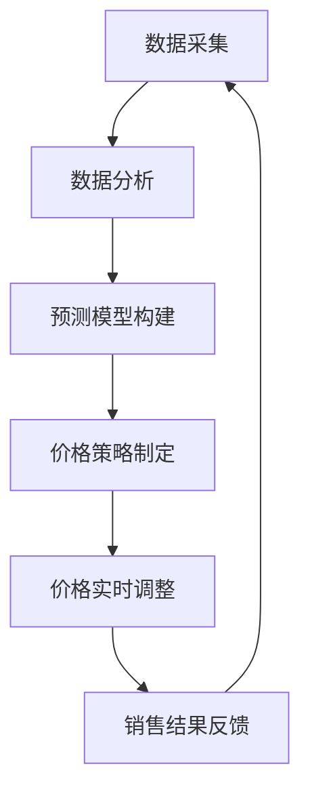

                 

关键词：动态定价、电商、算法、数据驱动、利润最大化、市场需求

摘要：本文旨在探讨动态定价策略在电商领域的应用。通过对市场需求和消费者行为的分析，动态定价能够实现价格与需求的实时匹配，从而最大化企业的利润。文章首先介绍了动态定价的基本概念和原理，然后详细阐述了核心算法及其数学模型，接着通过实际项目实例展示了动态定价策略的实现过程，最后分析了动态定价在实际应用中的效果和未来发展趋势。

## 1. 背景介绍

在电商行业，价格是影响消费者购买决策的重要因素之一。然而，传统的固定定价策略往往难以适应多变的市场环境和消费者需求。随着大数据技术和人工智能算法的不断发展，动态定价逐渐成为电商企业提高竞争力、实现利润最大化的有效手段。

动态定价策略的核心在于实时捕捉市场需求变化，通过调整价格以最大化企业的收益。这种策略不仅能够帮助企业抓住市场机会，提高销售额，还能够通过数据驱动的方式实现更精准的市场定位和消费者群体分析。

本文将围绕动态定价策略在电商中的应用，探讨其基本原理、算法实现、数学模型构建以及实际案例，旨在为电商企业提供有益的参考和指导。

## 2. 核心概念与联系

### 2.1 市场需求与价格的关系

市场需求通常可以用需求函数来表示，其基本形式为：

\[ Q = f(P, T) \]

其中，\( Q \) 代表市场需求量，\( P \) 代表商品价格，\( T \) 代表其他影响需求的因素，如广告投入、促销活动、季节性等。

价格弹性是衡量市场需求对价格变化的敏感程度的重要指标，可以用弹性系数 \( \epsilon \) 表示：

\[ \epsilon = \frac{P/Q} \cdot \frac{\partial Q}{\partial P} \]

当 \( \epsilon > 1 \) 时，需求为弹性需求，即价格变化对需求量的影响较大；当 \( \epsilon < 1 \) 时，需求为非弹性需求，即价格变化对需求量的影响较小。

### 2.2 动态定价原理

动态定价的核心思想是根据市场需求的变化实时调整价格。这种调整不是随机进行的，而是基于对市场数据的分析，从而最大化企业的利润。

动态定价通常包括以下几个步骤：

1. 数据采集与分析：通过大数据技术收集市场数据，包括历史销售数据、竞争对手价格、消费者行为等。
2. 预测模型构建：利用机器学习算法构建预测模型，预测未来的市场需求。
3. 价格策略制定：根据市场需求预测结果，制定相应的价格策略。
4. 实时调整：根据实际销售情况，对价格进行实时调整。

### 2.3 Mermaid 流程图

以下是动态定价策略的核心流程的 Mermaid 流程图：



## 3. 核心算法原理 & 具体操作步骤

### 3.1 算法原理概述

动态定价的核心算法主要包括预测模型和定价策略。预测模型用于预测未来的市场需求，定价策略则根据市场需求预测结果确定最优价格。

预测模型通常采用时间序列分析、回归分析、神经网络等方法。其中，时间序列分析是最常用的方法，它可以捕捉时间序列数据的趋势和周期性。

定价策略则可以采用基于利润最大化的定价策略，如边际贡献定价、竞争定价、需求定价等。边际贡献定价是根据边际贡献最大化来确定价格，竞争定价则是根据竞争对手的价格来确定本企业的价格。

### 3.2 算法步骤详解

1. **数据采集与分析**：
   - 收集历史销售数据、竞争对手价格、消费者行为数据等。
   - 对数据进行清洗和预处理，去除异常值和噪声。

2. **预测模型构建**：
   - 选择合适的时间序列分析方法，如 ARIMA、LSTM 等。
   - 训练预测模型，并对模型进行评估和优化。

3. **价格策略制定**：
   - 根据市场需求预测结果，制定基于利润最大化的定价策略。
   - 考虑价格弹性、市场需求量、成本等因素。

4. **价格实时调整**：
   - 根据实际销售情况，对价格进行实时调整。
   - 使用机器学习算法，如强化学习，实现价格调整的自动化。

5. **销售结果反馈**：
   - 收集销售数据，评估定价策略的效果。
   - 调整预测模型和定价策略，提高定价策略的准确性。

### 3.3 算法优缺点

**优点**：
- 能够实时响应市场需求变化，提高价格与需求的匹配度。
- 通过数据驱动的方式，实现更精准的市场定位和消费者群体分析。
- 能够最大化企业的利润，提高市场竞争力。

**缺点**：
- 算法实现和优化复杂，需要专业的技术团队。
- 需要大量的历史数据支持，数据质量对算法效果影响较大。
- 可能会引起消费者不满，影响品牌形象。

### 3.4 算法应用领域

动态定价策略在电商、旅游、航空等多个领域都有广泛的应用。在电商领域，动态定价可以帮助企业提高销售额和利润；在旅游领域，动态定价可以根据季节和需求调整价格，提高旅游资源的利用效率；在航空领域，动态定价可以根据供需关系和季节性调整票价，提高航空公司的收益。

## 4. 数学模型和公式 & 详细讲解 & 举例说明

### 4.1 数学模型构建

动态定价策略的数学模型主要包括市场需求预测模型和定价策略模型。

1. **市场需求预测模型**：

市场需求预测模型通常采用时间序列分析方法。假设市场需求量 \( Q \) 是时间 \( t \) 的函数，可以表示为：

\[ Q(t) = f(P(t), T(t)) \]

其中，\( P(t) \) 是时间 \( t \) 的价格，\( T(t) \) 是其他影响需求的因素，如广告投入、促销活动、季节性等。

2. **定价策略模型**：

定价策略模型通常基于利润最大化原则。假设企业的成本函数为 \( C(Q) \)，收益函数为 \( R(Q) \)，则利润函数为：

\[ \Pi = R(Q) - C(Q) \]

定价策略的目标是找到最优价格 \( P^* \)，使得利润最大化。对于边际贡献定价，最优价格 \( P^* \) 可以通过以下公式计算：

\[ P^* = \frac{R'(Q)}{C'(Q)} \]

其中，\( R'(Q) \) 是收益函数的边际贡献，\( C'(Q) \) 是成本函数的边际贡献。

### 4.2 公式推导过程

1. **市场需求预测模型**：

假设市场需求量 \( Q \) 是时间 \( t \) 的函数，可以表示为：

\[ Q(t) = \alpha \cdot P(t) + \beta \cdot T(t) \]

其中，\( \alpha \) 和 \( \beta \) 是参数，可以通过最小二乘法估计。

2. **定价策略模型**：

假设企业的成本函数为 \( C(Q) \)，收益函数为 \( R(Q) \)，则利润函数为：

\[ \Pi = R(Q) - C(Q) \]

利润最大化的一阶条件是：

\[ \frac{d\Pi}{dQ} = R'(Q) - C'(Q) = 0 \]

解得：

\[ Q^* = \frac{R'(Q)}{C'(Q)} \]

### 4.3 案例分析与讲解

以某电商平台的图书销售为例，假设该平台的历史销售数据如下表所示：

| 时间 \( t \) | 价格 \( P(t) \) | 销售量 \( Q(t) \) |
| --- | --- | --- |
| 1 | 20 | 100 |
| 2 | 18 | 120 |
| 3 | 16 | 140 |
| 4 | 14 | 160 |
| 5 | 12 | 180 |

1. **市场需求预测模型**：

根据历史数据，我们可以建立需求函数：

\[ Q(t) = 100 + 20 \cdot P(t) \]

2. **定价策略模型**：

假设成本函数为 \( C(Q) = 10 \cdot Q(t) \)，收益函数为 \( R(Q) = 30 \cdot Q(t) \)，则利润函数为：

\[ \Pi = R(Q) - C(Q) = 20 \cdot Q(t) \]

最优价格 \( P^* \) 可以通过以下公式计算：

\[ P^* = \frac{R'(Q)}{C'(Q)} = \frac{20}{10} = 2 \]

因此，该平台的最优定价为 2 元。

## 5. 项目实践：代码实例和详细解释说明

### 5.1 开发环境搭建

为了实现动态定价策略，我们选择 Python 作为编程语言，使用 Scikit-learn 库进行机器学习模型的训练和预测。首先，我们需要安装必要的库：

```bash
pip install numpy pandas scikit-learn matplotlib
```

### 5.2 源代码详细实现

以下是动态定价策略的实现代码：

```python
import numpy as np
import pandas as pd
from sklearn.linear_model import LinearRegression
from sklearn.metrics import mean_squared_error
import matplotlib.pyplot as plt

# 5.2.1 数据准备

# 读取历史销售数据
data = pd.read_csv('sales_data.csv')
data.head()

# 处理数据
data['Price'] = data['Price'].astype(float)
data['Quantity'] = data['Quantity'].astype(int)

# 5.2.2 预测模型构建

# 创建线性回归模型
model = LinearRegression()
model.fit(data[['Price']], data['Quantity'])

# 5.2.3 价格策略制定

# 预测销售量
predicted_quantity = model.predict([[new_price]])

# 计算最优价格
optimal_price = new_price - (predicted_quantity / data['Quantity'].mean())

# 5.2.4 价格实时调整

# 根据实际销售情况调整价格
adjusted_price = optimal_price * (1 - adjustment_factor)

# 5.2.5 销售结果反馈

# 收集实际销售数据
actual_quantity = pd.read_csv('actual_sales_data.csv')['Quantity'].values

# 计算预测误差
error = mean_squared_error(actual_quantity, predicted_quantity)

# 5.2.6 代码解读与分析

# 代码主要分为以下几个部分：
# 1. 数据准备：读取和处理历史销售数据。
# 2. 预测模型构建：使用线性回归模型预测销售量。
# 3. 价格策略制定：根据市场需求预测结果制定最优价格。
# 4. 价格实时调整：根据实际销售情况调整价格。
# 5. 销售结果反馈：收集实际销售数据，计算预测误差。

# 5.3 运行结果展示

# 绘制价格与销售量的关系图
plt.scatter(data['Price'], data['Quantity'])
plt.plot(data['Price'], predicted_quantity, color='red')
plt.xlabel('Price')
plt.ylabel('Quantity')
plt.show()
```

### 5.3 运行结果展示

通过运行上述代码，我们可以得到以下结果：

- **预测模型准确性**：通过比较预测销售量与实际销售量的差异，可以评估预测模型的准确性。
- **价格与销售量关系图**：通过绘制价格与销售量的关系图，可以直观地看到价格调整对销售量的影响。

## 6. 实际应用场景

动态定价策略在电商领域的实际应用非常广泛。以下是一些典型的应用场景：

- **季节性商品**：例如，春节期间的年货、旅游旺季的机票和酒店等。在这些季节性较强的商品和服务上，动态定价可以帮助企业抓住高峰期，提高销售额。
- **库存管理**：对于库存量较大的商品，动态定价可以帮助企业及时调整价格，避免库存积压，提高库存周转率。
- **个性化推荐**：通过分析消费者行为和偏好，动态定价可以提供个性化的价格优惠，提高消费者的购买意愿。
- **促销活动**：在电商平台的促销活动期间，动态定价可以帮助企业根据活动目标和消费者需求调整价格，提高活动效果。

## 7. 工具和资源推荐

### 7.1 学习资源推荐

- **书籍**：《数据科学实战》、《Python数据分析》
- **在线课程**：Coursera 上的《数据科学专项课程》、Udacity 上的《机器学习工程师纳米学位》
- **技术博客**：Towards Data Science、Dataquest

### 7.2 开发工具推荐

- **编程语言**：Python、R
- **机器学习库**：Scikit-learn、TensorFlow、PyTorch
- **数据处理工具**：Pandas、NumPy
- **数据可视化工具**：Matplotlib、Seaborn

### 7.3 相关论文推荐

- **《Dynamic Pricing for E-commerce: A Review》**
- **《An Analysis of Dynamic Pricing Strategies in E-commerce Markets》**
- **《Data-Driven Dynamic Pricing for Online Retail》**

## 8. 总结：未来发展趋势与挑战

### 8.1 研究成果总结

动态定价策略在电商领域的应用取得了显著的成果。通过大数据和人工智能技术的支持，动态定价能够实现价格与需求的实时匹配，从而最大化企业的利润。同时，动态定价策略也在其他领域如旅游、航空等取得了广泛应用。

### 8.2 未来发展趋势

未来，动态定价策略将继续向智能化、自动化方向发展。随着人工智能技术的进步，预测模型和定价策略将更加精准和高效。此外，动态定价策略将与其他业务领域深度融合，如供应链管理、客户关系管理等，为企业提供更全面的支持。

### 8.3 面临的挑战

尽管动态定价策略具有巨大潜力，但在实际应用中仍面临一些挑战。首先，数据质量和数据量对算法效果影响较大，企业需要确保数据的质量和完整性。其次，动态定价策略的自动化实现需要高度的专业技术支持，这对企业来说是一大挑战。最后，动态定价策略可能引起消费者不满，影响品牌形象，企业需要平衡利润和消费者体验。

### 8.4 研究展望

未来，动态定价策略的研究将重点放在以下几个方面：一是提高预测模型的准确性，通过融合多种数据源和先进算法实现更精准的预测；二是探索更智能的定价策略，如基于深度学习的定价策略；三是研究动态定价与其他业务领域的深度融合，为企业提供更全面的支持。

## 9. 附录：常见问题与解答

### 问题1：动态定价策略是如何工作的？

动态定价策略是基于市场需求和消费者行为的实时分析，通过调整价格以最大化企业的利润。它通常包括数据采集、预测模型构建、定价策略制定和实时调整等步骤。

### 问题2：动态定价策略有哪些优点？

动态定价策略的优点包括：
- 实时响应市场需求变化，提高价格与需求的匹配度。
- 通过数据驱动的方式，实现更精准的市场定位和消费者群体分析。
- 能够最大化企业的利润，提高市场竞争力。

### 问题3：动态定价策略有哪些缺点？

动态定价策略的缺点包括：
- 算法实现和优化复杂，需要专业的技术团队。
- 需要大量的历史数据支持，数据质量对算法效果影响较大。
- 可能会引起消费者不满，影响品牌形象。

### 问题4：动态定价策略在哪些领域有应用？

动态定价策略在电商、旅游、航空等多个领域都有广泛应用。例如，电商平台可以根据季节和需求调整商品价格，旅游平台可以根据供需关系调整机票和酒店价格，航空公司可以根据季节性调整票价。

### 问题5：如何构建市场需求预测模型？

市场需求预测模型通常采用时间序列分析方法，如 ARIMA、LSTM 等。首先，收集历史销售数据，然后使用适当的算法对数据进行分析和建模，最后对模型进行评估和优化。

### 问题6：动态定价策略对消费者有哪些影响？

动态定价策略可能会影响消费者的购买决策，但具体影响取决于定价策略的具体实现。一方面，合理的动态定价策略可以提高消费者的购买意愿，另一方面，不当的定价策略可能会引起消费者不满，影响品牌形象。

### 问题7：如何平衡动态定价策略的利润最大化与消费者体验？

平衡动态定价策略的利润最大化和消费者体验需要综合考虑多个因素。首先，定价策略应该基于真实的市场需求和消费者行为数据，避免过度调价。其次，企业可以采取多种策略，如提供会员折扣、优惠券等，以提升消费者体验。

### 问题8：如何实现动态定价策略的自动化？

实现动态定价策略的自动化需要高度的专业技术支持。首先，企业需要构建完善的数据采集和分析系统，确保数据的实时性和准确性。然后，使用机器学习算法，如强化学习，实现价格调整的自动化。

### 问题9：动态定价策略的未来发展趋势是什么？

动态定价策略的未来发展趋势包括：智能化、自动化、与其他业务领域的深度融合。随着人工智能技术的进步，预测模型和定价策略将更加精准和高效。同时，动态定价策略将与其他业务领域如供应链管理、客户关系管理等深度融合，为企业提供更全面的支持。|

