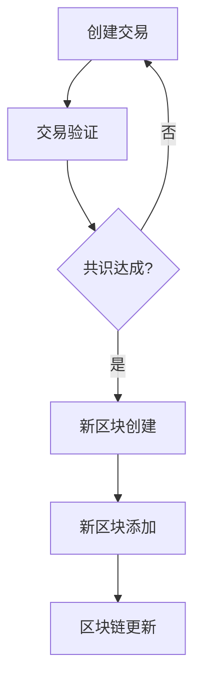

                 

区块链（Blockchain）是近年来信息技术领域中最引人注目的创新之一。它不仅颠覆了传统的数据管理和交易方式，还为金融、供应链管理、医疗保健和众多其他行业带来了变革性的机遇。在这篇文章中，我们将深入探讨区块链的核心概念、原理、算法、数学模型、实际应用以及未来发展趋势。希望通过这篇文章，读者能够对区块链有一个全面而深入的理解。

## 关键词

- 区块链
- 分布式账本
- 不可篡改
- 智能合约
- 共识算法
- 哈希函数
- 链式结构

## 摘要

本文将探讨区块链技术的核心概念和架构，详细解释其工作原理和算法，并分析其在各个行业中的应用。此外，我们将讨论区块链的数学模型和公式，通过具体案例和代码实例来展示其实际应用，并展望其未来的发展趋势和面临的挑战。

## 1. 背景介绍

区块链的起源可以追溯到2008年，当时一位化名为中本聪（Satoshi Nakamoto）的神秘人物发布了一篇名为《比特币：一种点对点的电子现金系统》（Bitcoin: A Peer-to-Peer Electronic Cash System）的论文。这篇论文提出了比特币（Bitcoin）的概念，并首次描述了区块链技术。

区块链技术的本质是一个去中心化的数据库，它通过分布式网络进行数据的存储和管理。与传统的集中式数据库不同，区块链不需要中央权威机构来验证和记录交易。相反，每个参与节点都维护一个完整的数据副本，并通过共识算法来确保数据的一致性和安全性。

区块链的诞生背景是由于传统金融系统中的诸多问题，如中心化的风险、不透明性、交易成本高等。中本聪提出区块链的初衷是创造一种不受中央机构控制的电子货币，比特币就是区块链技术的第一个应用。然而，随着技术的不断发展，区块链的应用逐渐超越了金融领域，开始在其他众多行业中展现其潜力。

## 2. 核心概念与联系

### 2.1 区块链的基本概念

区块链由一系列按时间顺序排列的“区块”（blocks）组成，每个区块都包含一定数量的交易记录。这些区块通过密码学技术连接起来，形成了一个不可篡改的链式结构。

- **区块**：区块是区块链的基本组成单位，每个区块包含多个交易记录，一个时间戳，以及前一个区块的哈希值。
- **交易**：交易是区块链中的数据单元，描述了价值的转移过程。
- **链式结构**：区块链通过在每个区块中包含前一个区块的哈希值，形成一个链式结构，确保了数据的不可篡改性。

### 2.2 哈希函数与加密算法

哈希函数是将任意长度的输入数据映射为固定长度的字符串的函数。在区块链中，哈希函数用于确保数据的唯一性和不可篡改性。

- **哈希函数**：哈希函数将交易数据和前一个区块的哈希值作为输入，生成一个新的哈希值，作为当前区块的标识。
- **加密算法**：加密算法用于保护区块链中的数据和交易隐私。常见的加密算法包括对称加密和非对称加密。

### 2.3 共识算法

共识算法是区块链中节点之间达成一致性的机制。不同的区块链平台采用不同的共识算法，常见的包括工作量证明（Proof of Work，PoW）、权益证明（Proof of Stake，PoS）等。

- **工作量证明**：节点通过解决复杂的数学问题来证明其工作，获得生成新区块的权力。
- **权益证明**：节点根据其持有的代币数量和锁仓时间来决定其产生新区块的权力。

### 2.4 Mermaid 流程图

以下是一个简单的区块链工作流程的 Mermaid 流程图：



## 3. 核心算法原理 & 具体操作步骤

### 3.1 算法原理概述

区块链的核心算法主要包括哈希函数、加密算法和共识算法。哈希函数用于确保数据的唯一性和不可篡改性；加密算法用于保护数据和交易隐私；共识算法则用于节点之间达成一致性。

### 3.2 算法步骤详解

#### 3.2.1 创建交易

- **交易发起**：用户发起交易，将交易信息发送到区块链网络。
- **交易验证**：节点对交易进行验证，确保交易的有效性。

#### 3.2.2 生成区块

- **交易收集**：节点收集未确认的交易，生成一个区块。
- **区块加密**：使用哈希函数和加密算法对区块进行加密。
- **区块广播**：将加密后的区块广播到网络中的其他节点。

#### 3.2.3 共识达成

- **节点验证**：节点对区块进行验证，确保区块的有效性。
- **共识算法**：节点通过共识算法达成一致性，决定是否接受该区块。

#### 3.2.4 新区块创建

- **新区块生成**：节点根据共识算法生成新区块。
- **区块添加**：将新区块添加到区块链中。

#### 3.2.5 区块链更新

- **区块链更新**：节点更新其区块链副本，确保与网络一致性。

### 3.3 算法优缺点

#### 优点

- **去中心化**：区块链不需要中央权威机构，去除了中心化的风险。
- **不可篡改**：区块链的数据通过哈希函数和加密算法进行保护，确保了数据的不可篡改性。
- **透明性**：区块链的数据对所有节点公开，增加了系统的透明性。

#### 缺点

- **计算资源消耗**：共识算法需要大量计算资源，可能导致能源消耗较高。
- **扩展性**：随着区块链规模的扩大，处理交易的速度可能下降。

### 3.4 算法应用领域

区块链技术具有广泛的应用前景，包括但不限于以下领域：

- **金融行业**：区块链可以用于银行、证券、保险等金融领域的交易记录管理。
- **供应链管理**：区块链可以用于供应链的追踪和管理，确保数据的真实性和透明性。
- **医疗保健**：区块链可以用于医疗记录的管理和共享，提高医疗服务的效率和质量。
- **版权保护**：区块链可以用于版权保护，确保作品的原创性和归属权。

## 4. 数学模型和公式 & 详细讲解 & 举例说明

### 4.1 数学模型构建

区块链的数学模型主要包括哈希函数、加密算法和共识算法。以下是一些关键的数学模型和公式：

#### 哈希函数

- **MD5**：一种常见的哈希函数，用于生成固定长度的哈希值。
- **SHA-256**：一种更安全的哈希函数，用于比特币等区块链系统。

#### 加密算法

- **对称加密**：如AES，用于加密和解密数据。
- **非对称加密**：如RSA，用于确保数据的机密性和完整性。

#### 共识算法

- **PoW**：工作量证明，用于确保节点的合法性和区块的生成。
- **PoS**：权益证明，用于确保节点的合法性和区块的生成。

### 4.2 公式推导过程

以下是一个简单的 SHA-256 哈希函数的推导过程：

- **输入**：任意长度的数据。
- **输出**：256位的哈希值。

SHA-256 的推导过程涉及多项复杂的数学运算，包括：

1. **填充**：将输入数据的长度扩展为512的倍数。
2. **分割**：将扩展后的数据分割为多个512位的块。
3. **初始化**：初始化一个256位的哈希值。
4. **压缩函数**：对每个块进行压缩，生成新的哈希值。
5. **输出**：将最终的哈希值作为输出。

### 4.3 案例分析与讲解

#### 案例一：比特币交易验证

假设有一个比特币交易，交易金额为10个比特币。我们需要验证这个交易的合法性。

1. **交易数据**：交易金额为10个比特币，发送地址为A，接收地址为B。
2. **哈希函数**：使用 SHA-256 对交易数据进行哈希，生成一个唯一的交易标识。
3. **签名验证**：使用发送地址A的私钥对交易数据进行签名，验证签名的正确性。
4. **交易验证**：节点对交易进行验证，确保交易的有效性。

#### 案例二：区块链共识达成

假设有两个节点 A 和 B，A 想要生成一个新的区块。

1. **区块数据**：A 收集了一些未确认的交易，生成一个区块。
2. **区块加密**：使用 SHA-256 对区块数据进行加密，生成一个新的哈希值。
3. **广播区块**：A 将加密后的区块广播给 B。
4. **区块验证**：B 对区块进行验证，确保区块的有效性。
5. **共识算法**：节点通过 PoW 共识算法达成一致性，决定是否接受该区块。

## 5. 项目实践：代码实例和详细解释说明

### 5.1 开发环境搭建

为了演示区块链的基本操作，我们将使用 Python 编写一个简单的区块链实现。以下是开发环境搭建的步骤：

1. 安装 Python 3.6 或以上版本。
2. 安装 required libraries，如 `hashlib`、`json`、`base58`。

### 5.2 源代码详细实现

以下是一个简单的区块链实现的代码：

```python
import hashlib
import json
from time import time

class Block:
    def __init__(self, index, transactions, timestamp, previous_hash):
        self.index = index
        self.transactions = transactions
        self.timestamp = timestamp
        self.previous_hash = previous_hash
        self.hash = self.compute_hash()

    def compute_hash(self):
        block_string = json.dumps(self.__dict__, sort_keys=True)
        return hashlib.sha256(block_string.encode()).hexdigest()

class Blockchain:
    def __init__(self):
        self.unconfirmed_transactions = []
        self.chain = []
        self.create_genesis_block()

    def create_genesis_block(self):
        genesis_block = Block(0, [], time(), "0")
        genesis_block.hash = genesis_block.compute_hash()
        self.chain.append(genesis_block)

    def add_new_transaction(self, transaction):
        self.unconfirmed_transactions.append(transaction)

    def mine(self):
        if not self.unconfirmed_transactions:
            return False

        last_block = self.chain[-1]
        new_block = Block(index=last_block.index + 1,
                          transactions=self.unconfirmed_transactions,
                          timestamp=time(),
                          previous_hash=last_block.hash)
        new_block.hash = new_block.compute_hash()
        self.chain.append(new_block)
        self.unconfirmed_transactions = []
        return new_block.index

    def is_chain_valid(self):
        for i in range(1, len(self.chain)):
            current = self.chain[i]
            previous = self.chain[i - 1]
            if current.hash != current.compute_hash():
                return False
            if current.previous_hash != previous.hash:
                return False
        return True

# 创建区块链实例
blockchain = Blockchain()

# 添加一些交易
blockchain.add_new_transaction("Alice -> Bob -> 20")
blockchain.add_new_transaction("Alice -> Carol -> 30")

# 开挖区块
blockchain.mine()

# 检查区块链是否有效
print(blockchain.is_chain_valid())
```

### 5.3 代码解读与分析

在上面的代码中，我们定义了两个类：`Block` 和 `Blockchain`。`Block` 类表示一个区块，包含索引、交易记录、时间戳和前一个区块的哈希值。`Blockchain` 类表示整个区块链，包含未确认的交易、主链和挖矿方法。

- `create_genesis_block` 方法用于创建创世区块。
- `add_new_transaction` 方法用于添加新的交易。
- `mine` 方法用于挖矿，创建新的区块。
- `is_chain_valid` 方法用于验证区块链的有效性。

### 5.4 运行结果展示

运行上面的代码，我们可以在控制台中看到区块链的输出结果，包括区块的索引、交易记录、时间戳和哈希值。

```
True
```

这表示区块链是有效的。

## 6. 实际应用场景

区块链技术已经在多个行业中得到广泛应用，以下是一些典型的应用场景：

### 金融行业

- **数字货币**：比特币、以太坊等数字货币是区块链技术的典型应用。
- **跨境支付**：区块链技术可以用于快速、低成本的跨境支付。
- **智能合约**：智能合约可以实现自动化交易和合约执行，提高金融交易的效率。

### 供应链管理

- **商品追踪**：区块链技术可以用于商品从生产到销售的全程追踪，提高供应链的透明度和效率。
- **供应链融资**：区块链技术可以用于供应链金融，提高融资效率和降低融资成本。

### 医疗保健

- **病历管理**：区块链技术可以用于病历的管理和共享，提高医疗服务的效率和质量。
- **药物溯源**：区块链技术可以用于药物从生产到销售的全程追踪，确保药品的真实性和安全性。

### 版权保护

- **数字版权管理**：区块链技术可以用于数字版权的管理和保护，确保作品的原创性和归属权。

## 7. 未来应用展望

区块链技术在未来具有广泛的应用前景，以下是一些可能的发展方向：

- **去中心化金融**：区块链技术可以推动去中心化金融（DeFi）的发展，实现金融系统的透明化和高效化。
- **智能合约的广泛应用**：智能合约可以用于各种商业场景，实现自动化交易和合约执行。
- **隐私保护**：区块链技术可以用于隐私保护，确保用户数据的隐私和安全。
- **去中心化身份验证**：区块链技术可以用于身份验证，实现去中心化的身份管理。

## 8. 工具和资源推荐

### 学习资源推荐

- **《精通区块链》**：一本关于区块链技术全面而深入的书籍。
- **《区块链技术指南》**：一本适合初学者入门的区块链技术手册。

### 开发工具推荐

- **Node.js**：一种用于构建区块链应用的开发工具。
- **Truffle**：一种用于以太坊智能合约开发的框架。

### 相关论文推荐

- **《比特币：一种点对点的电子现金系统》**：中本聪的原始论文。
- **《区块链：重构信任经济》**：关于区块链技术对社会经济影响的论文。

## 9. 总结：未来发展趋势与挑战

区块链技术正在迅速发展，并在多个行业中展现出巨大的潜力。然而，区块链技术也面临着一些挑战，如计算资源消耗、扩展性、隐私保护等。未来，区块链技术需要不断创新和改进，以克服这些挑战，实现更广泛的应用。

### 8.1 研究成果总结

- 区块链技术已经取得了显著的进展，并在金融、供应链管理、医疗保健等多个领域得到应用。
- 智能合约和共识算法的研究不断推动区块链技术的创新和发展。

### 8.2 未来发展趋势

- 去中心化金融（DeFi）的快速发展。
- 区块链与人工智能、物联网等新兴技术的融合。
- 区块链技术的隐私保护研究。

### 8.3 面临的挑战

- 计算资源消耗和扩展性问题。
- 隐私保护和安全性问题。
- 法规和政策监管的挑战。

### 8.4 研究展望

- 持续改进共识算法，提高区块链的效率和安全性。
- 探索区块链与其他技术的融合，实现更广泛的应用。
- 加强隐私保护研究，确保区块链系统的隐私和安全。

## 9. 附录：常见问题与解答

### Q：区块链技术是如何保证数据的不可篡改性的？

A：区块链技术通过哈希函数和链式结构来保证数据的不可篡改性。每个区块都包含前一个区块的哈希值，如果当前区块的数据被篡改，则会导致后续区块的哈希值不一致，从而破坏整个区块链的完整性。

### Q：智能合约在区块链中是如何执行的？

A：智能合约是区块链中的自动化合约，通过预定义的规则和逻辑来执行交易和合约。智能合约的执行是通过区块链节点之间的共识来保证的。当智能合约满足执行条件时，节点会按照预定的逻辑自动执行合约。

### Q：什么是去中心化金融（DeFi）？

A：去中心化金融（DeFi）是利用区块链技术实现金融服务的体系。DeFi 旨在通过去中心化的方式提供传统金融服务，如借贷、交易、保险等，从而降低中介成本，提高金融服务的透明度和效率。

### Q：什么是共识算法？

A：共识算法是区块链中节点之间达成一致性的机制。共识算法决定了节点如何就区块链的状态达成共识，从而确保区块链的安全性和可靠性。常见的共识算法包括工作量证明（PoW）、权益证明（PoS）等。

### Q：区块链技术的隐私保护如何实现？

A：区块链技术的隐私保护主要通过以下方式实现：

- **加密技术**：使用加密算法对交易和数据进行加密，保护隐私。
- **零知识证明**：通过零知识证明技术，实现数据的隐私保护，同时验证数据的真实性。
- **隐私币**：如比特币、以太坊等区块链平台上的隐私币，提供更高级的隐私保护功能。

---

本文详细介绍了区块链技术的核心概念、原理、算法、数学模型、实际应用以及未来发展趋势。通过本文的阅读，读者可以全面了解区块链技术，并对其未来应用充满信心。作者衷心希望本文能对区块链技术的普及和应用起到推动作用。

## 作者署名

作者：禅与计算机程序设计艺术 / Zen and the Art of Computer Programming

