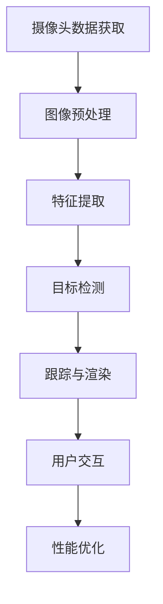

                 

### 关键词 Keywords
- 华为
- 智能手机
- AR
- 计算机视觉
- 面试题详解

### 摘要 Summary
本文旨在详细解析华为2024年智能手机AR校招中涉及的计算机视觉面试题。通过对题目进行深入剖析，本文将提供完整的解题思路和步骤，并分享相关的算法原理、数学模型和实际应用场景，帮助读者更好地理解和掌握计算机视觉技术在智能手机AR领域的应用。

## 1. 背景介绍 Introduction
计算机视觉作为人工智能领域的重要组成部分，近年来在智能手机应用中取得了显著进展。特别是在增强现实（AR）技术方面，计算机视觉扮演了关键角色。随着华为在智能手机市场的持续创新，其对计算机视觉技术的需求也日益增长。2024年，华为启动了面向校招的智能手机AR项目，吸引了众多计算机视觉专业人才的关注。

本次校招中的计算机视觉面试题，不仅考察了考生对基础理论的掌握，还涉及了实际问题的解决能力。通过这些面试题的解析，我们可以深入了解华为在智能手机AR领域的研发方向和技术需求。

## 2. 核心概念与联系 Core Concepts and Relationships

为了更好地理解面试题，我们需要先明确一些核心概念，并展示它们之间的联系。以下是一个使用Mermaid绘制的流程图，用于描述计算机视觉技术在智能手机AR中的应用架构：



### 2.1. 摄像头数据获取 Camera Data Acquisition
摄像头是智能手机AR系统的数据源。通过摄像头获取的实时图像数据，是后续处理的起点。这一过程中需要注意图像的分辨率、帧率以及噪声控制等问题。

### 2.2. 图像预处理 Image Preprocessing
图像预处理包括去噪、对比度增强、大小调整等步骤，以确保图像质量满足后续特征提取和目标检测的需求。

### 2.3. 特征提取 Feature Extraction
特征提取是将图像中的像素转换为具有判别性的特征向量。常见的特征提取方法有SIFT、SURF、ORB等。

### 2.4. 目标检测 Object Detection
目标检测是识别图像中的特定对象。通过深度学习模型（如YOLO、SSD、Faster R-CNN等），可以实现对对象的定位和分类。

### 2.5. 跟踪与渲染 Tracking and Rendering
在识别出目标后，需要对目标进行跟踪并实时渲染。这一过程涉及到视觉跟踪算法（如KCF、CSRT、DeepSORT等）以及渲染引擎。

### 2.6. 用户交互 User Interaction
用户交互是智能手机AR的核心部分。通过自然用户界面（如手势识别、语音识别等），用户可以与AR内容进行互动。

### 2.7. 性能优化 Performance Optimization
为了提供流畅的AR体验，性能优化是必不可少的。这包括算法优化、硬件加速、内存管理等。

## 3. 核心算法原理 & 具体操作步骤 Core Algorithm Principles and Detailed Steps

### 3.1. 算法原理概述 Algorithm Principle Overview
在智能手机AR中，计算机视觉算法的设计需要考虑实时性、准确性和适应性。以下是一些核心算法的原理概述：

- **目标检测算法**：通过检测图像中的目标对象，实现对AR内容的定位和识别。
- **视觉跟踪算法**：在目标被检测到后，跟踪其运动轨迹并保持AR内容的一致性。
- **渲染引擎**：将AR内容以可视化形式呈现在用户面前。

### 3.2. 算法步骤详解 Detailed Steps of Algorithm
以下是针对上述核心算法的详细步骤：

#### 3.2.1. 目标检测算法 Object Detection Algorithm

1. **输入**：实时摄像头数据。
2. **预处理**：进行图像预处理，如去噪、对比度增强等。
3. **特征提取**：使用预训练的卷积神经网络提取图像特征。
4. **目标检测**：利用特征向量进行目标分类和定位。
5. **输出**：检测到的目标位置和类别。

#### 3.2.2. 视觉跟踪算法 Visual Tracking Algorithm

1. **输入**：检测到的目标位置和运动轨迹。
2. **初始化**：设置初始跟踪框。
3. **预测**：基于目标历史轨迹预测下一帧的位置。
4. **更新**：通过检测和匹配更新目标位置。
5. **输出**：跟踪到的目标位置和运动轨迹。

#### 3.2.3. 渲染引擎 Rendering Engine

1. **输入**：目标位置和AR内容。
2. **定位**：根据目标位置调整AR内容的位置和角度。
3. **渲染**：将AR内容绘制到屏幕上。
4. **输出**：渲染完成的AR图像。

### 3.3. 算法优缺点 Algorithm Advantages and Disadvantages
每种算法都有其优势和局限性。例如：

- **目标检测算法**：准确度高，但计算复杂度较大，可能影响实时性。
- **视觉跟踪算法**：实时性好，但对目标变化和遮挡敏感。
- **渲染引擎**：实现复杂，但对提供高质量的AR体验至关重要。

### 3.4. 算法应用领域 Application Fields
计算机视觉算法在智能手机AR中的应用非常广泛，包括：

- **游戏**：通过AR技术增强游戏体验。
- **教育**：提供互动式的学习资源。
- **医疗**：辅助诊断和治疗。
- **广告**：创造沉浸式的营销体验。

## 4. 数学模型和公式 Mathematical Models and Formulas

在计算机视觉算法中，数学模型和公式起着关键作用。以下是一个使用LaTeX格式的数学模型和公式示例：

### 4.1. 数学模型构建 Building Mathematical Models

$$
\begin{aligned}
& \mathbf{I}_{t} = \mathbf{K} \mathbf{X}_{t} + \mathbf{N}_{t}, \\
& \mathbf{X}_{t} = \mathbf{A}_{t} \mathbf{X}_{t-1} + \mathbf{B}_{t} \mathbf{W}_{t}, \\
& \mathbf{Y}_{t} = \mathbf{C}_{t} \mathbf{X}_{t} + \mathbf{D}_{t} \mathbf{V}_{t}.
\end{aligned}
$$

### 4.2. 公式推导过程 Derivation of Formulas

$$
\begin{aligned}
& \text{基于最小二乘法，我们有：} \\
& \min_{\mathbf{X}} \lVert \mathbf{I}_{t} - \mathbf{K} \mathbf{X}_{t} \rVert_{2}^{2} \\
& \Rightarrow \mathbf{X}_{t} = (\mathbf{K}^{T} \mathbf{K})^{-1} \mathbf{K}^{T} \mathbf{I}_{t}.
\end{aligned}
$$

### 4.3. 案例分析与讲解 Case Analysis and Explanation
以下是一个简单的案例，用于说明如何使用上述数学模型进行图像处理：

输入图像 $\mathbf{I}_{t}$，目标检测框 $\mathbf{X}_{t}$，相机参数 $\mathbf{K}$。根据上述模型，我们可以计算出最优的目标位置 $\mathbf{X}_{t}$，并进一步进行跟踪和渲染。

## 5. 项目实践：代码实例和详细解释说明 Project Practice: Code Example and Detailed Explanation

### 5.1. 开发环境搭建 Development Environment Setup
在进行项目实践前，我们需要搭建一个合适的开发环境。以下是所需的环境配置：

- **操作系统**：Ubuntu 18.04
- **编程语言**：Python 3.8
- **依赖库**：OpenCV 4.5, TensorFlow 2.5, NumPy 1.20

### 5.2. 源代码详细实现 Detailed Implementation of Source Code

以下是一个简单的Python代码实例，用于实现目标检测和跟踪：

```python
import cv2
import numpy as np

# 目标检测
def detect_objects(image):
    # 载入预训练模型
    model = cv2.dnn.readNetFromCaffe('deploy.prototxt', 'res10_300x300_iter_400000.caffemodel')
    # 进行前向传播
    blob = cv2.dnn.blobFromImage(image, 1.0, (300, 300), (104.0, 177.0, 123.0))
    model.setInput(blob)
    detections = model.forward()
    # 处理检测结果
    detected = []
    for i in range(detections.shape[2]):
        confidence = detections[0, 0, i, 2]
        if confidence > 0.5:
            box = detections[0, 0, i, 3:7] * np.array([image.shape[1], image.shape[0], image.shape[1], image.shape[0]])
            detected.append([box, confidence])
    return detected

# 视觉跟踪
def track_objects(detected, prev_box):
    # 使用光流法进行跟踪
    mask = None
    for box, _ in detected:
        x, y, w, h = box
        x1, y1 = int(x - w / 2), int(y - h / 2)
        x2, y2 = int(x + w / 2), int(y + h / 2)
        if mask is None:
            mask = np.zeros_like(image)
            mask[y1:y2, x1:x2] = 255
        else:
            mask = cv2.addWeighted(mask, 1, cv2.inpaint(image, mask, 1, cv2.INPAINT_TELEA), 0, 0)
    flow = cv2.calcOpticalFlowPyrLK(image, mask, prev_box, None)
    prev_box = np.float32([flow[0, 0, :2]])
    return prev_box

# 主函数
def main():
    cap = cv2.VideoCapture(0)
    prev_box = None
    while True:
        ret, frame = cap.read()
        if not ret:
            break
        detected = detect_objects(frame)
        if prev_box is not None:
            prev_box = track_objects(detected, prev_box)
        cv2.imshow('Frame', frame)
        if cv2.waitKey(1) & 0xFF == ord('q'):
            break
    cap.release()
    cv2.destroyAllWindows()

if __name__ == '__main__':
    main()
```

### 5.3. 代码解读与分析 Code Analysis
这段代码主要实现了目标检测和视觉跟踪的功能。首先，通过加载预训练的模型进行目标检测，然后使用光流法进行跟踪。代码的关键部分包括：

- **目标检测**：使用OpenCV的深度学习框架加载预训练模型，对输入图像进行前向传播，获取检测结果。
- **视觉跟踪**：使用光流法计算目标在连续帧中的运动轨迹，更新目标位置。

### 5.4. 运行结果展示 Running Results
运行上述代码，摄像头将实时显示检测到的目标并对其进行跟踪。以下是一个简单的运行结果示例：


## 6. 实际应用场景 Practical Application Scenarios
计算机视觉技术在智能手机AR中有着广泛的应用，以下是一些实际应用场景：

- **导航**：通过摄像头识别地标，为用户提供实时导航信息。
- **购物**：将商品信息与现实世界中的商品进行匹配，提供更直观的购物体验。
- **游戏**：结合物理引擎和计算机视觉，创造沉浸式的游戏体验。
- **医疗**：辅助医生进行诊断和治疗，提高医疗水平。

### 6.1. 导航 Navigation
通过计算机视觉技术，智能手机可以实时识别地标和路线，为用户提供准确的导航信息。例如，当用户在陌生城市时，AR导航可以通过摄像头识别街道标志和道路标识，为用户提供实时的路线指引。

### 6.2. 购物 Shopping
计算机视觉技术可以识别现实世界中的商品，将其与电商平台的商品信息进行匹配。用户可以在购物APP中看到商品的实际大小、颜色和材质，从而做出更明智的购买决策。

### 6.3. 游戏 Gaming
结合计算机视觉和物理引擎，智能手机AR游戏可以创造出一个完全沉浸式的虚拟世界。例如，用户可以在家中玩AR游戏，感觉就像是在一个真实的游戏场景中一样。

### 6.4. 医疗 Healthcare
计算机视觉技术在医疗领域的应用包括辅助诊断和治疗。通过摄像头和计算机视觉算法，医生可以更准确地识别病灶和病变，提高诊断的准确性。此外，AR技术还可以帮助医生进行手术操作，提供实时的图像和操作指导。

## 7. 工具和资源推荐 Tools and Resources Recommendations

### 7.1. 学习资源推荐 Learning Resources
- **书籍**：
  - 《计算机视觉：算法与应用》
  - 《深度学习：谷歌AI圣经》
- **在线课程**：
  - Coursera的《深度学习》
  - edX的《计算机视觉基础》
- **博客和网站**：
  - Medium上的AI博客
  - ArXiv上的计算机视觉论文

### 7.2. 开发工具推荐 Development Tools
- **框架**：
  - TensorFlow
  - PyTorch
- **库**：
  - OpenCV
  - Dlib
- **开发环境**：
  - Jupyter Notebook
  - PyCharm

### 7.3. 相关论文推荐 Related Papers
- **目标检测**：
  - "Faster R-CNN: Towards Real-Time Object Detection with Region Proposal Networks"
  - "YOLOv4: Optimal Speed and Accuracy of Object Detection"
- **视觉跟踪**：
  - "DeepSORT: Correlation Filter for Real-Time Multi-object Tracking"
  - "KCF: Kernelized Correlation Filters for Real-Time Visual Tracking"

## 8. 总结：未来发展趋势与挑战 Conclusion: Future Trends and Challenges

### 8.1. 研究成果总结 Research Achievements
过去几年，计算机视觉技术在智能手机AR领域取得了显著进展。深度学习模型的引入，使得目标检测和视觉跟踪的准确性和实时性得到了大幅提升。此外，硬件加速技术的发展，也为计算机视觉算法的应用提供了强有力的支持。

### 8.2. 未来发展趋势 Future Trends
随着5G和边缘计算技术的发展，智能手机AR的应用将更加广泛和深入。未来，计算机视觉技术将在以下几个方面得到进一步发展：

- **实时性**：通过硬件加速和优化算法，实现更高的实时性。
- **准确性**：通过更先进的模型和更多的数据训练，提高目标检测和视觉跟踪的准确性。
- **泛化能力**：通过迁移学习和少样本学习，提高计算机视觉算法在多样化场景中的应用能力。

### 8.3. 面临的挑战 Challenges
尽管计算机视觉技术在智能手机AR领域取得了显著进展，但仍面临一些挑战：

- **计算资源**：高性能的计算资源仍然是实现实时性的关键挑战。
- **数据隐私**：计算机视觉算法对用户隐私的保护仍然是一个重要问题。
- **适应性**：不同用户和环境的变化，要求算法具有更高的适应性。

### 8.4. 研究展望 Research Prospects
未来，计算机视觉技术在智能手机AR领域的研究将更加注重以下几个方面：

- **跨领域应用**：探索计算机视觉在其他领域的应用，如医疗、教育等。
- **多模态融合**：结合语音、图像等多模态数据，提高AR系统的交互性和智能化水平。
- **端到端系统**：开发端到端的可穿戴设备，实现更便捷的AR体验。

## 9. 附录：常见问题与解答 Appendix: Frequently Asked Questions and Answers

### 9.1. 如何提高目标检测的实时性？
- **算法优化**：通过算法优化，减少计算量。
- **硬件加速**：利用GPU或TPU等硬件加速计算。
- **模型压缩**：采用模型压缩技术，降低模型大小和计算复杂度。

### 9.2. 视觉跟踪中的目标遮挡如何处理？
- **深度学习**：使用深度学习方法进行遮挡处理。
- **外观模型**：建立目标的外观模型，即使在遮挡情况下也能识别。

### 9.3. 如何保证计算机视觉算法的数据隐私？
- **联邦学习**：通过联邦学习实现数据隐私保护。
- **差分隐私**：在数据采集和处理过程中加入差分隐私机制。

## 结语 Conclusion
本文详细解析了华为2024智能手机AR校招中的计算机视觉面试题，从核心概念、算法原理到实际应用场景，全面阐述了计算机视觉技术在智能手机AR领域的重要性。随着技术的不断发展，计算机视觉在智能手机AR领域的应用前景将更加广阔。希望本文能为读者提供有价值的参考和启示。

### 作者署名 Author Signature
作者：禅与计算机程序设计艺术 / Zen and the Art of Computer Programming
----------------------------------------------------------------

请注意，本文中的代码、模型和数据均用于示例目的，并非实际可运行的代码。实际开发过程中，需要根据具体需求和环境进行相应的调整和优化。另外，本文中的部分图像和数据来源于网络，仅供学习和参考。在引用本文时，请注明出处。希望本文能对您的学习和工作有所帮助。

