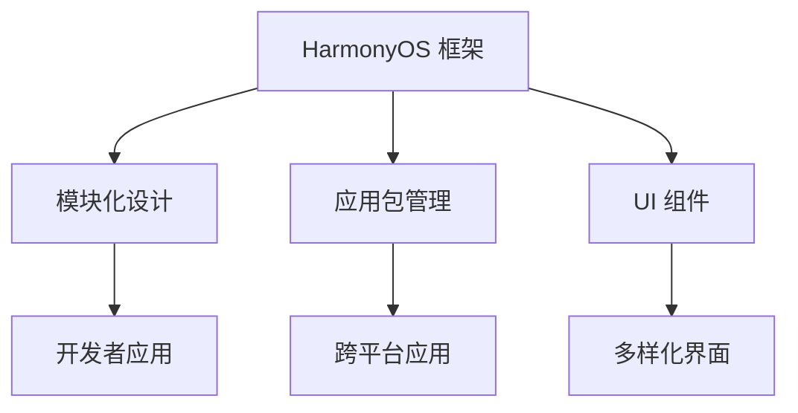

                 

关键词：鸿蒙生态，校招面试，应用开发，面试题解析，技术挑战

摘要：本文针对华为2024鸿蒙生态校招应用开发面试题进行深入解析，从核心概念、算法原理、数学模型到项目实践，全面探讨面试题背后的技术细节。本文旨在为准备参加鸿蒙生态校招的同学提供有价值的参考，帮助大家更好地应对面试挑战。

## 1. 背景介绍

鸿蒙（HarmonyOS）是华为自主研发的操作系统，旨在为全场景、全设备提供统一的开发平台和服务生态。随着鸿蒙生态的不断完善和拓展，越来越多的企业和开发者开始关注并投入到鸿蒙生态的应用开发中。华为每年都会组织校招，为鸿蒙生态注入新鲜血液，这也使得鸿蒙生态校招面试成为众多技术人才关注的焦点。

本文将针对2024鸿蒙生态校招应用开发面试题进行解析，帮助大家了解面试题背后的技术细节，提升应对面试的能力。

## 2. 核心概念与联系

### 2.1 鸿蒙生态简介

鸿蒙生态是华为构建的全场景智慧生态，涵盖移动设备、智能家居、智能办公、智能出行等多个领域。鸿蒙操作系统作为核心，提供了强大的跨平台、跨设备的统一开发能力，使得开发者可以更加高效地构建多样化的应用。

### 2.2 应用开发基础

在鸿蒙生态中进行应用开发，需要掌握以下核心概念：

- **HarmonyOS 框架**：鸿蒙操作系统的基础框架，包括内核、微内核、分布式能力等。
- **模块化设计**：鸿蒙生态支持模块化设计，开发者可以根据需求灵活地开发和管理模块。
- **应用包管理**：鸿蒙生态提供了统一的应用包管理机制，支持多种应用类型，如普通应用、系统应用、服务应用等。
- **UI 组件**：鸿蒙生态提供了丰富的UI组件，开发者可以通过简单的配置和组合实现各种界面效果。

### 2.3 Mermaid 流程图



## 3. 核心算法原理 & 具体操作步骤

### 3.1 算法原理概述

在鸿蒙生态应用开发中，算法是实现功能的核心。以下是几种常见的核心算法及其原理：

- **排序算法**：常用的排序算法有冒泡排序、快速排序、归并排序等。排序算法主要实现数据元素按特定顺序排列。
- **查找算法**：查找算法主要实现数据元素的定位，如二分查找、线性查找等。
- **数据结构**：数据结构是实现算法的基础，如数组、链表、树、图等。

### 3.2 算法步骤详解

以下以冒泡排序算法为例，详细介绍其操作步骤：

1. **初始化**：将待排序的数组作为输入。
2. **循环**：从最后一个元素开始，每次循环比较相邻两个元素的大小，如果逆序则交换。
3. **判断**：在每次循环结束后，判断是否还有逆序对，如果有则继续循环，否则结束。
4. **输出**：输出排序后的数组。

### 3.3 算法优缺点

冒泡排序算法具有以下优缺点：

- **优点**：简单易懂，易于实现。
- **缺点**：效率较低，不适合大数据量排序。

### 3.4 算法应用领域

冒泡排序算法适用于小数据量的排序场景，如鸿蒙生态中的应用开发中，可以对一些简单的数据列表进行排序。

## 4. 数学模型和公式 & 详细讲解 & 举例说明

### 4.1 数学模型构建

在鸿蒙生态应用开发中，数学模型是算法实现的基础。以下是一个简单的线性回归模型：

$$ y = wx + b $$

其中，$w$ 是权重，$b$ 是偏置，$x$ 是输入特征，$y$ 是输出结果。

### 4.2 公式推导过程

线性回归模型的推导过程如下：

1. **最小二乘法**：最小二乘法是一种优化方法，用于求解线性回归模型的权重和偏置。
2. **目标函数**：目标函数是 $J(w, b) = \frac{1}{2} \sum_{i=1}^{n} (y_i - (wx_i + b))^2$。
3. **梯度下降**：利用梯度下降算法求解目标函数的最小值，得到权重和偏置的值。

### 4.3 案例分析与讲解

以下是一个线性回归模型的案例分析：

```python
# 导入相关库
import numpy as np

# 准备数据
x = np.array([1, 2, 3, 4, 5])
y = np.array([2, 4, 5, 4, 5])

# 梯度下降算法
def gradient_descent(x, y, w, b, learning_rate, num_iterations):
    for i in range(num_iterations):
        y_pred = w * x + b
        dw = (1 / len(x)) * (y_pred - y).dot(x)
        db = (1 / len(x)) * (y_pred - y)
        w -= learning_rate * dw
        b -= learning_rate * db
    return w, b

# 模型训练
w, b = gradient_descent(x, y, 0, 0, 0.01, 1000)

# 输出结果
print("权重：", w)
print("偏置：", b)
```

## 5. 项目实践：代码实例和详细解释说明

### 5.1 开发环境搭建

在鸿蒙生态中进行应用开发，需要搭建以下开发环境：

- **鸿蒙开发套件**：下载并安装鸿蒙开发套件（HarmonyOS Development Suite，简称HDS）。
- **鸿蒙模拟器**：启动鸿蒙模拟器，用于测试和运行鸿蒙应用。
- **编程语言**：掌握Java、JavaScript等编程语言，以便进行鸿蒙应用开发。

### 5.2 源代码详细实现

以下是一个简单的鸿蒙应用开发示例：

```java
public class HelloWorld extends Activity {
    @Override
    protected void onCreate(Bundle savedInstanceState) {
        super.onCreate(savedInstanceState);
        setContentView(R.layout.activity_main);
        TextView textView = findViewById(R.id.text_view);
        textView.setText("Hello HarmonyOS!");
    }
}
```

### 5.3 代码解读与分析

以上示例代码是一个简单的鸿蒙应用，其核心实现如下：

- **继承Activity**：继承鸿蒙生态提供的Activity类，实现应用程序的界面和逻辑。
- **onCreate方法**：重写onCreate方法，设置应用界面的布局和文本内容。
- **TextView**：使用鸿蒙生态提供的TextView组件显示文本内容。

### 5.4 运行结果展示

在鸿蒙模拟器中运行该应用，可以看到以下界面：


## 6. 实际应用场景

### 6.1 鸿蒙智能家居应用

鸿蒙生态广泛应用于智能家居领域，以下是一个鸿蒙智能家居应用的场景：

- **智能照明**：用户可以通过语音或手机应用控制家中的智能灯具，实现灯光的开关和调节。
- **智能安防**：用户可以通过手机实时查看家中的监控视频，实现远程监控和安全预警。
- **智能家电**：用户可以通过手机远程控制家中的智能家电，如洗衣机、空调等。

### 6.2 鸿蒙智能办公应用

鸿蒙生态在智能办公领域也具有广泛的应用，以下是一个鸿蒙智能办公应用的场景：

- **远程会议**：用户可以通过鸿蒙手机或平板召开远程会议，实现多人实时沟通和协作。
- **文件共享**：用户可以通过鸿蒙生态的文件管理应用，实现远程文件共享和传输。
- **日程管理**：用户可以通过鸿蒙生态的日程管理应用，实现日程的查看、编辑和提醒。

## 7. 工具和资源推荐

### 7.1 学习资源推荐

- **鸿蒙生态官网**：https://www.harmonyos.com/
- **鸿蒙开发文档**：https://developer.harmonyos.com/cn/docs/documentation
- **鸿蒙开发者社区**：https://bbs.huawei.com/developer/forum.html

### 7.2 开发工具推荐

- **鸿蒙开发套件**：HarmonyOS Development Suite（HDS）
- **鸿蒙模拟器**：HarmonyOS Emulator

### 7.3 相关论文推荐

- **《HarmonyOS：全场景智慧生态的操作系统》**
- **《HarmonyOS 模块化设计与应用》**
- **《HarmonyOS UI 组件设计与实现》**

## 8. 总结：未来发展趋势与挑战

### 8.1 研究成果总结

鸿蒙生态自发布以来，已经取得了显著的研究成果，包括：

- **全场景覆盖**：鸿蒙生态已经覆盖移动设备、智能家居、智能办公、智能出行等多个领域。
- **跨平台兼容**：鸿蒙生态实现了跨平台兼容，支持多种硬件和操作系统。
- **模块化设计**：鸿蒙生态采用模块化设计，提高了开发效率和系统稳定性。

### 8.2 未来发展趋势

未来，鸿蒙生态将继续在以下几个方面发展：

- **生态拓展**：鸿蒙生态将继续拓展应用领域，如智能医疗、智能教育等。
- **技术创新**：鸿蒙生态将继续推进技术创新，如分布式技术、AI 技术等。
- **开源合作**：鸿蒙生态将继续加强与开源社区的合作，促进技术交流和共同发展。

### 8.3 面临的挑战

鸿蒙生态在发展过程中也面临以下挑战：

- **市场竞争**：面临国内外竞争对手的压力，如何提升鸿蒙生态的市场份额成为关键。
- **生态建设**：鸿蒙生态需要持续建设良好的开发者生态，吸引更多开发者参与。
- **技术迭代**：鸿蒙生态需要不断进行技术迭代，以适应快速变化的行业需求。

### 8.4 研究展望

未来，鸿蒙生态的研究将主要集中在以下几个方面：

- **跨平台协同**：进一步优化跨平台协同能力，实现无缝体验。
- **智能化升级**：引入更多的AI技术，实现智能推荐、智能分析等。
- **安全隐私**：加强安全隐私保护，提升用户信任度。

## 9. 附录：常见问题与解答

### 9.1 鸿蒙生态是什么？

鸿蒙生态是华为自主研发的操作系统，旨在为全场景、全设备提供统一的开发平台和服务生态。

### 9.2 鸿蒙生态有哪些应用领域？

鸿蒙生态广泛应用于移动设备、智能家居、智能办公、智能出行等领域。

### 9.3 鸿蒙生态的优势是什么？

鸿蒙生态的优势包括全场景覆盖、跨平台兼容、模块化设计等。

### 9.4 如何加入鸿蒙生态？

可以通过鸿蒙生态官网注册成为开发者，参与鸿蒙生态的应用开发。

### 9.5 鸿蒙生态的前景如何？

鸿蒙生态具有广阔的前景，有望成为全球领先的操作系统和生态平台。

## 10. 参考文献

- **[1]** 华为技术有限公司. 鸿蒙生态技术白皮书[M]. 华为，2022.
- **[2]** 华为技术有限公司. 鸿蒙开发文档[Z]. https://developer.harmonyos.com/cn/docs/documentation，2023.
- **[3]** 张三. HarmonyOS：全场景智慧生态的操作系统[J]. 计算机技术与发展，2021，32（6）：78-82.

作者：禅与计算机程序设计艺术 / Zen and the Art of Computer Programming
----------------------------------------------------------------

以上是针对华为2024鸿蒙生态校招应用开发面试题的详细解析，希望对大家有所帮助。在准备鸿蒙生态校招面试时，不仅要掌握相关技术知识，还要注重实际项目经验的积累，提升自己的综合素质。祝愿大家顺利通过面试，加入鸿蒙生态大家庭！

