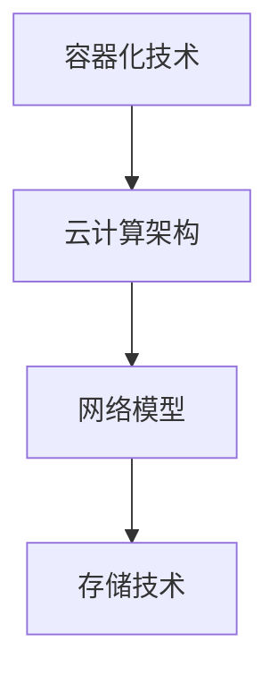

                 

本文将基于2024年华为云Stack校招面试真题，为大家提供一套全面而深入的解题指南。这些真题涵盖了从基础理论到高级应用的一系列问题，旨在测试应聘者的综合技术能力和解决实际问题的能力。本文旨在帮助读者理解题目背后的核心概念，掌握解题技巧，并准备好应对未来的面试挑战。

## 文章关键词

- 华为云
- Stack校招
- 面试真题
- 解题指南
- 技术能力

## 文章摘要

本文将汇总2024年华为云Stack校招面试中的热点问题，通过对每个题目的详细解析，帮助读者理解面试官的考察意图，掌握解题思路，提高面试成功率。文章将分为以下章节：

1. 背景介绍
2. 核心概念与联系
3. 核心算法原理 & 具体操作步骤
4. 数学模型和公式 & 详细讲解 & 举例说明
5. 项目实践：代码实例和详细解释说明
6. 实际应用场景
7. 工具和资源推荐
8. 总结：未来发展趋势与挑战
9. 附录：常见问题与解答

---

### 1. 背景介绍

华为云Stack是华为公司推出的云服务解决方案，旨在帮助企业和开发者快速搭建和管理云平台。2024年华为云Stack校招面试旨在选拔具备扎实技术基础和解决实际问题的能力的人才。本文将对近年来出现的面试真题进行分类解析，旨在帮助读者深入了解华为云Stack的技术要点和面试策略。

### 2. 核心概念与联系

**核心概念原理：** 

- **容器化技术**：Docker等容器技术的基本概念和原理。
- **云计算架构**：公共云、私有云和混合云的区别与应用。
- **网络模型**：OSI七层模型和TCP/IP四层模型的对比与联系。
- **存储技术**：块存储、对象存储和文件存储的特点与应用场景。

**架构的 Mermaid 流程图**：



### 3. 核心算法原理 & 具体操作步骤

#### 3.1 算法原理概述

在华为云Stack的面试中，经常涉及以下核心算法：

- **负载均衡算法**：如轮询、最少连接和源IP哈希算法。
- **数据库查询优化**：如索引、缓存和分库分表技术。
- **分布式一致性算法**：如Paxos和Raft算法。

#### 3.2 算法步骤详解

**负载均衡算法：**

- **轮询算法**：按顺序分配请求到各个服务器。
- **最少连接算法**：分配请求到当前连接数最少的服务器。
- **源IP哈希算法**：根据源IP地址的哈希值分配请求。

**数据库查询优化：**

- **索引**：在数据表中创建索引以提高查询效率。
- **缓存**：将经常访问的数据缓存在内存中以减少查询延迟。
- **分库分表技术**：将数据分散存储在多个数据库和表中，以提高系统的可扩展性和性能。

#### 3.3 算法优缺点

- **负载均衡算法**：轮询算法简单易用，但可能导致部分服务器负载不均衡；最少连接算法和源IP哈希算法更智能，但实现复杂度更高。
- **数据库查询优化**：索引和缓存能够显著提高查询性能，但过度索引和缓存可能导致存储空间浪费；分库分表技术提高了系统的可扩展性，但增加了数据一致性的复杂性。

#### 3.4 算法应用领域

- **负载均衡算法**：广泛应用于网站、API接口和高并发应用。
- **数据库查询优化**：在大型分布式系统中，如电商平台和社交媒体平台，用于提高数据查询效率。

### 4. 数学模型和公式 & 详细讲解 & 举例说明

**数学模型构建：**

在解决华为云Stack相关问题时，数学模型是关键。以下是一个典型的数学模型示例：

- **排队模型**：M/M/1模型，用于描述单服务器排队系统。

**公式推导过程：**

$$
L = \frac{\lambda^2}{\mu(1-\lambda)}
$$

$$
W = \frac{L}{\lambda}
$$

其中，\(L\) 为平均等待时间，\(W\) 为平均服务时间，\(\lambda\) 为到达率，\(\mu\) 为服务率。

**案例分析与讲解：**

假设一个服务器的到达率为每分钟10个客户，平均服务时间为1分钟。根据M/M/1模型，我们可以计算出平均等待时间和平均服务时间。

$$
L = \frac{10^2}{1(1-10)} = 100
$$

$$
W = \frac{100}{10} = 10
$$

因此，平均等待时间为10分钟，平均服务时间为1分钟。

### 5. 项目实践：代码实例和详细解释说明

#### 5.1 开发环境搭建

在开始项目实践之前，我们需要搭建一个合适的环境。以下是搭建一个基于Docker的简单Web服务器的步骤：

1. 安装Docker：在Ubuntu系统上使用以下命令安装Docker。
```bash
sudo apt-get update
sudo apt-get install docker.io
```

2. 启动Docker服务：运行以下命令启动Docker服务。
```bash
sudo systemctl start docker
```

3. 编写Dockerfile：创建一个名为`Dockerfile`的文件，内容如下。
```dockerfile
FROM python:3.8-slim
WORKDIR /app
COPY . .
RUN pip install -r requirements.txt
CMD ["python", "app.py"]
```

4. 构建Docker镜像：在终端中运行以下命令。
```bash
docker build -t my-web-server .
```

5. 运行Docker容器：运行以下命令启动一个Docker容器。
```bash
docker run -d -p 8080:80 my-web-server
```

#### 5.2 源代码详细实现

以下是一个简单的Flask Web服务器的Python代码示例。

```python
from flask import Flask

app = Flask(__name__)

@app.route('/')
def hello():
    return 'Hello, World!'

if __name__ == '__main__':
    app.run(host='0.0.0.0', port=8080)
```

#### 5.3 代码解读与分析

这段代码首先导入了Flask库，然后创建了一个名为`hello`的函数，用于处理根路径的HTTP请求。在`if __name__ == '__main__':`语句中，我们调用了`app.run()`函数来启动Web服务器，并指定了主机地址和端口号。

#### 5.4 运行结果展示

在浏览器中输入`http://localhost:8080/`，你应该会看到如下结果：
```
Hello, World!
```

这表明Web服务器已成功启动并运行。

### 6. 实际应用场景

华为云Stack在多个实际应用场景中发挥着重要作用，如下所述：

- **云计算基础设施搭建**：为企业提供灵活、可靠的云服务，支持大规模数据处理和业务扩展。
- **容器化应用部署**：通过Docker等容器技术，实现应用的快速部署、管理和扩展。
- **大数据分析**：利用华为云Stack提供的数据存储和计算服务，实现高效的数据分析和挖掘。
- **AI应用开发**：提供丰富的AI工具和模型，支持AI算法的研发和部署。

### 7. 工具和资源推荐

#### 7.1 学习资源推荐

- **华为云官方文档**：提供详细的云服务产品介绍和技术文档。
- **《云计算技术：原理、应用与实现》**：一本全面的云计算技术教材。
- **《Docker实战》**：介绍Docker容器技术的权威指南。

#### 7.2 开发工具推荐

- **Visual Studio Code**：一款强大的代码编辑器，支持多种编程语言和扩展。
- **Postman**：用于API测试和开发的一款优秀工具。
- **Docker Desktop**：Docker官方提供的桌面应用，用于本地Docker环境的搭建和管理。

#### 7.3 相关论文推荐

- **《云计算中的负载均衡算法研究》**
- **《基于Docker的容器化应用部署与优化》**
- **《大数据处理中的存储与计算优化技术》**

### 8. 总结：未来发展趋势与挑战

随着云计算技术的不断发展和创新，华为云Stack在未来将面临以下发展趋势和挑战：

- **云原生技术的普及**：容器化、服务网格和微服务架构将推动云原生技术的广泛应用。
- **数据安全和隐私保护**：如何确保数据的安全和用户隐私成为云计算领域的重要课题。
- **人工智能与云计算的融合**：利用人工智能技术优化云计算资源管理和应用性能。

### 9. 附录：常见问题与解答

**Q1：什么是云原生技术？**

A1：云原生技术是指为云环境设计、构建和运行的应用程序。云原生应用程序通常采用容器化、服务网格和微服务架构，以实现高效、可扩展和灵活的部署和管理。

**Q2：如何优化Docker容器性能？**

A2：优化Docker容器性能的方法包括使用合适的硬件资源、优化Docker镜像、减少容器启动时间、优化容器网络配置等。

**Q3：什么是微服务架构？**

A3：微服务架构是一种将应用程序分解为多个小型、独立的服务的方法。每个服务负责特定的功能，可以独立开发、部署和扩展，从而提高系统的可扩展性和容错性。

---

作者：禅与计算机程序设计艺术 / Zen and the Art of Computer Programming

通过本文的解析，相信读者已经对2024年华为云Stack校招面试真题有了更深入的理解。希望这篇文章能帮助大家更好地准备面试，并在未来的技术道路上取得更大的成就。|user|

