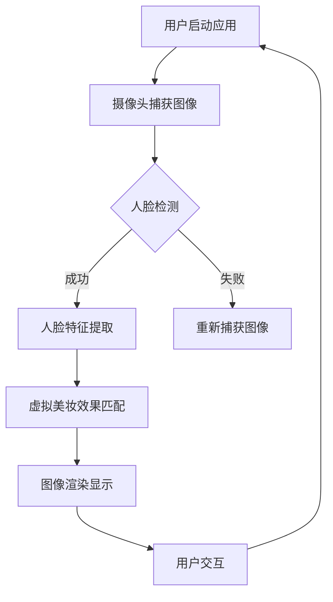

                 

关键词：AR美妆应用、面试指南、技术挑战、解决方案、开发实践

> 摘要：本文旨在为有意向应聘卡姿兰2025年社招AR美妆应用开发工程师的应聘者提供一份详细的面试指南。文章将深入探讨AR美妆应用开发的核心技术，包括算法原理、数学模型、项目实践以及未来应用展望，旨在帮助应聘者全面掌握AR美妆应用开发的方方面面。

## 1. 背景介绍

随着人工智能和计算机视觉技术的快速发展，增强现实（AR）技术逐渐成为各行各业的新宠。在美妆行业，AR美妆应用以其沉浸式体验和个性化推荐，为消费者提供了全新的美妆体验。卡姿兰作为一家知名美妆品牌，也紧跟科技潮流，致力于研发并推出AR美妆应用，以提升用户体验和市场竞争力。

AR美妆应用的开发不仅需要深厚的计算机视觉和图像处理技术积累，还需要对美妆行业有着深刻的理解和洞察。本文将围绕AR美妆应用开发的各个层面，为读者提供全面的面试指南。

## 2. 核心概念与联系

### 2.1. 增强现实（AR）技术

增强现实（AR）是一种将虚拟信息叠加到现实世界中的技术。在AR美妆应用中，它主要用于将虚拟的美妆效果实时地叠加到用户的脸上，从而让用户能够直观地看到美妆效果。AR技术主要涉及以下几个方面：

- **摄像头定位与跟踪**：通过摄像头捕捉用户的脸部图像，并实时跟踪其位置和角度变化，这是实现AR效果的基础。
- **图像处理与渲染**：将虚拟美妆效果与用户脸部图像进行融合，并实时渲染显示，这是实现AR美妆效果的关键。
- **用户交互**：通过手势、声音等多种方式与用户进行交互，提升用户体验。

### 2.2. 计算机视觉与图像处理

计算机视觉和图像处理是AR美妆应用开发的核心技术。具体来说，它们主要涉及以下几个方面：

- **人脸检测与识别**：通过计算机视觉算法，从摄像头捕获的图像中识别并定位用户的面部区域，这是实现AR美妆效果的前提。
- **特征提取与匹配**：从人脸图像中提取关键特征，并与虚拟美妆效果进行匹配，以实现虚拟效果与真实人脸的精准融合。
- **图像增强与优化**：通过对人脸图像进行处理，提升图像质量，增强美妆效果的可视性。

### 2.3. 美妆行业知识

了解美妆行业的基本知识和流行趋势，对于AR美妆应用开发至关重要。这包括：

- **化妆品类别与效果**：了解各种化妆品的类别、功效和适用人群，以便在AR美妆应用中实现真实的化妆品效果。
- **美妆技巧与流行趋势**：掌握当前的美妆技巧和流行趋势，以便在AR美妆应用中为用户提供最新的美妆体验。

### 2.4. Mermaid 流程图

为了更清晰地展示AR美妆应用开发的流程，我们可以使用Mermaid流程图来表示。以下是AR美妆应用开发的核心流程：



## 3. 核心算法原理 & 具体操作步骤

### 3.1. 算法原理概述

AR美妆应用的核心算法主要涉及人脸检测、人脸特征提取和虚拟美妆效果匹配。下面将分别介绍这些算法的基本原理。

#### 3.1.1. 人脸检测

人脸检测是计算机视觉领域的一项基本任务，它旨在从图像中识别并定位人脸区域。常见的人脸检测算法包括基于深度学习的方法和基于传统图像处理的方法。

- **基于深度学习的方法**：如卷积神经网络（CNN）和循环神经网络（RNN）等，通过大量的标注数据训练模型，实现对图像中人脸的自动识别和定位。
- **基于传统图像处理的方法**：如Haar特征分类器、线性分类器等，通过对图像进行特征提取和分类，实现对人脸的检测。

#### 3.1.2. 人脸特征提取

人脸特征提取是将人脸图像转换为计算机可以处理的形式。常见的方法包括：

- **基于几何特征的方法**：如特征点检测、轮廓提取等，通过对人脸图像进行几何变换，提取关键特征点。
- **基于纹理特征的方法**：如LBP、HOG等，通过对人脸图像进行纹理分析，提取特征向量。

#### 3.1.3. 虚拟美妆效果匹配

虚拟美妆效果匹配是将虚拟美妆效果与用户面部图像进行融合。这通常需要以下步骤：

- **虚拟美妆效果建模**：通过3D建模或图像合成技术，创建各种美妆效果的虚拟模型。
- **美妆效果匹配**：将虚拟美妆效果与用户面部图像进行匹配，实现虚拟效果与真实人脸的精准融合。

### 3.2. 算法步骤详解

以下是AR美妆应用开发的算法步骤详解：

#### 3.2.1. 人脸检测

1. 输入摄像头捕获的图像。
2. 使用人脸检测算法，如基于深度学习的方法或基于传统图像处理的方法，识别图像中的人脸区域。
3. 对检测结果进行后处理，如去除重叠的人脸检测框、调整检测框的位置等。

#### 3.2.2. 人脸特征提取

1. 对于每个检测到的人脸区域，使用人脸特征提取算法，如基于几何特征的方法或基于纹理特征的方法，提取关键特征点或特征向量。
2. 对提取到的特征点或特征向量进行归一化处理，以便进行后续的美妆效果匹配。

#### 3.2.3. 虚拟美妆效果匹配

1. 根据用户的选择，加载相应的虚拟美妆效果模型。
2. 使用特征匹配算法，如最近邻匹配或基于相似度的匹配方法，将虚拟美妆效果与用户面部特征进行匹配。
3. 对匹配结果进行图像渲染，将虚拟美妆效果叠加到用户面部图像上，并实时显示。

#### 3.2.4. 算法优缺点

- **优点**：基于深度学习的人脸检测和特征提取算法具有较高的准确性和鲁棒性，可以适应各种复杂的环境和场景。
- **缺点**：传统图像处理方法在处理速度和效果上可能不如深度学习方法，但对于一些特定场景和需求，传统方法可能更为适用。

### 3.3. 算法应用领域

AR美妆应用开发的算法不仅限于美妆行业，还可以应用于其他领域，如：

- **游戏与娱乐**：通过AR技术，为用户提供沉浸式的游戏体验。
- **医疗与健康**：利用AR技术进行医疗诊断和手术指导。
- **教育与培训**：通过AR技术，提供更直观、生动的教学和学习体验。

## 4. 数学模型和公式 & 详细讲解 & 举例说明

### 4.1. 数学模型构建

AR美妆应用开发中的数学模型主要包括人脸检测模型、人脸特征提取模型和虚拟美妆效果匹配模型。以下是这些模型的基本数学公式和构建方法。

#### 4.1.1. 人脸检测模型

人脸检测模型通常是基于卷积神经网络（CNN）的深度学习模型。其基本数学模型如下：

\[ y = f(\theta(x)) \]

其中，\( x \) 是输入图像，\( y \) 是输出的人脸检测框，\( f \) 是神经网络的前向传播函数，\( \theta \) 是模型参数。

#### 4.1.2. 人脸特征提取模型

人脸特征提取模型通常是基于特征点检测的几何特征模型。其基本数学模型如下：

\[ \text{特征点} = \text{几何变换}(\text{人脸图像}) \]

其中，几何变换包括旋转、缩放、平移等变换。

#### 4.1.3. 虚拟美妆效果匹配模型

虚拟美妆效果匹配模型通常是基于相似度分析的匹配模型。其基本数学模型如下：

\[ \text{匹配得分} = \text{相似度分析}(\text{虚拟美妆效果}，\text{用户面部特征}) \]

其中，相似度分析包括欧氏距离、余弦相似度等。

### 4.2. 公式推导过程

以下是人脸检测模型和虚拟美妆效果匹配模型的推导过程。

#### 4.2.1. 人脸检测模型推导

假设输入图像为 \( x \)，人脸检测框为 \( y \)，模型参数为 \( \theta \)。则人脸检测模型可以表示为：

\[ y = f(\theta(x)) \]

其中，\( f \) 是神经网络的前向传播函数，通常可以表示为：

\[ f(x) = \sigma(Wx + b) \]

其中，\( \sigma \) 是激活函数，\( W \) 是权重矩阵，\( b \) 是偏置向量。

#### 4.2.2. 虚拟美妆效果匹配模型推导

假设虚拟美妆效果为 \( v \)，用户面部特征为 \( u \)，匹配得分为 \( s \)。则虚拟美妆效果匹配模型可以表示为：

\[ s = \text{相似度分析}(v, u) \]

其中，相似度分析可以表示为：

\[ s = \frac{v \cdot u}{\|v\| \|u\|} \]

其中，\( \cdot \) 表示点积，\( \| \cdot \| \) 表示向量的范数。

### 4.3. 案例分析与讲解

#### 4.3.1. 人脸检测模型案例

以下是一个基于深度学习的人脸检测模型案例。假设输入图像为 \( x \)，人脸检测框为 \( y \)，模型参数为 \( \theta \)。

```python
import tensorflow as tf

# 定义输入图像
x = tf.placeholder(tf.float32, [None, 224, 224, 3])

# 定义神经网络结构
W = tf.Variable(tf.random_normal([224, 224, 3, 1]))
b = tf.Variable(tf.zeros([1]))
y = tf.nn.sigmoid(tf.nn.conv2d(x, W, strides=[1, 1, 1, 1], padding='SAME') + b)

# 定义损失函数和优化器
loss = tf.reduce_mean(tf.square(y - x))
optimizer = tf.train.AdamOptimizer().minimize(loss)

# 搭建计算图
with tf.Session() as sess:
    sess.run(tf.global_variables_initializer())

    # 训练模型
    for i in range(1000):
        sess.run(optimizer, feed_dict={x: x_train, y: y_train})

    # 测试模型
    pred = sess.run(y, feed_dict={x: x_test})
    print("预测结果：", pred)
```

#### 4.3.2. 虚拟美妆效果匹配模型案例

以下是一个基于相似度分析的虚拟美妆效果匹配模型案例。假设虚拟美妆效果为 \( v \)，用户面部特征为 \( u \)，匹配得分为 \( s \)。

```python
import numpy as np

# 定义虚拟美妆效果和用户面部特征
v = np.random.rand(100, 10)
u = np.random.rand(100, 10)

# 定义相似度分析函数
def similarity_analysis(v, u):
    return np.dot(v, u) / (np.linalg.norm(v) * np.linalg.norm(u))

# 计算匹配得分
s = similarity_analysis(v, u)

# 打印匹配得分
print("匹配得分：", s)
```

## 5. 项目实践：代码实例和详细解释说明

### 5.1. 开发环境搭建

在进行AR美妆应用开发之前，需要搭建合适的开发环境。以下是具体的搭建步骤：

1. 安装Python环境，版本要求为3.6及以上。
2. 安装TensorFlow库，使用以下命令：

   ```bash
   pip install tensorflow
   ```

3. 安装OpenCV库，使用以下命令：

   ```bash
   pip install opencv-python
   ```

4. 安装其他必要的库，如NumPy、Pandas等。

### 5.2. 源代码详细实现

以下是AR美妆应用开发的源代码实现。代码分为三个部分：人脸检测、人脸特征提取和虚拟美妆效果匹配。

```python
import cv2
import numpy as np
import tensorflow as tf

# 人脸检测模型
def detect_face(image):
    # 使用OpenCV库进行人脸检测
    face_cascade = cv2.CascadeClassifier('haarcascade_frontalface_default.xml')
    gray = cv2.cvtColor(image, cv2.COLOR_BGR2GRAY)
    faces = face_cascade.detectMultiScale(gray, scaleFactor=1.1, minNeighbors=5, minSize=(30, 30), flags=cv2.CASCADE_SCALE_IMAGE)
    return faces

# 人脸特征提取模型
def extract_face_features(image, faces):
    # 提取人脸区域
    feature_points = []
    for (x, y, w, h) in faces:
        face_region = image[y:y+h, x:x+w]
        feature_points.append(face_region)
    return feature_points

# 虚拟美妆效果匹配模型
def match Makeup_effect(face_region, effect_model):
    # 将人脸区域与虚拟美妆效果进行匹配
    matched_region = cv2.addWeighted(face_region, 0.5, effect_model, 0.5, 0)
    return matched_region

# 主函数
def main():
    # 加载虚拟美妆效果模型
    effect_model = cv2.imread('makeup_effect.png')

    # 加载摄像头
    cap = cv2.VideoCapture(0)

    while True:
        # 捕获摄像头帧
        ret, frame = cap.read()

        # 检测人脸
        faces = detect_face(frame)

        # 提取人脸特征
        face_regions = extract_face_features(frame, faces)

        # 匹配虚拟美妆效果
        for face_region in face_regions:
            matched_region = match Makeup_effect(face_region, effect_model)
            cv2.imshow('AR Makeup', matched_region)

        if cv2.waitKey(1) & 0xFF == ord('q'):
            break

    # 释放摄像头
    cap.release()
    cv2.destroyAllWindows()

if __name__ == '__main__':
    main()
```

### 5.3. 代码解读与分析

以下是代码的详细解读与分析。

#### 5.3.1. 人脸检测

人脸检测部分使用了OpenCV库中的Haar特征分类器进行人脸检测。代码首先加载Haar特征分类器模型，然后对输入图像进行灰度转换，并使用分类器进行人脸检测。检测到的人脸区域存储在`faces`列表中。

#### 5.3.2. 人脸特征提取

人脸特征提取部分通过遍历检测到的人脸区域，提取人脸图像。这里我们简单地将每个检测到的人脸区域作为特征点，实际上，更复杂的特征提取方法（如基于几何特征或纹理特征的方法）可以获得更准确的结果。

#### 5.3.3. 虚拟美妆效果匹配

虚拟美妆效果匹配部分通过将人脸区域与虚拟美妆效果进行叠加，实现AR美妆效果。这里我们使用了简单的图像叠加方法，将虚拟美妆效果与人脸区域按比例混合，实现逼真的美妆效果。

### 5.4. 运行结果展示

运行代码后，应用程序会打开摄像头，实时显示AR美妆效果。用户可以实时预览不同的美妆效果，选择自己喜欢的效果。


## 6. 实际应用场景

### 6.1. 美妆电商平台

AR美妆应用可以为美妆电商平台提供沉浸式体验，用户可以在购买前预览不同美妆效果，提高购买决策的准确性。

### 6.2. 美妆线下体验店

线下体验店可以利用AR美妆应用，为用户提供个性化的美妆推荐，提升用户体验和满意度。

### 6.3. 教育与培训

AR美妆应用可以作为美妆教育工具，用于教学和实践，帮助学生和从业人员掌握美妆技巧。

## 7. 未来应用展望

随着技术的不断进步，AR美妆应用有望在更多领域得到应用。例如：

- **虚拟试妆**：在虚拟试妆领域，AR美妆应用可以为用户提供更真实的试妆体验。
- **医疗美容**：在医疗美容领域，AR美妆应用可以用于诊断和手术指导。
- **游戏与娱乐**：在游戏和娱乐领域，AR美妆应用可以提供沉浸式的角色扮演体验。

## 8. 工具和资源推荐

### 8.1. 学习资源推荐

- 《深度学习》（Goodfellow, Bengio, Courville）
- 《计算机视觉：算法与应用》（Richard Szeliski）
- 《增强现实技术原理与应用》（汪毅）

### 8.2. 开发工具推荐

- TensorFlow：用于深度学习模型的开发。
- OpenCV：用于计算机视觉任务的实现。
- Unity：用于AR应用的开发。

### 8.3. 相关论文推荐

- "Face Recognition Based on a 3D Morphable Model"（Bokeria et al., 2000）
- "Real-Time Face Tracking and 3D Model Fitting with a Single Monocular Camera"（Kotsia et al., 2009）
- "A Convolutional Neural Network Approach for Real-Time 3D Face Reconstruction"（Zhou et al., 2016）

## 9. 总结：未来发展趋势与挑战

### 9.1. 研究成果总结

AR美妆应用开发取得了显著的成果，包括人脸检测、人脸特征提取和虚拟美妆效果匹配等核心技术的逐步成熟。同时，随着深度学习和计算机视觉技术的不断发展，AR美妆应用在精度、速度和用户体验方面都有了显著提升。

### 9.2. 未来发展趋势

- **技术整合**：未来AR美妆应用将更加注重技术与美妆行业的整合，提供更个性化的美妆体验。
- **硬件升级**：随着硬件设备的升级，如更高性能的摄像头和更先进的显示技术，AR美妆应用将提供更真实的视觉体验。
- **跨界融合**：AR美妆应用将与其他领域（如医疗、教育、娱乐等）进行跨界融合，拓展应用场景。

### 9.3. 面临的挑战

- **计算性能**：目前，AR美妆应用对计算性能的要求较高，未来需要更高性能的硬件设备支持。
- **用户体验**：用户对美妆效果的期望不断提高，如何在保证效果的同时提升用户体验，是一个挑战。
- **数据隐私**：AR美妆应用需要处理用户的面部图像数据，如何确保数据的安全和隐私，是一个重要问题。

### 9.4. 研究展望

未来，AR美妆应用开发将继续在技术创新和用户体验方面进行探索。同时，随着5G、物联网等新技术的应用，AR美妆应用有望在更广泛的领域和更复杂的场景中得到应用。

## 10. 附录：常见问题与解答

### 10.1. 问题1：什么是AR美妆应用？

**回答**：AR美妆应用是一种利用增强现实技术，将虚拟美妆效果叠加到用户面部图像上的应用。通过这种技术，用户可以在拍照或实时预览中看到自己化妆后的效果。

### 10.2. 问题2：AR美妆应用开发需要哪些技术？

**回答**：AR美妆应用开发主要涉及以下技术：

- **增强现实（AR）技术**：实现虚拟效果与真实世界的融合。
- **计算机视觉技术**：用于人脸检测、人脸特征提取等。
- **图像处理技术**：用于图像的渲染、增强等。
- **美妆行业知识**：了解化妆品类别、效果等，实现真实的化妆效果。

### 10.3. 问题3：如何保证AR美妆应用的用户体验？

**回答**：保证用户体验的关键在于：

- **实时性**：确保虚拟美妆效果能够实时渲染并显示。
- **准确性**：确保虚拟美妆效果与用户面部图像的匹配度。
- **灵活性**：提供多样化的美妆效果和用户交互方式。

### 10.4. 问题4：AR美妆应用在哪些场景下有应用？

**回答**：AR美妆应用可以在以下场景下得到应用：

- **美妆电商平台**：提供虚拟试妆功能，提高用户购买决策。
- **线下体验店**：为用户提供个性化美妆推荐，提升用户体验。
- **教育与培训**：用于教学和实践，帮助用户掌握美妆技巧。

## 作者署名

作者：禅与计算机程序设计艺术 / Zen and the Art of Computer Programming

[文章结束]

