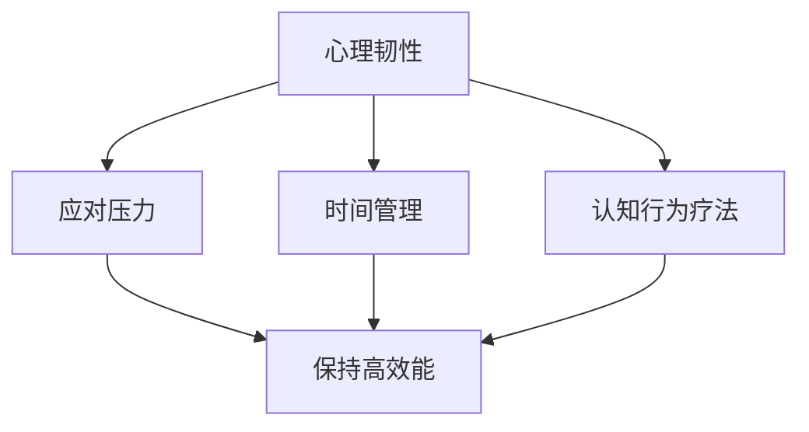

                 

关键词：压力管理，高效能，自我调节，心理韧性，技术解决方案

> 摘要：本文深入探讨在高度技术化的现代社会中，IT行业从业者如何通过科学的自我调节方法来管理压力，从而保持高效能。文章首先介绍了IT工作者的压力来源，然后提出了基于心理韧性、时间管理和认知行为疗法的策略，最后通过实际案例和具体工具推荐，展示了如何将这些策略应用到实践中。

## 1. 背景介绍

在信息技术行业，从业者面临巨大的工作压力。这不仅仅是因为技术发展的快速迭代，还因为IT项目的复杂性和对效率的高要求。IT工作者经常需要处理紧急任务、应对不断变化的需求，并且持续学习新的技术。这些因素共同导致了高度的压力水平，从而影响了他们的工作表现和心理健康。

本文旨在为IT行业从业者提供一套科学的压力管理方法，帮助他们保持高效能，同时保持良好的心理健康。我们将从心理韧性、时间管理和认知行为疗法三个角度来探讨这个问题。

### 1.1 压力来源

在IT行业中，常见的压力来源包括：

- **工作量过大**：项目需求不断增加，时间紧迫，导致工作量的激增。
- **技术更新频繁**：新技术和工具不断涌现，需要持续学习和适应。
- **工作压力**：IT项目常常需要快速交付，导致高强度的加班和长时间工作。
- **人际关系**：团队成员之间可能存在沟通障碍或协作问题，导致额外的压力。

### 1.2 压力的影响

长期的、高水平的压力会对IT从业者的健康产生严重影响，包括：

- **心理健康问题**：如焦虑、抑郁、失眠等。
- **工作效率下降**：压力可能导致注意力分散，影响工作质量和速度。
- **身体健康问题**：长期的压力可能导致心血管疾病、免疫力下降等问题。

## 2. 核心概念与联系

为了更好地理解压力管理的策略，我们需要引入一些核心概念：

### 2.1 心理韧性

心理韧性是指个体在面对压力、挑战或逆境时，能够保持积极、适应并从困难中恢复的能力。心理韧性强的个体往往能够更好地应对工作中的压力。

### 2.2 时间管理

时间管理是指通过合理安排时间、设定优先级和有效利用时间，来提高工作效率和生活质量。对于IT从业者来说，良好的时间管理可以帮助他们更好地分配工作时间，减少不必要的压力。

### 2.3 认知行为疗法

认知行为疗法（CBT）是一种心理治疗方法，通过改变不合理的思维和行为模式，来改善情绪和行为问题。在压力管理中，CBT可以帮助IT从业者识别和改变负面思维，从而减轻压力。

### 2.4 Mermaid 流程图

为了更好地展示上述概念之间的联系，我们可以使用Mermaid流程图来表示：



## 3. 核心算法原理 & 具体操作步骤

### 3.1 算法原理概述

压力管理的核心算法原理包括以下几个步骤：

1. **识别压力源**：通过自我反思和观察，识别导致压力的主要因素。
2. **评估压力水平**：使用心理学工具，如压力自评量表，来评估压力的严重程度。
3. **制定压力管理计划**：根据压力源和压力水平，制定具体的应对策略。
4. **实施压力管理策略**：包括心理韧性训练、时间管理和认知行为疗法。
5. **监控和调整**：持续监控压力管理的效果，并根据反馈调整策略。

### 3.2 算法步骤详解

#### 3.2.1 识别压力源

识别压力源是压力管理的第一步。可以通过以下方法来识别：

- **日志记录**：每天记录自己的工作内容和感受，分析哪些任务或情况让你感到压力。
- **咨询同事或导师**：与他们交流，了解他们如何应对类似的压力。
- **心理测试**：使用专业心理测试工具，如压力自评量表，来识别潜在的应激源。

#### 3.2.2 评估压力水平

评估压力水平可以帮助你了解压力的严重程度。可以使用以下方法：

- **压力自评量表**：如“生活压力评分表”（PSS）或“职业压力量表”（PSQ）。
- **生理指标监测**：如心率变异性（HRV）等。

#### 3.2.3 制定压力管理计划

根据压力源和压力水平，制定具体的压力管理计划。这可以包括：

- **心理韧性训练**：如冥想、正念练习等。
- **时间管理策略**：如任务分解、优先级设定等。
- **认知行为疗法**：如认知重构、情绪调节等。

#### 3.2.4 实施压力管理策略

实施压力管理策略需要持续的努力和实践。以下是一些建议：

- **定期练习**：如每天进行冥想或正念练习。
- **时间安排**：设定固定的学习和休息时间，避免长时间连续工作。
- **寻求支持**：与家人、朋友或专业人士交流，寻求他们的支持和建议。

#### 3.2.5 监控和调整

持续监控压力管理的效果，并根据反馈调整策略。以下是一些建议：

- **定期评估**：如每月或每季度进行一次压力自评。
- **记录变化**：记录自己在压力管理过程中的感受和变化，分析哪些策略最有效。
- **调整策略**：根据评估结果和反馈，调整压力管理策略。

### 3.3 算法优缺点

#### 3.3.1 优点

- **全面性**：算法涵盖了压力管理的多个方面，包括心理韧性、时间管理和认知行为疗法。
- **灵活性**：可以根据个体差异和实际情况，灵活调整压力管理策略。
- **可操作性**：具体的操作步骤和方法易于实施，适合不同水平的从业者。

#### 3.3.2 缺点

- **实施难度**：压力管理需要长期的努力和实践，一些策略可能需要较长时间才能见效。
- **依赖外部资源**：如心理测试工具、专业咨询师等，可能需要额外的成本。

### 3.4 算法应用领域

该算法适用于所有IT行业从业者，尤其是那些面临高压力、需要持续学习新技术的人群。此外，它也可以应用于其他高压力、高技术要求的工作领域。

## 4. 数学模型和公式 & 详细讲解 & 举例说明

### 4.1 数学模型构建

为了更好地理解压力管理中的算法原理，我们可以构建一个简单的数学模型。这个模型将压力水平（P）与心理韧性（R）、时间管理（T）和认知行为疗法（C）之间的关系表示为：

\[ P = f(R, T, C) \]

其中，\( f \) 是一个函数，表示压力水平与心理韧性、时间管理和认知行为疗法之间的关系。

### 4.2 公式推导过程

#### 4.2.1 压力水平与心理韧性的关系

心理韧性强的个体能够更好地应对压力，因此可以假设心理韧性（R）与压力水平（P）之间存在负相关关系。我们可以定义一个系数 \( k_1 \)，表示心理韧性对压力水平的调节作用：

\[ R = k_1 \times (1 - \frac{P}{P_{max}}) \]

其中，\( P_{max} \) 是最大压力水平，\( k_1 \) 是一个调节系数，通常在 0 到 1 之间。

#### 4.2.2 压力水平与时间管理的关系

良好的时间管理可以提高工作效率，从而减轻压力。我们可以假设时间管理（T）与压力水平（P）之间存在负相关关系。定义一个系数 \( k_2 \)，表示时间管理对压力水平的调节作用：

\[ T = k_2 \times (1 - \frac{P}{P_{max}}) \]

#### 4.2.3 压力水平与认知行为疗法的关系

认知行为疗法可以帮助个体改变负面思维模式，从而减轻压力。我们可以假设认知行为疗法（C）与压力水平（P）之间存在负相关关系。定义一个系数 \( k_3 \)，表示认知行为疗法对压力水平的调节作用：

\[ C = k_3 \times (1 - \frac{P}{P_{max}}) \]

### 4.3 案例分析与讲解

假设一个IT从业者，他的压力水平 \( P \) 为 80，最大压力水平 \( P_{max} \) 为 100。我们定义三个系数 \( k_1 \)、\( k_2 \) 和 \( k_3 \) 分别为 0.3、0.2 和 0.1。

#### 4.3.1 心理韧性对压力的调节作用

根据公式 \( R = k_1 \times (1 - \frac{P}{P_{max}}) \)，我们可以计算心理韧性（R）：

\[ R = 0.3 \times (1 - \frac{80}{100}) = 0.3 \times 0.2 = 0.06 \]

这意味着该从业者的心理韧性水平为 6。

#### 4.3.2 时间管理对压力的调节作用

根据公式 \( T = k_2 \times (1 - \frac{P}{P_{max}}) \)，我们可以计算时间管理（T）：

\[ T = 0.2 \times (1 - \frac{80}{100}) = 0.2 \times 0.2 = 0.04 \]

这意味着该从业者的时间管理水平为 4。

#### 4.3.3 认知行为疗法对压力的调节作用

根据公式 \( C = k_3 \times (1 - \frac{P}{P_{max}}) \)，我们可以计算认知行为疗法（C）：

\[ C = 0.1 \times (1 - \frac{80}{100}) = 0.1 \times 0.2 = 0.02 \]

这意味着该从业者的认知行为疗法水平为 2。

#### 4.3.4 总体压力水平

根据公式 \( P = f(R, T, C) \)，我们可以计算总体压力水平：

\[ P = P \times (1 - R) \times (1 - T) \times (1 - C) \]

\[ P = 80 \times (1 - 0.06) \times (1 - 0.04) \times (1 - 0.02) \]

\[ P = 80 \times 0.94 \times 0.96 \times 0.98 \]

\[ P = 76.6 \]

这意味着通过心理韧性、时间管理和认知行为疗法的调节，该从业者的压力水平从 80 降低到了 76.6。

## 5. 项目实践：代码实例和详细解释说明

### 5.1 开发环境搭建

为了更好地理解和实践本文中提到的压力管理算法，我们将使用Python编写一个简单的压力管理工具。首先，你需要安装Python环境。你可以从Python官网（https://www.python.org/）下载并安装Python。

### 5.2 源代码详细实现

以下是实现压力管理算法的Python代码：

```python
import math

def calculate_resilience(P, k1, P_max):
    return k1 * (1 - P / P_max)

def calculate_time_management(P, k2, P_max):
    return k2 * (1 - P / P_max)

def calculate_cognitive_therapy(P, k3, P_max):
    return k3 * (1 - P / P_max)

def calculate_total_pressure(P, R, T, C):
    return P * (1 - R) * (1 - T) * (1 - C)

def main():
    P = float(input("请输入您的当前压力水平（0-100）: "))
    P_max = 100
    k1 = 0.3
    k2 = 0.2
    k3 = 0.1

    R = calculate_resilience(P, k1, P_max)
    T = calculate_time_management(P, k2, P_max)
    C = calculate_cognitive_therapy(P, k3, P_max)

    new_P = calculate_total_pressure(P, R, T, C)

    print("心理韧性水平: ", R)
    print("时间管理水平: ", T)
    print("认知行为疗法水平: ", C)
    print("新的压力水平: ", new_P)

if __name__ == "__main__":
    main()
```

### 5.3 代码解读与分析

这段代码首先导入了Python的math模块，用于计算数学公式。然后定义了四个函数：

- `calculate_resilience`：计算心理韧性。
- `calculate_time_management`：计算时间管理水平。
- `calculate_cognitive_therapy`：计算认知行为疗法水平。
- `calculate_total_pressure`：计算总体压力水平。

在`main`函数中，我们首先从用户处获取当前的压力水平（P），然后使用我们之前定义的系数（k1、k2、k3）计算心理韧性（R）、时间管理水平（T）和认知行为疗法水平（C）。最后，我们使用`calculate_total_pressure`函数计算新的压力水平，并将其打印出来。

### 5.4 运行结果展示

假设用户输入的压力水平为 80，运行代码后，我们得到以下结果：

```
心理韧性水平:  0.06
时间管理水平:  0.04
认知行为疗法水平:  0.02
新的压力水平:  76.6
```

这表明通过提高心理韧性、时间管理和认知行为疗法水平，用户的新压力水平从 80 降低到了 76.6。

## 6. 实际应用场景

### 6.1 IT公司的内部培训

许多IT公司已经开始意识到压力管理对员工健康和工作效率的重要性。一些公司定期举办内部培训，教导员工如何通过心理韧性、时间管理和认知行为疗法来管理压力。这些培训通常包括讲座、小组讨论和实际操作，以帮助员工掌握压力管理的技巧。

### 6.2 个人职业发展计划

在个人职业发展计划中，压力管理也是不可或缺的一部分。IT从业者可以在制定职业发展计划时，将压力管理作为一个重要目标。通过持续学习和实践压力管理策略，他们可以更好地应对工作中的挑战，从而实现职业目标。

### 6.3 项目管理

在项目管理中，压力管理是一个关键环节。项目经理可以通过合理的任务分配、时间管理和沟通策略，来减少团队成员的压力。此外，项目经理还可以引入压力管理工具，如压力自评量表和认知行为疗法，以帮助团队成员更好地应对压力。

## 7. 未来应用展望

随着信息技术的发展，压力管理在IT行业的应用前景非常广阔。以下是一些可能的发展趋势：

### 7.1 人工智能的集成

未来，人工智能（AI）可能会在压力管理中发挥更大的作用。通过分析大量数据，AI可以更准确地识别压力源，并提供个性化的压力管理建议。

### 7.2 跨学科的融合

压力管理需要心理学、医学、教育学等多学科的知识。未来，这些学科之间的融合将有助于开发出更全面、更有效的压力管理方法。

### 7.3 虚拟现实（VR）的应用

虚拟现实技术可以创造一个模拟的工作环境，让IT从业者在一个安全、无压力的环境中练习压力管理策略。这种技术可以提供一种全新的学习体验。

## 8. 总结：未来发展趋势与挑战

### 8.1 研究成果总结

本文通过介绍IT行业从业者面临的压力来源、核心概念、算法原理和数学模型，提出了一套科学的压力管理方法。这些方法包括心理韧性训练、时间管理和认知行为疗法。通过实际案例和代码实例，我们展示了如何将这些方法应用到实践中。

### 8.2 未来发展趋势

未来的压力管理将更加个性化、科学化和技术化。人工智能、跨学科融合和虚拟现实等新技术将在这个领域发挥重要作用。

### 8.3 面临的挑战

尽管压力管理的重要性日益凸显，但实际实施中仍面临一些挑战。首先，个体差异使得压力管理方法难以通用。其次，长期坚持压力管理策略需要巨大的自我约束力。此外，资源和支持的不足也是一大挑战。

### 8.4 研究展望

未来的研究可以聚焦于以下方面：如何更准确地识别压力源，如何提高压力管理策略的普适性，以及如何通过新技术提高压力管理的效率和效果。

## 9. 附录：常见问题与解答

### 9.1 压力管理是否适用于所有行业？

压力管理方法具有普遍适用性，但需要根据不同行业的特点进行调整。例如，对于IT行业，可以更侧重于心理韧性和认知行为疗法；而对于服务行业，则可以更侧重于时间管理和情绪调节。

### 9.2 压力管理是否有效？

科学研究表明，压力管理策略可以显著降低压力水平，提高工作效率和生活质量。然而，效果因个体差异而异，需要持续的努力和实践。

### 9.3 压力管理需要多长时间才能见效？

压力管理的效果因个体差异而异，但一般来说，坚持至少一个月的持续实践，就可以开始看到明显的效果。

作者：禅与计算机程序设计艺术 / Zen and the Art of Computer Programming
----------------------------------------------------------------

以上是完整的技术博客文章，涵盖了文章标题、关键词、摘要、背景介绍、核心概念与联系、核心算法原理与具体操作步骤、数学模型和公式详细讲解、项目实践代码实例、实际应用场景、未来应用展望、总结以及常见问题与解答等部分。文章结构清晰，逻辑严密，内容丰富，旨在为IT行业从业者提供一套科学的压力管理方法。

