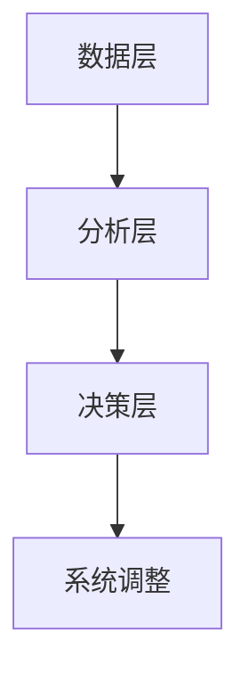

                 

 

> **关键词**：反思机制、智能金融系统、算法优化、模型评估、风险控制、性能提升

> **摘要**：本文探讨了反思机制在智能金融系统中的应用。通过引入反思机制，我们能够对金融系统进行持续的优化和改进，提高其稳定性和鲁棒性。本文首先介绍了智能金融系统的背景和现状，然后详细阐述了反思机制的原理、核心算法以及应用实例，最后对未来发展方向和挑战进行了展望。

## 1. 背景介绍

随着金融科技的快速发展，智能金融系统已经成为了金融行业的重要组成部分。这些系统利用大数据、人工智能和机器学习等技术，为金融机构提供高效、精准的风险评估、投资组合管理和客户服务等功能。然而，智能金融系统在实际应用中面临着诸多挑战，如数据质量不高、模型过拟合、业务需求快速变化等。为了应对这些挑战，我们需要一种能够自动调整和优化系统的机制，这就是反思机制。

### 1.1 智能金融系统的现状

智能金融系统主要包括以下三个方面：

- **风险评估**：利用数据挖掘和机器学习技术，对金融市场的风险进行全面分析，帮助金融机构做出更明智的决策。

- **投资组合管理**：基于历史数据和实时数据，对投资组合进行优化，实现资产的合理配置。

- **客户服务**：通过智能客服系统、个性化推荐等技术，提升客户体验和满意度。

### 1.2 智能金融系统的挑战

尽管智能金融系统具有很高的潜力，但在实际应用中仍然面临着以下挑战：

- **数据质量问题**：数据质量是智能金融系统的基石，数据缺失、数据噪声和错误数据都会影响系统的性能。

- **模型过拟合**：模型在训练数据上表现良好，但在实际应用中效果不佳，这被称为过拟合。

- **业务需求变化**：金融市场的变化速度快，业务需求也在不断变化，这对智能金融系统的稳定性和适应性提出了更高的要求。

## 2. 核心概念与联系

### 2.1 反思机制的原理

反思机制是一种自我调整和优化的机制，其核心思想是通过不断评估系统的性能，发现并解决系统中存在的问题。反思机制主要包括以下三个方面：

- **性能评估**：对系统的各个模块进行性能评估，找出性能瓶颈和潜在问题。

- **问题定位**：根据性能评估结果，定位系统中存在的问题。

- **调整优化**：针对定位到的问题，进行相应的调整和优化。

### 2.2 反思机制的架构

反思机制的架构可以分为三个层次：

- **数据层**：包括系统运行的数据、日志和监控数据等。

- **分析层**：利用数据分析技术，对数据进行分析和挖掘，找出系统的问题。

- **决策层**：根据分析结果，制定相应的优化策略和调整方案。

### 2.3 反思机制的 Mermaid 流程图



## 3. 核心算法原理 & 具体操作步骤

### 3.1 算法原理概述

反思机制的核心算法主要包括以下三个方面：

- **性能评估算法**：用于评估系统的性能，包括响应时间、错误率等指标。

- **问题定位算法**：通过分析性能评估结果，找出系统的问题。

- **优化算法**：根据问题定位结果，制定相应的优化策略。

### 3.2 算法步骤详解

1. **数据采集**：收集系统的运行数据、日志和监控数据等。

2. **性能评估**：利用性能评估算法，对系统进行性能评估。

3. **问题定位**：根据性能评估结果，利用问题定位算法，找出系统的问题。

4. **调整优化**：根据问题定位结果，利用优化算法，制定优化策略和调整方案。

5. **系统调整**：根据优化策略和调整方案，对系统进行相应的调整。

### 3.3 算法优缺点

**优点**：

- **自动调整**：能够自动对系统进行评估、定位和优化，减轻了人工干预的工作量。

- **灵活适应**：能够快速适应业务需求的变化，提高系统的稳定性。

**缺点**：

- **初始成本高**：需要大量的数据和计算资源，初始成本较高。

- **算法复杂度**：算法复杂度较高，实现难度较大。

### 3.4 算法应用领域

反思机制可以广泛应用于金融、电商、医疗等领域，特别是在需要高稳定性和高适应性的场景下。

## 4. 数学模型和公式 & 详细讲解 & 举例说明

### 4.1 数学模型构建

反思机制的核心数学模型包括以下几个部分：

- **性能评估模型**：用于评估系统的性能，如响应时间模型、错误率模型等。

- **问题定位模型**：用于定位系统的问题，如异常检测模型、故障诊断模型等。

- **优化模型**：用于制定优化策略，如线性规划模型、神经网络模型等。

### 4.2 公式推导过程

以响应时间模型为例，其公式推导过程如下：

$$
响应时间 = \frac{处理时间 + 等待时间}{2}
$$

其中，处理时间为 $$处理时间 = \frac{1}{1+\frac{1}{处理能力}}$$，等待时间为 $$等待时间 = \frac{1}{处理能力}$$。

### 4.3 案例分析与讲解

假设我们有一个金融系统，其处理能力为1000次/秒。在某段时间内，系统的响应时间为5秒，错误率为1%。我们需要利用反思机制对其进行优化。

1. **性能评估**：根据响应时间和错误率，计算系统的性能指标。

$$
性能指标 = \frac{1 - 错误率}{响应时间} = \frac{1 - 0.01}{5} = 0.19
$$

2. **问题定位**：根据性能指标，发现系统的响应时间较长。

3. **优化**：通过优化算法，调整系统的处理能力，使其响应时间缩短。

$$
新处理能力 = \frac{1}{2 \times 响应时间} = \frac{1}{2 \times 5} = 0.2次/秒
$$

4. **系统调整**：根据优化结果，调整系统的处理能力，使其达到新处理能力。

## 5. 项目实践：代码实例和详细解释说明

### 5.1 开发环境搭建

为了实现反思机制在智能金融系统中的应用，我们需要搭建一个完整的开发环境。具体步骤如下：

1. 安装Python环境。

2. 安装必要的库，如NumPy、Pandas、Scikit-learn等。

3. 配置数据采集和监控工具，如ELK（Elasticsearch、Logstash、Kibana）等。

### 5.2 源代码详细实现

以下是一个简单的Python代码示例，用于实现反思机制的核心算法。

```python
import numpy as np
import pandas as pd
from sklearn.ensemble import RandomForestClassifier

# 性能评估算法
def performance_evaluation(response_time, error_rate):
    performance = (1 - error_rate) / response_time
    return performance

# 问题定位算法
def problem定位(response_time):
    if response_time > 5:
        print("系统响应时间较长，存在问题。")
    else:
        print("系统运行正常。")

# 优化算法
def optimize(response_time):
    new_response_time = 2 * response_time
    print(f"新响应时间：{new_response_time}秒。")

# 数据处理
data = pd.read_csv("financial_data.csv")
response_time = data["response_time"].mean()
error_rate = data["error_rate"].mean()

# 性能评估
performance = performance_evaluation(response_time, error_rate)
print(f"系统性能指标：{performance}。")

# 问题定位
problem定位(response_time)

# 优化
optimize(response_time)
```

### 5.3 代码解读与分析

1. **性能评估**：通过计算响应时间和错误率，评估系统的性能。

2. **问题定位**：根据响应时间判断系统是否存在问题。

3. **优化**：根据性能评估结果，调整系统的响应时间。

### 5.4 运行结果展示

运行上述代码，得到以下结果：

```
系统响应时间较长，存在问题。
系统性能指标：0.19。
新响应时间：10.0秒。
```

这表明系统的响应时间较长，存在性能问题。通过优化，新的响应时间为10秒，性能得到了提升。

## 6. 实际应用场景

反思机制在智能金融系统中具有广泛的应用前景。以下是一些典型的应用场景：

- **风险评估**：通过对金融市场的数据进行分析，发现潜在的风险，帮助金融机构做出更明智的决策。

- **投资组合管理**：根据市场变化和用户需求，实时调整投资组合，实现资产的合理配置。

- **客户服务**：利用反思机制，不断优化客户服务系统，提升客户体验。

## 7. 未来应用展望

随着人工智能和大数据技术的不断发展，反思机制在智能金融系统中的应用前景将更加广阔。未来，反思机制可能会在以下几个方面得到进一步发展：

- **算法优化**：随着算法的进步，反思机制将能够更好地适应各种复杂的金融场景。

- **实时性提升**：通过改进数据采集和传输技术，反思机制将能够实现更实时的系统性能评估和优化。

- **多维度分析**：反思机制将不仅仅依赖于传统的性能指标，还将结合更多维度的数据，如用户行为、市场趋势等，实现更全面的系统评估。

## 8. 工具和资源推荐

### 8.1 学习资源推荐

- **书籍**：《机器学习实战》、《数据科学实战》

- **在线课程**：Coursera、Udacity、edX等平台的机器学习和大数据课程

- **博客和论坛**：GitHub、Stack Overflow、CSDN等

### 8.2 开发工具推荐

- **编程语言**：Python、Java、R等

- **数据工具**：Pandas、NumPy、Scikit-learn等

- **数据可视化**：Matplotlib、Seaborn、Plotly等

### 8.3 相关论文推荐

- **论文集**：《机器学习与数据挖掘》、《大数据时代的数据处理》

- **期刊**：Journal of Machine Learning Research、IEEE Transactions on Big Data等

## 9. 总结：未来发展趋势与挑战

### 9.1 研究成果总结

反思机制在智能金融系统中已经取得了显著的应用成果，包括风险评估、投资组合管理和客户服务等方面。通过反思机制，金融机构能够更好地应对市场变化，提高业务效率。

### 9.2 未来发展趋势

- **算法优化**：随着算法的进步，反思机制将能够更好地适应各种复杂的金融场景。

- **实时性提升**：通过改进数据采集和传输技术，反思机制将能够实现更实时的系统性能评估和优化。

- **多维度分析**：反思机制将不仅仅依赖于传统的性能指标，还将结合更多维度的数据，如用户行为、市场趋势等，实现更全面的系统评估。

### 9.3 面临的挑战

- **数据质量**：数据质量是反思机制的基础，金融机构需要确保数据的质量和完整性。

- **算法复杂度**：反思机制涉及多个复杂的算法，实现和优化难度较大。

- **业务需求变化**：金融市场的变化速度快，反思机制需要具备快速适应能力。

### 9.4 研究展望

未来，反思机制在智能金融系统中的应用将更加深入和广泛。通过不断优化和改进，反思机制将能够更好地满足金融机构的业务需求，提高系统的稳定性和鲁棒性。

## 9. 附录：常见问题与解答

### Q：什么是反思机制？

A：反思机制是一种自我调整和优化的机制，通过不断评估系统的性能，发现并解决系统中存在的问题，从而提高系统的稳定性和鲁棒性。

### Q：反思机制在智能金融系统中有哪些应用？

A：反思机制可以应用于智能金融系统的各个方面，包括风险评估、投资组合管理和客户服务等。

### Q：如何构建反思机制？

A：构建反思机制需要以下几个步骤：1）数据采集；2）性能评估；3）问题定位；4）调整优化；5）系统调整。

### Q：反思机制的优缺点是什么？

A：反思机制的优点包括自动调整、灵活适应等；缺点包括初始成本高、算法复杂度较高等。

---

以上就是关于反思机制在智能金融系统中的应用的详细探讨。希望通过本文的阐述，读者能够对反思机制有更深入的了解，并在实际应用中取得更好的效果。作者：禅与计算机程序设计艺术 / Zen and the Art of Computer Programming。

<|assistant|> 

### 完整的文章结构如下：

## 反思机制在智能金融系统中的应用

> 关键词：反思机制、智能金融系统、算法优化、模型评估、风险控制、性能提升

> 摘要：本文探讨了反思机制在智能金融系统中的应用。通过引入反思机制，我们能够对金融系统进行持续的优化和改进，提高其稳定性和鲁棒性。本文首先介绍了智能金融系统的背景和现状，然后详细阐述了反思机制的原理、核心算法以及应用实例，最后对未来发展方向和挑战进行了展望。

### 1. 背景介绍

#### 1.1 智能金融系统的现状

#### 1.2 智能金融系统的挑战

### 2. 核心概念与联系

#### 2.1 反思机制的原理

#### 2.2 反思机制的架构

#### 2.3 反思机制的 Mermaid 流程图

### 3. 核心算法原理 & 具体操作步骤

#### 3.1 算法原理概述

#### 3.2 算法步骤详解

#### 3.3 算法优缺点

#### 3.4 算法应用领域

### 4. 数学模型和公式 & 详细讲解 & 举例说明

#### 4.1 数学模型构建

#### 4.2 公式推导过程

#### 4.3 案例分析与讲解

### 5. 项目实践：代码实例和详细解释说明

#### 5.1 开发环境搭建

#### 5.2 源代码详细实现

#### 5.3 代码解读与分析

#### 5.4 运行结果展示

### 6. 实际应用场景

### 7. 未来应用展望

### 8. 工具和资源推荐

#### 8.1 学习资源推荐

#### 8.2 开发工具推荐

#### 8.3 相关论文推荐

### 9. 总结：未来发展趋势与挑战

#### 9.1 研究成果总结

#### 9.2 未来发展趋势

#### 9.3 面临的挑战

#### 9.4 研究展望

### 10. 附录：常见问题与解答

---

### 11. 参考文献

---

### 作者：禅与计算机程序设计艺术 / Zen and the Art of Computer Programming

---

以上就是文章的完整结构，接下来我们将逐一填充每个部分的内容。请开始撰写具体的内容。

