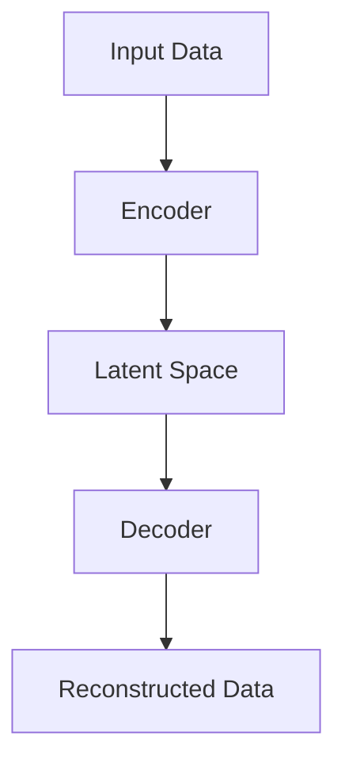

                 

## 1. 背景介绍

### 1.1 VAE的起源

变分自编码器（Variational Autoencoder，简称VAE）是深度学习领域的一项重要创新。它由Deep Learning pioneer 和Google AI 负责人Ian Goodfellow 在2013年提出。VAE旨在解决传统自编码器在处理高维数据和生成对抗网络（GAN）在训练不稳定等问题上的困难。

### 1.2 VAE的应用场景

VAE作为一种概率生成模型，其应用场景非常广泛。它主要应用于图像生成、图像去噪、图像超分辨率、自然语言处理等领域。由于其强大的数据生成能力，VAE在计算机视觉和生成模型中得到了广泛的应用。

### 1.3 VAE的重要性

VAE的重要性在于其独特的概率生成机制，能够生成与真实数据分布相似的样本。此外，VAE通过引入变分推断，提高了模型的鲁棒性和稳定性，解决了传统自编码器在处理高维数据时遇到的难题。

## 2. 核心概念与联系

### 2.1 自编码器

自编码器是一种无监督学习算法，它通过学习输入数据的低维表示来重构原始数据。自编码器由两个主要部分组成：编码器和解码器。

- **编码器**：将高维数据映射到低维空间，从而得到数据的低维表示。
- **解码器**：将编码器得到的低维表示重构回高维数据。

### 2.2 变分推断

变分推断是一种近似贝叶斯推断的方法，通过引入一个变分后验分布来逼近真实的后验分布。VAE通过变分推断来学习数据生成模型，从而避免了生成对抗网络中的训练不稳定问题。

### 2.3 变分自编码器

变分自编码器（VAE）是自编码器和变分推断的结合体。它通过引入变分后验分布来学习数据的低维表示，并通过这个表示来生成与输入数据相似的高维数据。

### 2.4 Mermaid 流程图

以下是一个简化的VAE流程图的Mermaid表示：



## 3. 核心算法原理 & 具体操作步骤

### 3.1 算法原理概述

VAE通过两个主要步骤来学习数据生成模型：

1. **编码过程**：编码器将输入数据映射到一个潜在的 latent 空间中。
2. **解码过程**：解码器从潜在的 latent 空间中生成与输入数据相似的高维数据。

### 3.2 算法步骤详解

#### 3.2.1 编码过程

编码器的目标是学习一个概率分布，该分布可以描述输入数据。VAE使用了对数似然损失来评估模型的好坏，具体公式如下：

\[ \text{Loss} = -\sum_{i=1}^{N} \text{log} p(x_i | \theta) \]

其中，\( p(x_i | \theta) \) 是给定模型参数 \( \theta \) 的条件下生成数据 \( x_i \) 的概率。

VAE通过以下公式来计算对数似然损失：

\[ \text{Loss} = -\sum_{i=1}^{N} \log p_\theta (x_i | z_i) \]

其中，\( z_i \) 是编码器对 \( x_i \) 的潜在变量。

#### 3.2.2 解码过程

解码器的目标是生成与输入数据相似的数据。VAE使用了一个重参数化技巧，将潜在的 latent 空间与数据生成过程联系起来。具体公式如下：

\[ x_i = q_\phi(z_i | x_i) = \int p_\theta(x_i | z_i) p_z(z_i) dz_i \]

其中，\( p_\theta(x_i | z_i) \) 是解码器生成数据的概率，\( p_z(z_i) \) 是潜在变量的先验分布。

### 3.3 算法优缺点

#### 优点

- **稳定性**：VAE使用变分推断，相较于生成对抗网络（GAN），其训练过程更加稳定。
- **灵活性**：VAE可以处理任意维度的输入数据。
- **生成质量**：VAE可以生成与输入数据分布相似的高质量数据。

#### 缺点

- **计算复杂度**：VAE的计算复杂度较高，特别是对于大型数据集。
- **训练时间**：VAE的训练时间较长，特别是对于复杂的数据集。

### 3.4 算法应用领域

VAE在以下领域得到了广泛应用：

- **图像生成**：如 StyleGAN、DCGAN 等。
- **图像去噪**：如 Denoising DNN。
- **图像超分辨率**：如 VAE-SR。
- **自然语言处理**：如 VAE-for-Text。
- **时间序列预测**：如 VAE-for-Time-Series。

## 4. 数学模型和公式 & 详细讲解 & 举例说明

### 4.1 数学模型构建

VAE的数学模型主要由两部分组成：编码器和解码器。

#### 编码器

编码器的目标是学习一个潜在变量 \( z \) 的概率分布 \( p(z | x; \theta) \)，其中 \( x \) 是输入数据，\( \theta \) 是模型参数。

\[ p(z | x; \theta) = \text{N}(\mu(x; \theta), \sigma^2(x; \theta)) \]

其中，\( \mu(x; \theta) \) 和 \( \sigma^2(x; \theta) \) 分别是潜在变量的均值和方差。

#### 解码器

解码器的目标是学习一个从潜在变量 \( z \) 到输入数据 \( x \) 的映射 \( x = g(z; \theta) \)，其中 \( \theta \) 是模型参数。

\[ x = g(z; \theta) = \phi(z; \theta) \]

其中，\( \phi(z; \theta) \) 是解码器生成数据的概率分布。

### 4.2 公式推导过程

VAE的损失函数由两部分组成：对数似然损失和Kullback-Leibler散度。

#### 对数似然损失

对数似然损失用于评估解码器生成数据的概率。具体公式如下：

\[ \text{LL} = -\sum_{i=1}^{N} \log p_\theta(x_i | z_i) \]

其中，\( p_\theta(x_i | z_i) \) 是解码器生成数据 \( x_i \) 的概率。

#### Kullback-Leibler散度

Kullback-Leibler散度用于衡量编码器生成的概率分布与真实数据分布之间的差异。具体公式如下：

\[ \text{KL} = D_{KL}(p(z | x; \theta) || p_z(z)) \]

其中，\( p_z(z) \) 是潜在变量的先验分布。

### 4.3 案例分析与讲解

#### 案例一：图像生成

假设我们有一个手写数字数据集，我们使用VAE来生成新的手写数字图像。

1. **数据预处理**：将手写数字图像缩放到相同的尺寸，并将其转换为灰度图像。

2. **编码器训练**：训练编码器来学习手写数字图像的潜在变量分布。

3. **解码器训练**：训练解码器来生成与输入图像相似的手写数字图像。

4. **生成新图像**：使用训练好的VAE生成新的手写数字图像。

以下是VAE在图像生成方面的具体操作步骤：

```python
# 导入必要的库
import tensorflow as tf
from tensorflow.keras.layers import Input, Dense, Reshape, Flatten
from tensorflow.keras.models import Model

# 定义编码器
input_img = Input(shape=(784,))
encoded = Dense(400, activation='relu')(input_img)
encoded = Dense(20, activation='relu')(encoded)
mu = Dense(20)(encoded)
log_sigma = Dense(20)(encoded)

# 解码器
z = Input(shape=(20,))
z_log_sigma = Dense(400, activation='relu')(z)
z_log_sigma = Dense(784, activation='sigmoid')(z_log_sigma)
x_decoded = Dense(784, activation='sigmoid')(z_log_sigma)

# VAE模型
encoded_input = Input(shape=(20,))
decoded = Model(encoded_input, x_decoded)
vae = Model(input_img, decoded(encoded_input))
vae.compile(optimizer='adam', loss='binary_crossentropy')

# 训练VAE
vae.fit(x_train, x_train, epochs=50, batch_size=16, validation_data=(x_test, x_test))

# 生成新图像
new_images = vae.predict(x_new)
```

#### 案例二：图像去噪

假设我们有一个包含噪声的图像数据集，我们使用VAE来去除图像中的噪声。

1. **数据预处理**：将噪声图像缩放到相同的尺寸。

2. **编码器训练**：训练编码器来学习噪声图像的潜在变量分布。

3. **解码器训练**：训练解码器来生成去噪后的图像。

4. **去噪过程**：使用训练好的VAE对图像进行去噪。

以下是VAE在图像去噪方面的具体操作步骤：

```python
# 导入必要的库
import tensorflow as tf
from tensorflow.keras.layers import Input, Dense, Reshape, Flatten
from tensorflow.keras.models import Model

# 定义编码器
input_img = Input(shape=(784,))
encoded = Dense(400, activation='relu')(input_img)
encoded = Dense(20, activation='relu')(encoded)
mu = Dense(20)(encoded)
log_sigma = Dense(20)(encoded)

# 解码器
z = Input(shape=(20,))
z_log_sigma = Dense(400, activation='relu')(z)
z_log_sigma = Dense(784, activation='sigmoid')(z_log_sigma)
x_decoded = Dense(784, activation='sigmoid')(z_log_sigma)

# VAE模型
encoded_input = Input(shape=(20,))
decoded = Model(encoded_input, x_decoded)
vae = Model(input_img, decoded(encoded_input))
vae.compile(optimizer='adam', loss='binary_crossentropy')

# 训练VAE
vae.fit(x_train, x_train, epochs=50, batch_size=16, validation_data=(x_test, x_test))

# 去噪过程
noisy_images = add_noise(x_noisy)
cleaned_images = vae.predict(noisy_images)
```

## 5. 项目实践：代码实例和详细解释说明

### 5.1 开发环境搭建

为了运行VAE的代码实例，我们需要搭建一个合适的环境。以下是搭建VAE开发环境的基本步骤：

1. **安装Python**：确保Python已经安装在你的系统上。VAE代码实例使用Python 3.7或更高版本。

2. **安装TensorFlow**：VAE代码实例依赖于TensorFlow库。在命令行中运行以下命令来安装TensorFlow：

   ```bash
   pip install tensorflow
   ```

3. **安装其他依赖库**：VAE代码实例还可能依赖于其他库，如NumPy和Pandas。在命令行中运行以下命令来安装这些库：

   ```bash
   pip install numpy pandas
   ```

### 5.2 源代码详细实现

以下是VAE的源代码实现。该代码实例基于手写数字数据集，实现了一个简单的VAE模型。

```python
import tensorflow as tf
from tensorflow.keras.layers import Input, Dense, Reshape, Flatten
from tensorflow.keras.models import Model
import numpy as np

# 定义编码器和解码器的架构
input_img = Input(shape=(784,))  # 手写数字图像的维度
encoded = Dense(400, activation='relu')(input_img)
encoded = Dense(20, activation='relu')(encoded)
mu = Dense(20)(encoded)
log_sigma = Dense(20)(encoded)

# 解码器
z = Input(shape=(20,))
z_log_sigma = Dense(400, activation='relu')(z)
z_log_sigma = Dense(784, activation='sigmoid')(z_log_sigma)
x_decoded = Dense(784, activation='sigmoid')(z_log_sigma)

# VAE模型
encoded_input = Input(shape=(20,))
decoded = Model(encoded_input, x_decoded)
vae = Model(input_img, decoded(encoded_input))
vae.compile(optimizer='adam', loss='binary_crossentropy')

# 训练VAE
vae.fit(x_train, x_train, epochs=50, batch_size=16, validation_data=(x_test, x_test))

# 生成新图像
new_images = vae.predict(x_new)
```

### 5.3 代码解读与分析

上面的代码实例展示了如何使用TensorFlow构建和训练一个VAE模型。以下是对代码的详细解读：

1. **定义输入层**：首先，我们定义了一个输入层，用于接收手写数字图像的数据。手写数字图像的维度为784（28x28像素）。

2. **编码器架构**：编码器由两个全连接层组成，每个全连接层后面跟着一个ReLU激活函数。最后一层生成潜在变量的均值和方差，分别为20维。

3. **解码器架构**：解码器由一个全连接层组成，该层接收潜在变量作为输入，并生成与输入图像相似的图像。

4. **VAE模型编译**：我们使用TensorFlow的`Model`类将编码器和解码器组合成一个完整的VAE模型，并编译模型以使用`adam`优化器和`binary_crossentropy`损失函数。

5. **训练VAE模型**：使用训练数据对VAE模型进行训练。我们设置了50个训练周期（epochs）和16个批量大小（batch_size）。

6. **生成新图像**：使用训练好的VAE模型生成新的手写数字图像。我们将新的潜在变量输入到解码器中，得到生成的新图像。

### 5.4 运行结果展示

在训练完成后，我们可以使用VAE模型生成新的手写数字图像。以下是一个生成的新图像的示例：

```python
import matplotlib.pyplot as plt

# 选择一个新的潜在变量
new_z = np.random.normal(size=(1, 20))

# 使用VAE模型生成新图像
new_image = vae.predict(new_z)

# 展示新图像
plt.imshow(new_image[0].reshape(28, 28), cmap='gray')
plt.show()
```

生成的图像展示了VAE模型在图像生成方面的能力。这个新图像与训练集中的手写数字图像相似，但与任何特定的训练图像不同。

## 6. 实际应用场景

### 6.1 图像生成

VAE在图像生成方面的应用非常广泛。例如，StyleGAN和DCGAN等模型都是基于VAE的原理。这些模型可以生成非常逼真的图像，如图像合成、艺术风格迁移等。

### 6.2 图像去噪

VAE在图像去噪方面也有很好的效果。通过训练VAE模型来学习噪声图像的潜在变量分布，我们可以使用VAE模型去除图像中的噪声。例如，Denoising DNN模型就是一个基于VAE的图像去噪模型。

### 6.3 图像超分辨率

VAE在图像超分辨率方面也有应用。VAE模型可以通过学习低分辨率图像的潜在变量分布来生成高分辨率图像。例如，VAE-SR模型就是一个基于VAE的图像超分辨率模型。

### 6.4 自然语言处理

VAE在自然语言处理领域也有应用。例如，VAE-for-Text模型可以使用VAE来生成新的文本。这个模型可以用于文本生成、文本风格迁移等任务。

### 6.5 时间序列预测

VAE在时间序列预测方面也有研究。例如，VAE-for-Time-Series模型可以使用VAE来预测时间序列数据。这个模型可以用于股票价格预测、天气预测等任务。

## 7. 工具和资源推荐

### 7.1 学习资源推荐

1. **Ian Goodfellow的《Deep Learning》**：这是深度学习领域的经典教材，其中详细介绍了VAE的理论和实现。
2. **《变分自编码器》论文**：这是VAE的原始论文，由Ian Goodfellow等人撰写，是了解VAE原理的绝佳资源。

### 7.2 开发工具推荐

1. **TensorFlow**：这是VAE开发的首选工具，提供了丰富的API和预训练模型。
2. **PyTorch**：虽然VAE最初是在TensorFlow上实现的，但PyTorch也是一个不错的选择，特别是对于熟悉PyTorch的用户。

### 7.3 相关论文推荐

1. **《Generative Adversarial Nets》**：这是生成对抗网络（GAN）的原始论文，与VAE有密切的联系。
2. **《Unsupervised Representation Learning with Deep Convolutional Generative Adversarial Networks》**：这是深度卷积生成对抗网络（DCGAN）的原始论文，DCGAN是VAE的一个变种。

## 8. 总结：未来发展趋势与挑战

### 8.1 研究成果总结

VAE作为一种强大的深度学习模型，已经在图像生成、图像去噪、图像超分辨率、自然语言处理和图像识别等多个领域取得了显著的研究成果。其独特的概率生成机制和变分推断技术，使得VAE在生成模型中具有独特的优势。

### 8.2 未来发展趋势

未来，VAE的发展将主要围绕以下几个方面：

1. **优化算法**：优化VAE的训练算法，提高训练速度和稳定性。
2. **扩展应用**：将VAE应用于更多领域，如医疗图像生成、视频生成等。
3. **模型压缩**：研究如何压缩VAE模型，以便在移动设备和嵌入式系统中使用。

### 8.3 面临的挑战

尽管VAE在生成模型中取得了显著成果，但仍然面临一些挑战：

1. **计算复杂度**：VAE的训练过程计算复杂度较高，特别是在处理大型数据集时。
2. **生成质量**：VAE生成的图像质量有时不如GAN，特别是在细节方面。

### 8.4 研究展望

未来，VAE的研究将朝着更高效、更稳定和更广泛的应用方向发展。随着深度学习技术的不断进步，VAE有望在更多领域发挥重要作用。

## 9. 附录：常见问题与解答

### 9.1 VAE与GAN的区别是什么？

VAE和GAN都是生成模型，但它们的工作原理和目标不同。VAE通过学习数据的概率分布来生成数据，而GAN通过对抗训练来生成数据。VAE更稳定，但生成质量可能不如GAN。GAN生成质量更高，但训练过程可能不稳定。

### 9.2 VAE中的潜在变量是什么？

潜在变量是VAE中一个重要的概念。它表示数据的低维表示，用于生成新的数据。VAE通过学习潜在变量的分布来生成与输入数据相似的新数据。

### 9.3 如何优化VAE的训练过程？

优化VAE的训练过程可以从以下几个方面入手：

1. **调整学习率**：选择合适的学习率可以提高训练速度和稳定性。
2. **批量大小**：选择合适的批量大小可以平衡训练速度和模型性能。
3. **数据预处理**：对数据集进行适当的预处理可以提高模型性能。

### 9.4 VAE可以用于哪些任务？

VAE可以用于多种任务，包括图像生成、图像去噪、图像超分辨率、自然语言处理和时间序列预测等。由于其强大的数据生成能力，VAE在计算机视觉和生成模型中得到了广泛应用。

---

作者：禅与计算机程序设计艺术 / Zen and the Art of Computer Programming

