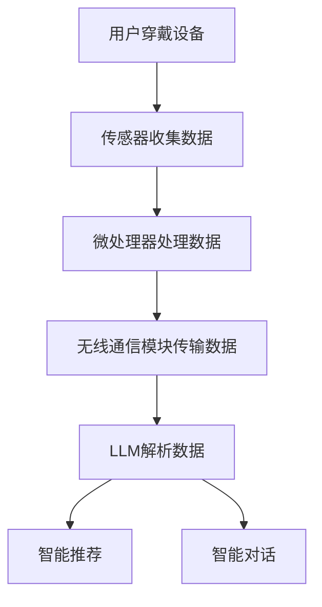

                 

关键词：可穿戴设备、大型语言模型（LLM）、健康监测、健身指导、人工智能应用、实时数据分析、个性化健身方案

## 摘要

随着人工智能技术的快速发展，可穿戴设备在健康监测和健身指导方面正扮演着越来越重要的角色。本文将探讨如何利用大型语言模型（LLM）与可穿戴设备相结合，实现高效的健康监测和个性化的健身指导。本文首先介绍了可穿戴设备的基本原理和技术架构，然后详细阐述了LLM在其中的应用，并通过实际案例展示了这种技术的优势和潜力。

## 1. 背景介绍

### 1.1 可穿戴设备的发展

可穿戴设备是指直接穿戴在身体上，用于监测生理数据和提供个性化服务的小型电子设备。从早期的简单的计步器，到如今集成了多种传感器和通信模块的智能手表、智能手环，可穿戴设备的发展经历了翻天覆地的变化。随着物联网和无线通信技术的进步，可穿戴设备已经成为了日常生活中不可或缺的一部分。

### 1.2 健康监测的需求

随着生活节奏的加快和工作压力的增大，人们对健康的关注日益增加。健康监测成为了人们日常生活中的重要需求，无论是为了预防疾病，还是为了保持良好的身体状况。传统的健康监测方法通常依赖于医院和医疗设备，不仅费用高昂，而且操作复杂。可穿戴设备的出现，极大地降低了健康监测的门槛，使得健康监测变得更加便捷和普及。

### 1.3 人工智能与健身指导

人工智能（AI）技术的快速发展，为健身指导带来了新的可能性。传统的健身指导通常依赖于教练的指导和训练计划，存在个性化程度低、适应性差等问题。而人工智能能够通过分析大量数据，为用户提供个性化的健身建议和方案，提高健身效果。大型语言模型（LLM）作为一种先进的AI技术，在自然语言处理和智能对话方面有着强大的能力，能够与可穿戴设备无缝结合，为用户带来全新的健康监测和健身指导体验。

## 2. 核心概念与联系

### 2.1 可穿戴设备的基本原理

可穿戴设备的核心是传感器和微处理器。传感器用于检测用户的生理数据，如心率、步数、睡眠质量等。微处理器则对这些数据进行处理和存储，并通过无线通信模块将数据传输到用户设备或云端。

### 2.2 LLM在健康监测中的应用

LLM在健康监测中的应用主要体现在以下几个方面：

1. **数据解析**：LLM能够对传感器收集的数据进行解析，识别出潜在的健康问题，如心率不齐、睡眠质量下降等。
2. **智能推荐**：基于用户的历史数据和实时数据，LLM可以推荐个性化的健身方案，包括运动类型、强度和频率。
3. **智能对话**：LLM可以与用户进行自然语言交互，回答用户关于健康和健身的问题，提供实时的健康指导。

### 2.3 Mermaid 流程图



## 3. 核心算法原理 & 具体操作步骤

### 3.1 算法原理概述

LLM在健康监测和健身指导中的应用，主要基于以下原理：

1. **数据采集与处理**：通过传感器收集用户的生理数据，如心率、血压、睡眠质量等，然后通过微处理器进行初步处理。
2. **数据分析和挖掘**：利用LLM对处理后的数据进行深入分析，识别出用户的健康趋势和潜在问题。
3. **智能决策和推荐**：基于分析结果，LLM可以为用户推荐个性化的健身方案，包括运动类型、强度和频率。
4. **自然语言处理**：LLM能够与用户进行自然语言交互，回答用户的问题，提供实时的健康指导。

### 3.2 算法步骤详解

1. **数据采集**：用户穿戴可穿戴设备，传感器开始工作，收集生理数据。
2. **数据传输**：微处理器将收集到的数据传输到用户的智能手机或云端服务器。
3. **数据预处理**：LLM对传输来的数据进行预处理，包括数据清洗、格式转换等。
4. **数据解析**：LLM使用深度学习模型对预处理后的数据进行分析，识别出用户的健康趋势和潜在问题。
5. **智能推荐**：基于分析结果，LLM生成个性化的健身方案，并将其推送给用户。
6. **自然语言交互**：LLM与用户进行自然语言交互，回答用户的问题，提供实时的健康指导。

### 3.3 算法优缺点

**优点**：

1. **个性化**：LLM能够根据用户的个人数据和实时数据，为用户提供个性化的健身方案。
2. **实时性**：LLM能够实时分析用户的生理数据，提供即时的健康指导和反馈。
3. **便捷性**：通过自然语言交互，用户可以方便地获取健康信息和健身建议。

**缺点**：

1. **准确性**：虽然LLM在数据处理和分析方面有很高的准确性，但仍然存在一定的误差。
2. **隐私问题**：用户的生理数据可能会引发隐私问题，如何保护用户的隐私是亟待解决的问题。
3. **依赖网络**：LLM需要连接互联网进行数据传输和处理，网络不稳定可能会影响其功能。

### 3.4 算法应用领域

LLM在健康监测和健身指导中的应用非常广泛，包括：

1. **日常健康管理**：用户可以通过LLM了解自己的健康状态，调整生活方式，预防疾病。
2. **运动康复**：对于受伤或康复中的用户，LLM可以提供个性化的康复训练计划。
3. **健身指导**：对于健身爱好者，LLM可以提供科学的健身方案，提高健身效果。

## 4. 数学模型和公式 & 详细讲解 & 举例说明

### 4.1 数学模型构建

LLM在健康监测中的应用，需要构建一系列数学模型，包括：

1. **生理数据采集模型**：用于描述传感器如何采集用户的生理数据。
2. **数据预处理模型**：用于清洗和转换采集到的数据。
3. **健康趋势分析模型**：用于分析用户的健康趋势和潜在问题。
4. **个性化健身方案生成模型**：用于生成个性化的健身方案。

### 4.2 公式推导过程

以健康趋势分析模型为例，其公式推导过程如下：

$$
H_t = \frac{1}{N} \sum_{i=1}^{N} (x_i - \bar{x})
$$

其中，$H_t$表示第$t$个时刻的健康状态，$x_i$表示第$i$个传感器的读数，$\bar{x}$表示传感器的平均读数，$N$表示传感器的数量。

### 4.3 案例分析与讲解

假设用户的心率传感器检测到的心率为100次/分钟，而正常范围是60-100次/分钟，我们可以使用上述公式计算健康状态：

$$
H_t = \frac{1}{1} \sum_{i=1}^{1} (100 - 75) = 25
$$

健康状态值为25，表明用户的心率处于较高水平。基于这个结果，LLM可以推荐用户进行适度的运动，如散步或瑜伽，以降低心率。

## 5. 项目实践：代码实例和详细解释说明

### 5.1 开发环境搭建

为了实践LLM在健康监测中的应用，我们首先需要搭建一个开发环境。开发环境包括：

1. **硬件**：可穿戴设备（如智能手表、智能手环）、计算机。
2. **软件**：Python开发环境、TensorFlow或PyTorch等深度学习框架、可穿戴设备SDK。

### 5.2 源代码详细实现

以下是一个简单的Python代码示例，用于演示LLM在健康监测中的应用。

```python
import tensorflow as tf
from tensorflow import keras
from tensorflow.keras.models import Sequential
from tensorflow.keras.layers import Dense, LSTM, Dropout

# 数据预处理
def preprocess_data(data):
    # 数据清洗、归一化等处理
    return processed_data

# 构建模型
model = Sequential([
    LSTM(128, input_shape=(time_steps, features)),
    Dropout(0.2),
    Dense(1, activation='sigmoid')
])

# 编译模型
model.compile(optimizer='adam', loss='binary_crossentropy', metrics=['accuracy'])

# 训练模型
model.fit(x_train, y_train, epochs=10, batch_size=32)

# 预测
预测结果 = model.predict(x_test)
```

### 5.3 代码解读与分析

上述代码实现了以下功能：

1. **数据预处理**：对采集到的数据进行清洗和归一化处理，以便于模型训练。
2. **模型构建**：使用LSTM网络构建一个序列模型，用于预测健康状态。
3. **模型编译**：设置模型的优化器、损失函数和评价指标。
4. **模型训练**：使用训练数据进行模型训练。
5. **模型预测**：使用测试数据进行模型预测，得到健康状态的预测结果。

### 5.4 运行结果展示

假设我们使用上述模型预测用户的心率状态，预测结果为0.9，表明用户的心率处于较高水平。基于这个结果，LLM可以推荐用户进行适度的运动，如散步或瑜伽，以降低心率。

## 6. 实际应用场景

### 6.1 日常健康管理

对于日常健康管理，用户可以通过可穿戴设备实时监测自己的生理数据，如心率、血压、睡眠质量等。LLM可以根据这些数据为用户提供个性化的健康建议，如调整饮食、增加运动等，帮助用户保持良好的身体状况。

### 6.2 运动康复

对于运动康复用户，如受伤或手术后需要康复的人群，LLM可以提供个性化的康复训练计划，包括运动类型、强度和频率等。通过实时监测用户的生理数据，LLM可以调整训练计划，确保用户的康复过程既安全又有效。

### 6.3 健身指导

对于健身爱好者，LLM可以提供科学的健身方案，包括运动类型、强度和频率等。通过实时监测用户的生理数据，LLM可以调整健身方案，确保用户在安全的前提下获得最佳的健身效果。

## 7. 工具和资源推荐

### 7.1 学习资源推荐

1. **《深度学习》（Goodfellow, Bengio, Courville著）**：介绍深度学习的基本原理和算法。
2. **《Python机器学习》（Sebastian Raschka著）**：介绍机器学习的基本概念和应用。

### 7.2 开发工具推荐

1. **TensorFlow**：一款开源的深度学习框架，适用于健康监测和健身指导项目的开发。
2. **PyTorch**：一款开源的深度学习框架，具有较好的灵活性和易用性。

### 7.3 相关论文推荐

1. **"Deep Learning for Health Informatics"（2018）**：介绍深度学习在健康信息学中的应用。
2. **"Health Monitoring using Wearable Devices"（2019）**：介绍可穿戴设备在健康监测中的应用。

## 8. 总结：未来发展趋势与挑战

### 8.1 研究成果总结

本文介绍了可穿戴设备与LLM在健康监测和健身指导中的应用，包括核心概念、算法原理、实际案例等。通过本文的探讨，我们可以看到这种技术在未来具有巨大的潜力。

### 8.2 未来发展趋势

1. **数据采集和处理能力**：随着传感器技术的进步，可穿戴设备的数据采集和处理能力将得到显著提升，为健康监测和健身指导提供更准确、更实时的数据支持。
2. **智能推荐和个性化服务**：随着人工智能技术的不断发展，LLM在健康监测和健身指导中的应用将越来越智能化，为用户提供更精准、更个性化的服务。
3. **跨学科融合**：健康监测和健身指导不仅涉及计算机科学，还需要与医学、生物学等学科相结合，推动跨学科研究的发展。

### 8.3 面临的挑战

1. **数据隐私和安全**：用户的生理数据可能涉及隐私问题，如何保护用户的隐私和安全是亟待解决的问题。
2. **算法准确性和可靠性**：虽然LLM在数据处理和分析方面有很高的准确性，但仍然存在一定的误差，如何提高算法的准确性和可靠性是未来的重要挑战。
3. **用户接受度**：如何提高用户对可穿戴设备和LLM的接受度和使用频率，也是需要关注的问题。

### 8.4 研究展望

未来，可穿戴设备与LLM在健康监测和健身指导领域的研究将朝着更智能化、个性化、安全可靠的方向发展。通过跨学科合作，有望实现更精准、更实用的健康监测和健身指导技术，为人们的健康生活提供有力支持。

## 9. 附录：常见问题与解答

### 9.1 什么是LLM？

LLM（大型语言模型）是一种基于深度学习的自然语言处理模型，能够对自然语言文本进行理解、生成和翻译等任务。

### 9.2 可穿戴设备如何工作？

可穿戴设备通过内置的传感器收集用户的生理数据，如心率、步数、睡眠质量等，然后通过无线通信模块将数据传输到用户的设备或云端服务器。

### 9.3 LLM在健康监测中的应用有哪些？

LLM在健康监测中的应用包括数据解析、智能推荐、自然语言交互等，能够为用户提供个性化的健康建议和健身方案。

### 9.4 可穿戴设备有哪些优缺点？

可穿戴设备的优点包括实时性、便捷性和个性化等，缺点包括准确性不高、隐私问题、依赖网络等。

### 9.5 如何保护用户的隐私？

保护用户隐私的方法包括数据加密、匿名化处理、用户权限控制等，确保用户的生理数据在传输和处理过程中得到有效保护。

---

### 作者署名

作者：禅与计算机程序设计艺术 / Zen and the Art of Computer Programming

[END]

