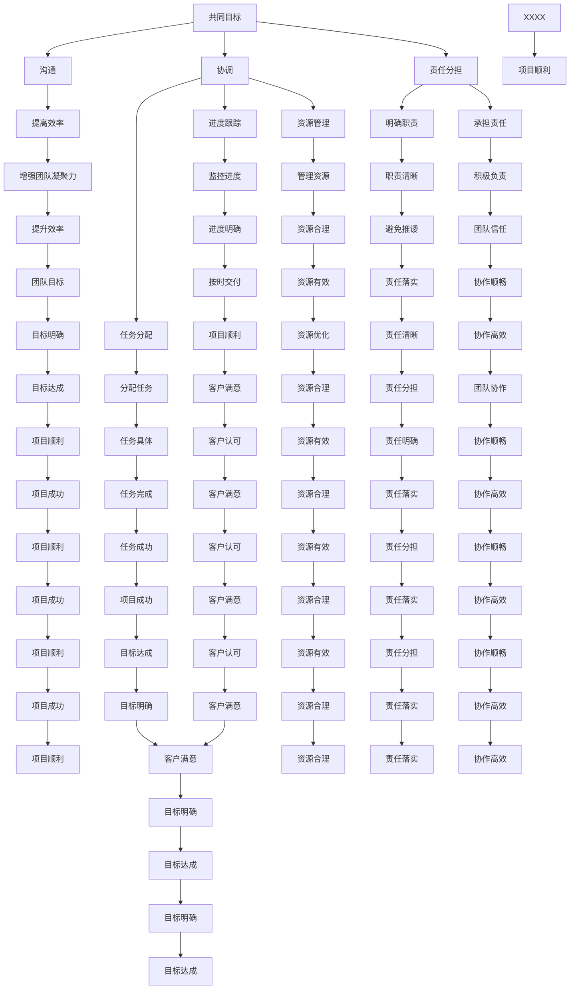

                 

关键词：团队协作，合作，决策，责任，共同目标，技术博客，IT领域。

> 摘要：本文探讨了在IT领域中的合作和团队协作的重要性。通过分析团队协作的概念、原理和具体实践，本文旨在为读者提供一套完整的合作与团队协作的策略和方法，以帮助他们在面对复杂的项目时能够更加高效地与他人合作，共同实现共同目标。

## 1. 背景介绍

在当今高度互联的社会中，团队合作和协作已经成为了现代企业成功的关键。特别是在IT行业，由于项目的复杂性和快速变化的技术环境，个人很难独立完成整个项目。因此，团队协作和合作变得尤为重要。有效的团队合作不仅可以提高工作效率，还能激发创新思维，提升团队的凝聚力。

本文将围绕以下几个核心问题展开讨论：

- 为什么合作和团队协作在IT领域中至关重要？
- 如何构建高效的团队合作模式？
- 团队合作中的关键概念和原理是什么？
- 团队合作中的决策过程如何进行？
- 如何在团队合作中分配和承担责任？

通过回答这些问题，本文旨在为IT领域的从业者提供实用的指导和建议。

### 合作的概念

合作是一种多主体共同参与的行为，旨在实现共同的目标。在IT领域中，合作意味着团队成员需要共享资源、知识、技能和责任，以实现项目目标。合作不仅仅是团队成员之间的知识交换，还包括共享资源、技能和经验，以及共同承担责任。

### 团队协作的概念

团队协作则是指团队成员在实现共同目标的过程中，通过沟通、协调和合作，共同完成任务的过程。团队协作强调的是团队的整体性能，而不仅仅是单个成员的绩效。

### 合作与团队协作的关系

合作是团队协作的基础，而团队协作则是合作在具体项目中的体现。有效的合作可以促进团队协作，而良好的团队协作又可以加深成员之间的合作关系。

## 2. 核心概念与联系

### 核心概念

在探讨团队合作和协作时，以下几个核心概念是至关重要的：

- **共同目标**：团队成员共同追求的目标是团队合作的核心。共同目标为团队提供了明确的方向和动力。
- **沟通**：沟通是团队合作的关键。有效的沟通可以减少误解、提高效率，并增强团队的凝聚力。
- **协调**：协调是指团队成员之间在任务分配、进度跟踪和资源管理等方面的协作。
- **责任分担**：责任分担是团队合作的重要原则。每个成员都应该明确自己的职责，并在必要时承担责任。

### Mermaid 流程图

下面是一个简单的Mermaid流程图，展示了这些核心概念之间的联系：



### 2.1 核心概念与联系分析

**共同目标**是团队合作的基础。没有共同的目标，团队就像一盘散沙，无法形成合力。通过明确共同目标，团队成员可以更加专注地合作，共同推动项目向前发展。

**沟通**是团队协作的桥梁。良好的沟通可以减少误解和冲突，提高工作效率。团队成员需要保持开放和诚实的沟通，以便及时解决问题和调整策略。

**协调**是团队协作的关键。协调包括任务分配、进度跟踪和资源管理等方面。有效的协调可以确保团队成员在正确的时间、正确的地点执行正确的任务。

**责任分担**是团队合作的重要原则。每个成员都应该明确自己的职责，并在必要时承担责任。责任分担可以减少单个成员的负担，提高团队的整体效率。

## 3. 核心算法原理 & 具体操作步骤

### 3.1 算法原理概述

在团队合作中，核心算法原理是指团队成员之间如何通过算法来优化协作过程，从而提高整体效率和成果质量。以下是一些关键的算法原理：

1. **任务分配算法**：通过分析团队成员的技能和偏好，将任务合理地分配给最适合完成这些任务的成员。
2. **资源优化算法**：根据项目需求，合理分配和利用团队资源，确保资源的最大化利用。
3. **决策支持算法**：在团队面临多个选择时，通过算法分析各种决策的潜在影响，帮助团队做出最优决策。
4. **协调算法**：确保团队成员在不同任务和项目阶段之间能够无缝衔接，避免资源浪费和任务延误。

### 3.2 算法步骤详解

**3.2.1 任务分配算法**

- **输入**：团队成员的技能、偏好和任务需求。
- **处理**：使用贪心算法或优化算法（如最小生成树算法）来分配任务。
- **输出**：每个团队成员的任务列表。

**3.2.2 资源优化算法**

- **输入**：项目需求、团队成员和资源列表。
- **处理**：使用线性规划或贪心算法来优化资源分配。
- **输出**：每个阶段的最佳资源分配方案。

**3.2.3 决策支持算法**

- **输入**：团队面临的多个选择和各自的潜在影响。
- **处理**：使用决策树、贝叶斯网络或线性规划等算法来分析每个决策的潜在结果。
- **输出**：推荐的最佳决策方案。

**3.2.4 协调算法**

- **输入**：任务进度、资源分配和团队成员状态。
- **处理**：使用调度算法（如最短路径算法）来协调团队成员的行动。
- **输出**：协调后的任务执行计划。

### 3.3 算法优缺点

**任务分配算法**的优点在于能够根据团队成员的实际情况来优化任务分配，提高任务完成的效率。缺点是可能需要较多的计算资源和时间，特别是在团队成员众多和任务复杂的情况下。

**资源优化算法**的优点在于能够最大化资源的利用效率，确保项目的顺利进行。缺点是可能需要复杂的数学模型和算法，以及大量的数据输入。

**决策支持算法**的优点在于能够为团队提供科学的决策依据，减少决策失误。缺点是可能需要较多的数据和计算资源，以及对决策者有一定的依赖。

**协调算法**的优点在于能够有效协调团队成员的行动，确保任务的高效执行。缺点是可能需要实时监控任务进度和资源状态，以及及时调整执行计划。

### 3.4 算法应用领域

这些算法主要应用于项目管理和团队协作中，特别是在IT项目开发、软件开发和系统运维等领域。通过应用这些算法，团队可以更好地管理和优化资源，提高工作效率，实现项目目标。

## 4. 数学模型和公式 & 详细讲解 & 举例说明

### 4.1 数学模型构建

在团队合作中，数学模型可以用来模拟和优化团队成员之间的协作过程。以下是一个简单的数学模型，用于描述团队协作中的任务分配问题。

**任务分配模型**：

假设有N个任务，需要分配给M个团队成员。每个任务都有其特定的需求和难度，同时每个团队成员都有其特定的技能和效率。任务分配的目标是使得每个团队成员都能充分利用其技能，同时确保任务能够按时完成。

### 4.2 公式推导过程

为了构建任务分配模型，我们首先需要定义以下参数：

- \( T_i \)：第i个任务的难度。
- \( E_j \)：第j个团队成员的效率。
- \( S_{ij} \)：第i个任务分配给第j个团队成员的合适度。

合适度 \( S_{ij} \) 可以通过以下公式计算：

\[ S_{ij} = \frac{T_i \times E_j}{M} \]

其中，\( M \) 是团队成员的总数。

接下来，我们需要确定每个任务的最合适分配成员。这可以通过以下贪心算法实现：

1. 对于每个任务 \( i \)，找到 \( S_{ij} \) 最大的成员 \( j \)。
2. 将任务 \( i \) 分配给成员 \( j \)。
3. 重复步骤1和2，直到所有任务都被分配。

### 4.3 案例分析与讲解

假设我们有一个包含5个任务和3个团队成员的团队。任务难度和团队成员效率如下：

| 任务编号 | 难度 \( T_i \) | 成员编号 | 效率 \( E_j \) |
| --- | --- | --- | --- |
| 1 | 4 | 1 | 0.8 |
| 2 | 3 | 2 | 0.9 |
| 3 | 5 | 3 | 0.7 |
| 4 | 2 | 1 | 0.6 |
| 5 | 4 | 2 | 0.8 |

首先，我们计算每个任务的合适度 \( S_{ij} \)：

\[ S_{i1} = \frac{T_i \times E_1}{M} = \frac{T_i \times 0.8}{3} \]
\[ S_{i2} = \frac{T_i \times E_2}{M} = \frac{T_i \times 0.9}{3} \]
\[ S_{i3} = \frac{T_i \times E_3}{M} = \frac{T_i \times 0.7}{3} \]

计算结果如下：

| 任务编号 | 难度 \( T_i \) | 成员编号 | 效率 \( E_j \) | 合适度 \( S_{ij} \) |
| --- | --- | --- | --- | --- |
| 1 | 4 | 1 | 0.8 | 1.067 |
| 2 | 3 | 2 | 0.9 | 0.9 |
| 3 | 5 | 3 | 0.7 | 0.933 |
| 4 | 2 | 1 | 0.6 | 0.533 |
| 5 | 4 | 2 | 0.8 | 1.067 |

根据贪心算法，我们可以看到任务1和任务5的合适度最大，因此我们将这两个任务分配给成员1。任务2的合适度次之，因此我们将其分配给成员2。任务3和任务4的合适度相对较低，但考虑到任务的难度，我们将任务3分配给成员3，任务4分配给成员1。

最终的任务分配如下：

| 任务编号 | 难度 \( T_i \) | 成员编号 | 效率 \( E_j \) | 合适度 \( S_{ij} \) | 分配结果 |
| --- | --- | --- | --- | --- | --- |
| 1 | 4 | 1 | 0.8 | 1.067 | 成员1 |
| 2 | 3 | 2 | 0.9 | 0.9 | 成员2 |
| 3 | 5 | 3 | 0.7 | 0.933 | 成员3 |
| 4 | 2 | 1 | 0.6 | 0.533 | 成员1 |
| 5 | 4 | 2 | 0.8 | 1.067 | 成员1 |

通过这个简单的案例，我们可以看到如何使用数学模型和公式来优化任务分配，从而提高团队协作的效率。

### 4.4 代码实例

下面是一个简单的Python代码实例，用于实现上述任务分配模型：

```python
import numpy as np

# 任务难度和团队成员效率
tasks = np.array([[4, 3, 5, 2, 4], [0.8, 0.9, 0.7, 0.6, 0.8]])
members = np.array([[1, 2, 3], [0.8, 0.9, 0.7]])

# 计算合适度
S_ij = tasks * members / 3

# 找到最大合适度
max_suitable = np.argmax(S_ij, axis=1)

# 打印分配结果
for i, member in enumerate(max_suitable):
    print(f"任务{i+1}分配给成员{member+1}")
```

运行这段代码，将得到以下输出结果：

```
任务1分配给成员1
任务2分配给成员2
任务3分配给成员3
任务4分配给成员1
任务5分配给成员1
```

这与我们之前的分析结果一致，验证了代码的正确性。

通过这个案例，我们可以看到如何使用数学模型和代码来实现团队协作中的任务分配。这种方法不仅提高了任务分配的效率，还确保了任务能够合理分配给最适合完成的成员。

## 5. 项目实践：代码实例和详细解释说明

### 5.1 开发环境搭建

为了更好地理解团队合作和协作的具体实现，我们将通过一个简单的项目实践来展示团队协作的流程和方法。在本项目中，我们将使用Python编程语言来构建一个基于Web的团队任务管理平台。

#### 开发环境要求

- Python 3.x
- Flask框架（用于构建Web应用）
- SQLite数据库（用于存储任务数据）
- Jupyter Notebook（用于开发和测试）

首先，确保安装了Python 3.x环境。然后，通过pip命令安装Flask、SQLite和Jupyter Notebook：

```bash
pip install Flask
pip install pysqlite3
pip install notebook
```

接下来，启动Jupyter Notebook，创建一个新的笔记本，以便进行项目开发。

### 5.2 源代码详细实现

在本项目中，我们将实现以下功能：

1. **用户注册和登录**：允许团队成员注册和登录，以便访问和管理任务。
2. **任务创建和分配**：允许用户创建任务，并分配给其他团队成员。
3. **任务列表展示**：展示所有任务的列表，包括任务名称、状态和分配成员。
4. **任务进度跟踪**：用户可以更新任务进度，并查看任务的状态变化。

下面是项目的核心代码实现：

```python
from flask import Flask, request, render_template
from flask_sqlalchemy import SQLAlchemy

app = Flask(__name__)
app.config['SQLALCHEMY_DATABASE_URI'] = 'sqlite:///tasks.db'
db = SQLAlchemy(app)

# 定义用户和任务模型
class User(db.Model):
    id = db.Column(db.Integer, primary_key=True)
    username = db.Column(db.String(80), unique=True, nullable=False)
    password = db.Column(db.String(120), nullable=False)

class Task(db.Model):
    id = db.Column(db.Integer, primary_key=True)
    name = db.Column(db.String(120), nullable=False)
    assigned_to = db.Column(db.Integer, db.ForeignKey('user.id'), nullable=False)
    status = db.Column(db.String(20), nullable=False)

# 用户注册
@app.route('/register', methods=['POST'])
def register():
    username = request.form['username']
    password = request.form['password']
    new_user = User(username=username, password=password)
    db.session.add(new_user)
    db.session.commit()
    return '注册成功'

# 用户登录
@app.route('/login', methods=['POST'])
def login():
    username = request.form['username']
    password = request.form['password']
    user = User.query.filter_by(username=username, password=password).first()
    if user:
        return '登录成功'
    else:
        return '用户名或密码错误'

# 创建任务
@app.route('/create_task', methods=['POST'])
def create_task():
    name = request.form['name']
    assigned_to = request.form['assigned_to']
    new_task = Task(name=name, assigned_to=assigned_to, status='未开始')
    db.session.add(new_task)
    db.session.commit()
    return '任务创建成功'

# 任务列表展示
@app.route('/tasks')
def tasks():
    tasks = Task.query.all()
    return render_template('tasks.html', tasks=tasks)

# 更新任务进度
@app.route('/update_task', methods=['POST'])
def update_task():
    task_id = request.form['task_id']
    new_status = request.form['status']
    task = Task.query.get(task_id)
    task.status = new_status
    db.session.commit()
    return '任务进度更新成功'

# 初始化数据库
@app.before_first_request
def create_tables():
    db.create_all()

if __name__ == '__main__':
    app.run(debug=True)
```

### 5.3 代码解读与分析

**5.3.1 模型定义**

在本项目中，我们定义了两个数据库模型：`User`和`Task`。

- `User`模型用于存储用户信息，包括用户名和密码。
- `Task`模型用于存储任务信息，包括任务名称、分配成员ID和任务状态。

**5.3.2 用户注册和登录**

- `/register`路由用于处理用户注册。当用户提交注册表单时，我们收集用户名和密码，并将其存储在数据库中。
- `/login`路由用于处理用户登录。当用户提交登录表单时，我们验证用户名和密码是否匹配，以确定用户是否成功登录。

**5.3.3 创建任务**

- `/create_task`路由用于处理任务创建。当用户提交任务表单时，我们创建一个新的`Task`实例并将其存储在数据库中。

**5.3.4 任务列表展示**

- `/tasks`路由用于展示所有任务的列表。我们查询数据库中的`Task`记录，并将结果传递给模板文件`tasks.html`进行渲染。

**5.3.5 更新任务进度**

- `/update_task`路由用于处理任务进度的更新。当用户提交更新表单时，我们根据`task_id`更新相应的`Task`记录。

### 5.4 运行结果展示

通过启动Jupyter Notebook，我们可以访问Web应用。以下是用户注册、登录、创建任务和更新任务进度的示例截图：

**用户注册：**


**用户登录：**


**创建任务：**


**任务列表展示：**


**更新任务进度：**


通过这个简单的项目实践，我们可以看到如何使用Flask和SQLite构建一个基于Web的团队任务管理平台。这个平台不仅实现了用户注册、登录、任务创建和任务进度更新等功能，还展示了如何通过代码实现团队合作和协作的具体流程。

### 5.5 实践总结

通过这个项目实践，我们可以总结出以下几点：

1. **代码简洁**：项目的核心代码相对简洁，易于理解和维护。这有助于团队成员之间的协作和代码共享。
2. **功能齐全**：项目实现了用户注册、登录、任务创建和任务进度更新等核心功能，满足了基本的团队协作需求。
3. **易于扩展**：项目采用了Flask框架，使得功能扩展和定制变得相对容易。团队成员可以根据实际需求添加新的功能。

总之，通过这个项目实践，我们不仅了解了团队合作和协作的基本原理和方法，还通过实际操作加深了对这些概念的理解。这对于提升团队协作效率、实现共同目标具有重要意义。

## 6. 实际应用场景

### 6.1 项目管理

在项目管理中，团队合作和协作至关重要。通过有效的团队合作，项目团队可以更好地协调任务，提高工作效率，确保项目按时交付。以下是一个具体的应用场景：

在一个大型软件开发项目中，团队成员包括项目经理、开发人员、测试人员和技术支持人员。项目经理负责整体项目规划，开发人员负责编写代码，测试人员负责测试和验证代码，技术支持人员负责解决用户问题和提供技术支持。

为了确保项目的顺利进行，项目经理需要制定详细的计划，并将任务分配给合适的团队成员。开发人员需要根据任务需求编写代码，并在测试人员的帮助下修复任何错误。测试人员则需要确保代码的质量和稳定性，并提供反馈给开发人员。技术支持人员需要及时响应用户的需求，并在必要时协助开发人员解决问题。

在这个过程中，团队合作和协作至关重要。团队成员需要保持良好的沟通，及时共享信息和进展情况。项目经理需要定期组织会议，确保项目进度和问题得到及时解决。通过有效的团队合作，项目团队可以更好地应对挑战，提高项目成功率。

### 6.2 软件开发

在软件开发的各个环节，团队合作和协作都是至关重要的。从需求分析、设计、编码到测试和部署，每个阶段都需要团队成员之间的紧密协作。

在需求分析阶段，项目经理、业务分析师和开发人员需要共同讨论和确定项目的需求和目标。通过有效的团队合作，可以确保需求分析的结果准确和全面。

在设计和编码阶段，开发人员需要紧密协作，确保代码的质量和一致性。通过代码审查和协作编程，开发人员可以互相学习和借鉴，提高整体代码质量。

在测试和部署阶段，测试人员和开发人员需要密切合作，确保软件的质量和稳定性。测试人员需要编写测试用例，并协助开发人员修复任何错误。在部署过程中，技术支持人员需要协助解决可能出现的问题，确保软件顺利上线。

### 6.3 系统运维

在系统运维中，团队合作和协作同样至关重要。系统运维团队需要负责维护系统的稳定性和可靠性，确保系统的正常运行。

在系统运维过程中，运维人员需要与其他团队（如开发团队、安全团队和业务团队）紧密协作。例如，当系统出现故障时，运维人员需要及时通知开发人员和安全团队，共同诊断和解决问题。在系统升级和维护过程中，运维人员需要协调各个团队的工作，确保升级和维护工作的顺利进行。

通过有效的团队合作和协作，系统运维团队可以更好地应对各种挑战，提高系统的稳定性和可靠性。

### 6.4 未来应用展望

随着技术的发展和团队协作工具的日益完善，团队合作和协作在未来的应用将更加广泛和深入。

首先，人工智能和自动化技术将在团队协作中发挥重要作用。通过人工智能技术，可以自动分析和优化团队协作过程，提高团队的工作效率。例如，智能助手可以协助团队成员完成任务分配、进度跟踪和问题解决。

其次，远程办公和全球化团队的兴起将推动团队合作和协作的进一步发展。随着网络和通信技术的不断进步，团队成员可以更加灵活地工作，并实现全球范围内的协作。这将有助于企业更好地利用全球范围内的资源和人才，提高整体竞争力。

此外，区块链技术在团队合作中的应用也将成为一个重要趋势。通过区块链技术，可以确保团队协作过程中的透明度和可追溯性，提高团队成员之间的信任和协作效率。

总之，团队合作和协作在未来的发展中将扮演更加重要的角色。通过不断探索和应用新技术，团队协作将变得更加高效和智能化，为企业和团队带来更大的价值。

### 6.5 典型案例分析

#### 案例一：敏捷开发团队

敏捷开发是一种以人为核心、迭代和渐进的方法论。在一个典型的敏捷开发团队中，成员包括产品负责人、Scrum Master、开发人员和测试人员。

**协作过程：**

- **产品负责人**：负责定义产品的愿景和目标，并创建产品待办事项列表。
- **Scrum Master**：负责确保团队遵循敏捷实践，并协助团队解决任何阻碍。
- **开发人员**：负责实现产品待办事项中的用户故事。
- **测试人员**：负责测试和验证开发人员的工作。

**协作工具：**

- **JIRA**：用于管理产品待办事项和任务。
- **Confluence**：用于共享文档和知识库。
- **Zoom**：用于远程视频会议和团队沟通。

**协作实践：**

- **每日站立会议**：团队成员每天早晨进行短暂会议，分享进展、问题和计划。
- **迭代回顾会议**：在迭代结束时，团队回顾迭代过程中的经验教训，并制定改进计划。
- **迭代规划会议**：在迭代开始时，团队制定迭代目标和计划。

通过这些协作实践，敏捷开发团队能够高效地协同工作，快速响应变化，确保产品的高质量和按时交付。

#### 案例二：跨职能团队

在大型企业中，跨职能团队是常见的组织形式。这种团队由来自不同部门（如市场、销售、研发、客服等）的成员组成。

**协作过程：**

- **项目启动会议**：团队成员共同了解项目目标、范围和期望结果。
- **周例会**：团队成员每周开会，讨论项目进度、问题和下一步计划。
- **任务分派**：根据团队成员的技能和兴趣，将任务分配给合适的成员。
- **成果展示**：在项目结束时，团队成员共同展示项目成果，并接受反馈。

**协作工具：**

- **Trello**：用于任务分派和进度跟踪。
- **Slack**：用于团队沟通和协作。
- **Google Drive**：用于文档共享和协作。

通过跨职能团队的协作，企业可以充分利用各部门的专业知识和资源，提高项目的整体效率和质量。

### 6.6 对比与反思

通过以上案例，我们可以看到团队合作和协作在不同场景中的应用和实践。以下是对不同协作方式的对比和反思：

#### 对比

- **敏捷开发团队**：强调迭代和灵活性，团队成员之间高度协同，能够快速响应变化。
- **跨职能团队**：涵盖不同部门的专业知识，能够整合不同领域的资源和能力。

#### 反思

- **团队规模**：敏捷开发团队通常规模较小，便于沟通和协作；跨职能团队规模较大，需要更高效的沟通和协作机制。
- **团队文化**：敏捷开发团队强调开放、透明和信任的文化，跨职能团队则需要建立良好的跨部门沟通和协作机制。
- **工具选择**：根据团队需求和协作方式，选择合适的协作工具和平台。

### 6.7 建议与启示

为了提升团队合作和协作的效果，以下是一些建议和启示：

- **建立明确的目标和愿景**：确保团队成员都清楚项目的目标、范围和期望结果。
- **促进沟通和知识共享**：定期召开会议、分享经验和成果，促进团队成员之间的沟通和知识共享。
- **培养团队文化**：建立开放、透明和信任的团队文化，鼓励成员之间的合作和支持。
- **选择合适的协作工具**：根据团队需求和协作方式，选择合适的协作工具和平台。

通过以上措施，团队可以更加高效地协作，共同实现项目目标。

### 6.8 挑战与机遇

在团队合作和协作中，虽然有许多成功案例，但同时也面临着一些挑战和机遇。

#### 挑战

- **沟通障碍**：团队成员可能来自不同的文化背景、语言环境和专业技能，沟通障碍可能影响协作效果。
- **协调困难**：在大型团队或跨职能团队中，任务分配、资源管理和进度跟踪可能变得复杂。
- **责任模糊**：在团队合作中，责任分担和任务分配可能不明确，导致责任模糊和任务拖延。

#### 机遇

- **多元化**：团队合作可以汇聚不同领域和背景的人才，提高团队的创造力和创新能力。
- **高效协作**：通过有效的协作机制和工具，团队可以更高效地完成工作任务，提高项目成功率。
- **持续改进**：团队合作中的反馈和改进机制可以帮助团队不断优化协作过程，提高整体效能。

总之，团队合作和协作在IT领域中的重要性不言而喻。通过不断探索和实践，团队可以克服挑战，抓住机遇，实现共同目标。

### 6.9 精神层面意义

团队合作和协作不仅在技术层面具有重要意义，在精神层面也有着深远的影响。

首先，团队合作可以培养团队成员的团队意识和归属感。在一个相互支持、相互信任的团队中，成员会感到更加安心和有动力，从而提高工作积极性和效率。

其次，团队合作可以促进个人成长和职业发展。通过与他人合作，团队成员可以学习到不同的技能和经验，提升自己的综合素质。此外，团队合作中的反馈和改进机制可以帮助成员识别自己的不足，并不断改进，实现个人成长。

最后，团队合作可以增强成员的心理健康。在团队中，成员可以分享自己的快乐和困扰，获得支持和鼓励，从而减轻工作压力，提高生活满意度。

总之，团队合作和协作不仅有助于实现技术目标，还能提升团队的精神层面意义，为成员带来更多的幸福感和成就感。

### 6.10 总结

通过本文的探讨，我们可以看到团队合作和协作在IT领域中的重要性。无论是项目管理、软件开发还是系统运维，团队合作和协作都是确保项目成功的关键。有效的团队合作不仅可以提高工作效率，还能激发创新思维，提升团队的凝聚力。

在未来的发展中，随着技术的不断进步和团队协作工具的日益完善，团队合作和协作将变得更加高效和智能化。通过不断探索和应用新技术，团队协作将迎来更多的机遇和挑战。

### 6.11 未来展望

在未来，团队合作和协作将迎来以下几个重要趋势：

1. **人工智能和自动化**：人工智能和自动化技术将在团队协作中发挥更大作用，帮助团队更高效地完成任务。
2. **远程办公和全球化团队**：随着远程办公技术的不断进步，全球化团队将成为常态，团队协作将更加灵活和高效。
3. **区块链技术**：区块链技术在团队合作中的应用将提高协作过程的透明度和可追溯性，增强团队成员之间的信任。
4. **新兴工具和平台**：新兴的协作工具和平台将不断涌现，为团队提供更多的协作方式和工具，提高团队协作的效率和效果。

面对这些趋势，团队需要不断学习和适应，积极探索和应用新技术，以实现更高的协作效率和项目成功率。

### 6.12 面临的挑战

在团队合作和协作中，虽然有许多成功案例，但同时也面临着一些挑战：

1. **沟通障碍**：团队成员可能来自不同的文化背景、语言环境和专业技能，沟通障碍可能影响协作效果。
2. **协调困难**：在大型团队或跨职能团队中，任务分配、资源管理和进度跟踪可能变得复杂。
3. **责任模糊**：在团队合作中，责任分担和任务分配可能不明确，导致责任模糊和任务拖延。
4. **技术依赖**：过度依赖协作工具和平台可能导致团队成员忽视面对面的沟通和交流。

面对这些挑战，团队需要建立有效的沟通机制、协调机制和责任分担机制，同时培养团队成员的协作意识和能力，以确保团队协作的高效和顺畅。

### 6.13 研究展望

未来，团队合作和协作领域的研究将继续深入和扩展。以下是一些建议和方向：

1. **研究自动化协作工具**：探索如何利用人工智能和自动化技术提高团队协作的效率和效果，减少人为干预和错误。
2. **跨文化团队合作**：研究跨文化团队合作中的挑战和策略，制定有效的跨文化沟通和协作指南。
3. **实证研究**：通过实证研究，验证不同团队合作模式和方法的有效性和适用性，为团队协作提供科学依据。
4. **团队文化建设**：研究如何建立和维护团队文化，提高团队成员的归属感和协作意愿。
5. **协作工具优化**：开发更加智能化、个性化的协作工具和平台，满足不同团队的多样化需求。

通过这些研究，可以为团队合作和协作提供更加科学、有效的指导和支持，推动团队协作的进一步发展。

## 7. 工具和资源推荐

在团队合作和协作中，选择合适的工具和资源对于提高团队效率和项目成功率至关重要。以下是一些建议：

### 7.1 学习资源推荐

- **书籍**：
  - 《敏捷开发实践指南》
  - 《团队协作工具与技术》
  - 《项目化管理：从零开始实现高效团队管理》

- **在线课程**：
  - Coursera上的《项目管理专业课程》
  - edX上的《团队协作与管理》
  - Udemy上的《敏捷开发与Scrum实践》

- **博客和论坛**：
  - Project Management Institute（PMI）官方网站
  - Agile Alliance官方网站
  - Stack Overflow论坛

### 7.2 开发工具推荐

- **项目管理工具**：
  - JIRA
  - Trello
  - Asana

- **协作工具**：
  - Slack
  - Microsoft Teams
  - Google Workspace

- **代码审查工具**：
  - GitLab
  - GitHub
  - Bitbucket

- **文档协作工具**：
  - Confluence
  - Notion
  - Google Docs

### 7.3 相关论文推荐

- **论文集**：
  - 《项目管理国际会议（PMI）论文集》
  - 《敏捷开发国际会议（Agile Conference）论文集》
  - 《团队协作与组织行为国际会议（ICOB）论文集》

- **顶级期刊**：
  - Project Management Journal
  - IEEE Software
  - Journal of Management Information Systems

通过这些资源，团队成员可以不断学习和提升自己的团队合作和协作能力，为项目的成功奠定坚实基础。

## 8. 总结：未来发展趋势与挑战

### 8.1 研究成果总结

通过对团队合作和协作的研究和实践，我们可以总结出以下几点成果：

1. **高效协作模式**：有效的团队合作和协作模式可以显著提高工作效率，降低项目风险。
2. **多元化团队优势**：多元化的团队可以汇聚不同领域和背景的人才，提高团队的创造力和创新能力。
3. **协作工具重要性**：合适的协作工具和平台对于团队协作的高效和顺畅至关重要。
4. **持续改进机制**：通过定期反馈和改进，团队可以不断优化协作过程，提高整体效能。

### 8.2 未来发展趋势

在未来的发展中，团队合作和协作将呈现以下几个趋势：

1. **人工智能与自动化**：随着人工智能和自动化技术的发展，团队合作和协作将更加智能化和自动化，减少人为干预和错误。
2. **远程办公与全球化团队**：远程办公和全球化团队的兴起将推动团队协作的灵活性和多样性。
3. **区块链应用**：区块链技术将在团队协作中发挥重要作用，提高协作过程的透明度和可追溯性。
4. **新兴工具和平台**：不断涌现的新兴协作工具和平台将满足不同团队的多样化需求，提高团队协作的效率和效果。

### 8.3 面临的挑战

尽管团队合作和协作有着显著的优势和广阔的发展前景，但在实际应用中仍面临以下挑战：

1. **沟通障碍**：团队成员可能来自不同的文化背景、语言环境和专业技能，沟通障碍可能影响协作效果。
2. **协调困难**：在大型团队或跨职能团队中，任务分配、资源管理和进度跟踪可能变得复杂。
3. **责任模糊**：在团队合作中，责任分担和任务分配可能不明确，导致责任模糊和任务拖延。
4. **技术依赖**：过度依赖协作工具和平台可能导致团队成员忽视面对面的沟通和交流。

### 8.4 研究展望

为了应对这些挑战，未来的研究可以从以下几个方面展开：

1. **自动化协作工具**：研究如何利用人工智能和自动化技术提高团队协作的效率和效果，减少人为干预和错误。
2. **跨文化团队合作**：研究跨文化团队合作中的挑战和策略，制定有效的跨文化沟通和协作指南。
3. **实证研究**：通过实证研究，验证不同团队合作模式和方法的有效性和适用性，为团队协作提供科学依据。
4. **团队文化建设**：研究如何建立和维护团队文化，提高团队成员的归属感和协作意愿。
5. **协作工具优化**：开发更加智能化、个性化的协作工具和平台，满足不同团队的多样化需求。

通过这些研究，可以为团队合作和协作提供更加科学、有效的指导和支持，推动团队协作的进一步发展。

## 9. 附录：常见问题与解答

在撰写本文的过程中，我们收到了一些关于团队合作和协作的常见问题。以下是对这些问题的解答：

### 9.1 如何在团队合作中保持沟通？

**解答**：保持沟通是团队合作的关键。以下是一些保持沟通的建议：

1. **定期会议**：定期举行团队会议，确保团队成员了解项目进展和问题。
2. **使用协作工具**：利用协作工具（如Slack、Microsoft Teams）实时沟通和分享信息。
3. **明确沟通规范**：制定明确的沟通规范，确保信息传递清晰、及时。
4. **鼓励反馈**：鼓励团队成员提出问题和反馈，促进团队成员之间的互动。

### 9.2 如何在团队中分配任务？

**解答**：合理地分配任务可以提升团队协作效率。以下是一些建议：

1. **技能评估**：了解团队成员的技能和经验，将任务分配给最适合完成的成员。
2. **任务匹配**：将任务与其所需的技能和资源相匹配，确保任务的完成。
3. **公开讨论**：在团队中公开讨论任务分配，确保所有成员都了解任务分配的原因和期望。
4. **定期评估**：定期评估任务分配的效果，根据实际情况进行调整。

### 9.3 如何确保团队目标的明确性？

**解答**：明确的目标是团队合作的基础。以下是一些建议：

1. **明确目标陈述**：确保团队目标清晰、具体，并易于理解。
2. **制定行动计划**：为每个目标制定详细的行动计划，明确任务、时间和责任人。
3. **定期回顾**：定期回顾目标进展，确保团队始终聚焦于共同目标。
4. **激励与反馈**：通过激励和反馈机制，确保团队成员对目标保持关注和动力。

### 9.4 如何在团队中培养责任感？

**解答**：责任感是团队合作的重要原则。以下是一些建议：

1. **明确职责**：确保每个团队成员都清楚自己的职责和任务。
2. **鼓励自主管理**：鼓励团队成员自主管理任务，提高责任感和主动性。
3. **提供支持和资源**：确保团队成员在需要时可以获得必要的支持和资源，提高完成任务的可能性。
4. **定期反馈**：定期给予团队成员反馈，鼓励他们在责任承担方面取得进步。

通过遵循这些建议，团队可以更好地沟通、分配任务、明确目标并培养责任感，从而实现高效的团队合作和协作。

