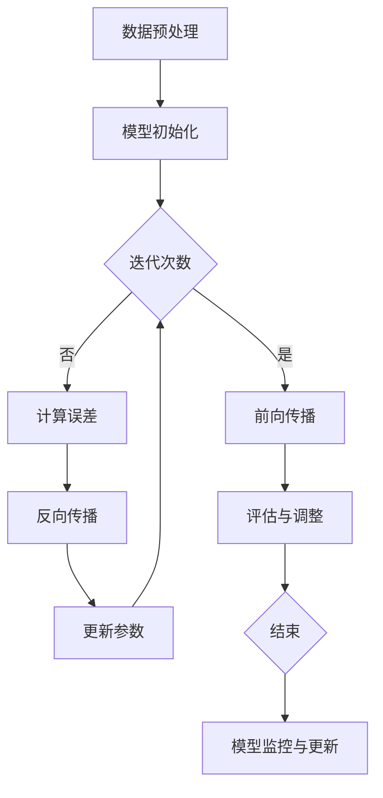

                 

关键词：大模型，商业模式，创业战略，技术趋势，市场分析，案例研究

> 摘要：本文将深入探讨大模型创业的战略蓝图，从背景介绍到实际应用，再到未来展望，全面分析大模型创业的关键因素、成功案例和潜在挑战。本文旨在为创业者提供有价值的参考和指导。

## 1. 背景介绍

### 大模型的兴起

大模型，顾名思义，是指具有巨大参数规模和计算需求的机器学习模型。随着深度学习技术的快速发展，大模型的研发和应用逐渐成为人工智能领域的热点。大模型的兴起主要得益于以下几个因素：

1. **计算能力的提升**：随着GPU和TPU等专用计算设备的普及，大规模计算能力得以实现，为训练和部署大模型提供了硬件支持。
2. **数据的积累**：互联网的快速发展带来了海量数据的产生和积累，为训练大模型提供了丰富的数据资源。
3. **算法的进步**：深度学习算法的不断优化，特别是神经网络的架构和优化算法的发展，使得大模型的训练效率和性能得到了显著提升。

### 大模型的应用场景

大模型在各个领域都有广泛的应用，其中最具代表性的应用包括：

1. **自然语言处理**：大模型在自然语言理解、生成和翻译等方面表现出色，如BERT、GPT等模型在文本分类、问答系统和机器翻译等领域取得了显著成果。
2. **计算机视觉**：大模型在图像识别、物体检测和图像生成等领域也取得了突破性进展，如VGG、ResNet等模型在图像分类和物体检测任务上取得了顶级性能。
3. **语音识别与合成**：大模型在语音识别和语音合成方面也有广泛应用，如WaveNet等模型在语音识别和生成方面达到了人类水平。

### 大模型创业的机遇与挑战

大模型创业具有巨大的机遇，但也面临着诸多挑战。机遇主要体现在以下几个方面：

1. **市场需求**：随着人工智能技术的普及，越来越多的企业和行业对大模型应用的需求日益增加，为创业公司提供了广阔的市场空间。
2. **技术突破**：大模型技术的不断进步，为创业公司提供了技术创新和突破的机会。
3. **资本支持**：大模型的研发和部署需要大量的资金支持，资本市场的关注和投入为创业公司提供了有力支持。

然而，大模型创业也面临着一系列挑战：

1. **计算资源**：大模型的训练和部署需要大量计算资源，这对创业公司来说是一个巨大的挑战。
2. **数据隐私与安全**：大模型在训练和应用过程中涉及大量数据，数据隐私和安全问题不容忽视。
3. **商业模式**：如何将大模型技术转化为实际的商业价值，实现盈利，是创业公司必须面对的挑战。

## 2. 核心概念与联系

### 大模型的概念与分类

大模型，通常指的是参数规模达到百万甚至亿级的神经网络模型。根据模型的应用领域和任务类型，大模型可以分为以下几类：

1. **自然语言处理模型**：如BERT、GPT等，主要用于处理文本数据，包括语言理解、生成和翻译等任务。
2. **计算机视觉模型**：如VGG、ResNet等，主要用于处理图像数据，包括图像分类、物体检测和图像生成等任务。
3. **语音识别与合成模型**：如WaveNet、Tacotron等，主要用于处理语音数据，包括语音识别、语音合成等任务。

### 大模型的架构与原理

大模型的架构通常包括以下几个关键组成部分：

1. **输入层**：接收外部输入数据，如文本、图像或语音信号。
2. **隐藏层**：包含大量的神经元，通过多层神经网络结构对输入数据进行加工和处理。
3. **输出层**：根据模型的任务类型，输出预测结果或生成内容。

大模型的工作原理是基于神经网络的反向传播算法，通过不断调整模型参数，使得模型的预测结果与实际结果之间的误差最小化。具体来说，大模型通过以下步骤进行训练：

1. **前向传播**：将输入数据传递到模型中，计算模型的预测输出。
2. **计算误差**：将预测输出与实际输出进行比较，计算误差。
3. **反向传播**：根据误差计算梯度，反向更新模型参数。

### 大模型的训练与优化

大模型的训练过程是一个复杂且耗时的过程，通常包括以下几个步骤：

1. **数据预处理**：对输入数据进行标准化、去噪和编码等预处理操作。
2. **模型初始化**：随机初始化模型参数。
3. **训练循环**：通过多次迭代，不断更新模型参数，减小误差。
4. **评估与调整**：在训练过程中，定期评估模型性能，根据评估结果调整训练策略。

大模型的优化策略包括：

1. **批量大小**：调整批量大小，以平衡训练速度和准确性。
2. **学习率**：调整学习率，以控制模型更新的步长。
3. **正则化**：引入正则化项，防止模型过拟合。

### 大模型的部署与应用

大模型的部署过程主要包括以下几个步骤：

1. **模型压缩**：通过模型剪枝、量化等技术，减小模型参数规模，降低部署成本。
2. **模型转换**：将训练好的模型转换为可部署的格式，如ONNX、TensorRT等。
3. **部署环境**：搭建部署环境，包括硬件设备和软件框架。
4. **模型监控与更新**：对部署模型进行实时监控，根据需求进行模型更新和优化。

### Mermaid 流程图

以下是一个简化的Mermaid流程图，展示了大模型的训练与优化过程：



## 3. 核心算法原理 & 具体操作步骤

### 3.1 算法原理概述

大模型的核心算法是基于深度学习技术的神经网络算法。神经网络通过多层神经元结构，对输入数据进行特征提取和转换，最终输出预测结果。以下是神经网络的基本原理和步骤：

1. **前向传播**：将输入数据传递到模型中，通过多层神经元的非线性变换，计算输出结果。
2. **反向传播**：计算输出结果与实际结果之间的误差，通过误差反向传播，更新模型参数。
3. **梯度下降**：使用梯度下降算法，根据误差梯度调整模型参数，减小误差。

### 3.2 算法步骤详解

1. **数据预处理**：对输入数据进行标准化、去噪和编码等预处理操作，以消除数据差异，提高模型训练效果。

2. **模型初始化**：随机初始化模型参数，为后续训练过程奠定基础。

3. **训练循环**：

    a. **前向传播**：将输入数据传递到模型中，计算输出结果。

    b. **计算误差**：将输出结果与实际结果进行比较，计算误差。

    c. **反向传播**：根据误差反向传播，计算误差梯度。

    d. **梯度下降**：根据误差梯度调整模型参数，更新模型参数。

    e. **评估与调整**：在训练过程中，定期评估模型性能，根据评估结果调整训练策略。

4. **模型优化**：通过模型压缩、量化等技术，优化模型参数规模和计算效率，提高模型部署性能。

### 3.3 算法优缺点

**优点**：

1. **强大的特征提取能力**：神经网络通过多层结构，可以提取输入数据的高层次特征，提高模型准确性。
2. **自适应性强**：神经网络可以根据数据特征自动调整模型结构，适应不同类型的数据和应用场景。
3. **广泛应用**：神经网络在自然语言处理、计算机视觉、语音识别等领域都有广泛应用。

**缺点**：

1. **计算资源消耗大**：大模型的训练和优化需要大量的计算资源，对硬件设备要求较高。
2. **数据隐私和安全问题**：大模型在训练和应用过程中涉及大量数据，数据隐私和安全问题不容忽视。
3. **训练时间长**：大模型的训练过程通常耗时较长，训练时间取决于数据规模和模型复杂度。

### 3.4 算法应用领域

大模型在以下领域具有广泛的应用：

1. **自然语言处理**：包括文本分类、问答系统、机器翻译、文本生成等。
2. **计算机视觉**：包括图像分类、物体检测、图像生成等。
3. **语音识别与合成**：包括语音识别、语音合成、语音增强等。
4. **推荐系统**：包括基于内容的推荐、协同过滤等。
5. **自动驾驶**：包括车辆检测、行人检测、场景理解等。

## 4. 数学模型和公式 & 详细讲解 & 举例说明

### 4.1 数学模型构建

大模型的数学模型主要基于神经网络，神经网络由多层神经元组成，每层神经元都通过权重矩阵和偏置项进行连接。以下是神经网络的基本数学模型：

1. **输入层**：\( x_i = x_i^{(1)} \)
2. **隐藏层**：\( z_j^{(l)} = \sum_{i} w_{ij}^{(l)} x_i^{(l-1)} + b_j^{(l)} \)
3. **输出层**：\( y_j = \sigma(z_j^{(L)}) \)

其中，\( x_i \)表示输入层的第\( i \)个神经元，\( z_j^{(l)} \)表示第\( l \)层第\( j \)个神经元的输出，\( w_{ij}^{(l)} \)表示第\( l \)层第\( j \)个神经元与第\( l-1 \)层第\( i \)个神经元的权重，\( b_j^{(l)} \)表示第\( l \)层第\( j \)个神经元的偏置，\( \sigma \)表示激活函数。

### 4.2 公式推导过程

以下是神经网络的基本公式推导过程：

1. **输入层到隐藏层**：

   \( z_j^{(l)} = \sum_{i} w_{ij}^{(l)} x_i^{(l-1)} + b_j^{(l)} \)

   \( \delta_j^{(l)} = \frac{\partial L}{\partial z_j^{(l)}} = \frac{\partial L}{\partial y_j} \cdot \frac{\partial y_j}{\partial z_j^{(l)}} \)

   \( \delta_i^{(l-1)} = \sum_{j} w_{ji}^{(l)} \delta_j^{(l)} \)

2. **隐藏层到输出层**：

   \( \delta_j^{(L)} = \frac{\partial L}{\partial z_j^{(L)}} = \frac{\partial L}{\partial y_j} \cdot \frac{\partial y_j}{\partial z_j^{(L)}} \)

3. **反向传播**：

   \( \delta_j^{(l)} = \sigma'(z_j^{(l)}) \cdot \sum_{k} w_{kj}^{(l+1)} \delta_k^{(l+1)} \)

   \( \frac{\partial L}{\partial w_{ij}^{(l)}} = \delta_j^{(l)} x_i^{(l-1)} \)

   \( \frac{\partial L}{\partial b_j^{(l)}} = \delta_j^{(l)} \)

### 4.3 案例分析与讲解

以下是一个简单的神经网络模型，用于实现二分类任务：

1. **输入层**：\( x = [x_1, x_2] \)
2. **隐藏层**：\( z = [z_1, z_2] \)
3. **输出层**：\( y = [y_1, y_2] \)

   \( z_1 = x_1 \cdot w_{11} + x_2 \cdot w_{12} + b_1 \)

   \( z_2 = x_1 \cdot w_{21} + x_2 \cdot w_{22} + b_2 \)

   \( y_1 = \sigma(z_1) \)

   \( y_2 = \sigma(z_2) \)

假设目标标签为\( t = [1, 0] \)，实际输出为\( y = [0.9, 0.1] \)。

1. **前向传播**：

   \( z_1 = x_1 \cdot w_{11} + x_2 \cdot w_{12} + b_1 \)

   \( z_2 = x_1 \cdot w_{21} + x_2 \cdot w_{22} + b_2 \)

   \( y_1 = \sigma(z_1) = 0.9 \)

   \( y_2 = \sigma(z_2) = 0.1 \)

2. **反向传播**：

   \( \delta_1 = (t_1 - y_1) \cdot \sigma'(z_1) = 0.1 \cdot 0.1 = 0.01 \)

   \( \delta_2 = (t_2 - y_2) \cdot \sigma'(z_2) = 0.9 \cdot 0.9 = 0.81 \)

   \( \frac{\partial L}{\partial w_{11}} = \delta_1 \cdot x_1 = 0.01 \cdot x_1 \)

   \( \frac{\partial L}{\partial w_{12}} = \delta_1 \cdot x_2 = 0.01 \cdot x_2 \)

   \( \frac{\partial L}{\partial w_{21}} = \delta_2 \cdot x_1 = 0.81 \cdot x_1 \)

   \( \frac{\partial L}{\partial w_{22}} = \delta_2 \cdot x_2 = 0.81 \cdot x_2 \)

   \( \frac{\partial L}{\partial b_1} = \delta_1 \)

   \( \frac{\partial L}{\partial b_2} = \delta_2 \)

通过反向传播算法，可以计算每个参数的误差梯度，进而更新参数，优化模型。

## 5. 项目实践：代码实例和详细解释说明

### 5.1 开发环境搭建

在进行大模型项目实践之前，我们需要搭建一个合适的开发环境。以下是搭建Python开发环境的基本步骤：

1. **安装Python**：下载并安装Python 3.x版本，建议使用Anaconda，以便方便地管理环境和依赖包。
2. **安装依赖包**：使用pip命令安装必要的依赖包，如NumPy、TensorFlow、PyTorch等。
3. **创建虚拟环境**：为项目创建一个独立的虚拟环境，以便更好地管理依赖包和项目配置。
4. **配置GPU支持**：如果使用GPU训练模型，需要安装CUDA和cuDNN，并配置环境变量。

### 5.2 源代码详细实现

以下是一个简单的示例代码，实现了一个基于TensorFlow的线性回归模型，用于预测房价：

```python
import tensorflow as tf
import numpy as np
import matplotlib.pyplot as plt

# 数据预处理
x_data = np.linspace(0, 10, 100)
y_data = 3 * x_data + 2 + np.random.normal(0, 1, 100)

# 模型定义
X = tf.placeholder(tf.float32, shape=[None])
Y = tf.placeholder(tf.float32, shape=[None])

W = tf.Variable(0.0, name="weights")
b = tf.Variable(0.0, name="biases")

y_pred = tf.multiply(W, X) + b

loss = tf.reduce_mean(tf.square(y_pred - Y))

# 训练过程
optimizer = tf.train.GradientDescentOptimizer(learning_rate=0.5)
train_op = optimizer.minimize(loss)

# 运行训练
with tf.Session() as sess:
    sess.run(tf.global_variables_initializer())

    for step in range(201):
        sess.run(train_op, feed_dict={X: x_data, Y: y_data})

        if step % 20 == 0:
            print("step:", step, "W:", sess.run(W), "b:", sess.run(b), "loss:", sess.run(loss, feed_dict={X: x_data, Y: y_data}))

    # 可视化结果
    plt.plot(x_data, y_data, 'ro', label='original data')
    plt.plot(x_data, sess.run(W) * x_data + sess.run(b), label='fitted line')
    plt.legend()
    plt.show()
```

### 5.3 代码解读与分析

上述代码实现了一个简单的线性回归模型，用于预测房价。以下是代码的关键部分解读：

1. **数据预处理**：生成一组随机数据，模拟房价与房屋面积之间的关系。
2. **模型定义**：定义输入层、权重和偏置变量，以及输出层的预测值。
3. **损失函数**：定义损失函数，用于衡量预测值与实际值之间的差距。
4. **训练过程**：使用梯度下降优化器更新模型参数，最小化损失函数。
5. **可视化结果**：将训练结果可视化，展示拟合直线与原始数据的关系。

### 5.4 运行结果展示

运行上述代码，可以得到以下结果：

1. **训练过程输出**：展示了模型参数（权重和偏置）的迭代更新过程，以及每20次迭代的损失值。
2. **可视化结果**：展示了拟合直线与原始数据的关系，验证了模型的效果。

通过这个简单的示例，我们可以了解如何使用TensorFlow实现一个线性回归模型，并对其进行训练和可视化。

## 6. 实际应用场景

### 6.1 自然语言处理

自然语言处理（NLP）是大模型的主要应用领域之一。大模型在NLP任务中取得了显著的成果，如文本分类、机器翻译和问答系统等。以下是一些实际应用场景：

1. **文本分类**：大模型可以用于自动分类大量的文本数据，如新闻分类、情感分析等。例如，使用BERT模型对新闻文章进行分类，可以实现高精度的分类效果。
2. **机器翻译**：大模型在机器翻译领域也取得了突破性进展。例如，Google翻译使用的Transformer模型，可以实现高质量的机器翻译效果。
3. **问答系统**：大模型可以用于构建智能问答系统，如基于BERT的智能客服系统，可以自动回答用户的问题。

### 6.2 计算机视觉

计算机视觉是大模型的另一大应用领域。大模型在图像识别、物体检测和图像生成等方面具有广泛的应用。以下是一些实际应用场景：

1. **图像识别**：大模型可以用于自动识别图像中的物体，如人脸识别、车辆识别等。例如，使用ResNet模型对人脸图像进行识别，可以实现高精度的识别效果。
2. **物体检测**：大模型可以用于检测图像中的多个物体，如基于Faster R-CNN的物体检测模型，可以同时实现定位和分类。
3. **图像生成**：大模型可以用于生成新的图像，如基于GAN的图像生成模型，可以生成高质量的图像。

### 6.3 语音识别与合成

语音识别与合成是大模型在语音领域的应用，包括语音识别、语音合成和语音增强等。以下是一些实际应用场景：

1. **语音识别**：大模型可以用于将语音信号转换为文本，如基于WaveNet的语音识别模型，可以实现高精度的语音识别效果。
2. **语音合成**：大模型可以用于将文本转换为语音信号，如基于Tacotron的语音合成模型，可以生成自然流畅的语音。
3. **语音增强**：大模型可以用于增强语音信号，提高语音质量，如基于深度学习的语音增强模型，可以消除噪声和回声。

### 6.4 未来应用展望

随着大模型技术的不断发展，未来将在更多领域产生重要影响。以下是一些未来应用展望：

1. **医疗健康**：大模型可以用于医疗数据分析，如疾病预测、诊断和治疗方案推荐等，为医疗行业提供智能化支持。
2. **金融领域**：大模型可以用于金融风险预测、投资分析和信用评估等，为金融行业提供决策支持。
3. **教育领域**：大模型可以用于个性化学习、教育评估和智能辅导等，为教育行业提供智能化解决方案。
4. **智能家居**：大模型可以用于智能语音助手、家居设备控制等，提高智能家居的智能化水平。

## 7. 工具和资源推荐

### 7.1 学习资源推荐

1. **《深度学习》**：由Ian Goodfellow、Yoshua Bengio和Aaron Courville编写的经典教材，详细介绍了深度学习的基本理论和应用。
2. **《神经网络与深度学习》**：由邱锡鹏编写的中文教材，深入浅出地介绍了神经网络和深度学习的基础知识。
3. **《动手学深度学习》**：由阿斯顿·张等编写的中文教材，通过实际代码示例，介绍了深度学习的实战技巧。

### 7.2 开发工具推荐

1. **TensorFlow**：谷歌开发的开源深度学习框架，广泛应用于各种深度学习项目。
2. **PyTorch**：Facebook开发的开源深度学习框架，具有灵活的动态计算图和高效的性能。
3. **Keras**：基于TensorFlow和Theano的开源深度学习框架，提供了简洁易用的接口。

### 7.3 相关论文推荐

1. **“A Theoretically Grounded Application of Dropout in Recurrent Neural Networks”**：该论文提出了一种基于Dropout的循环神经网络训练方法，提高了模型的泛化能力。
2. **“BERT: Pre-training of Deep Bidirectional Transformers for Language Understanding”**：该论文介绍了BERT模型，在自然语言处理任务中取得了显著成果。
3. **“Attention Is All You Need”**：该论文提出了Transformer模型，彻底改变了自然语言处理领域的算法架构。

## 8. 总结：未来发展趋势与挑战

### 8.1 研究成果总结

大模型技术的快速发展取得了显著成果，包括：

1. **模型性能的提升**：大模型的参数规模和计算需求不断增加，但模型的性能也在持续提升，实现了在各个领域的重要突破。
2. **应用场景的拓展**：大模型在自然语言处理、计算机视觉、语音识别等领域的应用逐渐成熟，为实际场景提供了强大支持。
3. **算法创新的推进**：大模型的训练和优化算法不断改进，如自适应学习率、批量归一化、正则化技术等，提高了模型的训练效率和效果。

### 8.2 未来发展趋势

大模型技术的未来发展趋势包括：

1. **模型规模的扩大**：随着计算能力的提升，大模型的规模将进一步扩大，实现更高的参数规模和更强的计算能力。
2. **算法的优化与创新**：针对大模型训练和优化的挑战，将不断有新的算法提出，如分布式训练、迁移学习等，以提高模型的训练效率和效果。
3. **跨领域应用**：大模型技术将在更多领域产生重要影响，如医疗健康、金融领域、教育领域等，为各个行业提供智能化解决方案。

### 8.3 面临的挑战

大模型技术在实际应用中仍面临以下挑战：

1. **计算资源消耗**：大模型的训练和部署需要大量的计算资源，对硬件设备的要求较高，这对企业和开发者来说是一个巨大的挑战。
2. **数据隐私与安全**：大模型在训练和应用过程中涉及大量数据，数据隐私和安全问题不容忽视，需要采取有效的保护措施。
3. **模型解释性**：大模型的训练过程复杂，参数规模巨大，如何提高模型的解释性，使其在应用中更加透明和可靠，是一个重要挑战。

### 8.4 研究展望

未来的研究应重点关注以下方向：

1. **模型压缩与加速**：研究如何优化大模型的压缩与加速技术，降低计算资源消耗，提高模型部署效率。
2. **数据隐私保护**：研究如何在大模型训练和应用过程中保护数据隐私，实现安全的数据共享与利用。
3. **跨领域融合**：研究如何将大模型技术与各个领域的专业知识相结合，实现跨领域的智能化应用。
4. **可解释性与可靠性**：研究如何提高大模型的解释性和可靠性，使其在应用中更加透明和可信。

## 9. 附录：常见问题与解答

### 问题 1：大模型训练需要多少时间？

答：大模型训练的时间取决于多个因素，如数据规模、模型复杂度、计算资源等。对于大规模数据集和复杂模型，训练时间可能需要几天甚至几周。为了加速训练，可以使用分布式训练、GPU加速等技术。

### 问题 2：如何解决大模型过拟合问题？

答：大模型过拟合问题可以通过以下方法解决：

1. **数据增强**：增加训练数据量，或对现有数据进行增强处理，提高模型的泛化能力。
2. **正则化技术**：使用正则化项，如L1、L2正则化，降低模型参数的敏感性。
3. **交叉验证**：使用交叉验证技术，评估模型的泛化性能，避免过拟合。
4. **提前停止**：在训练过程中，根据验证集的性能，提前停止训练，防止模型过拟合。

### 问题 3：大模型是否一定比小模型效果好？

答：不一定。大模型在某些情况下可能比小模型效果更好，但在其他情况下，小模型可能足够满足需求。此外，大模型训练和部署的成本较高，需要根据实际需求进行权衡。

### 问题 4：如何评估大模型的效果？

答：评估大模型的效果可以通过以下方法：

1. **准确率**：计算模型预测结果与实际结果之间的准确率，越高表示模型效果越好。
2. **召回率**：计算模型预测结果中实际结果的比例，越高表示模型越能够识别出实际结果。
3. **F1值**：计算准确率和召回率的调和平均值，综合考虑模型效果。
4. **验证集性能**：在训练过程中，定期评估验证集的性能，以评估模型的泛化能力。

### 问题 5：大模型训练过程中如何监控进度？

答：在训练过程中，可以使用以下方法监控进度：

1. **日志记录**：记录训练过程中的关键指标，如损失值、准确率等，以便后续分析和调试。
2. **可视化工具**：使用可视化工具，如TensorBoard，实时显示训练过程中的指标变化，便于分析和调试。
3. **进度报告**：定期生成训练进度报告，包括训练进度、关键指标等，便于团队成员了解项目进展。

### 问题 6：大模型训练需要多少数据？

答：大模型训练所需的数据量取决于多个因素，如模型复杂度、任务类型等。一般来说，较大的数据集有助于提高模型的泛化能力，但也不是数据越多越好。适量且高质量的数据通常更关键。

### 问题 7：如何避免大模型训练中的梯度消失和梯度爆炸问题？

答：为了避免梯度消失和梯度爆炸问题，可以采取以下方法：

1. **初始化策略**：合理初始化模型参数，避免参数过大或过小。
2. **学习率调整**：选择合适的学习率，避免学习率过大导致梯度爆炸，或过小导致梯度消失。
3. **梯度裁剪**：对梯度进行裁剪，限制梯度的范围，避免梯度过大或过小。
4. **批量大小**：调整批量大小，以平衡训练速度和准确性。

### 问题 8：如何优化大模型的部署性能？

答：优化大模型的部署性能可以采取以下方法：

1. **模型压缩**：使用模型压缩技术，如剪枝、量化等，减小模型参数规模，降低部署成本。
2. **模型融合**：将多个小模型融合成一个大型模型，提高模型性能和部署效率。
3. **硬件优化**：优化硬件设备，如GPU、TPU等，提高计算效率和性能。
4. **模型转换**：将训练好的模型转换为高效的部署格式，如ONNX、TensorRT等，提高模型部署速度。

### 问题 9：大模型训练过程中如何避免模型漂移？

答：为了避免模型漂移，可以采取以下方法：

1. **数据多样性**：保持训练数据的多样性，避免模型过度拟合特定数据集。
2. **在线学习**：定期更新模型，使其适应新的数据分布，避免模型过时。
3. **持续监控**：对模型的输出结果进行持续监控，及时发现和纠正异常。
4. **迁移学习**：将已有模型应用于新的数据集，避免从头开始训练，减少模型漂移风险。

### 问题 10：如何评估大模型在实际场景中的效果？

答：评估大模型在实际场景中的效果可以通过以下方法：

1. **实际测试**：在真实场景中运行模型，评估模型在实际应用中的性能。
2. **用户反馈**：收集用户对模型的反馈，评估模型对用户的满意度。
3. **A/B测试**：将模型与现有模型进行对比，评估模型在不同场景中的性能表现。
4. **关键指标**：根据实际应用需求，设置关键指标，评估模型在各个指标上的表现。

以上是关于大模型创业的战略蓝图的详细讨论。希望通过本文的介绍，读者能够对大模型创业有更深入的了解，并能够运用到实际项目中。在未来，随着大模型技术的不断发展，相信大模型创业将迎来更加广阔的发展空间。

