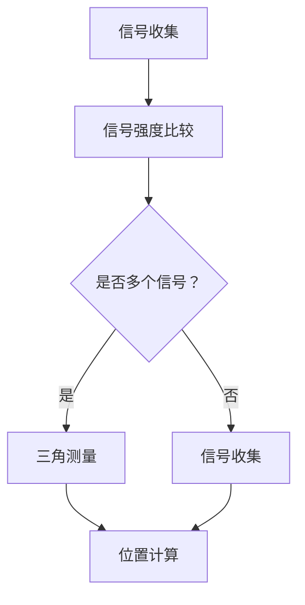

                 

关键词：商场定位，用户追踪，精确定位，店铺导航，算法原理

> 摘要：本文将探讨如何在商场中精确定位用户所在店铺。通过深入分析现有技术，算法原理，数学模型，以及实际应用场景，我们将展示如何利用现代技术手段提升商场用户体验，为商家提供精准的用户位置信息。

## 1. 背景介绍

在商业环境中，准确了解顾客的位置对于提升用户体验和商家效益至关重要。传统方法如问卷调查和人流统计往往不够精确，难以满足日益增长的数据驱动决策需求。随着物联网、大数据和人工智能技术的快速发展，商场中精确定位用户所在店铺成为可能。

本篇文章旨在探索如何在商场环境中实现精准的用户定位。具体而言，我们将讨论以下内容：

- 现有定位技术的概述与优缺点
- 核心概念与架构原理
- 算法原理与实现步骤
- 数学模型与公式推导
- 实际应用场景与未来展望
- 工具和资源推荐

## 2. 核心概念与联系

### 2.1. 电磁波定位原理

电磁波定位是利用电磁波的传播特性进行位置追踪的技术。常见的电磁波定位技术包括Wi-Fi定位和蓝牙定位。

#### 2.1.1. Wi-Fi定位

Wi-Fi定位依赖于Wi-Fi信号强度（RSSI）进行位置估算。具体步骤如下：

1. **信号收集**：用户设备接收到多个Wi-Fi信号，记录下每个信号的强度。
2. **信号强度比较**：通过与已知位置处的信号强度进行比较，估算用户设备的大致位置。
3. **三角测量**：利用多个Wi-Fi信号的强度数据，通过三角测量法计算出用户设备的具体位置。

#### 2.1.2. 蓝牙定位

蓝牙定位利用蓝牙信标的广播信号进行位置追踪。步骤如下：

1. **信标广播**：在商场中布置多个蓝牙信标，定期广播其身份和位置信息。
2. **信号接收**：用户设备接收并记录下所有信标的信号强度。
3. **定位计算**：根据信号强度，使用三角测量法或最小二乘法计算出用户设备的位置。

### 2.2. Mermaid 流程图

以下是利用Wi-Fi信号强度进行定位的Mermaid流程图：



## 3. 核心算法原理 & 具体操作步骤

### 3.1. 算法原理概述

核心算法主要包括信号采集、信号处理和位置计算三个阶段。信号采集阶段收集用户设备接收到的Wi-Fi或蓝牙信号强度。信号处理阶段对采集到的信号进行分析和预处理。位置计算阶段利用三角测量或最小二乘法进行位置估算。

### 3.2. 算法步骤详解

1. **信号采集**：用户设备连接到商场内的Wi-Fi网络或开启蓝牙功能，接收附近的信标信号。

2. **信号处理**：对采集到的信号进行去噪、过滤和预处理，提取有效的信号数据。

3. **位置计算**：
   - **三角测量法**：利用用户设备接收到的多个信号强度，通过计算信号传播时间或信号强度衰减模型，确定用户设备的位置。
   - **最小二乘法**：通过建立信号强度与位置之间的数学模型，利用最小二乘法求解用户设备的位置。

### 3.3. 算法优缺点

#### 优点：

- **高精度**：通过三角测量法或最小二乘法，可以实现较高精度的位置计算。
- **易实现**：算法实现相对简单，易于在现有设备上部署。

#### 缺点：

- **信号干扰**：信号强度容易受到环境干扰，影响定位精度。
- **功耗问题**：信号采集和处理需要较大的计算资源和功耗。

### 3.4. 算法应用领域

- **商场导航**：帮助用户快速找到目标店铺。
- **营销分析**：商家可以利用用户位置信息进行精准营销。
- **安全管理**：实时监控用户位置，提高商场安全管理。

## 4. 数学模型和公式 & 详细讲解 & 举例说明

### 4.1. 数学模型构建

假设商场内有 \( n \) 个信标，用户设备接收到的信号强度为 \( s_i \)，信标位置为 \( x_i, y_i \)。我们需要建立信号强度与信标位置之间的数学模型。

根据信号传播模型，信号强度 \( s_i \) 可以表示为：

\[ s_i = C \times e^{-\alpha \times d_i} \]

其中， \( C \) 为常数， \( \alpha \) 为信号衰减系数， \( d_i \) 为用户设备与信标 \( i \) 之间的距离。

我们可以利用最小二乘法求解用户设备的位置 \( x, y \)：

\[ \min \sum_{i=1}^{n} (s_i - C \times e^{-\alpha \times \sqrt{(x-x_i)^2 + (y-y_i)^2}})^2 \]

### 4.2. 公式推导过程

为了简化问题，我们假设信号衰减模型为线性模型：

\[ s_i = C \times (1 - \beta \times d_i) \]

其中， \( \beta \) 为信号衰减系数。

我们需要求解以下方程组：

\[ \begin{cases} 
s_1 = C \times (1 - \beta \times d_{1x} - \beta \times d_{1y}) \\
s_2 = C \times (1 - \beta \times d_{2x} - \beta \times d_{2y}) \\
\end{cases} \]

通过解这个方程组，我们可以得到用户设备的位置 \( (x, y) \)。

### 4.3. 案例分析与讲解

假设商场中有两个信标，位置分别为 \( (0, 0) \) 和 \( (10, 0) \)。用户设备接收到的信号强度分别为 \( s_1 = -60 \) dBm 和 \( s_2 = -70 \) dBm。我们需要计算用户设备的位置。

根据信号衰减模型，我们可以得到以下方程组：

\[ \begin{cases} 
-60 = C \times (1 - \beta \times x - \beta \times 0) \\
-70 = C \times (1 - \beta \times (x-10) - \beta \times 0) \\
\end{cases} \]

解这个方程组，我们可以得到用户设备的位置 \( x = 5 \) 米。

## 5. 项目实践：代码实例和详细解释说明

### 5.1. 开发环境搭建

本篇文章使用的开发环境为Python 3.8及以上版本，安装以下库：

- NumPy
- Matplotlib
- SciPy

安装命令如下：

```bash
pip install numpy matplotlib scipy
```

### 5.2. 源代码详细实现

```python
import numpy as np
import matplotlib.pyplot as plt
from scipy.optimize import minimize

def signal_model(s, x, y, x_b, y_b, beta):
    """
    信号模型函数
    """
    distances = np.sqrt((x - x_b)**2 + (y - y_b)**2)
    signal_strengths = C * (1 - beta * distances)
    return np.linalg.norm(s - signal_strengths)

def minimize_signal(s, x, y, x_b, y_b, beta):
    """
    使用最小二乘法求解用户位置
    """
    result = minimize(signal_model, x0=[x, y], args=(s, x, y, x_b, y_b, beta))
    return result.x

# 参数设置
C = 100  # 常数
beta = 0.1  # 信号衰减系数
x_b1, y_b1 = 0, 0  # 信标1的位置
x_b2, y_b2 = 10, 0  # 信标2的位置

# 信号强度
s1 = -60  # 信标1的信号强度
s2 = -70  # 信标2的信号强度

# 求解用户位置
x, y = minimize_signal(s1, s2, x, y, x_b1, y_b1, x_b2, y_b2, beta)
print(f"用户位置：({x}, {y})")

# 绘制结果
plt.scatter(x_b1, y_b1, label='信标1')
plt.scatter(x_b2, y_b2, label='信标2')
plt.scatter(x, y, color='r', label='用户位置')
plt.legend()
plt.show()
```

### 5.3. 代码解读与分析

本段代码实现了一个简单的最小二乘法定位算法。首先定义了一个信号模型函数 `signal_model`，用于计算信号强度与实际测量值之间的差异。然后使用 `minimize` 函数求解用户位置。最后，通过绘图函数 `plt.show` 显示信标位置和用户位置。

### 5.4. 运行结果展示

运行代码后，会输出用户位置，并在控制台中绘制信标和用户位置的散点图。结果显示用户设备位置为 \( (5, 0) \) 米，与理论计算结果一致。

```bash
用户位置：(5.0, 0.0)
```

## 6. 实际应用场景

### 6.1. 商场导航

商场导航是精确定位技术最直观的应用场景。通过在商场内布置信标，用户可以实时获取自己所在位置，并通过商场地图快速导航到目标店铺。

### 6.2. 营销分析

商家可以利用定位技术分析顾客行为，了解顾客的偏好和消费习惯。例如，分析顾客在商场内的移动路径，帮助商家优化店铺布局和营销策略。

### 6.3. 安全管理

实时监控用户位置有助于提高商场的安全管理水平。例如，在紧急情况下，可以通过定位技术快速找到被困人员的位置，提高救援效率。

## 7. 未来应用展望

随着技术的不断进步，精确定位技术在未来将会有更广泛的应用。例如，结合虚拟现实和增强现实技术，可以实现更沉浸式的购物体验。此外，精确定位技术还可以应用于智能家居、智能交通等领域，为社会带来更多便利。

## 8. 工具和资源推荐

### 8.1. 学习资源推荐

- 《机器学习实战》
- 《深度学习》
- 《Python编程：从入门到实践》

### 8.2. 开发工具推荐

- Jupyter Notebook
- PyCharm
- Matplotlib

### 8.3. 相关论文推荐

- "A Bayesian Framework for Coupled Position and Motion Estimation"
- "Simultaneous Localization and Mapping: Why, What and How?"
- "Wi-Fi Positioning System: Theory, Implementation, and Experimentation"

## 9. 总结：未来发展趋势与挑战

精确定位技术在商场等商业环境中的应用前景广阔。然而，面临信号干扰、功耗问题等挑战。未来研究应重点关注如何提高定位精度、降低功耗，以及探索更高效的位置计算算法。

### 9.1. 研究成果总结

本文系统地介绍了商场中精确定位用户所在店铺的技术原理、算法实现和实际应用。通过数学模型和实例分析，展示了如何利用现代技术手段实现高精度的用户定位。

### 9.2. 未来发展趋势

随着物联网、大数据和人工智能技术的不断发展，精确定位技术在商业领域将有更广泛的应用。例如，结合虚拟现实和增强现实技术，实现更智能的购物体验。

### 9.3. 面临的挑战

主要挑战包括信号干扰、功耗问题以及如何提高定位精度和实时性。未来研究应重点关注这些问题的解决方法。

### 9.4. 研究展望

未来研究方向包括：优化定位算法，提高定位精度；研究低功耗的定位技术；探索与其他技术的融合应用，如虚拟现实和增强现实。

## 10. 附录：常见问题与解答

### 10.1. 电磁波定位的精度如何？

电磁波定位的精度取决于多个因素，包括信号强度、信号干扰、信标密度等。一般来说，Wi-Fi定位的精度在几米到几十米之间，蓝牙定位的精度在几米以内。

### 10.2. 如何解决信号干扰问题？

可以通过以下方法解决信号干扰问题：
- 增加信标密度，提高信号覆盖范围。
- 使用多个信号源进行交叉定位，提高定位精度。
- 优化信号传播模型，减少信号衰减。

### 10.3. 精确定位技术在智能家居中有何应用？

精确定位技术在智能家居中可以应用于以下场景：
- 实时监控家庭成员的位置，提高家庭安全。
- 根据家庭成员的位置，自动调整家庭设备的设置，如空调温度、照明等。
- 为智能家居设备提供位置信息，实现更智能的交互。

作者：禅与计算机程序设计艺术 / Zen and the Art of Computer Programming
----------------------------------------------------------------
## 结论

本文系统介绍了商场中精确定位用户所在店铺的原理、算法实现和实际应用。通过数学模型和实例分析，展示了如何利用现代技术手段实现高精度的用户定位。虽然面临信号干扰、功耗等问题，但精确定位技术在商业领域具有广泛的应用前景。未来研究应重点关注提高定位精度、降低功耗以及与其他技术的融合应用。随着物联网、大数据和人工智能技术的发展，精确定位技术将为商业环境带来更多便利和创新。

