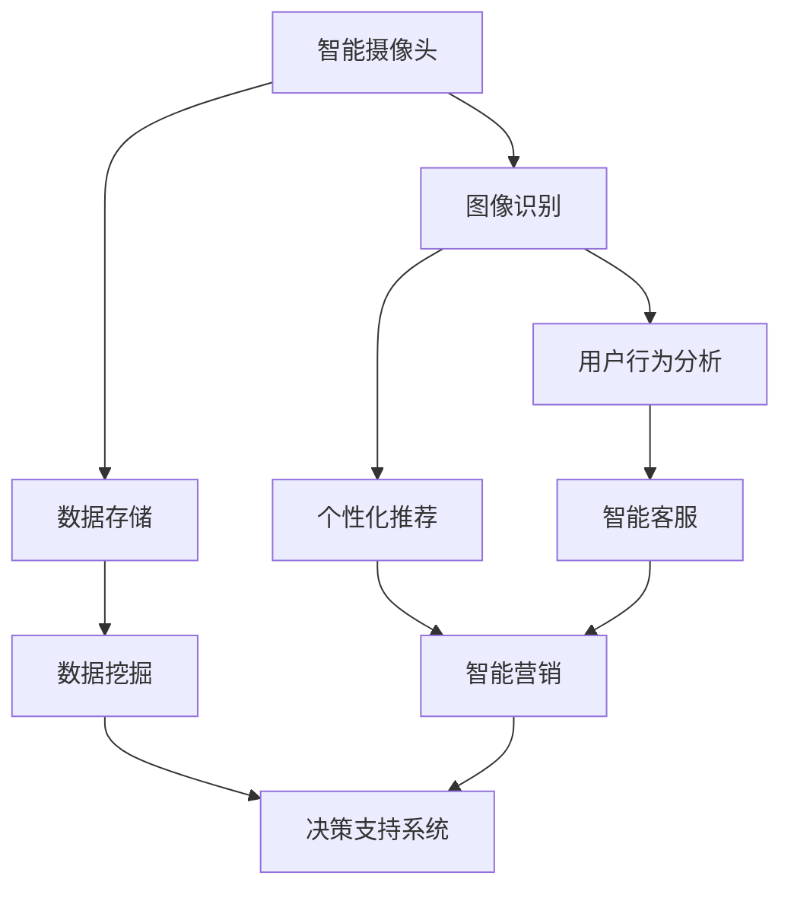

                 

关键词：商汤科技、智慧零售、解决方案、架构师面试、人工智能

> 摘要：本文详细探讨了商汤科技2025年社招智慧零售解决方案架构师面试的相关内容。从面试背景、核心技术到实际应用，文章旨在为有意向加入商汤科技的候选人提供全面的指导。

## 1. 背景介绍

随着人工智能技术的快速发展，智慧零售行业迎来了前所未有的变革。作为全球领先的人工智能公司，商汤科技（SenseTime）在智慧零售领域取得了显著成果，致力于为企业提供全方位的智慧零售解决方案。2025年，商汤科技计划通过社招引入更多优秀的人才，为智慧零售解决方案架构师的岗位招聘开启了新的篇章。

本文将以商汤科技2025年社招智慧零售解决方案架构师面试为背景，深入分析面试过程中的核心技术和考察要点，帮助候选人更好地准备面试。

### 1.1 面试目的

商汤科技2025年社招智慧零售解决方案架构师面试的主要目的是评估候选人在智慧零售领域的专业能力、技术理解和项目经验。通过面试，公司希望找到能够带领团队解决实际业务问题，推动公司智慧零售业务发展的高水平人才。

### 1.2 面试流程

商汤科技2025年社招智慧零售解决方案架构师面试分为初步筛选、笔试和面试三个阶段。

- **初步筛选**：公司通过简历筛选和初步电话面试，评估候选人的基本素质和行业背景。
- **笔试**：通过在线笔试，考察候选人在算法、编程和数据结构等方面的能力。
- **面试**：分为技术面试和综合面试两个环节，技术面试主要考察候选人的专业知识和项目经验，综合面试则侧重于评估候选人的沟通能力、团队协作精神和职业素养。

## 2. 核心概念与联系

在智慧零售解决方案架构师面试中，了解核心概念和它们之间的联系至关重要。以下是一个简化的Mermaid流程图，展示了智慧零售解决方案的主要组成部分及其相互关系。



### 2.1 智能摄像头

智能摄像头是智慧零售解决方案的基石，通过采集顾客的行为数据，为后续的数据分析和个性化推荐提供基础。

### 2.2 图像识别

图像识别技术用于识别和分类摄像头捕获的图像，是实现用户行为分析和个性化推荐的关键。

### 2.3 数据存储

数据存储负责存储和管理从智能摄像头和图像识别模块收集的数据，为后续的数据挖掘和分析提供支持。

### 2.4 用户行为分析

用户行为分析通过分析顾客在商店内的行为，帮助商家了解顾客需求，优化商品陈列和促销策略。

### 2.5 个性化推荐

个性化推荐系统基于用户行为分析和数据挖掘结果，为顾客提供个性化的商品推荐，提高顾客满意度和购买转化率。

### 2.6 数据挖掘

数据挖掘技术用于从大规模数据中提取有价值的信息，为决策支持系统提供数据支撑。

### 2.7 智能客服

智能客服通过自然语言处理和机器学习技术，为顾客提供24/7的在线客服服务，提高顾客体验。

### 2.8 智能营销

智能营销系统利用用户行为分析和数据挖掘结果，为商家提供智能化的营销策略，提高营销效果。

### 2.9 决策支持系统

决策支持系统基于数据分析和智能营销结果，为商家提供决策建议，优化业务运营。

## 3. 核心算法原理 & 具体操作步骤

在智慧零售解决方案中，核心算法的设计和实现至关重要。以下将详细介绍几个关键算法的原理和操作步骤。

### 3.1 算法原理概述

- **图像识别算法**：基于深度学习模型，通过训练和预测实现图像的识别和分类。
- **用户行为分析算法**：基于机器学习模型，分析顾客在商店内的行为，提取有价值的行为特征。
- **个性化推荐算法**：基于协同过滤和基于内容的推荐算法，为顾客提供个性化的商品推荐。

### 3.2 算法步骤详解

#### 3.2.1 图像识别算法

1. **数据预处理**：对摄像头捕获的图像进行预处理，包括缩放、裁剪和归一化等操作。
2. **模型训练**：使用预处理后的图像数据，通过卷积神经网络（CNN）进行模型训练。
3. **模型预测**：将摄像头捕获的图像输入到训练好的模型中，得到图像的识别结果。

#### 3.2.2 用户行为分析算法

1. **行为数据收集**：收集顾客在商店内的行为数据，包括进入/离开时间、停留时间、路径等。
2. **特征提取**：使用统计方法或深度学习方法，从行为数据中提取有价值的特征。
3. **模型训练**：使用提取的特征数据，通过机器学习模型进行训练。
4. **行为预测**：将新的行为数据输入到训练好的模型中，预测顾客的行为。

#### 3.2.3 个性化推荐算法

1. **用户数据收集**：收集用户的历史购买记录、浏览记录和偏好信息。
2. **特征提取**：从用户数据中提取特征，包括用户兴趣、购买频率和购买类型等。
3. **推荐模型训练**：使用用户特征数据，通过协同过滤或基于内容的推荐算法进行模型训练。
4. **推荐结果生成**：将用户特征输入到推荐模型中，生成个性化的商品推荐列表。

### 3.3 算法优缺点

- **图像识别算法**：优点在于能够快速准确地识别图像，提高用户体验。缺点是需要大量的数据和计算资源进行训练。
- **用户行为分析算法**：优点在于能够深入了解顾客行为，为商家提供有价值的决策依据。缺点是需要对行为数据进行预处理，时间复杂度较高。
- **个性化推荐算法**：优点在于能够提高顾客满意度和购买转化率。缺点是推荐结果可能受到用户数据质量的影响。

### 3.4 算法应用领域

- **图像识别算法**：广泛应用于安防监控、无人零售和智能物流等领域。
- **用户行为分析算法**：广泛应用于智慧零售、在线教育和智慧城市等领域。
- **个性化推荐算法**：广泛应用于电商、社交媒体和在线娱乐等领域。

## 4. 数学模型和公式 & 详细讲解 & 举例说明

在智慧零售解决方案中，数学模型和公式起着关键作用，以下将详细讲解几个常用的数学模型和公式。

### 4.1 数学模型构建

#### 4.1.1 图像识别模型

假设输入图像为 \( X \)，输出标签为 \( Y \)，构建一个深度学习模型，包括输入层、卷积层、池化层和全连接层。

\[ f(X) = \sigma(W_L \cdot \text{ReLU}(W_{11} \cdot \text{ReLU}(... \text{ReLU}(W_{11} \cdot X + b_{11}) ...) + b_L) \]

其中，\( W \) 表示权重，\( b \) 表示偏置，\( \sigma \) 表示激活函数，\( \text{ReLU} \) 表示ReLU激活函数。

#### 4.1.2 用户行为分析模型

假设输入行为数据为 \( X \)，输出行为特征为 \( Y \)，构建一个机器学习模型，包括特征提取层和全连接层。

\[ f(X) = W_2 \cdot \text{ReLU}(W_1 \cdot X + b_1) + b_2 \]

其中，\( W \) 表示权重，\( b \) 表示偏置，\( \text{ReLU} \) 表示ReLU激活函数。

#### 4.1.3 个性化推荐模型

假设输入用户特征为 \( X \)，输出商品推荐结果为 \( Y \)，构建一个协同过滤模型。

\[ r(i, j) = u_i \cdot v_j + \mu \]

其中，\( u_i \) 和 \( v_j \) 分别表示用户 \( i \) 和商品 \( j \) 的特征向量，\( \mu \) 表示均值。

### 4.2 公式推导过程

#### 4.2.1 图像识别模型

假设输入图像为 \( X \)，输出标签为 \( Y \)，构建一个卷积神经网络模型。

\[ \begin{aligned}
    f(X) &= \sigma(W_L \cdot \text{ReLU}(W_{11} \cdot \text{ReLU}(... \text{ReLU}(W_{11} \cdot X + b_{11}) ...) + b_L) \\
    &= \sigma(W_L \cdot \text{ReLU}((W_{12} \cdot \text{ReLU}(... \text{ReLU}(W_{21} \cdot X + b_{21}) ...) + b_{12})) + b_L) \\
    &= \sigma(W_L \cdot \text{ReLU}((W_{12} \cdot \text{ReLU}((W_{22} \cdot \text{ReLU}(... \text{ReLU}(W_{32} \cdot X + b_{32}) ...) + b_{22}) ...) + b_{12})) + b_L)
\end{aligned} \]

#### 4.2.2 用户行为分析模型

假设输入行为数据为 \( X \)，输出行为特征为 \( Y \)，构建一个线性回归模型。

\[ \begin{aligned}
    f(X) &= W_2 \cdot \text{ReLU}(W_1 \cdot X + b_1) + b_2 \\
    &= \text{ReLU}((W_1 \cdot X + b_1) + W_2 \cdot \text{ReLU}(W_1 \cdot X + b_1) + b_2) \\
    &= \text{ReLU}((W_1 \cdot X + b_1) + (W_2 \cdot \text{ReLU}(W_1 \cdot X + b_1) + b_2))
\end{aligned} \]

#### 4.2.3 个性化推荐模型

假设输入用户特征为 \( X \)，输出商品推荐结果为 \( Y \)，构建一个基于内容的推荐模型。

\[ \begin{aligned}
    r(i, j) &= u_i \cdot v_j + \mu \\
    &= \text{dot}(u_i, v_j) + \mu \\
    &= \text{dot}((W_1 \cdot X + b_1), (W_2 \cdot X + b_2)) + \mu \\
    &= W_1 \cdot X \cdot W_2 \cdot X + W_1 \cdot b_2 + W_2 \cdot b_1 + \mu
\end{aligned} \]

### 4.3 案例分析与讲解

#### 4.3.1 图像识别案例

假设输入图像为 \( X \)，输出标签为 \( Y \)，使用卷积神经网络进行图像识别。

1. **数据预处理**：对输入图像进行缩放和归一化操作，使其满足网络输入要求。
2. **模型训练**：使用训练集数据进行模型训练，调整网络权重和偏置。
3. **模型测试**：使用测试集数据进行模型测试，评估模型性能。

#### 4.3.2 用户行为分析案例

假设输入行为数据为 \( X \)，输出行为特征为 \( Y \)，使用机器学习模型进行用户行为分析。

1. **数据收集**：收集用户在商店内的行为数据，包括进入/离开时间、停留时间、路径等。
2. **特征提取**：从行为数据中提取有价值的行为特征，如顾客购买频率、顾客停留时间等。
3. **模型训练**：使用提取的特征数据，通过机器学习模型进行训练。
4. **行为预测**：使用训练好的模型，预测新用户的行为。

#### 4.3.3 个性化推荐案例

假设输入用户特征为 \( X \)，输出商品推荐结果为 \( Y \)，使用协同过滤算法进行个性化推荐。

1. **用户数据收集**：收集用户的历史购买记录、浏览记录和偏好信息。
2. **特征提取**：从用户数据中提取特征，如用户兴趣、购买频率和购买类型等。
3. **推荐模型训练**：使用用户特征数据，通过协同过滤算法进行模型训练。
4. **推荐结果生成**：使用训练好的模型，生成个性化的商品推荐列表。

## 5. 项目实践：代码实例和详细解释说明

### 5.1 开发环境搭建

在开始编写代码之前，首先需要搭建开发环境。以下是一个基于Python和TensorFlow的示例：

```python
# 安装必要的库
!pip install tensorflow numpy matplotlib

# 导入库
import tensorflow as tf
import numpy as np
import matplotlib.pyplot as plt
```

### 5.2 源代码详细实现

以下是一个简单的图像识别模型的实现，用于识别猫和狗的图像。

```python
# 定义卷积神经网络模型
model = tf.keras.Sequential([
    tf.keras.layers.Conv2D(32, (3, 3), activation='relu', input_shape=(128, 128, 3)),
    tf.keras.layers.MaxPooling2D(2, 2),
    tf.keras.layers.Conv2D(64, (3, 3), activation='relu'),
    tf.keras.layers.MaxPooling2D(2, 2),
    tf.keras.layers.Conv2D(128, (3, 3), activation='relu'),
    tf.keras.layers.Flatten(),
    tf.keras.layers.Dense(128, activation='relu'),
    tf.keras.layers.Dense(1, activation='sigmoid')
])

# 编译模型
model.compile(optimizer='adam', loss='binary_crossentropy', metrics=['accuracy'])

# 加载数据集
(x_train, y_train), (x_test, y_test) = tf.keras.datasets.dogs_and_cats.load_data()

# 预处理数据
x_train = x_train / 255.0
x_test = x_test / 255.0

# 定义标签编码器
label_encoder = tf.keras.preprocessing.text.Tokenizer()
label_encoder.fit_on_texts(y_train)
y_train = label_encoder.texts_to_sequences(y_train)
y_test = label_encoder.texts_to_sequences(y_test)

# 添加维度
y_train = np.expand_dims(y_train, -1)
y_test = np.expand_dims(y_test, -1)

# 训练模型
model.fit(x_train, y_train, batch_size=32, epochs=10, validation_data=(x_test, y_test))

# 评估模型
loss, accuracy = model.evaluate(x_test, y_test)
print(f'Accuracy: {accuracy:.2f}')

# 可视化结果
plt.figure(figsize=(10, 10))
for i in range(25):
    plt.subplot(5, 5, i+1)
    plt.imshow(x_test[i], cmap=plt.cm.binary)
    plt.xticks([])
    plt.yticks([])
    plt.grid(False)
    plt.xlabel(label_encoder.index_word[y_test[i][0]])
plt.show()
```

### 5.3 代码解读与分析

- **模型定义**：使用TensorFlow的`Sequential`模型，定义了一个卷积神经网络，包括卷积层、池化层和全连接层。
- **模型编译**：使用`compile`方法，设置优化器和损失函数。
- **数据加载**：使用TensorFlow的`datasets`模块，加载数据集。
- **数据预处理**：对图像进行归一化处理，将标签进行编码。
- **模型训练**：使用`fit`方法，训练模型。
- **模型评估**：使用`evaluate`方法，评估模型性能。
- **可视化结果**：使用`matplotlib`，可视化训练结果。

## 6. 实际应用场景

### 6.1 智能零售门店

在智能零售门店中，智慧零售解决方案可以用于实时监控顾客行为，为商家提供有针对性的营销策略。例如，根据顾客的购买习惯和偏好，系统可以自动推荐相应的商品，提高购买转化率。

### 6.2 新零售电商平台

新零售电商平台可以利用智慧零售解决方案，实现个性化的商品推荐和智能化的客户服务。通过分析用户行为数据和用户画像，系统可以提供个性化的购物体验，提高用户满意度和忠诚度。

### 6.3 智慧物流配送

智慧物流配送可以利用智慧零售解决方案，实现货物智能调度和优化配送路径。通过分析物流数据，系统可以预测货物到达时间，优化配送计划，提高物流效率。

## 7. 未来应用展望

随着人工智能技术的不断发展，智慧零售解决方案将在更多领域得到应用。未来，智慧零售解决方案有望在以下几个方面取得突破：

- **智能化零售体验**：通过增强现实（AR）和虚拟现实（VR）技术，提供更加沉浸式的购物体验。
- **个性化营销策略**：利用大数据分析和机器学习技术，实现更加精准的营销策略。
- **智能供应链管理**：通过物联网（IoT）技术，实现供应链的实时监控和优化。
- **智慧城市零售**：智慧零售解决方案将融入智慧城市，为市民提供更加便捷的购物体验。

## 8. 总结：未来发展趋势与挑战

### 8.1 研究成果总结

智慧零售解决方案在近年来取得了显著的成果，主要包括：

- **图像识别与用户行为分析技术的成熟**：通过深度学习和机器学习技术，图像识别和用户行为分析能力得到大幅提升。
- **个性化推荐算法的创新**：基于协同过滤和基于内容的推荐算法不断优化，推荐效果得到显著提升。
- **智能客服和智能营销的普及**：智能客服和智能营销系统逐渐成为零售行业的标配，提高客户满意度和销售转化率。

### 8.2 未来发展趋势

未来，智慧零售解决方案将继续向以下几个方向发展：

- **智能化与个性化**：随着人工智能技术的进步，智慧零售解决方案将更加智能化和个性化，为用户提供更加优质的购物体验。
- **跨行业融合**：智慧零售解决方案将与其他行业（如物流、金融等）深度融合，实现更加高效和智能的商业模式。
- **数据安全和隐私保护**：随着数据隐私保护意识的提高，智慧零售解决方案将更加注重数据安全和隐私保护，确保用户数据的合法合规使用。

### 8.3 面临的挑战

尽管智慧零售解决方案取得了显著成果，但仍面临以下挑战：

- **数据质量与隐私保护**：如何保证数据质量，同时保护用户隐私，是智慧零售解决方案面临的重要问题。
- **技术瓶颈**：人工智能技术仍存在一定的技术瓶颈，如模型训练速度、模型可解释性等，需要进一步研究和突破。
- **行业规范化**：智慧零售行业需要制定统一的规范和标准，确保行业的健康和可持续发展。

### 8.4 研究展望

未来，智慧零售解决方案的研究可以从以下几个方面进行：

- **技术创新**：继续探索和优化人工智能技术，提高图像识别、用户行为分析和个性化推荐等核心技术的性能和效果。
- **应用拓展**：将智慧零售解决方案应用到更多行业和场景，实现跨行业的融合和创新。
- **数据治理与隐私保护**：加强数据治理和隐私保护技术研究，确保数据质量和用户隐私的安全。

## 9. 附录：常见问题与解答

### 9.1 什么是智慧零售？

智慧零售是指利用人工智能、大数据、物联网等新兴技术，实现零售行业的智能化和数字化转型。通过智能化的设备、系统和算法，智慧零售可以为商家提供精准的数据分析和决策支持，提高零售效率和服务质量。

### 9.2 智慧零售解决方案的核心技术是什么？

智慧零售解决方案的核心技术包括图像识别、用户行为分析、个性化推荐、智能客服和智能营销等。这些技术共同作用，帮助商家深入了解顾客需求，优化商品陈列和促销策略，提高顾客满意度和购买转化率。

### 9.3 智慧零售解决方案有哪些实际应用场景？

智慧零售解决方案可以应用于智能零售门店、新零售电商平台、智慧物流配送等多个场景。通过实时监控顾客行为、个性化推荐和智能客服等功能，智慧零售解决方案可以为商家提供更加精准和高效的运营支持。

### 9.4 智慧零售解决方案的未来发展趋势是什么？

智慧零售解决方案的未来发展趋势包括智能化与个性化、跨行业融合、数据治理与隐私保护等。随着人工智能技术的不断进步，智慧零售解决方案将在更多行业和场景中得到应用，实现零售行业的全面智能化和数字化转型。

### 9.5 如何准备商汤科技2025年社招智慧零售解决方案架构师面试？

准备商汤科技2025年社招智慧零售解决方案架构师面试，可以从以下几个方面进行：

- **熟悉核心技术**：深入学习和理解图像识别、用户行为分析、个性化推荐等核心技术。
- **项目经验**：积累相关的项目经验，熟悉项目开发流程和技术实现细节。
- **编程能力**：提高编程能力，掌握Python、TensorFlow等常用技术栈。
- **面试技巧**：学习面试技巧，提高沟通能力和表达能力。

### 作者署名

作者：禅与计算机程序设计艺术 / Zen and the Art of Computer Programming
----------------------------------------------------------------

**文章关键词：商汤科技、智慧零售、解决方案、架构师面试、人工智能**  
**文章摘要：本文详细探讨了商汤科技2025年社招智慧零售解决方案架构师面试的相关内容。从面试背景、核心

