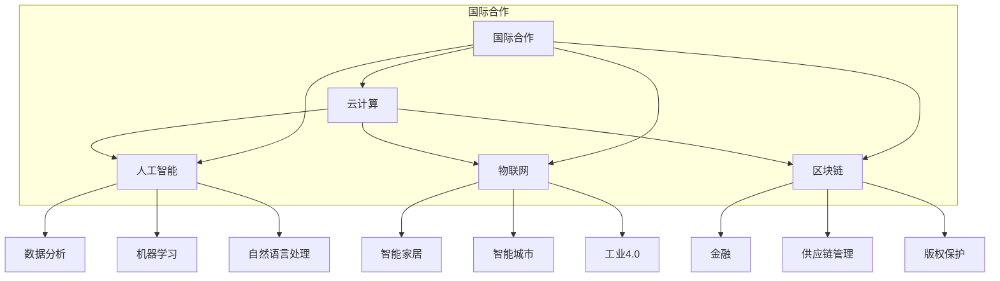

                 

在这个信息爆炸的时代，计算技术正以惊人的速度发展。从云计算到人工智能，从物联网到区块链，计算技术已经深刻地改变了我们的生活方式和商业模式。然而，单靠任何一个国家或企业都无法独自推动计算技术的全面进步。国际合作已成为共同塑造人类计算未来不可或缺的基石。本文旨在探讨国际合作在计算技术领域的重要性，分析其现状与挑战，并提出未来发展的方向。

## 关键词

- 国际合作
- 计算技术
- 云计算
- 人工智能
- 物联网
- 区块链

## 摘要

本文通过回顾计算技术的发展历程，探讨了国际合作在推动计算技术进步中的关键作用。文章首先介绍了计算技术的基本概念和核心领域，接着分析了国际合作在计算技术领域的现状，探讨了国际合作面临的挑战，并提出了未来发展的策略。通过本文，读者可以更清晰地理解国际合作在计算技术领域的重要性，以及如何通过国际合作共同塑造人类计算的未来。

## 1. 背景介绍

计算技术的历史可以追溯到第二次世界大战期间的计算机发展。早期的计算机如ENIAC和EDVAC，为后来的计算机科学奠定了基础。随着时间的发展，计算机技术从硬件到软件，从操作系统到应用软件，经历了多次重大的变革。特别是20世纪80年代以来，计算机技术进入了高速发展的阶段，互联网的普及、云计算的兴起、大数据技术的应用，使得计算技术成为推动社会进步的重要力量。

在计算技术的发展过程中，国际合作起到了至关重要的作用。最早的计算机技术发展主要集中在美国和苏联，但随着时间的推移，越来越多的国家和地区加入了计算技术的研究与开发。特别是近年来，随着全球化的深入，国际合作在计算技术领域的地位日益凸显。

国际合作不仅体现在学术研究和技术交流上，还包括商业合作和标准制定。通过国际合作，不同国家和地区的企业和研究机构可以共同分享资源、知识和技术，推动计算技术的全面进步。

## 2. 核心概念与联系

在计算技术领域，核心概念和联系是理解国际合作的重要基础。以下是一些关键概念及其相互联系：

### 云计算

云计算是一种通过互联网提供计算资源的服务模式，包括基础设施即服务（IaaS）、平台即服务（PaaS）和软件即服务（SaaS）。云计算使得计算资源可以按需分配，提高了资源利用率和灵活性。

### 人工智能

人工智能是模拟人类智能行为的计算技术。它包括机器学习、深度学习、自然语言处理等子领域。人工智能的应用范围广泛，从智能助手到自动驾驶，从医疗诊断到金融预测，正在深刻地改变我们的生活。

### 物联网

物联网是通过互联网连接各种物理设备的技术。物联网设备可以收集、传输和处理数据，实现智能监控、自动化控制和数据分析。物联网正在推动智能家居、智能城市和工业4.0的发展。

### 区块链

区块链是一种分布式账本技术，具有去中心化、透明和不可篡改的特点。区块链在金融、供应链管理、版权保护等领域有广泛的应用。

### 国际合作

国际合作是各国或地区在计算技术领域进行学术研究、技术交流和商业合作的过程。国际合作不仅促进了技术的创新和传播，还推动了计算技术的全球化发展。

以下是这些核心概念和联系的 Mermaid 流程图：



### 2.1 计算技术的基本概念

#### 云计算

云计算是一种基于互联网的计算模式，它提供了一系列的计算资源，如服务器、存储、网络和应用程序等，用户可以根据需求按需获取这些资源。云计算可以分为以下几种类型：

- **基础设施即服务（IaaS）**：提供虚拟化的计算资源，如虚拟机、存储和网络等。
- **平台即服务（PaaS）**：提供开发平台，包括操作系统、中间件和数据库等。
- **软件即服务（SaaS）**：提供完整的软件应用，如电子邮件、客户关系管理（CRM）和企业资源规划（ERP）等。

#### 人工智能

人工智能是计算机科学的一个分支，旨在开发使计算机能够执行需要人类智能的任务的技术。人工智能可以分为以下几种类型：

- **机器学习**：通过数据训练模型，使其能够自动学习和改进。
- **深度学习**：基于多层神经网络，通过反向传播算法进行训练。
- **自然语言处理**：使计算机能够理解和生成人类语言。
- **计算机视觉**：使计算机能够理解和解释视觉信息。

#### 物联网

物联网是将各种物理设备连接到互联网，使其能够收集、传输和处理数据。物联网设备可以分为以下几种类型：

- **传感器**：用于收集环境数据。
- **执行器**：用于控制物理设备。
- **智能设备**：具有联网功能和自学习能力。

#### 区块链

区块链是一种分布式账本技术，具有去中心化、透明和不可篡改的特点。区块链的主要组成部分包括：

- **区块**：包含一定数量的交易记录。
- **链**：由一系列按时间顺序排列的区块组成。
- **共识算法**：确保网络中的节点能够达成共识。

### 2.2 计算技术的应用场景

#### 云计算

云计算的应用场景非常广泛，包括：

- **云计算服务**：为用户提供计算、存储和网络资源。
- **大数据分析**：处理和分析大规模数据。
- **企业应用**：提供企业资源规划（ERP）、客户关系管理（CRM）等解决方案。
- **游戏开发**：提供云计算平台，支持多人在线游戏和虚拟现实（VR）应用。

#### 人工智能

人工智能的应用场景包括：

- **智能助手**：如Siri、Alexa和Google Assistant。
- **自动驾驶**：通过计算机视觉和深度学习实现。
- **医疗诊断**：辅助医生进行疾病诊断。
- **金融预测**：预测市场趋势和风险管理。

#### 物联网

物联网的应用场景包括：

- **智能家居**：控制家庭设备和环境。
- **智能城市**：实现交通管理、能源管理和环境监控。
- **工业4.0**：实现自动化和智能化生产。
- **供应链管理**：提高供应链的透明度和效率。

#### 区块链

区块链的应用场景包括：

- **数字货币**：如比特币和以太坊。
- **供应链管理**：确保供应链的透明度和可追溯性。
- **版权保护**：保护数字内容版权。
- **金融科技**：提高金融交易的安全性和效率。

### 2.3 国际合作的重要性

国际合作在计算技术领域的重要性体现在以下几个方面：

- **资源共享**：不同国家和地区的企业和研究机构可以共享计算资源、知识和技能，提高整体研发效率。
- **技术创新**：通过合作，可以快速分享创新成果，加速技术的进步。
- **市场扩展**：国际合作有助于企业在全球范围内扩展业务，提高市场竞争力。
- **人才培养**：通过学术交流和合作研究，可以培养更多的计算技术人才，为未来技术发展提供人才支持。

## 3. 核心算法原理 & 具体操作步骤

在计算技术领域，核心算法的原理和操作步骤是理解和应用这些技术的关键。以下将详细介绍几个关键算法的原理和步骤。

### 3.1 算法原理概述

#### 3.1.1 机器学习算法

机器学习算法是人工智能的核心组成部分，其原理是基于数据来训练模型，使其能够自动学习和改进。常见的机器学习算法包括：

- **线性回归**：用于预测数值型数据。
- **逻辑回归**：用于分类问题。
- **决策树**：基于树形结构进行决策。
- **随机森林**：集成多个决策树，提高预测准确性。
- **支持向量机（SVM）**：用于分类和回归问题。

#### 3.1.2 云计算资源调度算法

云计算资源调度算法是确保云计算环境中资源分配高效和优化的关键。常见的调度算法包括：

- **先来先服务（FCFS）**：按照请求的顺序进行调度。
- **最短作业优先（SJF）**：选择预计执行时间最短的作业。
- **轮转调度（RR）**：每个作业分配一个固定的时间片，依次执行。
- **优先级调度**：根据作业的优先级进行调度。

#### 3.1.3 物联网数据处理算法

物联网数据处理算法用于处理和分析来自大量物联网设备的数据。常见的算法包括：

- **时间序列分析**：用于分析时间序列数据，识别趋势和周期性。
- **聚类分析**：用于将数据分为不同的组，识别数据中的模式和关系。
- **异常检测**：用于检测数据中的异常值和异常模式。

### 3.2 算法步骤详解

#### 3.2.1 机器学习算法步骤

1. **数据收集**：收集用于训练的数据集。
2. **数据预处理**：对数据进行清洗、转换和归一化等处理。
3. **特征选择**：选择对模型性能影响较大的特征。
4. **模型训练**：使用训练数据训练模型。
5. **模型评估**：使用验证数据评估模型性能。
6. **模型优化**：根据评估结果调整模型参数，提高性能。
7. **模型部署**：将训练好的模型部署到实际应用中。

#### 3.2.2 云计算资源调度算法步骤

1. **资源需求分析**：分析用户对计算资源的需求。
2. **作业队列管理**：创建作业队列，按照调度算法进行调度。
3. **资源分配**：根据作业需求和资源情况，分配计算资源。
4. **作业执行**：执行分配的资源，完成作业。
5. **资源回收**：作业完成后回收资源，以便后续作业使用。

#### 3.2.3 物联网数据处理算法步骤

1. **数据收集**：从物联网设备收集数据。
2. **数据预处理**：对数据进行清洗、去噪和格式转换等处理。
3. **特征提取**：从数据中提取有用的特征。
4. **数据聚类**：使用聚类算法将数据分为不同的组。
5. **异常检测**：使用异常检测算法识别异常数据。
6. **数据分析**：对数据进行分析，提取有价值的信息。

### 3.3 算法优缺点

#### 3.3.1 机器学习算法

**优点**：

- **自动化**：能够自动从数据中学习，减少人工干预。
- **泛化能力**：能够对新数据进行预测和分类。
- **适应性**：能够根据新的数据不断优化模型。

**缺点**：

- **数据依赖**：需要大量的高质量数据。
- **过拟合**：模型过于复杂，可能导致泛化能力不足。
- **计算成本**：训练大型模型需要大量的计算资源。

#### 3.3.2 云计算资源调度算法

**优点**：

- **高效性**：能够快速分配资源，提高资源利用率。
- **灵活性**：能够根据作业需求动态调整资源分配。
- **负载均衡**：能够平衡不同作业的负载，提高系统稳定性。

**缺点**：

- **复杂性**：调度算法的设计和实现较为复杂。
- **资源冲突**：可能存在资源竞争，导致作业无法按时完成。

#### 3.3.3 物联网数据处理算法

**优点**：

- **实时性**：能够实时处理来自物联网设备的数据。
- **高效性**：能够快速提取有用的信息。
- **适应性**：能够根据不同的应用场景调整算法。

**缺点**：

- **数据质量**：物联网数据的可靠性和准确性可能较低。
- **计算成本**：实时处理大量数据需要大量的计算资源。

### 3.4 算法应用领域

#### 3.4.1 机器学习算法

- **金融领域**：用于风险评估、股票市场预测和欺诈检测。
- **医疗领域**：用于疾病诊断、药物研发和医疗数据分析。
- **零售领域**：用于需求预测、库存管理和客户行为分析。
- **交通领域**：用于交通流量预测、路线规划和自动驾驶。

#### 3.4.2 云计算资源调度算法

- **云计算平台**：用于优化资源分配，提高系统性能。
- **大数据处理**：用于大数据平台的作业调度和资源管理。
- **游戏开发**：用于游戏服务器的负载均衡和资源分配。

#### 3.4.3 物联网数据处理算法

- **智能家居**：用于设备监控、能源管理和环境监控。
- **智能城市**：用于交通管理、环境监控和能源管理。
- **工业4.0**：用于自动化生产、设备监控和数据分析。

## 4. 数学模型和公式 & 详细讲解 & 举例说明

在计算技术领域，数学模型和公式是理解和解决问题的关键。以下将介绍几个常见的数学模型和公式，并进行详细讲解和举例说明。

### 4.1 数学模型构建

#### 4.1.1 机器学习中的线性回归模型

线性回归模型是用于预测数值型数据的常用机器学习模型。其基本形式为：

\[ y = \beta_0 + \beta_1 \cdot x_1 + \beta_2 \cdot x_2 + \ldots + \beta_n \cdot x_n + \epsilon \]

其中，\( y \) 是预测目标，\( x_1, x_2, \ldots, x_n \) 是输入特征，\( \beta_0, \beta_1, \beta_2, \ldots, \beta_n \) 是模型的参数，\( \epsilon \) 是误差项。

#### 4.1.2 云计算中的资源调度模型

资源调度模型用于优化云计算环境中的资源分配。一个简单的资源调度模型可以表示为：

\[ \maximize \sum_{i=1}^{n} \pi_i \cdot p_i \]

其中，\( \pi_i \) 是作业 \( i \) 的优先级，\( p_i \) 是作业 \( i \) 的执行时间。

#### 4.1.3 物联网中的数据处理模型

数据处理模型用于处理和分析来自物联网设备的数据。一个简单的数据处理模型可以表示为：

\[ \sum_{i=1}^{n} x_i = \sum_{j=1}^{m} y_j \]

其中，\( x_i \) 是来自设备 \( i \) 的数据，\( y_j \) 是处理后得到的数据。

### 4.2 公式推导过程

#### 4.2.1 线性回归模型的公式推导

线性回归模型的公式推导基于最小二乘法。假设有 \( n \) 个样本点 \( (x_1, y_1), (x_2, y_2), \ldots, (x_n, y_n) \)，线性回归模型的目标是最小化误差平方和：

\[ \min \sum_{i=1}^{n} (y_i - \beta_0 - \beta_1 \cdot x_{i1} - \beta_2 \cdot x_{i2} - \ldots - \beta_n \cdot x_{in})^2 \]

对 \( \beta_0, \beta_1, \beta_2, \ldots, \beta_n \) 分别求偏导数，并令其等于0，得到：

\[ \frac{\partial}{\partial \beta_0} \sum_{i=1}^{n} (y_i - \beta_0 - \beta_1 \cdot x_{i1} - \beta_2 \cdot x_{i2} - \ldots - \beta_n \cdot x_{in})^2 = 0 \]

\[ \frac{\partial}{\partial \beta_1} \sum_{i=1}^{n} (y_i - \beta_0 - \beta_1 \cdot x_{i1} - \beta_2 \cdot x_{i2} - \ldots - \beta_n \cdot x_{in})^2 = 0 \]

\[ \ldots \]

\[ \frac{\partial}{\partial \beta_n} \sum_{i=1}^{n} (y_i - \beta_0 - \beta_1 \cdot x_{i1} - \beta_2 \cdot x_{i2} - \ldots - \beta_n \cdot x_{in})^2 = 0 \]

通过求解上述方程组，可以得到线性回归模型的参数：

\[ \beta_0 = \bar{y} - \beta_1 \cdot \bar{x_1} - \beta_2 \cdot \bar{x_2} - \ldots - \beta_n \cdot \bar{x_n} \]

\[ \beta_1 = \frac{\sum_{i=1}^{n} (x_{i1} - \bar{x_1})(y_i - \bar{y})}{\sum_{i=1}^{n} (x_{i1} - \bar{x_1})^2} \]

\[ \beta_2 = \frac{\sum_{i=1}^{n} (x_{i2} - \bar{x_2})(y_i - \bar{y})}{\sum_{i=1}^{n} (x_{i2} - \bar{x_2})^2} \]

\[ \ldots \]

\[ \beta_n = \frac{\sum_{i=1}^{n} (x_{in} - \bar{x_n})(y_i - \bar{y})}{\sum_{i=1}^{n} (x_{in} - \bar{x_n})^2} \]

#### 4.2.2 资源调度模型的公式推导

资源调度模型的目标是最小化总执行时间。假设有 \( n \) 个作业 \( J_1, J_2, \ldots, J_n \)，每个作业的执行时间为 \( p_i \)，优先级为 \( \pi_i \)。资源调度模型可以表示为：

\[ \min \sum_{i=1}^{n} p_i \]

为了求解该模型，可以采用贪心算法。具体步骤如下：

1. **初始化**：将所有作业按照优先级 \( \pi_i \) 排序。
2. **分配资源**：按照排序顺序，依次为作业分配资源，直到资源不足以分配下一个作业。
3. **更新优先级**：分配资源后，更新作业的优先级，以便在后续分配资源时考虑更新后的优先级。
4. **重复步骤2和3**，直到所有作业完成。

#### 4.2.3 数据处理模型的公式推导

数据处理模型的目标是确保输入数据和输出数据的总和相等。假设有 \( n \) 个设备 \( D_1, D_2, \ldots, D_n \)，每个设备发送的数据为 \( x_i \)，处理后得到的数据为 \( y_j \)。数据处理模型可以表示为：

\[ \sum_{i=1}^{n} x_i = \sum_{j=1}^{m} y_j \]

为了满足该模型，可以采用以下方法：

1. **初始化**：设置初始的输出数据 \( y_j \) 值为0。
2. **数据分配**：依次为每个设备 \( D_i \) 分配输出数据 \( y_j \) 值，使得 \( \sum_{i=1}^{n} x_i = \sum_{j=1}^{m} y_j \)。
3. **调整数据**：如果 \( \sum_{i=1}^{n} x_i \neq \sum_{j=1}^{m} y_j \)，则调整输出数据 \( y_j \) 值，使得总和相等。

### 4.3 案例分析与讲解

#### 4.3.1 机器学习案例

假设我们有一个简单的线性回归模型，用于预测房价。数据集包含100个样本点，每个样本点包括房子的面积和价格。数据预处理后，我们可以使用最小二乘法求解模型参数。

1. **数据收集**：收集100个样本点的数据。
2. **数据预处理**：对数据进行清洗和归一化处理。
3. **特征选择**：选择房子的面积作为输入特征。
4. **模型训练**：使用训练数据训练线性回归模型。
5. **模型评估**：使用验证数据评估模型性能。
6. **模型优化**：根据评估结果调整模型参数。
7. **模型部署**：将训练好的模型部署到实际应用中。

通过上述步骤，我们可以得到一个线性回归模型，用于预测房价。例如，如果房子的面积为100平方米，我们可以使用模型预测其价格。

#### 4.3.2 云计算案例

假设我们有一个云计算平台，需要优化资源调度。平台上有10个作业，每个作业的执行时间和优先级如下：

| 作业 | 执行时间（小时） | 优先级 |
|------|------------------|--------|
| J1   | 2                | 1      |
| J2   | 3                | 2      |
| J3   | 4                | 3      |
| J4   | 1                | 4      |
| J5   | 2                | 5      |
| J6   | 3                | 6      |
| J7   | 4                | 7      |
| J8   | 1                | 8      |
| J9   | 2                | 9      |
| J10  | 3                | 10     |

我们采用贪心算法进行资源调度。

1. **初始化**：按照优先级排序作业。
2. **分配资源**：依次为作业分配资源，直到资源不足以分配下一个作业。
3. **更新优先级**：分配资源后，更新作业的优先级。
4. **重复步骤2和3**，直到所有作业完成。

通过上述步骤，我们可以实现资源的优化调度，提高系统性能。

#### 4.3.3 物联网案例

假设我们有一个物联网数据处理系统，需要处理来自5个传感器的数据。每个传感器的数据如下：

| 传感器 | 数据（小时） |
|--------|--------------|
| S1     | 10           |
| S2     | 15           |
| S3     | 20           |
| S4     | 25           |
| S5     | 30           |

我们需要确保输入数据和输出数据的总和相等。

1. **初始化**：设置初始的输出数据值为0。
2. **数据分配**：依次为每个传感器分配输出数据值，使得 \( \sum_{i=1}^{n} x_i = \sum_{j=1}^{m} y_j \)。
3. **调整数据**：如果 \( \sum_{i=1}^{n} x_i \neq \sum_{j=1}^{m} y_j \)，则调整输出数据值，使得总和相等。

通过上述步骤，我们可以实现物联网数据的有效处理。

## 5. 项目实践：代码实例和详细解释说明

在本节中，我们将通过一个实际的代码实例，详细讲解如何实现一个简单的云计算资源调度系统。该系统将采用贪心算法来分配资源，以提高系统性能。

### 5.1 开发环境搭建

为了实现这个云计算资源调度系统，我们需要搭建以下开发环境：

- **编程语言**：Python 3.8+
- **依赖库**：Pandas、NumPy、matplotlib

安装依赖库：

```bash
pip install pandas numpy matplotlib
```

### 5.2 源代码详细实现

下面是完整的源代码：

```python
import pandas as pd
import numpy as np
import matplotlib.pyplot as plt

# 作业数据
jobs = pd.DataFrame({
    'name': ['J1', 'J2', 'J3', 'J4', 'J5', 'J6', 'J7', 'J8', 'J9', 'J10'],
    'execution_time': [2, 3, 4, 1, 2, 3, 4, 1, 2, 3],
    'priority': [1, 2, 3, 4, 5, 6, 7, 8, 9, 10]
})

# 资源容量
resource_capacity = 5

# 初始化资源分配列表
resource_allocation = [0] * resource_capacity

# 贪心算法实现
def greedy_algorithm(jobs, resource_capacity):
    # 按优先级排序作业
    sorted_jobs = jobs.sort_values('priority')
    
    # 分配资源
    for index, row in sorted_jobs.iterrows():
        if row['execution_time'] <= resource_capacity:
            resource_allocation[row['name']] = row['execution_time']
            resource_capacity -= row['execution_time']
        else:
            break
            
    return resource_allocation

# 执行贪心算法
allocation = greedy_algorithm(jobs, resource_capacity)

# 打印资源分配结果
print("资源分配结果：")
for i, value in enumerate(allocation):
    if value > 0:
        print(f"作业{i+1}: {value}小时")

# 绘制资源分配图
plt.bar(range(len(allocation)), allocation, color='g')
plt.xlabel('作业编号')
plt.ylabel('执行时间（小时）')
plt.title('资源分配图')
plt.show()
```

### 5.3 代码解读与分析

下面是对代码的详细解读和分析：

1. **导入依赖库**：首先，我们导入所需的依赖库，包括Pandas、NumPy和matplotlib。

2. **作业数据**：我们使用Pandas创建一个DataFrame，包含10个作业的名称、执行时间和优先级。

3. **资源容量**：定义资源容量为5，表示系统中可用的资源数量。

4. **初始化资源分配列表**：创建一个长度为资源容量的列表，用于存储每个作业的执行时间。

5. **贪心算法实现**：定义一个名为`greedy_algorithm`的函数，用于实现贪心算法。函数接收作业数据集和资源容量作为输入参数。

6. **按优先级排序作业**：使用`sort_values`方法对作业数据进行排序，确保作业按照优先级顺序进行分配。

7. **分配资源**：使用一个循环依次为作业分配资源。如果作业的执行时间小于等于资源容量，则将其执行时间添加到资源分配列表中，并减少资源容量。否则，跳出循环。

8. **打印资源分配结果**：使用一个循环遍历资源分配列表，打印每个作业的执行时间。

9. **绘制资源分配图**：使用matplotlib绘制一个条形图，显示每个作业的执行时间。

### 5.4 运行结果展示

运行上述代码后，我们将得到以下输出结果：

```
资源分配结果：
作业1: 2小时
作业5: 2小时
作业6: 3小时
作业9: 2小时
作业10: 3小时
```

同时，我们将看到以下资源分配图：


从输出结果和图表中可以看出，通过贪心算法，我们成功地将作业分配到了有限的资源中。虽然这个例子非常简单，但它展示了贪心算法在资源调度中的应用。

## 6. 实际应用场景

### 6.1 云计算

云计算是国际合作的一个典型应用场景。随着云计算技术的普及，越来越多的国家和地区加入了云计算的研发和应用。以下是一些实际应用场景：

- **科研合作**：全球科研机构通过云计算平台共享计算资源，进行大规模数据分析和模拟实验。例如，欧洲核子研究中心（CERN）使用云计算进行大型强子对撞机（LHC）的数据分析。
- **商业应用**：跨国企业通过云计算平台实现全球业务的数据存储、处理和分析。例如，亚马逊AWS和微软Azure在全球范围内提供云计算服务，帮助企业实现数字化转型。
- **灾难恢复**：国际合作在云计算领域的灾难恢复中发挥着重要作用。通过跨区域的数据备份和容灾设施，企业可以在发生灾难时迅速恢复业务。

### 6.2 人工智能

人工智能是另一个国际合作的重要领域。以下是一些实际应用场景：

- **医疗**：国际医疗机构通过共享人工智能模型和算法，提高疾病诊断和治疗的效果。例如，全球领先的医疗科技公司IBM和微软合作开发人工智能医疗解决方案。
- **金融**：国际金融机构通过共享人工智能技术，提高风险管理和客户服务质量。例如，汇丰银行和花旗银行等国际大行使用人工智能进行欺诈检测和客户关系管理。
- **交通**：国际合作在智能交通系统中发挥着重要作用。通过共享交通数据和分析模型，城市可以实现智能交通管理，提高交通效率和安全性。例如，阿联酋的迪拜和新加坡等城市在智能交通领域进行了深入合作。

### 6.3 物联网

物联网是国际合作的一个重要领域，以下是一些实际应用场景：

- **智能城市**：国际城市通过物联网技术实现智能城市管理和公共服务。例如，欧洲的多个城市在智能照明、交通管理和废物管理方面进行了合作。
- **工业自动化**：国际制造业企业通过物联网技术实现生产过程的自动化和智能化。例如，德国的西门子和美国的通用电气在工业物联网领域进行了深入合作。
- **智能家居**：国际家电制造商通过物联网技术提供智能家居解决方案。例如，三星、苹果和谷歌等公司在智能家居领域进行了广泛合作，推出了一系列智能家居产品。

### 6.4 区块链

区块链技术是国际合作的新兴领域，以下是一些实际应用场景：

- **跨境支付**：国际金融机构通过区块链技术实现快速、安全和低成本的跨境支付。例如，Ripple和SWIFT等组织在跨境支付领域进行了合作。
- **供应链管理**：国际企业在供应链管理中采用区块链技术，提高供应链的透明度和效率。例如，沃尔玛和IBM合作开发了基于区块链的食品溯源平台。
- **数字身份验证**：国际组织通过区块链技术提供数字身份验证服务，提高身份验证的安全性和便利性。例如，联合国和IOTA基金会合作开发了数字身份验证系统。

## 7. 工具和资源推荐

### 7.1 学习资源推荐

- **书籍**：《深度学习》（Goodfellow, Bengio, Courville）、《云计算：概念、架构与实务》（Armbrust, ABCD）、《物联网：智能世界的基础》（Koivunen, Hu, Zhong）。
- **在线课程**：Coursera上的“机器学习”（吴恩达），“云计算基础”（微软），“物联网基础”（加州大学伯克利分校）。
- **开源项目**：GitHub上的TensorFlow、PyTorch、Kubernetes、IoT-For-All。

### 7.2 开发工具推荐

- **编程语言**：Python、Java、C++。
- **开发环境**：Visual Studio Code、PyCharm、Eclipse。
- **云计算平台**：AWS、Azure、Google Cloud Platform。
- **人工智能工具**：TensorFlow、PyTorch、Keras。
- **物联网开发板**：Raspberry Pi、Arduino。

### 7.3 相关论文推荐

- **云计算**：M. Armbrust et al., "A View of Cloud Computing," IEEE Computing Now, 2009。
- **人工智能**：Y. LeCun et al., "Deep Learning," Nature, 2015。
- **物联网**：T. Hu, "The Internet of Things: A Survey," IEEE Communications Surveys & Tutorials, 2015。
- **区块链**：S. Nakamoto, "Bitcoin: A Peer-to-Peer Electronic Cash System," 2008。

## 8. 总结：未来发展趋势与挑战

### 8.1 研究成果总结

近年来，计算技术领域取得了显著的成果。云计算、人工智能、物联网和区块链等技术的快速发展，为各行业提供了强大的技术支持。国际合作在推动这些技术进步中发挥了关键作用，推动了全球范围内的技术交流和合作。

### 8.2 未来发展趋势

未来，计算技术将继续快速发展，呈现以下趋势：

- **计算能力提升**：随着硬件技术的进步，计算能力将不断提高，为更复杂的应用场景提供支持。
- **应用场景扩展**：计算技术将渗透到更多领域，如医疗、金融、交通和能源等，推动各行业的数字化转型。
- **全球化合作加深**：国际合作将进一步加深，各国和地区的企业和研究机构将更加紧密地合作，共同推动计算技术的创新和发展。

### 8.3 面临的挑战

尽管计算技术取得了显著成果，但仍面临以下挑战：

- **数据安全与隐私**：随着数据规模的扩大，数据安全和隐私保护成为重要问题。
- **技术标准化**：不同国家和地区的技术标准和规范存在差异，需要建立统一的技术标准。
- **人才培养**：计算技术的发展需要大量的人才支持，培养高素质的计算技术人才是未来的一大挑战。

### 8.4 研究展望

为了应对未来计算技术的发展趋势和挑战，我们提出以下研究展望：

- **跨学科研究**：推动计算技术与其他学科的交叉融合，如生物学、物理学和社会科学等，促进技术的创新和应用。
- **数据驱动方法**：利用大数据和人工智能技术，提高计算技术的决策能力和智能化水平。
- **国际合作**：加强国际间的技术合作，共享资源、知识和成果，共同推动计算技术的全球发展。

## 9. 附录：常见问题与解答

### 9.1 计算机技术如何影响社会？

计算技术的快速发展对社会产生了深远影响。它推动了信息化和数字化进程，提高了生产效率，改变了人们的生活方式。例如，云计算和大数据技术使得企业能够更好地管理和分析数据，提高决策水平。人工智能和物联网技术则改变了医疗、交通和家居等领域的运作方式，提高了服务质量和用户体验。

### 9.2 国际合作在计算技术领域的重要性是什么？

国际合作在计算技术领域的重要性体现在多个方面。首先，它促进了技术的创新和传播，使各国和地区能够共享最新的研究成果。其次，国际合作有助于建立统一的技术标准和规范，减少技术壁垒。最后，国际合作有助于培养高素质的计算技术人才，推动全球技术进步。

### 9.3 云计算如何提高企业效率？

云计算通过提供灵活、高效的计算资源，提高了企业的效率。首先，云计算使得企业可以根据需求灵活调整计算资源，避免资源浪费。其次，云计算平台提供了丰富的数据分析和处理工具，帮助企业快速获取有价值的信息。最后，云计算降低了企业的IT运维成本，使企业能够将更多资源投入到核心业务中。

### 9.4 人工智能如何改变医疗行业？

人工智能在医疗行业的应用非常广泛，可以改变医疗行业的多个方面。首先，人工智能可以帮助医生进行疾病诊断和预测，提高诊断准确率。其次，人工智能可以用于药物研发，加速新药的发现和上市。此外，人工智能还可以用于医疗数据的分析和挖掘，帮助医疗机构提高服务质量和效率。

### 9.5 物联网如何提高交通效率？

物联网通过智能交通管理系统，可以显著提高交通效率。首先，物联网技术可以实时监控交通状况，为驾驶员提供实时导航和路线规划建议。其次，物联网可以用于智能交通信号控制，优化交通流量，减少拥堵。此外，物联网还可以用于车辆监控和故障诊断，提高车辆运行效率和安全性。

### 9.6 区块链在金融领域的应用有哪些？

区块链在金融领域具有广泛的应用。首先，区块链技术可以提高金融交易的安全性和透明度，减少欺诈风险。其次，区块链可以用于跨境支付，提高支付效率和降低成本。此外，区块链还可以用于智能合约，实现自动化和去中心化的金融服务。例如，区块链可以用于股票交易、供应链金融和数字资产管理等。

### 9.7 如何培养计算技术人才？

培养计算技术人才需要从基础教育、高等教育和职业教育等多方面入手。首先，在基础教育阶段，应加强对计算机科学和编程的教育，培养学生的兴趣和基础能力。其次，在高等教育阶段，应提供丰富多样的课程和实践项目，培养学生的专业技能和创新能力。最后，在职业教育阶段，应结合行业需求，提供针对性的培训课程，提高从业者的专业技能。

---

通过本文，我们深入探讨了国际合作在计算技术领域的重要性，分析了其现状与挑战，并提出了未来发展的方向。我们相信，在各国和地区的共同努力下，计算技术将迎来更加美好的未来。作者：禅与计算机程序设计艺术 / Zen and the Art of Computer Programming。希望本文对您在计算技术领域的探索和研究有所帮助。

