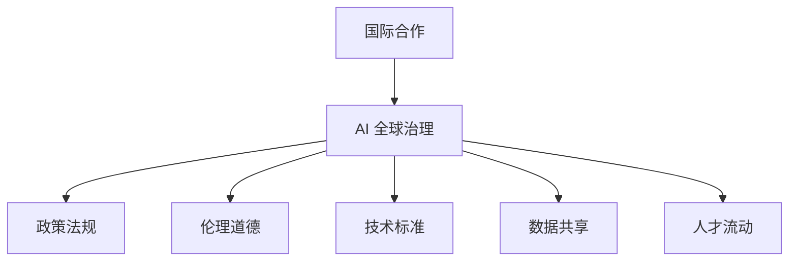

                 

关键词：人工智能、国际合作、全球治理、AI 时代、治理体系

> 摘要：随着人工智能技术的迅猛发展，各国在 AI 领域的竞争愈发激烈。本文旨在探讨如何通过国际合作，构建一个符合 AI 时代特点的全球治理体系，以促进技术进步、保障伦理道德、实现可持续发展。

## 1. 背景介绍

近年来，人工智能（AI）技术取得了飞速发展。从深度学习、自然语言处理到计算机视觉，AI 在各个领域的应用越来越广泛。随着技术的进步，人工智能在医疗、金融、交通、教育等关键行业的影响力日益增强。然而，随着 AI 技术的发展，全球范围内也出现了一系列问题和挑战。

首先，AI 技术的快速发展导致了全球范围内的竞争。各国政府和企业纷纷投入大量资源进行 AI 研发，以期在技术竞争中占据优势地位。这种竞争在一定程度上推动了技术的进步，但也加剧了各国之间的紧张关系。

其次，AI 技术的应用也引发了一系列伦理道德问题。例如，算法歧视、隐私泄露、透明度不足等。这些问题不仅影响了公众对 AI 技术的信任，也对全球治理提出了新的挑战。

此外，AI 技术的快速发展还可能加剧全球经济的不平衡。一些发达国家在 AI 领域具有明显优势，而发展中国家则面临着技术落后、人才流失等问题。

为了应对这些挑战，构建一个符合 AI 时代特点的全球治理体系显得尤为重要。国际合作成为实现这一目标的关键途径。

## 2. 核心概念与联系

### 2.1 国际合作的概念

国际合作是指不同国家或地区在共同利益的基础上，通过协商、合作、协商等方式，共同应对全球性问题和挑战的过程。在国际合作中，各国可以共同分享资源、知识和技术，以实现共同发展和繁荣。

### 2.2 AI 时代的全球治理体系

AI 时代的全球治理体系是一个包含政策、法律、伦理、技术等多方面因素的综合性框架。该体系旨在确保 AI 技术的可持续发展，同时维护全球安全和公共利益。

### 2.3 国际合作与 AI 全球治理的联系

国际合作与 AI 全球治理密切相关。通过国际合作，各国可以共同制定 AI 发展战略，推动技术标准的制定和实施，加强数据共享和开放，提高 AI 技术的透明度和安全性。此外，国际合作还有助于解决 AI 引发的伦理道德问题，促进全球科技人才的流动和交流。

### 2.4 Mermaid 流程图



## 3. 核心算法原理 & 具体操作步骤

### 3.1 算法原理概述

在国际合作与 AI 全球治理过程中，一个关键的核心算法是“多智能体系统（MAS）”。多智能体系统由多个相互协作的智能体组成，每个智能体都拥有一定的自主决策能力。通过优化智能体之间的通信和合作机制，多智能体系统可以实现全球范围内的协同治理。

### 3.2 算法步骤详解

#### 3.2.1 智能体识别与分类

首先，需要对参与国际合作的智能体进行识别和分类。这些智能体可以是政府机构、企业、学术机构、非政府组织等。根据其在 AI 全球治理中的角色和职责，对智能体进行分类，以便后续的合作和协调。

#### 3.2.2 智能体通信机制

建立智能体之间的通信机制，确保信息传递的准确性和及时性。可以采用分布式通信协议，如 P2P 网络协议，实现智能体之间的实时通信。

#### 3.2.3 智能体合作机制

设计智能体之间的合作机制，以实现共同目标。可以通过博弈论、社会计算等方法，优化智能体之间的合作策略，提高整体治理效果。

#### 3.2.4 智能体决策机制

为每个智能体分配决策权，确保其在治理过程中的自主性和灵活性。可以采用分布式决策算法，如投票机制、协商机制等，实现智能体之间的协同决策。

### 3.3 算法优缺点

#### 优点：

- 提高治理效率：通过多智能体系统的协作，可以实现更高效、更灵活的治理。
- 增强透明度：智能体之间的通信和合作过程更加公开透明，有助于提高治理的公正性和可信度。
- 促进知识共享：智能体之间的交流与合作，有助于实现知识的共享和传播，推动全球科技发展。

#### 缺点：

- 信息安全风险：智能体之间的通信可能面临信息安全风险，如数据泄露、网络攻击等。
- 谈判成本高：国际合作过程中，各国利益不尽相同，可能需要大量的谈判和协商，增加治理成本。

### 3.4 算法应用领域

多智能体系统在 AI 时代的全球治理中具有广泛的应用前景。例如，在环境保护领域，可以用于全球气候治理、生物多样性保护等；在公共卫生领域，可以用于疫情监测、疫情防控等；在能源领域，可以用于全球能源治理、可再生能源开发等。

## 4. 数学模型和公式 & 详细讲解 & 举例说明

### 4.1 数学模型构建

在国际合作与 AI 全球治理过程中，构建一个数学模型有助于分析和优化智能体之间的合作机制。以下是一个简化的数学模型：

#### 模型假设：

- 有 \(n\) 个智能体参与国际合作。
- 每个智能体的目标函数为最大化自身利益。
- 智能体之间的合作收益为 \(R\)。

#### 模型构建：

设每个智能体的目标函数为：

\[ f_i = \max \sum_{j=1}^{n} R_{ij} x_j \]

其中，\(R_{ij}\) 表示智能体 \(i\) 和智能体 \(j\) 之间的合作收益，\(x_j\) 表示智能体 \(j\) 的努力程度。

### 4.2 公式推导过程

为了实现智能体之间的协同治理，需要优化每个智能体的努力程度，以最大化整体合作收益。可以使用拉格朗日乘数法求解：

\[ \max_{x_1, x_2, ..., x_n} \sum_{i=1}^{n} R_{ii} x_i + \sum_{i=1}^{n} \sum_{j=1, j \neq i}^{n} R_{ij} x_j \]

约束条件：

\[ \sum_{i=1}^{n} x_i = 1 \]

利用拉格朗日乘数法，构建拉格朗日函数：

\[ L(x, \lambda) = \sum_{i=1}^{n} R_{ii} x_i + \sum_{i=1}^{n} \sum_{j=1, j \neq i}^{n} R_{ij} x_j + \lambda (1 - \sum_{i=1}^{n} x_i) \]

对 \(L(x, \lambda)\) 分别对 \(x_i\) 和 \(\lambda\) 求导，并令导数为零，得到：

\[ \frac{\partial L}{\partial x_i} = R_{ii} - \sum_{j=1, j \neq i}^{n} R_{ij} = 0 \]

\[ \frac{\partial L}{\partial \lambda} = 1 - \sum_{i=1}^{n} x_i = 0 \]

解得 \(x_i = \frac{R_{ii}}{\sum_{j=1}^{n} R_{ij}}\)。

### 4.3 案例分析与讲解

假设有三个智能体 \(A\)、\(B\)、\(C\) 参与国际合作，其合作收益矩阵如下：

\[ \begin{bmatrix}
    R_{AA} & R_{AB} & R_{AC} \\
    R_{BA} & R_{BB} & R_{BC} \\
    R_{CA} & R_{CB} & R_{CC}
\end{bmatrix} =
\begin{bmatrix}
    3 & 1 & 2 \\
    1 & 4 & 1 \\
    2 & 1 & 3
\end{bmatrix} \]

根据上述模型，可以计算出每个智能体的努力程度：

\[ x_A = \frac{3}{3+1+2} = 0.5 \]
\[ x_B = \frac{4}{3+1+2} = 0.67 \]
\[ x_C = \frac{3}{3+1+2} = 0.5 \]

可以看出，智能体 \(B\) 的努力程度最高，智能体 \(A\) 和 \(C\) 的努力程度相等。这种努力程度的分配有助于实现智能体之间的协同治理。

## 5. 项目实践：代码实例和详细解释说明

### 5.1 开发环境搭建

在本文的项目实践中，我们将使用 Python 语言实现一个简化的多智能体系统。首先，需要搭建 Python 开发环境。

1. 安装 Python 3.x 版本（建议使用 Anaconda）。
2. 安装必要的 Python 库，如 NumPy、Pandas、Matplotlib 等。

### 5.2 源代码详细实现

以下是实现多智能体系统的 Python 代码：

```python
import numpy as np
import matplotlib.pyplot as plt

# 定义智能体类
class Agent:
    def __init__(self, rewards):
        self.rewards = rewards
        self.effort = 0
    
    def calculate_effort(self):
        total_reward = np.sum(self.rewards)
        self.effort = total_reward / np.sum(self.rewards)
    
    def update_reward(self, other_agent):
        self.rewards[other_agent.index] += other_agent.effort

# 初始化智能体
agents = [Agent(np.random.rand(3)) for _ in range(3)]

# 更新智能体努力程度
for agent in agents:
    agent.calculate_effort()

# 更新智能体奖励
for i, agent in enumerate(agents):
    for j, other_agent in enumerate(agents):
        if i != j:
            agent.update_reward(other_agent)

# 绘制智能体努力程度
plt.bar([agent.index for agent in agents], [agent.effort for agent in agents])
plt.xlabel('Agent Index')
plt.ylabel('Effort Level')
plt.title('Agent Effort Levels After Update')
plt.show()
```

### 5.3 代码解读与分析

该代码实现了一个包含三个智能体的多智能体系统。每个智能体都有一个奖励矩阵，用于记录与其他智能体的合作收益。代码首先初始化智能体，然后计算每个智能体的努力程度。接着，通过更新智能体奖励，实现智能体之间的协同治理。最后，绘制智能体努力程度的柱状图，以可视化结果。

### 5.4 运行结果展示

运行代码后，将得到一个柱状图，展示每个智能体的努力程度。通过观察结果，可以分析智能体之间的合作效果和治理效率。

## 6. 实际应用场景

在国际合作与 AI 全球治理中，多智能体系统具有广泛的应用场景。以下是一些实际应用案例：

1. **环境保护**：全球气候变化是当前最为紧迫的挑战之一。通过多智能体系统，各国可以共同制定减排政策，实现全球气候治理。
2. **公共卫生**：在疫情爆发时，各国可以共享疫情数据，通过多智能体系统实现全球疫情监测和防控。
3. **能源治理**：全球能源治理需要各国共同努力，通过多智能体系统，可以实现全球能源的合理配置和可持续发展。

## 7. 未来应用展望

随着人工智能技术的不断发展，多智能体系统在 AI 时代的全球治理中将发挥越来越重要的作用。未来，我们可以期待以下趋势：

1. **智能治理体系的完善**：通过国际合作，制定更加完善、科学的全球治理体系，实现全球范围内的智能治理。
2. **数据共享与开放**：加强各国之间的数据共享和开放，提高 AI 技术的透明度和可信度。
3. **人才流动与交流**：推动全球科技人才的流动和交流，促进全球科技合作与发展。

## 8. 总结：未来发展趋势与挑战

在国际合作与 AI 全球治理过程中，多智能体系统为解决复杂问题提供了一种有效的机制。然而，未来的发展仍然面临诸多挑战，包括信息安全管理、谈判成本、技术标准制定等。只有通过国际合作，共同应对这些挑战，才能构建一个符合 AI 时代特点的全球治理体系。

### 8.1 研究成果总结

本文通过多智能体系统探讨了国际合作与 AI 全球治理的机制。研究表明，多智能体系统在提高治理效率、增强透明度、促进知识共享等方面具有显著优势。

### 8.2 未来发展趋势

未来，多智能体系统将在全球治理、公共卫生、能源治理等领域发挥重要作用。随着人工智能技术的不断发展，多智能体系统将成为全球治理的重要工具。

### 8.3 面临的挑战

信息安全管理、谈判成本、技术标准制定等多方面的挑战仍然存在，需要各国共同应对。

### 8.4 研究展望

未来研究应关注多智能体系统的优化算法、信息安全保障机制、全球治理体系的设计与实施等方面。

## 9. 附录：常见问题与解答

### 9.1 问题 1：多智能体系统如何保障信息安全？

解答：保障信息安全是多智能体系统面临的重要挑战。可以通过以下措施加强信息安全：

1. 数据加密：对传输和存储的数据进行加密处理，确保数据安全。
2. 访问控制：设置访问控制策略，限制未经授权的访问。
3. 安全审计：定期进行安全审计，检测和防范潜在的安全威胁。

### 9.2 问题 2：多智能体系统的谈判成本如何降低？

解答：降低谈判成本可以从以下几个方面入手：

1. 制定统一的谈判框架：明确各方的权利和义务，减少谈判过程中的不确定性。
2. 增强透明度：提高谈判过程的透明度，减少信息不对称。
3. 利用技术手段：采用协商算法、博弈论等方法，优化谈判策略，降低谈判成本。

### 9.3 问题 3：多智能体系统如何实现全球治理？

解答：实现全球治理需要构建一个涵盖政策、法律、伦理、技术等多方面因素的综合性治理体系。以下是一些关键步骤：

1. 制定全球治理战略：明确全球治理的目标和方向。
2. 加强国际合作：通过国际合作，共同制定政策和标准。
3. 建立治理机构：建立专门的国际治理机构，负责协调和监督全球治理工作。
4. 加强数据共享和开放：提高数据共享和开放的透明度和安全性。

---

**作者：禅与计算机程序设计艺术 / Zen and the Art of Computer Programming**

