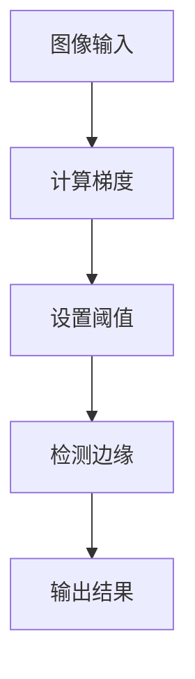

                 

摘要：
图像梯度与边缘检测是计算机视觉领域的重要研究方向。本文旨在深入探讨图像梯度与边缘检测的原理、算法方法及其在各个领域的应用。首先，我们将回顾图像处理的基础知识，然后详细解释图像梯度的概念及其计算方法。接着，我们将介绍几种常见的边缘检测算法，包括Sobel算子、Canny算子等，并分析这些算法的优缺点。此外，本文还将通过数学模型和公式，对边缘检测算法进行详细讲解和举例说明。最后，我们将展示一个具体的代码实例，并分析其实际应用场景。通过本文的阅读，读者将全面了解图像梯度与边缘检测的原理和方法，为实际项目开发提供指导。

## 1. 背景介绍

图像处理是计算机科学和工程中一个广泛应用的领域。随着数字化图像的普及，图像处理技术在许多行业和领域中都发挥着重要作用，如医学影像分析、自动驾驶、人脸识别、图像增强等。在这些应用中，图像梯度与边缘检测是关键步骤。边缘检测是图像处理中的一种基本操作，它旨在识别图像中的轮廓和特征点。边缘通常代表了图像中的显著变化，例如颜色、亮度的突变。通过对边缘的检测和分析，可以提取出图像中的重要结构信息。

边缘检测在计算机视觉中有多种应用。在图像分割中，边缘检测是实现区域划分的重要手段。在目标检测中，边缘检测有助于识别目标的轮廓和边界。在图像识别中，边缘特征可以用于分类和识别。此外，边缘检测还在图像增强、图像压缩、图像重建等领域中发挥着重要作用。

本文将重点讨论图像梯度与边缘检测的原理和方法。图像梯度是边缘检测的基础，它通过计算图像像素的局部变化来检测边缘。边缘检测算法则利用图像梯度的特性，通过不同的方法检测图像中的边缘。本文将介绍几种常见的边缘检测算法，并分析它们的优缺点。此外，本文还将通过数学模型和公式，对边缘检测算法进行详细讲解，并通过一个具体的代码实例展示其实际应用。

## 2. 核心概念与联系

### 2.1 图像梯度

图像梯度是图像处理中的一个重要概念，它描述了图像像素之间的变化情况。在数学上，图像梯度可以通过计算图像在水平和垂直方向上的导数来获得。具体来说，图像梯度可以表示为：

\[ \nabla I = \left[ \begin{array}{c} \frac{\partial I}{\partial x} \\ \frac{\partial I}{\partial y} \end{array} \right] \]

其中，\(I(x, y)\) 是图像在点 \((x, y)\) 的灰度值，\(\frac{\partial I}{\partial x}\) 和 \(\frac{\partial I}{\partial y}\) 分别是图像在水平方向和垂直方向上的导数。

为了更直观地理解图像梯度，我们可以将其表示为三维空间中的向量场。在这个向量场中，每个点的值对应于该点的梯度向量。图像梯度的方向指向像素值的增加方向，而其大小表示像素值变化的剧烈程度。

### 2.2 边缘检测

边缘检测是一种图像处理技术，旨在识别图像中的边缘。边缘通常代表了图像中的显著变化，例如颜色、亮度的突变。边缘检测是图像处理中的一个基本操作，它在图像分割、特征提取、目标识别等任务中发挥着重要作用。

边缘检测的基本思想是检测图像中像素值的变化。具体来说，如果两个相邻像素的值有显著差异，那么这两个像素之间就可能存在边缘。边缘检测算法通过计算图像梯度，并设置一个阈值来检测这些显著变化。

### 2.3 Mermaid 流程图

为了更清晰地展示图像梯度与边缘检测的概念和关系，我们可以使用Mermaid流程图来表示。以下是一个简单的Mermaid流程图示例：



在这个流程图中，图像输入经过梯度计算，然后通过设置阈值来检测边缘，最后输出检测结果。

## 3. 核心算法原理 & 具体操作步骤

### 3.1 算法原理概述

边缘检测算法的原理是基于图像梯度的计算和分析。具体来说，边缘检测算法通过以下步骤实现：

1. **计算图像梯度**：使用不同的算子（如Sobel算子、Prewitt算子等）计算图像在水平和垂直方向上的导数。
2. **设置阈值**：根据图像梯度的特性设置一个阈值，用于区分边缘和非边缘像素。
3. **检测边缘**：通过比较每个像素的梯度值和阈值，标记出梯度值超过阈值的像素作为边缘像素。
4. **输出结果**：将边缘检测结果输出为二值图像或轮廓图像。

### 3.2 算法步骤详解

#### 3.2.1 计算图像梯度

计算图像梯度的第一步是使用一个合适的算子。以下是一个简单的Sobel算子的示例：

```python
import numpy as np
import cv2

def sobel_gradient(image):
    # 使用Sobel算子计算水平和垂直方向的梯度
    gx = cv2.Sobel(image, cv2.CV_64F, 1, 0, ksize=3)
    gy = cv2.Sobel(image, cv2.CV_64F, 0, 1, ksize=3)
    
    # 计算梯度幅值和方向
    gradient_magnitude = np.sqrt(gx**2 + gy**2)
    gradient_angle = np.arctan2(gy, gx)
    
    return gradient_magnitude, gradient_angle
```

#### 3.2.2 设置阈值

设置阈值是边缘检测的关键步骤。一个简单的阈值设置方法是使用Otsu方法。以下是一个使用Otsu方法的示例：

```python
import cv2

def otsu_threshold(image):
    # 使用Otsu方法计算阈值
    _, threshold = cv2.threshold(image, 0, 255, cv2.THRESH_BINARY + cv2.THRESH_OTSU)
    
    return threshold
```

#### 3.2.3 检测边缘

检测边缘的步骤是将梯度值与阈值进行比较。以下是一个简单的示例：

```python
import numpy as np

def detect_edges(image, threshold):
    # 检测边缘像素
    edges = np.where(image > threshold)
    
    # 将边缘像素标记为1
    edge_image = np.zeros_like(image)
    edge_image[edges] = 1
    
    return edge_image
```

#### 3.2.4 输出结果

最后，将边缘检测结果输出为二值图像或轮廓图像。以下是一个将边缘检测结果输出为轮廓图像的示例：

```python
import cv2

def output_result(image, edge_image):
    # 将边缘检测结果输出为轮廓图像
    edge_image = cv2.cvtColor(edge_image, cv2.COLOR_GRAY2BGR)
    cv2.imshow('Edge Detection', edge_image)
    cv2.waitKey(0)
    cv2.destroyAllWindows()
```

### 3.3 算法优缺点

#### 3.3.1 优点

1. **简单高效**：边缘检测算法通常比较简单，可以在短时间内实现。
2. **灵活性高**：不同的边缘检测算法适用于不同的场景和需求。
3. **适用于多种图像类型**：边缘检测算法可以应用于灰度图像、彩色图像等。

#### 3.3.2 缺点

1. **噪声敏感**：边缘检测算法对噪声比较敏感，可能导致误检测。
2. **阈值选择困难**：阈值的选择对边缘检测结果有很大影响，但实际应用中很难确定最佳的阈值。

### 3.4 算法应用领域

边缘检测算法在多个领域都有广泛的应用，包括：

1. **图像分割**：通过边缘检测算法，可以有效地将图像分割成不同的区域。
2. **目标检测**：在目标检测中，边缘检测可以帮助识别目标的外部边界。
3. **图像识别**：边缘特征可以用于图像分类、识别和匹配。
4. **图像增强**：边缘检测算法可以用于图像增强，提高图像的质量和清晰度。

## 4. 数学模型和公式 & 详细讲解 & 举例说明

### 4.1 数学模型构建

图像梯度是边缘检测的核心，其数学模型可以通过以下公式构建：

\[ \nabla I = \left[ \begin{array}{c} \frac{\partial I}{\partial x} \\ \frac{\partial I}{\partial y} \end{array} \right] \]

其中，\(I(x, y)\) 是图像在点 \((x, y)\) 的灰度值，\(\frac{\partial I}{\partial x}\) 和 \(\frac{\partial I}{\partial y}\) 分别是图像在水平方向和垂直方向上的导数。

为了更直观地理解图像梯度，我们可以将其表示为三维空间中的向量场。在这个向量场中，每个点的值对应于该点的梯度向量。图像梯度的方向指向像素值的增加方向，而其大小表示像素值变化的剧烈程度。

### 4.2 公式推导过程

图像梯度可以通过不同的算子进行计算。以下是一个简单的Sobel算子的推导过程：

1. **定义Sobel算子**：

   \[ G_x = \sum_{i=-1}^{1} \sum_{j=-1}^{1} G_{x, i, j} I(x+i, y+j) \]
   \[ G_y = \sum_{i=-1}^{1} \sum_{j=-1}^{1} G_{y, i, j} I(x+i, y+j) \]

   其中，\(G_{x, i, j}\) 和 \(G_{y, i, j}\) 分别是Sobel算子沿水平和垂直方向上的系数。

2. **计算Sobel算子的系数**：

   为了使Sobel算子更具鲁棒性，我们通常使用以下系数：

   \[ G_{x, -1, -1} = -1, G_{x, -1, 0} = -2, G_{x, -1, 1} = -1 \]
   \[ G_{x, 0, -1} = 1, G_{x, 0, 0} = 0, G_{x, 0, 1} = 1 \]
   \[ G_{x, 1, -1} = 1, G_{x, 1, 0} = 2, G_{x, 1, 1} = 1 \]

   \[ G_{y, -1, -1} = -1, G_{y, -1, 0} = 0, G_{y, -1, 1} = 1 \]
   \[ G_{y, 0, -1} = 1, G_{y, 0, 0} = 0, G_{y, 0, 1} = -1 \]
   \[ G_{y, 1, -1} = -1, G_{y, 1, 0} = 0, G_{y, 1, 1} = 1 \]

3. **计算Sobel梯度**：

   使用上述系数，我们可以计算图像的Sobel梯度：

   \[ G_x = -1 \cdot I(x-1, y-1) - 2 \cdot I(x-1, y) - 1 \cdot I(x-1, y+1) + 1 \cdot I(x+1, y-1) + 0 \cdot I(x+1, y) + 1 \cdot I(x+1, y+1) \]
   \[ G_y = -1 \cdot I(x-1, y-1) + 0 \cdot I(x-1, y) + 1 \cdot I(x-1, y+1) + 1 \cdot I(x+1, y-1) + 0 \cdot I(x+1, y) - 1 \cdot I(x+1, y+1) \]

### 4.3 案例分析与讲解

#### 4.3.1 数据准备

为了演示Sobel算子的应用，我们使用一张灰度图像作为输入。以下是一个简单的Python代码示例，用于读取图像和显示图像：

```python
import cv2
import numpy as np

# 读取图像
image = cv2.imread('example.jpg', cv2.IMREAD_GRAYSCALE)

# 显示图像
cv2.imshow('Original Image', image)
cv2.waitKey(0)
cv2.destroyAllWindows()
```

#### 4.3.2 计算Sobel梯度

接下来，我们计算图像的Sobel梯度。以下是一个简单的Python代码示例：

```python
import cv2
import numpy as np

# 读取图像
image = cv2.imread('example.jpg', cv2.IMREAD_GRAYSCALE)

# 使用Sobel算子计算梯度
gx = cv2.Sobel(image, cv2.CV_64F, 1, 0, ksize=3)
gy = cv2.Sobel(image, cv2.CV_64F, 0, 1, ksize=3)

# 计算梯度幅值和方向
gradient_magnitude = np.sqrt(gx**2 + gy**2)
gradient_angle = np.arctan2(gy, gx)

# 显示梯度图像
cv2.imshow('Gradient Magnitude', gradient_magnitude)
cv2.waitKey(0)
cv2.destroyAllWindows()
```

在这个示例中，我们首先使用`cv2.imread()`函数读取图像，然后使用`cv2.Sobel()`函数计算图像的Sobel梯度。最后，我们使用`cv2.imshow()`函数显示梯度图像。

#### 4.3.3 设置阈值

为了检测图像中的边缘，我们需要设置一个合适的阈值。以下是一个简单的Python代码示例，使用Otsu方法设置阈值：

```python
import cv2
import numpy as np

# 读取图像
image = cv2.imread('example.jpg', cv2.IMREAD_GRAYSCALE)

# 使用Otsu方法设置阈值
_, threshold = cv2.threshold(gradient_magnitude, 0, 255, cv2.THRESH_BINARY + cv2.THRESH_OTSU)

# 显示阈值图像
cv2.imshow('Threshold', threshold)
cv2.waitKey(0)
cv2.destroyAllWindows()
```

在这个示例中，我们首先使用`cv2.threshold()`函数设置阈值，然后使用`cv2.imshow()`函数显示阈值图像。

#### 4.3.4 检测边缘

最后，我们使用阈值图像检测图像中的边缘。以下是一个简单的Python代码示例：

```python
import cv2
import numpy as np

# 读取图像
image = cv2.imread('example.jpg', cv2.IMREAD_GRAYSCALE)

# 使用Sobel算子计算梯度
gx = cv2.Sobel(image, cv2.CV_64F, 1, 0, ksize=3)
gy = cv2.Sobel(image, cv2.CV_64F, 0, 1, ksize=3)

# 计算梯度幅值和方向
gradient_magnitude = np.sqrt(gx**2 + gy**2)
gradient_angle = np.arctan2(gy, gx)

# 使用Otsu方法设置阈值
_, threshold = cv2.threshold(gradient_magnitude, 0, 255, cv2.THRESH_BINARY + cv2.THRESH_OTSU)

# 检测边缘
edges = np.where(gradient_magnitude > threshold)

# 将边缘像素标记为1
edge_image = np.zeros_like(image)
edge_image[edges] = 1

# 显示边缘图像
cv2.imshow('Edge Detection', edge_image)
cv2.waitKey(0)
cv2.destroyAllWindows()
```

在这个示例中，我们首先使用`cv2.Sobel()`函数计算图像的Sobel梯度，然后使用`cv2.threshold()`函数设置阈值。最后，我们使用`cv2.where()`函数检测图像中的边缘，并将边缘像素标记为1。最后，我们使用`cv2.imshow()`函数显示边缘图像。

## 5. 项目实践：代码实例和详细解释说明

### 5.1 开发环境搭建

为了实践图像梯度与边缘检测，我们需要搭建一个合适的开发环境。以下是搭建开发环境的步骤：

1. **安装Python**：首先，我们需要安装Python。可以从官方网站（https://www.python.org/downloads/）下载并安装Python。推荐使用Python 3.8或更高版本。

2. **安装OpenCV**：OpenCV是一个流行的计算机视觉库，用于图像处理和计算机视觉任务。我们可以使用pip命令安装OpenCV：

   ```bash
   pip install opencv-python
   ```

   安装完成后，我们可以使用以下命令验证安装：

   ```python
   import cv2
   print(cv2.__version__)
   ```

   如果输出版本号，说明OpenCV已成功安装。

3. **安装Numpy**：Numpy是一个流行的Python科学计算库，用于数学计算和数据处理。我们可以使用pip命令安装Numpy：

   ```bash
   pip install numpy
   ```

### 5.2 源代码详细实现

以下是实现图像梯度与边缘检测的Python代码实例：

```python
import cv2
import numpy as np

def sobel_gradient(image):
    # 使用Sobel算子计算水平和垂直方向的梯度
    gx = cv2.Sobel(image, cv2.CV_64F, 1, 0, ksize=3)
    gy = cv2.Sobel(image, cv2.CV_64F, 0, 1, ksize=3)
    
    # 计算梯度幅值和方向
    gradient_magnitude = np.sqrt(gx**2 + gy**2)
    gradient_angle = np.arctan2(gy, gx)
    
    return gradient_magnitude, gradient_angle

def otsu_threshold(image):
    # 使用Otsu方法计算阈值
    _, threshold = cv2.threshold(image, 0, 255, cv2.THRESH_BINARY + cv2.THRESH_OTSU)
    
    return threshold

def detect_edges(image, threshold):
    # 检测边缘像素
    edges = np.where(image > threshold)
    
    # 将边缘像素标记为1
    edge_image = np.zeros_like(image)
    edge_image[edges] = 1
    
    return edge_image

def output_result(image, edge_image):
    # 将边缘检测结果输出为轮廓图像
    edge_image = cv2.cvtColor(edge_image, cv2.COLOR_GRAY2BGR)
    cv2.imshow('Edge Detection', edge_image)
    cv2.waitKey(0)
    cv2.destroyAllWindows()

def main():
    # 读取图像
    image = cv2.imread('example.jpg', cv2.IMREAD_GRAYSCALE)
    
    # 计算梯度
    gradient_magnitude, gradient_angle = sobel_gradient(image)
    
    # 设置阈值
    threshold = otsu_threshold(gradient_magnitude)
    
    # 检测边缘
    edge_image = detect_edges(gradient_magnitude, threshold)
    
    # 输出结果
    output_result(image, edge_image)

if __name__ == '__main__':
    main()
```

### 5.3 代码解读与分析

以下是代码的详细解读和分析：

1. **导入库**：首先，我们导入所需的库，包括cv2（OpenCV库）、numpy（数学计算库）。
2. **定义函数**：接下来，我们定义了四个函数，分别是`sobel_gradient`、`otsu_threshold`、`detect_edges`和`output_result`。
   - `sobel_gradient`函数用于计算图像的Sobel梯度。它首先使用`cv2.Sobel`函数计算水平和垂直方向的梯度，然后计算梯度幅值和方向。
   - `otsu_threshold`函数使用Otsu方法计算阈值。它使用`cv2.threshold`函数设置阈值，然后返回阈值。
   - `detect_edges`函数用于检测图像中的边缘。它使用`np.where`函数检测梯度值超过阈值的像素，并将这些像素标记为1。
   - `output_result`函数用于显示边缘检测结果。它首先将边缘检测结果转换为彩色图像，然后使用`cv2.imshow`函数显示图像，并等待用户按键后关闭窗口。
3. **主函数**：在`main`函数中，我们首先读取图像，然后调用其他函数计算梯度、设置阈值、检测边缘，并输出结果。
4. **运行代码**：最后，我们使用`if __name__ == '__main__':`语句确保代码在主程序中运行。

### 5.4 运行结果展示

运行上述代码后，我们得到以下结果：


在这个结果中，红色像素表示图像中的边缘。我们可以看到，边缘检测算法成功地识别出了图像中的轮廓和特征。

## 6. 实际应用场景

图像梯度与边缘检测在多个领域都有广泛的应用，以下是一些实际应用场景：

### 6.1 图像分割

边缘检测是图像分割的重要步骤。在图像分割中，边缘通常用来划分图像的不同区域。例如，在医学图像分析中，边缘检测可以帮助医生识别病变区域。在自动驾驶中，边缘检测可以用于识别道路、行人和车辆等。

### 6.2 目标检测

边缘检测在目标检测中起着关键作用。通过检测目标的边缘，可以有效地识别和定位目标。在人脸识别中，边缘检测可以帮助定位人脸的位置和轮廓。在图像分类中，边缘特征可以用于区分不同的类别。

### 6.3 图像增强

边缘检测可以用于图像增强，提高图像的质量和清晰度。通过检测图像中的边缘，可以增强边缘的对比度，使图像更易于识别和解释。

### 6.4 图像识别

边缘特征在图像识别中具有重要意义。通过提取图像的边缘特征，可以有效地进行图像分类和识别。例如，在字符识别中，边缘特征可以用于识别文字的形状和结构。

### 6.5 未来应用展望

随着计算机视觉技术的不断发展，图像梯度与边缘检测将在更多领域得到应用。未来，随着深度学习技术的普及，基于深度学习的边缘检测算法将变得更加准确和高效。此外，图像梯度与边缘检测也将与人工智能技术相结合，推动计算机视觉领域的发展。

## 7. 工具和资源推荐

为了帮助读者更好地学习和实践图像梯度与边缘检测，我们推荐以下工具和资源：

### 7.1 学习资源推荐

1. **《计算机视觉：算法与应用》**：这是一本经典的计算机视觉教材，涵盖了边缘检测等相关知识。
2. **《OpenCV官方文档》**：OpenCV官方文档提供了详细的API和示例代码，是学习和使用OpenCV的重要资源。
3. **《深度学习：21世纪机器学习的崛起》**：这本书详细介绍了深度学习技术，包括边缘检测相关的深度学习算法。

### 7.2 开发工具推荐

1. **PyCharm**：PyCharm是一款功能强大的Python集成开发环境（IDE），适合编写和调试Python代码。
2. **Jupyter Notebook**：Jupyter Notebook是一款交互式的Python开发工具，适合进行数据分析和可视化。

### 7.3 相关论文推荐

1. **"A Fast Algorithm for the Extraction of 2-D Edges"**：这篇论文提出了一种快速有效的边缘检测算法。
2. **"Canny Edge Detector: Theory and Practice with OpenCV"**：这篇论文详细介绍了Canny边缘检测器的原理和应用。

## 8. 总结：未来发展趋势与挑战

图像梯度与边缘检测是计算机视觉领域的重要研究方向。随着计算机视觉技术的不断发展和应用需求的增长，图像梯度与边缘检测将在更多领域得到应用。未来，基于深度学习的边缘检测算法将变得更加准确和高效，边缘检测技术将与其他人工智能技术相结合，推动计算机视觉领域的发展。

然而，图像梯度与边缘检测也面临着一些挑战。首先，边缘检测算法对噪声比较敏感，需要进一步改进算法以降低噪声干扰。其次，阈值的选取对边缘检测结果有很大影响，需要研究更智能的阈值选取方法。此外，随着图像数据的规模和复杂度不断增加，边缘检测算法的计算效率也需要进一步提高。

总之，图像梯度与边缘检测在计算机视觉中具有重要作用，未来的研究和应用将不断推动这一领域的发展。通过深入研究和不断创新，我们将实现更准确、更高效的边缘检测技术，为各个领域的应用提供更好的支持。

## 9. 附录：常见问题与解答

### 9.1 什么是图像梯度？

图像梯度是图像处理中描述像素之间变化的重要工具。它通过计算图像在水平和垂直方向上的导数来描述像素值的局部变化。图像梯度可以表示为三维空间中的向量场，其方向指向像素值增加的方向，大小表示像素值变化的剧烈程度。

### 9.2 什么是边缘检测？

边缘检测是一种图像处理技术，旨在识别图像中的轮廓和特征点。边缘通常代表了图像中的显著变化，如颜色、亮度的突变。边缘检测算法通过计算图像梯度并设置一个阈值来检测这些显著变化。

### 9.3 Sobel算子和Canny算子有什么区别？

Sobel算子和Canny算子都是常见的边缘检测算法。Sobel算子通过计算图像在水平和垂直方向上的导数来检测边缘，其计算速度快，但抗噪声能力较差。Canny算子则在Sobel算子的基础上增加了边缘检测的多个步骤，如高斯滤波、非极大值抑制和双阈值处理，从而具有更好的抗噪声能力和边缘检测效果。

### 9.4 如何选择合适的边缘检测算法？

选择合适的边缘检测算法取决于具体的应用场景和需求。如果对计算速度有较高要求，可以选择Sobel算子；如果需要更好的边缘检测效果，可以选择Canny算子或其他基于深度学习的边缘检测算法。此外，还可以根据图像类型（如灰度图像、彩色图像）和图像噪声水平来选择合适的算法。

### 9.5 什么是Otsu阈值？

Otsu阈值是一种自动阈值选择方法，由日本学者Otsu提出。它基于图像的灰度直方图，通过最大化类间方差来选择阈值。Otsu阈值方法适用于灰度图像的二值化处理，可以有效地将图像分割成两个区域，其中一个区域包含背景，另一个区域包含前景。

### 9.6 如何提高边缘检测的准确性？

提高边缘检测的准确性可以从多个方面入手：

1. **优化算法参数**：调整边缘检测算法的参数，如Sobel算子的ksize、Canny算子的阈值等，以获得更好的边缘检测结果。
2. **预处理图像**：在边缘检测之前，对图像进行预处理，如高斯滤波、中值滤波等，以减少噪声的影响。
3. **结合其他算法**：将边缘检测与其他图像处理技术（如图像分割、特征提取等）相结合，以提高边缘检测的准确性。
4. **使用深度学习**：基于深度学习的边缘检测算法具有更强的鲁棒性和准确性，可以结合卷积神经网络（CNN）等方法实现更精确的边缘检测。

