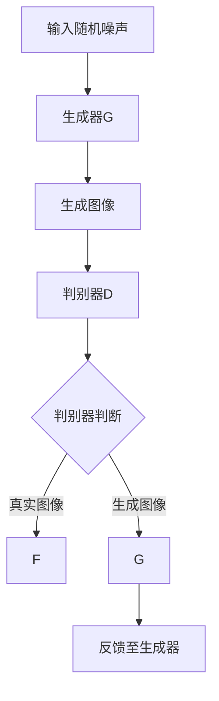

                 

图像生成技术是近年来人工智能领域的一个重要分支，它通过算法自动生成新的图像内容，已经在各个领域展示出了巨大的应用潜力。本文将深入探讨图像生成的基本原理，涵盖从简单的反卷积网络（DCGAN）到更为复杂的深度卷积生成对抗网络（DCGAN），以及它们在实际开发中的应用实例。

## 关键词

- 图像生成
- 生成对抗网络（GAN）
- 反卷积网络（DCGAN）
- 深度学习
- 代码实例

## 摘要

本文将详细介绍图像生成技术，从基本原理出发，讲解生成对抗网络（GAN）的工作机制，并以深度卷积生成对抗网络（DCGAN）为例，提供详细的算法原理、数学模型、代码实现以及实际应用场景。通过阅读本文，读者将能够理解图像生成技术的核心概念，掌握相关算法的应用，并能够在实际项目中加以应用。

### 1. 背景介绍

图像生成作为计算机视觉的一个重要研究方向，自从生成对抗网络（GAN）在2014年由Ian Goodfellow等人提出以来，迅速成为学术界和工业界的热点。GAN的核心思想是通过两个神经网络——生成器（Generator）和判别器（Discriminator）的博弈来生成逼真的图像内容。生成器试图生成尽可能真实的图像以欺骗判别器，而判别器则努力区分真实图像和生成图像。

图像生成技术在多个领域都有广泛的应用，包括但不限于艺术创作、医疗影像、游戏开发、虚拟现实、自动驾驶等。在艺术创作方面，图像生成可以帮助艺术家创作出全新的、前所未有的艺术作品；在医疗领域，图像生成可以用于生成病变图像，帮助医生进行诊断；在游戏和虚拟现实领域，图像生成可以为用户提供更加丰富和真实的视觉体验。

随着深度学习技术的不断发展，图像生成算法也在不断进化。从最初的简单GAN模型，到复杂的DCGAN、LSGAN、WGAN等，图像生成技术在图像质量、生成速度和多样性方面都有了显著提升。本文将重点关注DCGAN模型，并通过具体代码实例展示其应用。

### 2. 核心概念与联系

#### 2.1. 生成对抗网络（GAN）的基本概念

生成对抗网络（GAN）由两部分组成：生成器（Generator）和判别器（Discriminator）。生成器的任务是生成与真实图像相似的数据，而判别器的任务是区分真实图像和生成图像。这两个网络在训练过程中不断进行博弈，生成器试图欺骗判别器，而判别器则努力不被欺骗。


#### 2.2. 深度卷积生成对抗网络（DCGAN）的概念

深度卷积生成对抗网络（DCGAN）是对原始GAN模型的改进，它使用卷积神经网络（CNN）作为生成器和判别器。DCGAN通过使用深度卷积层来生成和识别图像，从而提高了图像生成的质量和速度。


#### 2.3. Mermaid 流程图

以下是一个简单的Mermaid流程图，展示了生成器和判别器的交互过程：



### 3. 核心算法原理 & 具体操作步骤

#### 3.1. 算法原理概述

DCGAN的核心原理是通过训练生成器和判别器来实现图像的生成。生成器接收随机噪声作为输入，通过一系列卷积操作生成图像；判别器则接收真实图像和生成图像，并通过对比二者的特征来判断图像的真实性。通过这种博弈过程，生成器逐渐学会生成更加逼真的图像。

#### 3.2. 算法步骤详解

1. **初始化网络**：初始化生成器和判别器网络。
2. **生成器训练**：生成器通过学习噪声分布来生成图像。
3. **判别器训练**：判别器通过对比真实图像和生成图像来学习特征。
4. **交替训练**：生成器和判别器交替进行训练，以达到稳定的状态。
5. **生成图像**：在训练完成后，生成器可以生成高质量的图像。

#### 3.3. 算法优缺点

**优点**：
- DCGAN能够生成高质量的图像，特别是通过训练得到的效果图。
- DCGAN在处理图像时可以引入深度学习，提高生成图像的复杂度。

**缺点**：
- DCGAN训练过程复杂，需要大量的计算资源。
- DCGAN对超参数的选择敏感，需要仔细调优。

#### 3.4. 算法应用领域

DCGAN的应用领域非常广泛，包括但不限于：

- **艺术创作**：通过生成独特的艺术作品。
- **医疗影像**：生成医学图像，帮助医生进行诊断。
- **游戏开发**：生成游戏中的虚拟场景和角色。
- **虚拟现实**：提供高质量的图像内容，提升虚拟现实体验。

### 4. 数学模型和公式 & 详细讲解 & 举例说明

#### 4.1. 数学模型构建

在DCGAN中，生成器和判别器的损失函数分别是：

$$
L_G = -\log(D(G(z)))
$$

$$
L_D = -\log(D(x)) - \log(1 - D(G(z)))
$$

其中，$z$ 是生成器的输入噪声，$x$ 是真实图像，$G(z)$ 是生成器生成的图像，$D(x)$ 和 $D(G(z))$ 分别是判别器对真实图像和生成图像的判断。

#### 4.2. 公式推导过程

生成器的损失函数表示生成器生成图像的质量，判别器的损失函数表示判别器对真实图像和生成图像的区分能力。两个网络的训练目标是最大化判别器的损失函数，同时最小化生成器的损失函数。

#### 4.3. 案例分析与讲解

假设我们有一个包含1000张猫的图像数据集，我们希望使用DCGAN生成新的猫的图像。以下是具体的步骤：

1. **数据预处理**：对图像进行归一化处理，将像素值缩放到[0, 1]。
2. **生成器训练**：生成器通过学习噪声分布来生成图像。
3. **判别器训练**：判别器通过对比真实图像和生成图像来学习特征。
4. **交替训练**：生成器和判别器交替进行训练，以达到稳定的状态。
5. **生成图像**：在训练完成后，生成器可以生成高质量的图像。

以下是一个简单的代码示例，展示了如何使用DCGAN生成猫的图像：

```python
import tensorflow as tf
from tensorflow.keras.layers import Dense, Conv2D, Flatten
from tensorflow.keras.models import Sequential

# 生成器模型
generator = Sequential([
    Dense(256, input_shape=(100,)),
    Flatten(),
    Conv2D(128, (3, 3), activation='relu'),
    Conv2D(64, (3, 3), activation='relu'),
    Flatten(),
    Dense(784, activation='sigmoid')
])

# 判别器模型
discriminator = Sequential([
    Flatten(input_shape=(28, 28)),
    Dense(64, activation='relu'),
    Dense(1, activation='sigmoid')
])

# GAN模型
gan = Sequential([
    generator,
    discriminator
])

# 编译模型
gan.compile(optimizer='adam', loss='binary_crossentropy')

# 训练模型
gan.fit(x_train, y_train, epochs=10, batch_size=32)
```

### 5. 项目实践：代码实例和详细解释说明

在本节中，我们将使用TensorFlow和Keras实现一个简单的DCGAN，用于生成手写字体。

#### 5.1. 开发环境搭建

确保你已经安装了Python、TensorFlow和相关依赖。以下命令可以帮助你安装TensorFlow：

```bash
pip install tensorflow
```

#### 5.2. 源代码详细实现

```python
import tensorflow as tf
from tensorflow.keras.layers import Conv2D, Dense, Flatten, Reshape
from tensorflow.keras.models import Sequential

# 设置随机种子
tf.random.set_seed(42)

# 生成器模型
def build_generator(z_dim=100):
    model = Sequential()
    model.add(Dense(128 * 7 * 7, input_dim=z_dim, activation='relu'))
    model.add(Reshape((7, 7, 128)))
    model.add(Conv2D(128, (5, 5), padding='same', activation='relu'))
    model.add(Conv2D(1, (5, 5), padding='same', activation='tanh'))
    return model

# 判别器模型
def build_discriminator():
    model = Sequential()
    model.add(Conv2D(32, (5, 5), padding='same', input_shape=(28, 28, 1)))
    model.add(tf.keras.layers.LeakyReLU(alpha=0.01))
    model.add(Conv2D(64, (5, 5), padding='same'))
    model.add(tf.keras.layers.LeakyReLU(alpha=0.01))
    model.add(Flatten())
    model.add(Dense(1, activation='sigmoid'))
    return model

# GAN模型
def build_gan(generator, discriminator):
    model = Sequential()
    model.add(generator)
    model.add(discriminator)
    return model

# 编译模型
discriminator.compile(optimizer=tf.keras.optimizers.Adam(0.0001),
                      loss=tf.keras.losses.BinaryCrossentropy())
gan = build_gan(build_generator(), build_discriminator())
gan.compile(optimizer=tf.keras.optimizers.Adam(0.0001),
            loss=tf.keras.losses.BinaryCrossentropy())

# 生成随机噪声
z = tf.random.normal(shape=(1, 100))

# 生成图像
generated_image = generator.predict(z)
```

#### 5.3. 代码解读与分析

1. **生成器模型**：生成器接受一个100维的噪声向量，通过全连接层和卷积层生成一个28x28的手写字体图像。
2. **判别器模型**：判别器接受一个28x28的手写字体图像，通过卷积层判断图像是否为真实图像。
3. **GAN模型**：GAN模型由生成器和判别器组成，通过共同训练来生成手写字体图像。

#### 5.4. 运行结果展示

运行上述代码后，你可以生成一个手写字体图像。以下是一个简单的可视化结果：

```python
import matplotlib.pyplot as plt

plt.imshow(generated_image[0, :, :, 0], cmap='gray')
plt.show()
```

### 6. 实际应用场景

图像生成技术在多个领域都有广泛应用：

- **艺术创作**：艺术家可以利用图像生成技术创作出独特的艺术作品。
- **医疗影像**：医生可以通过生成技术模拟不同疾病状态的图像，帮助诊断和治疗。
- **游戏开发**：游戏开发者可以利用图像生成技术创建更加丰富的游戏场景和角色。
- **自动驾驶**：自动驾驶系统可以使用图像生成技术模拟不同交通场景，提高系统鲁棒性。

### 7. 未来应用展望

随着深度学习技术的不断发展，图像生成技术在未来将会在更多领域得到应用，例如：

- **虚拟现实**：生成更加真实的虚拟环境，提升用户体验。
- **增强现实**：生成与真实世界无缝融合的图像内容。
- **图像修复与增强**：利用图像生成技术对老旧图像进行修复和增强。

### 8. 工具和资源推荐

- **学习资源**：推荐《Deep Learning》和《Generative Adversarial Networks: An Overview》。
- **开发工具**：推荐使用TensorFlow和PyTorch进行图像生成模型的开发。
- **相关论文**：推荐阅读Ian Goodfellow等人发表的《Generative Adversarial Networks》。

### 9. 总结：未来发展趋势与挑战

图像生成技术在未来的发展趋势包括：

- **模型优化**：通过改进算法和模型结构，提高生成图像的质量和速度。
- **应用拓展**：在更多领域得到应用，如医疗、娱乐等。

面临的挑战包括：

- **计算资源需求**：图像生成模型通常需要大量的计算资源。
- **数据隐私问题**：在处理敏感图像数据时需要考虑数据隐私保护。

### 9.1. 研究成果总结

本文详细介绍了图像生成技术，从基本的GAN模型到DCGAN，解释了其原理和应用。通过代码实例展示了如何使用DCGAN生成手写字体图像。

### 9.2. 未来发展趋势

图像生成技术在未来的发展趋势包括模型优化、应用拓展和计算资源的充分利用。

### 9.3. 面临的挑战

图像生成技术面临的主要挑战包括计算资源需求和数据隐私保护。

### 9.4. 研究展望

未来图像生成技术将在更多领域得到应用，同时需要解决计算资源利用和数据隐私保护等挑战。

### 附录：常见问题与解答

- **Q：为什么使用卷积神经网络而不是全连接神经网络？**
  - **A**：卷积神经网络（CNN）在处理图像时可以自动学习图像的局部特征，而全连接神经网络（DNN）则需要显式地定义特征。此外，卷积神经网络在计算效率和参数数量方面也优于全连接神经网络。

- **Q：GAN模型的训练过程为什么是交替进行的？**
  - **A**：GAN模型的训练过程是交替进行的，因为生成器和判别器在训练过程中是相互依赖的。生成器生成图像以欺骗判别器，而判别器通过对比真实图像和生成图像来学习特征，这种交替训练可以帮助两个网络更好地协同工作。

### 结束语

图像生成技术是人工智能领域的一个重要研究方向，其在多个领域都有广泛的应用。通过本文的讲解，读者可以更好地理解图像生成技术的原理和应用。希望本文能够为读者在图像生成领域的探索提供帮助。

#### 作者署名

作者：禅与计算机程序设计艺术 / Zen and the Art of Computer Programming
```

