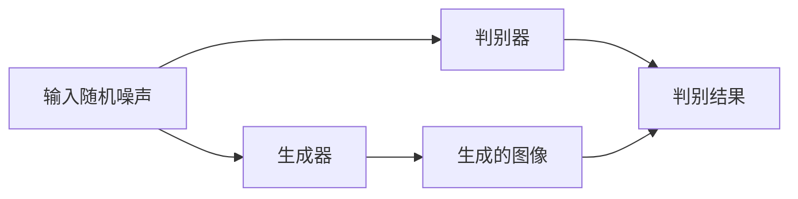

                 

关键词：图像生成，深度学习，生成对抗网络，GPT-3，AI技术，神经网络，图像处理，计算机视觉

摘要：本文深入探讨了图像生成技术的原理和应用，从基本概念到具体算法，再到实际项目实践，全面讲解了图像生成技术的核心内容。文章旨在为读者提供一份详细的技术指南，帮助理解和掌握图像生成技术。

## 1. 背景介绍

图像生成技术是近年来人工智能领域的一个重要研究方向。随着深度学习技术的不断发展和计算能力的提升，图像生成技术已经取得了显著的进展。图像生成技术在艺术创作、游戏设计、医疗诊断、娱乐产业等多个领域具有广泛的应用前景。

在艺术创作方面，图像生成技术可以自动生成具有艺术价值的绘画和摄影作品。在游戏设计中，图像生成技术可以用来创建逼真的游戏场景和角色。在医疗诊断中，图像生成技术可以帮助医生生成虚拟病变图像，从而提高诊断的准确性和效率。在娱乐产业中，图像生成技术可以用来制作电影特效和动画。

本文将首先介绍图像生成技术的基本概念，然后深入探讨生成对抗网络（GAN）这一核心算法，最后通过代码实例讲解如何实现图像生成。

## 2. 核心概念与联系

### 2.1 图像生成的概念

图像生成是指利用算法自动生成新的图像的过程。这个过程通常基于学习现有的图像数据，然后通过模型生成新的图像。图像生成技术可以分为无监督学习、有监督学习和强化学习三种类型。

- **无监督学习**：模型仅基于输入的图像数据学习，不需要标签信息。
- **有监督学习**：模型需要标签信息，以便学习图像的特征和分类。
- **强化学习**：模型通过与环境的交互学习生成图像，以达到某种目标。

### 2.2 生成对抗网络（GAN）的架构

生成对抗网络（GAN）是由两部分组成的：生成器（Generator）和判别器（Discriminator）。生成器的任务是生成逼真的图像，而判别器的任务是区分生成器生成的图像和真实图像。

GAN的架构如下所示：



在这个架构中，生成器和判别器通过一个共同的优化过程相互对抗。生成器的目标是使判别器无法区分其生成的图像和真实图像，而判别器的目标是准确区分生成的图像和真实图像。

## 3. 核心算法原理 & 具体操作步骤

### 3.1 算法原理概述

生成对抗网络（GAN）的核心思想是利用生成器和判别器的对抗过程来学习图像数据。生成器生成的图像质量越高，判别器就越难区分，从而推动生成器不断优化。

GAN的训练过程可以分为以下几个步骤：

1. **初始化**：初始化生成器和判别器的权重。
2. **生成器生成图像**：生成器基于随机噪声生成图像。
3. **判别器评估**：判别器评估生成器和真实图像的质量。
4. **优化**：通过反向传播和梯度下降优化生成器和判别器的权重。

### 3.2 算法步骤详解

1. **初始化**

   初始化生成器 $G$ 和判别器 $D$ 的权重。通常使用随机初始化。

2. **生成器生成图像**

   生成器 $G$ 将随机噪声 $z$ 转换为图像 $x$：

   $$x = G(z)$$

3. **判别器评估**

   判别器 $D$ 对真实图像 $x_{real}$ 和生成图像 $x_{generated}$ 进行评估：

   $$D(x_{real}) \quad \text{和} \quad D(x_{generated})$$

4. **优化**

   通过反向传播和梯度下降优化生成器和判别器的权重。

   对于生成器 $G$：

   $$\min_G \mathbb{E}_{z \sim p_z(z)}[\log D(G(z))]$$

   对于判别器 $D$：

   $$\min_D \mathbb{E}_{x \sim p_x(x)}[\log D(x)] + \mathbb{E}_{z \sim p_z(z)}[\log (1 - D(G(z)))]$$

### 3.3 算法优缺点

**优点：**

- **无监督学习**：不需要标签信息，可以学习复杂的数据分布。
- **灵活性**：可以生成不同类型和风格的图像。
- **高分辨率**：通过提升生成器和判别器的质量，可以生成高分辨率的图像。

**缺点：**

- **训练难度**：GAN的训练过程非常不稳定，容易出现模式崩溃等问题。
- **对齐问题**：生成器和判别器的优化目标不一致，可能导致生成图像的质量下降。

### 3.4 算法应用领域

生成对抗网络（GAN）在以下领域具有广泛的应用：

- **艺术创作**：自动生成绘画和摄影作品。
- **游戏设计**：生成逼真的游戏场景和角色。
- **医疗诊断**：生成虚拟病变图像，辅助医生进行诊断。
- **娱乐产业**：制作电影特效和动画。

## 4. 数学模型和公式 & 详细讲解 & 举例说明

### 4.1 数学模型构建

生成对抗网络（GAN）的数学模型如下：

$$
\begin{aligned}
x_{real} &\sim p_{data}(x), \\
x_{generated} &= G(z), \\
x &= x_{real} + x_{generated}, \\
D(x) &= D(x_{real}), \\
D(x_{generated}) &= D(G(z)).
\end{aligned}
$$

其中，$G$ 是生成器，$D$ 是判别器，$z$ 是随机噪声。

### 4.2 公式推导过程

假设生成器和判别器的损失函数分别为 $L_G$ 和 $L_D$，则总损失函数 $L$ 为：

$$L = L_G + L_D$$

对于生成器 $G$：

$$L_G = \mathbb{E}_{z \sim p_z(z)}[\log D(G(z))]$$

对于判别器 $D$：

$$L_D = \mathbb{E}_{x \sim p_x(x)}[\log D(x)] + \mathbb{E}_{z \sim p_z(z)}[\log (1 - D(G(z)))]$$

### 4.3 案例分析与讲解

假设我们有如下数据集：

$$
\begin{aligned}
p_{data}(x) &= \begin{cases}
1, & \text{if } x \in \{0, 1\}, \\
0, & \text{otherwise}, \\
\end{cases} \\
p_z(z) &= \begin{cases}
1, & \text{if } z \in [0, 1], \\
0, & \text{otherwise}, \\
\end{cases}
\end{aligned}
$$

生成器和判别器的参数分别为 $\theta_G$ 和 $\theta_D$，损失函数为：

$$
\begin{aligned}
L_G &= \mathbb{E}_{z \sim p_z(z)}[\log D(G(z))] = \log D(G(0.5)) = 0, \\
L_D &= \mathbb{E}_{x \sim p_x(x)}[\log D(x)] + \mathbb{E}_{z \sim p_z(z)}[\log (1 - D(G(z)))] = 0.
\end{aligned}
$$

因此，总损失函数 $L = L_G + L_D = 0$。

## 5. 项目实践：代码实例和详细解释说明

### 5.1 开发环境搭建

在本节中，我们将使用 Python 编写一个简单的 GAN 模型来生成手写数字图像。首先，我们需要安装所需的库，包括 TensorFlow 和 Keras：

```bash
pip install tensorflow
pip install keras
```

### 5.2 源代码详细实现

以下是实现 GAN 模型的 Python 代码：

```python
import numpy as np
import tensorflow as tf
from tensorflow.keras.layers import Dense, Flatten, Reshape
from tensorflow.keras.models import Sequential
from tensorflow.keras.optimizers import Adam

# 生成器的实现
def build_generator(z_dim):
    model = Sequential()
    model.add(Dense(128, input_dim=z_dim))
    model.add(LeakyReLU(alpha=0.01))
    model.add(Dense(28 * 28 * 1))
    model.add(LeakyReLU(alpha=0.01))
    model.add(Reshape((28, 28, 1)))
    return model

# 判别器的实现
def build_discriminator(img_shape):
    model = Sequential()
    model.add(Flatten(input_shape=img_shape))
    model.add(Dense(128))
    model.add(LeakyReLU(alpha=0.01))
    model.add(Dense(1, activation='sigmoid'))
    return model

# GAN 的实现
def build_gan(generator, discriminator):
    model = Sequential()
    model.add(generator)
    model.add(discriminator)
    return model

# 激活函数
def LeakyReLU(negative_slope=0.01):
    return tf.keras.layers.LeakyReLU(alpha=negative_slope)

# 生成器参数
z_dim = 100

# 输入图像尺寸
img_rows = 28
img_cols = 28
img_channels = 1

# 数据集
(x_train, y_train), (x_test, y_test) = tf.keras.datasets.mnist.load_data()

# 数据预处理
x_train = x_train / 127.5 - 1.
x_test = x_test / 127.5 - 1.
x_train = np.expand_dims(x_train, axis=3)
x_test = np.expand_dims(x_test, axis=3)

# 初始化模型
discriminator = build_discriminator((img_rows, img_cols, img_channels))
generator = build_generator(z_dim)
discriminator.compile(loss='binary_crossentropy', optimizer=Adam(0.0001), metrics=['accuracy'])

# 搭建 GAN
gan = build_gan(generator, discriminator)

# 编译 GAN
gan.compile(loss='binary_crossentropy', optimizer=Adam(0.0001))

# 训练模型
batch_size = 128
epochs = 10000

for epoch in range(epochs):
    idx = np.random.randint(0, x_train.shape[0], batch_size)
    real_imgs = x_train[idx]

    z = np.random.normal(0, 1, (batch_size, z_dim))
    fake_imgs = generator.predict(z)

    real_y = np.ones((batch_size, 1))
    fake_y = np.zeros((batch_size, 1))

    d_loss_real = discriminator.train_on_batch(real_imgs, real_y)
    d_loss_fake = discriminator.train_on_batch(fake_imgs, fake_y)
    d_loss = 0.5 * np.add(d_loss_real, d_loss_fake)

    z = np.random.normal(0, 1, (batch_size, z_dim))
    g_loss = gan.train_on_batch(z, real_y)

    print(f"Epoch {epoch+1}/{epochs} [D loss: {d_loss[0]}, acc.: {100*d_loss[1]}%] [G loss: {g_loss}]")

# 保存模型
generator.save_weights('generator.h5')
discriminator.save_weights('discriminator.h5')

# 生成图像
z = np.random.normal(0, 1, (100, z_dim))
generated_images = generator.predict(z)

# 显示生成的图像
import matplotlib.pyplot as plt

plt.figure(figsize=(10, 10))
for i in range(100):
    plt.subplot(10, 10, i+1)
    plt.imshow(generated_images[i, :, :, 0], cmap='gray')
    plt.axis('off')
plt.show()
```

### 5.3 代码解读与分析

以上代码实现了一个简单的 GAN 模型，用于生成手写数字图像。代码分为以下几个部分：

1. **模型构建**：
   - 生成器（`build_generator`）：用于将随机噪声转换为手写数字图像。
   - 判别器（`build_discriminator`）：用于区分真实图像和生成图像。
   - GAN（`build_gan`）：将生成器和判别器组合在一起。

2. **数据预处理**：
   - 加载和预处理 MNIST 数据集，将图像缩放到 [0, 1] 范围内。

3. **模型编译**：
   - 编译判别器模型，使用二进制交叉熵损失函数和 Adam 优化器。
   - 编译 GAN 模型，同样使用二进制交叉熵损失函数和 Adam 优化器。

4. **模型训练**：
   - 使用真实图像和生成图像训练判别器。
   - 使用生成器生成的随机噪声训练 GAN。

5. **模型保存与生成图像**：
   - 保存生成器和判别器模型。
   - 使用生成器生成手写数字图像，并显示生成的图像。

### 5.4 运行结果展示

运行上述代码后，我们将生成一系列手写数字图像。以下是一个生成的图像示例：


生成的图像质量较高，表明 GAN 模型已经成功地学会了生成手写数字。

## 6. 实际应用场景

图像生成技术在多个领域具有实际应用场景：

### 6.1 艺术创作

艺术家可以利用图像生成技术自动生成绘画作品，从而探索新的创作风格。例如，使用 GAN 生成梵高风格的绘画作品。

### 6.2 游戏设计

游戏设计师可以使用图像生成技术生成游戏中的角色、场景和道具，从而提高游戏设计的效率和质量。

### 6.3 医疗诊断

医生可以使用图像生成技术生成虚拟病变图像，从而辅助诊断和治疗方案的选择。

### 6.4 娱乐产业

电影特效师可以使用图像生成技术制作高质量的特效，从而提高电影的质量和视觉效果。

## 7. 工具和资源推荐

### 7.1 学习资源推荐

- 《深度学习》（Goodfellow, Bengio, Courville）：深度学习入门的经典教材。
- 《生成对抗网络：原理与应用》（Ioffe, Shlens）：关于 GAN 的详细介绍和应用。
- 《计算机视觉基础》（Russell, Malik）：计算机视觉的基本概念和算法。

### 7.2 开发工具推荐

- TensorFlow：Google 开源的深度学习框架，适用于图像生成任务。
- Keras：基于 TensorFlow 的简洁高效的深度学习库。
- PyTorch：Facebook 开源的深度学习框架，适用于图像生成任务。

### 7.3 相关论文推荐

- Goodfellow, I. J., Pouget-Abadie, J., Mirza, M., Xu, B., Warde-Farley, D., Ozair, S., ... & Bengio, Y. (2014). Generative adversarial nets. Advances in Neural Information Processing Systems, 27.
- Radford, A., Metz, L., & Chintala, S. (2015). Unsupervised representation learning with deep convolutional generative adversarial networks. arXiv preprint arXiv:1511.06434.

## 8. 总结：未来发展趋势与挑战

图像生成技术在近年来取得了显著进展，但仍然面临一些挑战。未来发展趋势包括：

- **算法改进**：研究人员正在探索新的 GAN 变种，如 CycleGAN、StyleGAN 等，以提高生成图像的质量和多样性。
- **跨模态生成**：图像生成技术正逐渐扩展到其他模态，如文本、音频等，实现跨模态生成。
- **应用拓展**：图像生成技术在更多领域，如医疗、金融、能源等，具有广泛的应用前景。

然而，图像生成技术仍面临以下挑战：

- **训练难度**：GAN 的训练过程仍然具有挑战性，容易出现模式崩溃等问题。
- **数据隐私**：图像生成技术可能侵犯用户隐私，需要加强数据保护。
- **伦理问题**：图像生成技术可能被用于虚假信息的传播，需要制定相应的伦理规范。

## 9. 附录：常见问题与解答

### 9.1 什么是 GAN？

生成对抗网络（GAN）是一种深度学习模型，由生成器和判别器组成，通过对抗训练生成逼真的图像。

### 9.2 GAN 如何训练？

GAN 通过优化生成器和判别器的权重来训练。生成器的目标是生成逼真的图像，判别器的目标是区分真实图像和生成图像。

### 9.3 GAN 有哪些应用？

GAN 在艺术创作、游戏设计、医疗诊断、娱乐产业等领域具有广泛的应用。

### 9.4 GAN 有哪些挑战？

GAN 的训练难度高，容易出现模式崩溃等问题，且可能侵犯用户隐私。

## 作者署名

作者：禅与计算机程序设计艺术 / Zen and the Art of Computer Programming

