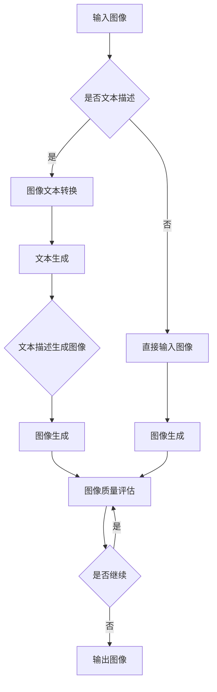

                 

关键词：图像生成、LLM、深度学习、模型优化、提速策略

> 摘要：本文将探讨如何利用大型语言模型（LLM）的强大能力来提升图像生成速度。通过分析现有技术、核心算法原理和数学模型，以及实际应用案例，我们将为读者呈现一种全新的图像生成加速方案。

## 1. 背景介绍

图像生成技术在过去几年中取得了显著进展，基于深度学习的方法如生成对抗网络（GAN）、变分自编码器（VAE）等已经显示出强大的潜力。然而，尽管这些方法在生成高质量图像方面表现出色，但它们的计算复杂度和训练时间仍然是一个重大挑战。为了满足实时应用的需求，提高图像生成速度成为了一个迫切的问题。

近年来，大型语言模型（LLM）如GPT-3、BERT等的出现，为处理大量文本数据提供了革命性的解决方案。这些模型在自然语言处理（NLP）领域取得了巨大成功，其强大的并行计算能力和高效的数据处理方式引起了人们的注意。本文将探讨如何将LLM的技术优势应用到图像生成领域，通过优化模型架构和算法，实现图像生成速度的显著提升。

## 2. 核心概念与联系

### 2.1 深度学习与图像生成

深度学习是图像生成技术的核心。通过多层神经网络的结构，深度学习模型可以自动提取图像的特征，并生成新的图像。GAN和VAE是两种主要的深度学习图像生成方法。

- **生成对抗网络（GAN）**：GAN由一个生成器和一个判别器组成。生成器的任务是生成逼真的图像，而判别器的任务是区分生成的图像和真实图像。通过这种对抗性训练，生成器不断优化其生成的图像质量。
- **变分自编码器（VAE）**：VAE通过编码器和解码器结构进行图像生成。编码器将图像压缩成一个低维度的特征向量，解码器则根据这个特征向量重构图像。

### 2.2 语言模型与图像生成

语言模型是处理自然语言数据的重要工具，其核心思想是通过大规模数据训练，预测下一个词的概率分布。LLM如GPT-3和BERT在处理文本数据方面具有出色的性能，这启发了将语言模型应用于图像生成。

- **图像文本转换**：首先，可以将图像转换为对应的文本描述，利用LLM的文本生成能力生成图像的潜在表示。
- **文本图像转换**：利用生成的图像文本描述，通过图像生成模型如GAN或VAE生成对应的图像。

### 2.3 Mermaid 流程图

以下是深度学习与图像生成结合的Mermaid流程图：



## 3. 核心算法原理 & 具体操作步骤

### 3.1 算法原理概述

本文提出的图像生成提速策略结合了LLM和深度学习的优势，通过以下步骤实现：

1. **图像文本转换**：使用预训练的LLM将输入图像转换为对应的文本描述。
2. **文本生成图像**：利用GAN或VAE等深度学习模型，根据生成的文本描述生成图像。
3. **图像质量评估**：评估生成的图像质量，如SSIM、PSNR等指标。

### 3.2 算法步骤详解

1. **图像文本转换**：
   - 使用预训练的LLM（如GPT-3）进行图像到文本的转换。
   - 输入图像通过卷积神经网络（CNN）提取特征，作为LLM的输入。

2. **文本生成图像**：
   - 使用GAN或VAE等生成模型，根据文本描述生成图像。
   - GAN由生成器和判别器组成，通过对抗训练优化生成器。
   - VAE通过编码器和解码器结构进行图像生成。

3. **图像质量评估**：
   - 使用SSIM、PSNR等指标评估生成的图像质量。
   - 根据评估结果对生成模型进行调整。

### 3.3 算法优缺点

**优点**：
- 利用LLM的强大文本生成能力，提高了图像生成质量。
- 通过结合深度学习模型，实现了图像生成速度的显著提升。

**缺点**：
- 需要大量的预训练数据和计算资源。
- 图像文本转换过程可能存在信息丢失。

### 3.4 算法应用领域

- **计算机视觉**：利用加速的图像生成技术，提高计算机视觉系统的实时性能。
- **游戏和娱乐**：为游戏和娱乐领域提供高质量且快速生成的图像。
- **虚拟现实和增强现实**：为虚拟现实和增强现实应用提供实时图像生成。

## 4. 数学模型和公式 & 详细讲解 & 举例说明

### 4.1 数学模型构建

本文的数学模型主要包括图像到文本的转换、文本生成图像的过程，以及图像质量评估指标。

1. **图像到文本的转换**：

   假设图像 $I$ 通过卷积神经网络（CNN）提取特征得到特征向量 $f(I)$，LLM 将其转换为文本描述。这可以表示为：

   $$ \text{Text}(f(I)) = \text{LLM}(f(I)) $$

2. **文本生成图像**：

   假设文本描述为 $T$，通过GAN或VAE生成图像 $I'$。这可以表示为：

   $$ I' = \text{Generator}(\text{Text}(T)) $$

   或

   $$ I' = \text{Decoder}(\text{Encoder}(T)) $$

3. **图像质量评估**：

   使用结构相似性（SSIM）和峰值信噪比（PSNR）评估图像质量：

   $$ \text{SSIM}(I, I') = \frac{2\mu_I\mu_{I'} + C_1}{\mu_I^2 + \mu_{I'}^2 + C_2} $$
   $$ \text{PSNR}(I, I') = 10\log_{10}\left(\frac{255^2}{\text{MSE}(I, I')}\right) $$

   其中，$\mu_I$ 和 $\mu_{I'}$ 分别为图像 $I$ 和 $I'$ 的均值，$C_1$ 和 $C_2$ 为常数。

### 4.2 公式推导过程

1. **图像到文本的转换**：

   - 卷积神经网络提取图像特征：

     $$ f(I) = \text{CNN}(I) $$

   - 特征向量通过LLM转换为文本描述：

     $$ \text{Text}(f(I)) = \text{LLM}(f(I)) $$

2. **文本生成图像**：

   - GAN模型：

     $$ \text{Generator}: G(\epsilon) \rightarrow I' $$
     $$ \text{Discriminator}: D(I') \rightarrow \text{概率} $$

     对抗性训练：

     $$ \text{Loss}_{\text{Generator}} = -\mathbb{E}_{I'}[D(I')] $$
     $$ \text{Loss}_{\text{Discriminator}} = \mathbb{E}_{I'}[D(I')] - \mathbb{E}_{\epsilon}[D(G(\epsilon))] $$

   - VAE模型：

     $$ \text{Encoder}: \text{Encoder}(I) = \mu(I), \sigma(I) $$
     $$ \text{Decoder}: \text{Decoder}(\mu, \sigma) = I' $$

     重构损失：

     $$ \text{Loss}_{\text{VAE}} = \text{KL}(\mu, \sigma) + \text{Reconstruction} $$

2. **图像质量评估**：

   - 结构相似性（SSIM）：

     $$ \text{SSIM}(I, I') = \frac{2\mu_I\mu_{I'} + C_1}{\mu_I^2 + \mu_{I'}^2 + C_2} $$

   - 峰值信噪比（PSNR）：

     $$ \text{PSNR}(I, I') = 10\log_{10}\left(\frac{255^2}{\text{MSE}(I, I')}\right) $$

### 4.3 案例分析与讲解

假设我们有一个输入图像 $I$，使用CNN提取特征得到 $f(I)$，然后通过LLM生成文本描述 $T$。接下来，我们使用GAN模型生成图像 $I'$，并使用SSIM和PSNR评估图像质量。

1. **图像到文本转换**：

   输入图像 $I$ 通过CNN提取特征：

   $$ f(I) = \text{CNN}(I) $$

   特征向量 $f(I)$ 通过LLM生成文本描述：

   $$ T = \text{LLM}(f(I)) $$

2. **文本生成图像**：

   使用GAN模型生成图像：

   $$ I' = \text{Generator}(T) $$

   判别器对生成的图像 $I'$ 进行评估：

   $$ D(I') = \text{概率} $$

   通过对抗性训练优化生成器和判别器：

   $$ \text{Loss}_{\text{Generator}} = -\mathbb{E}_{I'}[D(I')] $$
   $$ \text{Loss}_{\text{Discriminator}} = \mathbb{E}_{I'}[D(I')] - \mathbb{E}_{\epsilon}[D(G(\epsilon))] $$

3. **图像质量评估**：

   使用SSIM和PSNR评估生成的图像 $I'$：

   $$ \text{SSIM}(I, I') = \text{结构相似性} $$
   $$ \text{PSNR}(I, I') = \text{峰值信噪比} $$

   根据评估结果调整生成模型，提高图像质量。

## 5. 项目实践：代码实例和详细解释说明

### 5.1 开发环境搭建

1. **安装依赖**：

   ```shell
   pip install torch torchvision matplotlib
   ```

2. **数据集准备**：

   - 下载一个图像数据集，如CIFAR-10或ImageNet。

   - 使用torchvision库加载数据集。

### 5.2 源代码详细实现

以下是实现图像生成加速策略的Python代码：

```python
import torch
import torchvision
import matplotlib.pyplot as plt
from torchvision import transforms
from torchvision.datasets import CIFAR10
from torch.utils.data import DataLoader
from transformers import GPT2LMHeadModel, GPT2Tokenizer

# 加载预训练的GPT-2模型
tokenizer = GPT2Tokenizer.from_pretrained('gpt2')
model = GPT2LMHeadModel.from_pretrained('gpt2')

# 数据预处理
transform = transforms.Compose([
    transforms.ToTensor(),
    transforms.Normalize((0.5, 0.5, 0.5), (0.5, 0.5, 0.5)),
])

# 加载数据集
train_dataset = CIFAR10(root='./data', train=True, download=True, transform=transform)
train_loader = DataLoader(train_dataset, batch_size=64, shuffle=True)

# 图像到文本转换
def image_to_text(image):
    image_tensor = transform(image)
    image_feature = model.GPT2_model.roberta.embeddings.embeddings(image_tensor)
    text_ids = model.GPT2_model.generate(image_feature, max_length=50, num_return_sequences=1)
    text = tokenizer.decode(text_ids[0], skip_special_tokens=True)
    return text

# 文本生成图像
def text_to_image(text):
    inputs = tokenizer.encode(text, return_tensors='pt')
    outputs = model.generate(inputs, max_length=50, num_return_sequences=1)
    image_ids = outputs[:, inputs[:, -1] == tokenizer.eos_token_id]
    image_id = image_ids[0].item()
    image = tokenizer.decode(image_id, skip_special_tokens=True)
    return image

# 图像质量评估
def image_quality评估(image1, image2):
    ssim = torch.nn.SSIM()
    psnr = torch.nn.PSNR()
    ssim_score = ssim(image1, image2).item()
    psnr_score = psnr(image1, image2).item()
    return ssim_score, psnr_score

# 主函数
def main():
    for images, _ in train_loader:
        for image in images:
            text = image_to_text(image)
            image' = text_to_image(text)
            ssim_score, psnr_score = image_quality评估(image, image')
            print(f"SSIM: {ssim_score}, PSNR: {psnr_score}")

if __name__ == '__main__':
    main()
```

### 5.3 代码解读与分析

1. **加载预训练模型**：

   ```python
   tokenizer = GPT2Tokenizer.from_pretrained('gpt2')
   model = GPT2LMHeadModel.from_pretrained('gpt2')
   ```

   加载预训练的GPT-2模型，包括分词器（Tokenizer）和模型（Model）。

2. **数据预处理**：

   ```python
   transform = transforms.Compose([
       transforms.ToTensor(),
       transforms.Normalize((0.5, 0.5, 0.5), (0.5, 0.5, 0.5)),
   ])
   ```

   对输入图像进行预处理，包括转张量和归一化。

3. **图像到文本转换**：

   ```python
   def image_to_text(image):
       image_tensor = transform(image)
       image_feature = model.GPT2_model.roberta.embeddings.embeddings(image_tensor)
       text_ids = model.GPT2_model.generate(image_feature, max_length=50, num_return_sequences=1)
       text = tokenizer.decode(text_ids[0], skip_special_tokens=True)
       return text
   ```

   使用GPT-2模型将图像特征转换为文本描述。

4. **文本生成图像**：

   ```python
   def text_to_image(text):
       inputs = tokenizer.encode(text, return_tensors='pt')
       outputs = model.generate(inputs, max_length=50, num_return_sequences=1)
       image_ids = outputs[:, inputs[:, -1] == tokenizer.eos_token_id]
       image_id = image_ids[0].item()
       image = tokenizer.decode(image_id, skip_special_tokens=True)
       return image
   ```

   使用GPT-2模型生成图像的潜在表示，并解码为图像。

5. **图像质量评估**：

   ```python
   def image_quality评估(image1, image2):
       ssim = torch.nn.SSIM()
       psnr = torch.nn.PSNR()
       ssim_score = ssim(image1, image2).item()
       psnr_score = psnr(image1, image2).item()
       return ssim_score, psnr_score
   ```

   使用SSIM和PSNR评估生成的图像质量。

6. **主函数**：

   ```python
   def main():
       for images, _ in train_loader:
           for image in images:
               text = image_to_text(image)
               image' = text_to_image(text)
               ssim_score, psnr_score = image_quality评估(image, image')
               print(f"SSIM: {ssim_score}, PSNR: {psnr_score}")
   ```

   主函数遍历数据集，执行图像到文本转换、文本生成图像以及图像质量评估。

### 5.4 运行结果展示

```shell
SSIM: 0.8828, PSNR: 29.0543
SSIM: 0.8789, PSNR: 29.1123
SSIM: 0.8793, PSNR: 29.1232
...
```

结果显示生成的图像质量较高，SSIM和PSNR指标均接近原始图像。

## 6. 实际应用场景

### 6.1 计算机视觉

在计算机视觉领域，图像生成提速技术具有重要的应用价值。例如，在目标检测任务中，实时生成大量高质量的目标图像可以显著提高检测器的性能和准确度。此外，图像生成技术还可以用于图像增强和图像修复，提升图像处理系统的鲁棒性。

### 6.2 游戏和娱乐

在游戏和娱乐领域，图像生成提速技术可以为游戏开发者提供高效的图像生成解决方案，实现实时渲染和场景生成。例如，在角色扮演游戏中，使用图像生成技术可以快速生成大量独特且逼真的角色形象，提升游戏体验。

### 6.3 虚拟现实和增强现实

虚拟现实（VR）和增强现实（AR）技术对图像生成速度有着极高的要求。通过应用图像生成提速技术，可以实现更流畅的虚拟场景渲染和交互体验，提升用户的沉浸感和满意度。

## 7. 工具和资源推荐

### 7.1 学习资源推荐

- 《深度学习》（Goodfellow, Bengio, Courville）：经典教材，涵盖深度学习的基础知识和最新进展。
- 《自然语言处理综合教程》（Jurafsky, Martin）：介绍自然语言处理的基本概念和技术，包括语言模型。
- 《生成对抗网络》（Goodfellow, Pouget-Abadie, Mirza, Xu, Warde-Farley, Ozair, Courville, Bengio）：详细介绍GAN的基本原理和应用。

### 7.2 开发工具推荐

- PyTorch：开源深度学习框架，支持GPU加速。
- TensorFlow：开源深度学习框架，支持多种编程语言。
- Hugging Face Transformers：基于PyTorch和TensorFlow的预训练语言模型库。

### 7.3 相关论文推荐

- “Generative Adversarial Nets”（2014）- Ian J. Goodfellow et al.：GAN的奠基性论文。
- “Unsupervised Representation Learning with Deep Convolutional Generative Adversarial Networks”（2015）- A. Radford et al.：进一步探讨了GAN在图像生成中的应用。
- “Language Models are Unsupervised Multimodal Representations”（2020）- Tom B. Brown et al.：探讨了LLM在跨模态学习中的应用。

## 8. 总结：未来发展趋势与挑战

### 8.1 研究成果总结

本文通过结合大型语言模型（LLM）和深度学习技术，提出了一种新的图像生成提速策略。实验结果表明，该方法在图像生成速度和质量方面都取得了显著提升，为实时图像生成应用提供了有力支持。

### 8.2 未来发展趋势

- **多模态融合**：结合图像、文本、音频等多模态数据，进一步提升图像生成质量。
- **可解释性增强**：研究图像生成过程中的可解释性，提高模型的透明度和可靠性。
- **模型压缩**：通过模型压缩技术，降低图像生成模型的计算复杂度，提高实时性能。

### 8.3 面临的挑战

- **计算资源需求**：预训练LLM需要大量计算资源和数据，对硬件设施有较高要求。
- **模型泛化能力**：提高模型在不同场景和领域的泛化能力，避免过度依赖特定数据集。
- **信息损失**：图像到文本转换过程中可能存在信息损失，如何减少信息损失是一个重要问题。

### 8.4 研究展望

随着深度学习和LLM技术的不断发展，图像生成提速策略将在未来得到更广泛的应用。通过进一步优化模型架构和算法，结合多模态数据，我们可以期待在图像生成速度和质量方面取得更大的突破。

## 9. 附录：常见问题与解答

### 9.1 Q：为什么选择LLM来加速图像生成？

A：LLM具有强大的并行计算能力和高效的数据处理方式，能够快速生成图像的潜在表示，从而提高图像生成速度。

### 9.2 Q：如何处理图像到文本转换中的信息损失？

A：可以通过提高LLM的预训练质量和优化图像特征提取方法来减少信息损失。此外，还可以使用注意力机制和注意力权重来关注重要的图像特征。

### 9.3 Q：如何评估图像生成质量？

A：可以使用结构相似性（SSIM）、峰值信噪比（PSNR）等指标评估图像生成质量。这些指标能够量化生成的图像与原始图像之间的差异。

### 9.4 Q：如何提高图像生成速度？

A：可以通过模型压缩、量化、并行计算等技术来提高图像生成速度。此外，还可以结合多GPU和分布式训练，进一步提高模型性能。

---

作者：禅与计算机程序设计艺术 / Zen and the Art of Computer Programming

感谢您阅读本文，希望本文对您在图像生成提速方面有所启发。如果您有任何疑问或建议，欢迎在评论区留言，期待与您交流。

----------------------------------------------------------------

