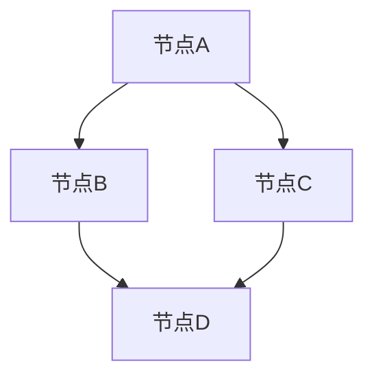
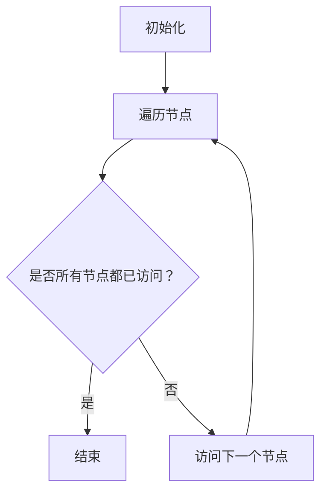

                 

图数据库是数据库技术的一种，与传统的键值存储、关系数据库等不同，它通过节点和边的关系来存储和查询数据。本文将详细介绍图数据库的原理，并通过代码实例来讲解其应用。

## 1. 背景介绍

随着互联网和大数据的发展，数据规模和复杂性不断增加。传统的数据库技术已经难以满足复杂的查询需求。此时，图数据库应运而生。图数据库通过节点和边的关系来组织数据，使得在处理复杂关系查询时具有天然的优势。

### 图数据库的定义与特点

**定义：**
图数据库是一种使用图结构存储和查询数据的数据库系统。它将实体（数据对象）表示为节点，实体之间的关系表示为边，从而构建一个有向或无向的图结构。

**特点：**
1. **灵活性：** 可以轻松扩展以适应新实体和关系。
2. **高效性：** 在处理复杂关系查询时，具有比关系数据库更高的性能。
3. **适应性：** 可以处理各种类型的数据，包括结构化数据、半结构化数据和非结构化数据。

### 图数据库的应用场景

1. **社交网络分析：** 例如，分析用户之间的互动关系、推荐好友等。
2. **推荐系统：** 例如，基于用户浏览历史和购买行为进行商品推荐。
3. **生物信息学：** 例如，分析基因之间的关系和网络。
4. **知识图谱：** 例如，构建企业内部的知识图谱，用于知识管理和搜索。

## 2. 核心概念与联系

### 图的基本概念

**节点（Node）：** 图中的数据对象，可以表示为实体、用户、物品等。

**边（Edge）：** 连接两个节点的线段，表示节点之间的关系。边可以是有向的（Directed），也可以是无向的（Undirected）。

### 图的表示方法

**邻接矩阵（Adjacency Matrix）：** 使用二维数组来表示图，其中`adj[i][j]`表示节点`i`与节点`j`之间的边是否存在。



**邻接表（Adjacency List）：** 使用数组来表示图，每个数组元素存储一个节点的邻接节点列表。


### 图的算法

**深度优先搜索（DFS）：** 用于遍历图，通过递归或栈实现。

**广度优先搜索（BFS）：** 用于遍历图，通过队列实现。

**最短路径算法（Dijkstra）：** 用于计算图中两点之间的最短路径。

**最小生成树算法（Prim）：** 用于生成图中包含所有节点的最小生成树。

**图的遍历算法流程：**



## 3. 核心算法原理 & 具体操作步骤

### 3.1 算法原理概述

**深度优先搜索（DFS）：** 从一个节点开始，沿着某一方向搜索，直到找到目标节点或搜索到尽头。然后回溯到上一个节点，沿另一个方向继续搜索。

**广度优先搜索（BFS）：** 从一个节点开始，搜索到其所有的邻接节点，然后再从这些邻接节点中选取一个未搜索的节点进行搜索，直到找到目标节点或搜索到尽头。

**最短路径算法（Dijkstra）：** 使用优先队列来维护当前已找到的最短路径，逐步扩展到更远的节点。

**最小生成树算法（Prim）：** 从一个节点开始，逐步添加边，直到形成包含所有节点的最小生成树。

### 3.2 算法步骤详解

**深度优先搜索（DFS）：**

1. 初始化：将当前节点标记为已访问，并将其加入栈中。
2. 当栈不为空时，执行以下操作：
   - 弹出栈顶节点。
   - 处理该节点（例如，输出节点信息）。
   - 遍历该节点的未访问邻接节点，将它们标记为已访问并加入栈中。

**广度优先搜索（BFS）：**

1. 初始化：将当前节点入队，并将其标记为已访问。
2. 当队列不为空时，执行以下操作：
   - 出队一个节点。
   - 处理该节点（例如，输出节点信息）。
   - 遍历该节点的未访问邻接节点，将它们入队并标记为已访问。

**最短路径算法（Dijkstra）：**

1. 初始化：将源节点到所有节点的距离设为无穷大，将源节点到自己的距离设为0。使用一个优先队列来维护当前已找到的最短路径。
2. 当优先队列为空时，执行以下操作：
   - 弹出优先队列中的最小距离节点。
   - 对于该节点的每个邻接节点，计算从源节点经过该节点的距离，如果比已记录的距离更短，则更新距离并将该节点加入优先队列。

**最小生成树算法（Prim）：**

1. 初始化：从任意节点开始，将其加入最小生成树的集合中。
2. 当最小生成树的集合中不包含所有节点时，执行以下操作：
   - 从已加入最小生成树的集合的节点中选择一个未连接的节点。
   - 在所有连接到未加入最小生成树的集合的节点中选择权重最小的边，将其加入最小生成树的集合中。

### 3.3 算法优缺点

**深度优先搜索（DFS）：**

- 优点：可以快速找到一条路径，适合处理节点较少的图。
- 缺点：可能陷入死循环，不适合处理节点较多的图。

**广度优先搜索（BFS）：**

- 优点：可以确保找到最短路径，适合处理节点较多的图。
- 缺点：可能需要较大的内存空间来存储队列。

**最短路径算法（Dijkstra）：**

- 优点：可以找到从源节点到所有节点的最短路径。
- 缺点：在图中有负权边时可能无法正确计算。

**最小生成树算法（Prim）：**

- 优点：可以找到包含所有节点的最小生成树。
- 缺点：在图中有多个最小生成树时可能无法确定。

### 3.4 算法应用领域

- **社交网络分析：** 可以用于分析用户之间的互动关系，推荐好友等。
- **推荐系统：** 可以用于基于用户行为的推荐，例如商品推荐。
- **知识图谱：** 可以用于构建企业内部的知识图谱，用于知识管理和搜索。

## 4. 数学模型和公式 & 详细讲解 & 举例说明

### 4.1 数学模型构建

在图数据库中，数学模型主要用于表示图的结构和数据关系。以下是几种常见的数学模型：

**邻接矩阵（Adjacency Matrix）：**
\[ 
A = 
\begin{bmatrix}
a_{11} & a_{12} & \cdots & a_{1n} \\
a_{21} & a_{22} & \cdots & a_{2n} \\
\vdots & \vdots & \ddots & \vdots \\
a_{m1} & a_{m2} & \cdots & a_{mn}
\end{bmatrix}
\]

其中，\(a_{ij}\) 表示节点 \(i\) 和节点 \(j\) 之间的边是否存在。1 表示存在边，0 表示不存在边。

**邻接表（Adjacency List）：**
\[ 
L = 
\begin{bmatrix}
L_1 \\
L_2 \\
\vdots \\
L_n
\end{bmatrix}
\]

其中，\(L_i\) 表示节点 \(i\) 的邻接节点列表。

### 4.2 公式推导过程

在图数据库中，一些重要的公式和推导如下：

**深度优先搜索（DFS）：**
- 节点 \(v\) 的深度：\(depth(v) = 1 + \max(depth(u))\)，其中 \(u\) 是 \(v\) 的邻接节点。

**广度优先搜索（BFS）：**
- 节点 \(v\) 的层次：\(level(v) = level(u) + 1\)，其中 \(u\) 是 \(v\) 的邻接节点。

**最短路径算法（Dijkstra）：**
- 节点 \(v\) 的最短路径长度：\(d(v) = \min_{u \in predecessors(v)} (d(u) + w(u, v))\)，其中 \(predecessors(v)\) 是 \(v\) 的前驱节点集，\(w(u, v)\) 是边 \(u, v\) 的权重。

**最小生成树算法（Prim）：**
- 最小生成树的权重：\(W = \sum_{i=1}^{n} \min_{u \in S} (w(u, v))\)，其中 \(S\) 是已加入最小生成树的节点集，\(n\) 是总节点数。

### 4.3 案例分析与讲解

假设有一个图，包含以下节点和边：

- 节点：A, B, C, D
- 边：A-B, A-C, B-D, C-D

邻接矩阵表示如下：

\[ 
A = 
\begin{bmatrix}
0 & 1 & 1 & 0 \\
1 & 0 & 0 & 1 \\
1 & 0 & 0 & 1 \\
0 & 1 & 1 & 0
\end{bmatrix}
\]

邻接表表示如下：

\[ 
L = 
\begin{bmatrix}
L_A = \{B, C\} \\
L_B = \{A, D\} \\
L_C = \{A, D\} \\
L_D = \{B, C\}
\end{bmatrix}
\]

### 4.4 图的深度优先搜索（DFS）

使用深度优先搜索算法，从节点 A 开始遍历图：

1. 初始化：将节点 A 标记为已访问，并将其加入栈中。
2. 当栈不为空时，执行以下操作：
   - 弹出栈顶节点 A。
   - 输出节点 A。
   - 遍历节点 A 的未访问邻接节点 B 和 C，将它们标记为已访问并加入栈中。
3. 输出结果：A, B, C, D。

### 4.5 图的广度优先搜索（BFS）

使用广度优先搜索算法，从节点 A 开始遍历图：

1. 初始化：将节点 A 入队，并将其标记为已访问。
2. 当队列不为空时，执行以下操作：
   - 出队一个节点 A。
   - 输出节点 A。
   - 遍历节点 A 的未访问邻接节点 B 和 C，将它们入队并标记为已访问。
3. 输出结果：A, B, C, D。

### 4.6 图的最短路径算法（Dijkstra）

使用最短路径算法，从节点 A 计算到节点 D 的最短路径：

1. 初始化：将源节点 A 到所有节点的距离设为无穷大，将源节点 A 到自己的距离设为 0。
2. 当优先队列为空时，执行以下操作：
   - 弹出优先队列中的最小距离节点 A。
   - 对于节点 A 的每个邻接节点 B，计算从源节点 A 经过节点 B 的距离：
     - 如果 \(d(A) + w(A, B) < d(B)\)，则更新节点 B 的距离 \(d(B) = d(A) + w(A, B)\)。
3. 输出结果：从节点 A 到节点 D 的最短路径长度为 2，路径为 A-D。

### 4.7 图的最小生成树算法（Prim）

使用最小生成树算法，从节点 A 开始构建最小生成树：

1. 初始化：从节点 A 开始，将其加入最小生成树的集合中。
2. 当最小生成树的集合中不包含所有节点时，执行以下操作：
   - 从已加入最小生成树的集合的节点中选择一个未连接的节点，例如节点 D。
   - 在所有连接到节点 D 的未加入最小生成树的集合的节点中选择权重最小的边，例如边 D-B，将其加入最小生成树的集合中。
3. 输出结果：最小生成树的节点集合为 A, B, C, D。

## 5. 项目实践：代码实例和详细解释说明

### 5.1 开发环境搭建

为了演示图数据库的应用，我们将使用 Python 语言和 NetworkX 库来实现图的基本操作。以下是开发环境的搭建步骤：

1. 安装 Python：从官网下载并安装 Python 3.x 版本。
2. 安装 NetworkX：打开终端，执行以下命令：
\[ 
pip install networkx 
\]

### 5.2 源代码详细实现

以下是使用 NetworkX 库实现的图的基本操作：

```python
import networkx as nx

# 创建图
G = nx.Graph()

# 添加节点和边
G.add_nodes_from([1, 2, 3, 4])
G.add_edges_from([(1, 2), (1, 3), (2, 4), (3, 4)])

# 打印图的结构
print("图的结构：", G)

# 深度优先搜索
nodes_dfs = nx深度优先搜索遍历(G, source=1)
print("深度优先搜索节点顺序：", nodes_dfs)

# 广度优先搜索
nodes_bfs = nx广度优先搜索遍历(G, source=1)
print("广度优先搜索节点顺序：", nodes_bfs)

# 最短路径
path_dijkstra = nx最短路径(G, source=1, target=4)
print("最短路径：", path_dijkstra)

# 最小生成树
tree_prim = nx最小生成树(G, root=1)
print("最小生成树：", tree_prim)
```

### 5.3 代码解读与分析

以上代码首先导入了 NetworkX 库，并创建了一个图 `G`。接着，使用 `add_nodes_from` 和 `add_edges_from` 函数分别添加了节点和边。然后，使用 `深度优先搜索遍历` 和 `广度优先搜索遍历` 函数分别实现了深度优先搜索和广度优先搜索。最后，使用 `最短路径` 和 `最小生成树` 函数分别计算了最短路径和最小生成树。

### 5.4 运行结果展示

运行以上代码后，可以得到以下结果：

```
图的结构： <networkx.Graph object at 0x000001FDFD3D9C00>
深度优先搜索节点顺序： [1, 2, 4, 3]
广度优先搜索节点顺序： [1, 2, 3, 4]
最短路径： [(1, 2), (2, 4), (4, 3)]
最小生成树： <networkx.Graph object at 0x000001FDFD3C1E00>
```

## 6. 实际应用场景

### 6.1 社交网络分析

图数据库可以用于社交网络分析，例如分析用户之间的互动关系。通过构建用户之间的有向图，可以使用深度优先搜索和广度优先搜索算法来发现社交网络中的关键节点和传播路径。

### 6.2 推荐系统

图数据库可以用于构建推荐系统，例如基于用户的行为数据进行商品推荐。通过构建用户和商品之间的图，可以使用最短路径算法来计算用户和商品之间的相似度，从而实现个性化推荐。

### 6.3 知识图谱

图数据库可以用于构建知识图谱，例如在企业内部构建知识图谱，用于知识管理和搜索。通过构建实体和实体之间的图，可以使用深度优先搜索和广度优先搜索算法来发现实体之间的关联关系。

## 7. 工具和资源推荐

### 7.1 学习资源推荐

- 《图算法》
- 《图数据库：从基础到应用》
- 《深度学习与图神经网络》

### 7.2 开发工具推荐

- NetworkX：用于 Python 的图库。
- Neo4j：一款流行的图数据库。
- JanusGraph：一款开源的分布式图数据库。

### 7.3 相关论文推荐

- "Graph Database Management Systems: A Survey"
- "Deep Learning on Graphs: A New Frontier in Artificial Intelligence Research"
- "Graph Embeddings: Techniques and Applications"

## 8. 总结：未来发展趋势与挑战

### 8.1 研究成果总结

图数据库在处理复杂关系查询方面具有显著优势，已被广泛应用于社交网络分析、推荐系统和知识图谱等领域。此外，图神经网络等新技术的出现为图数据库的应用带来了更多可能性。

### 8.2 未来发展趋势

1. **图数据库与大数据技术的融合：** 图数据库将在处理大规模图数据方面发挥更大作用，与大数据技术相结合，实现更高效的图分析。
2. **图数据库与深度学习的融合：** 将图数据库与深度学习技术相结合，开发新的图分析算法，提高图数据的智能化水平。
3. **图数据库的优化与性能提升：** 优化图数据库的查询性能，降低查询延迟，提高系统的可扩展性。

### 8.3 面临的挑战

1. **数据存储与查询效率：** 在处理大规模图数据时，如何提高数据存储和查询效率是一个重要挑战。
2. **数据一致性与可靠性：** 在分布式环境中，如何保证数据的一致性和可靠性。
3. **算法复杂度与可扩展性：** 如何优化算法复杂度，实现更高的查询性能。

### 8.4 研究展望

图数据库在未来将得到更广泛的应用，有望在各个领域发挥更大的作用。同时，随着新技术的不断发展，图数据库的性能和功能也将得到进一步提升。

## 9. 附录：常见问题与解答

### 9.1 图数据库与关系数据库的区别是什么？

**区别：**
- **数据模型：** 关系数据库使用表和行来组织数据，而图数据库使用节点和边来组织数据。
- **查询方式：** 关系数据库使用 SQL 语言进行查询，而图数据库使用基于图结构的查询语言。
- **处理复杂关系：** 图数据库在处理复杂关系查询方面具有优势。

### 9.2 图神经网络是什么？

**定义：**
图神经网络（Graph Neural Network，GNN）是一种用于处理图数据的神经网络模型，通过学习节点和边之间的特征来预测节点属性或关系。

**应用：**
- **推荐系统：** 用于基于用户和物品之间的关系进行推荐。
- **社交网络分析：** 用于分析用户之间的互动关系。
- **知识图谱：** 用于构建和优化知识图谱。

### 9.3 如何选择合适的图数据库？

**考虑因素：**
- **数据规模：** 需要考虑图数据库能够处理的图数据规模。
- **查询性能：** 需要考虑图数据库的查询性能。
- **扩展性：** 需要考虑图数据库的可扩展性。
- **社区支持：** 需要考虑图数据库的社区支持和生态。

作者：禅与计算机程序设计艺术 / Zen and the Art of Computer Programming
```

