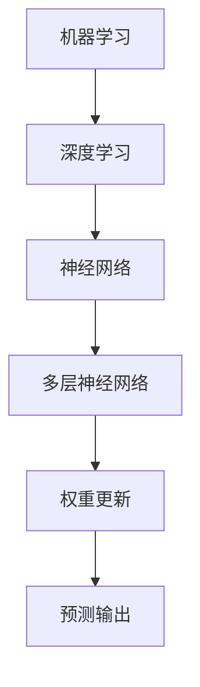

                 

关键词：图灵奖，AI算法，深度学习，神经网络，机器学习，算法突破

> 摘要：本文深入探讨了近年来图灵奖在人工智能领域的重大贡献，特别是在深度学习和神经网络算法方面的突破。文章将详细阐述这些核心算法的基本原理、操作步骤、优缺点以及应用领域，并通过数学模型和实际项目实例，展示其在现代科技中的广泛应用。同时，文章还将展望未来人工智能的发展趋势与挑战，为读者提供一份全面而深入的AI技术指南。

## 1. 背景介绍

图灵奖，被誉为计算机领域的诺贝尔奖，每年颁发给在计算机科学领域作出杰出贡献的个人。自1966年设立以来，图灵奖见证了计算机科学的飞速发展，从早期的编程语言、算法理论到现代的人工智能、量子计算等前沿领域。本文聚焦于图灵奖在人工智能（AI）领域的贡献，特别是近年来在深度学习、神经网络和机器学习等方面的重大突破。

### 1.1 图灵奖的历史与影响

图灵奖的设立旨在奖励那些对计算机科学做出卓越贡献的科学家。自1966年首次颁发以来，图灵奖已经奖励了许多计算机科学的先驱者，如艾伦·图灵本人、约翰·麦卡锡、肯·汤普森等。这些科学家在计算机科学的不同领域做出了开创性的工作，推动了整个领域的发展。

### 1.2 人工智能的发展历程

人工智能（AI）作为计算机科学的一个分支，其发展历程可以追溯到20世纪50年代。早期的AI研究主要集中在规则系统和符号推理上，这些方法虽然具有一定的智能，但在处理复杂问题时显得力不从心。随着计算机性能的提升和大数据的涌现，深度学习和神经网络等算法逐渐成为AI研究的主流。近年来，AI在语音识别、图像处理、自然语言处理等领域的应用取得了显著成果，这些成果的取得离不开图灵奖获得者的贡献。

## 2. 核心概念与联系

### 2.1 深度学习与神经网络

深度学习（Deep Learning）是机器学习（Machine Learning）的一种形式，它通过多层神经网络（Neural Networks）对数据进行学习，从而实现高度复杂的任务。神经网络模仿人脑的工作方式，通过大量神经元之间的连接（即权重）来处理信息。

### 2.2 机器学习与算法

机器学习是使计算机系统能够从数据中学习并做出决策或预测的技术。其核心是算法，这些算法能够自动地从数据中提取模式，并使用这些模式来做出预测或决策。深度学习算法是机器学习的一个重要分支。

### 2.3 Mermaid 流程图

以下是一个简单的Mermaid流程图，展示了深度学习和神经网络的联系。



## 3. 核心算法原理 & 具体操作步骤

### 3.1 算法原理概述

深度学习的核心原理是神经网络，特别是多层神经网络（Deep Neural Networks）。这些网络由多个层组成，每一层都包含多个神经元。神经元的输入是前一层的输出，通过激活函数进行非线性变换，然后通过权重和偏置进行加权求和，最后输出一个结果。通过反向传播算法，网络可以自动调整权重和偏置，以最小化损失函数，从而提高模型的预测能力。

### 3.2 算法步骤详解

1. **数据预处理**：将原始数据转换为适合神经网络处理的格式。
2. **构建网络结构**：定义网络的层数、每层的神经元数量、激活函数等。
3. **初始化权重和偏置**：随机初始化网络的权重和偏置。
4. **前向传播**：将输入数据通过网络进行传递，得到预测输出。
5. **计算损失**：计算预测输出和真实输出之间的差异，得到损失值。
6. **反向传播**：通过反向传播算法，计算梯度，并更新权重和偏置。
7. **迭代优化**：重复步骤4到6，直到损失函数达到最小或满足其他停止条件。

### 3.3 算法优缺点

**优点**：
- 高效处理复杂数据：深度学习能够自动提取数据的特征，处理复杂的问题。
- 自动化特征提取：深度学习可以自动学习数据中的高级特征，减少人工干预。
- 广泛应用：深度学习在图像识别、自然语言处理、语音识别等领域有广泛的应用。

**缺点**：
- 需要大量数据：深度学习需要大量的数据进行训练，否则难以取得良好的效果。
- 需要大量计算资源：深度学习模型通常需要大量计算资源，训练时间较长。
- 解释性差：深度学习模型通常被视为黑盒，难以解释其内部的工作原理。

### 3.4 算法应用领域

深度学习在图像识别、自然语言处理、语音识别、推荐系统、医疗诊断等多个领域有广泛的应用。以下是一些具体的应用实例：

- **图像识别**：通过卷积神经网络（CNN）实现图像分类、物体检测等。
- **自然语言处理**：通过循环神经网络（RNN）和长短期记忆网络（LSTM）实现文本分类、机器翻译等。
- **语音识别**：通过深度神经网络实现语音信号的识别和理解。
- **推荐系统**：通过深度学习算法实现个性化推荐，提高用户满意度。

## 4. 数学模型和公式 & 详细讲解 & 举例说明

### 4.1 数学模型构建

深度学习的数学模型主要基于神经网络，包括以下基本组成部分：

- **神经元**：神经网络的基本单元，负责处理输入并产生输出。
- **权重**：神经元之间的连接，用于传递信息。
- **偏置**：用于调整神经元的输出。
- **激活函数**：用于引入非线性，使神经网络具有更强的表达能力。

### 4.2 公式推导过程

以下是一个简单的神经网络模型，包括输入层、隐藏层和输出层。

$$
\begin{aligned}
&\text{输入层}: \text{ } x_1, x_2, ..., x_n \\
&\text{隐藏层}: \text{ } z_1 = \sigma(w_1x_1 + b_1), z_2 = \sigma(w_2x_2 + b_2), ..., z_m = \sigma(w_mx_m + b_m) \\
&\text{输出层}: \text{ } y = \sigma(w_{m+1}z_1 + b_{m+1}) \\
\end{aligned}
$$

其中，$w_i$ 表示从输入层到隐藏层的权重，$b_i$ 表示隐藏层的偏置，$\sigma$ 表示激活函数，通常使用 sigmoid 函数。

### 4.3 案例分析与讲解

以下是一个简单的神经网络模型，用于实现二分类任务。

$$
\begin{aligned}
&\text{输入层}: \text{ } x_1, x_2 \\
&\text{隐藏层}: \text{ } z_1 = \sigma(w_1x_1 + b_1), z_2 = \sigma(w_2x_2 + b_2) \\
&\text{输出层}: \text{ } y = \sigma(w_3z_1 + w_4z_2 + b_3) \\
\end{aligned}
$$

该模型通过两个输入变量预测一个二分类结果，隐藏层使用 sigmoid 激活函数，输出层也使用 sigmoid 激活函数，以实现概率输出。

## 5. 项目实践：代码实例和详细解释说明

### 5.1 开发环境搭建

在开始编写代码之前，需要搭建一个适合深度学习开发的Python环境。以下是搭建开发环境的步骤：

1. 安装Python（建议使用3.7及以上版本）。
2. 安装深度学习框架TensorFlow。
3. 安装其他依赖库，如NumPy、Pandas等。

### 5.2 源代码详细实现

以下是一个简单的深度学习模型，用于实现二分类任务。

```python
import tensorflow as tf
from tensorflow.keras import layers

# 定义模型结构
model = tf.keras.Sequential([
    layers.Dense(64, activation='relu', input_shape=(784,)),
    layers.Dense(64, activation='relu'),
    layers.Dense(1, activation='sigmoid')
])

# 编译模型
model.compile(optimizer='adam',
              loss='binary_crossentropy',
              metrics=['accuracy'])

# 加载数据集
(x_train, y_train), (x_test, y_test) = tf.keras.datasets.mnist.load_data()

# 预处理数据
x_train = x_train.astype('float32') / 255
x_test = x_test.astype('float32') / 255
x_train = x_train.reshape((-1, 784))
x_test = x_test.reshape((-1, 784))

# 训练模型
model.fit(x_train, y_train, epochs=5, batch_size=128)

# 评估模型
model.evaluate(x_test, y_test)
```

### 5.3 代码解读与分析

1. **模型定义**：使用 `tf.keras.Sequential` 定义一个简单的全连接神经网络，包括两个隐藏层，每层64个神经元，使用 ReLU 激活函数，输出层使用 sigmoid 激活函数实现概率输出。
2. **模型编译**：使用 `model.compile` 编译模型，指定优化器为 Adam，损失函数为 binary_crossentropy，评估指标为 accuracy。
3. **数据预处理**：加载数据集，并将数据转换为适合训练的格式，包括归一化和reshape。
4. **模型训练**：使用 `model.fit` 对模型进行训练，指定训练轮数和批量大小。
5. **模型评估**：使用 `model.evaluate` 对模型进行评估，得到测试集上的准确率。

## 6. 实际应用场景

深度学习在图像识别、自然语言处理、语音识别、推荐系统、医疗诊断等多个领域有广泛的应用。以下是一些具体的实际应用场景：

- **图像识别**：通过卷积神经网络实现图像分类、物体检测等。
- **自然语言处理**：通过循环神经网络和长短期记忆网络实现文本分类、机器翻译等。
- **语音识别**：通过深度神经网络实现语音信号的识别和理解。
- **推荐系统**：通过深度学习算法实现个性化推荐，提高用户满意度。
- **医疗诊断**：通过深度学习模型对医学图像进行分析，辅助医生进行诊断。

## 7. 工具和资源推荐

### 7.1 学习资源推荐

- 《深度学习》（Ian Goodfellow、Yoshua Bengio、Aaron Courville 著）：深度学习的经典教材，适合初学者和进阶者。
- 《Python深度学习》（François Chollet 著）：结合TensorFlow和Python，详细介绍深度学习的基础知识和实践方法。

### 7.2 开发工具推荐

- TensorFlow：开源的深度学习框架，支持多种编程语言，包括Python。
- Keras：基于TensorFlow的高层API，简化深度学习模型的搭建和训练过程。
- PyTorch：开源的深度学习框架，支持动态计算图，适合研究和实验。

### 7.3 相关论文推荐

- "A Study of Training Deep Networks"（2012）：分析了深度学习训练过程中的挑战和解决方案。
- "Deep Learning: Methods and Applications"（2016）：概述了深度学习的基本概念和应用领域。
- "Natural Language Processing with Deep Learning"（2018）：介绍了深度学习在自然语言处理中的应用。

## 8. 总结：未来发展趋势与挑战

### 8.1 研究成果总结

近年来，图灵奖在人工智能领域取得了许多突破性成果，特别是在深度学习和神经网络算法方面。这些成果不仅推动了AI技术的发展，也促进了其在各个领域的广泛应用。

### 8.2 未来发展趋势

未来，人工智能将继续向深度学习和神经网络方向发展，同时，随着计算能力的提升和数据的增加，AI技术的应用将更加广泛。此外，AI与其他领域的交叉融合也将带来新的发展机遇。

### 8.3 面临的挑战

尽管人工智能取得了显著进展，但仍面临许多挑战。其中，数据隐私、算法透明性、伦理问题等是亟待解决的问题。此外，深度学习模型的解释性和可解释性也是一个重要的研究方向。

### 8.4 研究展望

未来，人工智能的研究将更加注重可解释性、可扩展性和实用性。随着技术的不断进步，AI将在更多领域发挥重要作用，为社会带来更多福祉。

## 9. 附录：常见问题与解答

### 9.1 深度学习与机器学习的区别是什么？

深度学习是机器学习的一种形式，它通过多层神经网络对数据进行学习。而机器学习是一类更广泛的方法，包括监督学习、无监督学习和强化学习等。

### 9.2 深度学习模型如何训练？

深度学习模型通常通过以下步骤进行训练：

1. 数据预处理：将原始数据转换为适合模型训练的格式。
2. 构建网络结构：定义网络的层数、神经元数量、激活函数等。
3. 初始化权重和偏置：随机初始化网络的权重和偏置。
4. 前向传播：将输入数据通过网络进行传递，得到预测输出。
5. 计算损失：计算预测输出和真实输出之间的差异，得到损失值。
6. 反向传播：通过反向传播算法，计算梯度，并更新权重和偏置。
7. 迭代优化：重复步骤4到6，直到损失函数达到最小或满足其他停止条件。

### 9.3 深度学习模型的优缺点是什么？

深度学习模型的优点包括：

- 高效处理复杂数据。
- 自动化特征提取。
- 广泛应用。

缺点包括：

- 需要大量数据。
- 需要大量计算资源。
- 解释性差。

