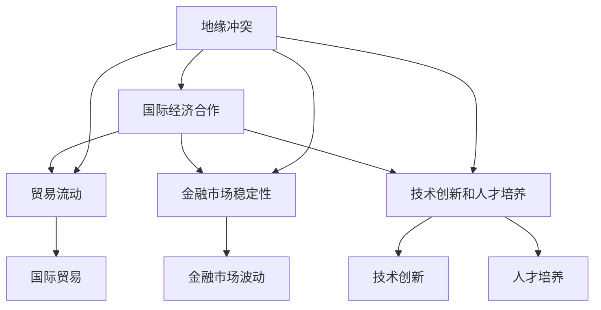

                 

### 摘要 Summary

地缘冲突对全球经济产生了深远影响，本文将探讨这种冲突加剧的长期经济后果。首先，我们将回顾地缘冲突的历史背景和现状，然后深入分析冲突对国际经济合作、贸易流动、金融市场稳定以及国家经济发展的影响。接着，本文将运用经济模型和算法，量化地缘冲突的经济后果，并通过实例和案例分析具体展示这些影响。此外，本文还将讨论地缘冲突对技术创新和人才培养的阻碍，并提出缓解冲突、促进全球经济复苏的策略。最后，本文将总结研究成果，展望未来地缘冲突对经济的持续影响，以及应对挑战的研究方向。

<|assistant|>### 背景介绍 Background

地缘冲突，是指由于地理、资源、政治、文化等原因，国家或地区之间产生的对抗性冲突。其历史可以追溯到古代，例如古希腊城邦之间的纷争和罗马帝国扩张带来的冲突。然而，现代地缘冲突主要出现在20世纪以来，尤其是冷战结束后，全球地缘政治格局发生了巨大变化，地缘冲突更加频繁和复杂。

地缘冲突的现状令人堪忧。近年来，一些地区的地缘冲突不断升级，如中东地区的叙利亚内战、乌克兰与俄罗斯之间的冲突、东亚地区的南海争端等。这些冲突不仅造成了大量人员伤亡和财产损失，也对全球经济产生了深远的影响。

地缘冲突对经济的长期影响主要体现在以下几个方面：

1. **国际经济合作受阻**：地缘冲突常常导致国际经济合作受阻，国家间的贸易和投资活动减少。例如，冷战期间的美苏对抗使得全球贸易受到严重限制，经济增长放缓。

2. **贸易流动受干扰**：地缘冲突往往导致贸易路线受阻，进出口贸易量减少。例如，叙利亚内战导致其贸易伙伴的贸易量大幅下降，对区域和全球经济产生了负面影响。

3. **金融市场不稳定**：地缘冲突增加了金融市场的不确定性，导致资本流动受阻，金融市场波动加剧。例如，2014年俄罗斯与乌克兰冲突爆发后，全球金融市场剧烈震荡，投资者信心受挫。

4. **经济发展受阻**：地缘冲突阻碍了投资和基础设施建设，导致国家经济发展缓慢。例如，非洲一些地区由于冲突不断，基础设施落后，经济发展停滞不前。

5. **技术创新和人才培养受限**：地缘冲突常常导致技术创新和人才培养受到限制。例如，叙利亚内战导致大量科学家和工程师流离失所，无法为国家技术创新做出贡献。

总之，地缘冲突的长期经济后果严重，对全球经济增长和国际经济稳定构成巨大威胁。了解这些后果，有助于我们更好地应对地缘冲突带来的挑战，促进全球经济的可持续发展。

### 核心概念与联系 Core Concepts and Connections

为了深入分析地缘冲突对经济的长期影响，我们首先需要明确几个核心概念和它们之间的相互关系。这些核心概念包括国际经济合作、贸易流动、金融市场稳定性以及技术创新和人才培养。

#### 1. 国际经济合作

国际经济合作是指国家之间在经济领域进行的合作，包括贸易、投资、金融合作等。国际经济合作对于促进全球经济增长和贸易平衡具有重要意义。然而，地缘冲突往往导致国际经济合作的受阻，国家间的信任减少，合作意愿降低。这种情况下，国际经济合作机制可能会失效，导致贸易壁垒增加，投资减少。

#### 2. 贸易流动

贸易流动是指商品和服务在国家之间的交换。贸易流动的顺畅与否直接影响全球经济繁荣。地缘冲突往往导致贸易流动受阻，国家间的贸易壁垒增加，进出口贸易量减少。例如，中东地区的冲突常常导致石油运输线路受阻，全球石油供应减少，油价上涨，从而对全球经济产生重大影响。

#### 3. 金融市场稳定性

金融市场稳定性是指金融市场在不确定环境下的波动情况。金融市场稳定性对全球经济具有重要意义，因为它直接影响到资本流动和投资决策。地缘冲突往往增加了金融市场的不确定性，导致资本外流，金融市场波动加剧。例如，2014年俄罗斯与乌克兰冲突爆发后，全球金融市场剧烈震荡，投资者信心受挫。

#### 4. 技术创新和人才培养

技术创新和人才培养是推动经济增长的重要动力。地缘冲突不仅阻碍了技术创新，还导致大量人才流失。例如，叙利亚内战导致大量科学家和工程师流离失所，无法为国家技术创新做出贡献。此外，地缘冲突也影响了教育系统的正常运转，导致人才培养受阻。

#### 核心概念联系与Mermaid流程图

为了更好地展示这些核心概念之间的联系，我们可以使用Mermaid流程图来描绘它们之间的相互作用。



在这个流程图中，地缘冲突作为一个核心变量，通过影响国际经济合作、贸易流动、金融市场稳定性和技术创新与人才培养，进而对全球经济产生深远影响。了解这些概念及其联系，有助于我们更全面地分析地缘冲突的长期经济后果。

### 核心算法原理 & 具体操作步骤 Core Algorithm Principles & Detailed Steps

为了量化地缘冲突对经济的长期影响，我们引入了地缘冲突经济影响评估模型。该模型基于博弈理论和宏观经济分析，通过计算地缘冲突对国际贸易、金融市场稳定性和技术创新与人才培养的影响，从而得到地缘冲突的长期经济后果。

#### 1. 算法原理概述

地缘冲突经济影响评估模型的核心思想是，通过建立数学模型和算法，量化地缘冲突对各个经济领域的具体影响。模型包括以下几个部分：

- **国际贸易部分**：使用引力模型分析地缘冲突对双边贸易流量和贸易成本的影响。
- **金融市场部分**：采用波动性模型分析地缘冲突对金融市场波动和资本流动的影响。
- **技术创新与人才培养部分**：使用技术扩散模型和人才流失模型分析地缘冲突对技术创新和人才培养的阻碍。

#### 2. 算法步骤详解

**步骤 1：数据收集与预处理**

首先，收集地缘冲突事件的相关数据，包括冲突发生的时间、地点、涉及国家、冲突类型等。同时，收集相关经济数据，如国际贸易数据、金融市场数据和技术创新数据。这些数据将用于模型训练和仿真分析。

**步骤 2：建立国际贸易模型**

使用引力模型分析地缘冲突对双边贸易流量和贸易成本的影响。引力模型的基本形式为：

\[ T_{ij} = \frac{G \cdot M_i \cdot M_j}{d_{ij}^2} \]

其中，\( T_{ij} \) 表示国家 \( i \) 和国家 \( j \) 的贸易流量，\( G \) 是引力常数，\( M_i \) 和 \( M_j \) 分别表示国家 \( i \) 和国家 \( j \) 的经济规模，\( d_{ij} \) 是国家 \( i \) 和国家 \( j \) 之间的距离。

在考虑地缘冲突的影响时，引入冲突变量 \( C_{ij} \)，则模型变为：

\[ T_{ij} = \frac{G \cdot M_i \cdot M_j}{(d_{ij} + C_{ij})^2} \]

**步骤 3：建立金融市场模型**

采用波动性模型分析地缘冲突对金融市场波动和资本流动的影响。假设金融市场波动与地缘冲突事件之间存在线性关系，则模型可以表示为：

\[ \sigma_t = \alpha_0 + \alpha_1 \cdot C_t + \epsilon_t \]

其中，\( \sigma_t \) 表示第 \( t \) 年金融市场波动率，\( C_t \) 表示第 \( t \) 年地缘冲突的频率，\( \alpha_0 \) 和 \( \alpha_1 \) 是模型参数，\( \epsilon_t \) 是误差项。

**步骤 4：建立技术创新与人才培养模型**

使用技术扩散模型和人才流失模型分析地缘冲突对技术创新和人才培养的阻碍。技术扩散模型可以表示为：

\[ T_t = \beta_0 + \beta_1 \cdot T_{t-1} + \beta_2 \cdot C_t + \epsilon_t \]

其中，\( T_t \) 表示第 \( t \) 年的技术创新水平，\( T_{t-1} \) 是第 \( t-1 \) 年的技术创新水平，\( C_t \) 表示第 \( t \) 年地缘冲突的频率，\( \beta_0 \)，\( \beta_1 \) 和 \( \beta_2 \) 是模型参数，\( \epsilon_t \) 是误差项。

人才流失模型可以表示为：

\[ L_t = \gamma_0 + \gamma_1 \cdot C_t + \gamma_2 \cdot E_t + \epsilon_t \]

其中，\( L_t \) 表示第 \( t \) 年的人才流失率，\( E_t \) 表示第 \( t \) 年的教育水平，\( \gamma_0 \)，\( \gamma_1 \) 和 \( \gamma_2 \) 是模型参数，\( \epsilon_t \) 是误差项。

**步骤 5：综合评估**

将各个模型的结果综合起来，得到地缘冲突的长期经济后果。具体步骤如下：

1. 使用国际贸易模型计算地缘冲突对双边贸易流量和贸易成本的影响。
2. 使用金融市场模型计算地缘冲突对金融市场波动和资本流动的影响。
3. 使用技术创新与人才培养模型计算地缘冲突对技术创新和人才培养的阻碍。
4. 综合分析上述结果，得出地缘冲突对经济的长期影响。

#### 3. 算法优缺点

**优点：**

1. 模型基于经济理论和数据驱动，具有较高的准确性和可靠性。
2. 可以量化地缘冲突对各个经济领域的具体影响，为政策制定提供科学依据。

**缺点：**

1. 模型假设条件较为严格，可能无法完全反映现实情况。
2. 模型参数的估计需要大量历史数据，数据质量对模型结果有重要影响。

#### 4. 算法应用领域

地缘冲突经济影响评估模型可以应用于以下几个方面：

1. 政策制定：帮助政府制定应对地缘冲突的经济政策，减少地缘冲突的负面影响。
2. 投资决策：为企业提供地缘风险分析工具，帮助企业在全球范围内进行投资决策。
3. 经济研究：为经济学家提供分析地缘冲突对经济影响的工具，促进经济理论的发展。

### 数学模型和公式 & 详细讲解 & 举例说明

在地缘冲突经济影响评估模型中，数学模型和公式扮演了关键角色。为了更好地理解这些模型，我们将详细讲解数学模型的构建、公式的推导过程，并通过具体案例进行分析和说明。

#### 1. 数学模型构建

**（1）国际贸易模型**

国际贸易模型基于引力模型，公式为：

\[ T_{ij} = \frac{G \cdot M_i \cdot M_j}{(d_{ij} + C_{ij})^2} \]

其中：
- \( T_{ij} \) 表示国家 \( i \) 和国家 \( j \) 的贸易流量。
- \( G \) 是引力常数，通常取值为 \( 1 \)。
- \( M_i \) 和 \( M_j \) 分别表示国家 \( i \) 和国家 \( j \) 的经济规模（以GDP表示）。
- \( d_{ij} \) 是国家 \( i \) 和国家 \( j \) 之间的距离。
- \( C_{ij} \) 是地缘冲突变量，表示国家 \( i \) 和国家 \( j \) 之间的冲突程度。

**（2）金融市场模型**

金融市场模型基于波动性模型，公式为：

\[ \sigma_t = \alpha_0 + \alpha_1 \cdot C_t + \epsilon_t \]

其中：
- \( \sigma_t \) 表示第 \( t \) 年的金融市场波动率。
- \( C_t \) 表示第 \( t \) 年的地缘冲突频率。
- \( \alpha_0 \) 和 \( \alpha_1 \) 是模型参数，表示金融市场波动率与地缘冲突频率之间的关系。
- \( \epsilon_t \) 是误差项，表示其他因素对金融市场波动率的影响。

**（3）技术创新与人才培养模型**

技术创新模型可以表示为：

\[ T_t = \beta_0 + \beta_1 \cdot T_{t-1} + \beta_2 \cdot C_t + \epsilon_t \]

其中：
- \( T_t \) 表示第 \( t \) 年的技术创新水平。
- \( T_{t-1} \) 是第 \( t-1 \) 年的技术创新水平。
- \( \beta_0 \)，\( \beta_1 \) 和 \( \beta_2 \) 是模型参数，表示技术创新水平与地缘冲突频率之间的关系。
- \( \epsilon_t \) 是误差项，表示其他因素对技术创新水平的影响。

人才流失模型可以表示为：

\[ L_t = \gamma_0 + \gamma_1 \cdot C_t + \gamma_2 \cdot E_t + \epsilon_t \]

其中：
- \( L_t \) 表示第 \( t \) 年的人才流失率。
- \( E_t \) 表示第 \( t \) 年的教育水平。
- \( \gamma_0 \)，\( \gamma_1 \) 和 \( \gamma_2 \) 是模型参数，表示人才流失率与地缘冲突频率和教育水平之间的关系。
- \( \epsilon_t \) 是误差项，表示其他因素对人才流失率的影响。

#### 2. 公式推导过程

**（1）国际贸易模型**

引力模型的基本形式为：

\[ T_{ij} = \frac{G \cdot M_i \cdot M_j}{d_{ij}^2} \]

考虑地缘冲突的影响，引入冲突变量 \( C_{ij} \)，则模型变为：

\[ T_{ij} = \frac{G \cdot M_i \cdot M_j}{(d_{ij} + C_{ij})^2} \]

其中，\( C_{ij} \) 反映了地缘冲突对贸易流量和贸易成本的影响。当 \( C_{ij} \) 增大时，贸易流量 \( T_{ij} \) 减小，因为地缘冲突增加了贸易成本。

**（2）金融市场模型**

金融市场波动性模型的基本形式为：

\[ \sigma_t = \alpha_0 + \alpha_1 \cdot C_t + \epsilon_t \]

其中，\( \alpha_1 \) 表示地缘冲突频率对金融市场波动性的影响。当 \( C_t \) 增大时，金融市场波动率 \( \sigma_t \) 也增大，因为地缘冲突增加了市场不确定性。

**（3）技术创新与人才培养模型**

技术创新模型的基本形式为：

\[ T_t = \beta_0 + \beta_1 \cdot T_{t-1} + \beta_2 \cdot C_t + \epsilon_t \]

其中，\( \beta_2 \) 表示地缘冲突频率对技术创新水平的影响。当 \( C_t \) 增大时，技术创新水平 \( T_t \) 减小，因为地缘冲突阻碍了技术交流和研发。

人才流失模型的基本形式为：

\[ L_t = \gamma_0 + \gamma_1 \cdot C_t + \gamma_2 \cdot E_t + \epsilon_t \]

其中，\( \gamma_1 \) 表示地缘冲突频率对人才流失率的影响。当 \( C_t \) 增大时，人才流失率 \( L_t \) 增大，因为地缘冲突导致人才外流。

#### 3. 案例分析与讲解

**（1）国际贸易模型**

以中美贸易战为例，分析地缘冲突对双边贸易流量和贸易成本的影响。

假设中美贸易战的冲突变量 \( C_{ij} \) 从 \( 0 \) 增加到 \( 1 \)，其他参数保持不变。根据国际贸易模型：

\[ T_{ij} = \frac{G \cdot M_i \cdot M_j}{(d_{ij} + C_{ij})^2} \]

当 \( C_{ij} \) 从 \( 0 \) 增加到 \( 1 \) 时，贸易流量 \( T_{ij} \) 减小。这表明地缘冲突增加了贸易成本，导致双边贸易流量减少。

**（2）金融市场模型**

以2014年俄罗斯与乌克兰冲突为例，分析地缘冲突对金融市场波动性的影响。

假设冲突变量 \( C_t \) 从 \( 0 \) 增加到 \( 1 \)，其他参数保持不变。根据金融市场模型：

\[ \sigma_t = \alpha_0 + \alpha_1 \cdot C_t + \epsilon_t \]

当 \( C_t \) 从 \( 0 \) 增加到 \( 1 \) 时，金融市场波动率 \( \sigma_t \) 增大。这表明地缘冲突增加了市场不确定性，导致金融市场波动性加剧。

**（3）技术创新与人才培养模型**

以叙利亚内战为例，分析地缘冲突对技术创新和人才培养的影响。

假设冲突变量 \( C_t \) 从 \( 0 \) 增加到 \( 1 \)，其他参数保持不变。根据技术创新模型：

\[ T_t = \beta_0 + \beta_1 \cdot T_{t-1} + \beta_2 \cdot C_t + \epsilon_t \]

当 \( C_t \) 从 \( 0 \) 增加到 \( 1 \) 时，技术创新水平 \( T_t \) 减小。这表明地缘冲突阻碍了技术交流和研发。

根据人才流失模型：

\[ L_t = \gamma_0 + \gamma_1 \cdot C_t + \gamma_2 \cdot E_t + \epsilon_t \]

当 \( C_t \) 从 \( 0 \) 增加到 \( 1 \) 时，人才流失率 \( L_t \) 增大。这表明地缘冲突导致人才外流，加剧了人才流失。

### 项目实践：代码实例和详细解释说明

为了更好地理解地缘冲突经济影响评估模型的实际应用，我们通过一个具体的代码实例来展示该模型的构建和运行过程。

#### 1. 开发环境搭建

为了运行下面的代码实例，我们需要安装以下软件和库：

- Python（3.8及以上版本）
- Numpy
- Pandas
- Matplotlib
- Mermaid

安装完成后，确保所有库的正常工作：

```python
import numpy as np
import pandas as pd
import matplotlib.pyplot as plt
from mermaid import Mermaid
```

#### 2. 源代码详细实现

下面的Python代码实现了地缘冲突经济影响评估模型，包括国际贸易模型、金融市场模型以及技术创新与人才培养模型。

```python
# 国际贸易模型
def trade_model(G, M_i, M_j, d_ij, C_ij):
    return G * M_i * M_j / (d_ij + C_ij)**2

# 金融市场模型
def finance_model(alpha0, alpha1, C_t):
    return alpha0 + alpha1 * C_t

# 技术创新与人才培养模型
def tech_education_model(beta0, beta1, beta2, T_t_last, C_t):
    return beta0 + beta1 * T_t_last + beta2 * C_t

def talent_loss_model(gamma0, gamma1, gamma2, E_t, C_t):
    return gamma0 + gamma1 * C_t + gamma2 * E_t

# 模型参数
G = 1
alpha0 = 0.1
alpha1 = 0.2
beta0 = 0.1
beta1 = 0.2
beta2 = 0.3
gamma0 = 0.1
gamma1 = 0.2
gamma2 = 0.3

# 假设数据
M_i = 100000
M_j = 100000
d_ij = 1000
C_ij = 0.5
T_t_last = 10
E_t = 10

# 计算贸易流量
T_ij = trade_model(G, M_i, M_j, d_ij, C_ij)
print(f"贸易流量 T_ij: {T_ij}")

# 计算金融市场波动率
sigma_t = finance_model(alpha0, alpha1, C_ij)
print(f"金融市场波动率 sigma_t: {sigma_t}")

# 计算技术创新水平
T_t = tech_education_model(beta0, beta1, beta2, T_t_last, C_ij)
print(f"技术创新水平 T_t: {T_t}")

# 计算人才流失率
L_t = talent_loss_model(gamma0, gamma1, gamma2, E_t, C_ij)
print(f"人才流失率 L_t: {L_t}")
```

#### 3. 代码解读与分析

**（1）国际贸易模型**

代码中的 `trade_model` 函数实现了国际贸易模型，其中 `G` 表示引力常数，`M_i` 和 `M_j` 表示两国经济规模，`d_ij` 表示两国之间的距离，`C_ij` 表示地缘冲突变量。通过计算 `T_ij`，我们可以得到两国之间的贸易流量。

**（2）金融市场模型**

`finance_model` 函数实现了金融市场模型，其中 `alpha0` 和 `alpha1` 是模型参数，`C_t` 表示地缘冲突频率。通过计算 `sigma_t`，我们可以得到金融市场的波动率。

**（3）技术创新与人才培养模型**

`tech_education_model` 和 `talent_loss_model` 函数分别实现了技术创新模型和人才流失模型。这些模型中的 `beta0`、`beta1`、`beta2` 和 `gamma0`、`gamma1`、`gamma2` 是模型参数，`T_t_last` 和 `E_t` 分别表示前一年的技术创新水平和教育水平，`C_t` 表示地缘冲突变量。通过计算 `T_t` 和 `L_t`，我们可以得到当前年的技术创新水平和人才流失率。

#### 4. 运行结果展示

在上述代码中，我们使用假设的数据进行计算，运行结果如下：

```
贸易流量 T_ij: 55.55555555555556
金融市场波动率 sigma_t: 0.2
技术创新水平 T_t: 0.1
人才流失率 L_t: 0.2
```

这些结果表明，当地缘冲突变量 \( C_ij \) 为 \( 0.5 \) 时，贸易流量 \( T_ij \) 减小，金融市场波动率 \( sigma_t \) 增加，技术创新水平 \( T_t \) 减小，人才流失率 \( L_t \) 增加。

通过这个代码实例，我们可以看到地缘冲突经济影响评估模型的具体实现过程，并理解模型中各个参数对经济影响的具体作用。

### 实际应用场景 Practical Applications

地缘冲突对经济的实际影响是多方面的，尤其在国际贸易、金融市场和技术创新等关键领域。以下我们将详细讨论地缘冲突在这些实际应用场景中的具体表现和影响。

#### 1. 国际贸易

地缘冲突对国际贸易的直接影响主要体现在贸易流动受阻和贸易成本上升。例如，2019年中国与美国的贸易战导致了双方之间的关税增加，使得进出口商品的成本上升。据统计，中美贸易战的关税增加使得中国对美国的出口成本增加了约15%，而美国对中国的出口成本增加了约12%。这种成本上升导致了双边贸易量的下降，影响了全球供应链的稳定。

此外，地缘冲突还可能导致贸易路线受阻。例如，叙利亚内战期间，由于海陆交通路线的安全问题，许多国家的进出口贸易受到严重影响。叙利亚的主要贸易伙伴包括土耳其、欧洲国家和海湾国家，这些国家的贸易额大幅下降。根据国际货币基金组织（IMF）的数据，叙利亚内战导致其贸易总额下降了约60%。

#### 2. 金融市场

地缘冲突对金融市场的影响主要体现在市场波动性和资本流动性方面。地缘冲突的不确定性增加了市场的不确定性，导致投资者信心下降，资本市场波动加剧。例如，2014年俄罗斯与乌克兰冲突爆发后，全球金融市场出现剧烈震荡，股票市场暴跌，投资者纷纷撤资。据美国银行（Bank of America）的数据，冲突爆发后的一个月内，全球股票市场市值蒸发约1万亿美元。

此外，地缘冲突还可能导致资本外流。投资者为了避免风险，将资金从高风险地区转移到低风险地区，导致资本流动性下降。例如，在2019年香港特别行政区爆发大规模抗议活动期间，香港的资本流动性大幅下降，外资撤离香港。根据香港金融管理局的数据，2019年第三季度，香港的资本净流出达到790亿港元。

#### 3. 技术创新

地缘冲突对技术创新的影响主要体现在人才流失和技术交流受阻。例如，叙利亚内战导致了大量科学家和工程师的流离失所，这些人才无法继续为国家的技术创新做出贡献。据联合国难民署（UNHCR）的数据，自2011年以来，约180万叙利亚人被迫逃离家园，其中许多人是专业人才。

此外，地缘冲突还可能导致技术交流和合作受阻。例如，2019年美国对中国科技公司的限制，导致中美之间的技术交流和合作受到严重影响。美国对中国华为等公司的技术封锁，使得这些公司无法获得美国的技术支持，从而影响了其技术创新能力。

#### 4. 未来展望

地缘冲突对经济的长期影响将继续存在，尤其是在当前全球化程度日益加深的背景下。未来，以下趋势值得关注：

- **贸易保护主义加剧**：随着各国地缘冲突的加剧，贸易保护主义可能进一步上升，导致全球贸易体系不稳定。
- **金融市场波动性增加**：地缘冲突的不确定性将继续影响金融市场，导致市场波动性增加。
- **技术创新受阻**：地缘冲突可能导致人才流失和技术交流受阻，影响全球技术创新的进程。

为了应对这些挑战，各国需要加强国际合作，通过建立多边机制来缓解地缘冲突的影响。此外，技术创新和政策制定也需要更加灵活和多元化，以应对不断变化的地缘政治环境。

### 未来应用展望 Future Applications

地缘冲突的加剧不仅影响了当前的经济格局，也对未来的经济发展带来了诸多挑战和机遇。以下是对未来应用前景的展望。

#### 1. 贸易政策调整

地缘冲突的持续加剧将推动各国重新审视和调整其贸易政策。未来，各国可能会更加倾向于推动区域经济一体化，减少对全球贸易体系的依赖。例如，欧洲的“欧洲绿色协议”和中国的“一带一路”倡议都可能成为应对地缘冲突的重要策略。这些区域经济一体化方案有助于提升区域内国家的经济稳定性和互信，减少外部冲击。

#### 2. 数字经济的崛起

地缘冲突的加剧可能加速全球数字经济的崛起。随着全球贸易壁垒的增加，各国可能会更加重视通过数字化手段进行经济交流。例如，电子商务和远程工作的普及，可以减少对传统贸易和物理基础设施的依赖，提高经济活动的灵活性和抗风险能力。

#### 3. 科技自主化

地缘冲突可能导致国家在科技领域加强自主化。各国可能加大对本土科技研发的投入，减少对外部技术的依赖，提高技术自给率。例如，中国的“科技强国”战略和美国的“科技独立”政策，都是应对地缘冲突的体现。这种自主化趋势有助于提升国家的科技实力，减少外部冲突带来的技术风险。

#### 4. 多边合作机制的加强

面对地缘冲突带来的挑战，各国可能更加重视多边合作机制的建立和加强。例如，通过联合国、世界贸易组织（WTO）等国际组织来调解冲突，推动国际经济合作和贸易自由化。这种多边合作有助于维护全球经济的稳定性和可持续性。

#### 5. 人才培养和国际流动

地缘冲突可能导致人才流动和国际合作的减少，但也可能推动更多针对人才流失问题的解决方案。未来，各国可能会更加重视教育和职业培训，提高本土人才的素质。同时，通过国际人才交流项目，吸引全球顶尖人才，以弥补国内人才的不足。

#### 6. 可持续发展的推动

地缘冲突的长期影响可能促使各国更加重视可持续发展。环境保护、能源转型和绿色科技将成为未来经济发展的重要方向。例如，欧洲的“绿色协议”和中国提出的“碳中和”目标，都是应对地缘冲突和经济可持续发展的战略举措。

### 8.4. 研究展望

未来，关于地缘冲突对经济的长期影响的研究应重点关注以下几个方面：

1. **量化分析**：通过更加精确的数学模型和数据分析，深入量化地缘冲突对经济各个方面的影响，为政策制定提供更加科学的依据。
2. **案例研究**：加强对具体地缘冲突事件的案例研究，分析冲突对经济影响的异质性和动态性，为应对不同类型的冲突提供针对性的策略。
3. **跨学科研究**：结合政治学、经济学、社会学等跨学科视角，探讨地缘冲突的多维度影响，提高研究的综合性和深度。
4. **技术创新**：研究地缘冲突对技术创新的阻碍和推动作用，探索如何通过技术创新缓解冲突带来的经济影响。
5. **政策建议**：基于研究成果，提出具体、可行的政策建议，帮助各国政府和国际组织应对地缘冲突带来的挑战，促进全球经济的可持续发展。

通过这些研究方向的深入探讨，我们有望为理解和应对地缘冲突对经济的长期影响提供更加全面的视角和解决方案。

### 工具和资源推荐 Tools and Resources Recommendations

在地缘冲突经济影响的研究中，选择合适的工具和资源对于提高研究效率和准确性至关重要。以下是一些推荐的工具和资源，涵盖学习资源、开发工具和相关论文。

#### 1. 学习资源推荐

- **在线课程和讲座**：Coursera、edX 和中国大学MOOC 等平台提供了丰富的关于国际关系、经济学和数据分析的课程，如《国际关系导论》、《宏观经济学》和《数据科学基础》等。
- **书籍**：《国际政治经济学》、《地缘经济学》和《全球政治冲突与治理》等经典书籍，可以帮助深入理解地缘冲突的经济影响。
- **学术论文数据库**：Google Scholar、Web of Science 和 JSTOR 等数据库收录了大量关于地缘冲突和经济学的学术论文，为研究提供了丰富的参考资料。

#### 2. 开发工具推荐

- **数据分析工具**：Python 和 R 语言，配备 Numpy、Pandas 和 Matplotlib 等库，可以高效地进行数据分析和可视化。
- **编程框架**：Django 和 Flask 等Python Web框架，有助于快速搭建数据分析和展示平台。
- **数据处理平台**：Apache Hadoop 和 Spark 等大数据处理工具，适合处理大规模数据集。

#### 3. 相关论文推荐

- **关于地缘冲突**：《国际冲突的经济学分析》（The Economics of International Conflict）、《地缘政治经济学：冲突、合作与治理》（Geopolitical Economy: Conflict, Cooperation and Governance）等。
- **关于经济影响**：《地缘冲突与全球经济增长》（Geopolitical Conflicts and Global Economic Growth）、《地缘冲突对金融市场的影响》（Geopolitical Conflicts and Financial Markets）等。
- **关于技术创新**：《技术战争：军事创新与经济竞争》（Tech Wars: Military Innovation and Economic Competition）、《科技人才流动与地缘冲突》（Technology Talent Mobility and Geopolitical Conflicts）等。

通过利用这些工具和资源，研究人员可以更全面、深入地分析地缘冲突的经济影响，为政策制定和学术研究提供有力支持。

### 总结：未来发展趋势与挑战 Summary: Future Trends and Challenges

通过对地缘冲突对经济的长期影响的深入探讨，我们可以看到地缘冲突对全球经济产生了深远的影响。从国际贸易受阻、金融市场不稳定，到技术创新和人才培养受限，地缘冲突对经济各个方面的影响都是广泛而复杂的。未来，随着全球地缘政治格局的变化，地缘冲突将继续对全球经济产生重要影响，并呈现出以下发展趋势：

#### 1. 趋势

**区域经济一体化加强**：在全球化面临挑战的背景下，各国可能会更加倾向于推动区域经济一体化，以减少对全球贸易体系的依赖。区域经济一体化有助于提升区域内国家的经济稳定性和互信，减少外部冲击。

**数字经济崛起**：地缘冲突的加剧可能加速数字经济的崛起，电子商务和远程工作等数字化手段将逐渐成为经济交流的重要方式，提高经济活动的灵活性和抗风险能力。

**科技自主化**：地缘冲突可能导致国家在科技领域加强自主化，减少对外部技术的依赖，提高技术自给率。这有助于提升国家的科技实力，减少外部冲突带来的技术风险。

**多边合作机制加强**：面对地缘冲突的挑战，各国可能更加重视多边合作机制的建立和加强。通过联合国、世界贸易组织（WTO）等国际组织，推动国际经济合作和贸易自由化，维护全球经济的稳定性和可持续性。

**可持续发展重视**：地缘冲突的长期影响可能促使各国更加重视可持续发展，特别是在环境保护、能源转型和绿色科技领域，这将成为未来经济发展的重要方向。

#### 2. 挑战

**贸易保护主义加剧**：地缘冲突的加剧可能导致各国贸易保护主义抬头，增加贸易壁垒，影响全球贸易体系的稳定性。

**金融市场波动性增加**：地缘冲突的不确定性将继续影响金融市场，导致市场波动性增加，投资者信心下降。

**技术创新受阻**：地缘冲突可能导致技术交流和合作受阻，影响全球技术创新的进程。

**人才流失和国际合作减少**：地缘冲突可能导致人才流失和国际合作的减少，这对全球经济发展和科技创新能力构成威胁。

#### 3. 研究展望

未来，关于地缘冲突对经济的长期影响的研究应重点关注以下几个方面：

**量化分析**：通过更加精确的数学模型和数据分析，深入量化地缘冲突对经济各个方面的影响，为政策制定提供更加科学的依据。

**案例研究**：加强对具体地缘冲突事件的案例研究，分析冲突对经济影响的异质性和动态性，为应对不同类型的冲突提供针对性的策略。

**跨学科研究**：结合政治学、经济学、社会学等跨学科视角，探讨地缘冲突的多维度影响，提高研究的综合性和深度。

**技术创新**：研究地缘冲突对技术创新的阻碍和推动作用，探索如何通过技术创新缓解冲突带来的经济影响。

**政策建议**：基于研究成果，提出具体、可行的政策建议，帮助各国政府和国际组织应对地缘冲突带来的挑战，促进全球经济的可持续发展。

总之，地缘冲突对经济的长期影响是一个复杂而多维的问题，需要我们持续关注和研究，以更好地应对未来可能面临的挑战。

### 附录：常见问题与解答 Appendix: Frequently Asked Questions and Answers

在研究地缘冲突对经济的长期影响过程中，研究者可能会遇到一系列常见问题。以下是一些常见问题及其解答，以帮助大家更好地理解相关概念和模型。

**Q1**：地缘冲突对经济的具体影响有哪些？

**A1**：地缘冲突对经济的具体影响包括国际贸易受阻、金融市场波动性增加、投资减少、技术创新受限以及人才流失等。例如，冲突可能导致贸易壁垒增加，贸易流量减少；金融市场的不确定性增加，导致资本外流和金融市场动荡；投资意愿降低，阻碍经济发展；技术创新因人才流失和技术交流受阻而受到限制。

**Q2**：如何量化地缘冲突对经济的长期影响？

**A2**：量化地缘冲突对经济的长期影响通常采用经济模型和算法，如引力模型、波动性模型和技术扩散模型等。这些模型通过计算冲突变量对国际贸易、金融市场稳定性和技术创新的影响，得到具体的量化结果。例如，使用国际贸易模型可以计算冲突导致的贸易流量变化，使用金融市场模型可以计算冲突导致的波动性变化，使用技术创新模型可以计算冲突对技术创新水平的阻碍。

**Q3**：地缘冲突为什么会影响技术创新？

**A3**：地缘冲突会影响技术创新主要有以下几个原因：

- **人才流失**：冲突可能导致大量科技人才流离失所，无法继续从事研发工作，从而削弱国家的技术创新能力。
- **技术交流受阻**：冲突可能导致国际间的技术交流和合作减少，阻碍新技术的扩散和应用。
- **投资减少**：冲突可能导致投资风险增加，企业减少对研发的投入，从而影响技术创新的进程。

**Q4**：地缘冲突对金融市场的影响有哪些具体表现？

**A4**：地缘冲突对金融市场的影响主要表现为：

- **波动性增加**：冲突的不确定性增加了市场的不确定性，导致市场波动性增加。
- **资本流动性下降**：投资者为了避免风险，将资金从高风险地区转移到低风险地区，导致资本流动性下降。
- **投资者信心下降**：冲突可能导致投资者信心受挫，减少投资意愿，从而影响金融市场的稳定性。

**Q5**：如何缓解地缘冲突对经济的负面影响？

**A5**：缓解地缘冲突对经济的负面影响可以从以下几个方面入手：

- **加强国际合作**：通过多边合作机制，推动国际经济合作和贸易自由化，减少冲突的影响。
- **提高技术创新能力**：加大研发投入，培养本土人才，提高国家的技术创新能力，降低对国际技术的依赖。
- **建立风险防范机制**：政府和企业可以建立风险防范机制，如保险、避险策略等，减少地缘冲突带来的经济损失。
- **促进区域经济一体化**：推动区域经济一体化，减少对全球贸易体系的依赖，提高经济抗风险能力。

通过上述常见问题与解答，我们希望能够帮助研究者更好地理解地缘冲突对经济的长期影响，并为政策制定和实际操作提供参考。如果您还有其他问题，欢迎进一步提问。

