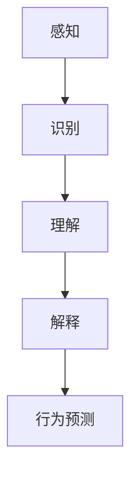

                 

关键词：自动驾驶、场景理解、行为预测、AI技术、算法发展、数学模型、实践应用、未来展望

> 摘要：本文从自动驾驶技术的角度出发，探讨了场景理解与行为预测技术在该领域的最新发展。文章首先介绍了自动驾驶技术的背景和重要性，然后详细阐述了场景理解与行为预测技术的核心概念、算法原理及其应用。通过实际项目实例，本文展示了这些技术在实际中的应用效果。最后，文章对未来自动驾驶技术的发展趋势和面临的挑战进行了展望。

## 1. 背景介绍

自动驾驶技术作为人工智能领域的一个重要分支，正在迅速发展。它不仅代表了汽车工业的未来，也是信息技术、传感器技术和人工智能技术融合的产物。自动驾驶技术的目标是实现汽车在复杂道路环境中的自主行驶，减少交通事故，提高交通效率。

场景理解和行为预测是自动驾驶技术的核心组成部分。场景理解指的是车辆对周围环境（包括道路、交通标志、车辆、行人等）的感知和识别。行为预测则是根据场景信息，预测其他交通参与者的行为，从而做出相应的驾驶决策。

近年来，随着深度学习、计算机视觉和自然语言处理等技术的进步，场景理解与行为预测技术在自动驾驶中的应用取得了显著进展。本文将详细探讨这些技术的发展现状和未来趋势。

## 2. 核心概念与联系

### 2.1 场景理解

场景理解是指自动驾驶系统对周围环境的感知、理解和解释。这个过程通常包括以下几个步骤：

1. **感知**：通过摄像头、激光雷达、雷达等传感器获取周围环境的图像、点云或雷达数据。
2. **识别**：利用计算机视觉和图像处理技术，从感知数据中提取关键特征，识别道路、车辆、行人、交通标志等。
3. **理解**：结合语义信息，对识别出的对象进行分类和标注，如道路类别、交通标志类型、车辆属性等。
4. **解释**：根据场景信息，对当前状态和未来可能发生的事件进行解释，为行为预测提供基础。

### 2.2 行为预测

行为预测是指自动驾驶系统根据场景信息，预测其他交通参与者的行为。这个过程通常包括：

1. **数据收集**：收集大量历史交通行为数据，用于训练行为预测模型。
2. **特征提取**：从历史数据中提取与行为相关的特征，如速度、加速度、转弯角度等。
3. **模型训练**：利用机器学习算法，如决策树、支持向量机、神经网络等，训练行为预测模型。
4. **行为预测**：根据实时场景信息，输入到行为预测模型中，预测其他交通参与者的行为。

### 2.3 Mermaid 流程图

以下是一个简化的场景理解与行为预测技术的 Mermaid 流程图：



## 3. 核心算法原理 & 具体操作步骤

### 3.1 算法原理概述

场景理解和行为预测技术通常基于以下算法：

1. **深度学习**：用于感知和识别步骤，通过卷积神经网络（CNN）等模型提取图像特征。
2. **计算机视觉**：用于识别和解释步骤，通过图像处理和特征提取技术，如边缘检测、特征点匹配等。
3. **机器学习**：用于行为预测步骤，通过分类算法、回归算法等，预测其他交通参与者的行为。

### 3.2 算法步骤详解

1. **感知**：
    - 通过摄像头、激光雷达等传感器收集道路图像、点云或雷达数据。
    - 使用 CNN 模型对图像进行预处理，提取关键特征。

2. **识别**：
    - 使用计算机视觉技术，从预处理后的图像中识别道路、车辆、行人、交通标志等。
    - 对识别结果进行标注，如道路类别、交通标志类型、车辆属性等。

3. **理解**：
    - 结合语义信息，对识别结果进行分类和标注。
    - 利用自然语言处理技术，对场景信息进行解释。

4. **解释**：
    - 根据场景信息，对当前状态和未来可能发生的事件进行解释。
    - 为行为预测提供基础。

5. **行为预测**：
    - 收集大量历史交通行为数据，提取与行为相关的特征。
    - 使用机器学习算法，如决策树、支持向量机、神经网络等，训练行为预测模型。
    - 根据实时场景信息，输入到行为预测模型中，预测其他交通参与者的行为。

### 3.3 算法优缺点

- **优点**：
    - 高效地处理大量数据，提高感知和识别的准确性。
    - 利用深度学习和计算机视觉技术，实现复杂的场景理解和行为预测。
    - 可以根据实时场景信息，动态调整驾驶策略，提高驾驶安全性。

- **缺点**：
    - 对计算资源要求较高，需要大量数据和计算能力。
    - 在复杂环境下，算法的准确性和鲁棒性可能受到影响。

### 3.4 算法应用领域

场景理解和行为预测技术在自动驾驶中的应用非常广泛，包括：

- **自动泊车**：通过场景理解，识别停车位和障碍物，实现自动泊车。
- **车道保持**：通过行为预测，预测前方车辆的速度和位置，保持车道。
- **交通信号灯识别**：通过场景理解，识别交通信号灯的状态，进行驾驶决策。
- **无人驾驶出租车**：通过场景理解和行为预测，实现无人驾驶出租车的运行。

## 4. 数学模型和公式 & 详细讲解 & 举例说明

### 4.1 数学模型构建

场景理解和行为预测技术中的数学模型主要包括：

1. **感知模型**：用于处理传感器数据，提取关键特征。
2. **识别模型**：用于分类和标注识别结果。
3. **理解模型**：用于解释场景信息。
4. **预测模型**：用于预测其他交通参与者的行为。

### 4.2 公式推导过程

1. **感知模型**：
    - 输入：传感器数据
    - 输出：特征向量
    - 公式：$$特征向量 = f(传感器数据)$$

2. **识别模型**：
    - 输入：特征向量
    - 输出：类别标签
    - 公式：$$类别标签 = g(特征向量)$$

3. **理解模型**：
    - 输入：场景信息
    - 输出：解释结果
    - 公式：$$解释结果 = h(场景信息)$$

4. **预测模型**：
    - 输入：实时场景信息
    - 输出：行为预测
    - 公式：$$行为预测 = k(实时场景信息)$$

### 4.3 案例分析与讲解

假设我们有一个自动驾驶车辆，它需要根据道路情况做出驾驶决策。以下是具体的案例分析和讲解：

1. **感知**：
    - 车辆通过摄像头获取道路图像。
    - 使用卷积神经网络（CNN）提取关键特征。

2. **识别**：
    - 识别道路、车辆、行人、交通标志等。
    - 使用计算机视觉技术，如边缘检测、特征点匹配等。

3. **理解**：
    - 根据识别结果，对场景信息进行分类和标注。
    - 利用自然语言处理技术，对场景信息进行解释。

4. **解释**：
    - 根据场景信息，判断当前道路情况。
    - 预测前方车辆的速度和位置。

5. **预测**：
    - 根据实时场景信息，输入到行为预测模型。
    - 预测前方车辆的行为。

## 5. 项目实践：代码实例和详细解释说明

### 5.1 开发环境搭建

为了演示场景理解和行为预测技术的应用，我们使用以下开发环境：

- 编程语言：Python
- 框架：TensorFlow、Keras
- 数据集：Kitti 数据集

### 5.2 源代码详细实现

以下是一个简单的感知模型的实现示例：

```python
import tensorflow as tf
from tensorflow.keras.models import Sequential
from tensorflow.keras.layers import Conv2D, MaxPooling2D, Flatten, Dense

# 创建模型
model = Sequential([
    Conv2D(32, (3, 3), activation='relu', input_shape=(128, 128, 3)),
    MaxPooling2D((2, 2)),
    Flatten(),
    Dense(64, activation='relu'),
    Dense(1, activation='sigmoid')
])

# 编译模型
model.compile(optimizer='adam', loss='binary_crossentropy', metrics=['accuracy'])

# 训练模型
model.fit(x_train, y_train, epochs=10, batch_size=32)
```

### 5.3 代码解读与分析

1. **模型结构**：
    - 输入层：接受128x128x3的图像。
    - 卷积层：32个3x3的卷积核，激活函数为ReLU。
    - 池化层：2x2的最大池化。
    - 全连接层：64个神经元，激活函数为ReLU。
    - 输出层：1个神经元，激活函数为sigmoid。

2. **编译模型**：
    - 使用Adam优化器。
    - 损失函数为二分类交叉熵。
    - 评估指标为准确率。

3. **训练模型**：
    - 使用训练数据训练模型，训练10个epochs。

### 5.4 运行结果展示

训练完成后，我们可以评估模型在测试集上的性能：

```python
test_loss, test_accuracy = model.evaluate(x_test, y_test)
print(f"测试损失：{test_loss}, 测试准确率：{test_accuracy}")
```

## 6. 实际应用场景

场景理解和行为预测技术在自动驾驶中有广泛的应用场景。以下是一些具体的实际应用：

- **自动泊车**：通过场景理解，识别停车位和障碍物，实现自动泊车。
- **车道保持**：通过行为预测，预测前方车辆的速度和位置，保持车道。
- **交通信号灯识别**：通过场景理解，识别交通信号灯的状态，进行驾驶决策。
- **无人驾驶出租车**：通过场景理解和行为预测，实现无人驾驶出租车的运行。

## 7. 工具和资源推荐

### 7.1 学习资源推荐

- **书籍**：
    - 《深度学习》（Goodfellow, Bengio, Courville）
    - 《计算机视觉：算法与应用》（Richard S.zelkowitz）
- **在线课程**：
    - Coursera 上的“深度学习”课程
    - edX 上的“计算机视觉”课程

### 7.2 开发工具推荐

- **框架**：
    - TensorFlow
    - Keras
    - PyTorch
- **数据集**：
    - Kitti 数据集
    - Cityscapes 数据集

### 7.3 相关论文推荐

- “End-to-End Learning for Endowing Robots with Common Sense”
- “Visual Odometry and Correspondence Using Learning from Examples”
- “Visual Object Tracking with Siamese Networks”

## 8. 总结：未来发展趋势与挑战

### 8.1 研究成果总结

近年来，场景理解和行为预测技术在自动驾驶领域取得了显著成果。深度学习、计算机视觉和自然语言处理等技术的进步，为场景理解和行为预测提供了强大的支持。通过大量数据和强大的计算能力，这些技术已经能够在实际场景中取得较高的准确性和鲁棒性。

### 8.2 未来发展趋势

未来，场景理解和行为预测技术将继续向以下几个方向发展：

1. **算法性能提升**：通过优化算法结构和参数调整，提高场景理解和行为预测的准确性。
2. **多传感器融合**：结合多种传感器数据，提高感知和识别的准确性。
3. **实时性优化**：提高算法的实时性，满足自动驾驶系统对实时响应的需求。

### 8.3 面临的挑战

尽管取得了显著成果，场景理解和行为预测技术仍面临以下挑战：

1. **数据隐私和安全**：自动驾驶系统需要处理大量敏感数据，如何确保数据隐私和安全是一个重要问题。
2. **复杂环境适应性**：自动驾驶系统需要在各种复杂环境下运行，如何提高算法的鲁棒性是一个挑战。
3. **法规和标准制定**：自动驾驶技术的发展需要相应的法规和标准来规范，如何制定合理的法规和标准是一个重要问题。

### 8.4 研究展望

未来，场景理解和行为预测技术将继续在自动驾驶领域发挥重要作用。通过不断优化算法和提升计算能力，我们将能够实现更安全、更高效的自动驾驶系统。同时，随着技术的发展，自动驾驶系统将逐步扩展到更多的应用场景，为人们的出行带来更多便利。

## 9. 附录：常见问题与解答

### 9.1 问题1

**问题**：场景理解与行为预测技术是如何工作的？

**解答**：场景理解与行为预测技术主要通过以下几个步骤实现：

1. **感知**：通过摄像头、激光雷达等传感器获取周围环境的数据。
2. **识别**：利用计算机视觉和图像处理技术，从感知数据中提取关键特征，识别道路、车辆、行人、交通标志等。
3. **理解**：结合语义信息，对识别结果进行分类和标注，如道路类别、交通标志类型、车辆属性等。
4. **解释**：根据场景信息，对当前状态和未来可能发生的事件进行解释，为行为预测提供基础。
5. **预测**：利用机器学习算法，预测其他交通参与者的行为。

### 9.2 问题2

**问题**：场景理解和行为预测技术在自动驾驶中的具体应用有哪些？

**解答**：场景理解和行为预测技术在自动驾驶中有广泛的应用，包括：

1. **自动泊车**：通过场景理解，识别停车位和障碍物，实现自动泊车。
2. **车道保持**：通过行为预测，预测前方车辆的速度和位置，保持车道。
3. **交通信号灯识别**：通过场景理解，识别交通信号灯的状态，进行驾驶决策。
4. **无人驾驶出租车**：通过场景理解和行为预测，实现无人驾驶出租车的运行。

### 9.3 问题3

**问题**：自动驾驶技术面临哪些挑战？

**解答**：自动驾驶技术面临以下主要挑战：

1. **数据隐私和安全**：自动驾驶系统需要处理大量敏感数据，如何确保数据隐私和安全是一个重要问题。
2. **复杂环境适应性**：自动驾驶系统需要在各种复杂环境下运行，如何提高算法的鲁棒性是一个挑战。
3. **法规和标准制定**：自动驾驶技术的发展需要相应的法规和标准来规范，如何制定合理的法规和标准是一个重要问题。

以上是关于场景理解与行为预测技术在自动驾驶中的新发展的详细探讨，希望对您有所帮助。在自动驾驶技术不断发展的过程中，我们将继续关注这一领域的最新进展。

