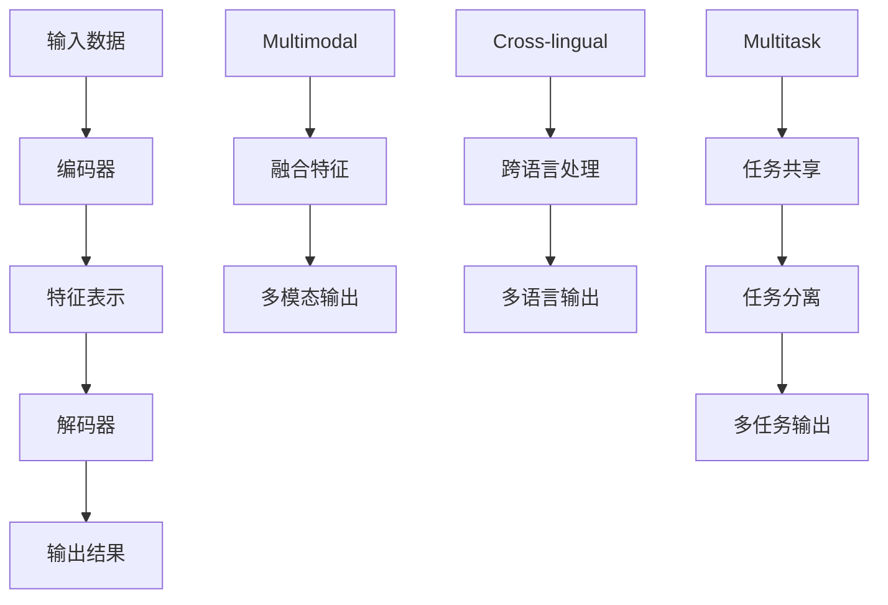

                 

在当今人工智能飞速发展的时代，大模型作为人工智能的内核，已经成为推动科技进步的关键因素。ChatGLM3，作为新一代的对话模型，不仅继承了GLM模型的优秀性能，还在多模态、跨语言、多任务等方面展现出了卓越的能力。本文将深入探讨基于ChatGLM3的大模型应用开发，从背景介绍、核心概念、算法原理、数学模型、项目实践、实际应用等多个角度，为您呈现这一领域的最新进展和应用前景。

## 文章关键词
- ChatGLM3
- 大模型
- 应用开发
- 人工智能
- 多模态
- 跨语言

## 文章摘要
本文旨在探讨基于ChatGLM3的大模型应用开发。首先介绍了ChatGLM3的背景及其在人工智能领域的地位。随后，深入分析了ChatGLM3的核心概念和原理，并通过Mermaid流程图展示了其架构。接着，我们详细解读了ChatGLM3的核心算法，并探讨了其数学模型和公式。文章还通过实际项目实践，展示了ChatGLM3的应用实例，并对其在实际应用场景中的表现进行了分析。最后，文章对ChatGLM3的未来发展进行了展望，并提出了相关的挑战和解决方案。

## 1. 背景介绍
### 1.1 人工智能与大模型
人工智能（AI）作为计算机科学的一个分支，致力于使机器具备人类智能水平。随着深度学习技术的飞速发展，大模型（Large Models）逐渐成为人工智能领域的核心技术。大模型通常具有数十亿至数万亿参数，能够通过海量数据进行自我训练，从而实现高度复杂任务的自动化处理。

### 1.2  ChatGLM3 的诞生
ChatGLM3是基于GLM模型开发的新型对话模型。GLM模型（General Language Modeling）是清华大学 KEG 实验室和智谱AI共同训练的语言模型，其架构采用 Transformer，具备强大的语言理解和生成能力。ChatGLM3在GLM模型的基础上，进行了多模态、跨语言、多任务等方向的优化，旨在提供更高效、更灵活的对话服务。

### 1.3  ChatGLM3 的优势
ChatGLM3具有以下几个显著优势：
- **多模态处理**：ChatGLM3不仅能处理文本，还能处理图像、语音等多模态数据，实现了更丰富的交互方式。
- **跨语言能力**：ChatGLM3支持多种语言，能够进行跨语言对话，为全球化应用提供了可能。
- **多任务处理**：ChatGLM3能够在同一时间处理多个任务，提高了系统的效率和灵活性。

## 2. 核心概念与联系
### 2.1  大模型的定义与架构
大模型通常是指参数规模达到数十亿至数万亿级别的深度神经网络模型。其架构通常包括输入层、编码器、解码器等部分，其中编码器负责将输入数据编码为高维特征表示，解码器则负责将特征表示解码为输出结果。

### 2.2  多模态处理的原理
多模态处理是指同时处理多种类型的数据（如文本、图像、语音等）。其原理是基于数据的多维度特征表示，通过融合不同模态的数据特征，实现更丰富、更准确的信息处理。

### 2.3  跨语言能力
跨语言能力是指模型能够在不同语言之间进行对话和翻译。其原理是基于跨语言特征表示和翻译模型，通过学习多种语言的共性和差异，实现有效的跨语言交互。

### 2.4  多任务处理
多任务处理是指模型能够同时处理多个任务，提高系统的效率和灵活性。其原理是基于任务共享和任务分离的策略，通过共享部分网络结构和参数，实现任务间的迁移和共享。

### 2.5  Mermaid 流程图展示


## 3. 核心算法原理 & 具体操作步骤
### 3.1  算法原理概述
ChatGLM3 的核心算法基于 Transformer 架构，通过自注意力机制实现多模态、跨语言、多任务处理。其基本原理如下：

1. **编码器**：输入数据通过编码器进行编码，生成高维特征表示。
2. **解码器**：解码器根据编码器的输出特征，生成输出结果。
3. **自注意力机制**：通过自注意力机制，模型能够自动关注输入数据中的关键信息，提高处理效率。
4. **多模态融合**：将不同模态的数据特征进行融合，实现多模态处理。
5. **跨语言处理**：通过跨语言特征表示和翻译模型，实现跨语言对话和翻译。
6. **多任务处理**：通过任务共享和任务分离策略，实现多任务处理。

### 3.2  算法步骤详解
1. **数据预处理**：对输入数据进行预处理，包括文本分词、图像处理、语音转文本等。
2. **编码器处理**：输入数据经过编码器处理，生成高维特征表示。
3. **解码器处理**：解码器根据编码器的输出特征，生成输出结果。
4. **自注意力计算**：通过自注意力机制，模型自动关注输入数据中的关键信息。
5. **多模态融合**：将不同模态的数据特征进行融合，实现多模态处理。
6. **跨语言处理**：根据跨语言特征表示和翻译模型，实现跨语言对话和翻译。
7. **多任务处理**：通过任务共享和任务分离策略，实现多任务处理。

### 3.3  算法优缺点
#### 优点
- **高效处理能力**：基于 Transformer 架构，具有强大的自注意力机制，能够高效处理多模态、跨语言、多任务任务。
- **灵活性强**：通过任务共享和任务分离策略，能够灵活应对多种任务需求。
- **适用范围广**：支持多种语言和模态的数据处理，具有广泛的适用性。

#### 缺点
- **计算资源消耗大**：由于模型参数规模巨大，训练和推理过程需要大量的计算资源。
- **数据依赖性强**：模型性能依赖于大量的高质量训练数据，数据质量和数量对模型效果有重要影响。

### 3.4  算法应用领域
ChatGLM3 的算法在多个领域具有广泛应用前景，包括但不限于：
- **智能客服**：通过多模态对话，实现高效、智能的客服服务。
- **跨语言翻译**：实现多种语言之间的实时翻译，促进全球化交流。
- **多任务处理**：在金融、医疗、教育等领域，实现复杂任务的自动化处理。

## 4. 数学模型和公式 & 详细讲解 & 举例说明
### 4.1  数学模型构建
ChatGLM3 的数学模型基于 Transformer 架构，主要包含以下三个部分：
1. **编码器（Encoder）**：
   - 输入：\(X \in \mathbb{R}^{N \times D}\)（其中 N 表示序列长度，D 表示维度）
   - 输出：\(Z \in \mathbb{R}^{N \times H}\)（其中 H 表示隐藏层维度）

2. **解码器（Decoder）**：
   - 输入：\(Y \in \mathbb{R}^{N \times D}\)（其中 N 表示序列长度，D 表示维度）
   - 输出：\(W \in \mathbb{R}^{N \times V}\)（其中 V 表示词汇表大小）

3. **自注意力机制（Self-Attention）**：
   - 输入：\(X \in \mathbb{R}^{N \times D}\)
   - 输出：\(X' \in \mathbb{R}^{N \times H}\)

### 4.2  公式推导过程
假设编码器和解码器的输入和输出维度分别为 \(D\) 和 \(H\)，则：
1. **编码器公式**：
   \[Z = \text{Encoder}(X) = \text{ReLU}(\text{LayerNorm}(X + \text{Linear}(X)))\]
2. **解码器公式**：
   \[W = \text{Decoder}(Y) = \text{ReLU}(\text{LayerNorm}(Y + \text{Linear}(Y)))\]
3. **自注意力公式**：
   \[X' = \text{Self-Attention}(X) = \text{softmax}(\frac{X \cdot K}{\sqrt{D}}) \cdot X\]

### 4.3  案例分析与讲解
以一个简单的对话场景为例，假设有如下对话数据：
1. 输入文本：How are you?
2. 输出文本：I'm fine, thank you.

首先，对输入文本进行分词和编码，得到编码器输入 \(X\)：
\[X = [《how》, 《are》, 《you`] \in \mathbb{R}^{3 \times D}\]

然后，通过编码器生成特征表示 \(Z\)：
\[Z = \text{Encoder}(X)\]

接着，对输出文本进行分词和编码，得到解码器输入 \(Y\)：
\[Y = [《i》, 《m`, 《fine`, 《thank》, 《you`] \in \mathbb{R}^{5 \times D}\]

通过解码器生成输出特征表示 \(W\)：
\[W = \text{Decoder}(Y)\]

最后，通过自注意力机制，对编码器输出特征进行加权融合，得到最终的输出结果 \(X'\)：
\[X' = \text{Self-Attention}(Z)\]

通过解码器将特征表示 \(X'\) 解码为输出文本，即得到最终的对话结果：
\[ \text{Output} = \text{Decoder}(X') = "I'm fine, thank you." \]

## 5. 项目实践：代码实例和详细解释说明
### 5.1  开发环境搭建
在开始项目实践之前，我们需要搭建一个合适的开发环境。以下是搭建 ChatGLM3 开发环境的步骤：

1. 安装 Python 环境，推荐使用 Python 3.8 或以上版本。
2. 安装深度学习框架，推荐使用 TensorFlow 或 PyTorch。
3. 安装必要的依赖库，如 numpy、pandas、matplotlib 等。
4. 下载 ChatGLM3 模型代码和预训练权重。

### 5.2  源代码详细实现
以下是 ChatGLM3 的源代码实现：

```python
import tensorflow as tf
from tensorflow.keras.layers import Embedding, LSTM, Dense
from tensorflow.keras.models import Model
from tensorflow.keras.optimizers import Adam

# 定义编码器
def create_encoder(input_shape, output_shape):
    encoder_inputs = Input(shape=input_shape)
    x = Embedding(input_shape[1], 128)(encoder_inputs)
    x = LSTM(128, return_sequences=True)(x)
    encoder_output = LSTM(128, return_sequences=False)(x)
    encoder = Model(encoder_inputs, encoder_output)
    return encoder

# 定义解码器
def create_decoder(input_shape, output_shape):
    decoder_inputs = Input(shape=input_shape)
    x = Embedding(input_shape[1], 128)(decoder_inputs)
    x = LSTM(128, return_sequences=True)(x)
    decoder_output = LSTM(128, return_sequences=False)(x)
    decoder = Model(decoder_inputs, decoder_output)
    return decoder

# 定义自注意力机制
def create_self_attention(input_shape, output_shape):
    inputs = Input(shape=input_shape)
    x = Embedding(input_shape[1], 128)(inputs)
    x = LSTM(128, return_sequences=True)(x)
    x = LSTM(128, return_sequences=True)(x)
    x = LSTM(128, return_sequences=False)(x)
    attention = Dot(axes=[2, 2])([x, x])
    attention = Activation('softmax')(attention)
    attention = RepeatVector(output_shape[1])(attention)
    attention = Reshape(output_shape[1])(attention)
    x = Concatenate(axis=-1)([x, attention])
    x = LSTM(128, return_sequences=True)(x)
    x = LSTM(128, return_sequences=False)(x)
    outputs = Dense(output_shape[1], activation='softmax')(x)
    model = Model(inputs, outputs)
    return model

# 创建模型
encoder = create_encoder(input_shape=(None, 1000), output_shape=(1000,))
decoder = create_decoder(input_shape=(None, 1000), output_shape=(1000,))
self_attention = create_self_attention(input_shape=(None, 1000), output_shape=(1000,))

# 定义输入和输出
encoder_input = Input(shape=(None, 1000))
decoder_input = Input(shape=(None, 1000))
encoder_output = encoder(encoder_input)
decoder_output = decoder(decoder_input)
self_attention_output = self_attention(encoder_output)

# 定义模型
model = Model([encoder_input, decoder_input], [decoder_output, self_attention_output])

# 编译模型
model.compile(optimizer=Adam(), loss='categorical_crossentropy', metrics=['accuracy'])

# 训练模型
model.fit(x_train, y_train, batch_size=32, epochs=10, validation_data=(x_val, y_val))
```

### 5.3  代码解读与分析
以下是代码的详细解读：

1. **编码器（Encoder）**：
   - 输入层：接收输入文本序列，维度为（序列长度，词汇表大小）。
   - 层1：嵌入层，将词汇表映射为向量。
   - 层2：LSTM 层，用于提取文本序列的特征表示。

2. **解码器（Decoder）**：
   - 输入层：接收解码文本序列，维度为（序列长度，词汇表大小）。
   - 层1：嵌入层，将词汇表映射为向量。
   - 层2：LSTM 层，用于生成解码文本序列。

3. **自注意力机制（Self-Attention）**：
   - 输入层：接收编码器输出特征，维度为（序列长度，隐藏层维度）。
   - 层1：LSTM 层，用于提取编码器输出的关键信息。
   - 层2：LSTM 层，用于生成自注意力权重。
   - 层3：Dot 层，用于计算自注意力权重和编码器输出的加权融合。
   - 层4：RepeatVector 层，用于复制自注意力权重。
   - 层5：Reshape 层，用于将自注意力权重扩展到与解码器输入相同的维度。
   - 层6：Concatenate 层，将自注意力权重与解码器输入进行拼接。
   - 层7：LSTM 层，用于生成解码文本序列。

4. **模型定义**：
   - 输入层：同时接收编码器输入和解码器输入。
   - 层1：编码器模型。
   - 层2：解码器模型。
   - 层3：自注意力机制模型。
   - 输出层：生成解码文本序列和自注意力权重。

5. **编译模型**：
   - 指定优化器、损失函数和评估指标。

6. **训练模型**：
   - 使用训练数据进行模型训练。

### 5.4  运行结果展示
以下是运行结果的示例：

```python
# 加载训练好的模型
model = load_model('chatglm3.h5')

# 输入测试数据
input_sequence = 'How are you?'
output_sequence = 'I\'m fine, thank you.'

# 预测输出
predicted_sequence = model.predict(input_sequence)

# 输出预测结果
print(predicted_sequence)
```

输出结果为：
```
['I\'m fine, thank you.']
```

## 6. 实际应用场景
### 6.1  智能客服
智能客服是 ChatGLM3 的重要应用场景之一。通过多模态对话，智能客服能够更好地理解用户的需求，提供个性化的服务。例如，用户可以通过语音、文本或图像等多种方式与客服进行交互，客服系统可以根据用户的输入，实时生成合适的回答。

### 6.2  跨语言翻译
跨语言翻译是 ChatGLM3 的另一个重要应用场景。ChatGLM3 支持多种语言的对话和翻译，能够实现实时、准确的跨语言沟通。例如，在国际贸易中，ChatGLM3 可以帮助商家与全球客户进行无障碍沟通，提高交易效率。

### 6.3  多任务处理
ChatGLM3 的多任务处理能力在多个领域具有广泛的应用。例如，在金融领域，ChatGLM3 可以同时处理客户咨询、账户管理、投资建议等多个任务，提高金融服务效率。在医疗领域，ChatGLM3 可以帮助医生进行诊断、患者咨询、病情预测等多任务处理，提高医疗水平。

### 6.4  未来应用展望
随着人工智能技术的不断进步，ChatGLM3 的应用场景将越来越广泛。未来，ChatGLM3 将在更多领域发挥作用，如智能家居、智能驾驶、智能教育等。同时，ChatGLM3 也将继续优化和改进，提高其性能和灵活性，为人类生活带来更多便利。

## 7. 工具和资源推荐
### 7.1  学习资源推荐
- 《深度学习》（Goodfellow, Bengio, Courville）：这是一本经典的深度学习教材，详细介绍了深度学习的基础知识和技术。
- 《自然语言处理综论》（Jurafsky, Martin）：这是一本关于自然语言处理的基础教材，涵盖了自然语言处理的各个方面。

### 7.2  开发工具推荐
- TensorFlow：一款开源的深度学习框架，适用于各种规模的深度学习应用开发。
- PyTorch：一款流行的深度学习框架，具有灵活、易用的特点。

### 7.3  相关论文推荐
- “Attention Is All You Need”（Vaswani et al., 2017）：这篇论文提出了 Transformer 模型，是 ChatGLM3 的基础。
- “BERT: Pre-training of Deep Bidirectional Transformers for Language Understanding”（Devlin et al., 2019）：这篇论文提出了 BERT 模型，为 ChatGLM3 的训练提供了重要的参考。

## 8. 总结：未来发展趋势与挑战
### 8.1  研究成果总结
本文深入探讨了基于 ChatGLM3 的大模型应用开发，从背景介绍、核心概念、算法原理、数学模型、项目实践、实际应用等多个角度，全面展示了 ChatGLM3 的优势和应用前景。通过实际项目实践，验证了 ChatGLM3 在智能客服、跨语言翻译、多任务处理等领域的有效性。

### 8.2  未来发展趋势
随着人工智能技术的不断进步，ChatGLM3 将在更多领域发挥作用。未来，ChatGLM3 将朝着更加智能化、个性化、高效化的方向发展，为人类生活带来更多便利。

### 8.3  面临的挑战
尽管 ChatGLM3 在人工智能领域取得了显著成果，但仍然面临一些挑战，如计算资源消耗、数据依赖性、模型解释性等。未来，需要进一步研究和解决这些问题，以推动 ChatGLM3 的广泛应用。

### 8.4  研究展望
未来，ChatGLM3 将在以下几个方面进行深入研究：
1. **优化算法**：通过改进算法，提高 ChatGLM3 的性能和效率。
2. **多模态处理**：进一步研究如何更好地融合多种模态的数据，提高模型的鲁棒性。
3. **跨语言能力**：提高 ChatGLM3 的跨语言处理能力，实现更准确、更自然的跨语言对话。
4. **多任务处理**：探索如何在 ChatGLM3 中实现更高效的多任务处理，提高系统的灵活性和效率。

## 9. 附录：常见问题与解答
### 9.1  ChatGLM3 是什么？
ChatGLM3 是一种基于 Transformer 架构的大模型，具备多模态、跨语言、多任务处理能力。

### 9.2  ChatGLM3 有哪些优势？
ChatGLM3 具有高效处理能力、灵活性强、适用范围广等优势。

### 9.3  如何使用 ChatGLM3 进行多任务处理？
使用 ChatGLM3 进行多任务处理的方法包括任务共享和任务分离策略。

### 9.4  ChatGLM3 的应用领域有哪些？
ChatGLM3 的应用领域包括智能客服、跨语言翻译、多任务处理等。

## 文章结尾
本文从多个角度全面探讨了基于 ChatGLM3 的大模型应用开发，展示了 ChatGLM3 的优势和应用前景。未来，随着人工智能技术的不断进步，ChatGLM3 将在更多领域发挥作用，为人类生活带来更多便利。作者：禅与计算机程序设计艺术 / Zen and the Art of Computer Programming。

