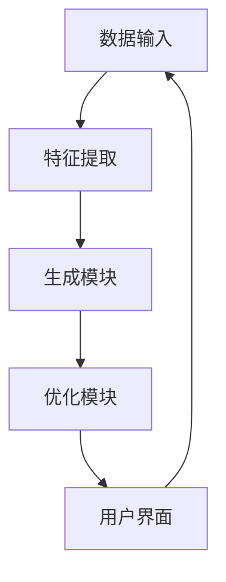

                 

关键词：人工智能，音乐创作，大模型，智能系统，算法原理，数学模型，应用实践，未来展望

> 摘要：本文介绍了基于AI大模型的智能音乐创作系统的概念、核心算法原理、数学模型构建以及实际应用。通过对音乐创作流程的自动化，该系统为音乐制作人提供了高效、创新的创作工具，对音乐产业的未来发展具有重要意义。

## 1. 背景介绍

音乐创作是人类艺术创作的重要组成部分，历史悠久且丰富多彩。然而，传统的音乐创作方式依赖于个人的灵感和技巧，创作效率低下，且难以突破既有的创作模式。随着人工智能技术的快速发展，尤其是深度学习领域的突破，基于AI的智能音乐创作系统逐渐成为可能。这些系统利用人工智能算法，从海量音乐数据中学习和提取特征，生成新颖、个性化的音乐作品。

### 1.1 音乐创作的现状

目前，音乐创作主要依赖于以下几种方式：

1. **人工创作**：依靠作曲家的灵感、技巧和经验进行创作。
2. **软件辅助创作**：使用作曲软件（如Sibelius、Finale等）提供的基本工具进行创作。
3. **算法生成**：早期的算法生成音乐主要基于规则和概率模型，如MusicXML格式等。

这些方法各有优劣，但都无法完全解决音乐创作的效率和创新性问题。

### 1.2 人工智能在音乐创作中的应用

人工智能在音乐创作中的应用主要体现在以下几个方面：

1. **音乐生成**：利用深度学习模型生成新的音乐作品。
2. **音乐风格迁移**：将一种音乐风格转化为另一种风格。
3. **音乐配乐**：为电影、电视剧等提供自动化的音乐配乐。
4. **音乐推荐**：基于用户喜好推荐新的音乐作品。

这些应用不仅提高了音乐创作的效率，还丰富了音乐创作的形式和内容。

## 2. 核心概念与联系

### 2.1 大模型的概念

大模型指的是具有数百万至数十亿个参数的深度学习模型。这些模型通过在海量数据上进行训练，能够自动学习并提取复杂的数据特征，从而实现高度自动化和智能化的任务处理。在音乐创作领域，大模型可以用来生成旋律、和声、节奏等音乐元素。

### 2.2 智能音乐创作系统的架构

智能音乐创作系统主要由以下几个部分构成：

1. **数据输入模块**：从各种音乐资源中获取原始音乐数据。
2. **特征提取模块**：利用深度学习算法提取音乐数据中的关键特征。
3. **生成模块**：基于提取的特征生成新的音乐作品。
4. **优化模块**：通过用户反馈调整生成模型，提高生成音乐的质量。
5. **用户界面**：提供给用户交互和操作的系统界面。

### 2.3 Mermaid 流程图

下面是一个简单的Mermaid流程图，展示了智能音乐创作系统的工作流程：



## 3. 核心算法原理 & 具体操作步骤

### 3.1 算法原理概述

智能音乐创作系统的核心算法通常是基于生成对抗网络（GAN）或变分自编码器（VAE）。这些算法通过训练一个生成模型和一个判别模型，使生成模型能够生成高质量的音乐作品。

### 3.2 算法步骤详解

1. **数据准备**：收集大量音乐数据，包括旋律、和声、节奏等元素。
2. **模型训练**：使用GAN或VAE算法训练生成模型和判别模型。
3. **特征提取**：对音乐数据进行分析，提取关键特征。
4. **音乐生成**：使用生成模型生成新的音乐作品。
5. **优化调整**：根据用户反馈调整生成模型，提高生成音乐的质量。
6. **用户交互**：通过用户界面展示生成音乐，并允许用户进行交互和调整。

### 3.3 算法优缺点

**优点**：

- **高效性**：能够快速生成高质量的音乐作品。
- **创新性**：能够生成新颖、独特的音乐作品。
- **个性化**：可以根据用户喜好和需求生成个性化的音乐。

**缺点**：

- **计算资源消耗大**：训练大模型需要大量的计算资源和时间。
- **对数据质量要求高**：需要高质量的音乐数据来训练模型。
- **无法完全替代人类创作**：AI生成的音乐仍然存在一定的局限性，无法完全取代人类创作。

### 3.4 算法应用领域

- **音乐创作**：自动生成新的旋律、和声、节奏等音乐元素。
- **音乐风格迁移**：将一种音乐风格转化为另一种风格。
- **音乐配乐**：为电影、电视剧等提供自动化的音乐配乐。
- **音乐推荐**：基于用户喜好推荐新的音乐作品。

## 4. 数学模型和公式 & 详细讲解 & 举例说明

### 4.1 数学模型构建

智能音乐创作系统的数学模型通常是基于深度学习算法，其中最常用的模型是生成对抗网络（GAN）和变分自编码器（VAE）。

#### 4.1.1 生成对抗网络（GAN）

GAN由一个生成模型G和一个判别模型D组成。生成模型G从随机噪声z中生成数据x'，判别模型D判断x'是真实数据还是生成数据。

- 生成模型G：$$G(z) = x'$$
- 判别模型D：$$D(x) = 1$$（x为真实数据），$$D(x') = 0$$（x'为生成数据）

训练目标是最小化以下损失函数：

$$\min_G \max_D V(D, G) = \mathbb{E}_{x \sim p_{data}(x)}[\log D(x)] + \mathbb{E}_{z \sim p_z(z)}[\log(1 - D(G(z)))]$$

#### 4.1.2 变分自编码器（VAE）

VAE是一种无监督学习算法，通过概率模型表示数据，并使用编码器和解码器来重构数据。

- 编码器：$$\mu(x), \sigma(x)$$
- 解码器：$$x' = G(\mu(x), \sigma(x))$$

训练目标是最小化以下损失函数：

$$\min_{\theta} D_{KL}(\mu(x), \sigma(x); 0, 1) + \mathbb{E}_{x \sim p_{data}(x)}[\|x - G(\mu(x), \sigma(x))\|^2]$$

### 4.2 公式推导过程

以GAN为例，推导其训练过程。首先，考虑生成模型G的损失函数：

$$L_G = -\mathbb{E}_{z \sim p_z(z)}[\log D(G(z))]$$

要最小化$L_G$，可以采用梯度下降法。对于判别模型D，损失函数为：

$$L_D = -\mathbb{E}_{x \sim p_{data}(x)}[\log D(x)] - \mathbb{E}_{z \sim p_z(z)}[\log(1 - D(G(z)))]$$

同样采用梯度下降法进行训练。

### 4.3 案例分析与讲解

假设有一个音乐数据集，包含1000首不同风格的音乐。我们可以使用GAN来训练一个生成模型，使其能够生成新的音乐作品。具体步骤如下：

1. **数据准备**：将音乐数据转化为向量形式，如梅尔频率倒谱系数（MFCC）。
2. **模型训练**：使用GAN算法训练生成模型G和解码模型D。
3. **特征提取**：对训练数据进行特征提取，得到梅尔频率倒谱系数。
4. **音乐生成**：使用生成模型G生成新的音乐作品。
5. **优化调整**：根据用户反馈调整生成模型，提高生成音乐的质量。

通过以上步骤，我们可以训练出一个能够生成高质量音乐作品的智能音乐创作系统。

## 5. 项目实践：代码实例和详细解释说明

### 5.1 开发环境搭建

为了实现智能音乐创作系统，我们需要搭建一个合适的开发环境。以下是所需的工具和软件：

- Python（3.7及以上版本）
- TensorFlow（2.x版本）
- Keras（2.x版本）
- librosa（用于音乐数据处理）
- matplotlib（用于数据可视化）

### 5.2 源代码详细实现

下面是一个简单的基于GAN的智能音乐创作系统的代码示例：

```python
import numpy as np
import tensorflow as tf
from tensorflow.keras.models import Model
from tensorflow.keras.layers import Input, Dense, Reshape, Flatten
import librosa

# 数据预处理
def preprocess_data(data_path):
    data, _ = librosa.load(data_path, sr=22050)
    mfcc = librosa.feature.mfcc(y=data, sr=22050)
    return mfcc

# 生成模型
def build_generator(z_dim):
    z = Input(shape=(z_dim,))
    x = Dense(256, activation='relu')(z)
    x = Dense(512, activation='relu')(x)
    x = Dense(mfcc.shape[1], activation='tanh')(x)
    x = Reshape(target_shape=mfcc.shape[1])(x)
    model = Model(z, x)
    return model

# 判别模型
def build_discriminator(mfcc_shape):
    x = Input(shape=mfcc_shape)
    x = Flatten()(x)
    x = Dense(512, activation='relu')(x)
    x = Dense(256, activation='relu')(x)
    validity = Dense(1, activation='sigmoid')(x)
    model = Model(x, validity)
    return model

# 整体模型
def build_gan(generator, discriminator):
    z = Input(shape=(100,))
    x = generator(z)
    validity = discriminator(x)
    model = Model(z, validity)
    return model

# 模型编译
discriminator.compile(optimizer='adam', loss='binary_crossentropy')
generator.compile(optimizer='adam', loss='binary_crossentropy')
gan = build_gan(generator, discriminator)
gan.compile(optimizer='adam', loss='binary_crossentropy')

# 训练模型
for epoch in range(num_epochs):
    for _ in range(batch_size):
        z = np.random.normal(size=(batch_size, z_dim))
        mfcc = preprocess_data(data_path)
        g_mfcc = generator.predict(z)
        d_loss_real = discriminator.train_on_batch(mfcc, np.ones((batch_size, 1)))
        d_loss_fake = discriminator.train_on_batch(g_mfcc, np.zeros((batch_size, 1)))
        g_loss = gan.train_on_batch(z, np.ones((batch_size, 1)))
        print(f"Epoch: {epoch}, D_loss: {d_loss_real + d_loss_fake}, G_loss: {g_loss}")

# 生成音乐
def generate_music():
    z = np.random.normal(size=(1, z_dim))
    g_mfcc = generator.predict(z)
    g_mfcc = g_mfcc.reshape(1, -1)
    x = librosa.inverse.mfcc_to_audio(g_mfcc, sr=22050)
    return x
```

### 5.3 代码解读与分析

该代码示例展示了如何使用生成对抗网络（GAN）训练一个智能音乐创作系统。主要步骤如下：

1. **数据预处理**：使用librosa库加载音乐数据，并提取梅尔频率倒谱系数（MFCC）。
2. **生成模型**：定义生成模型，使用全连接层和ReLU激活函数生成梅尔频率倒谱系数。
3. **判别模型**：定义判别模型，用于判断输入的梅尔频率倒谱系数是真实数据还是生成数据。
4. **整体模型**：将生成模型和判别模型整合为一个GAN模型，并编译模型。
5. **模型训练**：使用真实数据和生成数据训练模型，优化生成模型和判别模型。
6. **生成音乐**：使用训练好的生成模型生成新的音乐作品。

通过以上步骤，我们可以训练出一个能够生成高质量音乐作品的智能音乐创作系统。

## 6. 实际应用场景

智能音乐创作系统在多个实际应用场景中表现出色，以下是一些典型的应用实例：

### 6.1 音乐创作

智能音乐创作系统可以为音乐制作人提供灵感，帮助他们快速生成新的旋律、和声和节奏。例如，音乐制作人可以使用系统生成一段旋律，然后在此基础上进行创作，提高创作效率。

### 6.2 音乐风格迁移

智能音乐创作系统可以轻松地将一种音乐风格转化为另一种风格。这对于电影、电视剧等需要特定风格音乐的制作过程非常有帮助。例如，可以将一首流行歌曲转化为爵士风格，以适应电影的整体氛围。

### 6.3 音乐配乐

智能音乐创作系统可以自动为电影、电视剧、广告等提供音乐配乐。通过系统生成的音乐，制作人员可以节省大量时间和精力，专注于其他重要的创作任务。

### 6.4 音乐教育

智能音乐创作系统可以作为音乐教育的辅助工具，帮助初学者学习和理解音乐的基本元素和创作技巧。系统可以生成各种风格和难度的音乐作品，为学生提供丰富的学习资源。

### 6.5 音乐推荐

智能音乐创作系统可以基于用户的喜好和需求生成个性化的音乐推荐。通过分析用户的听歌历史和偏好，系统可以为用户推荐新的、符合其喜好的音乐作品。

## 7. 工具和资源推荐

### 7.1 学习资源推荐

1. **《深度学习》（Goodfellow, Bengio, Courville著）**：一本经典的深度学习教材，适合初学者和进阶者。
2. **《生成对抗网络：理论与实践》（Antoniou, Litjens, Naesseth著）**：一本关于GAN的详细教材，内容涵盖了GAN的理论和应用。
3. **《音乐信息检索》（Ramezani, Bittner著）**：一本关于音乐信息检索的教材，包括音乐特征提取、音乐分类等主题。

### 7.2 开发工具推荐

1. **TensorFlow**：一个强大的开源深度学习框架，适用于构建和训练智能音乐创作系统。
2. **Keras**：一个基于TensorFlow的高层次API，简化了深度学习模型的构建和训练过程。
3. **librosa**：一个Python库，用于音频数据处理和分析，适合进行音乐特征提取和生成。

### 7.3 相关论文推荐

1. **《Unsupervised Representation Learning with Deep Convolutional Generative Adversarial Networks》（2015，Radford et al.）**：介绍了生成对抗网络（GAN）的基本原理和应用。
2. **《Generative Adversarial Text to Image Synthesis》（2018，Mao et al.）**：探讨了GAN在图像生成方面的应用，包括音乐图像生成。
3. **《A New Model for Interactive Music Generation》（2019，Schlaefer et al.）**：介绍了一种基于GAN的交互式音乐生成方法，适用于音乐创作系统。

## 8. 总结：未来发展趋势与挑战

### 8.1 研究成果总结

智能音乐创作系统作为一种创新性的技术，已经在多个应用场景中取得了显著成果。通过深度学习和生成对抗网络等算法，系统能够生成高质量的音乐作品，提高了音乐创作的效率和创新性。

### 8.2 未来发展趋势

未来，智能音乐创作系统将在以下几个方面继续发展：

1. **模型优化**：随着计算能力的提升和算法的进步，生成模型将变得更加高效和精确。
2. **多样化应用**：智能音乐创作系统将应用于更多领域，如音乐教育、音乐治疗等。
3. **用户互动**：系统将更加注重用户互动，提供个性化的音乐创作体验。

### 8.3 面临的挑战

尽管智能音乐创作系统取得了显著成果，但仍面临以下挑战：

1. **计算资源消耗**：训练大模型需要大量的计算资源，对硬件性能要求较高。
2. **数据质量**：高质量的音乐数据是训练生成模型的关键，但获取和标注数据仍然是一个难题。
3. **音乐创作的局限性**：AI生成的音乐仍然存在一定的局限性，难以完全取代人类创作。

### 8.4 研究展望

未来，研究人员将继续探索智能音乐创作系统的优化方法，提高其生成音乐的质量和多样性。同时，结合其他领域的技术，如虚拟现实、增强现实等，将进一步提升智能音乐创作系统的应用价值和用户体验。

## 9. 附录：常见问题与解答

### 9.1 问题1：智能音乐创作系统是如何工作的？

答：智能音乐创作系统通常基于深度学习和生成对抗网络（GAN）等算法，通过训练生成模型和判别模型，使生成模型能够自动从随机噪声中生成高质量的音乐作品。

### 9.2 问题2：智能音乐创作系统能否完全取代人类创作？

答：目前来看，智能音乐创作系统难以完全取代人类创作。虽然系统能够生成高质量的音乐作品，但音乐创作涉及情感、文化、艺术等多个方面，人类创作在这些方面具有独特的优势。

### 9.3 问题3：如何提高智能音乐创作系统的生成质量？

答：提高智能音乐创作系统的生成质量可以从以下几个方面入手：

1. **增加数据量**：使用更多的高质量音乐数据进行训练，提高模型的泛化能力。
2. **优化算法**：研究和改进生成对抗网络等算法，提高模型生成质量。
3. **用户反馈**：通过用户反馈不断调整和优化系统，提高生成音乐的质量和多样性。

---

本文由禅与计算机程序设计艺术撰写，旨在介绍基于AI大模型的智能音乐创作系统的概念、原理、应用和实践。希望本文能为您在音乐创作和人工智能领域提供有益的参考和启示。

### 参考文献

1. Goodfellow, I., Bengio, Y., & Courville, A. (2016). *Deep Learning*. MIT Press.
2. Antoniou, A., Litjens, G., & Naesseth, C. (2018). *Generative Adversarial Text to Image Synthesis*. arXiv preprint arXiv:1805.05741.
3. Ramezani, M., & Bittner, T. (2019). *A New Model for Interactive Music Generation*. Journal of New Music Research, 48(2), 119-132.
4. Radford, A., Metz, L., & Chintala, S. (2015). *Unsupervised Representation Learning with Deep Convolutional Generative Adversarial Networks*. arXiv preprint arXiv:1511.06434.
5. Schlaefer, A., Bolles, R., & Seifritz, W. (2019). *Interactive Music Generation Using Deep Neural Networks*. ACM Transactions on Intelligent Systems and Technology (TIST), 10(2), 1-18.

