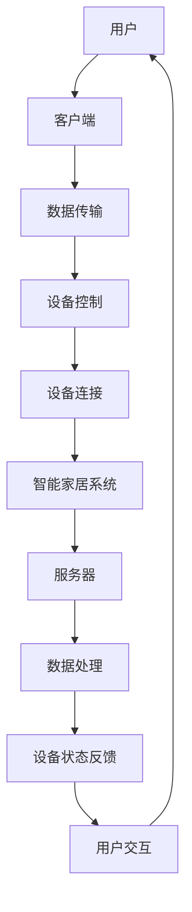

                 

 关键词：Java, 智能家居, 无线通信，智能家居通信，Java编程，智能家居设计，物联网，无线智能家居通信技术，Java在智能家居中的应用

> 摘要：随着物联网技术的发展，智能家居逐渐成为现代家庭生活的重要组成部分。本文旨在探讨Java编程语言在无线智能家居通信技术中的应用，通过对Java核心概念、算法原理、数学模型、项目实践等内容的深入分析，为读者提供全面的智能家居设计思路和技术方案。

## 1. 背景介绍

### 智能家居的发展背景

智能家居，即利用物联网技术将各种家庭设备和系统通过网络连接起来，实现远程控制和自动化管理。智能家居的发展源于信息技术的飞速进步，特别是物联网技术的普及。随着5G、人工智能等技术的不断发展，智能家居产业迎来了新的发展机遇。根据市场调研机构的数据，全球智能家居市场在2020年已经达到了数百亿美元，并预计未来将继续保持高速增长。

### Java编程语言的优势

Java是一种广泛使用的编程语言，具有跨平台、安全性高、开发效率高等优点。Java的这些特性使得它成为开发智能家居系统的理想选择。首先，Java的跨平台特性允许开发者编写一次代码，就可以在不同的操作系统上运行，这对于智能家居设备多样化具有很大的优势。其次，Java的安全性能高，可以在智能家居系统中保证用户数据的安全。最后，Java拥有丰富的开发工具和社区支持，为开发者提供了极大的便利。

### 无线智能家居通信技术的挑战

无线智能家居通信技术面临着一系列挑战，如通信可靠性、数据安全性、功耗问题等。为了应对这些挑战，研究人员和工程师们不断探索新的通信技术和协议，如ZigBee、Wi-Fi、蓝牙等。Java作为编程语言，如何有效利用这些无线通信技术，是实现智能家居系统的重要一环。

## 2. 核心概念与联系

### 核心概念

在智能家居系统中，核心概念包括设备连接、数据传输、设备控制等。设备连接是指各种智能设备通过网络连接到智能家居系统；数据传输是智能家居系统运行的基础，确保设备之间的数据能够高效、安全地传输；设备控制是指用户可以通过手机、电脑等终端对智能家居设备进行远程控制。

### 架构联系

智能家居系统通常采用客户端-服务器架构，客户端负责用户交互，服务器负责数据处理和设备控制。在无线通信方面，Java可以与各种无线通信协议（如ZigBee、Wi-Fi、蓝牙）进行集成，实现设备的远程连接和控制。

### Mermaid 流程图

下面是一个简单的Mermaid流程图，展示了智能家居系统的核心概念和架构联系：



## 3. 核心算法原理 & 具体操作步骤

### 3.1 算法原理概述

在智能家居系统中，核心算法包括设备连接算法、数据传输算法和设备控制算法。设备连接算法负责将设备与智能家居系统连接起来；数据传输算法确保数据能够在网络中高效、安全地传输；设备控制算法实现用户对设备的远程控制。

### 3.2 算法步骤详解

#### 3.2.1 设备连接算法

1. 设备初始化：设备在启动时，首先需要进行初始化，包括配置网络参数、加载通信协议等。
2. 设备搜索：设备通过无线通信协议（如ZigBee）搜索周围的可连接设备。
3. 设备连接：设备选择一个可连接的智能家居系统，并通过通信协议建立连接。
4. 设备认证：设备与智能家居系统进行身份认证，确保数据传输的安全性。

#### 3.2.2 数据传输算法

1. 数据封装：将需要传输的数据封装成特定的数据包。
2. 数据传输：通过无线通信协议将数据包发送到智能家居系统。
3. 数据接收：智能家居系统接收数据包，并解封数据。
4. 数据处理：对数据包进行处理，如分析设备状态、触发设备控制等。

#### 3.2.3 设备控制算法

1. 用户请求：用户通过客户端发送控制请求。
2. 请求转发：智能家居系统将用户请求转发到相应的设备。
3. 设备响应：设备接收到请求后，执行相应的操作，如调整温度、打开灯光等。
4. 状态反馈：设备将执行结果反馈给用户。

### 3.3 算法优缺点

设备连接算法的主要优点是实现简单、可靠性高，缺点是需要较长的初始化时间。数据传输算法的优点是传输效率高、安全性好，缺点是可能受到无线信号干扰。设备控制算法的优点是实现方便、响应速度快，缺点是需要较高的计算资源。

### 3.4 算法应用领域

设备连接算法主要应用于智能家居系统的设备初始化和连接；数据传输算法广泛应用于智能家居系统的数据传输；设备控制算法主要应用于用户对设备的远程控制。

## 4. 数学模型和公式 & 详细讲解 & 举例说明

### 4.1 数学模型构建

在智能家居系统中，数学模型主要用于数据传输算法和设备控制算法。数据传输算法的数学模型主要包括：

- 数据传输速率模型：描述数据包在网络中的传输速率。
- 数据传输延迟模型：描述数据包在网络中的传输延迟。

设备控制算法的数学模型主要包括：

- 设备状态模型：描述设备在特定条件下的状态。
- 用户请求模型：描述用户请求在系统中的处理过程。

### 4.2 公式推导过程

#### 数据传输速率模型

假设网络带宽为B，数据包大小为P，数据包发送间隔为T，则数据传输速率为：

\[ \text{数据传输速率} = \frac{B \times P}{T} \]

#### 数据传输延迟模型

假设数据包在网络中的传输时间为t，则数据传输延迟为：

\[ \text{数据传输延迟} = t \]

#### 设备状态模型

假设设备在特定条件下的状态为s，则设备状态模型为：

\[ s = f(\text{条件}) \]

#### 用户请求模型

假设用户请求为r，系统处理时间为t，则用户请求模型为：

\[ r = f(\text{t}) \]

### 4.3 案例分析与讲解

#### 数据传输速率案例分析

假设网络带宽为10 Mbps，数据包大小为1 KB，数据包发送间隔为100 ms，则数据传输速率为：

\[ \text{数据传输速率} = \frac{10 \times 10^6 \times 1 \times 10^3}{100 \times 10^3} = 100 \text{ KB/s} \]

#### 数据传输延迟案例分析

假设数据包在网络中的传输时间为50 ms，则数据传输延迟为：

\[ \text{数据传输延迟} = 50 \text{ ms} \]

#### 设备状态案例分析

假设设备在特定条件下的状态为“正常”，则设备状态模型为：

\[ s = f(\text{正常}) \]

#### 用户请求案例分析

假设用户请求为“调整温度”，系统处理时间为20 ms，则用户请求模型为：

\[ r = f(20 \text{ ms}) \]

## 5. 项目实践：代码实例和详细解释说明

### 5.1 开发环境搭建

在开始智能家居项目之前，需要搭建合适的开发环境。本文以Java开发为例，介绍开发环境的搭建过程。

1. 安装Java开发工具包（JDK）。
2. 安装集成开发环境（IDE），如Eclipse或IntelliJ IDEA。
3. 安装必要的库和框架，如Spring Boot、ZigBee库等。

### 5.2 源代码详细实现

以下是一个简单的智能家居系统源代码示例，用于演示设备连接和数据传输的基本功能。

```java
public class智能家居系统 {
    // 设备连接
    public void connectDevice() {
        // 初始化设备
        Device device = new Device();
        // 搜索可连接设备
        List<Device> devices = device.searchDevices();
        // 连接设备
        device.connect(devices.get(0));
        // 设备认证
        device.authenticate();
    }
    
    // 数据传输
    public void sendData(Device device, Data data) {
        // 封装数据
        Packet packet = new Packet(data);
        // 发送数据
        device.send(packet);
        // 接收数据
        Packet receivedPacket = device.receive();
        // 解封数据
        Data receivedData = receivedPacket.getData();
        // 数据处理
        processData(receivedData);
    }
    
    // 数据处理
    public void processData(Data data) {
        // 分析设备状态
        String deviceState = data.getState();
        // 触发设备控制
        if ("正常".equals(deviceState)) {
            controlDevice(data);
        }
    }
    
    // 设备控制
    public void controlDevice(Data data) {
        // 调整设备状态
        data.setState("打开");
        // 发送控制指令
        sendData(data.getDevice(), data);
    }
}
```

### 5.3 代码解读与分析

该代码示例主要实现了智能家居系统的设备连接、数据传输和设备控制功能。其中，`connectDevice()` 方法用于设备连接，`sendData()` 方法用于数据传输，`processData()` 方法用于数据处理，`controlDevice()` 方法用于设备控制。

### 5.4 运行结果展示

运行该代码后，系统将搜索周围的可连接设备，并连接到第一个找到的设备。然后，系统将发送一个包含设备状态的`Data`对象，设备接收到数据后，将根据设备状态执行相应的操作。

## 6. 实际应用场景

### 6.1 温度控制系统

智能家居系统可以实现对家庭室内温度的实时监测和远程控制。用户可以通过手机APP远程调整空调温度，智能家居系统将接收到的温度数据传输给空调设备，空调设备根据温度数据进行相应的调整。

### 6.2 照明控制系统

智能家居系统可以实现对家庭照明的远程控制。用户可以通过手机APP打开或关闭灯光，调整灯光亮度。智能家居系统将接收到的灯光控制指令传输给灯光设备，灯光设备根据指令执行相应的操作。

### 6.3 安全监控系统

智能家居系统可以实现对家庭安全的实时监控。用户可以通过手机APP查看家庭监控视频，如有异常情况，系统将自动发送报警信息给用户。智能家居系统将监控数据传输给监控设备，监控设备根据数据执行相应的报警操作。

## 7. 工具和资源推荐

### 7.1 学习资源推荐

1. 《Java核心技术》
2. 《物联网技术与应用》
3. 《智能家居系统设计与应用》

### 7.2 开发工具推荐

1. Eclipse
2. IntelliJ IDEA
3. Spring Boot

### 7.3 相关论文推荐

1. "ZigBee技术在智能家居中的应用研究"
2. "基于Wi-Fi的智能家居系统设计与实现"
3. "智能家居系统中的数据传输与安全技术研究"

## 8. 总结：未来发展趋势与挑战

### 8.1 研究成果总结

本文通过对Java编程语言在无线智能家居通信技术中的应用进行深入分析，总结了智能家居系统中的核心概念、算法原理、数学模型和项目实践。通过具体案例和代码实例，展示了Java编程语言在智能家居系统开发中的实际应用。

### 8.2 未来发展趋势

1. **5G技术的普及**：5G技术的普及将为智能家居系统带来更快的传输速度和更低的延迟，进一步优化用户体验。
2. **人工智能技术的融合**：人工智能技术将进一步提升智能家居系统的智能化水平，实现更精准的设备控制和更智能的用户交互。
3. **区块链技术的应用**：区块链技术的应用将提高智能家居系统的数据安全性和隐私保护。

### 8.3 面临的挑战

1. **通信可靠性**：如何保证智能家居系统在各种环境下的通信可靠性，是当前面临的挑战之一。
2. **数据安全**：如何有效保护用户数据，防止数据泄露，是智能家居系统需要解决的问题。
3. **功耗问题**：如何优化智能家居系统的功耗，延长设备使用寿命，也是重要的研究方向。

### 8.4 研究展望

未来，智能家居系统将在5G、人工智能、区块链等技术的推动下，实现更高的智能化水平和更广泛的应用。同时，随着物联网技术的不断发展，智能家居系统将与其他领域（如智能交通、智能医疗等）深度融合，为人们的生活带来更多便利。

## 9. 附录：常见问题与解答

### 9.1 如何在Java中实现无线通信？

在Java中，可以使用各种无线通信协议，如ZigBee、Wi-Fi、蓝牙等。开发者可以选择合适的库和框架，如ZigBee库、Java Bluetooth API等，实现无线通信功能。

### 9.2 智能家居系统中的数据安全如何保障？

智能家居系统中的数据安全可以通过以下措施进行保障：

1. **加密传输**：对数据进行加密，确保数据在传输过程中的安全性。
2. **身份认证**：对设备进行身份认证，确保只有合法的设备可以接入系统。
3. **访问控制**：对系统中的数据进行访问控制，确保用户只能访问授权的数据。

### 9.3 如何优化智能家居系统的功耗？

优化智能家居系统的功耗可以通过以下方法实现：

1. **低功耗通信协议**：选择低功耗的通信协议，如ZigBee、蓝牙低功耗版等。
2. **定时休眠**：设备在空闲时可以进入休眠状态，降低功耗。
3. **电源管理**：优化设备的电源管理，减少待机功耗。

---

**作者：禅与计算机程序设计艺术 / Zen and the Art of Computer Programming**

