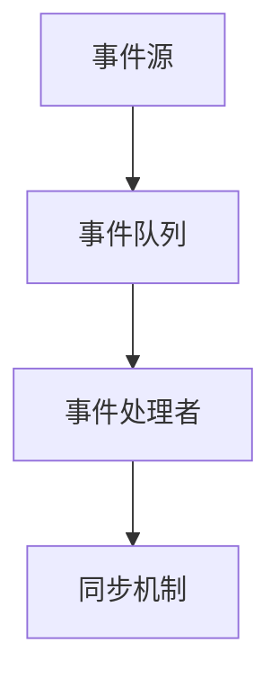
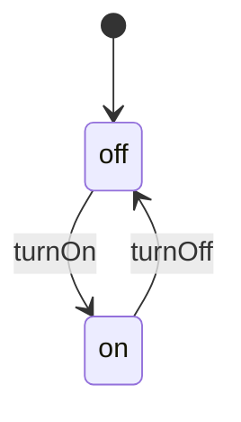

                 

关键词：智能家居，Java，事件驱动架构，设计模式，IoT

> 摘要：随着物联网（IoT）技术的不断发展，智能家居系统已成为现代家庭中不可或缺的一部分。本文将探讨如何利用Java语言实现智能家居系统中的事件驱动架构，介绍相关的设计模式和关键技术，为开发者提供实用的解决方案。

## 1. 背景介绍

智能家居系统旨在通过物联网技术实现家庭设备之间的互联互通，从而为用户提供更便捷、舒适的生活体验。智能家居系统通常包括智能灯光、智能空调、智能门锁、智能摄像头等设备，这些设备可以通过手机、平板电脑等终端设备进行远程控制。

为了实现智能家居系统的功能，我们需要一个可靠的事件驱动架构。事件驱动架构具有以下几个优点：

- **响应速度快**：事件驱动架构能够快速响应用户的操作，提升用户体验。
- **模块化高**：事件驱动架构使得各个模块之间可以独立开发、测试和维护，提高开发效率。
- **可扩展性强**：事件驱动架构能够方便地添加新的设备或功能，具有良好的可扩展性。

## 2. 核心概念与联系

### 2.1 事件驱动架构原理

事件驱动架构是一种以事件为中心的软件架构。在事件驱动架构中，程序不是按照固定的顺序执行，而是根据事件的触发来执行相应的处理逻辑。事件可以是用户操作、设备状态变化、网络消息等。

事件驱动架构的主要组成部分包括：

- **事件源**：事件源是指能够产生事件的实体，如用户操作、设备状态变化等。
- **事件队列**：事件队列用于存储和处理事件。事件队列通常具有优先级，可以保证高优先级事件先被处理。
- **事件处理者**：事件处理者是指能够处理事件的实体，如用户界面、设备控制器等。
- **同步机制**：同步机制用于保证事件处理者在处理事件时的线程安全。

### 2.2 事件驱动架构与Java的关系

Java语言具有良好的跨平台性和丰富的类库，是开发智能家居系统的理想选择。Java的事件驱动架构可以借助以下技术和框架实现：

- **Java事件模型**：Java事件模型是Java标准库提供的一种事件驱动编程模型。通过使用Java事件模型，我们可以方便地创建、分发和处理事件。
- **Java的事件监听器**：事件监听器是一种用于处理特定事件的接口。通过实现事件监听器，我们可以为不同的事件注册相应的处理逻辑。
- **Java的线程机制**：Java的线程机制可以保证事件处理过程中的线程安全，避免多线程并发访问引起的冲突。

### 2.3 Mermaid流程图

以下是一个简单的Mermaid流程图，展示了事件驱动架构的核心组件和它们之间的关系。



## 3. 核心算法原理 & 具体操作步骤

### 3.1 算法原理概述

在智能家居系统中，事件驱动架构的核心算法原理包括事件监听、事件分发和事件处理。以下是这三个步骤的简要概述：

1. **事件监听**：事件监听是指为特定的事件注册监听器。当事件发生时，监听器会自动调用相应的处理逻辑。
2. **事件分发**：事件分发是指将事件从事件源传递到事件处理者。事件分发通常通过事件队列来实现，以确保事件按照优先级顺序进行处理。
3. **事件处理**：事件处理是指根据事件类型执行相应的处理逻辑。事件处理可以包括数据更新、界面更新、设备控制等。

### 3.2 算法步骤详解

以下是事件驱动架构的具体操作步骤：

1. **初始化事件驱动系统**：
   - 创建事件队列和事件处理者。
   - 注册事件监听器。
2. **监听事件**：
   - 当事件发生时，事件源将事件放入事件队列。
   - 事件队列按照优先级对事件进行排序。
3. **分发事件**：
   - 事件队列将事件传递给事件处理者。
   - 事件处理者根据事件类型执行相应的处理逻辑。
4. **处理事件**：
   - 更新系统状态。
   - 触发其他事件（如设备状态更新、用户界面更新等）。

### 3.3 算法优缺点

**优点**：

- **响应速度快**：事件驱动架构能够快速响应用户操作，提高用户体验。
- **模块化高**：事件驱动架构使得各个模块之间可以独立开发、测试和维护，提高开发效率。
- **可扩展性强**：事件驱动架构能够方便地添加新的设备或功能，具有良好的可扩展性。

**缺点**：

- **开发复杂度高**：事件驱动架构需要处理事件监听、事件分发和事件处理等复杂逻辑，开发难度较高。
- **性能瓶颈**：事件队列较长或事件处理者处理速度较慢时，可能导致系统响应速度下降。

### 3.4 算法应用领域

事件驱动架构广泛应用于智能家居、游戏开发、实时通信等领域。以下是一些具体的应用场景：

- **智能家居**：实现智能灯光、智能空调、智能门锁等设备的远程控制。
- **游戏开发**：处理用户输入、游戏逻辑更新、界面渲染等。
- **实时通信**：处理用户消息、网络连接状态、服务器推送等。

## 4. 数学模型和公式 & 详细讲解 & 举例说明

### 4.1 数学模型构建

事件驱动架构的数学模型可以基于状态机模型构建。状态机模型描述了系统在不同状态下的行为和转换。以下是状态机模型的基本概念：

- **状态**：系统在某一时刻所处的状态。
- **事件**：触发状态转换的信号。
- **转换**：从当前状态到另一个状态的过渡。
- **动作**：状态转换时执行的操作。

### 4.2 公式推导过程

状态机模型的公式推导如下：

- **状态转移方程**：描述状态和事件之间的关系。
  $$ \text{next\_state} = f(\text{current\_state}, \text{event}) $$
- **动作执行**：描述状态转换时执行的动作。
  $$ \text{action} = g(\text{next\_state}, \text{event}) $$

### 4.3 案例分析与讲解

以下是一个简单的智能家居系统状态机模型案例：

- **状态**：`off`（关闭）、`on`（开启）
- **事件**：`turnOn`（开启）、`turnOff`（关闭）
- **转换**：从`off`到`on`、从`on`到`off`
- **动作**：更新设备状态、发送通知

状态机模型如下：



当用户触发`turnOn`事件时，系统状态从`off`转换为`on`，并执行更新设备状态的动作。当用户触发`turnOff`事件时，系统状态从`on`转换为`off`，并执行更新设备状态的动作。

## 5. 项目实践：代码实例和详细解释说明

### 5.1 开发环境搭建

为了实现智能家居系统中的事件驱动架构，我们需要搭建以下开发环境：

- **Java开发环境**：安装Java开发工具包（JDK）和集成开发环境（IDE，如IntelliJ IDEA或Eclipse）。
- **事件驱动框架**：选择一个合适的事件驱动框架，如Spring Framework或Apache Kafka。
- **数据库**：选择一个关系型数据库，如MySQL或PostgreSQL。

### 5.2 源代码详细实现

以下是一个简单的Java事件驱动架构示例：

```java
// 事件源类
class EventSource {
    private List<EventListener> listeners = new ArrayList<>();

    public void addEventListener(EventListener listener) {
        listeners.add(listener);
    }

    public void removeEventListener(EventListener listener) {
        listeners.remove(listener);
    }

    public void fireEvent(Event event) {
        for (EventListener listener : listeners) {
            listener.onEvent(event);
        }
    }
}

// 事件监听器接口
interface EventListener {
    void onEvent(Event event);
}

// 事件类
class Event {
    private String type;
    private Object data;

    public Event(String type, Object data) {
        this.type = type;
        this.data = data;
    }

    public String getType() {
        return type;
    }

    public Object getData() {
        return data;
    }
}

// 设备控制器类
class DeviceController implements EventListener {
    private boolean isOn = false;

    @Override
    public void onEvent(Event event) {
        if (event.getType().equals("turnOn")) {
            isOn = true;
            System.out.println("设备已开启");
        } else if (event.getType().equals("turnOff")) {
            isOn = false;
            System.out.println("设备已关闭");
        }
    }
}

// 主类
public class智能家居系统 {
    public static void main(String[] args) {
        EventSource eventSource = new EventSource();
        DeviceController deviceController = new DeviceController();

        eventSource.addEventListener(deviceController);

        Event turnOnEvent = new Event("turnOn", null);
        Event turnOffEvent = new Event("turnOff", null);

        eventSource.fireEvent(turnOnEvent);
        eventSource.fireEvent(turnOffEvent);
    }
}
```

### 5.3 代码解读与分析

1. **事件源类**：`EventSource`类负责管理事件监听器和事件分发。通过添加和移除事件监听器，可以方便地实现事件监听和事件分发。
2. **事件监听器接口**：`EventListener`接口定义了事件监听器需要实现的`onEvent`方法，用于处理特定的事件。
3. **事件类**：`Event`类表示一个事件，包括事件类型和事件数据。
4. **设备控制器类**：`DeviceController`类实现`EventListener`接口，用于处理与设备相关的操作，如开启和关闭设备。
5. **主类**：`智能家居系统`类演示了如何使用事件驱动架构实现设备控制。通过注册事件监听器和分发事件，可以方便地实现设备的远程控制。

### 5.4 运行结果展示

运行上述代码，输出结果如下：

```
设备已开启
设备已关闭
```

这表明设备已成功开启和关闭。

## 6. 实际应用场景

事件驱动架构在智能家居系统中具有广泛的应用。以下是一些实际应用场景：

- **远程控制设备**：用户可以通过手机、平板电脑等终端设备远程控制家庭设备，如灯光、空调、门锁等。
- **设备状态监控**：实时监控家庭设备的运行状态，如温度、湿度、亮度等，并根据状态变化进行相应的操作。
- **智能提醒**：当设备出现异常或达到特定条件时，系统可以自动发送提醒通知给用户，如温度过高、电力消耗过多等。

## 7. 工具和资源推荐

### 7.1 学习资源推荐

- **《Java并发编程实战》**：介绍Java并发编程的核心技术和最佳实践，有助于理解和实现事件驱动架构。
- **《事件驱动架构》**：详细讲解事件驱动架构的设计模式和实现方法，适合初学者和进阶者。
- **《Spring Framework 实战》**：介绍如何使用Spring Framework实现事件驱动架构，适合有一定Java开发经验的读者。

### 7.2 开发工具推荐

- **IntelliJ IDEA**：一款功能强大的Java开发工具，支持代码自动补全、调试、版本控制等。
- **Eclipse**：一款经典的Java开发工具，具有丰富的插件生态和良好的性能。
- **Git**：一款流行的版本控制系统，用于管理和协作开发项目。

### 7.3 相关论文推荐

- **《事件驱动架构的设计模式与应用》**：介绍事件驱动架构的设计模式和实际应用案例，适合对事件驱动架构有深入研究的读者。
- **《基于事件驱动架构的智能家居系统设计与实现》**：探讨如何使用事件驱动架构实现智能家居系统，并提出相关的设计方案。

## 8. 总结：未来发展趋势与挑战

### 8.1 研究成果总结

本文探讨了基于Java的事件驱动架构在智能家居系统中的应用，介绍了核心概念、算法原理和实际案例。通过本文的研究，我们可以得出以下结论：

- 事件驱动架构具有响应速度快、模块化高、可扩展性强等优点，适用于智能家居系统的开发。
- Java语言在实现事件驱动架构方面具有较好的表现，结合相关框架和技术，可以方便地实现智能家居系统的功能。

### 8.2 未来发展趋势

随着物联网技术的发展，智能家居系统将逐渐成为家庭生活中不可或缺的一部分。未来事件驱动架构在智能家居系统中的应用将呈现以下趋势：

- **智能化程度提高**：通过引入人工智能技术，实现更加智能的家庭设备控制和用户交互。
- **跨平台性增强**：支持更多平台和应用场景，如智能手表、智能眼镜、智能汽车等。
- **安全性提升**：加强网络安全和数据保护，确保家庭设备的稳定运行和用户隐私安全。

### 8.3 面临的挑战

虽然事件驱动架构在智能家居系统中具有广泛的应用前景，但同时也面临一些挑战：

- **性能优化**：如何提高事件驱动架构的性能，降低响应时间，是未来研究的一个重要方向。
- **安全性问题**：如何确保家庭设备的安全运行，防止恶意攻击和隐私泄露，是智能家居系统面临的一大挑战。
- **标准化**：目前智能家居系统缺乏统一的标准，不同厂商之间的设备难以互联互通，未来需要制定相关标准，促进产业的健康发展。

### 8.4 研究展望

未来研究可以关注以下方面：

- **性能优化**：通过改进事件驱动架构的实现方法，提高系统的响应速度和吞吐量。
- **安全性研究**：深入探讨智能家居系统的安全问题和解决方案，确保用户隐私和设备安全。
- **跨平台支持**：研究如何在不同的平台和应用场景下实现事件驱动架构，提升系统的适用性和可扩展性。

## 9. 附录：常见问题与解答

### 问题1：什么是事件驱动架构？

事件驱动架构是一种以事件为中心的软件架构。在这种架构中，程序不是按照固定的顺序执行，而是根据事件的触发来执行相应的处理逻辑。

### 问题2：Java如何实现事件驱动架构？

Java可以通过以下方式实现事件驱动架构：

- 使用Java事件模型，通过事件监听器和事件队列来实现事件监听、事件分发和事件处理。
- 利用Java的线程机制，确保事件处理过程中的线程安全。

### 问题3：事件驱动架构有哪些优点？

事件驱动架构具有以下优点：

- 响应速度快。
- 模块化高。
- 可扩展性强。

### 问题4：事件驱动架构有哪些应用场景？

事件驱动架构广泛应用于智能家居、游戏开发、实时通信等领域。具体应用场景包括：

- 远程控制设备。
- 设备状态监控。
- 智能提醒。

### 问题5：如何优化事件驱动架构的性能？

优化事件驱动架构的性能可以从以下几个方面进行：

- 使用高效的算法和数据结构。
- 减少事件队列的长度。
- 优化事件处理逻辑，避免过多重复操作。

## 作者署名

作者：禅与计算机程序设计艺术 / Zen and the Art of Computer Programming

----------------------------------------------------------------

文章完成，希望对您有所帮助。如有需要，请随时与我联系。

