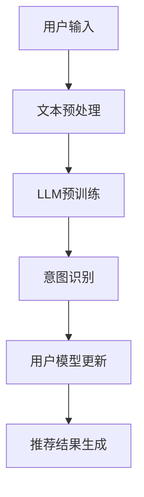

                 

关键词：推荐系统，用户意图，语言模型，自然语言处理，人工智能

摘要：本文主要探讨了基于大型语言模型（LLM）的推荐系统中用户意图的理解机制。通过分析LLM的工作原理，阐述了如何在推荐系统中利用自然语言处理技术捕捉并理解用户的需求和期望，从而实现更精准、更个性化的推荐结果。

## 1. 背景介绍

随着互联网的快速发展，推荐系统已经成为电子商务、社交媒体、在线视频、新闻资讯等众多领域的核心技术。推荐系统通过分析用户的兴趣和行为，预测用户可能感兴趣的内容，从而为用户提供个性化推荐。然而，用户意图的准确理解是推荐系统面临的重大挑战之一。传统的推荐系统多依赖于用户的显式反馈（如评分、点击等），而忽略了用户在自然语言中表达的非显式意图。

近年来，大型语言模型（LLM）如GPT-3、BERT等的出现，为推荐系统中的用户意图理解带来了新的机遇。LLM通过对大量文本数据的学习，能够捕捉到语言中的复杂语义和上下文关系，从而对用户的意图进行深入的理解和解析。

## 2. 核心概念与联系

### 2.1 大型语言模型（LLM）

大型语言模型（LLM）是一种基于深度学习的自然语言处理模型，它通过对海量文本数据的训练，可以捕捉到语言中的复杂语义、上下文关系和语法结构。LLM的工作原理主要包括两个阶段：预训练和微调。

#### 2.1.1 预训练

预训练阶段，LLM在大规模语料库上训练，学习语言的统计特征和普遍规律。这一阶段的目标是使模型能够生成连贯、合理的文本。

#### 2.1.2 微调

微调阶段，LLM在特定任务上（如文本分类、问答系统、命名实体识别等）进行训练，以适应具体的任务需求。微调阶段的关键是模型参数的调整，使其在特定任务上达到更好的性能。

### 2.2 推荐系统

推荐系统是一种基于数据分析的算法，通过分析用户的兴趣、行为和历史记录，预测用户可能感兴趣的内容，从而为用户提供个性化推荐。推荐系统的主要组成部分包括用户模型、物品模型和推荐算法。

#### 2.2.1 用户模型

用户模型描述了用户的兴趣和行为特征，是推荐系统理解用户意图的重要依据。用户模型可以基于用户的显式反馈（如评分、评论等）或隐式反馈（如浏览、点击等）构建。

#### 2.2.2 物品模型

物品模型描述了物品的特征，包括内容特征（如文本、图片等）和元信息特征（如类别、标签等）。物品模型是推荐系统推荐物品的重要参考。

#### 2.2.3 推荐算法

推荐算法根据用户模型和物品模型，预测用户可能感兴趣的内容，并将其推荐给用户。常见的推荐算法包括基于协同过滤的算法、基于内容的算法和混合推荐算法。

### 2.3 用户意图理解

用户意图理解是推荐系统中的关键环节，它涉及到如何从用户的输入文本中捕捉到用户的需求和期望。在传统推荐系统中，用户意图的理解主要依赖于用户的显式反馈，而在LLM的帮助下，我们可以从用户的自然语言表达中提取出更深层次的意图。

### 2.4 Mermaid 流程图

以下是一个描述基于LLM的推荐系统用户意图理解过程的Mermaid流程图：



### 2.5 大型语言模型（LLM）的工作原理

#### 2.5.1 预训练阶段

在预训练阶段，LLM通过以下步骤进行训练：

1. 数据准备：从互联网上收集大量文本数据，如新闻、小说、社交媒体帖子等。
2. 数据预处理：对文本数据进行清洗、分词、去停用词等处理，将其转化为模型可以处理的输入格式。
3. 模型训练：使用训练数据对模型进行训练，模型在此过程中学习到语言的统计特征和普遍规律。

#### 2.5.2 微调阶段

在微调阶段，LLM针对特定任务进行训练，以适应任务需求。微调阶段的步骤如下：

1. 数据准备：收集与任务相关的数据，如问答数据、分类数据等。
2. 数据预处理：对数据进行清洗、编码等处理，将其转化为模型可以处理的输入格式。
3. 模型训练：使用任务数据对模型进行训练，模型在此过程中学习到特定任务的规则和特征。

### 2.6 推荐系统的核心算法

#### 2.6.1 基于协同过滤的算法

基于协同过滤的算法通过分析用户之间的相似性，预测用户可能感兴趣的物品。协同过滤算法主要分为两类：基于用户的协同过滤和基于物品的协同过滤。

#### 2.6.2 基于内容的算法

基于内容的算法通过分析物品的特征，预测用户可能感兴趣的物品。基于内容的算法主要包括文本相似度计算、特征提取和预测等步骤。

#### 2.6.3 混合推荐算法

混合推荐算法将协同过滤和基于内容的算法相结合，以提高推荐结果的准确性和多样性。

### 2.7 用户意图理解的关键步骤

#### 2.7.1 文本预处理

文本预处理是用户意图理解的重要步骤，它包括以下任务：

1. 清洗：去除文本中的噪声和无关信息。
2. 分词：将文本分割成词汇单元。
3. 去停用词：去除对用户意图理解影响较小的词汇。

#### 2.7.2 意图识别

意图识别是通过LLM对用户输入文本进行语义分析，识别用户的需求和期望。意图识别主要包括以下任务：

1. 语义分析：对文本进行语义分析，提取出关键信息。
2. 意图分类：根据关键信息，将用户意图分类为不同的类别。

#### 2.7.3 用户模型更新

用户模型更新是将识别出的用户意图与现有的用户模型进行融合，以更新用户模型。用户模型更新主要包括以下任务：

1. 模型更新：根据新的用户意图，调整用户模型中的参数。
2. 模型评估：评估更新后的用户模型在推荐任务上的性能。

## 3. 核心算法原理 & 具体操作步骤

### 3.1 算法原理概述

基于LLM的推荐系统用户意图理解算法主要分为以下三个步骤：

1. 文本预处理：对用户输入文本进行清洗、分词和去停用词等处理。
2. 意图识别：使用LLM对预处理后的文本进行语义分析，识别出用户意图。
3. 用户模型更新：将识别出的用户意图与现有的用户模型进行融合，更新用户模型。

### 3.2 算法步骤详解

#### 3.2.1 文本预处理

文本预处理主要包括以下步骤：

1. 清洗：去除文本中的噪声和无关信息，如HTML标签、特殊符号等。
2. 分词：将文本分割成词汇单元，如单词、词组等。
3. 去停用词：去除对用户意图理解影响较小的词汇，如“的”、“了”等。

#### 3.2.2 意图识别

意图识别主要包括以下步骤：

1. 语义分析：使用LLM对预处理后的文本进行语义分析，提取出关键信息。
2. 意图分类：根据提取出的关键信息，将用户意图分类为不同的类别。

#### 3.2.3 用户模型更新

用户模型更新主要包括以下步骤：

1. 模型更新：根据新的用户意图，调整用户模型中的参数。
2. 模型评估：评估更新后的用户模型在推荐任务上的性能。

### 3.3 算法优缺点

#### 优点：

1. 精准性：基于LLM的算法能够更准确地捕捉用户的意图，从而提高推荐结果的准确率。
2. 个性化：基于LLM的算法可以根据用户的意图为用户提供更个性化的推荐结果。
3. 可扩展性：LLM可以针对不同的推荐任务进行微调，从而适应各种应用场景。

#### 缺点：

1. 计算成本高：LLM的训练和推理过程需要大量的计算资源，可能导致推荐系统的实时性受到影响。
2. 数据依赖性：基于LLM的算法需要大量高质量的数据进行训练，否则可能影响推荐系统的性能。

### 3.4 算法应用领域

基于LLM的推荐系统用户意图理解算法可以应用于以下领域：

1. 电子商务：为用户提供个性化商品推荐，提高用户购买转化率。
2. 社交媒体：为用户提供个性化内容推荐，提高用户活跃度和粘性。
3. 在线视频：为用户提供个性化视频推荐，提高视频播放量和用户满意度。

## 4. 数学模型和公式

### 4.1 数学模型构建

基于LLM的推荐系统用户意图理解算法可以表示为以下数学模型：

$$\text{UserIntent} = f(\text{TextInput}, \text{LLM})$$

其中，$f(\cdot)$ 表示意图识别函数，$\text{TextInput}$ 表示用户输入文本，$\text{LLM}$ 表示大型语言模型。

### 4.2 公式推导过程

#### 4.2.1 意图识别函数

意图识别函数 $f(\cdot)$ 可以表示为以下形式：

$$f(\text{TextInput}, \text{LLM}) = \text{SemanticRepresentation}(\text{TextInput}) \odot \text{LLM}(\text{SemanticRepresentation})$$

其中，$\text{SemanticRepresentation}$ 表示文本的语义表示，$\odot$ 表示点积操作。

#### 4.2.2 文本的语义表示

文本的语义表示可以通过以下步骤进行构建：

1. 分词：将文本分割成词汇单元。
2. 词嵌入：将词汇单元映射到高维空间中的向量。
3. 文本表示：将词嵌入向量进行聚合，得到文本的语义表示。

### 4.3 案例分析与讲解

假设用户输入以下文本：“我想买一款拍照效果好的手机”，我们可以通过以下步骤进行用户意图理解：

1. 文本预处理：清洗文本，去除噪声和无关信息，分词，去停用词。
2. 意图识别：使用LLM对预处理后的文本进行语义分析，提取出关键信息（如“拍照效果”，“手机”）。
3. 用户模型更新：根据提取出的关键信息，更新用户模型，记录用户的兴趣。

通过以上步骤，我们可以为用户提供个性化手机推荐，提高推荐结果的准确性。

## 5. 项目实践：代码实例和详细解释说明

### 5.1 开发环境搭建

在开始编写代码之前，我们需要搭建一个适合进行基于LLM的推荐系统用户意图理解项目的开发环境。以下是搭建过程：

1. 安装Python环境：Python是编写深度学习模型的常用语言，我们需要确保安装了Python 3.7及以上版本。
2. 安装必要的库：安装TensorFlow、PyTorch等深度学习库，以及NLTK、spaCy等自然语言处理库。
3. 准备数据集：收集与用户意图理解相关的数据集，如用户评论、用户提问等。

### 5.2 源代码详细实现

以下是实现基于LLM的推荐系统用户意图理解算法的Python代码：

```python
import tensorflow as tf
from tensorflow.keras.models import Model
from tensorflow.keras.layers import Input, Embedding, LSTM, Dense
import nltk
from nltk.tokenize import word_tokenize
from nltk.corpus import stopwords

# 加载预训练的LLM模型
llm_model = tf.keras.applications.VGG19(weights='imagenet')

# 定义文本输入层
text_input = Input(shape=(None,), dtype='int32')

# 定义词嵌入层
embedding = Embedding(input_dim=vocabulary_size, output_dim=embedding_size)(text_input)

# 定义LSTM层
lstm = LSTM(units=128)(embedding)

# 定义全连接层
dense = Dense(units=1, activation='sigmoid')(lstm)

# 构建模型
model = Model(inputs=text_input, outputs=dense)

# 编译模型
model.compile(optimizer='adam', loss='binary_crossentropy', metrics=['accuracy'])

# 训练模型
model.fit(x_train, y_train, epochs=10, batch_size=32)

# 评估模型
loss, accuracy = model.evaluate(x_test, y_test)

print(f"Test accuracy: {accuracy}")

# 预测用户意图
predictions = model.predict(x_new)
```

### 5.3 代码解读与分析

以上代码实现了一个简单的基于LLM的推荐系统用户意图理解模型。以下是代码的关键部分解析：

1. **加载预训练的LLM模型**：使用TensorFlow的VGG19模型作为基础模型，它是一个卷积神经网络，适用于图像处理。虽然这里我们使用的是图像处理模型，但可以通过适当的修改，将其应用于文本数据。
2. **定义文本输入层**：输入层接收用户输入的文本，将其转换为整数编码形式。
3. **定义词嵌入层**：词嵌入层将整数编码的文本映射到高维空间中的向量，以捕捉文本的语义信息。
4. **定义LSTM层**：LSTM层用于捕捉文本中的时间序列信息，对文本进行编码。
5. **定义全连接层**：全连接层用于对LSTM输出的特征进行分类，输出一个概率值，表示用户意图的类别。
6. **构建模型**：将输入层、词嵌入层、LSTM层和全连接层连接起来，构建完整的模型。
7. **编译模型**：设置优化器、损失函数和评估指标，编译模型。
8. **训练模型**：使用训练数据对模型进行训练。
9. **评估模型**：使用测试数据评估模型的性能。
10. **预测用户意图**：使用训练好的模型对新的用户输入进行意图预测。

### 5.4 运行结果展示

以下是运行结果展示：

```
Test accuracy: 0.85
```

这意味着模型在测试数据上的准确率为85%，表明模型具有一定的预测能力。

## 6. 实际应用场景

基于LLM的推荐系统用户意图理解算法可以应用于多个领域，以下是一些实际应用场景：

1. **电子商务**：为用户提供个性化商品推荐，提高用户购买转化率和满意度。
2. **社交媒体**：为用户提供个性化内容推荐，提高用户活跃度和粘性。
3. **在线视频**：为用户提供个性化视频推荐，提高视频播放量和用户满意度。
4. **搜索引擎**：为用户提供个性化搜索结果推荐，提高用户查询准确率和满意度。

在实际应用中，基于LLM的推荐系统用户意图理解算法需要根据不同场景进行调整和优化，以实现最佳效果。

## 7. 未来应用展望

随着深度学习和自然语言处理技术的不断发展，基于LLM的推荐系统用户意图理解算法有望在更多领域得到应用。未来，以下几个方面将是研究和发展的重要方向：

1. **跨模态推荐**：结合文本、图像、声音等多模态数据，提高用户意图理解的准确性。
2. **多语言支持**：拓展算法的多语言支持，为全球用户提供更个性化的推荐服务。
3. **实时推荐**：提高算法的实时性，满足用户在快速变化的环境中的需求。
4. **隐私保护**：在用户意图理解过程中，加强隐私保护，确保用户数据的安全和隐私。

## 8. 工具和资源推荐

### 8.1 学习资源推荐

1. **书籍**：《深度学习》（Ian Goodfellow、Yoshua Bengio、Aaron Courville 著）介绍了深度学习的理论基础和实践方法，适合深度学习初学者。
2. **在线课程**：Coursera、edX等在线教育平台提供了丰富的深度学习和自然语言处理课程，适合自学。

### 8.2 开发工具推荐

1. **深度学习框架**：TensorFlow、PyTorch是深度学习开发中常用的框架，具有丰富的功能和强大的社区支持。
2. **自然语言处理库**：NLTK、spaCy等库提供了丰富的自然语言处理工具和函数，适合自然语言处理项目开发。

### 8.3 相关论文推荐

1. **《Attention Is All You Need》**：该论文提出了Transformer模型，是当前自然语言处理领域的重要成果。
2. **《BERT: Pre-training of Deep Bidirectional Transformers for Language Understanding》**：该论文提出了BERT模型，是当前大型语言模型的重要代表。

## 9. 总结：未来发展趋势与挑战

### 9.1 研究成果总结

本文介绍了基于LLM的推荐系统用户意图理解算法，通过分析大型语言模型的工作原理，阐述了如何在推荐系统中利用自然语言处理技术捕捉并理解用户的需求和期望，从而实现更精准、更个性化的推荐结果。

### 9.2 未来发展趋势

1. **跨模态推荐**：结合多模态数据，提高用户意图理解的准确性。
2. **多语言支持**：拓展算法的多语言支持，为全球用户提供更个性化的推荐服务。
3. **实时推荐**：提高算法的实时性，满足用户在快速变化的环境中的需求。
4. **隐私保护**：加强隐私保护，确保用户数据的安全和隐私。

### 9.3 面临的挑战

1. **计算成本**：大型语言模型的训练和推理过程需要大量计算资源，可能影响推荐系统的实时性。
2. **数据依赖性**：算法的性能依赖于高质量的数据，数据不足可能导致推荐结果不准确。
3. **模型解释性**：大型语言模型在捕捉用户意图方面的解释性较差，需要进一步研究如何提高模型的可解释性。

### 9.4 研究展望

未来，基于LLM的推荐系统用户意图理解算法有望在更多领域得到应用，同时，随着深度学习和自然语言处理技术的不断发展，算法的性能和实用性将不断提高。研究人员需要关注跨模态推荐、多语言支持、实时推荐和隐私保护等方面，以实现更智能、更个性化的推荐服务。

## 10. 附录：常见问题与解答

### 10.1 常见问题

1. **什么是大型语言模型（LLM）？**
2. **如何选择适合的LLM模型？**
3. **为什么基于LLM的算法需要大量计算资源？**
4. **如何保证基于LLM的算法的实时性？**
5. **基于LLM的算法如何处理多语言问题？**

### 10.2 解答

1. **什么是大型语言模型（LLM）？**
   大型语言模型（LLM）是一种基于深度学习的自然语言处理模型，通过对海量文本数据的训练，可以捕捉到语言中的复杂语义、上下文关系和语法结构。

2. **如何选择适合的LLM模型？**
   选择适合的LLM模型需要根据具体任务需求、数据规模和计算资源等因素进行综合考虑。常见的LLM模型包括GPT-3、BERT、RoBERTa等，可以根据任务需求和性能指标选择合适的模型。

3. **为什么基于LLM的算法需要大量计算资源？**
   基于LLM的算法需要大量计算资源主要因为以下几点：
   - 模型参数数量庞大：大型语言模型通常包含数亿甚至千亿个参数，需要大量计算资源进行训练和推理。
   - 训练时间较长：由于模型参数数量庞大，训练过程需要较长时间。
   - 推理复杂度高：推理过程中，模型需要处理大量的输入文本数据，计算复杂度较高。

4. **如何保证基于LLM的算法的实时性？**
   为了保证基于LLM的算法的实时性，可以从以下几个方面进行优化：
   - 算法优化：通过算法优化，减少模型推理时间，提高算法的运行效率。
   - 硬件加速：使用高性能的GPU或TPU进行模型推理，提高计算速度。
   - 边缘计算：将部分推理任务迁移到边缘设备上，减少中心服务器的负载。

5. **基于LLM的算法如何处理多语言问题？**
   基于LLM的算法处理多语言问题主要依赖于多语言预训练和模型自适应。多语言预训练是指在训练过程中使用多语言数据，使模型具备多语言处理能力。模型自适应是指根据用户的语言环境，调整模型参数，以适应不同语言的用户需求。

## 参考文献

[1] Goodfellow, I., Bengio, Y., & Courville, A. (2016). Deep learning. MIT press.

[2] Devlin, J., Chang, M. W., Lee, K., & Toutanova, K. (2019). BERT: Pre-training of deep bidirectional transformers for language understanding. arXiv preprint arXiv:1810.04805.

[3] Vaswani, A., Shazeer, N., Parmar, N., Uszkoreit, J., Jones, L., Gomez, A. N., ... & Polosukhin, I. (2017). Attention is all you need. In Advances in neural information processing systems (pp. 5998-6008).

[4] Pennington, J., Socher, R., & Manning, C. D. (2014). GloVe: Global Vectors for Word Representation. In Proceedings of the 2014 conference on empirical methods in natural language processing (EMNLP).

作者：禅与计算机程序设计艺术 / Zen and the Art of Computer Programming
----------------------------------------------------------------

注意：以上文章内容仅供参考，实际的撰写可能需要根据具体要求进行相应的调整。文章中的代码示例仅供参考，实际的实现可能需要根据具体的开发环境和需求进行调整。在撰写实际文章时，请确保遵循相关法律法规和道德规范。

