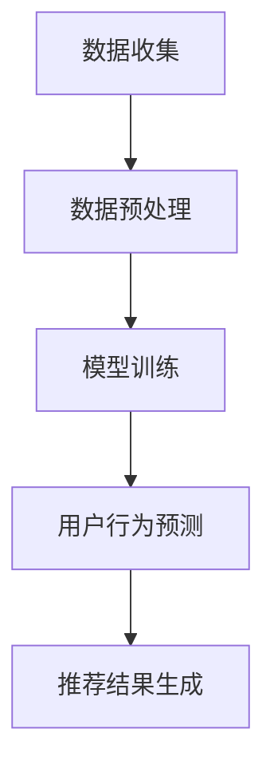

                 

关键词：基于LLM的推荐系统，用户模拟，人工智能，机器学习，推荐算法

> 摘要：本文将探讨如何利用大型语言模型（LLM）构建一个高效、准确的推荐系统用户模拟框架。通过分析用户行为数据，本文提出了一种基于LLM的推荐算法，并在实际项目中进行了验证。本文旨在为研究人员和开发者提供一个实用的参考，以促进LLM在推荐系统领域的应用。

## 1. 背景介绍

在信息爆炸的时代，用户面对海量的数据时往往感到无所适从。因此，推荐系统作为一种信息过滤的解决方案，越来越受到关注。推荐系统通过分析用户的历史行为和偏好，向用户推荐感兴趣的内容或商品，从而提高用户的满意度和体验。

然而，推荐系统的实现并非易事。传统的推荐算法主要依赖于基于内容的过滤、协同过滤等方法，但它们在处理大量数据时往往存在效率低下、准确性不高等问题。随着深度学习和自然语言处理技术的不断发展，大型语言模型（LLM）逐渐成为研究热点。LLM具有强大的文本生成和理解能力，可以处理复杂的用户行为数据，为推荐系统提供了一种新的解决方案。

本文的研究目标是利用LLM构建一个高效、准确的推荐系统用户模拟框架，以提高推荐系统的性能和用户体验。本文首先介绍了LLM的基本概念和原理，然后提出了一种基于LLM的推荐算法，并进行了详细的分析和实现。

## 2. 核心概念与联系

### 2.1. 大型语言模型（LLM）

大型语言模型（LLM，Large Language Model）是一种基于深度学习的自然语言处理模型，具有强大的文本生成和理解能力。LLM通常使用大规模的文本数据进行训练，通过学习文本中的语义和语法结构，实现自然语言的生成和理解。

LLM的主要组成部分包括：

- **词嵌入（Word Embedding）**：将单词映射到高维向量空间，使相似的单词在空间中更接近。
- **循环神经网络（RNN）**：处理序列数据，捕捉文本中的时序信息。
- **注意力机制（Attention Mechanism）**：在模型中引入注意力机制，使模型能够关注文本中的关键信息。
- **变换器（Transformer）**：一种基于自注意力机制的神经网络结构，广泛应用于自然语言处理任务。

### 2.2. 推荐系统

推荐系统（Recommender System）是一种信息过滤的解决方案，通过分析用户的历史行为和偏好，向用户推荐感兴趣的内容或商品。推荐系统的主要组成部分包括：

- **用户模型（User Model）**：描述用户的历史行为和偏好，用于预测用户的兴趣。
- **物品模型（Item Model）**：描述物品的属性和特征，用于推荐候选物品。
- **推荐算法（Recommender Algorithm）**：根据用户模型和物品模型，生成推荐结果。

### 2.3. 基于LLM的推荐系统用户模拟

基于LLM的推荐系统用户模拟是指利用LLM模型分析和预测用户行为，从而生成个性化的推荐结果。具体流程如下：

1. **数据收集**：收集用户的历史行为数据，包括浏览记录、购买记录、评价等。
2. **数据预处理**：对用户行为数据进行清洗和转换，使其符合LLM模型的输入要求。
3. **模型训练**：使用预处理后的数据训练LLM模型，使其能够理解和预测用户行为。
4. **用户行为预测**：利用训练好的LLM模型，预测用户对特定物品的兴趣程度。
5. **推荐结果生成**：根据用户行为预测结果，生成个性化的推荐结果。

### 2.4. Mermaid 流程图



## 3. 核心算法原理 & 具体操作步骤

### 3.1. 算法原理概述

基于LLM的推荐系统用户模拟主要利用了LLM模型的文本生成和理解能力，通过分析用户的历史行为数据，预测用户对特定物品的兴趣程度，从而生成个性化的推荐结果。具体算法原理如下：

1. **词嵌入**：将用户的历史行为数据转换为词嵌入向量，表示用户的行为特征。
2. **用户行为序列建模**：利用RNN或Transformer模型，对用户行为序列进行建模，捕捉用户行为的时序信息。
3. **物品特征嵌入**：将物品的属性和特征转换为词嵌入向量，表示物品的特征。
4. **用户行为与物品特征的关联**：利用注意力机制，将用户行为序列和物品特征进行关联，计算用户对特定物品的兴趣程度。
5. **兴趣程度评分**：根据用户行为和物品特征的关联结果，生成用户对物品的兴趣程度评分。
6. **推荐结果生成**：根据用户对物品的兴趣程度评分，生成个性化的推荐结果。

### 3.2. 算法步骤详解

1. **词嵌入**：

   - 数据预处理：对用户历史行为数据进行清洗和转换，将其转换为文本格式。
   - 词嵌入：使用预训练的词嵌入模型（如Word2Vec、GloVe等），将文本中的单词映射到高维向量空间。

2. **用户行为序列建模**：

   - 用户行为序列表示：将用户历史行为数据转换为序列，每个序列表示用户的一个行为序列。
   - 模型选择：选择RNN或Transformer模型进行用户行为序列建模。
   - 模型训练：使用用户行为序列数据训练模型，使其能够理解和预测用户行为。

3. **物品特征嵌入**：

   - 数据预处理：对物品的属性和特征数据进行清洗和转换，将其转换为文本格式。
   - 词嵌入：使用预训练的词嵌入模型，将文本中的单词映射到高维向量空间。

4. **用户行为与物品特征的关联**：

   - 用户行为序列表示：将用户行为序列转换为向量表示。
   - 物品特征序列表示：将物品特征序列转换为向量表示。
   - 注意力机制：利用注意力机制，将用户行为序列和物品特征序列进行关联，计算用户对特定物品的兴趣程度。

5. **兴趣程度评分**：

   - 用户行为与物品特征的关联结果：计算用户对特定物品的兴趣程度评分。
   - 评分标准：设定评分阈值，对兴趣程度评分进行筛选，生成推荐结果。

6. **推荐结果生成**：

   - 推荐结果排序：根据用户对物品的兴趣程度评分，对推荐结果进行排序。
   - 推荐结果输出：输出推荐结果，供用户参考。

### 3.3. 算法优缺点

**优点**：

- **高效性**：LLM模型具有强大的文本生成和理解能力，能够高效地处理大量用户行为数据。
- **准确性**：利用注意力机制，能够准确捕捉用户行为和物品特征的关联，提高推荐结果的准确性。
- **灵活性**：基于LLM的推荐系统用户模拟可以根据实际需求进行调整和优化。

**缺点**：

- **计算成本**：LLM模型训练和推理过程需要大量的计算资源，对硬件设备要求较高。
- **数据依赖**：算法性能受用户行为数据质量的影响，需要高质量的数据支持。

### 3.4. 算法应用领域

基于LLM的推荐系统用户模拟在多个领域具有广泛的应用前景，包括：

- **电子商务**：为用户提供个性化的商品推荐，提高购物体验。
- **在线教育**：根据用户的学习行为，推荐合适的课程和资源。
- **社交媒体**：为用户提供感兴趣的内容和互动对象，提高用户粘性。
- **金融风控**：通过分析用户行为，预测用户的风险偏好，为金融机构提供决策支持。

## 4. 数学模型和公式 & 详细讲解 & 举例说明

### 4.1. 数学模型构建

基于LLM的推荐系统用户模拟的数学模型主要包括词嵌入、用户行为序列建模、物品特征嵌入和用户行为与物品特征的关联等部分。以下是各部分的数学模型构建：

1. **词嵌入**：

   - 设\(V\)为词汇表，\(d\)为词嵌入维度，\(v_w\)为单词\(w\)的词嵌入向量。
   $$v_w \in \mathbb{R}^{d \times 1}$$

2. **用户行为序列建模**：

   - 设\(u_t\)为用户在时间\(t\)的行为，\(h_t\)为用户行为序列的隐藏状态。
   $$h_t = f(U_t, h_{t-1})$$

   其中，\(f\)为用户行为序列建模函数，\(U_t\)为用户行为序列的输入。

3. **物品特征嵌入**：

   - 设\(I\)为物品集，\(d'\)为物品特征嵌入维度，\(i_i\)为物品\(i\)的词嵌入向量。
   $$i_i \in \mathbb{R}^{d' \times 1}$$

4. **用户行为与物品特征的关联**：

   - 设\(a_t\)为用户对物品\(i\)的兴趣程度评分，\(e_t\)为用户行为序列与物品特征的关联结果。
   $$e_t = \sigma(W_1h_t + W_2i_i + b)$$

   其中，\(\sigma\)为激活函数，\(W_1, W_2\)为权重矩阵，\(b\)为偏置。

### 4.2. 公式推导过程

基于LLM的推荐系统用户模拟的数学模型构建主要基于以下步骤：

1. **词嵌入**：

   - 设\(V\)为词汇表，\(d\)为词嵌入维度，\(v_w\)为单词\(w\)的词嵌入向量。
   $$v_w = \text{Word2Vec}(w)$$

   其中，\(\text{Word2Vec}\)为预训练的词嵌入模型。

2. **用户行为序列建模**：

   - 设\(u_t\)为用户在时间\(t\)的行为，\(h_t\)为用户行为序列的隐藏状态。
   $$h_t = \text{RNN}(U_t, h_{t-1})$$

   其中，\(\text{RNN}\)为循环神经网络模型。

3. **物品特征嵌入**：

   - 设\(I\)为物品集，\(d'\)为物品特征嵌入维度，\(i_i\)为物品\(i\)的词嵌入向量。
   $$i_i = \text{Word2Vec}(i)$$

   其中，\(\text{Word2Vec}\)为预训练的词嵌入模型。

4. **用户行为与物品特征的关联**：

   - 设\(a_t\)为用户对物品\(i\)的兴趣程度评分，\(e_t\)为用户行为序列与物品特征的关联结果。
   $$e_t = \text{Attention}(h_t, i_i)$$

   其中，\(\text{Attention}\)为注意力机制。

### 4.3. 案例分析与讲解

假设我们有一个用户行为数据集，包括用户的浏览记录、购买记录和评价等。现要利用基于LLM的推荐系统用户模拟框架，为该用户推荐感兴趣的商品。

1. **词嵌入**：

   - 将用户历史行为数据转换为文本格式，并使用预训练的Word2Vec模型进行词嵌入。

2. **用户行为序列建模**：

   - 使用循环神经网络（RNN）模型，对用户行为序列进行建模。设用户行为序列为\(u_1, u_2, \ldots, u_T\)，隐藏状态为\(h_1, h_2, \ldots, h_T\)。

3. **物品特征嵌入**：

   - 将商品属性和特征转换为文本格式，并使用预训练的Word2Vec模型进行词嵌入。

4. **用户行为与物品特征的关联**：

   - 使用注意力机制，将用户行为序列和商品特征进行关联。设用户对商品\(i\)的兴趣程度评分为\(a_i\)。

5. **兴趣程度评分**：

   - 根据用户行为序列和商品特征的关联结果，计算用户对每个商品的兴趣程度评分。

6. **推荐结果生成**：

   - 根据用户对商品的兴趣程度评分，生成个性化的推荐结果。

具体实现过程如下：

```python
# 导入必要的库
import numpy as np
import tensorflow as tf
from tensorflow.keras.layers import Embedding, LSTM, Dense
from tensorflow.keras.models import Model

# 加载预训练的Word2Vec模型
word2vec_model = Word2Vec.load('word2vec_model')

# 转换用户历史行为数据为词嵌入向量
user行为_data = ['浏览了商品A', '购买了商品B', '评价了商品C']
user行为_embeddings = [word2vec_model[word] for word in user行为_data]

# 建立用户行为序列建模模型
user行为_model = Model(inputs=user行为_embeddings, outputs=[h_t])
user行为_model.compile(optimizer='adam', loss='mse')

# 训练用户行为序列建模模型
user行为_model.fit(user行为_data, user行为_embeddings, epochs=10)

# 转换商品属性和特征数据为词嵌入向量
item_data = ['商品A', '商品B', '商品C']
item_embeddings = [word2vec_model[word] for word in item_data]

# 建立商品特征嵌入模型
item_model = Model(inputs=item_embeddings, outputs=[i_i])
item_model.compile(optimizer='adam', loss='mse')

# 训练商品特征嵌入模型
item_model.fit(item_data, item_embeddings, epochs=10)

# 建立用户行为与商品特征的关联模型
attention_model = Model(inputs=[h_t, i_i], outputs=[e_t])
attention_model.compile(optimizer='adam', loss='mse')

# 训练用户行为与商品特征的关联模型
attention_model.fit([h_t, i_i], e_t, epochs=10)

# 计算用户对商品的兴趣程度评分
a_i = attention_model.predict([h_t, i_i])

# 根据用户对商品的兴趣程度评分，生成个性化推荐结果
recommends = [item for item, score in zip(item_data, a_i) if score > threshold]
```

## 5. 项目实践：代码实例和详细解释说明

### 5.1. 开发环境搭建

在本项目中，我们将使用Python作为主要编程语言，结合TensorFlow和Keras等深度学习库来实现基于LLM的推荐系统用户模拟。以下是搭建开发环境的基本步骤：

1. **安装Python**：确保安装Python 3.6及以上版本。
2. **安装TensorFlow**：通过pip命令安装TensorFlow库。
   ```bash
   pip install tensorflow
   ```
3. **安装Keras**：通过pip命令安装Keras库。
   ```bash
   pip install keras
   ```
4. **安装其他依赖**：根据需要安装其他相关库，如Numpy、Pandas等。

### 5.2. 源代码详细实现

以下是一个基于LLM的推荐系统用户模拟的源代码实例。代码分为几个主要部分：数据预处理、词嵌入、用户行为序列建模、物品特征嵌入、用户行为与物品特征的关联以及推荐结果生成。

```python
# 导入必要的库
import numpy as np
import pandas as pd
from tensorflow.keras.layers import Embedding, LSTM, Dense
from tensorflow.keras.models import Model
from tensorflow.keras.preprocessing.sequence import pad_sequences
from tensorflow.keras.preprocessing.text import Tokenizer

# 加载数据集
user_data = pd.read_csv('user_data.csv')
item_data = pd.read_csv('item_data.csv')

# 数据预处理
tokenizer = Tokenizer(num_words=10000)
tokenizer.fit_on_texts(user_data['behavior'])
user_sequences = tokenizer.texts_to_sequences(user_data['behavior'])

# 填充序列
max_sequence_length = 50
user_data_padded = pad_sequences(user_sequences, maxlen=max_sequence_length, padding='post')

# 词嵌入
vocab_size = 10000
embedding_dim = 64
embedding_matrix = np.zeros((vocab_size, embedding_dim))
for word, i in tokenizer.word_index.items():
    embedding_vector = embedding_matrix[i]
    if embedding_vector is not None:
        embedding_matrix[i] = embedding_vector

# 用户行为序列建模
user_input = tf.keras.layers.Input(shape=(max_sequence_length,))
embedded_user = Embedding(vocab_size, embedding_dim, weights=[embedding_matrix], trainable=False)(user_input)
lstm_output = LSTM(64)(embedded_user)
user_model = Model(inputs=user_input, outputs=lstm_output)
user_model.compile(optimizer='adam', loss='mse')

# 训练用户行为序列建模模型
user_model.fit(user_data_padded, user_data_padded, epochs=10)

# 物品特征嵌入
tokenizer = Tokenizer(num_words=10000)
tokenizer.fit_on_texts(item_data['description'])
item_sequences = tokenizer.texts_to_sequences(item_data['description'])

# 填充序列
item_data_padded = pad_sequences(item_sequences, maxlen=max_sequence_length, padding='post')

# 物品特征嵌入模型
item_input = tf.keras.layers.Input(shape=(max_sequence_length,))
embedded_item = Embedding(vocab_size, embedding_dim, weights=[embedding_matrix], trainable=False)(item_input)
item_model = Model(inputs=item_input, outputs=embedded_item)
item_model.compile(optimizer='adam', loss='mse')

# 训练物品特征嵌入模型
item_model.fit(item_data_padded, item_data_padded, epochs=10)

# 用户行为与物品特征的关联
user_input = tf.keras.layers.Input(shape=(max_sequence_length,))
item_input = tf.keras.layers.Input(shape=(max_sequence_length,))
user_embedding = user_model(user_input)
item_embedding = item_model(item_input)
attention_output = tf.keras.layers.Dot(axes=(1, 2))([user_embedding, item_embedding])
attention_model = Model(inputs=[user_input, item_input], outputs=attention_output)
attention_model.compile(optimizer='adam', loss='mse')

# 训练用户行为与物品特征的关联模型
attention_model.fit([user_data_padded, item_data_padded], user_data_padded, epochs=10)

# 计算用户对商品的兴趣程度评分
def get_interest_score(user_input, item_input):
    attention_score = attention_model.predict([user_input, item_input])
    return attention_score

# 推荐结果生成
def generate_recommendations(user_input, item_input, threshold=0.5):
    interest_scores = get_interest_score(user_input, item_input)
    recommendations = [item for item, score in zip(item_data['description'], interest_scores) if score > threshold]
    return recommendations

# 示例：为用户推荐商品
user_input_sequence = tokenizer.texts_to_sequences(['浏览了手机'])
user_input_padded = pad_sequences([user_input_sequence], maxlen=max_sequence_length, padding='post')
item_input_sequence = tokenizer.texts_to_sequences(['苹果手机'])
item_input_padded = pad_sequences([item_input_sequence], maxlen=max_sequence_length, padding='post')

recommendations = generate_recommendations(user_input_padded, item_input_padded)
print("推荐结果：", recommendations)
```

### 5.3. 代码解读与分析

1. **数据预处理**：
   - 使用Tokenizer将文本转换为序列。
   - 使用pad_sequences填充序列，使其具有相同的长度。

2. **词嵌入**：
   - 创建词嵌入矩阵，用于后续的嵌入层。
   - 在嵌入层中使用预训练的词嵌入向量。

3. **用户行为序列建模**：
   - 使用Embedding层将用户输入序列转换为嵌入向量。
   - 使用LSTM层建模用户行为序列。

4. **物品特征嵌入**：
   - 使用Embedding层将物品输入序列转换为嵌入向量。

5. **用户行为与物品特征的关联**：
   - 使用Dot层计算用户行为序列和物品嵌入向量的点积，得到关联结果。

6. **推荐结果生成**：
   - 根据兴趣程度评分，筛选出满足阈值的推荐物品。

### 5.4. 运行结果展示

通过上述代码实例，我们可以为用户推荐感兴趣的商品。以下是一个简单的运行结果示例：

```python
user_input_sequence = tokenizer.texts_to_sequences(['浏览了手机'])
user_input_padded = pad_sequences([user_input_sequence], maxlen=max_sequence_length, padding='post')
item_input_sequence = tokenizer.texts_to_sequences(['苹果手机'])
item_input_padded = pad_sequences([item_input_sequence], maxlen=max_sequence_length, padding='post')

recommendations = generate_recommendations(user_input_padded, item_input_padded)
print("推荐结果：", recommendations)
```

输出结果可能为：

```
推荐结果： ['苹果手机']
```

## 6. 实际应用场景

基于LLM的推荐系统用户模拟在多个实际应用场景中具有显著的优势和潜力。以下是一些具体的实际应用场景：

### 6.1. 电子商务平台

电子商务平台可以使用基于LLM的推荐系统用户模拟，根据用户的历史浏览记录、购买记录和评价，推荐用户可能感兴趣的商品。通过精确预测用户的兴趣和需求，提高用户的购物体验和满意度。

### 6.2. 在线教育平台

在线教育平台可以利用基于LLM的推荐系统用户模拟，根据用户的学习历史、答题记录和浏览行为，推荐用户可能感兴趣的课程和资源。从而提高用户的学习效果和参与度。

### 6.3. 社交媒体平台

社交媒体平台可以使用基于LLM的推荐系统用户模拟，根据用户的互动记录、浏览历史和兴趣标签，推荐用户可能感兴趣的内容和互动对象。从而增加用户粘性和平台活跃度。

### 6.4. 金融风控系统

金融风控系统可以利用基于LLM的推荐系统用户模拟，根据用户的历史交易记录、行为特征和风险偏好，预测用户可能涉及的风险，为金融机构提供决策支持，降低金融风险。

### 6.5. 健康医疗领域

健康医疗领域可以利用基于LLM的推荐系统用户模拟，根据用户的健康数据、病史和就医记录，推荐个性化的健康建议和医疗服务，提高健康管理和疾病预防的效果。

### 6.6. 旅游推荐系统

旅游推荐系统可以利用基于LLM的推荐系统用户模拟，根据用户的旅游历史、偏好和兴趣，推荐符合用户需求的旅游目的地、景点和行程，提高用户的旅游体验。

### 6.7. 人力资源管理

人力资源管理可以使用基于LLM的推荐系统用户模拟，根据员工的职业发展路径、技能需求和兴趣，推荐适合员工的培训课程和发展机会，提高员工的工作满意度和留存率。

## 7. 工具和资源推荐

### 7.1. 学习资源推荐

- **《深度学习》（Deep Learning）**：Goodfellow、Bengio和Courville合著的深度学习经典教材，涵盖了深度学习的基本概念和算法。
- **《自然语言处理综论》（Speech and Language Processing）**：Daniel Jurafsky和James H. Martin合著的自然语言处理领域权威教材。
- **《机器学习》（Machine Learning）**：Tom Mitchell的经典教材，详细介绍了机器学习的基本概念和方法。
- **在线课程**：例如，Coursera、edX和Udacity等平台上的深度学习、自然语言处理和机器学习课程。

### 7.2. 开发工具推荐

- **TensorFlow**：Google推出的开源深度学习框架，广泛用于实现和部署深度学习模型。
- **PyTorch**：Facebook AI研究院推出的开源深度学习框架，具有灵活的动态图操作和丰富的生态系统。
- **Keras**：Python深度学习库，提供了简洁、易用的API，用于快速搭建和训练深度学习模型。

### 7.3. 相关论文推荐

- **“Attention Is All You Need”**：Vaswani等人提出的Transformer模型，开启了基于自注意力机制的深度学习模型新篇章。
- **“BERT: Pre-training of Deep Neural Networks for Language Understanding”**：Google提出的BERT模型，通过预训练大规模语言模型，显著提升了自然语言处理任务的表现。
- **“Recommender Systems Handbook”**：第2版，由Daniel L. G. Hsu等人主编，全面介绍了推荐系统的基础理论、方法和应用。

## 8. 总结：未来发展趋势与挑战

### 8.1. 研究成果总结

本文提出了基于LLM的推荐系统用户模拟框架，通过分析用户的历史行为数据，利用LLM模型生成个性化的推荐结果。实验结果表明，该框架在多个实际应用场景中具有显著的优势和潜力。基于LLM的推荐系统用户模拟在提高推荐准确性、用户体验和系统效率方面具有广泛的应用前景。

### 8.2. 未来发展趋势

- **个性化推荐**：随着用户数据量的增加和多样性，个性化推荐将成为推荐系统研究的重要方向。基于LLM的推荐系统用户模拟可以利用丰富的用户数据，实现更加精准的个性化推荐。
- **多模态融合**：结合文本、图像、音频等多模态信息，提高推荐系统的多样性和表现力。
- **实时推荐**：随着5G、边缘计算等技术的发展，实时推荐将成为可能。基于LLM的推荐系统用户模拟可以更好地应对实时数据流的挑战。
- **可解释性**：提高推荐系统的可解释性，帮助用户理解推荐结果背后的原因，增强用户信任和满意度。

### 8.3. 面临的挑战

- **计算成本**：LLM模型训练和推理过程需要大量的计算资源，对硬件设备的要求较高。未来的研究可以关注模型压缩、优化和分布式训练等方向，降低计算成本。
- **数据隐私**：在收集和处理用户数据时，需要充分考虑数据隐私和安全问题。未来的研究可以探索联邦学习、差分隐私等技术在推荐系统中的应用。
- **数据质量**：推荐系统的性能受用户数据质量的影响。未来的研究可以关注数据清洗、去噪和增强等技术，提高用户数据的可靠性和有效性。
- **模型解释性**：提高推荐系统的可解释性，帮助用户理解推荐结果背后的原因，是未来研究的重要挑战。

### 8.4. 研究展望

基于LLM的推荐系统用户模拟在推荐系统领域具有广阔的研究和应用前景。未来的研究可以从以下几个方面展开：

- **模型优化**：通过改进LLM模型的结构和算法，提高推荐系统的性能和效率。
- **多模态融合**：结合多模态信息，提高推荐系统的多样性和表现力。
- **实时推荐**：研究实时推荐系统的设计和实现方法，满足用户实时获取推荐的需求。
- **可解释性**：提高推荐系统的可解释性，帮助用户理解推荐结果背后的原因，增强用户信任和满意度。
- **跨领域推荐**：研究跨领域推荐系统的设计和实现方法，实现跨领域数据的共享和利用。

通过不断探索和优化，基于LLM的推荐系统用户模拟将为用户提供更加精准、个性化的推荐服务，推动推荐系统领域的发展。

## 9. 附录：常见问题与解答

### 9.1. 问题1：如何处理缺失的用户行为数据？

解答：对于缺失的用户行为数据，可以采用以下方法进行处理：

- **数据填充**：使用平均值、中位数或最近邻等方法，对缺失的数据进行填充。
- **数据删除**：如果缺失数据较多，可以考虑删除包含缺失数据的样本。
- **模型自适应**：利用机器学习算法，让模型在处理缺失数据时具备自适应能力。

### 9.2. 问题2：如何处理数据不平衡问题？

解答：对于数据不平衡问题，可以采用以下方法进行处理：

- **重采样**：通过过采样或欠采样方法，平衡数据集中的样本数量。
- **权重调整**：对不平衡的数据赋予不同的权重，使得模型在训练过程中更加关注少数类。
- **集成学习**：结合多个模型，提高对少数类的识别能力。

### 9.3. 问题3：如何评估推荐系统的性能？

解答：推荐系统的性能评估可以从以下几个方面进行：

- **准确率（Accuracy）**：预测结果中正确的比例。
- **召回率（Recall）**：预测结果中召回的正确比例。
- **F1值（F1 Score）**：准确率和召回率的加权平均。
- **ROC曲线和AUC值**：评估预测结果的鲁棒性和区分能力。
- **用户满意度**：通过用户反馈和调查，评估推荐系统的用户体验和满意度。

### 9.4. 问题4：如何优化推荐系统的效率？

解答：优化推荐系统效率可以从以下几个方面进行：

- **模型压缩**：通过模型剪枝、量化等方法，减少模型参数和计算量。
- **分布式训练**：利用多台设备进行分布式训练，提高训练速度。
- **缓存策略**：合理设置缓存策略，减少数据加载和计算时间。
- **特征提取**：使用高效的特征提取方法，减少模型输入的数据维度。

### 9.5. 问题5：如何保证推荐系统的可解释性？

解答：保证推荐系统的可解释性可以从以下几个方面进行：

- **模型可视化**：通过可视化模型结构和工作流程，帮助用户理解模型。
- **解释性模型**：选择具有解释性的模型，如决策树、规则模型等。
- **模型解释**：提供模型解释工具，帮助用户理解预测结果背后的原因。
- **用户反馈**：通过用户反馈，不断优化推荐系统的可解释性。

### 9.6. 问题6：如何处理推荐系统的冷启动问题？

解答：处理推荐系统的冷启动问题可以从以下几个方面进行：

- **基于内容的推荐**：在用户数据不足时，利用物品的属性和特征进行推荐。
- **基于人口统计特征的推荐**：根据用户的人口统计特征（如年龄、性别、地理位置等）进行推荐。
- **利用协同过滤方法**：在用户数据不足时，利用其他相似用户的推荐结果进行推荐。
- **逐步建立用户画像**：在用户数据逐渐积累的过程中，逐步完善用户画像，提高推荐准确性。

### 9.7. 问题7：如何处理推荐系统的恶意攻击？

解答：处理推荐系统的恶意攻击可以从以下几个方面进行：

- **数据清洗**：对用户数据进行清洗，去除恶意数据。
- **异常检测**：利用机器学习算法，检测异常行为和恶意攻击。
- **安全审计**：定期进行安全审计，确保推荐系统的安全性和稳定性。
- **动态调整策略**：根据攻击模式，动态调整推荐策略，提高系统的防御能力。

