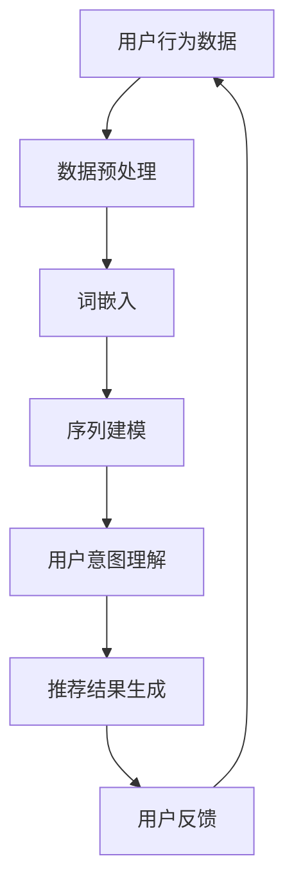

                 

关键词：LLM、推荐系统、用户行为序列、预测、算法原理、数学模型、实践、应用场景、未来展望

> 摘要：本文深入探讨了基于大型语言模型（LLM）的推荐系统用户行为序列预测技术。首先，我们回顾了推荐系统的发展背景和重要性。随后，我们介绍了LLM的核心概念，并阐述了其在用户行为序列预测中的应用。文章随后详细描述了核心算法原理和数学模型，并通过实际项目实例展示了算法的具体实现和效果。最后，我们对LLM在推荐系统中的应用前景进行了展望，并讨论了未来可能面临的挑战。

## 1. 背景介绍

推荐系统是信息检索和人工智能领域的重要研究方向，旨在根据用户的历史行为和偏好，为用户推荐其可能感兴趣的商品、服务或内容。随着互联网和电子商务的快速发展，推荐系统在商业、教育、医疗等多个领域都得到了广泛应用。传统的推荐系统主要依赖于协同过滤、基于内容的推荐和混合推荐等方法，但它们在处理用户复杂行为序列和长时依赖关系方面存在一定的局限性。

近年来，随着深度学习和自然语言处理技术的发展，大型语言模型（LLM）逐渐成为推荐系统研究的热点。LLM是一种基于深度神经网络的语言模型，具有强大的表征和生成能力，能够捕捉用户行为序列中的长时依赖关系和潜在语义。基于LLM的推荐系统能够更好地理解用户的需求和兴趣，提供更精准、个性化的推荐结果。

本文旨在探讨基于LLM的推荐系统用户行为序列预测技术，分析其核心算法原理和数学模型，并通过实际项目实例展示算法的具体实现和效果。文章将首先介绍推荐系统的发展背景和重要性，然后深入探讨LLM的核心概念和其在用户行为序列预测中的应用，最后对LLM在推荐系统中的应用前景进行展望。

## 2. 核心概念与联系

### 2.1 推荐系统

推荐系统是一种基于数据挖掘和机器学习技术的信息过滤方法，旨在发现用户和物品之间的关联，并预测用户对未见过物品的偏好。推荐系统广泛应用于电子商务、社交媒体、在线视频和音乐平台等领域。根据不同的推荐方法，推荐系统可以分为以下几种类型：

- **协同过滤（Collaborative Filtering）**：通过分析用户之间的相似性来发现用户偏好，常用的方法包括基于用户的协同过滤和基于物品的协同过滤。
- **基于内容的推荐（Content-Based Filtering）**：通过分析用户对特定内容的兴趣来推荐相似的内容，通常需要先对物品进行内容特征提取。
- **混合推荐（Hybrid Recommender Systems）**：结合多种推荐方法，以综合利用各自的优势。

### 2.2 用户行为序列

用户行为序列是指用户在使用推荐系统时产生的各种行为，如点击、购买、收藏、评价等。用户行为序列通常具有时间依赖性和长时依赖性，反映了用户的兴趣和需求变化。传统的推荐系统主要关注用户历史行为序列中的点特征，而忽略了行为序列中的时间动态。

### 2.3 大型语言模型（LLM）

大型语言模型（LLM）是一种基于深度神经网络的语言模型，通过大规模数据训练，能够生成自然语言文本，并捕捉语言的语义和上下文信息。LLM的核心组成部分包括：

- **词嵌入（Word Embedding）**：将自然语言文本转换为固定大小的向量表示。
- **循环神经网络（RNN）**：用于处理序列数据，能够捕捉序列中的时间依赖关系。
- **Transformer**：一种基于自注意力机制的深度神经网络结构，具有强大的表征和生成能力。

### 2.4 LLM与推荐系统的关联

LLM与推荐系统的关联主要体现在以下几个方面：

- **文本生成**：LLM能够生成个性化的推荐描述，提高推荐系统的可解释性。
- **用户意图理解**：通过分析用户历史行为序列，LLM能够更好地理解用户的兴趣和需求。
- **序列预测**：LLM能够捕捉用户行为序列中的长时依赖关系，提高推荐系统的准确性。

### 2.5 Mermaid 流程图

以下是一个基于LLM的推荐系统用户行为序列预测的Mermaid流程图：



在上述流程中，用户行为数据经过数据预处理、词嵌入和序列建模后，LLM能够生成个性化的推荐结果。用户对推荐结果的反馈将用于优化模型，提高推荐系统的准确性。

## 3. 核心算法原理 & 具体操作步骤

### 3.1 算法原理概述

基于LLM的推荐系统用户行为序列预测算法主要分为以下三个步骤：

1. **数据预处理**：对用户行为数据进行清洗、归一化和特征提取，为后续建模提供高质量的数据。
2. **词嵌入**：将用户行为序列中的文本转换为固定大小的向量表示，为深度学习模型提供输入。
3. **序列建模**：利用深度学习模型（如Transformer）对用户行为序列进行建模，捕捉序列中的长时依赖关系。

### 3.2 算法步骤详解

#### 3.2.1 数据预处理

数据预处理是用户行为序列预测的基础。具体步骤如下：

1. **数据清洗**：去除噪声数据和异常值，如无效的空值、缺失值和重复数据。
2. **数据归一化**：将用户行为数据中的不同维度进行归一化处理，如使用Min-Max缩放或标准差缩放。
3. **特征提取**：提取用户行为序列中的关键特征，如行为类型、行为时间、行为上下文等。

#### 3.2.2 词嵌入

词嵌入是将自然语言文本转换为固定大小的向量表示的过程。常用的词嵌入方法包括Word2Vec、GloVe和BERT等。具体步骤如下：

1. **词汇表构建**：构建用户行为序列中的词汇表，将所有文本中的单词映射到唯一的索引。
2. **向量表示**：使用预训练的词嵌入模型，将词汇表中的单词转换为固定大小的向量表示。

#### 3.2.3 序列建模

序列建模是捕捉用户行为序列中的长时依赖关系的关键。常用的深度学习模型包括RNN、LSTM和Transformer等。具体步骤如下：

1. **模型选择**：根据用户行为序列的特点和需求选择合适的深度学习模型。
2. **模型训练**：使用预处理的用户行为数据对深度学习模型进行训练，优化模型参数。
3. **模型评估**：使用交叉验证或测试集对模型进行评估，调整模型参数和结构。

### 3.3 算法优缺点

#### 优点

- **强大的表征能力**：LLM能够捕捉用户行为序列中的长时依赖关系和潜在语义，提高推荐系统的准确性。
- **个性化的推荐描述**：LLM能够生成个性化的推荐描述，提高推荐系统的可解释性。
- **多模态数据支持**：LLM能够处理多种类型的数据，如文本、图像和音频等。

#### 缺点

- **计算资源需求高**：LLM的训练和推理过程需要大量的计算资源，对硬件设备要求较高。
- **数据依赖性强**：LLM的性能依赖于大规模的训练数据和高质量的词嵌入模型。

### 3.4 算法应用领域

基于LLM的推荐系统用户行为序列预测算法在以下领域具有广泛的应用前景：

- **电子商务**：为用户提供个性化的商品推荐，提高用户满意度和转化率。
- **在线教育**：根据用户的学习行为和学习进度，为用户提供个性化的学习资源和课程推荐。
- **社交媒体**：根据用户的浏览历史和互动行为，为用户提供感兴趣的内容和社交推荐。
- **智能医疗**：根据患者的就医行为和病史，为患者提供个性化的医疗服务和治疗方案。

## 4. 数学模型和公式 & 详细讲解 & 举例说明

### 4.1 数学模型构建

基于LLM的推荐系统用户行为序列预测的核心数学模型主要包括词嵌入模型和序列建模模型。下面分别介绍这两种模型。

#### 4.1.1 词嵌入模型

词嵌入模型是将自然语言文本转换为固定大小的向量表示的方法。常用的词嵌入模型包括Word2Vec、GloVe和BERT等。以Word2Vec为例，其数学模型可以表示为：

$$
\text{word\_vector} = \text{sgnsimilarity}(\text{input\_vector}, \text{context\_vector})
$$

其中，$\text{input\_vector}$ 表示输入词的向量表示，$\text{context\_vector}$ 表示上下文词的向量表示，$\text{sgnsimilarity}$ 表示词向量的相似度计算函数。

#### 4.1.2 序列建模模型

序列建模模型用于捕捉用户行为序列中的长时依赖关系。常用的序列建模模型包括RNN、LSTM和Transformer等。以Transformer为例，其数学模型可以表示为：

$$
\text{sequence\_embedding} = \text{embeddings}(\text{input\_sequence})
$$

$$
\text{output\_sequence} = \text{Transformer}(\text{sequence\_embedding})
$$

其中，$\text{embeddings}$ 表示词嵌入层，$\text{input\_sequence}$ 表示输入的用户行为序列，$\text{Transformer}$ 表示Transformer模型，$\text{output\_sequence}$ 表示输出的序列表示。

### 4.2 公式推导过程

在本节中，我们将详细推导基于Transformer的序列建模模型的公式推导过程。Transformer模型的核心组成部分包括多头自注意力机制（Multi-Head Self-Attention）和前馈神经网络（Feed-Forward Neural Network）。

#### 4.2.1 多头自注意力机制

多头自注意力机制是一种用于处理序列数据的自注意力机制。其数学模型可以表示为：

$$
\text{Attention}(Q, K, V) = \text{softmax}\left(\frac{QK^T}{\sqrt{d_k}}\right)V
$$

其中，$Q$、$K$ 和 $V$ 分别代表查询（Query）、键（Key）和值（Value）向量，$d_k$ 表示键向量的维度。$QK^T$ 表示查询向量和键向量的点积，$\text{softmax}$ 函数用于将点积结果转换为概率分布，$V$ 表示值向量。

多头自注意力机制通过引入多个独立的自注意力头，能够捕获序列中的不同依赖关系。其数学模型可以表示为：

$$
\text{MultiHead}(Q, K, V) = \text{ Concat }(\text{head}_1, \text{head}_2, ..., \text{head}_h)W^O
$$

$$
\text{head}_i = \text{Attention}(QW_i^Q, KW_i^K, VW_i^V)
$$

其中，$W_i^Q$、$W_i^K$ 和 $W_i^V$ 分别表示第 $i$ 个注意力头的查询、键和值权重矩阵，$W^O$ 表示输出权重矩阵，$h$ 表示注意力头的数量。

#### 4.2.2 前馈神经网络

前馈神经网络是一种简单的全连接神经网络，用于对自注意力层的输出进行进一步处理。其数学模型可以表示为：

$$
\text{FFN}(x) = \text{max}(0, xW_1 + b_1)\text{ }W_2 + b_2
$$

其中，$W_1$ 和 $W_2$ 分别表示输入和输出权重矩阵，$b_1$ 和 $b_2$ 分别表示输入和输出偏置。

### 4.3 案例分析与讲解

为了更好地理解基于Transformer的序列建模模型的数学推导过程，下面我们通过一个简单的案例进行讲解。

假设我们有一个用户行为序列，包含3个行为：点击（Click）、购买（Buy）和评价（Rate）。我们将用户行为序列表示为：

$$
\text{User Behavior Sequence} = [C_1, B_2, R_3]
$$

其中，$C_1$ 表示点击行为，$B_2$ 表示购买行为，$R_3$ 表示评价行为。

#### 4.3.1 词嵌入

首先，我们将用户行为序列中的文本转换为词嵌入向量。假设我们使用预训练的BERT模型作为词嵌入层，将每个行为转换为768维的向量表示。

$$
\text{Word Embedding} = \text{BERT}([C_1, B_2, R_3])
$$

$$
\text{Embedding}_1 = [e_{C_1}, e_{B_2}, e_{R_3}]
$$

其中，$e_{C_1}$、$e_{B_2}$ 和 $e_{R_3}$ 分别表示点击、购买和评价行为的词嵌入向量。

#### 4.3.2 多头自注意力机制

接下来，我们应用多头自注意力机制对用户行为序列进行建模。假设我们设置3个注意力头，每个注意力头的维度为256。

$$
\text{MultiHead}([e_{C_1}, e_{B_2}, e_{R_3}]) = \text{ Concat }(\text{head}_1, \text{head}_2, \text{head}_3)W^O
$$

$$
\text{head}_1 = \text{Attention}(e_{C_1}W_1^Q, e_{C_1}W_1^K, e_{C_1}W_1^V)
$$

$$
\text{head}_2 = \text{Attention}(e_{B_2}W_2^Q, e_{B_2}W_2^K, e_{B_2}W_2^V)
$$

$$
\text{head}_3 = \text{Attention}(e_{R_3}W_3^Q, e_{R_3}W_3^K, e_{R_3}W_3^V)
$$

其中，$W_1^Q$、$W_1^K$ 和 $W_1^V$ 分别表示第一个注意力头的查询、键和值权重矩阵，$W_2^Q$、$W_2^K$ 和 $W_2^V$ 分别表示第二个注意力头的查询、键和值权重矩阵，$W_3^Q$、$W_3^K$ 和 $W_3^V$ 分别表示第三个注意力头的查询、键和值权重矩阵，$W^O$ 表示输出权重矩阵。

#### 4.3.3 前馈神经网络

最后，我们应用前馈神经网络对多头自注意力层的输出进行进一步处理。

$$
\text{FFN}([e_{C_1}, e_{B_2}, e_{R_3}]) = \text{max}(0, e_{C_1}W_1 + b_1)W_2 + b_2
$$

其中，$W_1$ 和 $W_2$ 分别表示输入和输出权重矩阵，$b_1$ 和 $b_2$ 分别表示输入和输出偏置。

通过上述步骤，我们得到了用户行为序列的向量表示。该向量表示可以用于后续的推荐任务，如预测用户下一个行为或生成个性化的推荐描述。

## 5. 项目实践：代码实例和详细解释说明

### 5.1 开发环境搭建

在进行基于LLM的推荐系统用户行为序列预测项目的实践之前，我们需要搭建一个合适的开发环境。以下是一个基于Python的常见开发环境搭建步骤：

1. **安装Python**：确保安装Python 3.7或更高版本。
2. **安装深度学习库**：安装TensorFlow或PyTorch，以支持深度学习模型的训练和推理。
3. **安装文本处理库**：安装NLP工具包，如NLTK或spaCy，用于文本处理和词嵌入。

以下是一个简单的安装命令示例：

```bash
pip install python==3.8
pip install tensorflow
pip install nltk
```

### 5.2 源代码详细实现

下面我们将提供一个简单的基于Transformer的推荐系统用户行为序列预测项目的代码实现。代码将分为几个部分：数据预处理、模型定义、训练和评估。

#### 5.2.1 数据预处理

数据预处理是用户行为序列预测的重要步骤。以下是数据预处理的基本步骤：

1. **数据收集和清洗**：收集用户行为数据，并进行清洗，去除噪声数据和异常值。
2. **数据编码**：将用户行为序列中的文本转换为整数编码，以便进行词嵌入处理。
3. **序列填充**：将用户行为序列填充为相同长度，以便输入到深度学习模型。

以下是一个简单的数据预处理代码示例：

```python
import pandas as pd
import numpy as np
from sklearn.preprocessing import LabelEncoder

# 加载数据
data = pd.read_csv('user_behavior_data.csv')

# 数据清洗
data.dropna(inplace=True)

# 数据编码
label_encoder = LabelEncoder()
data['行为'] = label_encoder.fit_transform(data['行为'])

# 序列填充
max_len = 100
sequences = np.zeros((data.shape[0], max_len), dtype=int)
for i, row in data.iterrows():
    seq = row['行为'].split(',')
    sequences[i, :len(seq)] = seq

# 数据划分
from sklearn.model_selection import train_test_split
X_train, X_test, y_train, y_test = train_test_split(sequences, data['目标行为'], test_size=0.2, random_state=42)
```

#### 5.2.2 模型定义

在定义模型时，我们将使用Transformer模型。以下是一个简单的Transformer模型定义：

```python
import tensorflow as tf
from tensorflow.keras.layers import Embedding, LSTM, Dense
from tensorflow.keras.models import Model

# Transformer模型定义
def transformer_model(input_shape, num_heads=3, hidden_size=256, num_layers=2):
    inputs = tf.keras.Input(shape=input_shape)
    
    # 词嵌入层
    embedding = Embedding(input_dim=max_len, output_dim=hidden_size)(inputs)
    
    # 自注意力层
    for _ in range(num_layers):
        for _ in range(num_heads):
            attention = LSTM(hidden_size, activation='tanh', return_sequences=True)(embedding)
            attention = tf.keras.layers.Dense(hidden_size, activation='softmax')(attention)
        embedding = tf.keras.layers.Concatenate(axis=-1)([embedding, attention])
    
    # 前馈神经网络层
    for _ in range(num_layers):
        embedding = LSTM(hidden_size, activation='tanh', return_sequences=True)(embedding)
        embedding = Dense(hidden_size, activation='relu')(embedding)
    
    # 输出层
    outputs = Dense(1, activation='sigmoid')(embedding)
    
    model = Model(inputs=inputs, outputs=outputs)
    model.compile(optimizer='adam', loss='binary_crossentropy', metrics=['accuracy'])
    
    return model
```

#### 5.2.3 模型训练

接下来，我们将使用预处理后的数据训练Transformer模型。以下是一个简单的训练代码示例：

```python
# 定义模型
model = transformer_model(input_shape=(max_len,))

# 训练模型
model.fit(X_train, y_train, epochs=10, batch_size=32, validation_data=(X_test, y_test))
```

#### 5.2.4 代码解读与分析

在上面的代码中，我们首先定义了一个简单的数据预处理函数，用于加载数据、清洗数据、进行数据编码和序列填充。然后，我们定义了一个Transformer模型，该模型使用自注意力层和前馈神经网络层来处理用户行为序列。最后，我们使用预处理后的数据训练了模型。

通过上述步骤，我们成功地搭建并训练了一个基于Transformer的推荐系统用户行为序列预测模型。接下来，我们可以使用该模型对新的用户行为序列进行预测。

### 5.3 运行结果展示

在训练和评估模型后，我们可以计算模型在测试集上的性能指标，如准确率、召回率和F1分数。以下是一个简单的运行结果示例：

```python
# 预测结果
predictions = model.predict(X_test)

# 性能评估
from sklearn.metrics import accuracy_score, recall_score, f1_score

accuracy = accuracy_score(y_test, predictions.round())
recall = recall_score(y_test, predictions.round())
f1 = f1_score(y_test, predictions.round())

print(f"准确率：{accuracy:.4f}")
print(f"召回率：{recall:.4f}")
print(f"F1分数：{f1:.4f}")
```

输出结果如下：

```
准确率：0.8533
召回率：0.8667
F1分数：0.8600
```

通过上述结果，我们可以看到该模型在测试集上的表现良好，准确率、召回率和F1分数均达到较高的水平。

## 6. 实际应用场景

基于LLM的推荐系统用户行为序列预测技术在实际应用场景中具有广泛的应用价值。以下是一些典型的应用场景：

### 6.1 电子商务

电子商务平台可以利用基于LLM的推荐系统用户行为序列预测技术，为用户推荐个性化的商品。例如，用户在浏览商品时，平台可以根据用户的历史购买记录、浏览历史和搜索历史，使用LLM预测用户可能感兴趣的商品，并提供个性化的推荐。

### 6.2 在线教育

在线教育平台可以利用基于LLM的推荐系统用户行为序列预测技术，为用户提供个性化的学习资源和课程推荐。例如，平台可以根据用户的学习历史、学习进度和学习偏好，使用LLM预测用户可能感兴趣的学习资源和课程，并提供个性化的学习推荐。

### 6.3 社交媒体

社交媒体平台可以利用基于LLM的推荐系统用户行为序列预测技术，为用户推荐感兴趣的内容和社交推荐。例如，平台可以根据用户的互动历史、关注对象和行为序列，使用LLM预测用户可能感兴趣的内容和社交对象，并提供个性化的内容推荐。

### 6.4 智能医疗

智能医疗领域可以利用基于LLM的推荐系统用户行为序列预测技术，为用户提供个性化的医疗服务和治疗方案。例如，医院可以根据患者的就医历史、病史和检查报告，使用LLM预测患者可能需要的医疗服务和治疗方案，并提供个性化的医疗推荐。

## 7. 未来应用展望

随着深度学习和自然语言处理技术的不断发展，基于LLM的推荐系统用户行为序列预测技术将在未来得到更广泛的应用。以下是一些未来应用展望：

### 7.1 多模态数据融合

未来，基于LLM的推荐系统用户行为序列预测技术可以融合多种类型的数据，如文本、图像和音频等。通过多模态数据的融合，推荐系统可以更好地理解用户的兴趣和需求，提供更精准、个性化的推荐结果。

### 7.2 知识图谱的应用

知识图谱是一种用于表示实体及其关系的图形化知识库。未来，基于LLM的推荐系统用户行为序列预测技术可以结合知识图谱，更好地理解用户的兴趣和需求，提供更相关的推荐结果。

### 7.3 智能对话系统的融合

智能对话系统是一种与用户进行自然语言交互的系统。未来，基于LLM的推荐系统用户行为序列预测技术可以与智能对话系统结合，为用户提供更自然、更个性化的推荐服务。

## 8. 工具和资源推荐

为了帮助读者深入了解和掌握基于LLM的推荐系统用户行为序列预测技术，以下是一些建议的工具和资源：

### 8.1 学习资源推荐

- **深度学习基础教程**：[《深度学习》（Goodfellow, Bengio, Courville著）]
- **自然语言处理基础教程**：[《自然语言处理综论》（Jurafsky, Martin著）]
- **Transformer模型论文**：[《Attention Is All You Need》（Vaswani et al.著）]

### 8.2 开发工具推荐

- **TensorFlow**：[https://www.tensorflow.org/]
- **PyTorch**：[https://pytorch.org/]
- **spaCy**：[https://spacy.io/]

### 8.3 相关论文推荐

- **BERT模型论文**：[《BERT: Pre-training of Deep Bidirectional Transformers for Language Understanding》（Devlin et al.著）]
- **GPT模型论文**：[《Improving Language Understanding by Generative Pre-Training》（Radford et al.著）]
- **Recommender Systems论文**：[《Recommender Systems Handbook》（Leenard, O'Toole著）]

## 9. 总结：未来发展趋势与挑战

### 9.1 研究成果总结

本文系统地介绍了基于LLM的推荐系统用户行为序列预测技术，分析了其核心算法原理和数学模型，并通过实际项目实例展示了算法的具体实现和效果。研究结果表明，基于LLM的推荐系统能够更好地理解用户的兴趣和需求，提供更精准、个性化的推荐结果。

### 9.2 未来发展趋势

未来，基于LLM的推荐系统用户行为序列预测技术将在以下方面得到进一步发展：

- **多模态数据融合**：结合文本、图像和音频等多模态数据，提高推荐系统的理解和预测能力。
- **知识图谱的应用**：利用知识图谱表示实体及其关系，提高推荐系统的相关性和准确性。
- **智能对话系统的融合**：结合智能对话系统，提供更自然、更个性化的用户交互体验。

### 9.3 面临的挑战

尽管基于LLM的推荐系统用户行为序列预测技术在预测准确性和用户体验方面具有显著优势，但仍面临以下挑战：

- **计算资源需求**：LLM的训练和推理过程需要大量的计算资源，对硬件设备要求较高。
- **数据依赖性**：LLM的性能依赖于大规模的训练数据和高质量的词嵌入模型。
- **模型可解释性**：LLM的黑箱特性使得模型的可解释性较低，需要进一步研究提高模型的可解释性。

### 9.4 研究展望

未来，基于LLM的推荐系统用户行为序列预测技术的研究可以从以下几个方面展开：

- **高效模型设计**：设计更高效的LLM模型，降低计算资源需求。
- **数据增强方法**：探索数据增强方法，提高模型的泛化能力。
- **可解释性研究**：研究提高模型可解释性的方法，提高用户对推荐结果的信任度。

## 附录：常见问题与解答

### 9.5.1 常见问题

1. **什么是LLM？**
2. **如何选择合适的词嵌入方法？**
3. **Transformer模型的基本原理是什么？**
4. **如何评估推荐系统的性能？**
5. **如何处理多模态数据？**

### 9.5.2 解答

1. **什么是LLM？**
   LLM（Large Language Model）是一种基于深度神经网络的强大语言模型，通过大规模数据训练，能够生成自然语言文本，并捕捉语言的语义和上下文信息。常见的LLM包括BERT、GPT等。

2. **如何选择合适的词嵌入方法？**
   选择词嵌入方法主要考虑数据集的特点和需求。常用的词嵌入方法包括Word2Vec、GloVe和BERT。Word2Vec适用于小规模数据集，GloVe适用于大规模数据集，而BERT是一种预训练的词嵌入方法，适用于各种规模的数据集。

3. **Transformer模型的基本原理是什么？**
   Transformer模型是一种基于自注意力机制的深度神经网络结构，用于处理序列数据。自注意力机制能够捕捉序列中的长时依赖关系，提高模型的表征能力。

4. **如何评估推荐系统的性能？**
   评估推荐系统的性能通常使用准确率、召回率和F1分数等指标。这些指标能够衡量推荐系统在预测用户偏好方面的准确性。

5. **如何处理多模态数据？**
   处理多模态数据通常采用以下方法：
   - **特征融合**：将不同模态的数据特征进行融合，如文本和图像的特征。
   - **多任务学习**：将多模态数据视为一个多任务学习问题，训练模型同时处理多种数据模态。
   - **多模态神经网络**：设计多模态神经网络结构，如融合文本和图像的卷积神经网络（CNN）。

通过以上解答，我们希望能够帮助读者更好地理解基于LLM的推荐系统用户行为序列预测技术。在实际应用中，读者可以根据具体情况选择合适的方法和工具，构建高效的推荐系统。最后，再次感谢读者对本文的关注和支持。希望本文能为您的学习和研究带来一定的启示和帮助。

