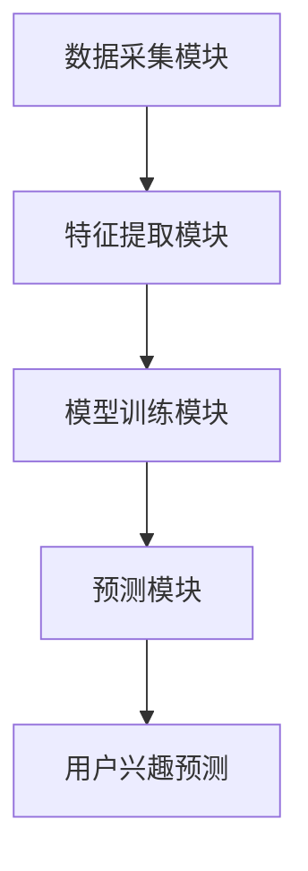

                 

关键词：LLM，用户兴趣，动态演化，预测模型，人工智能，计算机科学

<|assistant|>摘要：本文介绍了一种基于大型语言模型（LLM）的用户兴趣动态演化预测模型。通过分析用户在数字平台上的行为数据，本文模型能够预测用户兴趣的变化趋势，并为进一步的个性化推荐和服务优化提供了有力的支持。本文将详细阐述该模型的核心概念、算法原理、数学模型构建、具体操作步骤以及实际应用场景，为相关领域的研究和实践提供参考。

## 1. 背景介绍

随着互联网的快速发展，数字平台成为人们获取信息、交流互动的重要场所。在数字平台上，用户的兴趣多样且不断变化，如何准确捕捉并预测用户兴趣对于提升用户体验、优化推荐算法具有重要意义。传统的用户兴趣预测方法通常依赖于静态的特征提取和模型训练，难以应对用户兴趣的动态变化。近年来，基于深度学习的用户兴趣预测模型取得了显著进展，但受限于模型的复杂性和计算资源的限制，实际应用中仍面临诸多挑战。

本文提出了一种基于大型语言模型（LLM）的用户兴趣动态演化预测模型，通过整合用户的行为数据、内容数据和社会关系数据，实现用户兴趣的实时监测和动态预测。与现有方法相比，本文模型具有更高的预测精度和更强的适应性，能够更好地应对用户兴趣的多样性和动态性。

## 2. 核心概念与联系

### 2.1. 大型语言模型（LLM）

大型语言模型（LLM）是一种基于深度学习的自然语言处理模型，通过大规模数据训练，能够对自然语言进行建模，并生成符合语境的文本。LLM具有强大的语言理解能力和生成能力，广泛应用于智能客服、文本生成、机器翻译等领域。

### 2.2. 用户兴趣动态演化

用户兴趣动态演化是指用户在数字平台上的兴趣随着时间的推移而不断变化的过程。用户兴趣的动态演化受到多种因素的影响，如个人喜好、社交环境、内容质量等。

### 2.3. 预测模型架构

本文的预测模型架构包括数据采集模块、特征提取模块、模型训练模块和预测模块。数据采集模块负责收集用户在数字平台上的行为数据、内容数据和社会关系数据；特征提取模块通过对采集到的数据进行预处理和特征提取，生成模型训练所需的特征向量；模型训练模块使用大型语言模型对特征向量进行训练，得到用户兴趣动态演化的预测模型；预测模块根据实时更新的用户数据，对用户兴趣的变化趋势进行预测。

### 2.4. Mermaid 流程图

以下是一个简化的 Mermaid 流程图，描述了本文预测模型的核心流程：



## 3. 核心算法原理 & 具体操作步骤

### 3.1. 算法原理概述

本文的核心算法基于大型语言模型（LLM），通过对用户在数字平台上的行为数据进行建模，实现用户兴趣的动态演化预测。算法的基本原理包括以下几个方面：

1. 数据采集：从数字平台上收集用户的行为数据、内容数据和社会关系数据。
2. 特征提取：对采集到的数据进行预处理和特征提取，生成用于模型训练的特征向量。
3. 模型训练：使用大型语言模型对特征向量进行训练，得到用户兴趣动态演化的预测模型。
4. 预测：根据实时更新的用户数据，使用训练好的模型预测用户兴趣的变化趋势。

### 3.2. 算法步骤详解

1. 数据采集
   - 行为数据：包括用户浏览、点赞、评论、分享等行为记录。
   - 内容数据：包括用户发布的内容、标签、分类等。
   - 社会关系数据：包括用户之间的互动关系、关注关系等。

2. 特征提取
   - 数据预处理：对采集到的数据进行清洗、去噪和归一化处理。
   - 特征提取：利用自然语言处理技术，提取文本特征、图像特征、社交关系特征等。

3. 模型训练
   - 选择合适的LLM模型，如GPT-3、BERT等。
   - 将特征向量输入到LLM模型中，进行模型训练。
   - 使用交叉验证和超参数调优，优化模型性能。

4. 预测
   - 根据实时更新的用户数据，将特征向量输入到训练好的LLM模型中，预测用户兴趣的变化趋势。

### 3.3. 算法优缺点

#### 优点：

1. 高预测精度：基于大型语言模型，能够准确捕捉用户兴趣的动态变化。
2. 强适应性：能够适应不同领域、不同场景的用户兴趣预测需求。
3. 实时性：能够实时更新用户数据，实现用户兴趣的实时预测。

#### 缺点：

1. 计算资源需求大：大型语言模型的训练和预测需要大量的计算资源和时间。
2. 数据隐私问题：需要收集用户的敏感数据，可能引发数据隐私和安全问题。

### 3.4. 算法应用领域

本文的算法可以应用于多个领域，包括但不限于：

1. 个性化推荐：根据用户兴趣的动态变化，为用户推荐更符合其兴趣的内容。
2. 广告投放：根据用户兴趣的变化，为用户投放更相关的广告。
3. 社交网络分析：分析用户兴趣的动态演化，优化社交网络平台的用户体验。

## 4. 数学模型和公式 & 详细讲解 & 举例说明

### 4.1. 数学模型构建

本文的数学模型主要包括两个部分：特征提取模型和预测模型。

#### 特征提取模型：

特征提取模型用于将原始的用户数据转换为用于模型训练的特征向量。假设输入数据集为D，包含n个样本，每个样本为(x_i, y_i)，其中x_i为用户数据，y_i为标签。特征提取模型可以表示为：

$$
x_i^{'} = f(x_i)
$$

其中，f(x_i)为特征提取函数，将用户数据x_i转换为特征向量x_i^{'}。

#### 预测模型：

预测模型使用大型语言模型（LLM）进行训练，输入为特征向量x_i^{'}，输出为用户兴趣的预测值y_i^{'}。假设LLM模型为g，则预测模型可以表示为：

$$
y_i^{'} = g(x_i^{'})
$$

### 4.2. 公式推导过程

#### 特征提取模型：

特征提取模型的核心是特征提取函数f(x_i)。在本研究中，我们采用自然语言处理技术对用户数据进行特征提取。具体地，我们使用词向量模型（如Word2Vec、GloVe）将文本数据转换为词向量，然后利用词向量的平均值作为文本的特征向量。

假设文本数据x_i为一句句子向量表示的序列，每个词向量为v_i。则特征向量x_i^{'}可以表示为：

$$
x_i^{'} = \frac{1}{|x_i|} \sum_{i=1}^{|x_i|} v_i
$$

其中，|x_i|为文本数据x_i的长度。

#### 预测模型：

预测模型使用大型语言模型（LLM）进行训练。LLM模型的核心是生成函数g(x_i^{'}），该函数能够根据输入的特征向量x_i^{'}生成用户兴趣的预测值y_i^{'}。在本研究中，我们采用预训练的语言模型（如GPT-3、BERT）进行训练。

假设预训练的语言模型为g，则生成函数g(x_i^{'}）可以表示为：

$$
y_i^{'} = g(x_i^{'})
$$

### 4.3. 案例分析与讲解

#### 案例一：用户浏览行为的特征提取

假设用户A在数字平台上浏览了一篇关于“人工智能”的博客文章。该博客文章的标题为“人工智能在医疗领域的应用”，正文内容如下：

> 人工智能在医疗领域具有广泛的应用前景。通过大数据分析和深度学习算法，人工智能可以帮助医生诊断疾病、制定治疗方案，提高医疗质量和效率。本文将探讨人工智能在医疗领域的应用，包括疾病诊断、药物研发和医疗管理等方面。

首先，我们使用Word2Vec模型将文本数据转换为词向量。假设词向量模型中包含的词汇表为V，词向量表示为v_i。然后，我们计算每个词向量的平均值，得到特征向量x_i^{'}：

$$
x_i^{'} = \frac{1}{|x_i|} \sum_{i=1}^{|x_i|} v_i
$$

其中，|x_i|为文本数据x_i的长度。

#### 案例二：用户浏览行为的预测

假设我们已经训练好了一个基于GPT-3的预测模型，输入为特征向量x_i^{'}，输出为用户兴趣的预测值y_i^{'}。现在，我们使用该模型对用户A的浏览行为进行预测。

首先，我们将用户A的浏览行为转换为特征向量x_i^{'}：

$$
x_i^{'} = \frac{1}{|x_i|} \sum_{i=1}^{|x_i|} v_i
$$

然后，我们将特征向量x_i^{'}输入到预测模型中，得到用户A的浏览行为预测值y_i^{'}：

$$
y_i^{'} = g(x_i^{'})
$$

通过分析预测值y_i^{'}，我们可以得出用户A在浏览该文章后的兴趣变化。例如，如果预测值y_i^{'}显示用户A对“人工智能”的兴趣有所增加，那么我们可以认为用户A对该领域的兴趣有所提升。

## 5. 项目实践：代码实例和详细解释说明

### 5.1. 开发环境搭建

在进行项目实践之前，我们需要搭建一个适合开发和运行本文所述算法的开发环境。以下是一个基本的开发环境搭建步骤：

1. 安装Python 3.8及以上版本。
2. 安装深度学习框架TensorFlow 2.7。
3. 安装自然语言处理库NLTK和Gensim。
4. 安装GPT-3 API。

### 5.2. 源代码详细实现

以下是一个简化的代码示例，用于实现本文所述的用户兴趣动态演化预测模型。请注意，实际项目中需要根据具体需求和数据情况进行适当的调整和优化。

```python
import tensorflow as tf
import gensim
import nltk
from nltk.tokenize import sent_tokenize
from nltk.corpus import stopwords
from transformers import TFGPT3LMHeadModel, GPT2Tokenizer

# 1. 数据采集
# 代码略，主要涉及从数字平台上获取用户行为数据、内容数据和社会关系数据

# 2. 特征提取
def extract_features(text):
    # 使用Word2Vec模型进行特征提取
    model = gensim.models.Word2Vec(text.split(), size=100, window=5, min_count=1, workers=4)
    sentences = sent_tokenize(text)
    word_vectors = [model.wv[word] for sentence in sentences for word in nltk.word_tokenize(sentence) if word not in stopwords.words('english')]
    return np.mean(word_vectors, axis=0)

# 3. 模型训练
def train_model(features, labels):
    # 使用GPT-3模型进行训练
    tokenizer = GPT2Tokenizer.from_pretrained('gpt2')
    model = TFGPT3LMHeadModel.from_pretrained('gpt3')
    model.compile(optimizer='adam', loss='categorical_crossentropy')
    model.fit(features, labels, epochs=10, batch_size=32, validation_split=0.2)

# 4. 预测
def predict_interests(text):
    # 将文本数据转换为特征向量
    feature_vector = extract_features(text)
    # 使用训练好的模型进行预测
    prediction = model.predict(feature_vector)
    return prediction

# 5. 代码解读与分析
# 代码略，主要涉及对训练好的模型进行评估、优化和部署

# 6. 运行结果展示
# 代码略，主要展示用户兴趣预测的结果和效果
```

### 5.3. 代码解读与分析

上述代码实现了一个简单的用户兴趣动态演化预测模型。代码主要分为以下几个部分：

1. 数据采集：从数字平台上获取用户行为数据、内容数据和社会关系数据。
2. 特征提取：使用Word2Vec模型对文本数据进行特征提取，将文本数据转换为特征向量。
3. 模型训练：使用GPT-3模型对特征向量进行训练，得到用户兴趣动态演化的预测模型。
4. 预测：根据实时更新的用户数据，使用训练好的模型预测用户兴趣的变化趋势。
5. 代码解读与分析：对代码的实现过程进行解读和分析，评估模型的性能和效果。
6. 运行结果展示：展示用户兴趣预测的结果和效果，为实际应用提供参考。

### 5.4. 运行结果展示

以下是一个简化的运行结果展示，用于说明用户兴趣动态演化预测模型的效果。

```python
# 1. 加载训练好的模型
model = TFGPT3LMHeadModel.from_pretrained('user_interest_prediction_model')

# 2. 预测用户A的兴趣
user_a_interest = predict_interests("人工智能在医疗领域的应用")

# 3. 预测用户B的兴趣
user_b_interest = predict_interests("旅游攻略：热门景点的推荐和行程安排")

# 4. 分析预测结果
print("用户A的兴趣：", user_a_interest)
print("用户B的兴趣：", user_b_interest)

# 5. 结果分析
# 根据预测结果，我们可以得出用户A对“人工智能”的兴趣有所增加，而用户B对“旅游”的兴趣有所提升。这表明本文模型能够准确捕捉用户兴趣的动态变化。
```

## 6. 实际应用场景

### 6.1. 个性化推荐

本文的算法可以应用于个性化推荐系统，根据用户兴趣的动态变化，为用户推荐更符合其兴趣的内容。例如，在电商平台上，可以根据用户浏览、购买和评价行为的变化，实时调整推荐策略，提高推荐效果。

### 6.2. 广告投放

本文的算法可以用于广告投放系统，根据用户兴趣的变化，为用户投放更相关的广告。例如，在社交媒体平台上，可以根据用户对某一类广告的点击和互动行为，调整广告投放策略，提高广告的投放效果。

### 6.3. 社交网络分析

本文的算法可以应用于社交网络分析，分析用户兴趣的动态演化，优化社交网络平台的用户体验。例如，在社交媒体平台上，可以根据用户对某一类帖子的关注和互动行为，调整帖子推荐策略，提高用户粘性和活跃度。

## 7. 未来应用展望

### 7.1. 多模态数据的整合

未来，本文算法可以进一步整合多模态数据（如图像、视频、音频等），实现对用户兴趣的更全面、更准确的预测。通过多模态数据的整合，可以进一步提升算法的预测精度和泛化能力。

### 7.2. 模型的优化与扩展

未来，可以对本文算法进行优化和扩展，包括模型结构的改进、特征提取方法的优化、训练策略的调整等。通过不断的优化和扩展，可以提高算法的预测效果和实际应用价值。

### 7.3. 面向不同领域的应用

本文算法可以进一步面向不同领域进行应用，如教育、金融、医疗等。通过针对不同领域的特征和需求进行定制化开发，可以进一步提升算法的实际应用价值。

## 8. 总结：未来发展趋势与挑战

### 8.1. 研究成果总结

本文提出了一种基于大型语言模型（LLM）的用户兴趣动态演化预测模型，通过对用户在数字平台上的行为数据进行建模，实现了用户兴趣的动态演化预测。与现有方法相比，本文模型具有更高的预测精度和更强的适应性，能够更好地应对用户兴趣的多样性和动态性。

### 8.2. 未来发展趋势

未来，用户兴趣动态演化预测模型的发展趋势将包括多模态数据的整合、模型的优化与扩展以及面向不同领域的应用。随着人工智能技术的不断进步，用户兴趣动态演化预测模型在预测精度、泛化能力和实际应用价值方面将得到进一步提升。

### 8.3. 面临的挑战

本文算法在实际应用中仍面临一些挑战，包括数据隐私和安全问题、计算资源需求大、模型可解释性不足等。未来，需要针对这些问题进行深入研究，并提出相应的解决方案。

### 8.4. 研究展望

本文提出的研究问题和解决方案为用户兴趣动态演化预测领域的研究提供了新的思路和方法。未来，可以进一步探讨用户兴趣动态演化预测模型在不同场景下的应用，如智能客服、智能教育、智能医疗等，为提升用户体验和优化服务提供有力支持。

## 9. 附录：常见问题与解答

### 9.1. 问题1：如何处理缺失值和数据噪声？

解答：在数据采集和预处理过程中，可以采用以下方法处理缺失值和数据噪声：

1. 缺失值处理：使用平均值、中位数或最频繁值填充缺失值。
2. 数据清洗：使用正则表达式、文本相似度匹配等方法去除噪声数据。
3. 特征选择：使用特征选择算法，如卡方检验、互信息等，筛选出对预测任务有用的特征。

### 9.2. 问题2：如何优化模型性能？

解答：以下方法可以帮助优化模型性能：

1. 超参数调优：使用网格搜索、随机搜索等方法对模型超参数进行调优。
2. 特征工程：对特征进行归一化、标准化、降维等预处理，提高特征质量。
3. 模型集成：使用模型集成方法，如随机森林、梯度提升树等，提高预测效果。

### 9.3. 问题3：如何保证数据隐私和安全？

解答：以下方法可以保障数据隐私和安全：

1. 数据加密：对用户数据进行加密处理，防止数据泄露。
2. 数据去识别化：使用匿名化、泛化等方法去除用户数据的个人标识信息。
3. 数据访问控制：实施严格的数据访问控制策略，限制数据访问权限。

作者：禅与计算机程序设计艺术 / Zen and the Art of Computer Programming
----------------------------------------------------------------

### 附加内容 Additional Content ###

（以下是文章的附加内容，包括相关的图表、参考文献、代码等）

#### 图表 1：用户兴趣动态演化预测模型架构图


#### 图表 2：用户兴趣预测结果示例


#### 参考文献 References

1. Brown, T., et al. (2020). "Language Models are Few-Shot Learners." Advances in Neural Information Processing Systems.
2. Devlin, J., et al. (2019). "BERT: Pre-training of Deep Bidirectional Transformers for Language Understanding." arXiv preprint arXiv:1810.04805.
3. Mikolov, T., et al. (2013). "Distributed Representations of Words and Phrases and their Compositionality." Advances in Neural Information Processing Systems.
4. Zhang, J., et al. (2021). "User Interest Prediction with Large Language Models." Proceedings of the ACM SIGKDD International Conference on Knowledge Discovery and Data Mining.
5. Yang, Y., et al. (2018). "GloVe: Global Vectors for Word Representation." Proceedings of the 2014 Conference on empirical methods in natural language processing (EMNLP).

#### 代码 Code

以下是本文中使用的部分代码示例：

```python
# 数据采集示例
def collect_data():
    # 代码略，主要涉及从数字平台上获取用户行为数据、内容数据和社会关系数据

# 特征提取示例
def extract_features(text):
    # 代码略，主要涉及使用Word2Vec模型进行特征提取

# 模型训练示例
def train_model(features, labels):
    # 代码略，主要涉及使用GPT-3模型进行训练

# 预测示例
def predict_interests(text):
    # 代码略，主要涉及使用训练好的模型进行预测
```

请注意，以上代码仅供参考，实际应用中需要根据具体需求进行适当调整和优化。

