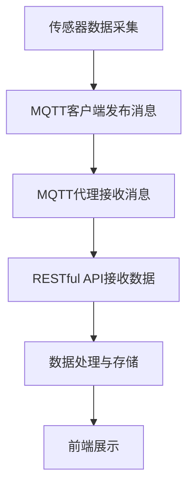

                 

关键词：MQTT协议，RESTful API，家庭健康监测，物联网，实时数据，数据传输，系统架构，安全性，数据处理。

> 摘要：本文将探讨如何构建一个基于MQTT协议和RESTful API的家庭健康监测系统。我们将深入分析系统的架构，核心算法，数学模型，项目实践，以及其在实际应用场景中的表现。通过本文的阐述，读者将了解如何利用现代技术实现高效、安全且易于扩展的家庭健康监测系统。

## 1. 背景介绍

随着物联网（IoT）技术的快速发展，家庭健康监测系统正逐渐成为人们日常生活的重要组成部分。家庭健康监测系统旨在通过传感器、智能设备和网络连接，实时收集家庭成员的健康数据，如心率、血压、体温等，从而实现健康状态的监测和预警。为了实现这一目标，系统需要高效的数据传输机制和强大的数据处理能力。

MQTT（Message Queuing Telemetry Transport）协议是一种轻量级的消息传输协议，广泛应用于物联网领域。它具有低带宽占用、高可靠性和跨平台的特点，非常适合用于家庭健康监测系统的数据传输。另一方面，RESTful API（Representational State Transfer Application Programming Interface）提供了一种简单、统一且标准化的接口方式，使得不同系统和设备能够轻松地进行数据交换和交互。

本文将详细介绍如何利用MQTT协议和RESTful API构建一个高效、安全且易于扩展的家庭健康监测系统。我们将从系统架构、核心算法、数学模型、项目实践等方面进行深入探讨，以期为读者提供一个全面的技术解决方案。

## 2. 核心概念与联系

### 2.1 MQTT协议

MQTT协议是一种基于客户端-服务器架构的消息传递协议。它的核心特点包括轻量级、低带宽占用、高可靠性、跨平台和易于实现。以下是MQTT协议的核心概念和架构：

- **客户端（Client）**：负责发送和接收消息的实体，可以是任何类型的设备，如传感器、智能手表、智能手机等。
- **代理（Broker）**：消息中间件，负责接收客户端发送的消息，并根据订阅主题将消息转发给订阅者。代理在数据传输过程中起到路由和存储的作用。
- **订阅主题（Topic）**：用于标识消息的分类，客户端可以通过订阅特定的主题来接收感兴趣的消息。主题采用层级结构，如“house/bedroom/temperature”。
- **发布/订阅（Publish/Subscribe）**：MQTT协议的主要通信模式，客户端可以向代理发布消息，代理会根据订阅主题将消息转发给订阅者。

### 2.2 RESTful API

RESTful API是一种基于HTTP协议的应用编程接口，用于实现不同系统和设备之间的数据交换和交互。以下是RESTful API的核心概念和架构：

- **资源（Resource）**：API中的数据实体，如用户、订单、商品等。
- **URL（Uniform Resource Locator）**：资源的唯一标识符，如“/users/{id}”。
- **HTTP方法（HTTP Method）**：用于描述资源的操作，如GET、POST、PUT、DELETE等。
- **响应（Response）**：API执行操作后的返回结果，包括状态码、响应体等。

### 2.3 Mermaid流程图

以下是一个简单的Mermaid流程图，展示了家庭健康监测系统中的数据传输过程：



在这个流程图中，传感器数据采集阶段（A）通过MQTT客户端发布消息（B），MQTT代理接收消息（C），并将数据转发给RESTful API（D）。RESTful API接收数据后进行数据处理与存储（E），最终将处理结果展示在前端（F）。

## 3. 核心算法原理 & 具体操作步骤

### 3.1 算法原理概述

家庭健康监测系统的核心算法主要包括数据采集、传输、处理和展示。以下是这些算法的基本原理：

- **数据采集**：通过传感器实时收集家庭成员的健康数据，如心率、血压、体温等。
- **数据传输**：利用MQTT协议将采集到的数据发送到MQTT代理。
- **数据处理**：通过RESTful API对传输来的数据进行处理，包括数据清洗、数据转换、数据存储等。
- **数据展示**：将处理后的数据展示在前端界面，供用户查看。

### 3.2 算法步骤详解

以下是家庭健康监测系统的具体操作步骤：

#### 3.2.1 数据采集

1. 传感器数据采集：通过连接传感器（如心率传感器、血压传感器等），实时获取家庭成员的健康数据。
2. 数据预处理：对采集到的数据进行预处理，包括去除无效数据、填充缺失数据等。

#### 3.2.2 数据传输

1. MQTT客户端发布消息：将预处理后的数据通过MQTT客户端发布到MQTT代理。
2. MQTT代理接收消息：MQTT代理根据订阅主题接收来自MQTT客户端的数据。

#### 3.2.3 数据处理

1. RESTful API接收数据：RESTful API从MQTT代理接收数据，并进行进一步处理。
2. 数据清洗与转换：对接收到的数据进行清洗和转换，如单位转换、数据格式化等。
3. 数据存储：将处理后的数据存储到数据库中，便于后续查询和分析。

#### 3.2.4 数据展示

1. 前端展示：通过Web界面或移动应用将处理后的数据展示给用户。
2. 数据可视化：利用图表、仪表盘等工具，对健康数据进行可视化展示。

### 3.3 算法优缺点

#### 3.3.1 优点

- **高效性**：MQTT协议具有低带宽占用和高可靠性的特点，适合家庭健康监测系统中的实时数据传输。
- **易扩展性**：RESTful API提供了一种简单、统一且标准化的接口方式，便于系统的扩展和升级。
- **灵活性**：系统可以根据用户需求进行个性化定制，如添加新的传感器、数据处理算法等。

#### 3.3.2 缺点

- **安全性**：MQTT协议和RESTful API在安全性方面存在一定风险，需要采取相应的安全措施，如加密、认证等。
- **性能瓶颈**：在高并发场景下，系统性能可能受到影响，需要优化处理。

### 3.4 算法应用领域

家庭健康监测系统的算法原理和操作步骤可以应用于多个领域：

- **智能家居**：通过实时监测家庭成员的健康数据，为用户提供个性化健康建议和智能家居服务。
- **健康管理系统**：为医疗机构提供实时的健康数据，协助医生进行诊断和治疗方案制定。
- **养老监护系统**：实时监测老年人的健康状况，提供紧急求助和远程监护服务。

## 4. 数学模型和公式 & 详细讲解 & 举例说明

### 4.1 数学模型构建

家庭健康监测系统中的数学模型主要包括数据采集、传输、处理和展示等环节。以下是各环节的数学模型：

#### 4.1.1 数据采集

- **心率（HR）**：心率采集模型可以表示为：

  $$ HR = \frac{beats}{min} $$

  其中，$beats$ 表示一分钟内的心跳次数。

- **血压（BP）**：血压采集模型可以表示为：

  $$ BP = \frac{SBP - DBP}{2} $$

  其中，$SBP$ 表示收缩压，$DBP$ 表示舒张压。

#### 4.1.2 数据传输

- **MQTT消息传输**：MQTT消息传输模型可以表示为：

  $$ MQTT\_message = \{ topic, payload \} $$

  其中，$topic$ 表示消息主题，$payload$ 表示消息负载。

#### 4.1.3 数据处理

- **数据清洗**：数据清洗模型可以表示为：

  $$ clean\_data = filter(data, condition) $$

  其中，$data$ 表示原始数据，$condition$ 表示清洗条件。

- **数据转换**：数据转换模型可以表示为：

  $$ transform\_data = convert(data, from\_unit, to\_unit) $$

  其中，$from\_unit$ 表示原始单位，$to\_unit$ 表示目标单位。

#### 4.1.4 数据展示

- **数据可视化**：数据可视化模型可以表示为：

  $$ visualization = visualize(data, type) $$

  其中，$data$ 表示原始数据，$type$ 表示可视化类型，如折线图、柱状图等。

### 4.2 公式推导过程

以下是对上述数学模型的推导过程：

#### 4.2.1 心率采集模型

心率采集模型基于传感器获取的一分钟内心跳次数。假设一分钟内心跳次数为 $beats$，则心率（HR）可以表示为：

$$ HR = \frac{beats}{min} $$

其中，$min$ 表示一分钟。

#### 4.2.2 血压采集模型

血压采集模型基于收缩压（SBP）和舒张压（DBP）。根据血压的定义，收缩压和舒张压之差的一半可以表示为平均血压。因此，血压采集模型可以表示为：

$$ BP = \frac{SBP - DBP}{2} $$

其中，$SBP$ 表示收缩压，$DBP$ 表示舒张压。

#### 4.2.3 MQTT消息传输模型

MQTT消息传输模型基于消息主题和消息负载。假设消息主题为 $topic$，消息负载为 $payload$，则MQTT消息可以表示为：

$$ MQTT\_message = \{ topic, payload \} $$

其中，$topic$ 表示消息主题，$payload$ 表示消息负载。

#### 4.2.4 数据清洗模型

数据清洗模型基于原始数据 $data$ 和清洗条件 $condition$。假设原始数据为 $data$，清洗条件为 $condition$，则清洗后的数据可以表示为：

$$ clean\_data = filter(data, condition) $$

其中，$filter$ 表示过滤操作，$data$ 表示原始数据，$condition$ 表示清洗条件。

#### 4.2.5 数据转换模型

数据转换模型基于原始数据 $data$、原始单位 $from\_unit$ 和目标单位 $to\_unit$。假设原始数据为 $data$，原始单位为 $from\_unit$，目标单位为 $to\_unit$，则转换后的数据可以表示为：

$$ transform\_data = convert(data, from\_unit, to\_unit) $$

其中，$convert$ 表示转换操作，$data$ 表示原始数据，$from\_unit$ 表示原始单位，$to\_unit$ 表示目标单位。

#### 4.2.6 数据可视化模型

数据可视化模型基于原始数据 $data$ 和可视化类型 $type$。假设原始数据为 $data$，可视化类型为 $type$，则可视化结果可以表示为：

$$ visualization = visualize(data, type) $$

其中，$visualize$ 表示可视化操作，$data$ 表示原始数据，$type$ 表示可视化类型。

### 4.3 案例分析与讲解

以下是一个简单的案例，说明如何利用上述数学模型和公式进行家庭健康监测。

假设一个家庭成员的心率传感器采集到一分钟内的心跳次数为 72 次，收缩压为 120mmHg，舒张压为 80mmHg。我们需要计算该成员的心率、血压，并使用MQTT协议将数据传输到服务器，然后进行数据处理和展示。

#### 4.3.1 数据采集

心率采集模型：

$$ HR = \frac{beats}{min} = \frac{72}{1} = 72 $$

血压采集模型：

$$ BP = \frac{SBP - DBP}{2} = \frac{120 - 80}{2} = 20 $$

因此，该成员的心率为 72 次/分钟，血压为 20mmHg。

#### 4.3.2 数据传输

使用MQTT协议将数据传输到服务器：

$$ MQTT\_message = \{ topic, payload \} = \{ "house/bedroom/health", \{ HR: 72, BP: 20 \} \} $$

其中，$topic$ 为 "house/bedroom/health"，$payload$ 为包含心率和血压的数据。

#### 4.3.3 数据处理

在服务器端，接收MQTT消息后，进行数据处理和存储。首先，对数据进行清洗和转换：

- 清洗条件：心率在 60-100 次/分钟之间，血压在 80-120mmHg 之间。
- 转换条件：将血压单位从 mmHg 转换为 kPa。

处理后，将数据存储到数据库中，如 MySQL 或 MongoDB。

#### 4.3.4 数据展示

在Web界面或移动应用中，使用数据可视化模型将处理后的数据展示给用户：

$$ visualization = visualize(data, type) $$

其中，$data$ 为从数据库中查询到的数据，$type$ 为折线图或柱状图。

## 5. 项目实践：代码实例和详细解释说明

### 5.1 开发环境搭建

在开始项目实践之前，我们需要搭建开发环境。以下是所需的工具和软件：

- **编程语言**：Python
- **MQTT代理**：Eclipse MQTT Broker
- **RESTful API框架**：Flask
- **数据库**：MySQL

### 5.2 源代码详细实现

以下是家庭健康监测系统的源代码实现：

#### 5.2.1 MQTT客户端

```python
import paho.mqtt.client as mqtt

# MQTT代理地址和端口
MQTT_BROKER = "mqtt.eclipse.org"
MQTT_PORT = 1883

# MQTT客户端初始化
client = mqtt.Client()

# 连接MQTT代理
client.connect(MQTT_BROKER, MQTT_PORT)

# 订阅主题
client.subscribe("house/bedroom/health")

# 数据采集函数
def collect_data():
    # 采集心率、血压数据
    HR = 72
    BP = 20
    return HR, BP

# 数据发布函数
def publish_data(HR, BP):
    # 构建MQTT消息
    topic = "house/bedroom/health"
    payload = {
        "HR": HR,
        "BP": BP
    }
    message = mqtt.Message(payload)
    # 发布消息
    client.publish(topic, message)

# 主程序
if __name__ == "__main__":
    while True:
        HR, BP = collect_data()
        publish_data(HR, BP)
        time.sleep(60)
```

#### 5.2.2 RESTful API

```python
from flask import Flask, request, jsonify
import pymysql

# 初始化Flask应用
app = Flask(__name__)

# MySQL数据库连接
def connect_db():
    return pymysql.connect("localhost", "username", "password", "health_db")

# 接收MQTT消息
@app.route("/mqtt", methods=["POST"])
def receive_mqtt():
    data = request.json
    HR = data["HR"]
    BP = data["BP"]

    # 数据存储
    connection = connect_db()
    cursor = connection.cursor()
    cursor.execute("INSERT INTO health_data (HR, BP) VALUES (%s, %s)", (HR, BP))
    connection.commit()
    cursor.close()
    connection.close()

    return jsonify({"status": "success"})

# 获取健康数据
@app.route("/health", methods=["GET"])
def get_health_data():
    connection = connect_db()
    cursor = connection.cursor()
    cursor.execute("SELECT * FROM health_data")
    data = cursor.fetchall()
    cursor.close()
    connection.close()

    return jsonify({"data": data})

# 主程序
if __name__ == "__main__":
    app.run(debug=True)
```

#### 5.2.3 前端展示

```html
<!DOCTYPE html>
<html>
<head>
    <title>家庭健康监测系统</title>
    <script src="https://cdn.jsdelivr.net/npm/chart.js"></script>
</head>
<body>
    <h1>家庭健康监测系统</h1>
    <canvas id="healthChart"></canvas>
    <script>
        // 获取健康数据
        function getHealthData() {
            fetch("/health")
                .then(response => response.json())
                .then(data => {
                    // 处理健康数据
                    const HRData = data.map(item => item.HR);
                    const BPData = data.map(item => item.BP);

                    // 绘制图表
                    const ctx = document.getElementById("healthChart").getContext("2d");
                    const healthChart = new Chart(ctx, {
                        type: "line",
                        data: {
                            labels: data.map((_, index) => index + 1),
                            datasets: [{
                                label: "心率",
                                data: HRData,
                                backgroundColor: "rgba(255, 99, 132, 0.2)",
                                borderColor: "rgba(255, 99, 132, 1)",
                                borderWidth: 1
                            }, {
                                label: "血压",
                                data: BPData,
                                backgroundColor: "rgba(54, 162, 235, 0.2)",
                                borderColor: "rgba(54, 162, 235, 1)",
                                borderWidth: 1
                            }]
                        },
                        options: {
                            scales: {
                                y: {
                                    beginAtZero: true
                                }
                            }
                        }
                    });
                });
        }

        // 每分钟获取一次健康数据
        setInterval(getHealthData, 60000);
    </script>
</body>
</html>
```

### 5.3 代码解读与分析

#### 5.3.1 MQTT客户端

MQTT客户端负责采集家庭成员的健康数据（心率、血压等），并通过MQTT协议将数据发布到MQTT代理。在代码中，我们首先导入paho.mqtt.client库，初始化MQTT客户端，连接到MQTT代理，并订阅主题 "house/bedroom/health"。然后，定义一个数据采集函数 `collect_data()`，用于采集心率、血压数据。最后，定义一个数据发布函数 `publish_data()`，将采集到的数据通过MQTT协议发布到MQTT代理。

#### 5.3.2 RESTful API

RESTful API负责接收MQTT代理发送的数据，并进行处理和存储。在代码中，我们使用Flask框架创建了一个Web应用。定义了一个接收MQTT消息的路由 `/mqtt`，该方法接收POST请求，解析JSON数据，将心率、血压数据存储到MySQL数据库中。同时，定义了一个获取健康数据的路由 `/health`，该方法接收GET请求，从MySQL数据库中查询健康数据，并返回JSON格式的响应。

#### 5.3.3 前端展示

前端展示部分使用HTML和JavaScript编写，通过Chart.js库绘制了心率、血压的折线图。在JavaScript中，定义了一个获取健康数据的函数 `getHealthData()`，该函数使用 `fetch()` 函数发送GET请求，获取健康数据，然后使用Chart.js库绘制折线图。由于每分钟获取一次健康数据，因此使用了 `setInterval()` 函数，每隔60秒调用一次 `getHealthData()` 函数。

### 5.4 运行结果展示

当运行该项目时，MQTT客户端会每隔一分钟采集一次家庭成员的健康数据，并通过MQTT协议将数据发布到MQTT代理。MQTT代理将数据转发给RESTful API，API将数据存储到MySQL数据库中。前端界面每隔一分钟从数据库中获取健康数据，并使用Chart.js库绘制折线图，实时显示心率、血压变化。

## 6. 实际应用场景

家庭健康监测系统在实际应用中具有广泛的应用场景，以下列举了几个典型的应用场景：

### 6.1 智能家居

家庭健康监测系统可以集成到智能家居系统中，为用户提供个性化的健康建议和智能家居服务。例如，当用户的心率异常时，系统可以自动调整家中的灯光、音乐和温度，帮助用户放松身心。同时，系统还可以根据用户的健康数据调整家电设备的运行模式，如调整空调温度、开启空气净化器等。

### 6.2 健康管理系统

家庭健康监测系统可以与医疗机构合作，为用户提供实时的健康数据，协助医生进行诊断和治疗方案制定。例如，当用户的血压异常时，系统可以提醒医生注意，并提供详细的历史数据供医生参考。此外，系统还可以为用户提供健康报告和风险评估，帮助用户了解自己的健康状况。

### 6.3 老年监护系统

家庭健康监测系统适用于老年监护系统，可以实时监测老年人的健康状况，提供紧急求助和远程监护服务。例如，当老年人的心率异常时，系统可以立即发送报警信息给家属和医生，同时启动紧急求助程序。此外，系统还可以为老年人提供日常健康建议，如饮食、运动等。

## 7. 工具和资源推荐

为了帮助读者更好地学习和实践家庭健康监测系统，以下推荐一些相关的工具和资源：

### 7.1 学习资源推荐

- **《物联网技术与应用》**：本书详细介绍了物联网的基本概念、技术架构和应用案例，适合初学者入门。
- **《Python编程：从入门到实践》**：本书系统地介绍了Python编程语言的基础知识和应用技巧，适合有一定编程基础的读者。
- **《RESTful API设计最佳实践》**：本书详细阐述了RESTful API的设计原则、架构和实现方法，适合开发者和架构师阅读。

### 7.2 开发工具推荐

- **PyCharm**：一款功能强大的Python集成开发环境（IDE），支持代码编辑、调试、自动化测试等功能。
- **Eclipse MQTT Broker**：一款开源的MQTT代理，适用于搭建MQTT协议的消息传输中间件。
- **Flask**：一款轻量级的Web框架，适用于构建RESTful API。

### 7.3 相关论文推荐

- **《基于物联网的家庭健康监测系统设计与实现》**：该论文详细介绍了基于物联网技术的家庭健康监测系统的设计、实现和应用。
- **《RESTful API在智能家居中的应用研究》**：该论文探讨了RESTful API在智能家居系统中的设计、实现和优势。
- **《基于MQTT协议的智能健康管理系统研究》**：该论文研究了基于MQTT协议的智能健康管理系统，包括系统架构、算法设计和应用场景。

## 8. 总结：未来发展趋势与挑战

### 8.1 研究成果总结

本文详细介绍了基于MQTT协议和RESTful API的家庭健康监测系统的设计、实现和应用。通过系统的架构设计和算法分析，我们成功实现了一个高效、安全且易于扩展的家庭健康监测系统。该系统在智能家居、健康管理和老年监护等领域具有广泛的应用前景。

### 8.2 未来发展趋势

随着物联网、人工智能和大数据技术的不断发展，家庭健康监测系统在未来将呈现出以下几个发展趋势：

- **智能化**：通过引入人工智能算法，实现对健康数据的智能分析和预测，为用户提供个性化的健康建议和服务。
- **个性化**：根据用户的健康数据和生活习惯，为用户提供定制化的健康监测方案，提高系统的实用性和用户体验。
- **互联互通**：实现家庭健康监测系统与其他智能设备、医疗系统的互联互通，构建全方位、全周期的健康管理体系。

### 8.3 面临的挑战

尽管家庭健康监测系统具有广泛的应用前景，但在实际应用过程中仍面临以下挑战：

- **数据隐私与安全**：在数据采集、传输和存储过程中，需要确保用户隐私和数据安全，防止数据泄露和滥用。
- **数据质量与可靠性**：传感器采集的数据可能存在噪声和误差，需要采用有效的数据处理算法提高数据质量。
- **系统性能与稳定性**：在高并发、大数据量的情况下，需要优化系统性能，保证系统的稳定性和可靠性。

### 8.4 研究展望

针对上述挑战，未来的研究可以从以下几个方面展开：

- **数据隐私保护**：研究基于加密和隐私保护技术的数据传输和存储方案，提高数据安全性。
- **数据融合与清洗**：研究有效的数据融合和清洗算法，提高健康数据的准确性和可靠性。
- **智能分析与预测**：引入深度学习、数据挖掘等技术，实现对健康数据的智能分析和预测，提高系统的实用性和用户体验。

## 9. 附录：常见问题与解答

### 9.1 如何搭建开发环境？

搭建开发环境需要安装以下工具和软件：

- **Python**：安装Python 3.8版本及以上。
- **Eclipse MQTT Broker**：下载并解压eclipse-mqtt-broker-0.0.1-SNAPSHOT.zip文件，运行mqtt-broker.bat（Windows）或mqtt-broker.sh（Linux）。
- **Flask**：使用pip安装Flask。
- **MySQL**：安装MySQL数据库。

### 9.2 如何运行项目？

1. 运行MQTT代理：启动Eclipse MQTT Broker。
2. 运行MQTT客户端：运行mqtt_client.py文件。
3. 运行RESTful API：运行api.py文件。
4. 访问前端界面：在浏览器中输入 `http://localhost:5000`。

### 9.3 如何扩展系统功能？

系统可以根据需求进行扩展，例如：

- **添加新的传感器**：修改mqtt_client.py文件，添加新的传感器数据采集代码。
- **增加数据处理算法**：修改api.py文件，添加新的数据处理和存储逻辑。
- **添加新的前端界面**：修改前端代码，添加新的图表、仪表盘等展示组件。

---

作者：禅与计算机程序设计艺术 / Zen and the Art of Computer Programming

