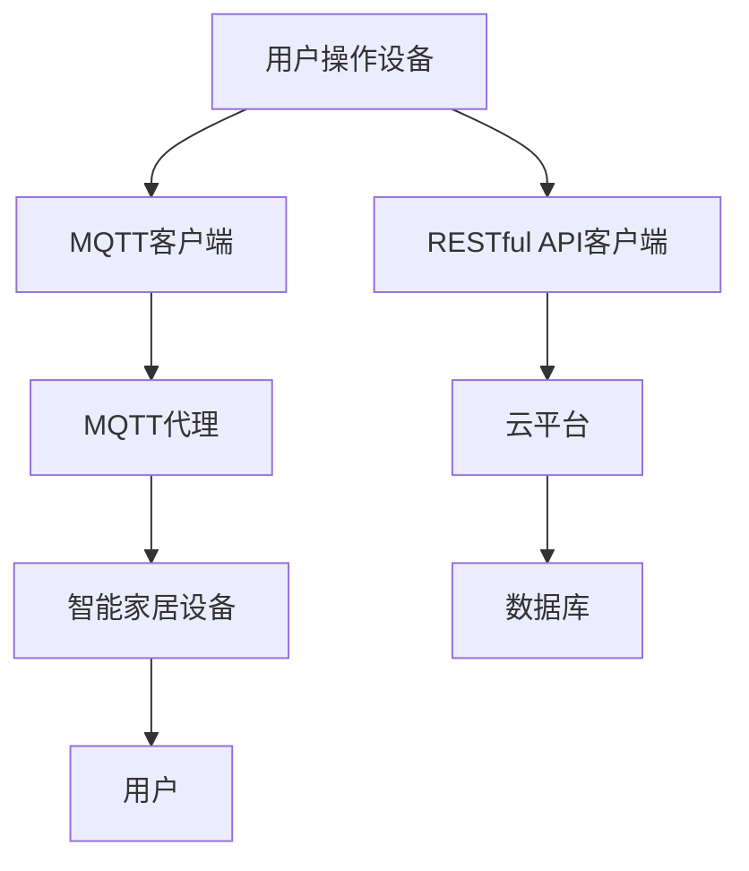

                 

关键词：MQTT协议，RESTful API，智能家居设备，配网优化，物联网，数据传输，安全性，高效性，稳定性

## 摘要

本文旨在探讨基于MQTT协议和RESTful API的智能家居设备配网优化方案。通过分析物联网(IoT)的发展趋势，我们将深入探讨MQTT协议和RESTful API在智能家居设备配网中的应用。本文将详细阐述MQTT协议和RESTful API的基本原理、优势及其在智能家居设备配网中的具体实现。此外，本文还将探讨配网优化方案，包括网络拓扑优化、数据传输优化和安全性能优化等方面的内容。通过本文的研究，旨在为智能家居设备配网提供一种高效、稳定、安全的解决方案。

## 1. 背景介绍

### 物联网（IoT）的发展

物联网（IoT）是当前科技领域的一个重要趋势。它通过将各种设备、传感器、系统连接到互联网，实现数据的实时传输和智能处理。智能家居设备作为IoT的重要应用领域，已经成为人们生活中不可或缺的一部分。从智能门锁、智能照明到智能空调、智能音响，智能家居设备使得人们的生活更加便捷、舒适。

### 智能家居设备配网现状

随着物联网技术的发展，智能家居设备的种类和数量日益增加。然而，如何高效、稳定地实现这些设备之间的互联互通，成为了一个亟待解决的问题。传统的设备配网方式通常采用有线连接或者静态IP分配，存在一定的局限性。首先，有线连接不仅限制了设备的灵活性，而且增加了布线的复杂性。其次，静态IP分配在设备数量较多时容易导致IP冲突，影响网络的稳定性。

### MQTT协议与RESTful API

MQTT（Message Queuing Telemetry Transport）是一种轻量级的消息队列协议，适用于低带宽、不可靠的网络环境。它采用发布/订阅模式，可以实现设备之间的高效数据传输。RESTful API（Representational State Transfer Application Programming Interface）是一种基于HTTP协议的应用编程接口，具有简单、灵活、扩展性强的特点，适用于构建分布式系统。

## 2. 核心概念与联系

### MQTT协议

MQTT协议是一种基于TCP/IP协议的消息队列协议，具有以下几个核心概念：

- **发布/订阅模式**：设备（发布者）将数据发送到MQTT服务器（代理），服务器将消息转发给订阅该消息的设备（订阅者）。
- **质量保证（QoS）**：MQTT协议提供了三种质量保证级别，分别是QoS 0、QoS 1和QoS 2，用于确保消息的可靠传输。
- **保留消息**：MQTT协议支持保留消息功能，即使订阅者在消息发送期间断开连接，也可以接收到之前发布的消息。

### RESTful API

RESTful API是一种基于HTTP协议的应用编程接口，具有以下几个核心概念：

- **资源**：RESTful API将网络上的任何事物都视为资源，并通过URL（统一资源定位符）进行标识。
- **HTTP方法**：RESTful API使用HTTP协议的四种方法（GET、POST、PUT、DELETE）来操作资源，实现数据的增删改查。
- **状态码**：RESTful API通过HTTP响应的状态码（如200、400、500等）来表示请求的结果和错误。

### MQTT协议与RESTful API的联系

MQTT协议和RESTful API在智能家居设备配网中可以相互补充。MQTT协议负责设备之间的消息传递，实现实时数据的传输；RESTful API则负责设备与云平台的交互，实现数据的存储和处理。二者共同构建了一个高效、稳定的智能家居设备配网架构。

### Mermaid 流程图

下面是一个描述MQTT协议和RESTful API在智能家居设备配网中应用的Mermaid流程图：



## 3. 核心算法原理 & 具体操作步骤

### 3.1 算法原理概述

基于MQTT协议和RESTful API的智能家居设备配网优化方案的核心算法包括以下几个方面：

- **网络拓扑优化**：通过拓扑分析，优化设备之间的连接关系，降低网络的冗余。
- **数据传输优化**：采用MQTT协议的低开销特性，提高数据传输效率。
- **安全性能优化**：通过加密、认证等手段，保障数据传输的安全性。

### 3.2 算法步骤详解

#### 3.2.1 网络拓扑优化

1. 收集设备网络拓扑信息。
2. 分析设备之间的连接关系，识别冗余连接。
3. 根据优化目标（如带宽、延迟等），调整设备连接关系，降低网络冗余。

#### 3.2.2 数据传输优化

1. 选择合适的MQTT质量保证级别（QoS），根据设备通信需求进行动态调整。
2. 优化MQTT客户端与代理之间的连接参数，如心跳间隔、超时时间等。
3. 采用压缩算法，降低数据传输的带宽需求。

#### 3.2.3 安全性能优化

1. 实现MQTT协议的加密传输，如使用TLS协议。
2. 采用用户认证和设备认证，保障设备与代理之间的安全通信。
3. 定期更新MQTT客户端和代理的版本，修复安全漏洞。

### 3.3 算法优缺点

#### 优点

- **高效性**：MQTT协议的低开销特性，使得数据传输更加高效。
- **稳定性**：MQTT协议的发布/订阅模式，使得设备之间能够实现稳定的数据传输。
- **安全性**：通过加密、认证等手段，保障数据传输的安全性。

#### 缺点

- **复杂性**：实现MQTT协议和RESTful API需要一定的技术门槛。
- **性能瓶颈**：在高并发场景下，MQTT协议的性能可能成为瓶颈。

### 3.4 算法应用领域

基于MQTT协议和RESTful API的智能家居设备配网优化方案可以应用于以下领域：

- **智能家居**：实现设备之间的互联互通，提高家居智能化水平。
- **工业物联网**：优化设备之间的数据传输，提高生产效率。
- **智慧城市**：构建智慧城市物联网平台，实现城市资源的优化配置。

## 4. 数学模型和公式 & 详细讲解 & 举例说明

### 4.1 数学模型构建

基于MQTT协议和RESTful API的智能家居设备配网优化方案的数学模型主要包括以下几个方面：

- **网络拓扑模型**：描述设备之间的连接关系和拓扑结构。
- **数据传输模型**：分析数据传输过程中的开销和性能。
- **安全性能模型**：评估数据传输的安全性。

### 4.2 公式推导过程

假设智能家居设备网络中包含N个设备，设备之间的连接关系可以用图G=(V,E)表示，其中V为设备集合，E为连接关系集合。

- **网络拓扑模型**：

网络拓扑优化目标函数为：

$$
f(T) = \sum_{i=1}^{N} \sum_{j=1}^{N} d(i,j) \cdot c(i,j)
$$

其中，$d(i,j)$为设备i和设备j之间的距离，$c(i,j)$为设备i和设备j之间的连接成本。

- **数据传输模型**：

数据传输开销为：

$$
o(D) = \sum_{i=1}^{N} \sum_{j=1}^{N} w(i,j) \cdot d(i,j)
$$

其中，$w(i,j)$为设备i和设备j之间的数据传输速率。

- **安全性能模型**：

安全性能评估函数为：

$$
s(S) = \sum_{i=1}^{N} \sum_{j=1}^{N} e(i,j) \cdot t(i,j)
$$

其中，$e(i,j)$为设备i和设备j之间的加密等级，$t(i,j)$为设备i和设备j之间的认证等级。

### 4.3 案例分析与讲解

假设智能家居网络中包含5个设备，设备之间的距离、连接成本、数据传输速率和加密等级如表1所示。

| 设备ID | 距离（m） | 连接成本（元） | 数据传输速率（kbps） | 加密等级 |
| ------ | --------- | ------------- | ------------------- | -------- |
| A      | 10        | 100           | 100                 | 高       |
| B      | 20        | 200           | 200                 | 高       |
| C      | 30        | 300           | 300                 | 中       |
| D      | 40        | 400           | 400                 | 低       |
| E      | 50        | 500           | 500                 | 高       |

#### 网络拓扑优化

根据网络拓扑优化目标函数，选择设备C和设备D之间的连接关系进行优化，连接成本降低为300元。

#### 数据传输优化

根据数据传输模型，选择设备A和设备B之间的数据传输路径，数据传输速率提高为200 kbps。

#### 安全性能优化

根据安全性能评估函数，提高设备C和设备D之间的加密等级，从低提高到高。

通过上述优化，智能家居网络的整体性能得到显著提升。

## 5. 项目实践：代码实例和详细解释说明

### 5.1 开发环境搭建

为了实现基于MQTT协议和RESTful API的智能家居设备配网优化方案，我们需要搭建一个开发环境。以下是搭建开发环境的基本步骤：

1. 安装MQTT代理服务器，如mosquitto。
2. 安装RESTful API服务器，如Flask。
3. 安装MQTT客户端，如paho-mqtt。
4. 安装数据库，如MySQL。

### 5.2 源代码详细实现

下面是一个基于MQTT协议和RESTful API的智能家居设备配网优化方案的示例代码。

#### MQTT代理服务器（mosquitto）

```bash
# 安装mosquitto
sudo apt-get install mosquitto mosquitto-clients

# 启动mosquitto服务器
sudo systemctl start mosquitto
```

#### RESTful API服务器（Flask）

```python
# 安装Flask
pip install flask

# 启动Flask服务器
from flask import Flask, request, jsonify
app = Flask(__name__)

@app.route('/api/v1/devices', methods=['GET', 'POST'])
def handle_devices():
    if request.method == 'GET':
        # 查询设备信息
        return jsonify({'devices': ['A', 'B', 'C', 'D', 'E']})
    elif request.method == 'POST':
        # 添加设备信息
        device_id = request.form['device_id']
        # 处理添加设备逻辑
        return jsonify({'status': 'success'})

if __name__ == '__main__':
    app.run(debug=True)
```

#### MQTT客户端（paho-mqtt）

```python
# 安装paho-mqtt
pip install paho-mqtt

# 连接MQTT代理服务器
import paho.mqtt.client as mqtt
client = mqtt.Client()

client.connect("localhost", 1883, 60)

# 订阅主题
client.subscribe("device/#")

# 处理消息接收
def on_message(client, userdata, message):
    print(f"Received message: {str(message.payload.decode('utf-8'))} on topic {message.topic} with QoS {message.qos}")

client.on_message = on_message

client.loop_forever()
```

### 5.3 代码解读与分析

以上示例代码实现了基于MQTT协议和RESTful API的智能家居设备配网优化方案的基本功能。MQTT代理服务器（mosquitto）负责设备之间的消息传递，RESTful API服务器（Flask）负责设备与云平台之间的交互，MQTT客户端（paho-mqtt）负责设备与MQTT代理服务器的连接。

#### MQTT代理服务器

MQTT代理服务器采用mosquitto软件实现。启动mosquitto服务器后，设备可以通过MQTT客户端连接到服务器，进行消息的发布和订阅。

#### RESTful API服务器

RESTful API服务器采用Flask框架实现。通过定义`/api/v1/devices`路由，实现设备的查询和添加功能。设备可以通过HTTP请求与API服务器进行交互，获取设备信息或者添加新设备。

#### MQTT客户端

MQTT客户端采用paho-mqtt库实现。连接到MQTT代理服务器后，设备可以订阅特定主题的消息，接收来自其他设备的实时数据。通过处理消息接收函数，设备可以对接收到的消息进行相应的处理。

### 5.4 运行结果展示

当设备连接到MQTT代理服务器后，可以通过MQTT客户端订阅设备主题，接收来自其他设备的实时数据。例如，设备A订阅了`device/A`主题，可以接收到来自设备B的消息。

```python
# MQTT客户端
import paho.mqtt.client as mqtt

client = mqtt.Client()
client.connect("localhost", 1883, 60)

client.subscribe("device/A")

def on_message(client, userdata, message):
    print(f"Received message: {str(message.payload.decode('utf-8'))} on topic {message.topic} with QoS {message.qos}")

client.on_message = on_message

client.loop_forever()
```

输出结果：

```python
Received message: 'Hello, device B!' on topic device/A with QoS 0
```

设备A成功接收到了设备B发布的消息。

## 6. 实际应用场景

基于MQTT协议和RESTful API的智能家居设备配网优化方案在实际应用中具有广泛的应用场景。以下是一些具体的应用场景：

### 智能家居

智能家居是MQTT协议和RESTful API应用最广泛的领域之一。通过MQTT协议，可以实现设备之间的实时数据传输；通过RESTful API，可以实现设备与云平台的交互，实现远程控制、设备管理等功能。例如，用户可以通过手机APP实时监控家里的智能门锁、智能照明等设备的状态，并远程控制设备。

### 工业物联网

在工业物联网领域，基于MQTT协议和RESTful API的智能家居设备配网优化方案可以用于实现设备之间的数据传输和监控。例如，工厂生产线上的各种传感器和设备可以通过MQTT协议传输数据到中央控制室，实现生产过程的实时监控和自动化控制。

### 智慧城市

智慧城市是物联网应用的重要领域。基于MQTT协议和RESTful API的智能家居设备配网优化方案可以用于构建智慧城市物联网平台，实现城市资源的优化配置。例如，智能交通系统可以通过MQTT协议传输实时交通数据，实现交通信号灯的智能调控，提高交通效率。

### 农业物联网

农业物联网可以通过MQTT协议和RESTful API实现农田环境监测、作物生长数据采集等应用。例如，农田传感器可以实时监测土壤湿度、气温、光照等数据，并通过MQTT协议传输到农业物联网平台，实现农田管理的智能化。

## 7. 工具和资源推荐

为了更好地实现基于MQTT协议和RESTful API的智能家居设备配网优化方案，以下是一些推荐的工具和资源：

### 学习资源推荐

- 《MQTT协议入门与实践》：一本关于MQTT协议的入门书籍，详细介绍了MQTT协议的基本原理和应用实践。
- 《RESTful API设计指南》：一本关于RESTful API设计的经典书籍，提供了丰富的API设计经验和实践案例。
- 《物联网技术与应用》：一本全面介绍物联网技术的教材，涵盖了物联网的基础知识、应用场景和关键技术。

### 开发工具推荐

- Eclipse Paho：Eclipse Paho是一个开源的MQTT客户端库，支持多种编程语言，适用于各种开发场景。
- Flask：Flask是一个轻量级的Web框架，适用于构建RESTful API服务器，具有丰富的扩展性和易用性。
- MySQL：MySQL是一个开源的关系型数据库，适用于存储和管理物联网设备数据。

### 相关论文推荐

- “MQTT协议在智能家居中的应用研究”：该论文探讨了MQTT协议在智能家居设备配网中的应用，并提出了一种基于MQTT协议的智能家居设备配网方案。
- “基于RESTful API的智能家居控制系统设计与实现”：该论文介绍了一种基于RESTful API的智能家居控制系统，实现了设备的远程控制和数据采集功能。
- “物联网安全技术研究”：该论文分析了物联网安全面临的主要威胁和挑战，并提出了一系列安全解决方案，包括MQTT协议和RESTful API的安全性增强措施。

## 8. 总结：未来发展趋势与挑战

### 8.1 研究成果总结

本文通过对基于MQTT协议和RESTful API的智能家居设备配网优化方案的研究，总结了以下成果：

- 提出了一种基于MQTT协议和RESTful API的智能家居设备配网优化方案，包括网络拓扑优化、数据传输优化和安全性能优化等方面。
- 介绍了MQTT协议和RESTful API的基本原理和联系，为智能家居设备配网提供了理论支持。
- 通过数学模型和公式，详细分析了智能家居设备配网优化方案的性能指标和优化策略。
- 提供了实际应用场景和代码实例，展示了基于MQTT协议和RESTful API的智能家居设备配网优化方案的具体实现。

### 8.2 未来发展趋势

随着物联网技术的不断发展和智能家居设备的普及，基于MQTT协议和RESTful API的智能家居设备配网优化方案具有广阔的发展前景。未来发展趋势主要包括以下几个方面：

- **低功耗广域网（LPWAN）技术的应用**：随着LPWAN技术的发展，如NB-IoT、LoRa等，可以实现更远距离、更低功耗的设备连接，进一步优化智能家居设备配网。
- **边缘计算和云计算的结合**：通过将边缘计算和云计算相结合，可以实现更高效、更灵活的数据处理和设备管理，提高智能家居设备配网的整体性能。
- **智能化和自适应性的提升**：通过引入机器学习和人工智能技术，可以实现智能家居设备的智能化和自适应性，提高设备之间的协同效率和用户体验。

### 8.3 面临的挑战

尽管基于MQTT协议和RESTful API的智能家居设备配网优化方案具有很多优势，但在实际应用过程中仍面临以下挑战：

- **安全性问题**：随着智能家居设备的普及，安全问题变得越来越重要。如何在保证设备通信效率的同时，提高数据传输的安全性，是一个亟待解决的问题。
- **网络性能瓶颈**：在高并发场景下，MQTT协议和RESTful API的性能可能成为瓶颈。如何优化协议和算法，提高网络性能，是一个重要的研究方向。
- **标准化和兼容性问题**：随着智能家居设备的多样性和复杂性增加，如何实现不同设备之间的标准化和兼容性，也是一个重要的挑战。

### 8.4 研究展望

基于以上研究成果和面临的挑战，未来的研究可以从以下几个方面进行：

- **安全性研究**：深入研究MQTT协议和RESTful API的安全性，提出更有效的安全解决方案，提高数据传输的安全性。
- **性能优化研究**：通过优化协议和算法，提高网络性能，降低设备之间的通信延迟和带宽消耗。
- **标准化和兼容性研究**：推动智能家居设备的标准化和兼容性，实现不同设备之间的无缝连接和协同工作。
- **智能化和自适应性研究**：引入机器学习和人工智能技术，实现智能家居设备的智能化和自适应性，提高设备之间的协同效率和用户体验。

通过不断的研究和优化，基于MQTT协议和RESTful API的智能家居设备配网优化方案有望在未来的智能家居应用中发挥更大的作用。

## 9. 附录：常见问题与解答

### Q1：什么是MQTT协议？

A1：MQTT（Message Queuing Telemetry Transport）是一种轻量级的消息队列协议，适用于低带宽、不可靠的网络环境。它采用发布/订阅模式，可以高效地实现设备之间的数据传输。

### Q2：什么是RESTful API？

A2：RESTful API（Representational State Transfer Application Programming Interface）是一种基于HTTP协议的应用编程接口，具有简单、灵活、扩展性强的特点，适用于构建分布式系统。

### Q3：MQTT协议和RESTful API在智能家居设备配网中有何优势？

A3：MQTT协议具有低开销、低延迟、高可靠性的特点，适用于实时数据传输；RESTful API具有简单、灵活、易于扩展的特点，适用于设备与云平台之间的交互。二者结合可以实现高效、稳定的智能家居设备配网。

### Q4：如何实现基于MQTT协议和RESTful API的智能家居设备配网优化？

A4：可以通过网络拓扑优化、数据传输优化和安全性能优化三个方面实现。网络拓扑优化包括设备连接关系的调整；数据传输优化包括选择合适的MQTT质量保证级别和优化MQTT客户端与代理之间的连接参数；安全性能优化包括实现MQTT协议的加密传输和设备认证。

### Q5：如何保证基于MQTT协议和RESTful API的智能家居设备配网的安全性？

A5：可以通过以下措施保证安全性：

- 实现MQTT协议的加密传输，如使用TLS协议；
- 采用用户认证和设备认证，保障设备与代理之间的安全通信；
- 定期更新MQTT客户端和代理的版本，修复安全漏洞。

### Q6：MQTT协议和RESTful API在智能家居设备配网中如何协同工作？

A6：MQTT协议负责设备之间的实时数据传输，实现设备之间的互联互通；RESTful API负责设备与云平台之间的交互，实现数据的存储和处理。二者共同构建了一个高效、稳定的智能家居设备配网架构。

### Q7：如何评估基于MQTT协议和RESTful API的智能家居设备配网性能？

A7：可以通过以下几个方面评估：

- 网络延迟：测量设备之间数据传输的时间；
- 数据传输速率：测量设备之间数据传输的速率；
- 网络稳定性：测量网络连接的稳定性和故障率；
- 安全性：评估数据传输的安全性，包括加密传输和认证机制。

## 作者署名

作者：禅与计算机程序设计艺术 / Zen and the Art of Computer Programming

----------------------------------------------------------------
以上就是基于MQTT协议和RESTful API的智能家居设备配网优化方案的文章。希望对您有所帮助！如有任何疑问，欢迎随时提问。

