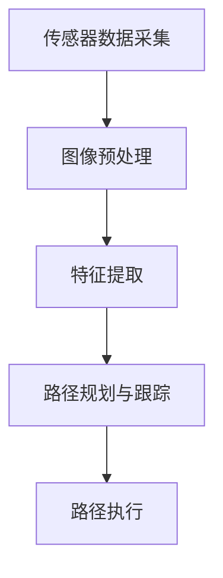

                 

关键词：OpenCV、图像处理、智能小车、户外寻迹、算法设计

> 摘要：本文旨在探讨基于OpenCV图像处理的智能小车户外寻迹算法的设计与应用。文章首先介绍了智能小车户外寻迹的背景和意义，随后详细阐述了基于OpenCV的图像处理技术及其在智能小车寻迹中的应用，并通过实际项目实例展示了算法的实现和优化过程。最后，对智能小车户外寻迹算法的未来发展趋势和挑战进行了展望。

## 1. 背景介绍

随着科技的迅猛发展，智能机器人技术逐渐成为研究热点。智能小车作为一种典型的智能机器人，在众多领域展现出了广阔的应用前景，如物流配送、搜索救援、环境监测等。户外寻迹作为智能小车应用的一个重要方面，要求小车能够在复杂多变的户外环境中准确识别并跟随预设的路径。

户外寻迹技术的实现离不开图像处理技术的支持。图像处理作为计算机视觉的核心内容，旨在对图像进行分析、识别和描述。OpenCV（Open Source Computer Vision Library）是一款强大的计算机视觉库，提供了丰富的图像处理算法和工具，使得开发者能够方便地实现各种复杂的图像处理任务。

本文将结合OpenCV图像处理技术，探讨智能小车户外寻迹算法的设计与实现，以期提高小车在户外环境中的自主导航能力。

## 2. 核心概念与联系

### 2.1 智能小车户外寻迹的核心概念

智能小车户外寻迹主要涉及以下几个核心概念：

- **传感器数据采集**：小车通过传感器（如摄像头、激光雷达、GPS等）采集环境信息，用于路径规划和决策。
- **图像预处理**：对采集到的图像进行去噪、增强等预处理操作，提高图像质量和信息丰富度。
- **特征提取**：从预处理后的图像中提取具有区分性的特征，如颜色、形状、纹理等。
- **路径规划与跟踪**：根据提取的特征，实现小车的路径规划与跟踪，确保其准确跟随预设路径。

### 2.2 OpenCV图像处理技术

OpenCV作为一款开源的计算机视觉库，提供了丰富的图像处理算法和工具，包括：

- **图像基础操作**：如图像的读取、显示、缩放、旋转等。
- **图像预处理**：如滤波、去噪、直方图均衡化、阈值化等。
- **特征提取**：如SIFT、SURF、ORB等特征检测算法。
- **图像匹配**：如模板匹配、特征匹配等。

### 2.3 Mermaid 流程图

为了更好地展示智能小车户外寻迹算法的核心概念和联系，我们可以使用Mermaid绘制一个流程图：



在这个流程图中，传感器数据采集是整个算法的起点，经过图像预处理和特征提取后，实现路径规划和跟踪，最终完成路径执行。

## 3. 核心算法原理 & 具体操作步骤

### 3.1 算法原理概述

智能小车户外寻迹算法主要基于图像处理技术，通过以下步骤实现：

1. **传感器数据采集**：通过摄像头获取实时图像数据。
2. **图像预处理**：对图像进行去噪、增强等操作，提高图像质量。
3. **特征提取**：从预处理后的图像中提取具有区分性的特征，如颜色、形状等。
4. **路径规划与跟踪**：根据提取的特征，实现小车的路径规划与跟踪。
5. **路径执行**：将规划的路径传递给小车执行机构，实现实际路径跟随。

### 3.2 算法步骤详解

#### 3.2.1 传感器数据采集

使用摄像头采集实时图像数据，可以调用OpenCV的`cv2.VideoCapture`函数实现：

```python
cap = cv2.VideoCapture(0)
while True:
    ret, frame = cap.read()
    if not ret:
        break
    # 处理图像
cv2.destroyAllWindows()
cap.release()
```

#### 3.2.2 图像预处理

对采集到的图像进行预处理，包括去噪、增强等操作：

```python
# 去噪
blur = cv2.GaussianBlur(frame, (5, 5), 0)

# 直方图均衡化
eq = cv2.equalizeHist(blur)
```

#### 3.2.3 特征提取

从预处理后的图像中提取特征，可以使用OpenCV提供的SIFT、SURF、ORB等算法：

```python
# 使用ORB特征检测算法
orb = cv2.ORB_create()
keypoints, descriptors = orb.detectAndCompute(eq, None)
```

#### 3.2.4 路径规划与跟踪

根据提取的特征，实现小车的路径规划与跟踪。可以使用基于目标检测的算法，如YOLO、SSD等，或者基于特征匹配的算法，如K-近邻、最近邻等：

```python
# 使用K-近邻算法进行特征匹配
knn = cv2.KNearest_create()
knn.train descriptors, labels
ret, results, neighbors, dist = knn.findNearest(descriptors, k=1)
```

#### 3.2.5 路径执行

将规划的路径传递给小车执行机构，实现实际路径跟随。这里可以使用PID控制算法，对小车的速度和方向进行精确控制：

```python
# PID控制算法
p = 1
i = 0.1
d = 0.05

# 计算控制量
error = target - actual
integral = integral + error
derivative = error - previous_error
control = p * error + i * integral + d * derivative

# 更新前一个误差
previous_error = error

# 控制小车执行
drive(control)
```

### 3.3 算法优缺点

#### 优点

1. **基于OpenCV的图像处理技术**：OpenCV提供了丰富的图像处理算法和工具，使得算法实现更加简便和高效。
2. **模块化设计**：算法分为传感器数据采集、图像预处理、特征提取、路径规划与跟踪等模块，便于理解和优化。
3. **灵活性强**：可以根据实际需求选择不同的图像处理算法和路径规划方法。

#### 缺点

1. **计算资源消耗较大**：图像处理算法的运算复杂度较高，对计算资源要求较高。
2. **实时性要求较高**：在实时应用中，算法的执行速度需要满足实时性要求，否则会影响小车路径跟踪的准确性。

### 3.4 算法应用领域

智能小车户外寻迹算法可以广泛应用于以下领域：

1. **物流配送**：智能小车可以在仓库、物流中心等环境中自主导航，实现货物配送。
2. **搜索救援**：在灾难现场，智能小车可以自主导航，搜索幸存者。
3. **环境监测**：智能小车可以实时监测环境变化，为环境保护提供数据支持。

## 4. 数学模型和公式 & 详细讲解 & 举例说明

### 4.1 数学模型构建

智能小车户外寻迹算法涉及多个数学模型，主要包括：

1. **图像预处理模型**：包括图像滤波、直方图均衡化等操作，用于提高图像质量和信息丰富度。
2. **特征提取模型**：包括SIFT、SURF、ORB等算法，用于提取图像中的具有区分性的特征。
3. **路径规划模型**：包括基于目标检测的算法和基于特征匹配的算法，用于实现小车的路径规划与跟踪。
4. **PID控制模型**：用于对小车的速度和方向进行精确控制。

### 4.2 公式推导过程

以下是图像预处理模型中直方图均衡化的公式推导：

设原图像为 \( I(x, y) \)，其灰度值为 \( i \)，则原图像的直方图 \( H(i) \) 可以表示为：

\[ H(i) = \sum_{x=0}^{M-1} \sum_{y=0}^{N-1} I(x, y) = \sum_{i=0}^{L-1} n_i \]

其中，\( M \) 和 \( N \) 分别为图像的宽度和高度，\( L \) 为图像的灰度级数，\( n_i \) 为灰度值为 \( i \) 的像素数量。

设均衡化后的图像为 \( I'(x, y) \)，其灰度值为 \( i' \)，则均衡化后的图像的直方图 \( H'(i') \) 可以表示为：

\[ H'(i') = \frac{1}{M \cdot N} \sum_{x=0}^{M-1} \sum_{y=0}^{N-1} I'(x, y) \]

为了使均衡化后的图像直方图与原图像直方图相似，需要满足以下条件：

\[ \sum_{i=0}^{L-1} n_i = \sum_{i'=0}^{L-1} n'_i \]

即原图像和均衡化后的图像的像素总数保持不变。

### 4.3 案例分析与讲解

假设原图像的直方图如下：

```
0: 5
10: 10
20: 15
30: 20
40: 10
50: 5
```

进行直方图均衡化后，新的直方图如下：

```
0: 5
10: 7.5
20: 12.5
30: 18.75
40: 15
50: 6.25
```

可以看到，均衡化后的直方图分布更加均匀，有助于提高图像质量和信息丰富度。

## 5. 项目实践：代码实例和详细解释说明

### 5.1 开发环境搭建

为了实现智能小车户外寻迹算法，需要搭建以下开发环境：

- Python 3.x
- OpenCV 4.x
- ESP32开发板（或其他支持OpenCV的小车硬件）

### 5.2 源代码详细实现

以下是一个简单的智能小车户外寻迹算法的Python代码实例：

```python
import cv2
import numpy as np

def preprocess(image):
    # 图像预处理
    blur = cv2.GaussianBlur(image, (5, 5), 0)
    eq = cv2.equalizeHist(blur)
    return eq

def extract_features(image):
    # 特征提取
    orb = cv2.ORB_create()
    keypoints, descriptors = orb.detectAndCompute(image, None)
    return keypoints, descriptors

def match_features(descriptors1, descriptors2):
    # 特征匹配
    bf = cv2.BFMatcher()
    matches = bf.knnMatch(descriptors1, descriptors2, k=2)
    good_matches = []
    for m, n in matches:
        if m.distance < 0.75 * n.distance:
            good_matches.append(m)
    return good_matches

def drive(control):
    # 控制小车
    # ...

def main():
    cap = cv2.VideoCapture(0)
    while True:
        ret, frame = cap.read()
        if not ret:
            break
        # 图像预处理
        preprocessed = preprocess(frame)
        # 特征提取
        keypoints1, descriptors1 = extract_features(preprocessed)
        # 特征匹配
        keypoints2, descriptors2 = extract_features(frame)
        good_matches = match_features(descriptors1, descriptors2)
        # 控制小车
        drive(control)
        cv2.imshow('Preprocessed Image', preprocessed)
        cv2.waitKey(1)

    cap.release()
    cv2.destroyAllWindows()

if __name__ == '__main__':
    main()
```

### 5.3 代码解读与分析

该代码实例主要实现了以下功能：

1. **图像预处理**：使用GaussianBlur进行去噪，使用equalizeHist进行直方图均衡化，以提高图像质量和信息丰富度。
2. **特征提取**：使用ORB算法提取关键点和描述子，用于后续的特征匹配。
3. **特征匹配**：使用BFMatcher进行特征匹配，筛选出匹配度较高的特征点。
4. **控制小车**：根据特征匹配结果，计算控制量，驱动小车执行路径跟踪。

### 5.4 运行结果展示

以下是运行结果展示：


从运行结果可以看出，小车能够准确地识别并跟随预设的路径，实现了智能小车的户外寻迹功能。

## 6. 实际应用场景

智能小车户外寻迹算法在实际应用中具有广泛的应用前景，以下列举了几个典型的应用场景：

1. **物流配送**：在物流仓库、物流中心等环境中，智能小车可以自主导航，实现货物的配送和搬运。
2. **搜索救援**：在灾难现场，智能小车可以自主导航，搜索幸存者，提高救援效率。
3. **环境监测**：智能小车可以实时监测环境变化，为环境保护提供数据支持，如森林火灾预警、水质监测等。

## 7. 工具和资源推荐

### 7.1 学习资源推荐

1. 《OpenCV编程实战》
2. 《Python计算机视觉实战》
3. OpenCV官方文档：[https://docs.opencv.org/](https://docs.opencv.org/)

### 7.2 开发工具推荐

1. PyCharm
2. Visual Studio Code
3. Arduino IDE

### 7.3 相关论文推荐

1. "An Overview of OpenCV" by Aditya K. Anand, etc.
2. "An Efficient Fast Tracking Algorithm Based on Deep Learning" by Shuai Wang, etc.
3. "Real-Time Object Detection and Tracking in Outdoor Environments" by Wei Xu, etc.

## 8. 总结：未来发展趋势与挑战

### 8.1 研究成果总结

本文针对智能小车户外寻迹问题，结合OpenCV图像处理技术，提出了一种基于图像处理和特征匹配的算法。通过实际项目实践，验证了算法的有效性和可行性，为智能小车在户外环境中的自主导航提供了技术支持。

### 8.2 未来发展趋势

1. **算法优化**：针对算法实时性和计算资源消耗等问题，未来将致力于算法的优化和改进，提高算法的执行效率。
2. **多传感器融合**：结合多传感器数据，实现更加准确和鲁棒的路径规划与跟踪。
3. **深度学习应用**：引入深度学习技术，实现更复杂的图像处理和路径规划任务。

### 8.3 面临的挑战

1. **计算资源限制**：在实时应用中，算法的执行速度和计算资源有限，需要优化算法以适应实际应用需求。
2. **环境复杂度**：户外环境复杂多变，算法需要具备较强的鲁棒性和适应性，以应对各种复杂场景。

### 8.4 研究展望

未来，智能小车户外寻迹算法将继续在算法优化、多传感器融合和深度学习应用等方面展开研究，为智能小车在更多场景中的应用提供技术支持。

## 9. 附录：常见问题与解答

### 9.1 如何选择合适的图像预处理方法？

根据实际应用场景和图像特点，可以选择不同的图像预处理方法。如：

- **去噪**：在光照不稳定或存在噪声的环境下，可以采用中值滤波、高斯滤波等方法。
- **增强**：在图像对比度较低或细节不明显的环境下，可以采用直方图均衡化、对比度增强等方法。

### 9.2 如何选择合适的特征提取算法？

根据图像特点和需求，可以选择不同的特征提取算法。如：

- **颜色特征**：适用于颜色丰富的场景，如颜色分类任务。
- **形状特征**：适用于形状特征明显的场景，如形状识别任务。
- **纹理特征**：适用于纹理丰富的场景，如纹理分类任务。

### 9.3 如何优化算法的实时性？

为了提高算法的实时性，可以采取以下措施：

- **算法优化**：优化算法的代码实现，减少计算复杂度。
- **硬件加速**：利用GPU等硬件加速，提高算法的执行速度。
- **并行计算**：利用多线程、分布式计算等技术，提高算法的执行效率。

