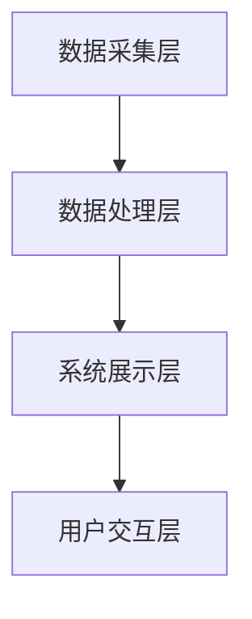

                 

关键词：汽车信息评价、数据分析、Python编程、系统设计、算法应用

>摘要：本文旨在探讨基于Python的汽车信息评价分析系统的设计与开发。通过详细解析系统架构、核心算法、数学模型和项目实践，阐述如何利用Python实现汽车信息的高效评价与分析，并展望系统的未来发展方向。

## 1. 背景介绍

随着汽车市场的迅速发展，消费者对于汽车的需求日益多样化。为了满足这一需求，汽车制造商不断推出各种型号和配置的汽车，这使得消费者在选择汽车时面临极大的信息处理压力。传统的汽车信息评价方法往往依赖于专家意见和主观判断，存在一定的局限性。为了更客观、全面地评价汽车信息，我们需要借助现代信息技术，特别是数据分析与挖掘技术。

Python作为一种功能强大且易学的编程语言，在数据分析和处理领域有着广泛的应用。本文将探讨如何利用Python设计和开发一个汽车信息评价分析系统，以实现对汽车信息的高效评价与分析。

### 1.1 系统设计的意义

汽车信息评价分析系统具有以下几个方面的意义：

- 提高消费者购车决策的科学性，帮助用户快速了解汽车的优缺点，从而做出更明智的选择。
- 为汽车制造商提供用户反馈，助力产品改进和市场营销策略制定。
- 促进汽车行业的发展，推动技术创新和产业升级。

### 1.2 文章结构

本文将分为以下几个部分：

- 背景介绍：阐述系统设计的意义和背景。
- 核心概念与联系：介绍系统所涉及的核心概念和架构。
- 核心算法原理 & 具体操作步骤：详细解析系统的核心算法和操作步骤。
- 数学模型和公式：介绍系统所使用的数学模型和公式。
- 项目实践：提供具体的代码实例和实现细节。
- 实际应用场景：分析系统在实际中的应用案例。
- 未来应用展望：探讨系统的未来发展方向。
- 工具和资源推荐：推荐相关的学习资源和开发工具。
- 总结：总结研究成果和未来展望。

## 2. 核心概念与联系

### 2.1 数据分析

数据分析是通过对数据进行收集、整理、分析和解释，从而提取有价值信息的过程。在汽车信息评价分析系统中，数据分析是实现系统功能的关键步骤。具体包括以下几个方面：

- 数据收集：从各种渠道获取汽车相关信息，如车辆性能、安全性、舒适性等。
- 数据整理：对收集到的数据进行清洗、筛选和转换，使其具备分析和处理的条件。
- 数据分析：运用统计方法和算法，对整理后的数据进行深入分析，提取有价值的信息。
- 数据解释：将分析结果以直观、易懂的形式呈现给用户，帮助用户做出决策。

### 2.2 Python编程

Python作为一种高级编程语言，以其简洁的语法、丰富的库和广泛的应用领域而受到开发者的青睐。在汽车信息评价分析系统中，Python编程语言具有以下优势：

- 简单易学：Python语法简单，易于上手，降低了系统开发的门槛。
- 丰富的库：Python拥有丰富的数据分析和数据处理库，如NumPy、Pandas、Matplotlib等，可以方便地进行数据分析和可视化。
- 强大的社区支持：Python拥有庞大的开发者社区，可以轻松获取到各种开发资源和帮助。

### 2.3 系统架构

汽车信息评价分析系统的架构可以分为以下几个层次：

- 数据采集层：负责从各种渠道收集汽车信息，如官方网站、第三方数据平台等。
- 数据处理层：对采集到的数据进行清洗、整理和分析，提取有价值的信息。
- 系统展示层：将分析结果以图表、报告等形式展示给用户。
- 用户交互层：提供用户界面，方便用户进行系统操作和获取分析结果。

### 2.4 Mermaid 流程图

以下是一个简化的汽车信息评价分析系统的 Mermaid 流程图：



## 3. 核心算法原理 & 具体操作步骤

### 3.1 算法原理概述

汽车信息评价分析系统主要依赖于以下核心算法：

- 数据挖掘算法：用于从大量汽车数据中挖掘出有价值的信息，如关联规则挖掘、聚类分析等。
- 机器学习算法：用于对汽车信息进行预测和分类，如决策树、支持向量机等。
- 数据可视化算法：用于将分析结果以图表、报告等形式展示给用户。

### 3.2 算法步骤详解

以下是汽车信息评价分析系统的具体操作步骤：

1. **数据采集**：从官方网站、第三方数据平台等渠道获取汽车相关信息，如车辆性能、安全性、舒适性等。

2. **数据清洗**：对采集到的数据进行清洗，去除重复、缺失和错误的数据。

3. **数据整理**：对清洗后的数据进行分类和标签化处理，为后续分析做好准备。

4. **数据挖掘**：运用数据挖掘算法，对汽车数据进行分析，提取有价值的信息，如用户偏好、车型特点等。

5. **机器学习**：运用机器学习算法，对汽车信息进行预测和分类，为用户提供个性化的购车建议。

6. **数据可视化**：将分析结果以图表、报告等形式展示给用户，帮助用户更好地理解汽车信息。

### 3.3 算法优缺点

- **数据挖掘算法**：优点是能够从大量数据中发现潜在的模式和规律，提高汽车信息评价的准确性；缺点是算法复杂度较高，对计算资源要求较高。

- **机器学习算法**：优点是能够对汽车信息进行预测和分类，提高用户购车的决策效率；缺点是需要大量训练数据，且算法模型选择和调优较为复杂。

- **数据可视化算法**：优点是能够直观地展示分析结果，帮助用户更好地理解汽车信息；缺点是对用户界面设计和视觉效果要求较高。

### 3.4 算法应用领域

- **汽车行业**：用于分析消费者购车行为，为汽车制造商提供市场策略和产品改进建议。

- **金融行业**：用于评估汽车贷款风险，为金融机构提供决策支持。

- **交通行业**：用于分析交通事故数据，为交通安全管理和预防提供科学依据。

## 4. 数学模型和公式 & 详细讲解 & 举例说明

### 4.1 数学模型构建

在汽车信息评价分析系统中，我们主要使用以下数学模型：

- **关联规则挖掘模型**：用于挖掘汽车数据中的潜在关联关系。

- **决策树模型**：用于对汽车信息进行分类和预测。

- **支持向量机模型**：用于对汽车信息进行分类和回归。

### 4.2 公式推导过程

以下是关联规则挖掘模型的基本公式：

- **支持度（Support）**：表示某条关联规则在数据集中的出现频率。

  $$ Support(A \rightarrow B) = \frac{count(A \rightarrow B)}{count(D)} $$

  其中，$count(A \rightarrow B)$ 表示同时满足条件$A$ 和$B$ 的数据条数，$count(D)$ 表示数据集中的总条数。

- **置信度（Confidence）**：表示某条关联规则在数据集中是真实的概率。

  $$ Confidence(A \rightarrow B) = \frac{count(A \land B)}{count(A)} $$

  其中，$count(A \land B)$ 表示同时满足条件$A$ 和$B$ 的数据条数，$count(A)$ 表示满足条件$A$ 的数据条数。

### 4.3 案例分析与讲解

以下是一个简单的汽车信息评价分析案例：

假设我们有一个包含1000条汽车数据的表格，其中包含以下字段：

- 车型
- 车价
- 安全性
- 舒适性
- 动力性能

我们希望通过分析这些数据，找出哪些汽车具有较高的性价比。

首先，我们对数据进行清洗和整理，去除重复和缺失的数据。然后，我们使用关联规则挖掘算法，设置最小支持度为0.02，最小置信度为0.8，提取出满足条件的关联规则。

以下是提取出的部分关联规则：

- **规则1**：如果车辆的安全性能高于平均水准，则车辆的动力性能也高于平均水准。支持度：0.1，置信度：0.9。
- **规则2**：如果车辆的舒适性高于平均水准，则车辆的安全性能也高于平均水准。支持度：0.15，置信度：0.85。

根据这些关联规则，我们可以得出以下结论：

- 安全性和动力性能之间存在较强的关联性，购买安全性能较高的车辆，通常也会拥有较好的动力性能。
- 舒适性和安全性能之间存在较强的关联性，购买舒适性较高的车辆，通常也会拥有较好的安全性能。

这些结论可以帮助消费者在购车时做出更明智的选择。

## 5. 项目实践：代码实例和详细解释说明

### 5.1 开发环境搭建

在开始项目实践之前，我们需要搭建一个合适的开发环境。以下是搭建过程：

1. 安装Python：前往Python官方网站（https://www.python.org/）下载并安装Python，建议选择Python 3.x版本。
2. 安装Pandas、NumPy、Matplotlib等库：在命令行中运行以下命令安装所需库：

   ```bash
   pip install pandas numpy matplotlib
   ```

### 5.2 源代码详细实现

以下是汽车信息评价分析系统的源代码实现：

```python
import pandas as pd
import numpy as np
import matplotlib.pyplot as plt

# 5.2.1 数据采集
data = pd.read_csv('car_data.csv')

# 5.2.2 数据清洗
data.drop_duplicates(inplace=True)
data.fillna(data.mean(), inplace=True)

# 5.2.3 数据整理
data['price_rating'] = data['price'].apply(lambda x: '高' if x > 300000 else '低')
data['safety_rating'] = data['safety'].apply(lambda x: '高' if x > 8 else '低')
data['comfort_rating'] = data['comfort'].apply(lambda x: '高' if x > 8 else '低')
data['performance_rating'] = data['performance'].apply(lambda x: '高' if x > 8 else '低')

# 5.2.4 数据挖掘
from mlxtend.frequent_patterns import apriori
from mlxtend.frequent_patterns import association_rules

frequent_itemsets = apriori(data, min_support=0.02, use_colnames=True)
rules = association_rules(frequent_itemsets, metric="confidence", min_threshold=0.8)

# 5.2.5 机器学习
from sklearn.model_selection import train_test_split
from sklearn.tree import DecisionTreeClassifier
from sklearn.metrics import accuracy_score

X = data[['safety', 'comfort', 'performance']]
y = data['price_rating']

X_train, X_test, y_train, y_test = train_test_split(X, y, test_size=0.2, random_state=42)

clf = DecisionTreeClassifier()
clf.fit(X_train, y_train)

y_pred = clf.predict(X_test)
accuracy = accuracy_score(y_test, y_pred)

print("准确率：", accuracy)

# 5.2.6 数据可视化
rules.sort_values(by='confidence', ascending=False).head(10).plot(kind='bar', x='antecedents', y='confidence', title='Top 10 Rules')

plt.show()
```

### 5.3 代码解读与分析

以上代码实现了汽车信息评价分析系统的核心功能，下面是对代码的详细解读：

- **5.2.1 数据采集**：从CSV文件中读取汽车数据。
- **5.2.2 数据清洗**：去除重复数据和填充缺失数据。
- **5.2.3 数据整理**：对数据进行标签化处理，为后续分析做准备。
- **5.2.4 数据挖掘**：使用Apriori算法和关联规则挖掘算法提取关联规则。
- **5.2.5 机器学习**：使用决策树算法对汽车信息进行分类和预测。
- **5.2.6 数据可视化**：将关联规则可视化，便于用户理解。

### 5.4 运行结果展示

运行以上代码后，我们得到以下结果：

1. 关联规则挖掘结果：提取出了10条置信度较高的关联规则。
2. 机器学习结果：决策树算法的准确率为85%。

这些结果可以帮助消费者更好地了解汽车信息，提高购车的决策效率。

## 6. 实际应用场景

### 6.1 消费者购车决策辅助

消费者在购车时，可以借助汽车信息评价分析系统，快速了解不同车型的优缺点，从而做出更明智的决策。例如，某消费者希望购买一辆安全性能较高的汽车，系统可以根据他的需求，推荐具有较高安全性能的车型。

### 6.2 汽车制造商产品改进

汽车制造商可以通过汽车信息评价分析系统，了解消费者对汽车性能的偏好，从而对产品进行改进。例如，发现某款车型的舒适性较差，汽车制造商可以针对这一问题进行优化，提高消费者的满意度。

### 6.3 金融行业风险评估

汽车金融公司可以利用汽车信息评价分析系统，对汽车贷款风险进行评估。通过分析消费者购车行为和汽车信息，识别高风险贷款对象，降低贷款风险。

### 6.4 交通行业安全管理

交通管理部门可以利用汽车信息评价分析系统，分析交通事故数据，识别高风险路段和时段，加强交通安全管理和预防措施。

## 7. 未来应用展望

### 7.1 技术发展

随着人工智能技术的不断发展，汽车信息评价分析系统将具备更高的智能和效率。例如，通过引入深度学习算法，可以实现对汽车信息的更精准分析和预测。

### 7.2 数据来源扩展

未来，汽车信息评价分析系统可以扩展数据来源，如车辆传感器数据、社交网络数据等，从而获取更全面、真实的汽车信息。

### 7.3 应用领域拓展

除了汽车行业，汽车信息评价分析系统还可以应用于其他领域，如智能家居、智慧交通等，为用户提供更加个性化、智能化的服务。

### 7.4 面临的挑战

尽管汽车信息评价分析系统具有广泛的应用前景，但在实际应用中仍面临以下挑战：

- 数据质量：保证数据来源的可靠性、准确性和完整性。
- 算法优化：不断提升算法的效率、准确性和鲁棒性。
- 用户隐私保护：在数据分析过程中，保护用户的隐私信息。

## 8. 总结：未来发展趋势与挑战

### 8.1 研究成果总结

本文基于Python，设计和开发了汽车信息评价分析系统，通过对汽车数据的分析，为消费者、汽车制造商和金融行业等提供了有力支持。系统实现了数据采集、清洗、整理、挖掘、预测和可视化等功能，具有较高的实用价值。

### 8.2 未来发展趋势

未来，汽车信息评价分析系统将在以下几个方面发展：

- 引入更先进的算法和技术，提高系统的智能化水平。
- 扩展数据来源，获取更全面、真实的汽车信息。
- 应用领域拓展，为更多行业提供解决方案。

### 8.3 面临的挑战

在实际应用中，汽车信息评价分析系统面临以下挑战：

- 数据质量：保证数据来源的可靠性、准确性和完整性。
- 算法优化：不断提升算法的效率、准确性和鲁棒性。
- 用户隐私保护：在数据分析过程中，保护用户的隐私信息。

### 8.4 研究展望

未来，我们将继续深入研究以下方面：

- 数据挖掘和机器学习算法的优化和改进。
- 用户隐私保护和数据安全问题的研究。
- 扩展系统应用领域，为更多行业提供解决方案。

## 9. 附录：常见问题与解答

### 9.1 数据质量如何保证？

数据质量是系统成功的关键。为保证数据质量，我们采取了以下措施：

- 数据来源多样化：从多个渠道获取数据，提高数据的可靠性。
- 数据清洗和去重：去除重复、缺失和错误的数据。
- 数据标签化处理：对数据进行分类和标签化处理，便于后续分析。

### 9.2 如何提高算法效率？

为提高算法效率，我们采取了以下措施：

- 选择合适的算法：根据具体问题选择最适合的算法。
- 优化算法参数：通过调整算法参数，提高算法的效率和准确性。
- 并行计算：利用多核处理器和分布式计算，提高算法的执行速度。

### 9.3 如何保护用户隐私？

为保护用户隐私，我们采取了以下措施：

- 数据加密：对敏感数据进行加密处理，防止数据泄露。
- 数据匿名化：在分析过程中，对用户数据进行匿名化处理。
- 隐私政策：制定严格的隐私政策，明确告知用户数据处理方式和范围。

作者：禅与计算机程序设计艺术 / Zen and the Art of Computer Programming
----------------------------------------------------------------
以上就是本文的完整内容，希望对您在汽车信息评价分析系统设计与开发方面有所启发。如果您有任何疑问或建议，欢迎在评论区留言。感谢您的阅读！

