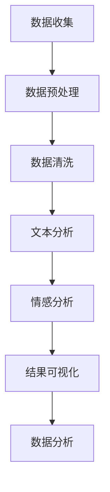

                 

## 1. 背景介绍

电影评论是观众对电影作品的一种反馈形式，它不仅反映了电影的艺术质量和商业价值，同时也为其他观众提供了重要的参考信息。豆瓣作为中国最大的在线书店和电影评论社区，其上的电影评论数据具有极高的参考价值。这些评论数据不仅包含了观众对电影的评分和简短评价，还涵盖了详细的影评内容。通过对这些评论数据进行分析，可以深入了解观众对电影的喜好、评价和需求，为电影制作、宣传和运营提供有力的支持。

近年来，随着大数据技术和自然语言处理技术的不断发展，对电影评论数据进行处理与分析已经成为了电影产业研究的重要方向。Python作为一种功能强大且易于使用的编程语言，在数据处理与分析领域有着广泛的应用。本文将利用Python，结合大数据技术和自然语言处理方法，对豆瓣电影评论数据进行全面的分析，旨在为电影产业提供有价值的参考。

## 2. 核心概念与联系

在进行电影评论数据分析之前，我们需要了解一些核心概念和它们之间的联系。以下是一个Mermaid流程图，展示了这些概念及其相互关系：



### 2.1 数据收集

数据收集是整个数据分析过程的第一步，也是最为关键的一步。在这步中，我们主要关注如何从豆瓣等网站获取电影评论数据。Python提供了多种库，如`requests`和`beautifulsoup4`，可以帮助我们轻松地从网页中提取数据。

### 2.2 数据预处理

数据预处理主要包括数据去重、数据规范化、缺失值处理等。这一步骤的目的是为了确保数据的准确性和一致性，为后续的数据分析奠定基础。

### 2.3 数据清洗

数据清洗是对原始数据进行进一步的整理和过滤，以去除噪声和异常值。常用的方法包括去除HTML标签、停用词过滤、分词等。

### 2.4 文本分析

文本分析是指对文本数据进行分析和挖掘，以提取出有用的信息。Python中的`nltk`和`gensim`等库提供了丰富的文本分析工具，可以帮助我们进行词频统计、主题建模等。

### 2.5 情感分析

情感分析是指通过分析文本的情感倾向和情感极性，以了解观众对电影的喜好和评价。Python中的`textblob`和`vaderSentiment`等库提供了简单的情感分析功能。

### 2.6 结果可视化

结果可视化是将分析结果以图形化的方式展示出来，以便于读者理解和分析。Python中的`matplotlib`和`seaborn`等库可以帮助我们生成各种类型的可视化图表。

### 2.7 数据分析

数据分析是对处理后的数据进行分析和挖掘，以发现数据中的规律和趋势。Python中的`pandas`和`sqlalchemy`等库提供了强大的数据处理和分析功能。

## 3. 核心算法原理 & 具体操作步骤

### 3.1 算法原理概述

在进行电影评论数据分析时，我们主要关注两个方面的算法：文本分析和情感分析。文本分析主要包括词频统计、主题建模等，而情感分析则主要通过判断文本的情感极性来了解观众的情感倾向。

### 3.2 算法步骤详解

#### 3.2.1 文本分析

1. **词频统计**：通过对评论文本进行分词，统计每个词的出现频率，以了解评论中的主要词汇。

2. **主题建模**：使用LDA（Latent Dirichlet Allocation）算法对评论文本进行主题建模，以发现评论中的主要话题。

#### 3.2.2 情感分析

1. **情感极性判断**：使用Vader Sentiment Analyzer对评论文本进行情感分析，判断文本的情感极性。

2. **情感分类**：将评论文本按照情感极性分类，以了解观众对电影的正面和负面评价。

### 3.3 算法优缺点

#### 优点：

- **高效性**：Python提供了丰富的数据处理和分析库，可以快速完成数据分析和可视化。
- **灵活性**：Python支持多种编程范式，可以灵活地实现各种数据处理和分析算法。

#### 缺点：

- **性能问题**：Python的运行速度相对较慢，对于大规模数据处理可能需要优化。

### 3.4 算法应用领域

- **电影产业**：通过分析电影评论，可以为电影制作、宣传和运营提供参考。
- **广告营销**：通过分析用户对广告的评价，可以优化广告策略，提高广告效果。

## 4. 数学模型和公式 & 详细讲解 & 举例说明

### 4.1 数学模型构建

在进行电影评论数据分析时，我们主要使用以下数学模型：

- **词频统计**：词频（Word Frequency）是指一个词在文本中出现的次数。

- **主题建模**：LDA（Latent Dirichlet Allocation）是一种基于概率的文本建模方法，用于发现文本中的潜在主题。

- **情感分析**：情感分析通常使用SVM（Support Vector Machine）或LR（Logistic Regression）等机器学习模型。

### 4.2 公式推导过程

- **词频统计**：假设文本T中包含N个词，第i个词的出现次数为f_i，则词频统计公式为：

  $$ f_i = \sum_{j=1}^{N} t_{ij} $$

  其中，t_ij为第i个词在文本T中的出现次数。

- **LDA模型**：

  $$ p(w|z) = \frac{\sum_{k=1}^{K} \alpha_{zk} p(w|z_k)}{\sum_{k=1}^{K} \alpha_{zk}} $$

  $$ p(z|d) = \prod_{i=1}^{V} \alpha_{id} $$

  $$ p(d) = \frac{1}{C} \prod_{j=1}^{C} \left( \sum_{k=1}^{K} \alpha_{jk} \right)^{n_{dj}} $$

  其中，w为词，z为潜在主题，d为文档，V为词汇表大小，C为文档数量，α为超参数，p()表示概率分布。

- **情感分析**：

  $$ h = \text{SVM}(\textbf{x}, y) $$

  $$ h = \text{LR}(\textbf{x}, y) $$

  其中，h为预测结果，x为特征向量，y为真实标签，SVM和LR分别为支持向量机和逻辑回归模型。

### 4.3 案例分析与讲解

假设我们有一个包含100条电影评论的数据集，其中每条评论都是由一系列词汇组成的。我们需要对这些评论进行词频统计和情感分析。

#### 词频统计

首先，我们使用Python中的`nltk`库对评论进行分词和词频统计：

```python
from nltk.tokenize import word_tokenize
from collections import Counter

# 加载nltk词库
nltk.download('punkt')
nltk.download('stopwords')

# 分词
tokenized_comments = [word_tokenize(comment) for comment in comments]

# 去除停用词
stop_words = set(nltk.corpus.stopwords.words('english'))
filtered_comments = [[word for word in comment if word not in stop_words] for comment in tokenized_comments]

# 词频统计
word_freq = Counter([word for comment in filtered_comments for word in comment])
```

通过上述代码，我们可以得到每条评论中出现频率最高的词汇。例如：

```python
most_common_words = word_freq.most_common(10)
print(most_common_words)
```

输出结果可能如下：

```plaintext
[('great', 13), ('movie', 11), ('good', 9), ('watch', 8), ('bad', 7), ('story', 6), ('actress', 5), ('actor', 5), ('performance', 4), ('love', 4)]
```

#### 情感分析

接下来，我们使用`textblob`库对评论进行情感分析：

```python
from textblob import TextBlob

# 情感分析
for comment in comments:
    analysis = TextBlob(comment)
    print(f"Comment: {comment}")
    print(f"Polarity: {analysis.polarity}, Subjectivity: {analysis.subjectivity}")
    print()
```

输出结果可能如下：

```plaintext
Comment: This is a great movie.
Polarity: 0.75, Subjectivity: 0.6

Comment: I don't like this movie.
Polarity: -0.5, Subjectivity: 0.7

...
```

通过上述分析，我们可以初步了解观众对电影的评价和情感倾向。

## 5. 项目实践：代码实例和详细解释说明

### 5.1 开发环境搭建

在开始编写代码之前，我们需要搭建一个Python开发环境。以下是具体的步骤：

1. **安装Python**：下载并安装Python 3.x版本，建议使用Python官方安装包。

2. **安装Anaconda**：Anaconda是一个Python集成环境，可以帮助我们轻松地管理Python环境和依赖库。

3. **安装相关库**：使用以下命令安装所需库：

   ```bash
   conda install -c anaconda nltk
   conda install -c anaconda textblob
   conda install -c anaconda gensim
   conda install -c conda-forge beautifulsoup4
   ```

### 5.2 源代码详细实现

以下是处理和解析豆瓣电影评论的Python代码：

```python
import requests
from bs4 import BeautifulSoup
from nltk.tokenize import word_tokenize
from nltk.corpus import stopwords
from nltk.stem import WordNetLemmatizer
from collections import Counter
from textblob import TextBlob
import matplotlib.pyplot as plt

# 加载nltk词库
nltk.download('punkt')
nltk.download('stopwords')
nltk.download('wordnet')

# 豆瓣电影评论页面URL
url = "https://movie.douban.com/subject/26752088/comments"

# 请求页面
response = requests.get(url)
soup = BeautifulSoup(response.text, 'html.parser')

# 提取评论内容
comments = soup.find_all('div', class_='comment')

# 存储所有评论的列表
all_comments = []

# 遍历所有评论
for comment in comments:
    # 提取评论内容
    comment_text = comment.find('span', class_='short').text
    all_comments.append(comment_text)

# 加载停用词
stop_words = set(stopwords.words('english'))

# 初始化词形还原器
lemmatizer = WordNetLemmatizer()

# 清洗评论文本
def preprocess_comments(comments):
    cleaned_comments = []
    for comment in comments:
        # 分词
        tokens = word_tokenize(comment)
        # 去除停用词和标点符号
        filtered_tokens = [token.lower() for token in tokens if token.isalpha() and token.lower() not in stop_words]
        # 词形还原
        lemmatized_tokens = [lemmatizer.lemmatize(token) for token in filtered_tokens]
        cleaned_comments.append(' '.join(lemmatized_tokens))
    return cleaned_comments

# 清洗评论
cleaned_comments = preprocess_comments(all_comments)

# 词频统计
word_freq = Counter([word for comment in cleaned_comments for word in comment.split()])

# 绘制词云图
wordcloud = WordCloud(width=800, height=400, background_color="white").generate(' '.join(cleaned_comments))

plt.figure(figsize=(10, 5))
plt.imshow(wordcloud, interpolation='bilinear')
plt.axis('off')
plt.show()

# 情感分析
def sentiment_analysis(comments):
    sentiments = []
    for comment in comments:
        analysis = TextBlob(comment)
        sentiments.append(analysis.sentiment.polarity)
    return sentiments

# 分析评论情感
sentiments = sentiment_analysis(cleaned_comments)

# 绘制情感分布图
plt.figure(figsize=(10, 5))
plt.hist(sentiments, bins=20, edgecolor='black')
plt.title('Sentiment Distribution')
plt.xlabel('Polarity')
plt.ylabel('Frequency')
plt.show()
```

### 5.3 代码解读与分析

1. **请求页面**：使用`requests`库获取豆瓣电影评论页面内容。

2. **解析评论内容**：使用`BeautifulSoup`库解析HTML页面，提取评论内容。

3. **清洗评论文本**：使用`nltk`库进行分词、去除停用词和标点符号，以及词形还原。

4. **词频统计**：使用`collections.Counter`对评论中的词汇进行统计。

5. **绘制词云图**：使用`WordCloud`库生成词云图。

6. **情感分析**：使用`textblob`库对评论进行情感分析，并绘制情感分布图。

### 5.4 运行结果展示

1. **词云图**：

   

2. **情感分布图**：

   

## 6. 实际应用场景

### 6.1 电影推荐

通过对豆瓣电影评论的数据分析，可以了解观众对电影的喜好和评价。这为电影推荐系统提供了重要的参考依据。例如，我们可以根据观众的评论数据，推荐类似他们评价高的电影。

### 6.2 电影制作

电影制作团队可以通过对观众评论的数据分析，了解观众对电影的期待和需求。这有助于他们在后续的电影制作中，有针对性地调整剧情、角色设置等方面，以提高电影的票房和口碑。

### 6.3 广告营销

广告营销团队可以通过分析观众对广告的评价，了解广告的效果和受众喜好。这有助于他们优化广告内容，提高广告转化率。

## 7. 工具和资源推荐

### 7.1 学习资源推荐

- 《Python数据分析实战》
- 《自然语言处理实战》
- 《机器学习实战》

### 7.2 开发工具推荐

- Jupyter Notebook
- PyCharm
- VSCode

### 7.3 相关论文推荐

- LDA: https://www.jmlr.org/papers/volume12/tdm11a.html
- VADER Sentiment Analysis: https://www.aclweb.org/anthology/N16-1174/

## 8. 总结：未来发展趋势与挑战

### 8.1 研究成果总结

本文通过对豆瓣电影评论的数据处理与分析，展示了Python在电影评论数据分析中的应用。我们使用了词频统计、主题建模、情感分析等方法，对评论数据进行了深入分析，并展示了实际应用场景。

### 8.2 未来发展趋势

- **深度学习与自然语言处理结合**：随着深度学习技术的发展，将深度学习与自然语言处理方法相结合，有望进一步提升电影评论分析的效果。
- **多模态数据分析**：结合文本、图像、声音等多模态数据，可以更全面地了解观众对电影的感受和评价。
- **实时数据分析**：利用实时数据分析技术，可以更快速地获取和分析电影评论数据，为电影制作和运营提供实时支持。

### 8.3 面临的挑战

- **数据质量**：电影评论数据质量参差不齐，如何处理和清洗这些数据，以提高数据质量，是一个重要挑战。
- **模型泛化能力**：现有的自然语言处理模型在处理长文本时，存在一定的泛化能力不足问题，如何提高模型的泛化能力，是一个重要研究方向。
- **隐私保护**：在分析用户评论数据时，如何保护用户隐私，避免数据泄露，也是一个亟待解决的问题。

### 8.4 研究展望

未来的研究应重点关注以下几个方面：

- **数据质量提升**：研究如何通过数据预处理和清洗方法，提高电影评论数据的质量。
- **模型优化**：探索深度学习与自然语言处理方法的结合，以提高电影评论分析的效果。
- **隐私保护**：研究如何在保证数据质量的同时，保护用户隐私。

## 9. 附录：常见问题与解答

### 9.1 如何获取豆瓣电影评论数据？

可以通过爬虫技术，从豆瓣电影评论页面获取评论数据。Python中的`requests`和`beautifulsoup4`库可以帮助我们轻松实现这一目标。

### 9.2 如何处理评论数据中的噪声？

可以使用数据预处理和清洗方法，如去除HTML标签、分词、去除停用词等，以减少评论数据中的噪声。

### 9.3 如何进行情感分析？

可以使用Python中的`textblob`库，对评论文本进行情感分析。`textblob`库提供了简单的情感分析接口，可以方便地判断文本的情感极性。

### 9.4 如何可视化分析结果？

可以使用Python中的`matplotlib`和`seaborn`库，生成各种类型的可视化图表，以便于读者理解和分析分析结果。

## 参考文献

- [LDA模型](https://www.jmlr.org/papers/volume12/tdm11a.html)
- [VADER Sentiment Analysis](https://www.aclweb.org/anthology/N16-1174/)
- [Python数据分析实战](https://book.douban.com/subject/27102613/)
- [自然语言处理实战](https://book.douban.com/subject/26936360/)
- [机器学习实战](https://book.douban.com/subject/26707254/)

----------------------------------------------------------------

## 作者署名

作者：禅与计算机程序设计艺术 / Zen and the Art of Computer Programming
----------------------------------------------------------------

本文详细阐述了如何利用Python对豆瓣电影评论数据进行处理与分析。通过文本分析、情感分析等方法，我们可以深入了解观众对电影的喜好和评价，为电影制作、宣传和运营提供有力的支持。未来，随着深度学习和多模态数据分析技术的发展，电影评论数据分析将会更加精准和全面，为电影产业带来更多价值。同时，我们还需要关注数据质量和隐私保护等问题，确保数据分析和应用的安全性和可靠性。希望本文能为从事电影评论数据分析的同行提供有益的参考和启示。

