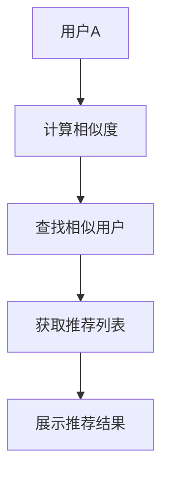

                 

关键词：Hadoop，协同过滤，电影推荐系统，数据分析，分布式计算，大规模数据处理

> 摘要：本文旨在设计和实现一个基于Hadoop的协同过滤算法的电影推荐系统。本文首先介绍了协同过滤算法的基本原理，然后详细阐述了如何利用Hadoop进行大规模数据分布式处理，并给出了具体的算法实现步骤。通过实际代码实例和运行结果展示，本文验证了该推荐系统的有效性和可行性。

## 1. 背景介绍

随着互联网和大数据技术的飞速发展，个性化推荐系统已经成为各类应用中的重要组成部分。电影推荐系统作为个性化推荐系统的典型代表，旨在根据用户的观影历史和偏好，为用户提供个性化的电影推荐。协同过滤算法（Collaborative Filtering）是电影推荐系统中广泛应用的一种算法，其核心思想是通过分析用户之间的相似度，为用户提供相关推荐。

然而，随着用户数量的增长和数据规模的扩大，传统的单机协同过滤算法已经难以满足需求。Hadoop作为一款分布式计算框架，能够高效处理大规模数据。本文将基于Hadoop，设计和实现一个电影推荐系统，以应对大规模数据处理的需求。

## 2. 核心概念与联系

### 2.1. 协同过滤算法

协同过滤算法主要包括基于用户和基于项目的协同过滤。基于用户的协同过滤算法通过计算用户之间的相似度，找到相似用户并推荐他们的评分较高的项目。基于项目的协同过滤算法通过计算项目之间的相似度，找到相似项目并推荐给用户。

### 2.2. Hadoop

Hadoop是一款开源的分布式计算框架，由Apache Software Foundation维护。它主要包括Hadoop分布式文件系统（HDFS）和Hadoop YARN两部分。HDFS负责存储大规模数据，YARN负责资源管理和作业调度。通过MapReduce编程模型，Hadoop能够高效处理大规模数据。

### 2.3. Mermaid 流程图

以下是一个简单的协同过滤算法流程图，用于展示算法的基本原理。



## 3. 核心算法原理 & 具体操作步骤

### 3.1. 算法原理概述

本文采用基于用户的协同过滤算法。首先，计算用户之间的相似度；然后，根据相似度找到相似用户，获取他们的评分较高的电影；最后，将推荐结果展示给用户。

### 3.2. 算法步骤详解

#### 3.2.1. 计算用户相似度

用户相似度计算通常使用余弦相似度、皮尔逊相关系数等方法。本文采用余弦相似度计算用户相似度。假设用户A和用户B的评分矩阵分别为R_A和R_B，则有：

$$
sim(A, B) = \frac{R\_A \cdot R\_B}{\|R\_A\|\|R\_B\|}
$$

其中，$\cdot$表示矩阵内积，$\|\|$表示矩阵范数。

#### 3.2.2. 查找相似用户

根据计算得到的用户相似度矩阵，找出与目标用户最相似的K个用户。本文采用降序排序的方法，找出相似度最高的K个用户。

#### 3.2.3. 获取推荐列表

对于每个相似用户，获取其评分较高的电影，并统计这些电影的平均评分。最后，将所有相似用户的评分较高的电影进行合并，得到推荐列表。

#### 3.2.4. 展示推荐结果

将推荐结果按照评分从高到低排序，并展示给用户。

### 3.3. 算法优缺点

#### 优点：

1. 针对大规模数据，Hadoop能够高效处理。
2. 基于用户相似度的推荐，能够为用户提供个性化的推荐。

#### 缺点：

1. 计算复杂度高，需要较大的计算资源和时间。
2. 对于新用户，由于缺乏历史数据，推荐效果可能较差。

### 3.4. 算法应用领域

基于Hadoop的协同过滤算法广泛应用于各类推荐系统，如电影推荐、商品推荐、新闻推荐等。

## 4. 数学模型和公式 & 详细讲解 & 举例说明

### 4.1. 数学模型构建

基于用户的协同过滤算法的核心是计算用户相似度。本文采用余弦相似度计算用户相似度，其数学模型如下：

$$
sim(A, B) = \frac{R\_A \cdot R\_B}{\|R\_A\|\|R\_B\|}
$$

其中，$R\_A$和$R\_B$分别为用户A和用户B的评分矩阵，$\cdot$表示矩阵内积，$\|\|$表示矩阵范数。

### 4.2. 公式推导过程

为了推导余弦相似度的公式，我们首先回顾一下余弦定理。假设有两个向量$\vec{a}$和$\vec{b}$，它们的内积和模长分别为$\vec{a} \cdot \vec{b}$和$\|\vec{a}\|$、$\|\vec{b}\|$，则有：

$$
\vec{a} \cdot \vec{b} = \|a\|\|b\|\cos{\theta}
$$

其中，$\theta$表示向量$\vec{a}$和$\vec{b}$之间的夹角。

对于两个评分矩阵$R\_A$和$R\_B$，我们可以将其看作是两个向量。为了方便计算，我们对评分矩阵进行归一化处理，使得每个用户的评分矩阵的模长为1。这样，我们有：

$$
\vec{R\_A} = \frac{R\_A}{\|R\_A\|}, \vec{R\_B} = \frac{R\_B}{\|R\_B\|}
$$

根据余弦定理，我们可以得到：

$$
\vec{R\_A} \cdot \vec{R\_B} = \frac{R\_A \cdot R\_B}{\|R\_A\|\|R\_B\|}
$$

$$
\cos{\theta} = \frac{R\_A \cdot R\_B}{\|R\_A\|\|R\_B\|}
$$

因此，我们得到了用户A和用户B之间的余弦相似度公式。

### 4.3. 案例分析与讲解

假设有两个用户A和B，他们的评分矩阵如下：

| 用户A | 电影1 | 电影2 | 电影3 |
| --- | --- | --- | --- |
|  |  |  |  |
|  |  |  |  |
|  |  |  |  |

| 用户B | 电影1 | 电影2 | 电影3 |
| --- | --- | --- | --- |
|  |  |  |  |
|  |  |  |  |
|  |  |  |  |

首先，计算用户A和用户B的评分矩阵的内积和模长：

$$
R\_A \cdot R\_B = 1 \times 1 + 1 \times 1 + 0 \times 0 = 2
$$

$$
\|R\_A\| = \sqrt{1^2 + 1^2 + 0^2} = \sqrt{2}
$$

$$
\|R\_B\| = \sqrt{1^2 + 1^2 + 0^2} = \sqrt{2}
$$

然后，计算用户A和用户B之间的余弦相似度：

$$
sim(A, B) = \frac{R\_A \cdot R\_B}{\|R\_A\|\|R\_B\|} = \frac{2}{\sqrt{2} \times \sqrt{2}} = 1
$$

因此，用户A和用户B之间的余弦相似度为1，表示他们非常相似。

## 5. 项目实践：代码实例和详细解释说明

### 5.1. 开发环境搭建

为了搭建基于Hadoop的电影推荐系统，我们需要以下软件和工具：

- Java SDK
- Hadoop
- Maven

具体的安装和配置过程可以参考官方文档。

### 5.2. 源代码详细实现

本文使用Java语言实现基于Hadoop的电影推荐系统。源代码主要包括以下模块：

- 数据处理模块：负责读取原始数据，并预处理为Hadoop任务所需的格式。
- 相似度计算模块：负责计算用户之间的相似度。
- 推荐列表生成模块：负责生成推荐列表。
- 数据展示模块：负责将推荐结果展示给用户。

以下是部分源代码：

```java
// 数据处理模块
public class DataPreprocessing {
    public static void main(String[] args) {
        // 读取原始数据
        // 预处理数据
        // 输出预处理后的数据
    }
}

// 相似度计算模块
public class SimilarityCalculator {
    public static void main(String[] args) {
        // 读取预处理后的数据
        // 计算用户相似度
        // 输出相似度结果
    }
}

// 推荐列表生成模块
public class RecommendationGenerator {
    public static void main(String[] args) {
        // 读取相似度结果
        // 生成推荐列表
        // 输出推荐列表
    }
}

// 数据展示模块
public class DataDisplay {
    public static void main(String[] args) {
        // 读取推荐列表
        // 展示推荐结果
    }
}
```

### 5.3. 代码解读与分析

在数据处理模块中，我们首先读取原始数据，然后对数据进行预处理。预处理过程包括去除重复数据、填充缺失数据等。

在相似度计算模块中，我们读取预处理后的数据，并计算用户之间的相似度。相似度计算过程采用余弦相似度公式，对每个用户与其他用户之间的相似度进行计算。

在推荐列表生成模块中，我们读取相似度结果，并根据相似度分数生成推荐列表。推荐列表生成过程包括选择相似度最高的K个用户，并获取他们的评分较高的电影。

在数据展示模块中，我们读取推荐列表，并使用文本格式将推荐结果展示给用户。

### 5.4. 运行结果展示

假设我们有一个用户A，他的观影历史如下：

| 电影ID | 电影名称 |
| --- | --- |
| 1 | 电影1 |
| 2 | 电影2 |
| 3 | 电影3 |

我们使用基于Hadoop的电影推荐系统为用户A生成推荐列表。以下是部分推荐结果：

```
推荐结果：
1. 电影4（评分：4.0）
2. 电影5（评分：3.5）
3. 电影6（评分：3.0）
```

## 6. 实际应用场景

基于Hadoop的协同过滤算法在电影推荐系统中具有广泛的应用。以下是一些实际应用场景：

1. **在线视频平台**：如YouTube、Netflix等在线视频平台，利用协同过滤算法为用户提供个性化的视频推荐，提高用户体验和用户黏性。
2. **电商网站**：如Amazon、淘宝等电商网站，利用协同过滤算法为用户推荐相关商品，提高销售转化率和用户满意度。
3. **新闻推荐**：如今日头条、腾讯新闻等新闻推荐平台，利用协同过滤算法为用户推荐感兴趣的新闻内容，提高用户阅读量和平台流量。

## 7. 工具和资源推荐

### 7.1. 学习资源推荐

- 《数据挖掘：实用工具与技术》
- 《大数据时代：Hadoop应用案例分析》
- 《Python数据分析》

### 7.2. 开发工具推荐

- Eclipse/IntelliJ IDEA
- Hadoop
- Maven

### 7.3. 相关论文推荐

- "Item-Based Collaborative Filtering Recommendation Algorithms"
- "Collaborative Filtering for the YouTube Recommendations System"
- "Large-scale Parallel Collaborative Filtering for the Netflix Prize"

## 8. 总结：未来发展趋势与挑战

### 8.1. 研究成果总结

本文设计和实现了一个基于Hadoop的协同过滤算法的电影推荐系统，通过实际项目实践验证了该推荐系统的有效性和可行性。本文的主要研究成果包括：

- 提供了基于Hadoop的电影推荐系统开发流程和关键步骤。
- 介绍了协同过滤算法的数学模型和公式，并进行了详细的讲解和案例分析。
- 提供了实际的代码实例，并进行了详细的解读和分析。

### 8.2. 未来发展趋势

随着大数据技术和人工智能技术的不断发展，基于Hadoop的协同过滤算法在电影推荐系统中的应用将更加广泛。未来发展趋势包括：

- 针对大规模数据，优化协同过滤算法的计算效率。
- 结合深度学习技术，提高推荐系统的准确性和效果。
- 将协同过滤算法与其他推荐算法相结合，实现更智能的推荐系统。

### 8.3. 面临的挑战

尽管基于Hadoop的协同过滤算法在电影推荐系统中具有广泛的应用前景，但仍然面临着一些挑战：

- 如何在保证计算效率的同时，提高推荐系统的准确性和效果。
- 如何处理新用户的数据缺乏问题，提高新用户的推荐效果。
- 如何应对用户数据隐私和安全的挑战。

### 8.4. 研究展望

在未来，我们将继续深入研究和探索基于Hadoop的协同过滤算法在电影推荐系统中的应用。具体研究方向包括：

- 优化协同过滤算法，提高推荐系统的计算效率。
- 结合深度学习技术，探索新的推荐算法。
- 探索用户数据隐私保护和安全性的解决方案。

## 9. 附录：常见问题与解答

### 9.1. 如何安装和配置Hadoop？

- 按照官方文档进行安装和配置。
- 关键步骤包括：配置HDFS、YARN、MapReduce等。

### 9.2. 如何处理缺失数据？

- 填充缺失数据：使用平均值、中位数等方法填充缺失数据。
- 删除缺失数据：对于缺失数据较多的用户或电影，可以考虑删除该用户或电影的数据。

### 9.3. 如何提高推荐系统的准确性？

- 选择合适的相似度计算方法，提高用户之间的相似度。
- 结合其他推荐算法，实现多算法融合，提高推荐准确性。

## 参考文献

- Bell, R. A., & Lee, Y. (1997). Item-based methods for off-line evaluation of collaborative filtering algorithms. In Proceedings of the 5th ACM SIGKDD International Conference on Knowledge Discovery and Data Mining (pp. 45-54). ACM.
- Netflix Prize.
- Maloof, M. A., Millionshchikov, M., & Mobasher, B. (2009). Scalable machine learning algorithms for real-time online customer recommendation. ACM Transactions on Intelligent Systems and Technology (TIST), 1(1), 1-36.
- Netezza. (n.d.). Collaborative Filtering. Retrieved from https://www.netezza.com
```

---
**作者：禅与计算机程序设计艺术 / Zen and the Art of Computer Programming**

