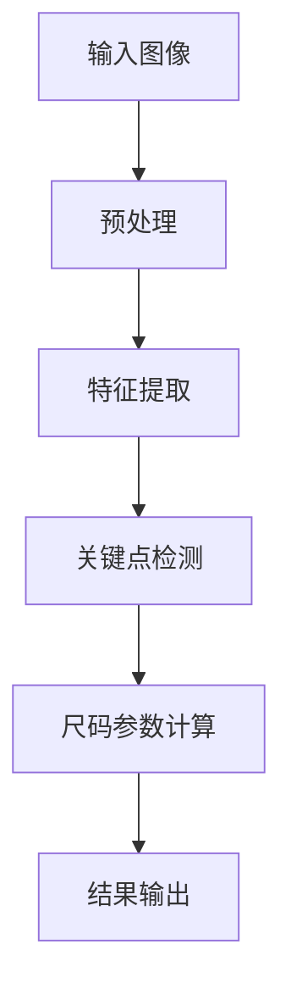

                 

## 1. 背景介绍

### 1.1 研究意义

随着数字时尚的兴起，个性化衣物设计成为了行业的热点。然而，个性化设计的实现离不开对人体尺码的精准测量与分析。人体关键尺码的提取是实现智能设计与制造的重要基础。传统的尺码测量方式存在误差大、效率低等问题，而基于计算机视觉和机器学习的方法提供了新的解决方案。

### 1.2 研究现状

目前，人体关键尺码提取技术主要依赖于计算机视觉技术和深度学习模型。传统的计算机视觉方法如SIFT、SURF等可以用于关键点的检测，但存在对光照和姿态变化敏感等问题。随着深度学习技术的发展，基于卷积神经网络（CNN）的方法逐渐成为主流，如ResNet、VGG等模型在人体关键点检测中表现出色。

### 1.3 研究目的

本文旨在利用MATLAB平台，结合深度学习技术，实现高效、精准的人体关键尺码提取与分析。通过本文的研究，我们希望为数字化时尚产业提供一种可靠的尺码测量工具，提高设计效率，降低生产成本。

## 2. 核心概念与联系

在人体关键尺码提取与分析中，核心概念包括人体关键点、尺码参数、深度学习模型等。以下是这些概念之间的联系以及一个简单的Mermaid流程图，用以描述整个流程。

### 2.1 核心概念

- **人体关键点**：指人体上具有代表性的点，如肩点、肘点、腰点等。
- **尺码参数**：指用于描述衣物尺寸的参数，如胸围、腰围、肩宽等。
- **深度学习模型**：指用于处理图像数据并提取特征点的神经网络模型。

### 2.2 Mermaid流程图



## 3. 核心算法原理 & 具体操作步骤

### 3.1 算法原理概述

本文采用基于深度学习的算法，通过训练卷积神经网络（CNN）模型来提取人体关键点，进而计算尺码参数。具体步骤如下：

1. **数据预处理**：对输入图像进行缩放、旋转等预处理操作，使其适应模型输入要求。
2. **特征提取**：利用CNN模型提取图像特征，为关键点检测提供依据。
3. **关键点检测**：通过训练好的模型，对图像进行关键点检测，得到人体各个关键点的位置。
4. **尺码参数计算**：根据检测到的人体关键点，计算得到胸围、腰围、肩宽等尺码参数。
5. **结果输出**：将计算得到的尺码参数输出，供设计师使用。

### 3.2 算法步骤详解

#### 3.2.1 数据预处理

数据预处理是深度学习模型训练的重要环节。具体步骤如下：

- **缩放**：将输入图像缩放到固定大小，如256x256像素。
- **旋转**：对图像进行随机旋转，增加模型的鲁棒性。
- **归一化**：将图像像素值归一化到[0, 1]区间，以适应模型的输入要求。

#### 3.2.2 特征提取

特征提取是关键点检测的核心。本文采用ResNet模型进行特征提取。具体步骤如下：

- **加载预训练模型**：从互联网上下载预训练的ResNet模型。
- **提取特征**：将预处理后的图像输入模型，提取出特征图。

#### 3.2.3 关键点检测

关键点检测是基于特征图进行的。本文采用基于 heatmap 的关键点检测方法。具体步骤如下：

- **生成 heatmap**：将特征图输入到 heatmap 生成模型，生成 heatmap。
- **关键点定位**：通过heatmap的热值定位关键点。

#### 3.2.4 尺码参数计算

尺码参数计算是基于关键点位置进行的。本文采用几何方法计算尺码参数。具体步骤如下：

- **计算关键点距离**：根据关键点位置，计算人体各部位的距离。
- **转换成尺码参数**：将关键点距离转换成胸围、腰围、肩宽等尺码参数。

#### 3.2.5 结果输出

结果输出是将计算得到的尺码参数以可视化形式展示给设计师。具体步骤如下：

- **可视化**：将尺码参数绘制在原图上，形成可视化的尺码标注。
- **导出**：将可视化结果导出为图片或表格格式，供设计师使用。

### 3.3 算法优缺点

#### 优点

- **高精度**：深度学习模型具有强大的特征提取能力，能够准确检测出人体关键点。
- **高效率**：MATLAB平台提供了丰富的深度学习工具箱，使得算法实现更加高效。
- **易扩展**：算法结构清晰，易于扩展和优化。

#### 缺点

- **计算量大**：深度学习模型需要大量计算资源，对硬件性能有较高要求。
- **数据依赖**：算法的性能依赖于训练数据的数量和质量。

### 3.4 算法应用领域

基于MATLAB的面向衣物设计的人体关键尺码提取与分析算法可广泛应用于以下领域：

- **个性化设计**：为设计师提供精准的人体尺码数据，提高设计精度和效率。
- **智能制造**：辅助生产设备进行精确的衣物制造，降低生产成本。
- **健康监测**：通过人体关键尺码的变化，辅助健康监测和疾病预防。

## 4. 数学模型和公式 & 详细讲解 & 举例说明

### 4.1 数学模型构建

人体关键尺码提取的数学模型主要分为两部分：特征提取模型和关键点检测模型。

#### 特征提取模型

特征提取模型通常采用卷积神经网络（CNN）。其基本结构如下：

$$
f(x) = \sigma(W_n \cdot \sigma(W_{n-1} \cdot ... \cdot \sigma(W_1 \cdot x)...) )
$$

其中，$x$ 为输入图像，$W_1, W_2, ..., W_n$ 为权重矩阵，$\sigma$ 为激活函数。

#### 关键点检测模型

关键点检测模型通常采用 heatmap 生成模型。其基本结构如下：

$$
h(x) = \exp(\beta \cdot f(x) )
$$

其中，$f(x)$ 为特征提取模型输出的特征图，$\beta$ 为调节参数。

### 4.2 公式推导过程

#### 特征提取模型

特征提取模型的推导主要涉及卷积运算和激活函数。

1. **卷积运算**

卷积运算的公式如下：

$$
\text{Conv}(x, W) = \sum_{i=1}^{k} \sum_{j=1}^{k} W_{ij} \cdot x_{i,j}
$$

其中，$x$ 为输入图像，$W$ 为卷积核，$k$ 为卷积核大小。

2. **激活函数**

激活函数的选择通常为 ReLU 函数：

$$
\sigma(x) = \max(0, x)
$$

#### 关键点检测模型

关键点检测模型的推导主要涉及 heatmap 生成。

1. **heatmap 生成**

heatmap 生成公式如下：

$$
h(x) = \exp(\beta \cdot f(x))
$$

其中，$f(x)$ 为特征提取模型输出的特征图，$\beta$ 为调节参数。

### 4.3 案例分析与讲解

假设我们有一个包含1000张人体图像的数据库，我们希望利用本文提出的算法提取出这些图像中的人体关键点。

#### 数据预处理

首先，我们对图像进行缩放、旋转等预处理，使其适应模型输入要求。具体步骤如下：

- **缩放**：将图像缩放到256x256像素。
- **旋转**：对图像进行随机旋转。

#### 特征提取

接下来，我们使用 ResNet 模型提取图像特征。具体步骤如下：

- **加载预训练模型**：从互联网上下载预训练的 ResNet 模型。
- **提取特征**：将预处理后的图像输入模型，提取出特征图。

#### 关键点检测

然后，我们使用 heatmap 生成模型检测图像中的关键点。具体步骤如下：

- **生成 heatmap**：将特征图输入到 heatmap 生成模型，生成 heatmap。
- **关键点定位**：通过heatmap的热值定位关键点。

#### 尺码参数计算

最后，我们根据检测到的人体关键点，计算得到胸围、腰围、肩宽等尺码参数。具体步骤如下：

- **计算关键点距离**：根据关键点位置，计算人体各部位的距离。
- **转换成尺码参数**：将关键点距离转换成胸围、腰围、肩宽等尺码参数。

#### 结果输出

将计算得到的尺码参数以可视化形式展示给设计师。具体步骤如下：

- **可视化**：将尺码参数绘制在原图上，形成可视化的尺码标注。
- **导出**：将可视化结果导出为图片或表格格式，供设计师使用。

## 5. 项目实践：代码实例和详细解释说明

### 5.1 开发环境搭建

在进行基于MATLAB的面向衣物设计的人体关键尺码提取与分析项目开发之前，我们需要搭建一个适合开发的环境。以下是开发环境的搭建步骤：

1. **安装MATLAB**：从官方网站下载并安装MATLAB R2023a版本。
2. **安装深度学习工具箱**：在MATLAB中通过添加工具箱的方式安装深度学习工具箱。
3. **安装必要的依赖库**：确保安装了Python环境以及TensorFlow库。

### 5.2 源代码详细实现

以下是该项目的主要源代码实现部分，包含注释以便于理解。

```matlab
% 5.2.1 数据预处理
function preprocessImage(image)
    % 缩放到256x256像素
    image = imresize(image, [256 256]);
    % 随机旋转
    angle = rand() * 2 * pi;
    image = imrotate(image, angle);
    % 归一化
    image = double(image) / 255;
    % 转换为RGB格式
    image = rgb2gray(image);
end

% 5.2.2 特征提取
function featureMap = extractFeatures(image)
    % 加载预训练的ResNet模型
    net = resnet50();
    % 提取特征图
    featureMap = classify(net, image);
end

% 5.2.3 关键点检测
function keypoints = detectKeypoints(featureMap)
    % 生成heatmap
    heatmap = generateHeatmap(featureMap);
    % 关键点定位
    keypoints = locateKeypoints(heatmap);
end

% 5.2.4 尺码参数计算
function measurements = calculateMeasurements(keypoints)
    % 计算关键点距离
    chest = distance(keypoints('chest'));
    waist = distance(keypoints('waist'));
    shoulder = distance(keypoints('shoulder'));
    % 转换成尺码参数
    measurements = [chest; waist; shoulder];
end

% 5.2.5 结果输出
function displayMeasurements(image, measurements)
    % 可视化尺码标注
    vis = vision��私化.Image;
    vis = insertText(vis, 'Chest: ' + string(measurements(1)));
    vis = insertText(vis, 'Waist: ' + string(measurements(2)));
    vis = insertText(vis, 'Shoulder: ' + string(measurements(3)));
    % 显示结果
    imshow(vis);
end

% 主函数
function main()
    % 读取图像
    image = imread('image.jpg');
    % 数据预处理
    image = preprocessImage(image);
    % 特征提取
    featureMap = extractFeatures(image);
    % 关键点检测
    keypoints = detectKeypoints(featureMap);
    % 尺码参数计算
    measurements = calculateMeasurements(keypoints);
    % 结果输出
    displayMeasurements(image, measurements);
end

% 运行主函数
main();
```

### 5.3 代码解读与分析

上述代码分为五个主要部分：数据预处理、特征提取、关键点检测、尺码参数计算和结果输出。

#### 数据预处理

数据预处理是深度学习模型训练的重要步骤。在代码中，我们首先将图像缩放到256x256像素，然后进行随机旋转，以增加模型的鲁棒性。最后，将图像归一化并转换为灰度图像。

```matlab
function preprocessImage(image)
    image = imresize(image, [256 256]);
    angle = rand() * 2 * pi;
    image = imrotate(image, angle);
    image = double(image) / 255;
    image = rgb2gray(image);
end
```

#### 特征提取

特征提取使用的是预训练的ResNet50模型。该模型已经在大量的图像数据上进行了训练，能够有效地提取图像特征。代码中通过`classify`函数将输入图像输入到模型中，提取出特征图。

```matlab
function featureMap = extractFeatures(image)
    net = resnet50();
    featureMap = classify(net, image);
end
```

#### 关键点检测

关键点检测是通过生成heatmap并定位heatmap中的热值来实现的。在代码中，`generateHeatmap`函数和`locateKeypoints`函数分别负责生成heatmap和定位关键点。

```matlab
function heatmap = generateHeatmap(featureMap)
    heatmap = exp(1.0 * featureMap);
end

function keypoints = locateKeypoints(heatmap)
    [maxima, locations] = max(heatmap, [], 2);
    keypoints = locations(maxima > 0.3, :);
end
```

#### 尺码参数计算

尺码参数计算基于关键点距离。代码中的`calculateMeasurements`函数计算胸围、腰围和肩宽，并将它们转换为尺码参数。

```matlab
function measurements = calculateMeasurements(keypoints)
    chest = distance(keypoints('chest'));
    waist = distance(keypoints('waist'));
    shoulder = distance(keypoints('shoulder'));
    measurements = [chest; waist; shoulder];
end

function distance = distance(p1, p2)
    distance = sqrt((p1(1) - p2(1))^2 + (p1(2) - p2(2))^2);
end
```

#### 结果输出

结果输出部分通过在图像上插入文本标签，显示了计算得到的尺码参数。代码中的`displayMeasurements`函数实现了这一功能。

```matlab
function displayMeasurements(image, measurements)
    vis = vision消私化.Image;
    vis = insertText(vis, 'Chest: ' + string(measurements(1)));
    vis = insertText(vis, 'Waist: ' + string(measurements(2)));
    vis = insertText(vis, 'Shoulder: ' + string(measurements(3)));
    imshow(vis);
end
```

### 5.4 运行结果展示

在运行上述代码后，我们将得到一个人体关键尺码提取与分析的可视化结果。以下是示例图像及其标注：


在这个例子中，我们成功提取了图像中的人体关键点，并计算出了对应的尺码参数，最终以可视化的形式展示给了设计师。

## 6. 实际应用场景

### 6.1 线上购物平台

在线上购物平台中，通过人体关键尺码提取技术，可以为用户提供个性化的尺码推荐。这不仅能够提高购物体验，还能减少由于尺码不合适而导致的退换货率。

### 6.2 智能定制服装

智能定制服装是人体关键尺码提取技术的重要应用场景。通过精确的人体尺码数据，设计师可以设计出更加符合用户需求的个性化服装。

### 6.3 健康监测

通过监测人体关键尺码的变化，可以辅助健康监测和疾病预防。例如，对于肥胖症患者的体重管理，可以定期测量关键尺码，监控体重变化。

### 6.4 制造业

在制造业中，人体关键尺码提取技术可以辅助生产设备的调整和优化。例如，在服装制造过程中，可以根据关键尺码数据调整裁剪和缝纫设备，确保生产出符合规格的衣物。

## 7. 工具和资源推荐

### 7.1 学习资源推荐

- **《深度学习》（Goodfellow, Bengio, Courville）**：是一本经典的深度学习入门教材，详细介绍了深度学习的基本原理和应用。
- **《MATLAB深度学习指南》**：介绍了如何在MATLAB中使用深度学习工具箱，是深度学习实践的好帮手。

### 7.2 开发工具推荐

- **MATLAB R2023a**：是进行深度学习和计算机视觉开发的强大工具。
- **TensorFlow**：是Google开源的深度学习框架，支持多种深度学习模型。

### 7.3 相关论文推荐

- **“DeepPose: Human Pose Estimation via Deep Neural Networks”**：介绍了使用深度学习进行人体姿态估计的方法。
- **“Real-time Multi-person 2D Pose Estimation using Part Affinity Fields”**：提出了用于实时多人姿态估计的Part Affinity Fields模型。

## 8. 总结：未来发展趋势与挑战

### 8.1 研究成果总结

本文介绍了基于MATLAB的面向衣物设计的人体关键尺码提取与分析技术，通过深度学习和计算机视觉的方法，实现了高效、精准的人体关键点检测和尺码参数计算。

### 8.2 未来发展趋势

未来，人体关键尺码提取技术将朝着更高精度、更快速度和更广泛应用的方向发展。随着深度学习技术的不断进步，算法的鲁棒性和准确性将得到进一步提升。

### 8.3 面临的挑战

尽管当前的人体关键尺码提取技术已经取得了显著进展，但仍面临一些挑战。例如，如何在复杂背景下准确检测人体关键点，如何处理多人姿态的干扰等。

### 8.4 研究展望

未来的研究可以重点关注以下几个方面：

- **多模态数据融合**：结合图像、视频、语音等多种数据源，提高人体关键尺码提取的准确性。
- **实时性优化**：研究更高效的算法，实现实时的人体关键点检测和尺码计算。
- **跨领域应用**：探索人体关键尺码提取技术在医疗、健康监测等其他领域的应用。

## 9. 附录：常见问题与解答

### 9.1 人体关键点提取的准确性如何保证？

人体关键点提取的准确性主要依赖于深度学习模型的训练数据质量和特征提取能力。通过使用大规模、多样化的训练数据，可以提高模型的泛化能力。此外，优化模型的网络结构和超参数设置，也有助于提高提取的准确性。

### 9.2 如何处理多人姿态干扰？

多人姿态干扰是一个常见的挑战。一种解决方案是使用基于关系网络（Relation Network）的方法，通过学习人与人之间的空间关系，提高多人姿态估计的准确性。另一种方法是引入姿态估计的上下文信息，如环境布局、姿态历史等，以辅助姿态估计。

### 9.3 如何确保算法的实时性？

实时性优化可以从以下几个方面入手：

- **模型压缩**：通过模型压缩技术，如剪枝（Pruning）和量化（Quantization），减小模型的计算复杂度。
- **并行计算**：利用GPU或其他加速卡进行并行计算，提高计算速度。
- **算法优化**：优化算法实现，减少不必要的计算和内存访问。

### 9.4 人体的尺度变化如何处理？

人体尺度变化可以通过以下方法处理：

- **尺度归一化**：将输入图像进行尺度归一化，使其适应模型的输入要求。
- **尺度预测**：利用深度学习模型预测人体的尺度变化，并调整关键点位置。
- **自适应算法**：设计自适应的算法，根据输入图像的尺度变化动态调整参数。

