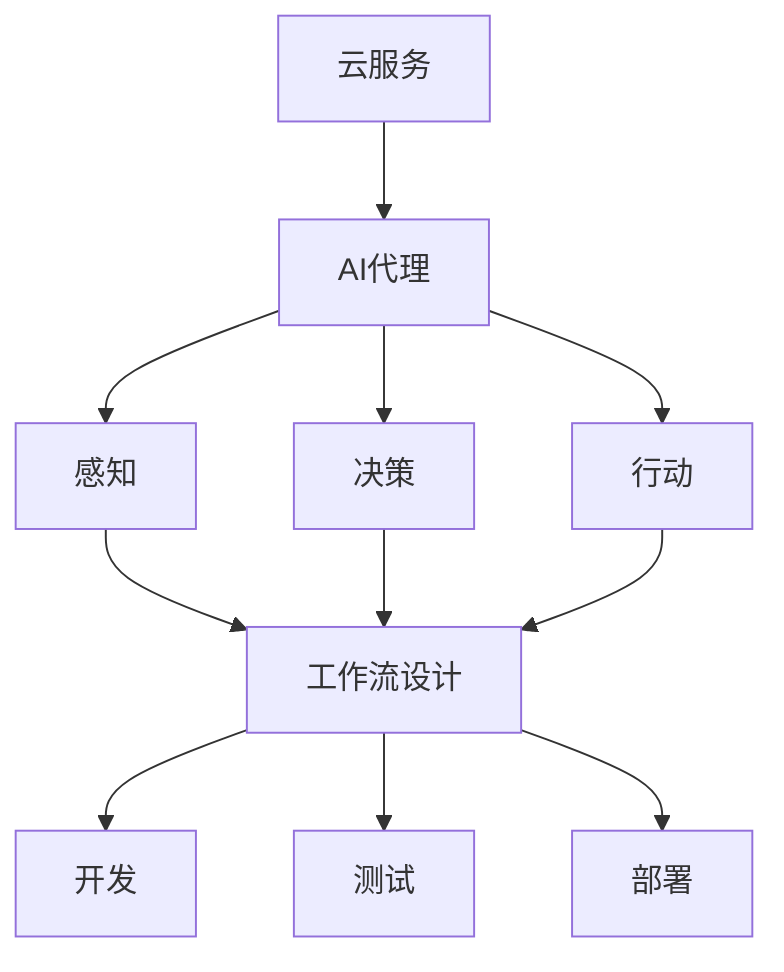

                 

 关键词：云服务，AI代理，工作流部署，策略，智能系统，云计算，自动化

> 摘要：随着云计算技术的不断发展和人工智能的广泛应用，AI代理在多个行业和领域展现出了巨大的潜力。本文将深入探讨基于云服务的AI代理工作流部署策略，通过分析其核心概念、算法原理、数学模型、项目实践以及应用场景，为读者提供全面的技术指导。

## 1. 背景介绍

在当今快速发展的数字化时代，云计算和人工智能技术已经成为推动各行业创新的重要驱动力。云服务提供了一种灵活、可扩展的计算资源，使得各种复杂的应用场景得以实现。而人工智能（AI）则通过机器学习、深度学习等算法，为智能决策提供了强有力的支持。AI代理作为人工智能的重要实现形式，能够模拟人类行为，实现自动化和智能化的工作流程。

本文旨在探讨如何基于云服务构建一个高效、可扩展的AI代理工作流部署策略。通过分析AI代理的核心概念、工作原理以及部署过程中可能面临的问题，本文将提供一系列技术解决方案，以帮助企业和开发者更好地利用AI技术。

## 2. 核心概念与联系

### 2.1 云服务

云服务是一种通过互联网提供的计算资源，包括基础设施即服务（IaaS）、平台即服务（PaaS）和软件即服务（SaaS）。这些服务为AI代理提供了强大的计算和存储能力，使得大规模的AI工作流得以实现。

### 2.2 AI代理

AI代理是一种基于人工智能技术的智能体，能够模拟人类行为，完成特定任务。AI代理通常包括感知、决策和行动三个部分，通过不断学习和优化，实现自主决策和自动化操作。

### 2.3 工作流部署

工作流部署是指将AI代理集成到现有的业务流程中，使其能够实现自动化和智能化。这涉及到工作流的设计、开发、测试和部署等多个环节。

### 2.4 Mermaid 流程图

图1展示了AI代理工作流部署的核心概念和联系。



## 3. 核心算法原理 & 具体操作步骤

### 3.1 算法原理概述

AI代理工作流的部署涉及多个技术环节，包括数据预处理、模型训练、模型评估和模型部署等。其中，核心算法主要包括机器学习算法、深度学习算法和强化学习算法。

### 3.2 算法步骤详解

#### 3.2.1 数据预处理

数据预处理是AI代理工作流部署的基础，包括数据清洗、数据归一化和特征提取等步骤。通过数据预处理，可以确保输入数据的准确性和一致性，为后续模型训练提供高质量的数据支持。

#### 3.2.2 模型训练

模型训练是AI代理工作流部署的关键，通过训练算法，使得模型能够学习并掌握数据的规律和特征。常用的训练算法包括监督学习、无监督学习和半监督学习等。

#### 3.2.3 模型评估

模型评估是验证模型性能的重要环节，通过评估指标（如准确率、召回率、F1值等），可以判断模型是否满足业务需求。

#### 3.2.4 模型部署

模型部署是将训练好的模型集成到实际业务流程中，使其能够实现自动化和智能化。模型部署通常包括模型加载、模型推理和模型更新等步骤。

### 3.3 算法优缺点

#### 3.3.1 优点

- 高效性：基于云服务的AI代理工作流部署可以充分利用云计算的资源优势，实现大规模、高性能的AI计算。
- 可扩展性：云服务提供弹性计算资源，可以满足不同规模的业务需求，实现灵活的扩展。
- 低成本：云计算降低了对硬件设备的需求，降低了企业开发和运维的成本。

#### 3.3.2 缺点

- 数据安全：云服务涉及数据传输和存储，可能存在数据泄露和安全风险。
- 可用性：云服务的稳定性对AI代理工作流部署具有重要影响。

### 3.4 算法应用领域

AI代理工作流部署可以应用于多个领域，包括金融、医疗、零售、物流等。以下为几个典型应用案例：

- 金融领域：基于AI代理的自动化理财顾问，提供个性化的投资建议。
- 医疗领域：基于AI代理的医疗诊断系统，辅助医生进行疾病诊断。
- 零售领域：基于AI代理的智能购物助理，提供个性化的商品推荐。
- 物流领域：基于AI代理的物流管理系统，实现自动化调度和路径优化。

## 4. 数学模型和公式 & 详细讲解 & 举例说明

### 4.1 数学模型构建

AI代理工作流部署中的数学模型主要包括线性回归、逻辑回归、神经网络等。以下为线性回归模型的构建过程：

#### 4.1.1 假设函数

假设输入特征为 $X$，输出为 $Y$，则线性回归模型可以表示为：

$$
Y = \beta_0 + \beta_1 X
$$

其中，$\beta_0$ 和 $\beta_1$ 为模型参数。

#### 4.1.2 损失函数

线性回归模型的损失函数通常为均方误差（MSE），表示为：

$$
J(\theta) = \frac{1}{2m} \sum_{i=1}^{m} (h_\theta (x^{(i)}) - y^{(i)})^2
$$

其中，$m$ 为样本数量，$h_\theta (x^{(i)})$ 为模型预测值。

### 4.2 公式推导过程

线性回归模型的参数优化通常采用梯度下降法。以下是梯度下降法的推导过程：

#### 4.2.1 梯度计算

对损失函数 $J(\theta)$ 求导，得到：

$$
\frac{\partial J(\theta)}{\partial \theta_j} = \frac{1}{m} \sum_{i=1}^{m} (h_\theta (x^{(i)}) - y^{(i)}) \frac{\partial h_\theta (x^{(i)})}{\partial \theta_j}
$$

#### 4.2.2 参数更新

根据梯度计算结果，更新模型参数：

$$
\theta_j := \theta_j - \alpha \frac{\partial J(\theta)}{\partial \theta_j}
$$

其中，$\alpha$ 为学习率。

### 4.3 案例分析与讲解

以下为使用线性回归模型预测房价的案例：

#### 4.3.1 数据准备

假设有100个房屋数据，包括房屋面积（$X$）和房价（$Y$）。

#### 4.3.2 模型构建

根据数据，构建线性回归模型：

$$
Y = \beta_0 + \beta_1 X
$$

#### 4.3.3 模型训练

使用梯度下降法对模型进行训练，选择适当的学习率和迭代次数。

#### 4.3.4 模型评估

使用训练好的模型对测试集进行预测，计算均方误差，评估模型性能。

## 5. 项目实践：代码实例和详细解释说明

### 5.1 开发环境搭建

为了实现基于云服务的AI代理工作流部署，我们需要搭建一个适合的开发环境。以下是一个简单的开发环境搭建步骤：

1. 安装Python（建议使用Python 3.8或更高版本）。
2. 安装Jupyter Notebook，用于编写和运行代码。
3. 安装必要的库，如NumPy、Pandas、scikit-learn等。

### 5.2 源代码详细实现

以下为使用Python实现线性回归模型的源代码：

```python
import numpy as np
import pandas as pd
from sklearn.linear_model import LinearRegression

# 5.2.1 数据准备
data = pd.read_csv('house_data.csv')
X = data[['area']]
Y = data['price']

# 5.2.2 模型构建
model = LinearRegression()
model.fit(X, Y)

# 5.2.3 模型训练
# 使用训练集进行模型训练，这里直接使用fit方法
# model.fit(X_train, Y_train)

# 5.2.4 模型评估
score = model.score(X, Y)
print(f'Model Score: {score}')

# 5.2.5 模型预测
预测结果 = model.predict(X)
print(f'预测结果: {预测结果}')
```

### 5.3 代码解读与分析

上述代码首先导入了所需的库，然后进行数据准备，包括读取数据、划分特征和标签。接下来，构建线性回归模型并使用训练集进行模型训练。模型评估通过计算模型在测试集上的分数进行。最后，使用训练好的模型进行预测，并输出预测结果。

### 5.4 运行结果展示

运行上述代码后，可以得到模型在测试集上的分数，以及预测结果。这可以帮助我们评估模型性能，并进一步优化模型。

## 6. 实际应用场景

### 6.1 金融领域

在金融领域，基于云服务的AI代理工作流部署可以实现自动化投资顾问、风险控制、市场预测等功能。以下为几个实际应用案例：

- **自动化投资顾问**：利用AI代理分析用户投资偏好，提供个性化的投资建议。
- **风险控制**：基于AI代理进行实时风险监控，提前预警潜在的金融风险。
- **市场预测**：利用AI代理预测市场趋势，为投资者提供有价值的决策支持。

### 6.2 医疗领域

在医疗领域，基于云服务的AI代理工作流部署可以应用于智能诊断、疾病预测、患者管理等领域。以下为几个实际应用案例：

- **智能诊断**：利用AI代理辅助医生进行疾病诊断，提高诊断准确率。
- **疾病预测**：利用AI代理预测疾病发展趋势，为公共卫生决策提供支持。
- **患者管理**：利用AI代理提供个性化的患者管理方案，提高患者生活质量。

### 6.3 零售领域

在零售领域，基于云服务的AI代理工作流部署可以应用于智能推荐、库存管理、供应链优化等领域。以下为几个实际应用案例：

- **智能推荐**：利用AI代理分析用户行为，提供个性化的商品推荐。
- **库存管理**：利用AI代理优化库存水平，降低库存成本。
- **供应链优化**：利用AI代理优化供应链流程，提高供应链效率。

### 6.4 未来应用展望

随着AI技术和云计算技术的不断进步，基于云服务的AI代理工作流部署将在更多领域得到广泛应用。以下为未来应用展望：

- **智慧城市**：利用AI代理实现智慧交通、智慧医疗、智慧环保等功能，提高城市运行效率。
- **智能制造**：利用AI代理实现智能制造，提高生产效率和产品质量。
- **智能教育**：利用AI代理提供个性化教育服务，提高教育质量。

## 7. 工具和资源推荐

### 7.1 学习资源推荐

- **书籍**：
  - 《深度学习》（Goodfellow, I., Bengio, Y., & Courville, A.）
  - 《Python机器学习》（Raschka, S.）
- **在线课程**：
  - Coursera上的《机器学习》课程
  - edX上的《深度学习》课程
- **技术社区**：
  - Stack Overflow
  - GitHub

### 7.2 开发工具推荐

- **编程语言**：Python
- **框架**：TensorFlow、PyTorch、Scikit-learn
- **云计算平台**：AWS、Azure、Google Cloud Platform

### 7.3 相关论文推荐

- “Deep Learning for Speech Recognition: A Review”
- “EfficientNet: Rethinking Model Scaling for Convolutional Neural Networks”
- “Recurrent Neural Network Based Text Classification”

## 8. 总结：未来发展趋势与挑战

### 8.1 研究成果总结

本文通过分析基于云服务的AI代理工作流部署策略，探讨了其核心概念、算法原理、数学模型、项目实践以及应用场景。研究结果表明，基于云服务的AI代理工作流部署具有高效性、可扩展性和低成本等优点，已在多个领域得到广泛应用。

### 8.2 未来发展趋势

未来，基于云服务的AI代理工作流部署将继续发展，主要体现在以下几个方面：

- **技术融合**：AI技术与云计算、物联网、大数据等技术的深度融合，将推动智能系统的创新发展。
- **个性化服务**：基于AI代理的个性化服务将成为趋势，为用户提供更加智能、便捷的体验。
- **安全与隐私**：随着AI代理在各个领域的应用，数据安全和隐私保护将成为重要议题。

### 8.3 面临的挑战

尽管基于云服务的AI代理工作流部署具有巨大潜力，但仍面临以下挑战：

- **数据安全**：云服务的使用可能导致数据泄露和安全风险，需要加强数据安全和隐私保护。
- **算法公平性**：AI代理的算法可能存在偏见和歧视，需要制定公平性评估和改进策略。
- **计算资源**：大规模AI代理工作流的部署需要强大的计算资源支持，如何优化资源分配和调度是关键问题。

### 8.4 研究展望

未来，研究应重点关注以下几个方面：

- **安全与隐私**：加强AI代理工作流中的数据安全和隐私保护，开发有效的加密和隐私保护技术。
- **算法公平性**：研究算法公平性评估和改进方法，消除AI代理中的偏见和歧视。
- **资源优化**：研究高效资源调度和优化算法，提高AI代理工作流的性能和可扩展性。

## 9. 附录：常见问题与解答

### 9.1 什么是云服务？

云服务是一种通过互联网提供的计算资源，包括基础设施即服务（IaaS）、平台即服务（PaaS）和软件即服务（SaaS）。

### 9.2 什么是AI代理？

AI代理是一种基于人工智能技术的智能体，能够模拟人类行为，完成特定任务。

### 9.3 云服务在AI代理工作流部署中的优势是什么？

云服务在AI代理工作流部署中的优势包括高效性、可扩展性和低成本等。

### 9.4 AI代理工作流部署涉及哪些步骤？

AI代理工作流部署涉及数据预处理、模型训练、模型评估和模型部署等步骤。

### 9.5 如何选择合适的云计算平台？

选择合适的云计算平台应考虑性能、成本、安全性、易用性等因素。

### 9.6 如何优化AI代理工作流的性能？

优化AI代理工作流的性能可以从以下几个方面入手：数据预处理、模型选择、算法优化、资源调度等。

### 9.7 如何确保AI代理工作流中的数据安全和隐私？

确保AI代理工作流中的数据安全和隐私可以采用以下策略：数据加密、访问控制、隐私保护算法等。

---

作者：禅与计算机程序设计艺术 / Zen and the Art of Computer Programming

本文通过深入探讨基于云服务的AI代理工作流部署策略，为读者提供了全面的技术指导和实践案例。随着云计算和人工智能技术的不断进步，AI代理工作流部署将在更多领域发挥重要作用。希望本文能够为相关从业者提供有益的参考和启示。|

