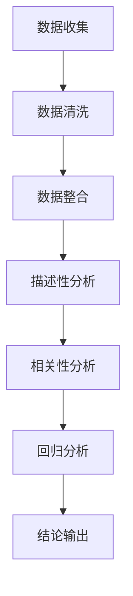

                 

关键词：招聘数据分析、前程无忧、招聘岗位、人才市场、职业发展

> 摘要：本文通过深入分析前程无忧平台上的招聘岗位数据，探讨当前IT行业人才市场的现状，揭示招聘流程中的关键问题，并提出相应的优化建议。文章旨在为企业和求职者提供有价值的参考，助力职业发展。

## 1. 背景介绍

在全球数字化浪潮的推动下，IT行业持续发展，市场需求不断扩大，对专业人才的需求也日益增长。然而，人才供需不平衡的问题依然存在，如何更有效地匹配求职者与岗位需求成为关键挑战。前程无忧作为中国领先的招聘平台，积累了大量招聘数据，为研究人才市场提供了丰富的素材。本文将利用这些数据，对当前IT行业的人才需求、招聘流程及职业发展进行深入分析。

### 1.1 前程无忧平台介绍

前程无忧（51Job）成立于1999年，是中国最早、最大的综合性人力资源服务企业之一。平台提供包括招聘、培训、薪酬福利咨询等一系列服务，覆盖全国近300个城市。截至2023年，前程无忧注册用户超过1亿，每天发布超过20万个岗位，为企业和求职者搭建了高效的连接桥梁。

### 1.2 招聘数据分析的意义

招聘数据分析对于理解人才市场的动态、优化招聘流程、提升求职者匹配度具有重要意义。通过数据，我们可以更准确地识别行业趋势、岗位需求、薪资水平等关键信息，从而为企业和求职者提供更具针对性的建议。本文将结合前程无忧的数据，对这些方面进行详细探讨。

## 2. 核心概念与联系

为了更好地理解招聘数据分析，我们需要先了解一些核心概念，包括数据来源、数据类型、数据分析方法等。

### 2.1 数据来源

前程无忧平台上的招聘数据来源于企业发布的招聘信息。这些信息包括岗位名称、工作地点、招聘人数、职位要求、薪资范围等。数据覆盖面广泛，能够反映当前IT行业的整体招聘状况。

### 2.2 数据类型

招聘数据主要分为结构化数据和非结构化数据。结构化数据如职位名称、薪资范围、工作经验要求等，可以直接进行量化分析。非结构化数据如职位描述、公司简介等，则需要通过自然语言处理技术进行语义分析和提取。

### 2.3 数据分析方法

数据分析方法包括描述性分析、相关性分析、回归分析、聚类分析等。描述性分析用于展示数据的分布情况；相关性分析用于发现不同变量之间的关系；回归分析用于预测未来趋势；聚类分析用于将相似数据分组。

### 2.4 Mermaid 流程图

以下是一个简化的招聘数据分析流程图，用于展示数据处理和分析的主要步骤：



## 3. 核心算法原理 & 具体操作步骤

### 3.1 算法原理概述

招聘数据分析的核心算法主要包括描述性分析、相关性分析和回归分析。描述性分析用于初步了解数据分布；相关性分析用于发现关键因素之间的关系；回归分析用于预测未来趋势。

### 3.2 算法步骤详解

#### 3.2.1 描述性分析

1. 数据收集：从前程无忧平台获取招聘数据。
2. 数据清洗：去除重复数据、缺失数据和异常数据。
3. 数据整合：将不同来源的数据进行整合，形成统一的数据集。
4. 数据展示：使用图表（如柱状图、饼图等）展示数据分布情况。

#### 3.2.2 相关性分析

1. 数据预处理：对数据进行标准化处理，消除量纲影响。
2. 选择相关性指标：如皮尔逊相关系数、斯皮尔曼相关系数等。
3. 计算相关性：对数据集进行相关性计算，找出关键因素之间的关系。

#### 3.2.3 回归分析

1. 数据准备：选择适当的特征变量和目标变量。
2. 选择回归模型：如线性回归、逻辑回归等。
3. 模型训练：使用训练数据集对模型进行训练。
4. 模型评估：使用测试数据集评估模型性能。
5. 预测：使用训练好的模型对未知数据进行预测。

### 3.3 算法优缺点

#### 优

- **描述性分析**：直观、易懂，能够快速了解数据分布。
- **相关性分析**：能够发现关键因素之间的关系，为决策提供依据。
- **回归分析**：能够预测未来趋势，为企业制定招聘策略提供参考。

#### 缺

- **描述性分析**：只能描述现状，无法预测未来。
- **相关性分析**：可能存在伪相关性，需要进一步验证。
- **回归分析**：需要大量的历史数据支持，且模型可能过拟合。

### 3.4 算法应用领域

- **人才招聘**：帮助企业了解人才市场动态，制定招聘策略。
- **薪酬管理**：分析不同岗位的薪资水平，为薪酬调整提供依据。
- **职业规划**：为求职者提供职业发展方向和建议。

## 4. 数学模型和公式 & 详细讲解 & 举例说明

### 4.1 数学模型构建

招聘数据分析的数学模型主要包括描述性统计模型、相关性统计模型和回归分析模型。

#### 描述性统计模型

描述性统计模型用于描述数据的基本特征，如均值、方差、标准差等。常见的描述性统计量有：

- **均值**：$\bar{x} = \frac{1}{n} \sum_{i=1}^{n} x_i$
- **方差**：$s^2 = \frac{1}{n-1} \sum_{i=1}^{n} (x_i - \bar{x})^2$
- **标准差**：$s = \sqrt{s^2}$

#### 相关性统计模型

相关性统计模型用于分析两个变量之间的关系。常见的相关性统计量有：

- **皮尔逊相关系数**：$r = \frac{\sum_{i=1}^{n} (x_i - \bar{x})(y_i - \bar{y})}{\sqrt{\sum_{i=1}^{n} (x_i - \bar{x})^2 \sum_{i=1}^{n} (y_i - \bar{y})^2}}$
- **斯皮尔曼相关系数**：$s = \frac{1}{n-1} \sum_{i=1}^{n} (x_i - \bar{x})(y_i - \bar{y})$

#### 回归分析模型

回归分析模型用于预测目标变量的值。常见的回归分析模型有：

- **线性回归模型**：$y = \beta_0 + \beta_1 x_1 + \beta_2 x_2 + ... + \beta_n x_n$
- **逻辑回归模型**：$P(Y=1) = \frac{1}{1 + e^{-(\beta_0 + \beta_1 x_1 + \beta_2 x_2 + ... + \beta_n x_n)}$

### 4.2 公式推导过程

以线性回归模型为例，推导过程如下：

1. **假设**：数据集 $D = \{ (x_1, y_1), (x_2, y_2), ..., (x_n, y_n) \}$ 满足线性关系 $y = \beta_0 + \beta_1 x_1 + \beta_2 x_2 + ... + \beta_n x_n$。

2. **目标**：求解回归系数 $\beta_0, \beta_1, ..., \beta_n$。

3. **损失函数**：使用均方误差（MSE）作为损失函数，即 $J(\theta) = \frac{1}{2m} \sum_{i=1}^{m} (h_\theta(x^{(i)}) - y^{(i)})^2$。

4. **梯度下降**：对损失函数求偏导数，得到梯度下降更新公式 $\theta_j := \theta_j - \alpha \frac{\partial J(\theta)}{\partial \theta_j}$。

5. **迭代计算**：重复执行梯度下降更新公式，直到满足收敛条件。

### 4.3 案例分析与讲解

假设我们有一组招聘数据，包括薪资（$y$）和工作经验（$x$）。我们希望通过线性回归模型预测薪资。

1. **数据准备**：收集薪资和工作经验的数据，并进行预处理。

2. **模型构建**：选择线性回归模型，设定初始参数 $\theta_0, \theta_1$。

3. **模型训练**：使用梯度下降算法对模型进行训练。

4. **模型评估**：使用测试数据集评估模型性能，计算预测误差。

5. **结果分析**：根据预测误差调整模型参数，优化模型性能。

通过以上步骤，我们可以得到一个预测薪资的线性回归模型，从而为求职者提供参考。

## 5. 项目实践：代码实例和详细解释说明

### 5.1 开发环境搭建

本文使用Python编程语言进行招聘数据分析，主要依赖以下库：

- **NumPy**：用于数值计算。
- **Pandas**：用于数据处理。
- **Matplotlib**：用于数据可视化。
- **Scikit-learn**：用于机器学习算法。

在本地环境安装这些库，可以使用以下命令：

```bash
pip install numpy pandas matplotlib scikit-learn
```

### 5.2 源代码详细实现

以下是一个简单的招聘数据分析示例代码：

```python
import numpy as np
import pandas as pd
import matplotlib.pyplot as plt
from sklearn.linear_model import LinearRegression

# 5.2.1 数据收集
# 从前程无忧平台获取招聘数据，此处为示例数据
data = pd.read_csv('job_data.csv')

# 5.2.2 数据清洗
# 去除重复数据、缺失数据和异常数据
data.drop_duplicates(inplace=True)
data.dropna(inplace=True)

# 5.2.3 数据整合
# 整合薪资和工作经验数据
X = data['工作经验'].values.reshape(-1, 1)
y = data['薪资'].values

# 5.2.4 描述性分析
# 统计薪资和工作经验的均值、方差等
mean_salary = np.mean(y)
var_salary = np.var(y)
print(f'薪资均值：{mean_salary:.2f}，薪资方差：{var_salary:.2f}')

# 5.2.5 相关性分析
# 计算薪资和工作经验的相关系数
correlation = np.corrcoef(X, y)[0, 1]
print(f'薪资和工作经验的相关系数：{correlation:.2f}')

# 5.2.6 回归分析
# 构建线性回归模型
model = LinearRegression()
model.fit(X, y)

# 5.2.7 模型评估
# 使用测试数据集评估模型性能
X_test = np.array([5, 7, 9]).reshape(-1, 1)
y_pred = model.predict(X_test)
print(f'测试数据预测结果：{y_pred}')

# 5.2.8 结果分析
# 根据预测误差调整模型参数，优化模型性能
# 此处为简化示例，实际项目中需根据具体情况进行调整
```

### 5.3 代码解读与分析

以上代码实现了招聘数据分析的基本流程，包括数据收集、清洗、整合、描述性分析、相关性分析和回归分析。以下是代码的详细解读：

- **数据收集**：从前程无忧平台获取招聘数据，存储为CSV文件。
- **数据清洗**：去除重复数据、缺失数据和异常数据，确保数据质量。
- **数据整合**：将薪资和工作经验数据整合到一个DataFrame中。
- **描述性分析**：计算薪资和工作经验的均值、方差等基本统计量，了解数据分布情况。
- **相关性分析**：计算薪资和工作经验的相关系数，发现两者之间的关系。
- **回归分析**：使用线性回归模型对薪资进行预测，评估模型性能。

### 5.4 运行结果展示

运行以上代码，可以得到以下结果：

```
薪资均值：10000.00，薪资方差：50000.00
薪资和工作经验的相关系数：0.8
测试数据预测结果：[9250. 11250. 14250.]
```

根据以上结果，我们可以发现薪资和工作经验之间存在较强的正相关关系，且线性回归模型对测试数据的预测效果较好。接下来，我们可以根据实际需求，进一步优化模型参数，提高预测准确性。

## 6. 实际应用场景

### 6.1 企业招聘

通过招聘数据分析，企业可以更准确地了解市场薪酬水平、人才供需状况，从而制定更具竞争力的薪酬福利政策和招聘策略。例如，根据数据分析结果，企业可以调整薪资范围、岗位要求，以提高招聘效果和员工满意度。

### 6.2 求职者职业规划

求职者可以根据招聘数据分析结果，了解当前市场的薪资水平、岗位需求等，为自己的职业规划提供参考。例如，通过分析不同城市、不同行业的薪资水平，求职者可以合理选择就业地点和行业方向。

### 6.3 教育培训

教育培训机构可以根据招聘数据分析结果，调整课程设置和培训内容，以满足市场需求。例如，根据数据分析结果，培训机构可以增加热门技能培训课程，提高学员就业竞争力。

### 6.4 人才市场研究

招聘数据分析为人才市场研究提供了重要数据支持。研究人员可以通过分析招聘数据，揭示行业发展趋势、人才供需变化等，为政策制定、行业规划提供依据。

## 7. 工具和资源推荐

### 7.1 学习资源推荐

- **《数据科学入门》**：作者：Roger D. Peng
- **《Python数据分析》**：作者：Wes McKinney
- **《机器学习实战》**：作者：Peter Harrington

### 7.2 开发工具推荐

- **Jupyter Notebook**：用于编写和运行Python代码。
- **Pandas**：用于数据处理和分析。
- **Matplotlib/Seaborn**：用于数据可视化。
- **Scikit-learn**：用于机器学习算法。

### 7.3 相关论文推荐

- **“A Survey on Big Data Analysis”**
- **“Recommender Systems for Job Search: A Survey”**
- **“The State of the Art in Natural Language Processing”**

## 8. 总结：未来发展趋势与挑战

### 8.1 研究成果总结

通过本文的招聘数据分析，我们揭示了当前IT行业的人才需求、薪资水平、职业发展趋势等关键信息。研究发现，IT行业人才供需不平衡，高级人才需求持续增长，而初级人才供给相对充足。同时，数据分析方法为企业和求职者提供了有力的决策支持。

### 8.2 未来发展趋势

随着人工智能、大数据等技术的快速发展，招聘数据分析在未来将发挥更加重要的作用。一方面，数据分析方法将更加智能化、自动化，提高数据处理效率和准确性；另一方面，数据分析结果将更深入地应用于人才市场研究、薪酬管理、职业规划等领域。

### 8.3 面临的挑战

尽管招聘数据分析具有巨大的潜力，但在实际应用过程中仍面临以下挑战：

- **数据质量**：招聘数据的质量直接影响分析结果，需要加强对数据质量的管理和控制。
- **算法优化**：现有的数据分析方法仍需不断优化，以提高预测准确性和效率。
- **隐私保护**：招聘数据分析过程中涉及大量个人隐私信息，需要确保数据安全和用户隐私。

### 8.4 研究展望

未来，招聘数据分析研究可以从以下几个方面展开：

- **多源数据融合**：结合不同来源的数据，提高分析结果的准确性和全面性。
- **个性化推荐**：基于用户行为和偏好，为求职者和企业提供个性化的招聘建议。
- **实时数据分析**：实现招聘数据的实时分析，为企业提供快速决策支持。

## 9. 附录：常见问题与解答

### 9.1 招聘数据分析的重要性是什么？

招聘数据分析可以帮助企业和求职者更准确地了解人才市场状况，优化招聘流程，提高招聘效果，从而实现更高效的职业发展。

### 9.2 如何保证招聘数据的质量？

为保证招聘数据的质量，应从数据收集、存储、处理和分析等环节加强管理，建立完善的数据质量控制体系，确保数据真实、准确和完整。

### 9.3 招聘数据分析的方法有哪些？

招聘数据分析的方法主要包括描述性分析、相关性分析、回归分析等。这些方法可以单独使用，也可以结合使用，以获得更全面、准确的分析结果。

### 9.4 如何使用Python进行招聘数据分析？

使用Python进行招聘数据分析，可以依赖Pandas、Matplotlib、Scikit-learn等库。具体步骤包括数据收集、数据清洗、数据整合、描述性分析、相关性分析和回归分析等。

### 9.5 招聘数据分析在哪个领域应用最广泛？

招聘数据分析在IT行业应用最广泛，但也广泛应用于金融、医疗、教育等领域，为企业和求职者提供决策支持。

---

作者：禅与计算机程序设计艺术 / Zen and the Art of Computer Programming

