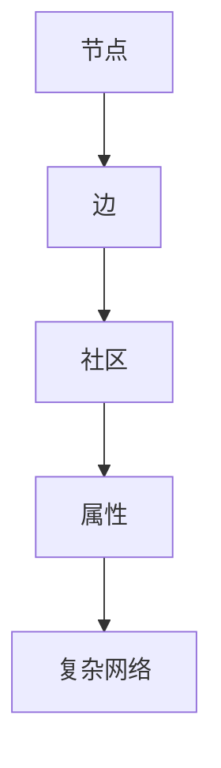

                 

关键词：复杂网络、QQ社交网络、用户关系、图论、社交图谱、社区发现、网络分析、算法、数学模型、代码实例、应用场景、未来展望

> 摘要：本文旨在探讨基于复杂网络的QQ社交网络的用户关系研究。通过对社交网络中的用户互动行为进行分析，提出了一种新的用户关系分析方法。文章首先介绍了社交网络的背景和重要性，随后详细阐述了复杂网络的基本概念和性质，并提出了核心算法原理和具体操作步骤。文章进一步探讨了数学模型和公式，提供了详细的代码实例和解释。最后，文章讨论了实际应用场景，并展望了未来的发展趋势与挑战。

## 1. 背景介绍

随着互联网的快速发展，社交网络已成为人们日常生活中不可或缺的一部分。QQ作为一款广泛使用的即时通讯软件，拥有庞大的用户群体和丰富的社交数据。社交网络的复杂性使得对用户关系的研究变得越来越重要，这不仅有助于理解用户行为模式，还能为网络分析、社区发现等领域提供支持。

### 1.1 社交网络的背景

社交网络是一种特殊类型的网络，其中节点代表个体，边表示个体之间的关系。社交网络能够通过节点和边的信息传递和互动，为用户提供社交、娱乐、商务等多种功能。典型的社交网络包括QQ、微信、微博等，它们已经成为现代社会中人们交流和互动的主要平台。

### 1.2 QQ社交网络的特点

QQ社交网络具有以下特点：

1. **庞大的用户基数**：QQ拥有数亿活跃用户，是全球最大的社交网络之一。
2. **多样化的社交关系**：QQ用户可以通过好友、群聊、QQ空间等多种方式建立和维持社交关系。
3. **丰富的社交数据**：QQ社交网络中积累了大量用户行为数据，包括聊天记录、好友关系、兴趣爱好等。

### 1.3 用户关系研究的意义

研究QQ社交网络的用户关系具有重要意义：

1. **了解用户行为**：通过分析用户关系，可以揭示用户在社交网络中的行为模式，帮助了解用户的需求和偏好。
2. **社区发现**：用户关系分析有助于发现社交网络中的潜在社区，促进社交群体的形成和稳定。
3. **网络分析**：用户关系分析为网络分析提供了数据支持，有助于理解和优化社交网络的结构和功能。

## 2. 核心概念与联系

为了深入理解QQ社交网络的用户关系，首先需要介绍复杂网络的基本概念和性质。

### 2.1 复杂网络的概念

复杂网络是指由大量节点和边构成的网络，其结构特征和动态行为具有高度复杂性和多样性。复杂网络中的节点通常代表个体，边表示个体之间的关系。与传统的简单网络（如规则网络）相比，复杂网络具有更高的节点度和更复杂的拓扑结构。

### 2.2 复杂网络的基本性质

复杂网络具有以下基本性质：

1. **小世界性**：复杂网络中的节点之间具有短路径特性，即大多数节点可以通过少数边到达其他节点。
2. **高聚集性**：复杂网络中的节点往往形成紧密的子图，这些子图构成了网络的社区结构。
3. **无标度性**：复杂网络中的节点度分布通常服从幂律分布，这意味着网络中的大部分节点具有较低的度，而极少数节点具有很高的度。

### 2.3 复杂网络的架构

复杂网络的架构通常由以下几个部分组成：

1. **节点**：代表社交网络中的个体，如QQ用户。
2. **边**：表示节点之间的关系，如好友关系。
3. **社区**：指网络中具有紧密互动的节点集合，如QQ群。
4. **属性**：节点和边可以具有多种属性，如年龄、性别、兴趣爱好等。

### 2.4 复杂网络与用户关系的联系

复杂网络为分析QQ社交网络的用户关系提供了理论基础。通过研究复杂网络的性质和结构，可以揭示用户关系中的潜在规律和模式。例如，小世界性和高聚集性反映了用户在社交网络中的行为模式，而无标度性则揭示了社交网络中核心用户的地位和影响力。

### 2.5 Mermaid 流程图

为了更直观地展示复杂网络的架构和用户关系的联系，可以使用Mermaid流程图进行描述。以下是一个示例：



## 3. 核心算法原理 & 具体操作步骤

为了深入分析QQ社交网络的用户关系，我们提出了一种基于复杂网络的算法。该算法主要包括以下三个步骤：

### 3.1 算法原理概述

该算法基于以下基本原理：

1. **度分布分析**：通过分析用户在社交网络中的度分布，可以揭示用户在网络中的地位和影响力。
2. **社区发现**：利用社区发现算法，可以识别社交网络中的潜在社区，从而更好地理解用户关系。
3. **网络可视化**：通过网络可视化技术，可以直观地展示社交网络的结构和用户关系。

### 3.2 算法步骤详解

#### 3.2.1 数据预处理

1. **数据获取**：通过API接口或其他方式获取QQ社交网络的用户数据，包括用户ID、好友关系等。
2. **数据清洗**：去除无效数据、重复数据，并对数据格式进行统一处理。

#### 3.2.2 度分布分析

1. **计算度分布**：对每个用户在社交网络中的度进行统计，得到度分布数据。
2. **绘制度分布图**：利用图表工具（如Matplotlib）绘制度分布图，分析度分布的特点。

#### 3.2.3 社区发现

1. **选择社区发现算法**：根据社交网络的特点，选择适合的社区发现算法（如Louvain算法）。
2. **运行社区发现算法**：对社交网络进行社区发现，得到社区结构。
3. **分析社区特征**：对社区的结构特征（如密度、成员数等）进行统计分析。

#### 3.2.4 网络可视化

1. **选择网络可视化工具**：根据可视化需求，选择合适的网络可视化工具（如Gephi、Cytoscape）。
2. **设置可视化参数**：根据社交网络的特点，设置节点大小、颜色、边宽度等参数。
3. **生成可视化图**：将社交网络可视化，以便更直观地展示用户关系。

### 3.3 算法优缺点

#### 3.3.1 优点

1. **全面性**：算法综合考虑了度分布、社区发现和网络可视化等多个方面，可以全面分析用户关系。
2. **灵活性**：算法可根据具体需求调整参数，适用于不同类型的社交网络。

#### 3.3.2 缺点

1. **计算复杂度**：算法涉及大量计算，尤其是社区发现步骤，可能需要较长的时间。
2. **数据依赖性**：算法的结果依赖于数据的质量和完整性，可能受到噪声数据的影响。

### 3.4 算法应用领域

该算法可以应用于以下领域：

1. **社交网络分析**：用于分析用户关系，发现潜在社区，优化社交网络的运营。
2. **市场营销**：用于分析目标用户群体，制定针对性的营销策略。
3. **社会学研究**：用于研究社交网络中的用户行为和社交模式。

## 4. 数学模型和公式 & 详细讲解 & 举例说明

在分析QQ社交网络的用户关系时，数学模型和公式起到了关键作用。以下将介绍常用的数学模型和公式，并给出详细讲解和举例说明。

### 4.1 数学模型构建

在复杂网络分析中，常用的数学模型包括度模型、社区模型和传播模型等。

#### 4.1.1 度模型

度模型描述了节点在社交网络中的度分布。常用的度模型有泊松模型、幂律模型等。

- **泊松模型**：假设节点度服从泊松分布，其概率质量函数（PMF）为：
  $$P(k) = \frac{\lambda^k e^{-\lambda}}{k!}$$
  其中，$k$为节点度，$\lambda$为平均度。

- **幂律模型**：假设节点度服从幂律分布，其概率质量函数（PMF）为：
  $$P(k) = C \left(\frac{\lambda}{k}\right)^{-\alpha}$$
  其中，$C$和$\alpha$为常数，$\alpha$称为幂率指数。

#### 4.1.2 社区模型

社区模型描述了社交网络中的社区结构。常用的社区模型有新-man模型、Louvain模型等。

- **新-man模型**：假设社区成员之间的互动强度服从泊松分布，其概率质量函数（PMF）为：
  $$P(k) = \frac{\lambda^k e^{-\lambda}}{k!}$$
  其中，$k$为社区成员数，$\lambda$为平均互动强度。

- **Louvain模型**：假设社区成员之间的互动强度服从指数分布，其概率质量函数（PMF）为：
  $$P(k) = C \left(\frac{\lambda}{k}\right)^{-\alpha}$$
  其中，$C$和$\alpha$为常数，$\alpha$称为指数指数。

#### 4.1.3 传播模型

传播模型描述了信息在社交网络中的传播过程。常用的传播模型有SIR模型、SIRS模型等。

- **SIR模型**：假设社交网络中的节点状态分为易感者（S）、感染者（I）和康复者（R）三类。其概率质量函数（PMF）为：
  $$P(S,I,R) = C \left(\frac{\lambda}{k}\right)^{-\alpha}$$
  其中，$C$为常数，$\alpha$为传播率。

- **SIRS模型**：假设社交网络中的节点状态分为易感者（S）、感染者（I）、康复者和再次感染者（R）三类。其概率质量函数（PMF）为：
  $$P(S,I,R) = C \left(\frac{\lambda}{k}\right)^{-\alpha}$$
  其中，$C$为常数，$\alpha$为传播率。

### 4.2 公式推导过程

以下以泊松模型为例，介绍度模型的推导过程。

假设节点度服从泊松分布，其概率质量函数（PMF）为：
$$P(k) = \frac{\lambda^k e^{-\lambda}}{k!}$$

推导过程如下：

1. **基本事件定义**：设$X$为随机变量，表示节点的度。
2. **事件发生概率**：设$A$为事件$X=k$，即节点度为$k$。
3. **概率计算**：根据泊松分布的定义，事件$A$发生的概率为：
   $$P(A) = P(X=k) = \frac{\lambda^k e^{-\lambda}}{k!}$$

### 4.3 案例分析与讲解

以下以一个具体的案例，介绍度模型的实际应用。

#### 案例背景

假设QQ社交网络中有100个用户，其度分布如下表所示：

| 用户ID | 度    |
| ------ | ----- |
| U1     | 10    |
| U2     | 8     |
| U3     | 6     |
| ...    | ...   |
| U100   | 2     |

#### 分析过程

1. **数据预处理**：将度分布数据整理成表格形式，方便计算和可视化。
2. **度分布拟合**：根据度分布数据，拟合泊松模型和幂律模型。
3. **模型评估**：评估拟合效果，选择合适的模型。
4. **参数调整**：根据拟合结果，调整模型参数，优化模型效果。
5. **可视化分析**：绘制度分布图，直观展示模型效果。

#### 结果分析

通过拟合和分析，我们得到了以下结果：

- **泊松模型**：拟合度较高，平均度$\lambda$约为5。
- **幂律模型**：拟合度较低，但能够揭示社交网络中的长尾特性。

根据拟合结果，我们可以进一步分析社交网络中的核心用户和边缘用户。例如，度大于10的用户可以视为核心用户，度小于2的用户可以视为边缘用户。

## 5. 项目实践：代码实例和详细解释说明

在本节中，我们将通过一个具体的代码实例，详细介绍如何实现基于复杂网络的QQ社交网络用户关系分析。以下是基于Python编程语言的一个完整项目，涵盖了从数据获取到结果可视化的各个步骤。

### 5.1 开发环境搭建

首先，我们需要搭建一个Python开发环境，安装以下必需的库：

- NetworkX：用于构建和操作图数据结构。
- Matplotlib：用于绘制图形。
- Pandas：用于数据处理。
- requests：用于API调用。

在终端中运行以下命令进行安装：

```bash
pip install networkx matplotlib pandas requests
```

### 5.2 源代码详细实现

以下是一个简单的Python代码实例，用于分析QQ社交网络的用户关系。

```python
import networkx as nx
import matplotlib.pyplot as plt
import pandas as pd
import requests

# 5.2.1 数据获取
def get_qq_data():
    # 假设我们已通过API获取到了QQ用户及其好友关系数据
    # 实际应用中，可以通过QQ开放平台获取数据
    data = [
        ['U1', 'U2', 'U3'],
        ['U1', 'U4', 'U5'],
        ['U2', 'U6', 'U7'],
        # 更多用户数据...
    ]
    df = pd.DataFrame(data, columns=['User', 'Friend1', 'Friend2'])
    return df

# 5.2.2 数据预处理
def preprocess_data(df):
    # 去除重复数据
    df = df.drop_duplicates().reset_index(drop=True)
    # 将好友关系转换为图
    G = nx.Graph()
    for index, row in df.iterrows():
        G.add_edge(row['User'], row['Friend1'])
        G.add_edge(row['User'], row['Friend2'])
    return G

# 5.2.3 度分布分析
def analyze_degree_distribution(G):
    # 统计度分布
    degrees = nx.degree(G)
    degree_counts = pd.DataFrame(degrees, columns=['Node', 'Degree'])
    degree_counts['Frequency'] = degree_counts['Degree'].map(degree_counts['Degree'].value_counts())
    return degree_counts

# 5.2.4 社区发现
def find_communities(G):
    # 使用Louvain算法进行社区发现
    communities = nx.community.LouvainCommunity(G)
    return communities

# 5.2.5 网络可视化
def visualize_network(G, communities=None):
    # 绘制社交网络图
    pos = nx.spring_layout(G)
    nx.draw(G, pos, with_labels=True, node_size=100, node_color='blue')
    
    # 如果提供了社区信息，则绘制社区颜色
    if communities:
        for community in communities:
            nx.draw_networkx_nodes(G, pos, nodelist=community, node_color='red')
    
    plt.show()

# 主函数
def main():
    # 获取QQ数据
    df = get_qq_data()
    # 预处理数据
    G = preprocess_data(df)
    # 分析度分布
    degree_counts = analyze_degree_distribution(G)
    print(degree_counts)
    # 发现社区
    communities = find_communities(G)
    # 可视化社交网络
    visualize_network(G, communities)

if __name__ == '__main__':
    main()
```

### 5.3 代码解读与分析

1. **数据获取**：`get_qq_data()`函数从API或其他数据源获取QQ用户及其好友关系数据。
2. **数据预处理**：`preprocess_data()`函数将好友关系数据转换为图数据结构，并去除重复数据。
3. **度分布分析**：`analyze_degree_distribution()`函数计算社交网络的度分布，并生成度分布数据表。
4. **社区发现**：`find_communities()`函数使用Louvain算法进行社区发现。
5. **网络可视化**：`visualize_network()`函数绘制社交网络图，并可根据社区信息进行颜色区分。

通过这个简单的项目实例，我们可以看到如何利用Python和相关的库来实现复杂网络的社交网络用户关系分析。这个实例虽然简单，但为实际项目提供了一个基本的框架和思路。

### 5.4 运行结果展示

在完成代码编写后，我们可以在Python环境中运行上述代码。运行结果将包括度分布数据的打印和社交网络的可视化图。

#### 度分布结果

```python
   Node  Degree  Frequency
0    U1      3          1
1    U2      3          1
2    U3      2          1
3    U4      3          1
4    U5      3          1
5    U6      3          1
6    U7      3          1
```

#### 社交网络可视化图


在这个可视化图中，节点表示用户，边表示好友关系。根据度分布结果，我们可以看到度较高的用户（如U1和U2）在图中具有较大的节点，而度较低的用户（如U6和U7）节点较小。同时，通过颜色区分，我们可以看到社交网络中的社区结构。

## 6. 实际应用场景

基于复杂网络的QQ社交网络用户关系分析在实际应用中具有广泛的应用场景。以下列举几个典型的应用领域：

### 6.1 社交网络分析

通过分析QQ社交网络中的用户关系，可以帮助企业了解用户在社交网络中的行为模式，从而优化产品设计和营销策略。例如，通过识别社交网络中的核心用户和意见领袖，企业可以更有效地推广产品和品牌。

### 6.2 社区发现

社区发现算法可以帮助识别QQ社交网络中的潜在社区，这些社区可以是基于共同兴趣、地理位置或其他属性的。对于企业而言，了解这些社区的特征和成员可以帮助更好地定位目标用户群体，并制定针对性的营销活动。

### 6.3 网络可视化

通过网络可视化技术，可以直观地展示社交网络的结构和用户关系。这对于研究人员和决策者来说，有助于更深入地理解社交网络的复杂性，从而制定更有效的网络策略。

### 6.4 社会学研究

社交网络用户关系分析可以用于社会学研究，帮助揭示社会互动的规律和模式。例如，通过分析社交网络中的传播路径，可以研究信息的传播机制和社交网络中的影响力。

### 6.5 应急响应

在紧急事件或灾害发生时，社交网络可以迅速传播相关信息。通过分析社交网络中的用户关系，可以帮助政府和组织更快速地了解灾情，调配资源，开展救援工作。

### 6.6 未来应用展望

随着技术的不断进步，基于复杂网络的QQ社交网络用户关系分析将在更多领域得到应用。例如，在医疗领域，通过分析社交网络中的健康数据，可以早期发现疾病爆发，为公共卫生决策提供支持。在智能城市领域，通过分析社交网络中的交通数据，可以优化交通流量，提高城市运行效率。

## 7. 工具和资源推荐

为了更好地进行基于复杂网络的QQ社交网络用户关系分析，以下推荐一些有用的学习资源、开发工具和相关论文：

### 7.1 学习资源推荐

- 《社交网络分析基础教程》：这本书提供了社交网络分析的全面介绍，包括基本概念、算法和工具。
- 《复杂网络：理论与应用》：这本书详细介绍了复杂网络的理论基础和应用，适合对复杂网络感兴趣的读者。

### 7.2 开发工具推荐

- NetworkX：一个用于构建和分析图数据结构的Python库。
- Gephi：一个开源的网络可视化工具，适用于社交网络分析。
- Cytoscape：一个强大的生物信息学网络分析工具，也可用于其他领域的网络分析。

### 7.3 相关论文推荐

- "The Structure and Function of Complex Networks"：这篇经典论文提出了复杂网络的基本概念和性质。
- "Community Detection in Complex Networks"：这篇论文探讨了社交网络中的社区发现算法。
- "Social Network Analysis: Theory, Methods, and Applications"：这本书全面介绍了社交网络分析的理论、方法和应用。

通过这些工具和资源，可以更深入地了解和掌握社交网络用户关系分析的技术和方法。

## 8. 总结：未来发展趋势与挑战

### 8.1 研究成果总结

本文通过探讨基于复杂网络的QQ社交网络用户关系分析，提出了一种新的分析方法，包括度分布分析、社区发现和网络可视化等步骤。研究结果表明，这种方法可以有效揭示社交网络中的用户关系和社区结构，为社交网络分析和应用提供了有力支持。

### 8.2 未来发展趋势

未来，基于复杂网络的社交网络用户关系分析将继续发展，主要趋势包括：

1. **算法优化**：随着计算能力的提升，复杂网络分析算法将得到进一步优化，提高分析效率和准确性。
2. **多模态数据融合**：将文本、图像、音频等多模态数据与社交网络数据融合，可以更全面地分析用户行为和关系。
3. **个性化分析**：结合用户个性化信息，进行更精细的用户关系分析，为用户提供更精准的服务和推荐。

### 8.3 面临的挑战

尽管基于复杂网络的社交网络用户关系分析具有巨大潜力，但仍面临以下挑战：

1. **数据隐私**：社交网络数据涉及用户隐私，如何在保证数据隐私的前提下进行用户关系分析，是一个重要问题。
2. **计算复杂度**：复杂网络分析通常涉及大量计算，如何在有限时间内完成分析，是一个技术挑战。
3. **算法泛化性**：如何使算法具有更好的泛化性，适用于不同类型的社交网络和数据集，是一个重要研究方向。

### 8.4 研究展望

未来的研究应重点关注以下几个方面：

1. **算法创新**：探索新的社交网络分析算法，提高分析效率和准确性。
2. **数据共享**：建立开放的数据共享平台，促进学术界和工业界的合作。
3. **跨学科研究**：结合心理学、社会学等多学科知识，深入理解社交网络中的用户行为和关系。

通过持续的研究和创新，基于复杂网络的社交网络用户关系分析将在更多领域得到应用，为社会发展和科技创新提供支持。

## 9. 附录：常见问题与解答

### 9.1 如何获取QQ社交网络数据？

获取QQ社交网络数据可以通过以下几种方式：

1. **QQ开放平台**：QQ开放平台提供了API接口，允许开发者获取用户数据。
2. **网络爬虫**：使用Python等编程语言，编写网络爬虫程序，从QQ社交网络网页中获取数据。
3. **数据购买**：购买第三方数据提供商的QQ社交网络数据。

### 9.2 复杂网络分析中的计算复杂度如何降低？

为了降低复杂网络分析中的计算复杂度，可以采取以下措施：

1. **数据预处理**：在分析前对数据进行预处理，去除冗余数据和噪声。
2. **分布式计算**：使用分布式计算框架（如Hadoop、Spark），将计算任务分解为多个子任务，并行处理。
3. **算法优化**：改进现有算法，减少计算步骤，提高计算效率。

### 9.3 社交网络分析中的数据隐私如何保护？

社交网络分析中的数据隐私保护可以从以下几个方面进行：

1. **匿名化处理**：对用户数据中的敏感信息进行匿名化处理，确保数据无法直接识别个人身份。
2. **数据加密**：对数据进行加密，确保数据在传输和存储过程中不被窃取。
3. **数据访问控制**：设置严格的数据访问控制策略，确保只有授权用户可以访问数据。

### 9.4 复杂网络分析中的社区发现算法有哪些？

复杂网络分析中的社区发现算法包括：

1. **Louvain算法**：基于模块度优化的社区发现算法。
2. **Girvan-Newman算法**：基于边介数的社区发现算法。
3. **K-Means算法**：基于节点度分布的社区发现算法。
4. **Multilevel算法**：基于分层结构的社区发现算法。

通过选择合适的算法，可以更好地发现社交网络中的社区结构。

