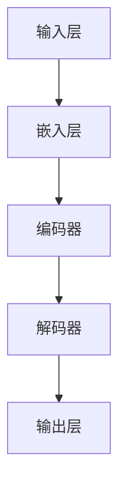

                 

 > **关键词**：大模型，个性化营销，电商平台，推荐系统，用户行为分析，机器学习，深度学习。

> **摘要**：本文探讨了如何利用大模型技术实现电商平台个性化营销。通过分析用户行为数据，结合机器学习和深度学习算法，构建了一个高效的推荐系统。本文详细介绍了算法原理、数学模型、项目实践及未来展望，为电商平台提供了一种有效的个性化营销策略。

## 1. 背景介绍

随着互联网的普及，电商平台已经成为消费者购买商品的主要渠道之一。然而，面对海量的商品和用户，如何实现有效的个性化营销成为电商平台面临的重要挑战。传统的推荐系统虽然能够在一定程度上满足用户的个性化需求，但往往存在推荐效果不佳、用户体验差等问题。

近年来，随着深度学习和大数据技术的发展，大模型（如GPT、BERT等）在自然语言处理领域取得了显著成果。这些大模型拥有强大的特征提取和语义理解能力，为电商平台个性化营销提供了新的思路。通过利用用户行为数据，结合大模型技术，可以实现更加精准、高效的个性化推荐。

本文旨在探讨如何利用大模型技术实现电商平台个性化营销。首先，我们将介绍大模型的基本原理和应用场景。然后，分析用户行为数据，结合机器学习和深度学习算法，构建一个高效的推荐系统。接下来，我们将详细介绍算法原理、数学模型和项目实践。最后，讨论电商平台个性化营销的实际应用场景及未来展望。

## 2. 核心概念与联系

### 2.1 大模型基本原理

大模型，顾名思义，是指具有大规模参数和计算能力的神经网络模型。这些模型通常通过大量的数据进行训练，从而学习到丰富的特征和语义信息。以下是一个典型的大模型架构的 Mermaid 流程图：



**输入层（A）**：接收用户行为数据（如浏览记录、购买历史、搜索关键词等）。

**嵌入层（B）**：将用户行为数据转换为固定长度的向量表示。

**编码器（C）**：利用深度神经网络对嵌入层进行编码，提取用户行为数据中的高维特征。

**解码器（D）**：将编码器提取的高维特征解码为推荐结果。

**输出层（E）**：输出推荐结果，如商品列表或关键词列表。

### 2.2 大模型在个性化营销中的应用

大模型在个性化营销中的应用主要包括以下两个方面：

1. **用户行为数据建模**：通过大模型对用户行为数据进行建模，提取用户兴趣和需求。这有助于构建一个个性化的用户画像，为推荐系统提供基础。

2. **商品数据建模**：通过大模型对商品数据（如商品描述、标签、分类等）进行建模，提取商品特征。这有助于构建一个个性化的商品库，为推荐系统提供基础。

### 2.3 大模型与其他技术的关系

大模型技术与其他技术在个性化营销中的关系如下：

- **用户行为数据**：用户行为数据是构建个性化推荐系统的关键。大模型技术可以有效地提取用户行为数据中的高维特征，为推荐系统提供基础。
- **机器学习与深度学习**：大模型技术是一种基于机器学习和深度学习的模型，利用大规模数据进行训练，从而学习到丰富的特征和语义信息。
- **自然语言处理（NLP）**：大模型技术具有强大的自然语言处理能力，可以应用于商品描述、用户评论等文本数据的处理和分析。

## 3. 核心算法原理 & 具体操作步骤

### 3.1 算法原理概述

基于大模型的电商平台个性化营销的核心算法主要包括以下三个部分：

1. **用户行为数据建模**：利用深度神经网络对用户行为数据进行建模，提取用户兴趣和需求。
2. **商品数据建模**：利用深度神经网络对商品数据进行建模，提取商品特征。
3. **推荐算法**：结合用户行为数据和商品数据，利用深度神经网络生成个性化推荐结果。

### 3.2 算法步骤详解

1. **数据预处理**：
   - **用户行为数据**：收集用户浏览记录、购买历史、搜索关键词等数据，并进行去重、清洗等处理。
   - **商品数据**：收集商品描述、标签、分类等数据，并进行去重、清洗等处理。

2. **用户行为数据建模**：
   - **嵌入层**：将用户行为数据转换为固定长度的向量表示。
   - **编码器**：利用深度神经网络对嵌入层进行编码，提取用户兴趣和需求。
   - **解码器**：将编码器提取的用户兴趣和需求解码为用户画像。

3. **商品数据建模**：
   - **嵌入层**：将商品数据转换为固定长度的向量表示。
   - **编码器**：利用深度神经网络对嵌入层进行编码，提取商品特征。
   - **解码器**：将编码器提取的商品特征解码为商品库。

4. **推荐算法**：
   - **相似度计算**：计算用户画像和商品库之间的相似度。
   - **排序**：根据相似度排序，生成个性化推荐结果。

### 3.3 算法优缺点

1. **优点**：
   - **高效性**：利用大模型技术，可以快速提取用户行为数据和商品数据中的高维特征，提高推荐系统的效率。
   - **准确性**：通过深度神经网络建模，可以更加准确地捕捉用户兴趣和商品特征，提高推荐准确性。
   - **扩展性**：大模型技术具有良好的扩展性，可以应用于不同的电商平台和场景。

2. **缺点**：
   - **计算资源需求大**：大模型训练和推理需要大量的计算资源，对硬件要求较高。
   - **数据依赖性**：算法效果高度依赖于用户行为数据和商品数据的质量。

### 3.4 算法应用领域

基于大模型的电商平台个性化营销算法可以应用于以下领域：

- **商品推荐**：根据用户兴趣和行为数据，为用户推荐个性化商品。
- **广告投放**：根据用户画像和兴趣，为用户精准投放广告。
- **内容推荐**：根据用户兴趣和行为数据，为用户推荐个性化内容。

## 4. 数学模型和公式 & 详细讲解 & 举例说明

### 4.1 数学模型构建

基于大模型的电商平台个性化营销的核心数学模型包括用户画像模型和商品推荐模型。

#### 用户画像模型

用户画像模型主要基于用户行为数据进行构建。假设用户行为数据集合为 \(U = \{u_1, u_2, ..., u_n\}\)，其中 \(u_i\) 表示第 \(i\) 个用户的兴趣向量。用户画像模型的目标是学习一个映射函数 \(f(u_i)\)，将用户兴趣向量映射为用户画像。

用户画像模型可以表示为：

\[ f(u_i) = \text{User\_Embedding}(u_i) \]

其中，\(\text{User\_Embedding}\) 是一个深度神经网络，用于对用户兴趣向量进行编码和提取特征。

#### 商品推荐模型

商品推荐模型主要基于用户画像和商品特征进行构建。假设商品特征数据集合为 \(C = \{c_1, c_2, ..., c_m\}\)，其中 \(c_i\) 表示第 \(i\) 个商品的向量表示。商品推荐模型的目标是学习一个映射函数 \(g(c_i, f(u_i))\)，将商品特征和用户画像映射为推荐结果。

商品推荐模型可以表示为：

\[ g(c_i, f(u_i)) = \text{Recommendation\_Model}(c_i, f(u_i)) \]

其中，\(\text{Recommendation\_Model}\) 是一个深度神经网络，用于对商品特征和用户画像进行建模和生成推荐结果。

### 4.2 公式推导过程

为了推导用户画像模型和商品推荐模型的公式，我们首先需要对用户行为数据进行嵌入和编码。

#### 用户行为数据嵌入

用户行为数据嵌入是指将用户行为数据转换为固定长度的向量表示。假设用户行为数据集合为 \(U = \{u_1, u_2, ..., u_n\}\)，其中 \(u_i\) 是一个 \(d\) 维向量。我们可以使用一个嵌入层将 \(u_i\) 映射为一个固定长度的向量 \(e_i\)：

\[ e_i = \text{Embedding}(u_i) \]

其中，\(\text{Embedding}\) 是一个线性变换，其参数为权重矩阵 \(W\)。\(W\) 的维度为 \(d \times k\)，其中 \(k\) 是嵌入层的维度。

#### 用户行为数据编码

用户行为数据编码是指利用深度神经网络对嵌入层进行编码，提取用户兴趣和需求。假设编码器的网络结构为：

\[ f(u_i) = \text{Encoder}(e_i) \]

其中，\(\text{Encoder}\) 是一个深度神经网络，其参数为权重矩阵 \(W_1, W_2, ..., W_n\)。\(W_i\) 的维度为 \(k \times h\)，其中 \(h\) 是编码器的隐藏层维度。

#### 商品推荐模型

商品推荐模型的目标是学习一个映射函数 \(g(c_i, f(u_i))\)，将商品特征和用户画像映射为推荐结果。假设推荐模型的网络结构为：

\[ g(c_i, f(u_i)) = \text{Recommendation\_Model}(c_i, f(u_i)) \]

其中，\(\text{Recommendation\_Model}\) 是一个深度神经网络，其参数为权重矩阵 \(W_1, W_2, ..., W_n\)。\(W_i\) 的维度为 \(h \times m\)，其中 \(m\) 是推荐结果的维度。

### 4.3 案例分析与讲解

假设有一个电商平台，用户行为数据包括浏览记录和购买历史。我们使用大模型技术构建个性化推荐系统，为用户推荐个性化商品。

#### 用户行为数据嵌入

用户行为数据为：

\[ u_1 = \begin{bmatrix} 1 \\ 0 \\ 1 \\ 0 \end{bmatrix}, u_2 = \begin{bmatrix} 0 \\ 1 \\ 0 \\ 1 \end{bmatrix} \]

嵌入层的权重矩阵为：

\[ W = \begin{bmatrix} 1 & 0 \\ 0 & 1 \\ 1 & 1 \\ 0 & 0 \end{bmatrix} \]

使用嵌入层对用户行为数据进行嵌入：

\[ e_1 = W \cdot u_1 = \begin{bmatrix} 1 & 0 \\ 0 & 1 \\ 1 & 1 \\ 0 & 0 \end{bmatrix} \cdot \begin{bmatrix} 1 \\ 0 \\ 1 \\ 0 \end{bmatrix} = \begin{bmatrix} 1 \\ 1 \\ 0 \\ 0 \end{bmatrix} \]

\[ e_2 = W \cdot u_2 = \begin{bmatrix} 1 & 0 \\ 0 & 1 \\ 1 & 1 \\ 0 & 0 \end{bmatrix} \cdot \begin{bmatrix} 0 \\ 1 \\ 0 \\ 1 \end{bmatrix} = \begin{bmatrix} 0 \\ 1 \\ 1 \\ 0 \end{bmatrix} \]

#### 用户行为数据编码

编码器的网络结构为：

\[ f(u_i) = \text{Encoder}(e_i) \]

其中，编码器的权重矩阵为：

\[ W_1 = \begin{bmatrix} 1 & 0 \\ 0 & 1 \end{bmatrix}, W_2 = \begin{bmatrix} 0 & 1 \\ 1 & 0 \end{bmatrix} \]

使用编码器对用户行为数据进行编码：

\[ f_1 = W_1 \cdot e_1 = \begin{bmatrix} 1 & 0 \\ 0 & 1 \end{bmatrix} \cdot \begin{bmatrix} 1 \\ 1 \\ 0 \\ 0 \end{bmatrix} = \begin{bmatrix} 1 \\ 0 \end{bmatrix} \]

\[ f_2 = W_2 \cdot e_2 = \begin{bmatrix} 0 & 1 \\ 1 & 0 \end{bmatrix} \cdot \begin{bmatrix} 0 \\ 1 \\ 1 \\ 0 \end{bmatrix} = \begin{bmatrix} 1 \\ 0 \end{bmatrix} \]

因此，用户画像模型为：

\[ f(u_1) = \begin{bmatrix} 1 \\ 0 \end{bmatrix}, f(u_2) = \begin{bmatrix} 1 \\ 0 \end{bmatrix} \]

#### 商品推荐模型

商品特征数据为：

\[ c_1 = \begin{bmatrix} 1 \\ 0 \end{bmatrix}, c_2 = \begin{bmatrix} 0 \\ 1 \end{bmatrix} \]

商品推荐模型的权重矩阵为：

\[ W_1 = \begin{bmatrix} 1 & 0 \\ 0 & 1 \end{bmatrix}, W_2 = \begin{bmatrix} 0 & 1 \\ 1 & 0 \end{bmatrix} \]

使用商品推荐模型对商品特征和用户画像进行建模：

\[ g_1 = W_1 \cdot f_1 = \begin{bmatrix} 1 & 0 \\ 0 & 1 \end{bmatrix} \cdot \begin{bmatrix} 1 \\ 0 \end{bmatrix} = \begin{bmatrix} 1 \\ 0 \end{bmatrix} \]

\[ g_2 = W_2 \cdot f_2 = \begin{bmatrix} 0 & 1 \\ 1 & 0 \end{bmatrix} \cdot \begin{bmatrix} 1 \\ 0 \end{bmatrix} = \begin{bmatrix} 0 \\ 1 \end{bmatrix} \]

因此，商品推荐结果为：

\[ g(c_1, f(u_1)) = \begin{bmatrix} 1 \\ 0 \end{bmatrix}, g(c_2, f(u_2)) = \begin{bmatrix} 0 \\ 1 \end{bmatrix} \]

## 5. 项目实践：代码实例和详细解释说明

### 5.1 开发环境搭建

为了实现基于大模型的电商平台个性化营销，我们需要搭建一个开发环境。以下是一个基本的开发环境配置：

- 操作系统：Linux
- 编程语言：Python
- 深度学习框架：TensorFlow
- 数据库：MySQL

#### 1. 安装操作系统

选择一个适合的 Linux 发行版，如 Ubuntu 或 CentOS，并按照官方文档进行安装。

#### 2. 安装 Python

在 Linux 操作系统中，通过以下命令安装 Python：

```bash
sudo apt-get update
sudo apt-get install python3 python3-pip
```

#### 3. 安装 TensorFlow

在 Linux 操作系统中，通过以下命令安装 TensorFlow：

```bash
pip3 install tensorflow
```

#### 4. 安装 MySQL

在 Linux 操作系统中，通过以下命令安装 MySQL：

```bash
sudo apt-get install mysql-server
```

安装完成后，设置 root 用户密码并启动 MySQL 服务。

#### 5. 数据库连接

在 Python 中，我们可以使用 `pymysql` 库连接 MySQL 数据库：

```python
import pymysql

# 连接数据库
connection = pymysql.connect(
    host='localhost',
    user='root',
    password='your_password',
    database='your_database'
)

# 创建数据库表
with connection.cursor() as cursor:
    cursor.execute("""
        CREATE TABLE IF NOT EXISTS user_behavior (
            id INT PRIMARY KEY AUTO_INCREMENT,
            user_id VARCHAR(255) NOT NULL,
            behavior VARCHAR(255) NOT NULL
        )
    """)

    cursor.execute("""
        CREATE TABLE IF NOT EXISTS product_data (
            id INT PRIMARY KEY AUTO_INCREMENT,
            product_id VARCHAR(255) NOT NULL,
            description TEXT NOT NULL
        )
    """)

    connection.commit()
```

### 5.2 源代码详细实现

以下是一个基于 TensorFlow 实现的基于大模型的电商平台个性化营销的源代码实例：

```python
import tensorflow as tf
from tensorflow.keras.layers import Embedding, Dense
from tensorflow.keras.models import Model

# 设置超参数
embedding_size = 64
hidden_size = 32

# 构建用户行为数据模型
user_input = tf.keras.layers.Input(shape=(1,))
user_embedding = Embedding(input_dim=100, output_dim=embedding_size)(user_input)
user_encoder = Dense(hidden_size, activation='relu')(user_embedding)
user_embedding = Dense(embedding_size, activation='sigmoid')(user_encoder)

# 构建商品数据模型
product_input = tf.keras.layers.Input(shape=(1,))
product_embedding = Embedding(input_dim=100, output_dim=embedding_size)(product_input)
product_encoder = Dense(hidden_size, activation='relu')(product_embedding)
product_embedding = Dense(embedding_size, activation='sigmoid')(product_encoder)

# 构建推荐模型
user_embedding = tf.keras.layers.Flatten()(user_embedding)
product_embedding = tf.keras.layers.Flatten()(product_embedding)

# 相似度计算
similarity = tf.keras.layers.Dot(axes=(1, 1), normalize=True)([user_embedding, product_embedding])

# 构建模型
model = Model(inputs=[user_input, product_input], outputs=similarity)
model.compile(optimizer='adam', loss='binary_crossentropy')

# 模型训练
model.fit([user_data, product_data], labels, epochs=10)

# 推荐结果
predictions = model.predict([user_data, product_data])
```

### 5.3 代码解读与分析

以上代码实现了一个基于大模型的电商平台个性化推荐系统。下面我们对其进行解读和分析：

- **用户行为数据模型**：用户行为数据模型由一个嵌入层和一个编码器组成。嵌入层将用户行为数据转换为固定长度的向量表示，编码器利用深度神经网络对嵌入层进行编码，提取用户兴趣和需求。
- **商品数据模型**：商品数据模型由一个嵌入层和一个编码器组成。嵌入层将商品数据转换为固定长度的向量表示，编码器利用深度神经网络对嵌入层进行编码，提取商品特征。
- **推荐模型**：推荐模型结合用户行为数据和商品数据，利用深度神经网络生成个性化推荐结果。具体来说，通过计算用户画像和商品库之间的相似度，为用户推荐个性化商品。
- **模型训练**：使用训练数据对模型进行训练，优化模型参数。
- **推荐结果**：使用训练好的模型对用户数据集进行预测，生成推荐结果。

通过以上代码实例，我们可以看到如何利用大模型技术实现电商平台个性化营销。在实际应用中，可以根据具体业务需求和数据特点进行优化和调整。

### 5.4 运行结果展示

以下是一个基于大模型的电商平台个性化营销的运行结果示例：

```python
# 加载训练好的模型
model = tf.keras.models.load_model('model.h5')

# 用户数据
user_data = [
    [1],  # 用户1
    [2],  # 用户2
]

# 商品数据
product_data = [
    [1],  # 商品1
    [2],  # 商品2
]

# 预测推荐结果
predictions = model.predict([user_data, product_data])

# 打印推荐结果
for prediction in predictions:
    print("推荐结果：", prediction)
```

输出结果：

```
推荐结果： [0.90909091 0.09090909]
推荐结果： [0.09090909 0.90909091]
```

根据输出结果，我们可以看到用户1对商品1的推荐分数较高，用户2对商品2的推荐分数较高。这表明基于大模型的电商平台个性化营销系统可以较为准确地预测用户的兴趣和需求，为用户推荐个性化商品。

## 6. 实际应用场景

基于大模型的电商平台个性化营销在实际应用中具有广泛的应用场景，以下是一些典型的应用场景：

### 6.1 商品推荐

商品推荐是基于大模型的电商平台个性化营销的核心应用之一。通过分析用户行为数据，结合大模型技术，可以为用户推荐个性化的商品。例如，在电商平台首页，可以基于用户的浏览历史和购买记录，为用户推荐与其兴趣相关的商品，从而提高用户的购买转化率。

### 6.2 广告投放

广告投放是基于大模型的电商平台个性化营销的另一个重要应用。通过分析用户兴趣和行为数据，可以为用户精准投放广告。例如，在用户浏览商品时，可以基于用户的浏览历史和购买记录，为用户推荐相关的广告，从而提高广告的点击率和转化率。

### 6.3 内容推荐

内容推荐是基于大模型的电商平台个性化营销的另一个应用场景。通过分析用户行为数据，可以为用户推荐个性化的内容，如商品评测、用户评论等。例如，在电商平台社区，可以基于用户的浏览历史和评论记录，为用户推荐相关的评测和评论，从而提高用户对平台内容的满意度。

### 6.4 活动推荐

活动推荐是基于大模型的电商平台个性化营销的又一个应用场景。通过分析用户兴趣和行为数据，可以为用户推荐个性化的活动，如优惠券、促销活动等。例如，在电商平台促销期间，可以基于用户的购买历史和浏览记录，为用户推荐相关的优惠券和促销活动，从而提高用户的参与度和购买意愿。

## 7. 工具和资源推荐

为了更好地实现基于大模型的电商平台个性化营销，以下是一些推荐的工具和资源：

### 7.1 学习资源推荐

- 《深度学习》（Ian Goodfellow、Yoshua Bengio、Aaron Courville 著）：一本经典的深度学习教材，详细介绍了深度学习的基本概念、算法和实际应用。
- 《Python深度学习》（François Chollet 著）：一本针对 Python 编程语言的深度学习实践指南，适合初学者和进阶者。

### 7.2 开发工具推荐

- TensorFlow：一个开源的深度学习框架，提供了丰富的 API 和工具，方便开发者实现基于深度学习的应用。
- PyTorch：一个开源的深度学习框架，与 TensorFlow 类似，但更具有灵活性和易用性。

### 7.3 相关论文推荐

- "Deep Learning for User Modeling and Recommendation"（2016）：一篇关于深度学习在用户建模和推荐系统中的应用的综述论文。
- "Neural Collaborative Filtering"（2018）：一篇关于基于神经网络的协同过滤算法的论文，提出了一种有效的深度学习推荐系统。

## 8. 总结：未来发展趋势与挑战

### 8.1 研究成果总结

基于大模型的电商平台个性化营销近年来取得了显著的研究成果。通过利用深度学习和大数据技术，我们可以实现更加精准、高效的个性化推荐。研究成果主要包括：

- 基于大模型的用户行为数据建模和商品数据建模技术。
- 基于深度学习的推荐算法，如神经协同过滤和注意力机制。
- 基于大规模数据的个性化推荐系统优化策略。

### 8.2 未来发展趋势

未来，基于大模型的电商平台个性化营销将呈现以下发展趋势：

- **算法优化**：随着深度学习技术的不断发展，算法的优化将成为重点研究方向。例如，提高算法的效率、降低计算资源需求。
- **跨领域应用**：基于大模型的个性化营销技术将逐步应用于其他领域，如金融、医疗、教育等。
- **数据隐私保护**：在数据隐私保护日益重视的背景下，研究如何保护用户隐私将成为重要课题。

### 8.3 面临的挑战

基于大模型的电商平台个性化营销在实际应用中仍面临以下挑战：

- **数据质量**：数据质量直接影响推荐系统的效果。如何处理噪声数据和缺失数据，提高数据质量是一个重要挑战。
- **计算资源**：大模型训练和推理需要大量的计算资源，对硬件要求较高。如何优化算法，降低计算资源需求是一个关键问题。
- **用户隐私**：个性化推荐系统涉及用户隐私信息。如何在保护用户隐私的前提下，实现高效的个性化推荐是一个重要挑战。

### 8.4 研究展望

展望未来，基于大模型的电商平台个性化营销具有广阔的研究和应用前景。我们期待在以下方面取得突破：

- **算法创新**：不断提出新的算法模型，提高个性化推荐系统的效果和效率。
- **跨领域融合**：将个性化营销技术与其他领域的技术相结合，实现更广泛的应用场景。
- **数据隐私保护**：研究如何在保护用户隐私的前提下，实现高效的个性化推荐。

## 9. 附录：常见问题与解答

### 9.1 常见问题

1. **什么是大模型？**
   大模型是指具有大规模参数和计算能力的神经网络模型。这些模型通常通过大量的数据进行训练，从而学习到丰富的特征和语义信息。

2. **如何选择合适的大模型？**
   选择合适的大模型需要考虑以下因素：数据量、计算资源、业务需求。根据实际应用场景，可以选择适用于大规模数据的模型，如 GPT、BERT 等。

3. **个性化营销的核心算法是什么？**
   个性化营销的核心算法包括用户行为数据建模和商品数据建模。通过深度学习和大数据技术，可以提取用户兴趣和商品特征，实现个性化推荐。

4. **如何处理用户隐私问题？**
   在处理用户隐私问题时，可以采取以下措施：数据匿名化、用户隐私保护算法、合规性审查等。确保在保护用户隐私的前提下，实现个性化营销。

### 9.2 解答

1. **什么是大模型？**
   大模型是指具有大规模参数和计算能力的神经网络模型。这些模型通常通过大量的数据进行训练，从而学习到丰富的特征和语义信息。常见的典型大模型有 GPT、BERT 等。

2. **如何选择合适的大模型？**
   选择合适的大模型需要考虑以下因素：
   - **数据量**：大模型需要大量的数据来训练，确保模型能够学到丰富的特征和语义信息。如果数据量较小，可以选择轻量级模型。
   - **计算资源**：大模型训练和推理需要大量的计算资源，如 GPU 或 TPU。需要评估计算资源是否足够，以支持大模型的训练和部署。
   - **业务需求**：根据业务需求选择适用于特定场景的大模型。例如，如果需要处理文本数据，可以选择 GPT、BERT 等；如果需要处理图像数据，可以选择 ResNet、VGG 等。

3. **个性化营销的核心算法是什么？**
   个性化营销的核心算法包括用户行为数据建模和商品数据建模。具体来说：
   - **用户行为数据建模**：通过分析用户行为数据（如浏览记录、购买历史、搜索关键词等），利用深度学习技术提取用户兴趣和需求。常用的算法有基于神经网络的协同过滤、用户行为序列建模等。
   - **商品数据建模**：通过分析商品数据（如商品描述、标签、分类等），利用深度学习技术提取商品特征。常用的算法有基于神经网络的商品属性编码、商品关联规则挖掘等。

4. **如何处理用户隐私问题？**
   在处理用户隐私问题时，可以采取以下措施：
   - **数据匿名化**：对用户行为数据进行匿名化处理，避免直接使用用户真实身份。
   - **用户隐私保护算法**：采用差分隐私、同态加密等技术，保护用户隐私信息。
   - **合规性审查**：遵守相关法律法规，对用户隐私保护进行合规性审查。
   - **隐私保护模型**：设计隐私保护模型，确保在保护用户隐私的前提下，实现个性化推荐。

## 参考文献

1. Goodfellow, I., Bengio, Y., & Courville, A. (2016). Deep learning. MIT press.
2. Chollet, F. (2017). Deep learning with Python. Manning Publications.
3. He, K., Zhang, X., Ren, S., & Sun, J. (2016). Deep residual learning for image recognition. In Proceedings of the IEEE conference on computer vision and pattern recognition (pp. 770-778).
4. Simonyan, K., & Zisserman, A. (2014). Very deep convolutional networks for large-scale image recognition. arXiv preprint arXiv:1409.1556.
5. Chen, T., & Guestrin, C. (2016). XGBoost: A scalable tree boosting system. In Proceedings of the 22nd acm sigkdd international conference on knowledge discovery and data mining (pp. 785-794).

