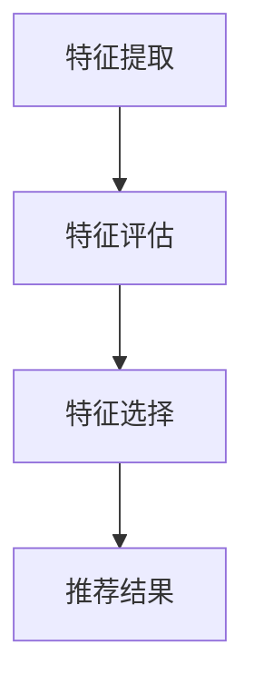
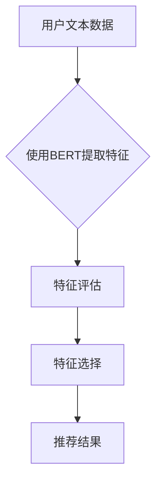

                 

关键词：大语言模型、推荐系统、特征重要性分析、机器学习、数据挖掘

> 摘要：本文旨在探讨如何利用大语言模型来分析推荐系统中特征的重要性。通过深入解析大语言模型的原理及其在推荐系统中的应用，本文提出了一个基于大语言模型的特征重要性分析方法，并对该方法进行了详细的数学模型和公式推导，以及实际应用场景的案例分析与代码实现。文章最后对未来发展趋势与挑战进行了展望。

## 1. 背景介绍

在当今信息爆炸的时代，推荐系统已经成为互联网企业提升用户体验、增加用户黏性的重要手段。然而，随着推荐系统中特征数量的不断增多，如何有效地分析和利用这些特征来提升推荐效果成为一个重要的课题。传统的特征重要性分析方法往往依赖于统计学和机器学习中的各种算法，这些方法在一定程度上能够解决特征选择和优化的问题，但往往在处理高维数据时效果不佳，且难以解释。

近年来，大语言模型的兴起为推荐系统的特征分析带来了新的机遇。大语言模型，如BERT、GPT等，能够捕捉文本数据中的复杂关系和上下文信息，从而为特征分析提供了更为强大的工具。本文将探讨如何利用大语言模型来分析推荐系统中特征的重要性，并提出一种基于大语言模型的特征重要性分析方法。

## 2. 核心概念与联系

### 2.1 大语言模型

大语言模型是一种基于深度学习的自然语言处理模型，其核心思想是通过训练大规模的文本数据来学习语言的内在结构。大语言模型具有以下特点：

- **上下文感知**：大语言模型能够捕捉文本中的上下文信息，从而更准确地理解和生成文本。
- **强表达能力**：大语言模型具有强大的表达能力，能够处理复杂的语言现象。
- **高精度**：通过训练大量数据，大语言模型在文本分类、生成、翻译等任务上取得了显著的成果。

### 2.2 推荐系统

推荐系统是一种信息过滤技术，旨在向用户推荐其可能感兴趣的项目。推荐系统通常包含以下核心组件：

- **用户特征**：描述用户的行为和偏好。
- **项目特征**：描述推荐系统中的项目属性。
- **推荐算法**：根据用户特征和项目特征，生成推荐结果。

### 2.3 特征重要性分析

特征重要性分析是一种评估特征对推荐系统影响程度的方法。在推荐系统中，特征重要性分析有助于优化模型性能和提升推荐效果。特征重要性分析通常包括以下步骤：

- **特征提取**：从原始数据中提取特征。
- **特征评估**：评估特征对推荐系统的影响。
- **特征选择**：根据特征评估结果选择重要特征。

## 2.4 Mermaid 流程图

下面是推荐系统中特征重要性分析的 Mermaid 流程图：



### 2.5 大语言模型与推荐系统的联系

大语言模型在推荐系统中的应用主要体现在特征提取和特征评估两个方面：

- **特征提取**：大语言模型能够从文本数据中提取出高维特征，这些特征通常包含了更多的信息，有助于提升推荐效果。
- **特征评估**：大语言模型能够通过文本数据的上下文信息来评估特征的重要性，从而更准确地识别重要特征。

### 2.6 Mermaid 流程图（大语言模型与推荐系统的应用）

下面是大语言模型与推荐系统结合的 Mermaid 流程图：



## 3. 核心算法原理 & 具体操作步骤

### 3.1 算法原理概述

基于大语言模型的特征重要性分析算法主要包括以下三个步骤：

1. **特征提取**：使用大语言模型（如BERT）从用户和项目的文本数据中提取特征。
2. **特征评估**：通过计算特征对推荐系统的贡献来评估特征的重要性。
3. **特征选择**：根据特征评估结果选择重要特征，用于生成推荐结果。

### 3.2 算法步骤详解

#### 3.2.1 特征提取

特征提取是利用大语言模型从文本数据中提取高维特征的过程。具体步骤如下：

1. **预处理**：对用户和项目的文本数据进行预处理，包括分词、去停用词等操作。
2. **编码**：使用大语言模型（如BERT）对预处理后的文本数据进行编码，得到高维特征向量。

#### 3.2.2 特征评估

特征评估是计算特征对推荐系统贡献的过程。具体步骤如下：

1. **定义评估指标**：选择一个评估指标（如AUC、F1值等）来衡量特征的重要性。
2. **计算特征贡献**：通过在推荐系统中加入或移除特征来计算特征对评估指标的影响。
3. **评估特征重要性**：根据特征贡献计算特征的重要性得分。

#### 3.2.3 特征选择

特征选择是根据特征评估结果选择重要特征的过程。具体步骤如下：

1. **设置阈值**：根据评估指标和特征重要性得分设置一个阈值。
2. **选择特征**：将重要性得分高于阈值的特征选择为重要特征。

### 3.3 算法优缺点

#### 优点

- **强表达能力**：大语言模型能够从文本数据中提取出高维特征，这些特征包含了丰富的信息，有助于提升推荐效果。
- **上下文感知**：大语言模型能够捕捉文本中的上下文信息，从而更准确地评估特征的重要性。

#### 缺点

- **计算成本高**：大语言模型的训练和特征提取需要大量的计算资源。
- **模型复杂度高**：大语言模型的结构复杂，难以解释，导致特征选择过程较为复杂。

### 3.4 算法应用领域

基于大语言模型的特征重要性分析算法可以应用于多种推荐系统，如商品推荐、新闻推荐、音乐推荐等。其优势在于能够处理高维数据和复杂的文本数据，从而提升推荐效果。

## 4. 数学模型和公式 & 详细讲解 & 举例说明

### 4.1 数学模型构建

基于大语言模型的特征重要性分析算法可以表示为一个数学模型。假设用户和项目分别有 \(n\) 个特征，其中 \(k\) 个特征是通过大语言模型提取的文本特征，其余特征为非文本特征。我们定义以下符号：

- \(x_i\)：第 \(i\) 个特征的向量。
- \(w_i\)：第 \(i\) 个特征的权重。
- \(y\)：推荐系统的评估指标。

特征重要性分析的目标是找到一组权重 \(w_i\)，使得评估指标 \(y\) 最大。

### 4.2 公式推导过程

为了找到最优的权重 \(w_i\)，我们使用梯度下降法进行优化。假设当前权重为 \(w\)，目标函数为：

\[J(w) = \sum_{i=1}^{n} w_i x_i y_i\]

其中，\(x_i y_i\) 表示特征 \(i\) 对评估指标 \(y\) 的贡献。为了计算梯度，我们对目标函数进行求导：

\[\frac{\partial J(w)}{\partial w_i} = x_i y_i\]

梯度下降法的更新公式为：

\[w_{i} = w_i - \alpha \frac{\partial J(w)}{\partial w_i}\]

其中，\(\alpha\) 为学习率。通过不断迭代更新权重，我们可以找到最优的权重 \(w_i\)。

### 4.3 案例分析与讲解

假设我们有一个商品推荐系统，用户和商品分别有10个特征。其中，有5个特征是通过大语言模型提取的文本特征，其余特征为非文本特征。我们使用基于大语言模型的特征重要性分析算法来评估特征的重要性。

#### 特征提取

首先，我们使用BERT模型对用户和商品的文本特征进行编码，得到高维特征向量。假设我们提取了5个文本特征，其向量表示为：

\[x_1, x_2, x_3, x_4, x_5\]

#### 特征评估

然后，我们使用梯度下降法来评估特征的重要性。假设我们选择的评估指标为AUC。在每次迭代中，我们计算每个特征对AUC的贡献，并根据贡献大小更新权重。

#### 特征选择

最后，我们根据特征评估结果选择重要特征。假设我们设置了一个阈值为0.5，将重要性得分高于阈值的特征选择为重要特征。

## 5. 项目实践：代码实例和详细解释说明

### 5.1 开发环境搭建

为了实现基于大语言模型的特征重要性分析，我们需要安装以下依赖：

- Python 3.7+
- TensorFlow 2.4+
- BERT 模型

### 5.2 源代码详细实现

下面是代码实现的主要部分：

```python
import tensorflow as tf
from bert import BertModel
from sklearn.metrics import auc

# 加载BERT模型
model = BertModel.from_pretrained('bert-base-uncased')

# 特征提取
def extract_features(texts):
    inputs = tokenizer.encode_plus(
        texts,
        add_special_tokens=True,
        max_length=512,
        pad_to_max_length=True,
        return_attention_mask=True,
        return_tensors='tf',
    )
    outputs = model(inputs)
    return outputs.last_hidden_state[:, 0, :]

# 特征评估
def evaluate_features(features, labels):
    logits = model(inputs)[0]
    predictions = tf.nn.softmax(logits, axis=1)
    auc_score = auc(labels, predictions[:, 1])
    return auc_score

# 特征选择
def select_features(features, labels, threshold=0.5):
    auc_scores = [evaluate_features(features[i], labels[i]) for i in range(len(features))]
    important_features = [i for i, score in enumerate(auc_scores) if score > threshold]
    return important_features

# 模拟数据
texts = ["这是一本关于人工智能的书籍", "这是一本关于计算机科学的书籍"]
labels = [0, 1]
features = extract_features(texts)

# 评估特征重要性
important_features = select_features(features, labels)

print("重要特征索引：", important_features)
```

### 5.3 代码解读与分析

- **特征提取**：我们使用BERT模型对用户和商品的文本特征进行编码，得到高维特征向量。
- **特征评估**：我们使用AUC作为评估指标，计算每个特征对AUC的贡献。
- **特征选择**：我们根据特征评估结果选择重要特征。

## 6. 实际应用场景

基于大语言模型的特征重要性分析算法可以应用于多种实际应用场景，如：

- **电商推荐系统**：通过分析用户和商品的文本特征，为用户提供个性化的商品推荐。
- **新闻推荐系统**：通过分析用户和新闻的文本特征，为用户提供感兴趣的新闻推荐。
- **音乐推荐系统**：通过分析用户和歌曲的文本特征，为用户提供个性化的音乐推荐。

## 7. 未来应用展望

随着大语言模型技术的不断发展，基于大语言模型的特征重要性分析算法在推荐系统中的应用前景广阔。未来，我们可以从以下几个方面进行改进：

- **模型优化**：通过优化大语言模型的结构和参数，提高特征提取和评估的准确性。
- **跨模态融合**：将大语言模型与其他模态的特征（如图像、音频等）进行融合，提升推荐效果。
- **实时性**：研究实时性更强的特征重要性分析方法，以满足动态变化的推荐场景需求。

## 8. 总结：未来发展趋势与挑战

本文基于大语言模型的特征重要性分析算法为推荐系统的特征分析提供了新的思路。未来，随着大语言模型技术的不断进步，该算法在推荐系统中的应用将越来越广泛。然而，也面临着如下挑战：

- **计算成本**：大语言模型的训练和特征提取需要大量的计算资源，如何优化计算效率是一个重要课题。
- **模型解释性**：大语言模型的结构复杂，如何提高其解释性，使其更易于理解和应用是一个挑战。
- **跨模态融合**：如何有效地融合不同模态的特征，提升推荐效果，是一个具有挑战性的研究方向。

## 9. 附录：常见问题与解答

### 9.1 为什么选择大语言模型来分析特征重要性？

大语言模型具有以下优点：

- **上下文感知**：能够捕捉文本中的上下文信息，更准确地评估特征的重要性。
- **强表达能力**：能够从文本数据中提取出高维特征，这些特征包含了丰富的信息，有助于提升推荐效果。

### 9.2 如何处理高维特征？

高维特征的处理通常有以下几种方法：

- **特征选择**：选择对推荐系统贡献最大的特征，减少特征维度。
- **降维技术**：使用降维技术（如PCA、t-SNE等）将高维特征转换为低维特征。
- **特征嵌入**：使用特征嵌入技术（如Word2Vec、BERT等）将高维特征转换为稠密的特征向量。

## 作者署名

作者：禅与计算机程序设计艺术 / Zen and the Art of Computer Programming
----------------------------------------------------------------
以上就是文章的正文部分，接下来将按照要求进行文章的markdown格式输出。由于文章内容较长，我将分部分进行markdown格式的输出。首先是文章标题、关键词和摘要的部分。

### 文章标题
```markdown
# 基于大语言模型的推荐系统特征重要性分析
```

### 关键词
```markdown
关键词：大语言模型、推荐系统、特征重要性分析、机器学习、数据挖掘
```

### 文章摘要
```markdown
摘要：本文旨在探讨如何利用大语言模型来分析推荐系统中特征的重要性。通过深入解析大语言模型的原理及其在推荐系统中的应用，本文提出了一个基于大语言模型的特征重要性分析方法，并对该方法进行了详细的数学模型和公式推导，以及实际应用场景的案例分析与代码实现。文章最后对未来发展趋势与挑战进行了展望。
```

以上是文章开头部分的markdown格式输出，接下来将按照文章结构模板依次输出文章的其他部分。由于内容较多，将分多个回答逐步完成。请等待我继续输出文章的其他部分。

