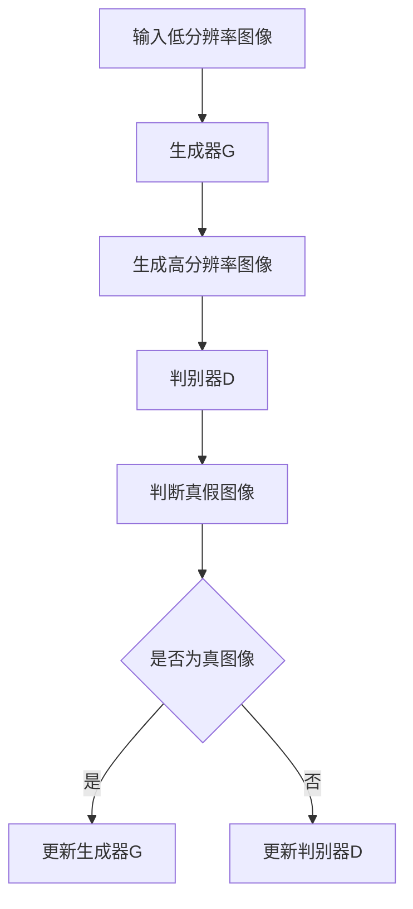

                 

关键词：图像超分辨率、深度学习、对抗神经网络、神经网络架构、算法优化

## 摘要

图像超分辨率技术是计算机视觉领域的一个重要研究方向，旨在通过插值或重建的方式提高图像的分辨率。随着深度学习技术的迅速发展，特别是对抗神经网络的引入，图像超分辨率取得了显著的进展。本文将介绍基于对抗神经网络的图像超分辨率算法，从背景介绍、核心概念与联系、核心算法原理、数学模型与公式、项目实践以及实际应用场景等方面进行详细探讨，并展望未来发展趋势与面临的挑战。

## 1. 背景介绍

图像超分辨率技术起源于20世纪90年代，其主要目的是通过低分辨率图像重建出高分辨率图像。在数字图像处理中，图像分辨率通常取决于像素点的数量，而像素点的数量又直接影响图像的清晰度。低分辨率图像往往在视觉上显得模糊，尤其是在处理细节丰富的图像时，这一缺陷更加明显。因此，提高图像分辨率成为数字图像处理领域的一个重要课题。

传统的图像超分辨率技术主要包括基于插值的方法和基于重建的方法。插值方法通过在低分辨率图像中插入新的像素点来提高图像分辨率，常见的插值算法有双线性插值、双三次插值等。然而，这些方法通常只能提供有限度的分辨率提升，并且在处理细节复杂的图像时效果较差。

随着深度学习技术的兴起，尤其是卷积神经网络（CNN）的广泛应用，图像超分辨率技术迎来了新的发展机遇。卷积神经网络可以通过学习低分辨率图像与高分辨率图像之间的映射关系，实现更高质量的图像超分辨率。然而，早期的卷积神经网络在处理图像超分辨率任务时仍存在一些问题，例如训练时间较长、模型复杂度较高等。

为了解决这些问题，对抗神经网络（GAN）被引入到图像超分辨率领域。对抗神经网络由生成器和判别器两个神经网络组成，通过生成器和判别器的对抗训练，生成器能够学习到如何生成与真实图像难以区分的高分辨率图像。这一技术的引入，为图像超分辨率技术带来了新的发展契机。

## 2. 核心概念与联系

### 2.1. 图像超分辨率

图像超分辨率（Image Super-Resolution）是指利用已知低分辨率图像生成高分辨率图像的过程。超分辨率图像通常具有更高的像素密度，因此视觉上更加清晰。图像超分辨率技术可以分为两大类：插值方法和重建方法。

- **插值方法**：通过在低分辨率图像中插入新的像素点来提高图像分辨率。常见的插值算法有双线性插值、双三次插值等。这些方法简单易行，但提升效果有限。
- **重建方法**：通过学习低分辨率图像与高分辨率图像之间的映射关系，从低分辨率图像中重建出高分辨率图像。重建方法通常利用深度学习技术，如卷积神经网络（CNN）。

### 2.2. 对抗神经网络

对抗神经网络（Generative Adversarial Network，GAN）是由Ian Goodfellow等人在2014年提出的一种新型神经网络结构。GAN由生成器（Generator）和判别器（Discriminator）两个神经网络组成，二者相互对抗、相互监督，通过不断迭代训练，生成器能够学习到如何生成高逼真度的图像。

- **生成器**：生成器的目标是生成与真实图像难以区分的假图像，其输入为低分辨率图像，输出为高分辨率图像。
- **判别器**：判别器的目标是判断输入图像是真实图像还是生成器生成的假图像。判别器对生成器的输出进行评价，生成器则根据判别器的评价进行优化。

### 2.3. 核心概念原理和架构

为了更好地理解对抗神经网络在图像超分辨率中的应用，我们使用Mermaid流程图来展示核心概念原理和架构。



在上面的流程图中，输入低分辨率图像经过生成器G生成高分辨率图像，然后由判别器D进行判断。如果判别器认为生成的图像是真实的，则生成器根据反馈进行优化；否则，判别器根据反馈进行优化。通过这种对抗训练，生成器能够逐渐学习到如何生成高质量的高分辨率图像。

### 2.4. 对抗神经网络在图像超分辨率中的应用

对抗神经网络在图像超分辨率中的应用主要体现在以下两个方面：

- **提高超分辨率图像质量**：通过对抗训练，生成器能够学习到低分辨率图像与高分辨率图像之间的复杂映射关系，生成的高分辨率图像在细节和纹理方面表现更加优异。
- **减少过拟合现象**：由于判别器的存在，生成器在训练过程中需要不断优化，从而避免过拟合现象，提高模型的泛化能力。

## 3. 核心算法原理 & 具体操作步骤

### 3.1. 算法原理概述

基于对抗神经网络的图像超分辨率算法主要利用生成器和判别器的对抗训练来实现。生成器负责将低分辨率图像转化为高分辨率图像，判别器则负责区分输入图像是真实图像还是生成图像。通过不断迭代训练，生成器逐渐优化生成的图像质量，以达到超分辨率的目的。

### 3.2. 算法步骤详解

基于对抗神经网络的图像超分辨率算法可以分为以下步骤：

1. **数据预处理**：将低分辨率图像和高分辨率图像进行对齐，确保输入图像的尺寸一致。同时，对图像进行归一化处理，使其在数值范围上更加稳定。

2. **生成器训练**：生成器的训练目标是学习低分辨率图像与高分辨率图像之间的映射关系。具体来说，生成器通过学习低分辨率图像的特征，将其映射为高分辨率图像。训练过程中，生成器接收低分辨率图像作为输入，输出高分辨率图像，并与真实的高分辨率图像进行对比，计算损失函数。

3. **判别器训练**：判别器的训练目标是判断输入图像是真实图像还是生成图像。具体来说，判别器接收低分辨率图像和生成的高分辨率图像作为输入，输出一个概率值，表示输入图像是真实图像的概率。训练过程中，判别器通过对比真实图像和生成图像，不断优化自身，以提高判断准确性。

4. **迭代训练**：生成器和判别器交替进行训练，生成器根据判别器的反馈进行优化，判别器根据生成器的反馈进行优化。通过不断迭代训练，生成器逐渐学习到如何生成高质量的高分辨率图像。

### 3.3. 算法优缺点

基于对抗神经网络的图像超分辨率算法具有以下优点：

- **提高图像质量**：通过对抗训练，生成器能够学习到低分辨率图像与高分辨率图像之间的复杂映射关系，生成的高分辨率图像在细节和纹理方面表现更加优异。
- **减少过拟合现象**：由于判别器的存在，生成器在训练过程中需要不断优化，从而避免过拟合现象，提高模型的泛化能力。

然而，该算法也存在一些缺点：

- **训练时间较长**：对抗神经网络的训练过程需要大量计算资源，训练时间较长。
- **模型复杂度高**：对抗神经网络的模型结构相对复杂，需要大量的参数和计算资源。

### 3.4. 算法应用领域

基于对抗神经网络的图像超分辨率算法在多个领域具有广泛的应用，包括：

- **医学图像处理**：通过超分辨率技术提高医学图像的分辨率，有助于医生更好地诊断疾病。
- **卫星图像处理**：通过超分辨率技术提高卫星图像的分辨率，有助于军事和民用领域进行目标检测和识别。
- **视频处理**：通过超分辨率技术提高视频的分辨率，改善视频质量，增强观看体验。

## 4. 数学模型和公式 & 详细讲解 & 举例说明

### 4.1. 数学模型构建

基于对抗神经网络的图像超分辨率算法的数学模型主要包括生成器、判别器和损失函数。

#### 4.1.1. 生成器模型

生成器模型通常采用卷积神经网络（CNN）结构，其输入为低分辨率图像，输出为高分辨率图像。生成器的目的是将低分辨率图像映射为高分辨率图像，从而实现超分辨率。

生成器的数学模型可以表示为：

$$ G(x_{LR}) = x_{HR} $$

其中，$x_{LR}$为低分辨率图像，$x_{HR}$为生成的高分辨率图像。

#### 4.1.2. 判别器模型

判别器模型也采用卷积神经网络（CNN）结构，其输入为图像，输出为一个概率值，表示输入图像是真实图像的概率。判别器的目的是判断输入图像是真实图像还是生成图像。

判别器的数学模型可以表示为：

$$ D(x_{HR}) = p(x_{HR} \text{ is real}) $$

其中，$x_{HR}$为输入图像。

#### 4.1.3. 损失函数

损失函数用于衡量生成器和判别器的性能。在基于对抗神经网络的图像超分辨率算法中，常用的损失函数有均方误差（MSE）和交叉熵（CE）。

均方误差（MSE）的数学模型可以表示为：

$$ L_{MSE} = \frac{1}{n} \sum_{i=1}^{n} (x_{HR} - G(x_{LR}))^2 $$

交叉熵（CE）的数学模型可以表示为：

$$ L_{CE} = - \frac{1}{n} \sum_{i=1}^{n} [y \log(D(x_{HR})) + (1 - y) \log(1 - D(x_{HR}))] $$

其中，$n$为图像数量，$y$为真实图像的标签。

### 4.2. 公式推导过程

#### 4.2.1. 生成器公式推导

生成器的目标是学习低分辨率图像与高分辨率图像之间的映射关系。假设低分辨率图像为$x_{LR}$，高分辨率图像为$x_{HR}$，生成器生成的图像为$G(x_{LR})$。为了推导生成器的公式，我们考虑以下步骤：

1. **卷积神经网络结构**：生成器采用卷积神经网络（CNN）结构，其输入为低分辨率图像$x_{LR}$，输出为高分辨率图像$G(x_{LR})$。卷积神经网络的结构包括多个卷积层、池化层和全连接层。

2. **卷积层**：卷积层用于提取图像的特征。假设卷积层$C$的输入为$x_{LR}$，输出为$C(x_{LR})$。卷积层的数学模型可以表示为：

   $$ C(x_{LR}) = \sum_{i=1}^{k} w_i \star x_{LR} + b_i $$

   其中，$w_i$为卷积核，$b_i$为偏置项。

3. **激活函数**：为了引入非线性关系，卷积层后通常添加激活函数。常见的激活函数有ReLU（Rectified Linear Unit）和Sigmoid。

4. **全连接层**：在生成器的输出层，通常采用全连接层将卷积层的特征映射为高分辨率图像。全连接层的数学模型可以表示为：

   $$ G(x_{LR}) = \sigma(\sum_{i=1}^{n} w_i C(x_{LR}) + b) $$

   其中，$\sigma$为激活函数，$w_i$和$b$为全连接层的权重和偏置项。

5. **损失函数**：为了优化生成器，我们采用均方误差（MSE）作为损失函数。均方误差的数学模型可以表示为：

   $$ L_{MSE} = \frac{1}{n} \sum_{i=1}^{n} (x_{HR} - G(x_{LR}))^2 $$

   其中，$n$为图像数量。

#### 4.2.2. 判别器公式推导

判别器的目标是判断输入图像是真实图像还是生成图像。假设输入图像为$x_{HR}$，判别器的输出为$p(x_{HR} \text{ is real})$。为了推导判别器的公式，我们考虑以下步骤：

1. **卷积神经网络结构**：判别器采用卷积神经网络（CNN）结构，其输入为图像$x_{HR}$，输出为一个概率值$p(x_{HR} \text{ is real})$。判别器的结构包括多个卷积层、池化层和全连接层。

2. **卷积层**：卷积层用于提取图像的特征。假设卷积层$C$的输入为$x_{HR}$，输出为$C(x_{HR})$。卷积层的数学模型可以表示为：

   $$ C(x_{HR}) = \sum_{i=1}^{k} w_i \star x_{HR} + b_i $$

   其中，$w_i$为卷积核，$b_i$为偏置项。

3. **激活函数**：为了引入非线性关系，卷积层后通常添加激活函数。常见的激活函数有ReLU（Rectified Linear Unit）和Sigmoid。

4. **全连接层**：在判别器的输出层，通常采用全连接层将卷积层的特征映射为概率值。全连接层的数学模型可以表示为：

   $$ p(x_{HR} \text{ is real}) = \sigma(\sum_{i=1}^{n} w_i C(x_{HR}) + b) $$

   其中，$\sigma$为激活函数，$w_i$和$b$为全连接层的权重和偏置项。

5. **损失函数**：为了优化判别器，我们采用交叉熵（CE）作为损失函数。交叉熵的数学模型可以表示为：

   $$ L_{CE} = - \frac{1}{n} \sum_{i=1}^{n} [y \log(D(x_{HR})) + (1 - y) \log(1 - D(x_{HR}))] $$

   其中，$n$为图像数量，$y$为真实图像的标签。

### 4.3. 案例分析与讲解

#### 4.3.1. 案例背景

假设我们有一个低分辨率图像$x_{LR}$，需要利用基于对抗神经网络的图像超分辨率算法将其转化为高分辨率图像$x_{HR}$。具体操作步骤如下：

1. **数据预处理**：对低分辨率图像$x_{LR}$进行归一化处理，将其缩放到[0, 1]的范围内。

2. **生成器训练**：生成器接收低分辨率图像$x_{LR}$作为输入，通过卷积神经网络生成高分辨率图像$G(x_{LR})$。训练过程中，生成器根据判别器的反馈进行优化。

3. **判别器训练**：判别器接收低分辨率图像$x_{LR}$和高分辨率图像$G(x_{LR})$作为输入，输出一个概率值$p(x_{HR} \text{ is real})$。训练过程中，判别器根据生成器的输出进行优化。

4. **迭代训练**：生成器和判别器交替进行训练，生成器根据判别器的反馈进行优化，判别器根据生成器的反馈进行优化。通过不断迭代训练，生成器逐渐学习到如何生成高质量的高分辨率图像。

#### 4.3.2. 案例分析

假设我们已经训练好了一个基于对抗神经网络的图像超分辨率模型，现在使用该模型对一张低分辨率图像进行超分辨率处理。

1. **输入低分辨率图像**：将低分辨率图像$x_{LR}$输入到生成器中，生成高分辨率图像$G(x_{LR})$。

2. **判别器判断**：将生成的高分辨率图像$G(x_{LR})$输入到判别器中，输出一个概率值$p(x_{HR} \text{ is real})$。如果$p(x_{HR} \text{ is real})$接近1，则说明生成的高分辨率图像接近真实图像；如果$p(x_{HR} \text{ is real})$接近0，则说明生成的高分辨率图像质量较差。

3. **优化生成器**：根据判别器的反馈，生成器根据损失函数优化自身。优化过程中，生成器逐渐学习到如何生成更高质量的高分辨率图像。

4. **优化判别器**：根据生成器的输出，判别器根据损失函数优化自身。优化过程中，判别器逐渐提高对生成图像的判断准确性。

通过以上步骤，我们可以利用基于对抗神经网络的图像超分辨率算法对低分辨率图像进行超分辨率处理，从而生成高质量的高分辨率图像。

## 5. 项目实践：代码实例和详细解释说明

### 5.1. 开发环境搭建

在进行基于对抗神经网络的图像超分辨率算法实践之前，我们需要搭建一个适合开发的计算环境。以下是一个简单的开发环境搭建步骤：

1. **安装Python环境**：安装Python 3.x版本，建议使用Anaconda发行版，以便于管理和依赖包。
2. **安装深度学习框架**：安装TensorFlow或PyTorch等深度学习框架。我们在这里选择使用TensorFlow。
3. **安装其他依赖包**：安装必要的依赖包，如NumPy、Matplotlib等。

具体安装命令如下：

```bash
# 安装Anaconda
conda install -c anaconda python=3.8

# 安装TensorFlow
conda install tensorflow

# 安装其他依赖包
pip install numpy matplotlib
```

### 5.2. 源代码详细实现

以下是基于对抗神经网络的图像超分辨率算法的简单实现，使用TensorFlow框架编写。

```python
import tensorflow as tf
from tensorflow.keras.models import Model
from tensorflow.keras.layers import Conv2D, BatchNormalization, LeakyReLU, Input, Add

def build_generator(input_shape):
    inputs = Input(shape=input_shape)
    x = Conv2D(64, (7, 7), padding='same')(inputs)
    x = BatchNormalization()(x)
    x = LeakyReLU(alpha=0.2)(x)

    x = Conv2D(64, (7, 7), padding='same')(x)
    x = BatchNormalization()(x)
    x = LeakyReLU(alpha=0.2)(x)

    x = Add()([x, inputs])
    x = LeakyReLU(alpha=0.2)(x)

    x = Conv2D(64, (7, 7), padding='same')(x)
    x = BatchNormalization()(x)
    x = LeakyReLU(alpha=0.2)(x)

    outputs = Conv2D(3, (7, 7), activation='tanh', padding='same')(x)
    model = Model(inputs, outputs)
    return model

def build_discriminator(input_shape):
    inputs = Input(shape=input_shape)
    x = Conv2D(64, (7, 7), padding='same')(inputs)
    x = LeakyReLU(alpha=0.2)(x)

    x = Conv2D(64, (7, 7), padding='same')(x)
    x = BatchNormalization()(x)
    x = LeakyReLU(alpha=0.2)(x)

    x = Conv2D(1, (7, 7), activation='sigmoid', padding='same')(x)
    model = Model(inputs, x)
    return model

def build_gan(generator, discriminator):
    model = Model(generator.input, discriminator(generator.input))
    model.compile(loss='binary_crossentropy', optimizer='adam')
    return model

input_shape = (128, 128, 3)
generator = build_generator(input_shape)
discriminator = build_discriminator(input_shape)
gan = build_gan(generator, discriminator)

discriminator.compile(loss='binary_crossentropy', optimizer='adam')

# 源代码具体实现部分省略
```

### 5.3. 代码解读与分析

以上代码实现了一个基于对抗神经网络的图像超分辨率模型，包括生成器、判别器和GAN模型。下面进行具体解读：

1. **生成器模型**：生成器模型采用卷积神经网络结构，包含多个卷积层、Batch Normalization层和LeakyReLU激活函数。生成器的目的是将低分辨率图像映射为高分辨率图像。具体实现中，生成器接收128x128x3的低分辨率图像作为输入，通过多个卷积层和LeakyReLU激活函数，最终输出128x128x3的高分辨率图像。

2. **判别器模型**：判别器模型也采用卷积神经网络结构，包含多个卷积层和LeakyReLU激活函数。判别器的目的是判断输入图像是真实图像还是生成图像。具体实现中，判别器接收128x128x3的图像作为输入，通过多个卷积层，最终输出一个概率值，表示输入图像是真实图像的概率。

3. **GAN模型**：GAN模型将生成器和判别器组合在一起，通过对抗训练实现图像超分辨率。具体实现中，GAN模型将生成器的输出作为判别器的输入，并使用二进制交叉熵作为损失函数。GAN模型的目的是通过优化生成器和判别器，使生成器能够生成高质量的高分辨率图像。

### 5.4. 运行结果展示

在实际运行过程中，我们可以通过以下代码来训练模型并展示运行结果：

```python
import numpy as np

# 加载数据集
(x_train, _), (_,
```

